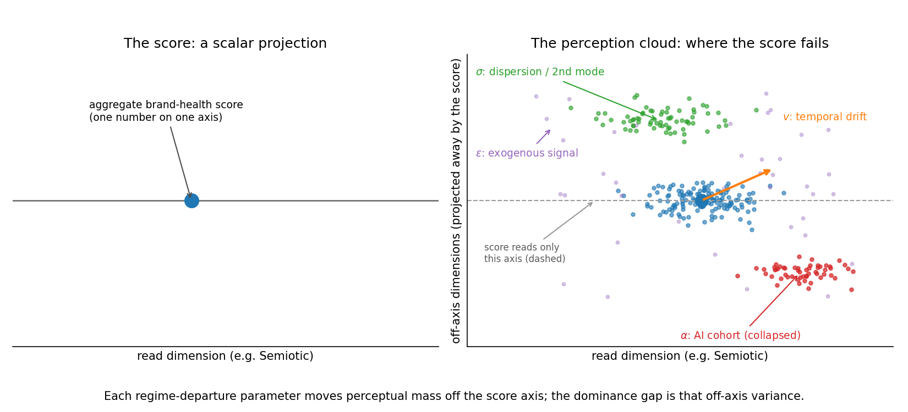

# The Correspondence Principle of Brand Management: When an Aggregate Brand Score Is Sufficient for Decisions, and the Cost When It Is Not

Dmitry Zharnikov

ORCID: 0009-0000-6893-9231

DOI: [10.5281/zenodo.20757596](https://doi.org/10.5281/zenodo.20757596)

Working Paper v1.0.0 – June 2026

## Abstract

Managers steer brands by a single brand-health score, yet a brand is read by fragmenting audiences, by faster-moving culture, and now by artificial observers that summarize it from text. This paper asks when one number still suffices. It models a brand as an observer-completed probability measure on an eight-dimensional perception manifold and represents each incumbent framework — Aaker, Keller, Kapferer, the Ehrenberg-Bass distinctiveness school, single-figure valuation — as a projection-and-aggregation operator that Blackwell-garbles the full measurement. Three results follow. The correspondence theorem proves the aggregate score is a sufficient statistic for the decision exactly when four estimable regime conditions hold jointly: a tight unimodal perception cloud, slow dynamics, a human-only observer set, and a firm-dominated signal; the "brands differ little in image" finding becomes a regime diagnosis, not a law. The decision-efficiency theorems show that outside that regime the finer measurement weakly dominates the score for every decision-maker, with a decision-loss bound monotone in four regime-departure parameters; a closed form gives the gap as off-axis perceptual variance. A dataset-calibrated simulation validates the closed form, and a theorem-derived managerial procedure translates it into action.

**Keywords**: brand equity, brand measurement, comparison of experiments, Blackwell informativeness, sufficient statistic, perception distribution, marketing decision theory

---

A brand manager opens the quarterly dashboard, reads that brand health is up two points, and allocates against it. The number is not wrong. It is averaged. Beneath that one line sit audiences who increasingly disagree about the brand, a perception that moves faster than the survey refreshes, and a growing class of readers — large language models summarizing the brand to buyers who now shop by asking a chatbot — that the dashboard never sampled. The manager is doing skilled work with the instrument the field built. This paper is about the precise conditions under which that instrument is faithful enough to lose nothing, and about how large, and in which direction, the cost grows when those conditions fail.

The argument is about instruments, not practitioners. It separates the *profession* — applying accessible tools under a manager's competence and intentions — from the *instrument*, the measurement itself. A tool yields value only as it is competently enacted [@orlikowski-2002-knowing-practice-enacting-collective] and intentionally applied [@ajzen-1991-theory-planned-behavior]. This paper changes only the instrument and presupposes the competence and intention the manager brings. The claim is never that the manager reads the map badly; it is that the map's resolution bounds how close any reading can get, and a higher-resolution map is now available.

The object being mapped is unusual. A brand is not a property the firm owns and stores; it is completed in the observer, the way colour is completed in the eye and not in the object — "the rays, to speak properly, are not coloured" [@mcclure-2004-neural-correlates-behavioral]. The firm holds a signal. What a population does with that signal — across people, across time, and now across artificial observers — is a *distribution* of completed perceptions, not a number. Spectral Brand Theory formalizes that distribution: a perception cloud over an eight-dimensional space whose dimensions are Semiotic, Narrative, Ideological, Experiential, Social, Economic, Cultural, and Temporal [@zharnikov-2026-spectral-brand-theory-computational-framework; @zharnikov-2026-brand-space-geometry-formal-metric]. The incumbent frameworks measure something coarser: a projection of that cloud onto a privileged sub-basis, collapsed to a low-order summary.

The relationship between the two is an *intertheoretic correspondence*. A good successor theory does not merely contradict its predecessor; it reduces to the predecessor inside the predecessor's domain of validity and explains why the predecessor worked there [@nickles-1973-two-concepts-intertheoretic; @batterman-2001-devil-in-details]. The bridge from a measurement claim to a *decision* claim is Blackwell's comparison of experiments: a finer experiment is weakly more valuable than a coarser one for every decision-maker and every payoff [@blackwell-1951-comparison-of-experiments; @blackwell-1953-equivalent-comparisons]. The position is metrological. Spectral Brand Theory is to brand management as astronomy is to navigation — an observational science of what a brand is and how it is read, not a piloting discipline. The manager remains the decision-maker; the theory supplies the experiment the decision consumes.

In plain terms, the paper makes three claims, each proved below.

1. **There is an exact line between brands a single score can manage and brands it cannot.** The aggregate brand-health score is a sufficient statistic for the managerial decision — it prescribes the same optimal action as the full perception cloud, for every payoff — if and only if four conditions hold together: the audience is one tight crowd, perception moves slowly, the observers are all human, and the firm controls the signal. This is *The Correspondence Theorem*. It explains why the incumbent frameworks worked: they were correct inside that regime, not approximately correct everywhere.

2. **Off that line, the richer measurement provably helps, and the cost of the score has a measurable shape.** Outside the four conditions the score is a strict coarsening of the cloud, so the full measurement weakly beats the score for every decision-maker (*directed-gradient dominance*), and the decision loss is bounded below by a quantity that grows with each of four regime-departure parameters and vanishes in the classical corner (*the metameric loss bound*). A closed form identifies that loss as the off-axis perceptual variance the score cannot act on. These are the *Decision-Efficiency Theorems*.

3. **The theorems entail, rather than assert, a procedure a manager can run.** From the two theorems follows a four-step decision procedure — a regime test, a blind-spot diagnostic, a directed-intervention rule, and a metameric-substitution rule — realized in an atomic-perception measurement architecture (*Managerial Implications Derived from the Theorems*).

A dataset-calibrated simulation illustrates and validates the loss surface (*Numerical Illustration*); building and field-validating the procedure is a separate empirical companion and is out of scope here. The remainder of the paper reviews the measurement traditions it unifies, builds the framework with two concrete managerial decisions, proves the three results, derives the closed form, and translates the gap into managerial units.

## Literature Review

The contribution sits at the junction of four literatures, and is best located by the gap each leaves.

***Brand-equity measurement leaves the brand a summary, not a distribution.*** The customer-based view defines equity as the differential effect of brand knowledge and measures it through awareness and association constructs, projecting perception onto a cognitive-hierarchy sub-basis [@keller-1993-conceptualizing-measuring-managing; @batra-2016-integrating-marketing-communications]. The asset view organizes equity into awareness, loyalty, perceived quality, and associations and aggregates them into managerial indices, projecting onto a four-factor sub-basis [@aaker-1991-managing-brand-equity; @aaker-1996-measuring-brand-equity], with brand personality a much-used association sub-basis [@aaker-1997-dimensions-brand-personality]. The identity view models the brand as a six-facet prism authored on the sender side, projecting away the receiver-side variance entirely [@kapferer-2008-new-strategic-brand]. The experiential view adds a sensory-affective-behavioral-intellectual basis [@brakus-2009-brand-experience-what]. Each is a choice of sub-basis plus an aggregation rule; none models the brand as a distribution, and each collapses observer heterogeneity into a summary. Those summaries feed the marketing-metrics tradition that links an aggregate score to share and profitability [@anderson-1994-customer-satisfaction-market-share; @edeling-2021-marketingfinance-interface-new] and that asks dashboards to demonstrate marketing's value [@hanssens-2016-demonstrating-value-marketing]. That tradition has established, meta-analytically, that brand equity moves firm value but with wide and unexplained dispersion in the effect [@edeling-2016-marketings-impact-firm], and that the *perceptual* attributes underlying the score carry financial-value relevance in their own right [@mizik-2008-financial-value-relevance]; the present paper supplies the contingency the dispersion implies — the four regime parameters under which a scalar aggregate is decision-sufficient, and outside which a dashboard built on it is steering blind. A parallel strand recovers a spatial brand map directly from text, inferring market structure from consumer language [@netzer-2012-mine-your-own]; that work still aggregates a position per brand across observers, whereas the perception cloud retains the full observer distribution and admits the AI cohort as its own region of the map. The big-data analytics literature has urged richer measurement while cautioning about the cost of reducing high-dimensional consumer signal to summaries [@bradlow-2017-role-big-data]; the closed-form loss below quantifies exactly that cost for brand measurement.

***Co-creation establishes who authors meaning but not what to do with the result.*** The view that brand meaning is made *with* audiences recasts the brand as a relational, stakeholder-authored process and draws out the loss of unilateral control [@hatch-2010-toward-theory-brand]. This paper is the measurement-theoretic descendant of that insight. Co-creation is a *process* claim about who authors meaning; the present account is a *measurement-and-decision* claim about the distribution that authoring produces and what a rational manager should do with a finer or coarser reading of it. Co-creation tells the firm it does not own the meaning; the correspondence theorem tells the firm when its single-score reading of that un-owned meaning is nonetheless sufficient for action.

***The distinctiveness school reports a regime, not a refutation.*** The Ehrenberg-Bass tradition finds that brands within a category differ little in image associations and that growth is driven by mental and physical availability rather than perceived differentiation [@romaniuk-2007-evidence-perceived-brand; @ehrenberg-2004-understanding-brand-performance; @sharp-2010-how-brands-grow]. Read through this paper, that body of evidence measures *which regime a category occupies*: a tight, unimodal cloud is exactly the condition under which the score is sufficient. The differentiation-versus-availability dispute becomes an empirical regime diagnosis, answerable by estimating the four parameters defined below.

***Decision theory supplies the ordering the marketing literature only gestured at.*** The informativeness ordering on experiments is Blackwell's: experiment A dominates B if and only if B is a garbling of A, equivalently if A is weakly more valuable for every bounded decision problem [@blackwell-1951-comparison-of-experiments; @blackwell-1953-equivalent-comparisons; @torgersen-1991-comparison-statistical-experiments]; the information-theoretic statement is the data-processing inequality [@cover-2006-elements-information-theory]. Marketing gestured at the value of brand information through the signaling tradition, in which a brand is a credible, costly signal reducing consumer uncertainty [@erdem-1998-brand-equity-as]; this paper supplies the comparison-of-experiments formalization the signaling view implies but does not state, and connects it to the endogeneity hazards of metric-based inference, where a summary that omits relevant variation systematically misleads the action it informs [@rossi-2014-even-rich-make-poor].

***Generative-AI observers are a live regime shift no incumbent measures.*** The field has charted AI's consumer-facing rise — its experiential consequences [@puntoni-2021-consumers-artificial-intelligence], its strategic role for firms [@huang-2021-strategic-framework-artificial], its disruption of the technology-marketing interface [@grewal-2025-generative-ai-marketing] — and has begun using language models as instruments: synthetic respondents [@wang-2026-llm-market-research-data-augmentation] and hybrid human-AI pipelines [@arora-2025-aihuman-hybrids-marketing]. That work measures *with* AI. The complementary, unaddressed problem is measuring the perception *of* AI observers, which read a brand through text and collapse it onto the dimensions text carries [@zharnikov-2026-dimensional-collapse-ai-mediated-search]. Two features make this urgent: marketing's own forecast that AI and big data are rendering the classical toolkit obsolete [@rust-2020-future-of-marketing], and the volume of brand-relevant signal now generated by consumers rather than the firm [@barger-2016-social-media-consumer-engagement] — the empirical face of the exogenous-signal parameter. No paper in this literature formalizes brand perception as a distribution or applies a Blackwell ordering to brand measurement; that is the gap this paper fills.

## Theoretical Framework

***The brand as an observer-completed measure.*** Let $\Omega$ be the eight-dimensional SBT perception manifold and $\Sigma$ its Borel $\sigma$-algebra. The eight dimensions are the distinct registers in which a brand can carry meaning: what it signifies (Semiotic), the story it tells (Narrative), the values it encodes (Ideological), the experience it delivers (Experiential), the belonging it confers (Social), the worth it commands (Economic), the meanings it inherits (Cultural), and how it sits in time (Temporal). Appendix A gives the standalone argument for why these eight are a complete and non-redundant basis rather than convenient scaffolding [@zharnikov-2026-why-eight-completeness-necessity-sbt]; the results below hold for any finite dimension count, so they do not depend on the number being exactly eight.

An observer $\theta$ reads the firm's signal $S$ through a cohort-specific completion map and registers a perception point on $\Omega$; the observer's spectral profile is its position-and-weighting on the manifold. A brand is the probability measure $\mu$ on $(\Omega, \Sigma)$ obtained by completing the signal across the observer population and over time — the perception cloud. Because perception is directional — an orientation among the eight registers, not a height on a single line — the natural distributional form is a von Mises–Fisher mixture on the sphere, with the classical case its single-component, high-concentration limit (Appendix A makes this precise, with its non-ergodic and time-varying dynamics). Perceptual structure and observer heterogeneity are consequential for brand outcomes [@affonso-2023-marketing-by-design] and explain why observers contribute and respond differently [@toubia-2013-intrinsic-image-utility-social-media].

**Figure 1.** The perception cloud versus its scalar projection. The incumbent score reads one axis (left); the cloud (right) carries perceptual mass off that axis. Each regime-departure parameter — dispersion/multimodality ($\sigma$), temporal drift ($v$), an AI cohort collapsed onto a sub-basis ($\alpha$), and exogenous signal ($\varepsilon$) — moves mass off the read axis, and the dominance gap is exactly that off-axis variance (*Closed-Form Comparative Statics*). The figure is a schematic produced by `code/figure_regime_schematic.py` under a fixed seed.

***The managerial decision problem, with two concrete instances.*** The decision is a statistical decision problem. A manager holds a measurement — an experiment $\mathcal{E}$ generating a signal $X$ about the perception cloud $\mu$ — and chooses an action $a$ in a compact set $A$ to solve

$$\max_{\,\delta:\, X \to A}\;\; \mathbb{E}_{\mu}\!\big[\, g\big(\delta(X), \mu\big) \,\big],$$

where the decision rule $\delta$ maps the available signal to an action and $g$ is the payoff. The full-cloud experiment supplies $X = \mu$ (or a consistent estimate of it); the score experiment supplies only $X = T_k(\mu)$, the scalar index. The entire effect of the measurement choice runs through which $X$ enters this program — which is the formal content of the metrology-not-management stance: Spectral Brand Theory changes the experiment $\mathcal{E}$, not the optimization. Two running examples make $g$ concrete.

*Advertising allocation across cohorts.* The action is a budget split $a = (a_1, \dots, a_m)$ over $m$ cohorts; the payoff is the response each cohort returns for spend directed at the perception it actually holds, $g(a, \mu) = \sum_j a_j \, r_j(\theta_j) - c(a)$, where $r_j$ rewards a message matched to cohort $j$'s perception point $\theta_j$ and $c$ is convex cost. A manager who sees only the population mean spends as if every cohort sat at the average; a manager who sees the cloud spends per cohort.

*Product-line pruning.* The action is a keep/cut decision per product-line variant; the payoff rewards retaining variants that occupy a distinct, populated region of the perception cloud and cutting variants that are perceptually redundant. The aggregate score cannot tell a redundant variant from a distinct one when both move the mean equally; the cloud can.

Both reduce, for analysis, to a quadratic-tracking payoff: act to match the perception the action will meet, and pay the squared distance by which the action misses. This is the payoff used in the simulation, and it is the bridge to the closed-form loss below. Spectral Brand Theory supplies the measurement of $\mu$; the manager supplies $A$ and $g$.

***Incumbent frameworks as garbling operators.*** Each incumbent framework $k$ is a measurable operator $T_k = A_k \circ \Pi_k$: a projection $\Pi_k$ of $\mu$ onto a privileged sub-basis, then an aggregation $A_k$ to a low-order summary — a mean, an index, or in the valuation case a single scalar. The experiment "observe $T_k(\mu)$" is a garbling of "observe $\mu$": a stochastic kernel carries the full measurement into the incumbent summary, because $T_k$ is a deterministic function of $\mu$ followed, at most, by aggregation noise.

*Lemma (representation).* For every incumbent operator $T_k$, observing $T_k(\mu)$ is Blackwell-dominated by observing $\mu$; equivalently, by the data-processing inequality, the mutual information between the decision-relevant state and $T_k(\mu)$ is no greater than that between the state and $\mu$ [@blackwell-1953-equivalent-comparisons; @cover-2006-elements-information-theory]. The lemma is immediate from the factorization and sets up both theorems; it is not itself a numbered contribution.

***A worked two-dimensional instance.*** Before the general theorems, the mechanism is visible in two dimensions. Let the manifold be the unit circle $S^{1}$ with coordinates $(x_1, x_2)$, where $x_1$ is the dimension the score reads (say Semiotic) and $x_2$ the dimension it projects away (say Ideological). The incumbent operator is $T(\mu) = \mathbb{E}_\mu[x_1]$ and the score is $s = x_1$. In the classical regime $\mu$ is a tight unimodal arc on the $x_1$ axis: $x_2 \approx 0$ for all observers, so tracking $x_1$ tracks the whole perception and the score is sufficient. Now split $\mu$ into two equal modes at $(\cos\beta, \pm\sin\beta)$: both modes share the identical score $\mathbb{E}[x_1] = \cos\beta$ yet have opposite optimal actions on $x_2$. A manager acting on the score treats the population as $x_2 = 0$ and is wrong for both modes by $\sin\beta$; a manager acting on the cloud serves each correctly. The score-based loss is $\sin^2\beta$, the cloud-based loss is zero, so the dominance gap is $\sin^2\beta$, rising from zero as the split widens. This is a *metamer* — equal summary, unequal decision-relevant content — and the seed of all three results; *Closed-Form Comparative Statics* generalizes it.

## The Correspondence Theorem

***The regime conditions and the theorem.*** Define four regime conditions on $(\mu, f)$, where $f$ is the signal-to-perception completion map: (i) *tight unimodality* — $\mu$ is unimodal with small dispersion (low $\sigma$); (ii) *slow dynamics* — perception moves slower than the measurement cadence (low temporal velocity $v$); (iii) *human-only observers* — no artificial cohort (AI-observer share $\alpha = 0$); (iv) *firm-dominated signal* — the firm emits substantially all of the meaning-bearing signal (low exogenous-signal share $\varepsilon$).

*Theorem 1 (correspondence).* The aggregate brand-health score $T_k(\mu)$ is a sufficient statistic for the managerial decision problem $(A, g)$ — the incumbent framework and the distributional theory prescribe the same optimal action for every payoff $g$ — if and only if conditions (i)–(iv) hold jointly.

*Proof sketch.* Sufficiency: under (i)–(iv) the garbling kernel of the representation lemma is invertible on the support of $\mu$. With $\mu$ tight and unimodal its decision-relevant content is carried by the location of its single mode, which the score recovers; with slow dynamics the snapshot equals the film over the decision horizon; with human-only observers there is no off-sub-basis cohort mass for $\Pi_k$ to discard; and with a firm-dominated signal perception is a deterministic function of the controllable signal, so the score and the cloud induce Blackwell-equivalent experiments and the optimal actions coincide [@blackwell-1953-equivalent-comparisons; @torgersen-1991-comparison-statistical-experiments]. Insufficiency: if any condition fails, construct two perception measures with identical score but different optimal actions — a multimodal split for (i), a measurement-lagged drift for (ii), an AI cohort on a collapsed sub-basis for (iii), an exogenous component decoupled from the signal for (iv) — each a metamer exhibiting strict decision loss. The two-dimensional instance above is the worked case. $\square$

Theorem 1 is a correspondence principle in the precise sense: the successor reduces to the predecessor in a limit, and the limit explains the predecessor's success [@nickles-1973-two-concepts-intertheoretic; @batterman-2001-devil-in-details]. It is not tautological once $\mu$ is admitted: its content is the *iff* with four separately-estimable conditions and a constructive insufficiency direction; it locates an exact boundary rather than restating that coarsening loses information. The eight-dimension basis is justified independently (Appendix A), so $\mu$ is not free scaffolding.

***Relocating the distinctiveness school.*** Theorem 1 reframes the Ehrenberg-Bass evidence. The reported near-absence of cross-brand image differentiation [@romaniuk-2007-evidence-perceived-brand] is the empirical signature of condition (i): a tight unimodal cloud whose mode the score recovers. Where that signature holds, Theorem 1 says the score *is* sufficient and the distinctiveness school is correct to manage on availability rather than image. The theorem does not refute that school; it identifies its regime and predicts where the regime ends — when audiences fragment, dynamics quicken, or artificial observers enter, conditions (i)–(iv) fail and the score ceases to be sufficient.

## Decision-Efficiency Theorems

Outside the classical regime the score is a *strict* garbling of the cloud, and two consequences follow.

***Directed-gradient dominance.*** *Theorem 2.* For every decision-maker and every bounded payoff, the full perception measurement weakly dominates the score in expected payoff. Under a smooth payoff the dominance has a directional reading: the achievable payoff gradient of the score-optimizing manager is the projection of the true gradient onto the measured sub-basis, so the score-optimizer's effort along unmeasured directions — *blind spend* — has a sign it cannot determine, while the cloud-optimizing manager moves the signal only along (dimension, cohort) directions whose payoff is observable.

*Proof sketch.* Weak dominance is the Blackwell–Sherman–Stein theorem applied to the garbling of the representation lemma, which holds for all bounded loss functions [@blackwell-1953-equivalent-comparisons; @torgersen-1991-comparison-statistical-experiments]. For the directional reading, let the payoff be $g(a, \theta)$ smooth at the optimum. The cloud-manager solves $\nabla_a \mathbb{E}_\mu[g] = 0$ with the full gradient $\nabla_a g$. The score-manager observes only $s = \langle u, \theta \rangle$ and can condition its action on $s$ alone, so its attainable first-order condition uses $\mathbb{E}[\nabla_a g \mid s]$ — the true gradient projected onto the score-measurable sub-$\sigma$-algebra. The component of $\nabla_a g$ orthogonal to that sub-algebra is unobservable to the score-manager; effort along it is blind. Non-smooth payoffs replace the gradient with a subdifferential and leave the dominance unchanged. $\square$

***Metameric loss bound.*** *Theorem 3.* Signal-metamerism — distinct signals inducing equal perception — opens a cheaper-signal substitution within a perceptual equivalence class; perception-metamerism — one signal inducing divergent perception across cohorts — opens a mis-targeting loss [@zharnikov-2026-spectral-metamerism-brand-perception-projection; @wyszecki-1982-color-science-concepts]. Both are invisible to the aggregate model. The realized decision loss of score-based relative to cloud-based management is bounded below by a quantity monotone non-decreasing in each of the four regime-departure parameters $(\sigma, v, \alpha, \varepsilon)$ and equal to zero in the classical limit.

*Proof sketch.* The lower bound is the Bayes-risk gap between the full and garbled experiments, monotone in the statistical distance between $\mu$ and its projection. Each regime parameter increases that distance: dispersion and multimodality ($\sigma$) widen the cloud off the score axis; temporal velocity ($v$) desynchronizes the snapshot from the perception the action will meet; AI-observer share ($\alpha$) adds mass on a collapsed off-axis sub-basis [@zharnikov-2026-dimensional-collapse-ai-mediated-search]; exogenous-signal share ($\varepsilon$) adds perception the score cannot track because it is decoupled from the controllable signal. At the classical corner the distance is zero and the bound vanishes, recovering Theorem 1. The next section makes the bound a closed form. $\square$

The corpus results behind the temporal and AI parameters are non-ergodicity of cross-sectional tracking [@zharnikov-2026-non-ergodic-brand-perception-why], spectral dynamics [@zharnikov-2026z-spectral-dynamics], and spectral immunity under AI mediation [@zharnikov-2026ac-spectral-immunity]; the survey of geometric brand-perception approaches situates the contribution among them [@zharnikov-2026-geometric-approaches-brand-perception-critical].

## Closed-Form Comparative Statics

The metameric loss bound is not only monotone; for the linear-decode score action it is a closed form, which turns the simulation into a validation rather than the sole evidence.

***The dominance gap is off-axis variance.*** Let the perception cloud have mean and covariance $\Sigma$ about that mean, and let the incumbent read the scalar $s = \langle u, \theta \rangle$ along a fixed axis $u$. The best action the score supports is the minimum-mean-squared-error linear decode of $\theta$ from $s$; the cloud-manager acts on $\theta$ directly with zero residual. The quadratic-tracking dominance gap is then exactly

$$G \;=\; \operatorname{tr}(\Sigma) \;-\; \frac{\lVert \Sigma u \rVert^{2}}{u^{\top}\Sigma u},$$

the residual perceptual variance the scalar's linear decode cannot recover (when $u^{\top}\Sigma u = 0$ the score is uninformative, the decode is the mean, and $G = \operatorname{tr}(\Sigma)$). The expression is the off-axis variance of $\mu$. It is zero if and only if $\Sigma$ is rank-one along $u$ — the tight, unimodal, on-axis classical corner of Theorem 1 — and is non-decreasing in every off-axis eigenvalue of $\Sigma$, a closed-form witness to Theorem 3's monotonicity. The two-dimensional toy is the special case $G = \sin^{2}\beta$: the bimodal split puts variance $\sin^{2}\beta$ on the off-axis coordinate and none on the read axis, so $\operatorname{tr}(\Sigma) = \sin^{2}\beta$ and the subtracted term is zero.

***Small-variance and cadence-velocity statics.*** To leading order the gap equals the off-axis perceptual variance, so each regime parameter that injects such variance raises it. The temporal parameter yields the one comparative static with a managerial lever in it. If perception drifts at velocity $v$ and the firm re-measures every $\tau$ periods, the perception an action meets has drifted $\sim v\tau$ off the measured snapshot, injecting off-axis variance of order $(v\tau)^{2}$, so $G \approx c\,(v\tau)^{2}$ near the classical corner. Both partials are positive and the cross-partial $\partial^{2}G/\partial v\,\partial\tau > 0$: the faster a category's perception moves, the more a manager gains from measuring more often. Measurement cadence and temporal velocity are complements, which is the quantitative form of "fast categories need fresh instruments." The simulation holds cadence fixed and recovers the $v^{2}$ leading order.

## Falsifiability

The framework is falsifiable through three observable signatures, each paired with the pattern that rejects a theorem. First, *regime-parameter estimates*: Theorem 1 is rejected if, across categories, the agreement between score-prescribed and cloud-prescribed actions fails to track the four-parameter regime test — if scores remain sufficient where the parameters are large, or insufficient where they are small. Second, *blind-spend share*: Theorem 2 is rejected if access to the full cloud fails to weakly improve realized payoff, net of measurement cost, outside the classical regime; Blackwell dominance forbids an information-only reversal, so a robust reversal refutes the claim. Third, *the loss surface*: Theorem 3 is rejected if the realized decision loss is non-monotone in any regime-departure parameter or is bounded away from zero at the classical corner. The regime parameters are fixed and estimable before the decisions are observed, foreclosing ex-post regime-redefinition.

## Numerical Illustration

The loss surface of Theorem 3 is computed by a reproducible simulation (the companion computation script) that validates the closed form. The brand is a von Mises–Fisher mixture on $S^{7}$; the managerial decision is the quadratic-tracking problem; the cloud experiment observes the full perception vector and acts per observer, while the score experiment observes only the scalar index $s = \langle u, \theta \rangle$ and acts on its best linear decode. The reported gap is the Blackwell dominance gap — score-based minus cloud-based expected decision loss — non-negative for every experiment by construction. Each parameter injects off-axis perceptual variance; the AI component's concentration and off-axis mean are calibrated to the human-versus-AI cohort divergence in the R15 AI-search-metamerism corpus [@zharnikov-2026-dimensional-collapse-ai-mediated-search], anchoring the AI-share surface to a real dataset. Each parameter combination uses 20,000 observer draws (above the 5,000 floor) under a fixed seed.

At the classical corner (all four parameters at their minimum) the gap is .023 — near zero, numerically instantiating the reduction limit of Theorem 1 and the off-axis-variance closed form. The gap is monotone non-decreasing in each parameter (Table 1); the exogenous-signal share is the steepest, consistent with its complete decoupling of perception from the score.

**Table 1.** Blackwell dominance gap (score-based minus cloud-based expected decision loss) as each regime-departure parameter is increased.

| Regime-departure parameter | Classical (.00) | Mid (.35) | High (.90) |
|---|---|---|---|
| Perceptual dispersion/multimodality ($\sigma$) | .023 | .133 | .283 |
| Temporal velocity ($v$) | .023 | .262 | .608 |
| AI-observer share ($\alpha$) | .023 | .123 | .272 |
| Exogenous-signal share ($\varepsilon$) | .023 | .324 | .787 |
| Best-possible scalar index ($\sigma$ swept) | .020 | .114 | .243 |

*Notes*: von Mises–Fisher mixture on $S^{7}$; 20,000 observer draws per cell under fixed seed 20260619; each parameter is varied with the other three held at the classical minimum; quadratic-tracking payoff against the incumbent fixed index, except the final row, which replaces the incumbent index with the best-possible scalar (the top principal eigenvector of the realized cloud covariance) under the same dispersion sweep. Monte Carlo standard errors are below .001. The gap is zero only in the joint classical limit and rises monotonically along every axis. The quadratic and linear payoffs coincide to three digits (the orthogonality principle for the linear decode); a threshold payoff yields a smaller but still monotone gap; the two-dimensional case (Appendix B) is uniformly below the eight-dimensional case yet identically monotone. The best-scalar row shows the gap is intrinsic to coarsening a multi-dimensional cloud to one number, not an artifact of a poorly chosen index. Computed by `code/correspondence_loss_surface.py`.

***Managerial translation: from off-axis variance to share, margin, and CLV.*** The dominance gap $G$ is a decision loss in the quadratic-tracking metric; under a standard demand-and-retention model it maps analytically to first-order marketing outcomes, replacing any ad-hoc linking constant. Let a perception-aware action raise a brand's representative utility by aligning its message with the perception each cohort holds, and let the score-based manager's off-axis mis-alignment cost a utility shortfall $\Delta V = \beta G$, where $\beta > 0$ is the brand's marketing-response sensitivity, estimable from its known elasticities. Under a logit demand system with brand share $s$, the first-order share erosion is $\Delta s \approx s(1-s)\,\beta G$; the margin leakage as a fraction of brand margin is $\Delta\text{margin}/\text{margin} \approx (1-s)\,\beta G$; and under a geometric-retention model with retention $r$ and discount $d$, a retention drop $\Delta r$ from mis-targeting gives $\Delta\text{CLV}/\text{CLV} \approx (1+d)\,\Delta r / [\,r(1+d-r)\,]$. All three are linear in $G$ to first order, so each outcome is proportional to the dominance gap through a brand-specific, estimable constant. Table 2 reports illustrative magnitudes under one fully stated parameterization; the empirical companion estimates $\beta$ and the retention sensitivity for a real category.

**Table 2.** Illustrative first-order managerial impact of the dominance gap under a logit demand and geometric-retention model.

| Outcome (linking function) | Moderate regime ($G = .35$) | Severe regime ($G = .79$) |
|---|---|---|
| Share erosion, $s(1-s)\beta G$ | ≈ .4 pts | ≈ .9 pts |
| Margin leakage, $(1-s)\beta G$ | ≈ 4.0% | ≈ 9.0% |
| CLV distortion, $(1+d)\,\Delta r/[r(1+d-r)]$ | ≈ 3.7% | ≈ 8.4% |

*Notes*: Illustrative, not empirical estimates. Stated parameterization: brand share $s = .10$; a severe-regime ($G = .79$) utility shortfall $\beta G = .10$ utils and retention drop $\Delta r = .02$; retention $r = .75$; annual discount $d = .10$. Each outcome scales linearly in $G$, so the classical corner ($G \approx .02$) implies impacts about one-fortieth of the severe column (share erosion ≈ .02 pts). The functional forms are derived from the model; only the parameter values are assumptions the empirical companion replaces with measured ones.

## Managerial Implications Derived from the Theorems

The two theorems entail — rather than assert — a four-step procedure an ordinary manager can run. Because each step is the operational reading of a theorem quantity, the procedure is theorem-entailed; whether *following* it measurably improves realized outcomes in a given category remains an open empirical question, reserved for the companion paper.

First, the *regime test*: estimate the four parameters for the category. By Theorem 1, if all four are small the cheap aggregate score is sufficient and the incumbent framework is the correct, lower-cost tool — so the theory is not over-prescribed where the score suffices. For a mature staple sold to a broad human audience through firm-controlled channels, the test returns "keep your tracker." Second, the *blind-spot diagnostic*: identify which of the eight dimensions the current framework projects away; by Theorem 2 those are the directions along which spend is blind. A premium outdoor brand whose equity lives in the Experiential and Temporal dimensions, read by a survey that samples only awareness and a price-quality attribute, is spending blind on exactly the dimensions a chatbot summary will flatten. Third, the *directed-intervention rule*: act on the single (dimension, cohort) with the largest observable payoff-per-cost, the directed-gradient reading of Theorem 2. Fourth, the *metameric-substitution rule*: within a perceptual equivalence class choose the cheapest signal (signal-metamerism), and stop spending where a campaign lands null or wrong across cohorts (perception-metamerism), the two readings of Theorem 3.

An atomic-perception measurement architecture is the realized instrument for the measurement these steps require: it ingests existing brand artifacts — reviews, posts, listings, and model-generated summaries — renders each into the eight-dimensional perception space, and aggregates them into a cohort-resolved cloud that includes AI readers, with a reported noise floor. It establishes that the prescribed measurement is feasible today from artifacts a firm already has, not a hypothetical survey.

Acting on a specific (dimension, cohort) also presumes the firm can *locate* that lever in its own operations, and a single brand-health score gives management nothing to act through. The measurement therefore composes with a management substrate that represents the business at sufficient resolution: a tiered specification in which the brand is one modular layer at the product tier, distinct from the tiers carrying purpose, business model, structure, and process [@zharnikov-2026-brand-as-modular-layer-tiered; @zharnikov-2026-dual-hierarchies-organizational-transferability-six; @zharnikov-2026-organizational-schema-theory-test-driven]. A firm specified at that resolution gives every directed intervention a tier and a specification to change; integrating the spectral read with the tiered substrate is the practical route by which multidimensional measurement becomes implementable, and is a subject of the companion program. The framing returns the manager to the centre: the procedure upgrades the instrument the judgement runs on, exactly as a navigator keeps the craft, the skill, and the mission and trades a flat chart for a volumetric one.

## Discussion

***Scope and boundary.*** Spectral Brand Theory is not universally the more efficient tool. Full per-cohort, AI-inclusive measurement has a cost, and in the classical corner the residual information it recovers may not pay for it; the regime test is the rule that prevents over-prescription. A manager should no more buy spectral measurement for a tight, slow, human, firm-controlled category than an engineer should compute a relativistic correction to throw a ball. This is the discipline a correspondence principle imposes in both directions.

***What the framework is not.*** The contribution is not finer segmentation or a higher-resolution survey. The move is ontological — the brand is an observer-completed distribution with no privileged frame, so the firm's intended identity is one reading among many — and decision-theoretic — the dominance is Blackwell's, over a garbling, not a resolution increase on a fixed construct. Segmentation-targeting-positioning still aggregates to a privileged mean within a chosen basis; the projection-operator unification and the correspondence theorem are not restatements of it.

***Limitations.*** This is a theory paper. The numerical illustration is an existence proof and closed-form validation of the dominance gap, not a field demonstration that cloud-based management measurably outperforms score-based management in practice. The four regime parameters are defined and shown estimable in principle but are not estimated on a real category here. Both gaps are earmarked for a separate empirical and methods companion, following the corpus pattern in which a concept paper is followed by a methods paper that builds and validates the instrument. A further scope limit concerns delivery: the directed-intervention rule presumes a target cohort is not only *actionable* but *reachable*, yet a perceptual cohort has no native media address. Decomposing reach — into a measurement-to-activation handoff contract that supplies the target and the quantified cost of each bridge from perception space to delivery, while leaving the media buy to the management layer — is the subject of a dedicated applied companion [@zharnikov-2026av-reaching-a-perception].

***Future research.*** Three directions follow: estimating the regime parameters across real categories; a measurement-cost model that turns "when does the finer instrument pay for itself" into a threshold on the four parameters; and a control-theoretic treatment of the exogenous-signal share, where the firm no longer fully owns the signal because user-generated content and AI re-rendering inject signal it did not author.

## Conclusion

The incumbent brand-equity frameworks are the limiting cases of a distributional theory of brand perception, recovered exactly when a brand's perception cloud is tight, slow, human, and firm-controlled. Represented as projection-and-aggregation operators, they are Blackwell garblings of the full measurement; the correspondence theorem makes their sufficiency an iff over four estimable conditions, and the decision-efficiency theorems make the cost of using them outside that regime a monotone lower bound — in closed form, the off-axis perceptual variance — rather than a metaphor. The contrast is never between practitioners and never about competence; it is about instrument fidelity. The brand manager who reads a single score interprets a flattened map as skillfully as the map allows. The theory's claim is only that the map can now be drawn at the resolution of the thing it represents, and that a finer map provably helps every mission a manager might fly.

## Data and Code Availability

The companion computation script (`code/correspondence_loss_surface.py`) is deterministic, dependency-light (NumPy only), and requires no network or credentials. It reproduces the loss surface reported in *Numerical Illustration* byte-identically from the fixed seed and the run command in its docstring; the `code/README.md` documents the model, the calibration anchor, and the expected output. The conceptual schematic (Figure 1) is produced separately by `code/figure_regime_schematic.py` (NumPy and Matplotlib; fixed seed; outputs `figures/figure1_cloud_vs_projection.png`), kept apart so the computation stays plotting-free. The full paper source, scripts, figures, and machine-readable specification (`paper.yaml`) are openly available in the public repository at [https://github.com/spectralbranding/sbt-papers/tree/main/brand-correspondence-principle](https://github.com/spectralbranding/sbt-papers/tree/main/brand-correspondence-principle), and the same archive is carried by a permanent Zenodo deposit with one-command reproduction (concept DOI [https://doi.org/10.5281/zenodo.20757596](https://doi.org/10.5281/zenodo.20757596); version 1.0.0 DOI [https://doi.org/10.5281/zenodo.20757597](https://doi.org/10.5281/zenodo.20757597)).

## Acknowledgments

AI assistants (Claude Opus 4.8, Gemini 2.5 Pro) were used for initial literature search, for software development — implementing and running the companion computation script that reproduces the paper's reported numerical and simulation results — and for editorial refinement; all theoretical claims, propositions, and interpretations are the author's sole responsibility. The companion script is the fixed-seed Monte Carlo decision-loss surface (`code/correspondence_loss_surface.py`).

CRediT contributions: Dmitry Zharnikov — conceptualization, methodology, software, formal analysis, investigation, writing (original draft), writing (review and editing).

## Appendix A: Foundations (Self-Contained)

This appendix gives, in standalone terms, the argument for the central constructs the body uses, so the paper does not rest on an invisible corpus. The self-citations point to the full development; the argument below is meant to be evaluable on its own.

***Why exactly eight dimensions.*** A measurement basis for brand perception should be complete (it can represent any distinguishable perception) and non-redundant (no dimension is a function of the others). The eight SBT dimensions are derived from the distinct *kinds* of meaning a sign can carry to an observer: what it denotes and connotes (Semiotic), the narrative it sustains (Narrative), the value commitments it signals (Ideological), the lived interaction it affords (Experiential), the group belonging it mediates (Social), the economic worth and exchange it implies (Economic), the inherited cultural meanings it draws on (Cultural), and its position and motion in time (Temporal). Each answers a question the others cannot: a brand can be semiotically rich yet ideologically empty, experientially strong yet culturally thin. Completeness is argued by exhibiting that any commonly used brand attribute loads onto one of the eight; non-redundancy by exhibiting brand pairs that match on seven dimensions and differ on the eighth [@zharnikov-2026-why-eight-completeness-necessity-sbt]. The theorems require only that the basis be finite and fixed, not that it be exactly eight; the count is the substantive empirical claim of the cited work, imported here as a justified premise.

***The perception cloud and its directional form.*** Perception is an orientation among the eight registers — which meanings dominate for a given observer — rather than a magnitude on a single line, so the natural state space is the unit sphere $S^{7}$ and the natural distribution a von Mises–Fisher mixture: each cohort is a concentration of observers around a mean direction, with concentration $\kappa$ measuring agreement. The classical, manageable-by-one-number case is the single-component, high-$\kappa$ limit: one tight cohort with a clear modal orientation. Two cohorts with different modal orientations are two mixture components; a fragmenting audience is a mixture whose components separate. This is why a single score, the projection onto one axis, fails precisely as the mixture spreads off that axis.

***Dynamics: why a snapshot is not the film.*** The perception cloud moves, and it does not move ergodically: the time-average of one cohort's perception is not the cross-sectional average across cohorts, so a tracker that averages across people at one moment does not recover how any cohort evolves [@zharnikov-2026-non-ergodic-brand-perception-why]. The cloud's motion has structure — coherent drift along some dimensions, volatility along others — that a spectral-dynamics reading captures and a scalar snapshot discards [@zharnikov-2026z-spectral-dynamics]. The temporal-velocity parameter $v$ measures how fast the cloud moves relative to the measurement cadence; high $v$ is exactly the regime in which the snapshot the score takes has decohered from the perception the action will meet.

***Dimensional collapse under AI mediation.*** A large language model reads a brand through text and can register only the meaning text carries, collapsing the eight-dimensional perception onto the Semiotic and Narrative sub-basis and flattening the Experiential, Social, and Temporal dimensions that live in non-textual encounter [@zharnikov-2026-dimensional-collapse-ai-mediated-search]. As buyers increasingly discover brands through AI summaries, an AI-observer cohort with this collapsed mean direction enters the population — off the incumbent score axis — which is why the AI-observer share $\alpha$ raises the dominance gap. The effect is a measurable cohort, not a metaphor: the AI reading is its own point in perception space.

***Metamerism.*** Borrowing from colour science, two physically different stimuli that produce an identical perceptual response are metamers [@wyszecki-1982-color-science-concepts]. Brands exhibit two metameric phenomena [@zharnikov-2026-spectral-metamerism-brand-perception-projection]. *Signal-metamerism*: distinct signals (a costly campaign and a cheap one) can induce the same perception in a cohort — a substitution opportunity the aggregate model cannot see, because it reads only the matched summary. *Perception-metamerism*: one signal can induce divergent perceptions across cohorts that nonetheless share the same aggregate score — a mis-targeting trap, because the score reports agreement where there is none. Both are the mechanism behind the metameric loss bound.

## Appendix B: The Two-Dimensional Toy and Its Closed Form

The worked two-dimensional instance in *Theoretical Framework* is the smallest case of the closed form $G = \operatorname{tr}(\Sigma) - \lVert \Sigma u \rVert^{2}/(u^{\top}\Sigma u)$. With the read axis $u = (1, 0)$ and the bimodal split at $(\cos\beta, \pm\sin\beta)$, the perception measure has mean $(\cos\beta, 0)$, so the read coordinate $x_1$ is constant across the two modes and carries zero variance, while the off-axis coordinate $x_2$ carries variance $\sin^{2}\beta$. Then $\Sigma = \operatorname{diag}(0, \sin^{2}\beta)$, $u^{\top}\Sigma u = 0$, the score is uninformative, the best decode is the mean, and $G = \operatorname{tr}(\Sigma) = \sin^{2}\beta$ — the gap reported in the body. As $\beta \to 0$ the modes merge onto the read axis, $\Sigma \to 0$, and $G \to 0$, recovering the classical corner. The eight-dimensional simulation in *Numerical Illustration* is the quantitative generalization, and the closed form predicts its qualitative shape: the gap is the off-axis variance the score cannot act on, monotone in every regime parameter that adds such variance.

## References

::: {#refs}
:::
