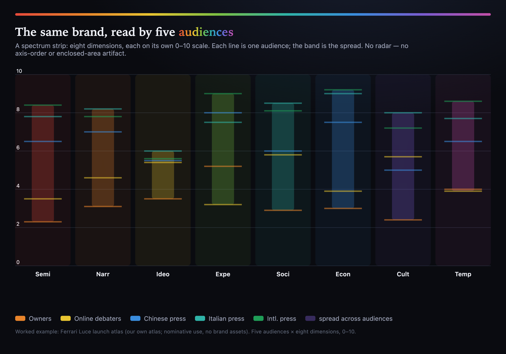

# The Brand Spectrometer: A Reproducible Instrument for Cohort-Resolved, Multi-Dimensional Brand-Perception Measurement from Public Artifacts

Dmitry Zharnikov

ORCID: 0009-0000-6893-9231

DOI: [10.5281/zenodo.20775963](https://doi.org/10.5281/zenodo.20775963)

Working Paper v1.0.0 – June 2026

## Abstract

This paper introduces metameric psychometrics, a validation framework for instruments that operate without a latent true score. In place of an oracle it substitutes instrument-computed noise floors — operator variance across cross-family model pairs and source sensitivity under signal-source resampling — so every cohort comparison becomes a falsifiable signal-to-noise test with a computed interval. The framework is realized in the Brand Spectrometer, an open pipeline that reconstructs cohort-resolved, eight-dimensional perception vectors from dated public artifacts by aggregating per-artifact reflections over signal sources; the unit of analysis is the cohort pair. Because cohort metameric variance is the measurement, not error around a true specification, the instrument is validated for measurement properties, never criterion accuracy. A pre-registered battery across two windows shows convergent validity, reproducibility, and four-of-five test-retest reliability. Discriminant resolution depends on the metric: a scale-invariant mean-cosine signal-to-noise abstains, whereas a distribution-level, operator-floored separation between whole cohort clouds resolves the owner cohort from the press in one window (signal-to-noise 3.6, permutation p = .003, triangulated) while abstaining elsewhere. The cohort signal lives in magnitude, not mean shape; the instrument resolves real separations and abstains where none clears. The framework may extend to perceptual constructs measured from public text without ground truth.

**Keywords:** brand perception, measurement instrument, metameric psychometrics, reproducibility, reliability, structural validity, large language models, noise floor

---

The measurement of brand perception has long relied on instruments whose internals are proprietary and whose reproducibility is asserted rather than demonstrated. Survey-based brand trackers report point estimates without a noise floor against which a reader could judge whether a difference between two groups is a real separation or an artifact of the instrument. This paper takes a different stance. The authors develop and validate a measurement instrument — the Brand Spectrometer — whose entire perceptual pipeline is open, deterministic, and reproducible from published code and data, and whose validation reports every comparison relative to a noise floor the instrument itself computes. The instrument reads public artifacts (press articles, forum posts, social posts, video reviews, official releases) and reconstructs, for each named observer cohort, an eight-dimensional perception vector on the canonical dimensions of the Spectral Brand Theory corpus. It does not claim to recover what a brand "really is."

The framing differs from classical brand-equity measurement in a way worth stating plainly. Customer-based brand-equity models treat brand strength as a latent construct to be estimated from consumer associations [@keller-1993-conceptualizing-measuring-managing], and brand-personality scales treat a brand's traits as a stable property to be recovered [@aaker-1991-managing-brand-equity; @aaker-1997-dimensions-brand-personality]. The same latent-construct stance persists in the contemporary integrated-communications literature, where building and then measuring a single consumer brand-knowledge structure remains the organizing objective [@batra-2016-integrating-marketing-communications]. The instrument here measures cohort-resolved perception — how distinct observer classes read a brand across eight dimensions in a dated window — not equity, not personality, and not a single property the brand "has." The corpus develops this distinction formally as a correspondence between brand-equity frameworks and the underlying perception cloud [@zharnikov-2026au-correspondence-principle-brand]. Perception is completed in the observer, in the sense that distinct cohorts can read the same observable signal into divergent dimensional profiles; this is the observer-completion view of perception that motivates a Bayesian-inference reading of seeing [@brainard-1997-bayesian-color-constancy]. The cosine-based metric below is motivated by an analogy to perceptual metamerism in vision science, where physically different stimuli produce an identical response in a given observer. The eight-dimension schema and this metamerism framing are drawn from the published, Zenodo-archived Spectral Brand Theory corpus [@zharnikov-2026-spectral-brand-theory-computational-framework; @zharnikov-2026-spectral-metamerism-brand-perception-projection] rather than from unpublished notes, and the instrument here is the apparatus that operationalizes them for measurement on the corpus's structured-measurement scaffold [@zharnikov-2026as-prism-structured-measurement].

This paper makes three contributions. First, it specifies a reproducible measurement instrument for cohort-resolved brand perception, with two distinct noise floors and a per-pair signal-to-noise gate, described in the section on the instrument. Second, it introduces and operationalizes *metameric psychometrics* — a validation framework that evaluates reliability, convergent validity, reproducibility, and discriminant resolution against the instrument's own floors, never against a presumed truth — described in the section on the validation framework. Third, it reports an honest, contrast-based result on a worked case in which cross-operator reliability, convergent validity, and reproducibility hold across two windows (test-retest reliability on four of five cohorts, the fifth an operator-attributable failure) while discriminant resolution proves metric-dependent — a scale-invariant mean-cosine signal-to-noise abstains while a distribution-level criterion resolves the owner cohort from the press within the same window — with the confirmatory mean-cosine abstention and the exploratory distributional resolution each reported as such, described in the results and discussion sections. The work is positioned as a methodological contribution; its implications for brand theory are confined to a short subsection.

## The Instrument

***The pipeline and the eight dimensions***

The Brand Spectrometer is a fixed five-stage pipeline: *acquire* (retrieve public artifacts with provenance), *render* (a large language model reads a cohort's artifact subset and the dimension schema and produces prose naming what that cohort can plausibly infer of the brand), *extract* (a different-family model reads only the rendered prose and emits structured per-dimension scores), *aggregate* (fold per-artifact extractions into a cohort vector and compute variance and noise floors), and *sensitivity* (re-run under alternate operators and leave-one-out artifact sets to estimate the two floors). Each cohort yields a vector on eight canonical dimensions in fixed order — Semiotic, Narrative, Ideological, Experiential, Social, Economic, Cultural, Temporal — each on a 0–10 scale, applying the eight-dimensional construct of the Spectral Brand Theory corpus. The complete assembled output for one brand and one dated sampling *window* — every cohort vector with its per-dimension intervals, the two noise floors, the per-pair distances and signal-to-noise values, and the artifact manifest — is an *atlas*; the worked example below comprises two atlases of a single case, a fresh post-announcement window and a pinned earlier window, the fresh-window atlas of which is shown as a spectrum strip in Figure 1.

**Figure 1.** The worked-example atlas as a spectrum strip. Each of the eight canonical dimensions is an independent lane on its own 0–10 scale; each line is one of the five cohorts of the fresh-window atlas and the translucent band is the spread across cohorts on that dimension. *Notes*: The display is per-dimension and axis-order invariant, carrying none of the enclosed-area artifact a radar polygon introduces; it shows cohort vectors and their spread, while pairwise resolution against the noise floor is reported in the *Results*. Rendered deterministically by the open `spectrum_strip.js` renderer from the published `ferrari_luce_fresh_2606` atlas, both in the public code repository [github.com/spectralbranding/brand-spectrometer](https://github.com/spectralbranding/brand-spectrometer).

A *cohort* is a distinguishable observer class with a distinct, publicly enumerable artifact-access pattern (for example, actual owners, Italian press, Mandarin-language enthusiasts). Cohorts are observer/perceptual groupings — defined by register, language, or commercial relationship — not demographic segments, and the instrument measures cohort-metameric perception, not population incidence. The instrument's primary output is not any single cohort vector but the variance across cohorts. The pairwise distance between two cohort vectors $C_i$ and $C_j$ is

$$d(C_i, C_j) = 1 - \cos(C_i, C_j),$$

bounded in $[0, 1]$ on the non-negative dimension space, following the brand-space-geometry metric of the corpus [@zharnikov-2026-brand-space-geometry-formal-metric]; the composite *metameric degree* is $1 - \overline{\cos}$ across all cohort pairs. Because cosine is scale-invariant, the metric reads divergence in dimensional *shape* rather than in magnitude — a property that proves material to the results below.

***Cross-family operator discipline***

Each cohort is processed by three operator roles — orchestrator, renderer, and extractor — where an operator is an exact model-version instance treated as a unit of provenance. A hard rule enforces that the renderer and extractor operator identities differ at the cohort validator. A stronger cross-*family* rule requires the renderer and extractor to come from different model families (for example, an Anthropic renderer paired with an OpenAI extractor), and rotates the renderer family across cohorts so that each family carries both renderer and extractor load over the cohort set. This bounds within-family training-data co-bias and the homogenization of model output, following the corpus's cross-operator render/extract discipline that requires the rendering and scoring operators to differ [@zharnikov-2026ap-same-meaning-different-prose]. The premise that a language model can read text and emit valid structured psychological scores has independent empirical support across languages [@rathje-2024-gpt-effective-multilingual], and the broader finding that language models are competent zero-shot text annotators — matching or exceeding trained crowd workers on classification tasks such as stance, topic, and frame detection [@gilardi-2023-chatgpt-outperforms-crowd] and reliably labelling latent social constructs across a wide task battery [@ziems-2024-can-large-language-models] — is by now established in computational social science; the cross-family discipline here is the complement to that warrant, treating the residual disagreement between rater families as quantifiable instrument noise rather than assuming any single model is an unbiased rater. The Mandarin cohort uses native-Chinese operators on both ends because models trained predominantly on English exhibit measurable comprehension drift on Chinese automotive-press idiom and internet register; routing Mandarin artifacts to such operators would conflate language-comprehension variance with perception variance. Cross-operator inequality is preserved within the native pair.

***Reflections, signal-source clustering, and computed intervals***

The unit of measurement is the *reflection*: a single artifact, rendered and extracted on its own under one operator pair, yields an eight-dimensional reflection vector. A cohort vector is an aggregation over reflections, and that aggregation is hierarchical because signals have *sources*. If one source — a verbatim outlet or venue — emits several artifacts, a flat mean over reflections over-weights it and falsely narrows the cohort's uncertainty, the classical pseudo-replication error. The instrument therefore aggregates reflection → source → cohort: it averages reflections within a source, then averages over distinct sources, and reports the per-dimension confidence interval as the computed standard error of the mean over sources rather than a model-reported band. Every reflection carries both an automatic provenance key (the URL host) and an optional manual source label, and the analyst selects which to cluster by; the clustering grain must be held fixed across windows for a cross-window comparison to be valid. The grain is collection-mode dependent: for scraped artifacts the source is the outlet; for first-party panels or polls it is the unit of independent sampling — a respondent pseudonym, a survey wave, or a panel vendor — carried as a pseudonymous token, never an identity. Signal-source clustering coexists with the corpus stance that the instrument measures cohorts, not individuals: clustering is a within-cohort estimator correction on the *sources* of signal, while the unit of inference and output remains the cohort distribution; no individual is identified, reported, or stored. All results below use the URL-host grain, the one objective rule applicable identically to both windows; the per-artifact grain is reported as a robustness check and gives the same verdict.

The instrument optionally measures a second, orthogonal layer per reflection: a sentiment valence in $[-1, +1]$ on each dimension, distinct from the dimensional strength the eight-vector records. Where the strength score answers *how present* a dimension is in the reflected signal, the valence layer answers *with what affect* it is read — a cohort may register a strong Experiential signal that it nonetheless reads as hostile. The valence layer is produced by a single cross-family extractor pass over the already-rendered prose, under the same renderer–extractor family-inequality rule as the dimensional extract [@zharnikov-2026ap-same-meaning-different-prose]; it is a labelling pass, not a multi-operator measurement, so it carries no noise floor of its own. Large-language-model sentiment extraction is by now a benchmarked capability with documented failure modes [@zhang-2024-sentiment-analysis-era-llms], and the natural criterion for a valence reading is the human affective-norm tradition that scores lexical valence directly [@warriner-2013-norms-valence-arousal]; confirmatory validation of the layer against those norms is left to future work, and the layer sits outside the frozen V1–V6 battery reported here. A worked demonstration on the fresh Ferrari Luce atlas separates an owner cohort that reads the brand hostile (Semiotic $-.53$, Experiential $-.57$) from international press that reads it favourable (Economic $+.45$) — the affective counterpart to the dimensional separation the rest of the paper measures.

***Two noise floors and the resolution rule***

The instrument computes two distinct noise floors per cohort. The *operator floor* $O$ is the maximum distance of the cohort vector from its primary value across alternate cross-family operator pairs applied to the same reflections; it quantifies how much of a measured distance is attributable to the choice of operator rather than to the cohort. The *source floor* $A$ is the maximum distance under leave-one-out resampling of the cohort's *sources* (drop each source, recompute the cohort mean); it quantifies sensitivity to which signal sources were sampled. For a pair of cohorts, the per-pair signal-to-noise is

$$\mathrm{S/N}(C_i, C_j) = \frac{d(C_i, C_j)}{\max(O_i, O_j)}.$$

The implemented per-pair signal-to-noise used throughout the results below takes the denominator to be the larger of the two endpoint cohorts' *operator* floors; this is the quantity reported in Table 4. Every floor, distance, and signal-to-noise value carries a 95% confidence interval from a seeded *source cluster bootstrap* (20,000 resamples over sources, seed 20260621), and each resolution verdict is reported with its bootstrap robustness — the probability that the pair clears signal-to-noise one and two. The general resolution rule below subsumes the operator and source denominators.

A formal resolution rule follows directly from this signal-detection structure. Cohorts $C_i$ and $C_j$ are declared *resolved* when

$$d(C_i, C_j) > k \cdot \max(O, A), \qquad k = 2 \;\; \text{(pre-registered)},$$

where $O = \max(O_i, O_j)$ and $A = \max(A_i, A_j)$. The rule generalizes the operator-floor signal-to-noise above by taking the binding floor to be the larger of the operator and source floors, so a pair must clear whichever source of instrument noise is larger to be declared resolved. Under the reflection-method aggregation the operator floor dominates: the leave-one-out source floors are an order of magnitude smaller than the operator floors (source floors at or below .007 against operator floors up to .057), so $\max(O, A) = O$ for every cohort pair in this study and the operator-floor signal-to-noise reported in Table 4 already uses the binding denominator. The binding constraint is operator disagreement, not source sampling — consistent with the operator-limited resolution analysis below. The rule is monotone in $d$: for fixed floors, a larger cohort distance can only move a pair from sub-resolution toward resolution, never the reverse, so the gate cannot reward smaller measured differences. The companion Monte-Carlo calibration — reported below rather than deferred — quantifies the floor's stability as the source count grows and computes the false-resolution rate of the signal-to-noise rule under a permutation null, fixing the threshold at which a no-structure split looks resolved. Throughout, a pair is labelled *resolved* at S/N $> 2$, *marginal* at $1$–$2$, and *sub-resolution* at S/N $< 1$; a sub-resolution pair is reported as sub-resolution, never as a finding. The instrument declines to assert a difference it cannot separate from its own noise.

***The distribution-level separation metric and the triangulation criterion***

The mean-cosine signal-to-noise above collapses each cohort's reflection cloud to a single centroid before measuring separation. Averaging several noisy per-artifact reflections pulls every centroid toward the global mean — regression to the mean — so the centroids bunch and a mean-based metric can read convergence even when the underlying distributions differ. This is at odds with the corpus stance that a cohort is a *perception cloud*, a distribution over observer readings rather than a point. The instrument therefore carries a second, distribution-level discriminant metric that asks the question the centroid metric cannot: are the clouds separable above chance? Units remain source-level vectors (one vector per signal source, so the test respects source clustering and is not inflated by pseudo-replication). For each cohort pair the instrument computes the *energy distance* [@szekely-2013-energy-statistics-distances] between the two source-vector samples with a 9,999-permutation test over source labels, a leave-one-source-out nearest-centroid classification accuracy, and — as a metric-ensemble check sharing the identical permutation null — a kernel maximum-mean-discrepancy with a radial-basis kernel and median-heuristic bandwidth [@gretton-2012-kernel-two-sample-test]; the aggregate between-versus-within source-vector variance ratio carries its own global permutation test. Because energy distance and the kernel discrepancy operate on the raw reflection vectors, they retain the magnitude information the scale-invariant cosine metric discards by design; each pairwise separation is additionally decomposed into a magnitude component (the difference of cohort-vector norms) and a shape component (the cosine distance of the means) so the two metrics are reconciled rather than silently swapped.

The distributional signal-to-noise mirrors the cosine floor logic exactly. The *distributional operator floor* of a cohort is the energy distance between its primary-operator cloud and its alt-operator cloud over the same sources — how far swapping the operator moves the whole distribution, the distributional analogue of $O$ — and the per-pair distributional signal-to-noise is the pair energy distance over the larger endpoint distributional floor, with a seeded source-cluster bootstrap (2,000 draws) for its interval and its $P(\mathrm{S/N}>1)$. A pair is declared *resolved* only under a triangulation criterion: the Holm-corrected energy-distance permutation $p < .05$ **and** the distributional signal-to-noise 95% confidence-interval lower bound $> 1$ **and** the leave-one-source-out accuracy above chance. The three tests are independent in what they can fail on, so the criterion is conservative by construction; multiple comparisons across the ten cohort pairs are corrected by the Holm step-down procedure for family-wise error [@holm-1979-sequentially-rejective-multiple-test] and the Benjamini-Hochberg procedure for false-discovery-rate control [@benjamini-1995-controlling-false-discovery-rate]. This distributional metric and its threshold were specified *after* the mean-cosine null was observed, so any resolution it reports is **exploratory**, not confirmatory; the criterion is pre-registered going forward and the paper proposes a confirmatory replication on a fresh case (see Limitations).

***Unit of analysis and scope***

The unit of analysis is the cohort *pair*, never the brand. Every reliability, convergence, and resolution statement attaches to a specific pair or to a specific cohort's repeated measurement, and no claim is made at the brand level; the instrument has no brand-level scalar to report and computes none. The instrument's domain of valid application is stated explicitly in Table 1, which fixes the artifact type, the basis on which cohorts are defined, the conditions under which the floors are informative, and the native-language requirement. The floor-informativeness condition follows the concentration-of-measure reasoning in the cohort-boundaries work of the corpus [@zharnikov-2026-cohort-boundaries-high-dimensional-perception]: below a minimum of two cross-family operator pairs and at least three artifacts per cohort half, the instrument reports sub-resolution by construction rather than as a finding.

**Table 1.** Scope of Valid Application for the Brand Spectrometer.

| Dimension of scope | Condition for valid application |
|---|---|
| Artifact type | Public, primarily-textual artifacts (press, forum, social, opinion, official releases) carrying a body or indexed-snippet excerpt and a datable sampling window. Multimodal or image-only artifacts are out of scope for the current render stage. |
| Cohort-definition basis | Observer/perceptual groupings (register, language, commercial relationship), publicly nameable and operationally separable; not demographic segments. The instrument measures cohort-metameric perception, not population incidence. |
| Floor informativeness | Floors are informative only with at least two cross-family operator pairs and at least three artifacts per cohort half. Below that threshold the instrument reports sub-resolution by construction, which is not a finding. |
| Native-language requirement | Non-English cohorts require native-language operator pairs; routing non-English artifacts to a different-language family conflates comprehension variance with perception variance. |

*Notes*: The four conditions are pre-registered boundary conditions; an atlas outside any one of them is outside the instrument's validated domain. The floor-informativeness threshold is the empirical floor below which the leave-one-out source floor is unstable (see the formal resolution rule and the source-subsample learning curve and permutation-null calibration in the results).

***Reproducibility and the withheld layer***

The schema and its validator, the aggregation, noise-floor, and discriminant code, the worked-example atlases together with their committed per-artifact reflection fragments, and the validation battery are published openly and are reproducible from public data with no API keys; the render-and-extract step that generates reflections from raw artifacts via model APIs is documented with pinned operators, but its orchestration is bundled with the withheld acquisition layer and is not part of the key-free public bundle. Crucially, everything required to reproduce the *published* atlases — and the downstream cohort vectors, floors, and resolution verdicts derived from them — is open: the byte-identical re-derivation reported below (V5) is direct evidence that the published outputs are fully reproducible by a third party with no privileged access. The withheld element is not any part of the published computation but the separate collection and acquisition layer (artifact discovery and retrieval at scale, plus the respondent panel); this withheld layer does not gate reproduction of any published result. Whether a result is reported as a bare shape or as a resolved difference turns on whether a noise floor has been attached: a single-operator run with no floor yields only a shape, while attaching the operator and artifact floors is what licenses the claim that a difference is resolved at a quantified resolution. Even a fully floored measurement is described as measurement-grade, resolved, and reproducible — never as "the true answer."

## The Validation Framework: Metameric Psychometrics

***Ground-truth-absence as the binding frame***

The instrument does not recover a platonic brand specification and does not assume one exists. Cohort metameric variance is the measurement, not noise around a true value. Two consequences define the entire validation. First, criterion validity "versus the true spec" is structurally unavailable and would be incorrect to claim; a human panel buys nothing here, because a panel is merely another cohort or operator, not an oracle. Recent work proposes using large language models to augment or stand in for consumer panels as a data-augmentation surrogate [@wang-2026-llm-market-research-data-augmentation]; that line of work is a constructive proposal, not a validated replacement for human respondents, and it presumes a panel-style ground truth the present framework does not require. Here a panel is another observer cohort, not a ground truth against which the instrument could be scored. Second, validation is therefore about the instrument's *measurement properties* — reliability (does it return the same answer to the same input), convergent validity (do independent artifact halves agree), reproducibility (does it re-derive deterministically from published code and data), and discriminant resolution (does it separate differences it should and refuse to manufacture differences it should not) — all judged against the instrument's own floors.

This positioning also separates the instrument from the broader *silicon-sampling* tradition, in which a language model is queried as a synthetic survey respondent whose answers substitute for a human sample (Argyle et al. [-@argyle-2023-out-one-many]; Horton [-@horton-2023-large-language-models]; Dillion et al. [-@dillion-2023-can]). The corpus instead treats large language models as *metameric observers* that read existing public brand signals rather than as stand-ins for absent respondents [@zharnikov-2026-dimensional-collapse-ai-mediated-search]. Three differences are decisive. First, the instrument never invents respondents: it reads real, dated, publicly retrievable artifacts produced by actual observers, and a cohort vector is an aggregation over those artifacts — over the per-artifact reflections defined above — not a model's imagined population. Second, it does not treat any model's output as ground truth; every cohort read is reported against a cross-operator noise floor that quantifies how much of a measured difference is attributable to the choice of model rather than to the cohort, so cross-model agreement is measured, never assumed. Third, where silicon sampling aims to replace a panel, the instrument treats a recruited panel as simply one more observer cohort measured on the same footing, not as the oracle against which it is scored. The validity question for silicon sampling — whether synthetic respondents match real ones — is therefore not the validity question here; this framework is validated for measurement properties against its own floors, never for criterion accuracy against a presumed true sample.

The authors name this validation class *metameric psychometrics*. It adapts the classical psychometric apparatus to a setting with no latent true score. The convergent-and-discriminant logic follows the multitrait-multimethod tradition of evaluating an instrument by what it should and should not separate [@campbell-1959-convergent-discriminant-validation], with the cross-family operator pairs playing the role of the "methods" axis; the reliability framing follows the classical-test-theory notion that an instrument's reliability is the share of variance not attributable to operator error [@cronbach-1951-coefficient-alpha-internal]; and the cross-cohort comparability concern is a measurement-invariance question across observer groups [@putnick-2016-measurement-invariance-conventions]. The departure from that tradition is foundational rather than cosmetic: classical psychometric validity presupposes a latent variable whose existence is itself a contestable theoretical commitment [@borsboom-2003-theoretical-status-latent], and metameric psychometrics removes that commitment, substituting two instrument-computed noise floors for the missing oracle. The discriminant arm is a known-groups design — predicting which cohort pairs should differ and which should converge before the data are seen — in the tradition of validating an instrument by recovering expected group separations [@greenwald-1998-measuring-individual-differences].

***Pre-registration and the confirmatory boundary***

The confirmatory–exploratory boundary is pre-registered: designs, operator pins, metrics, and numeric thresholds are fixed before data collection, and any analysis not specified beforehand is reported as exploratory [@nosek-2018-the-preregistration-revolution]. Pre-registration is the corpus's defense against the questionable measurement practices that arise when metric and threshold choices are made after seeing the data [@flake-2020-measurement-schmeasurement-questionable]; a null result is publishable here and bounds the corresponding claim. The two-window design is itself the falsification test: the same pre-registered battery is applied to one window expected to show divergent cohort discourse and one expected to show convergent discourse, so an instrument that always reported separation would fail the convergent window.

***The battery***

Each test fixes a claim, a design, a metric, and a numeric pass criterion stated relative to a noise floor. **V1 (test-retest reliability):** re-run each cohort's render and extract $K = 5$ times under deterministic settings; metric is within-cell distance versus the operator floor; pass requires the mean test-retest distance at or below the operator floor. **V2 (cross-operator reliability):** the cross-family rotation plus the native-language pair for Mandarin; metric is mean cross-operator cosine and the operator-attributable-versus-cohort-attributable variance decomposition; pass requires operator-attributable variance below cohort-attributable variance and mean cross-operator cosine at or above .95. **V3 (convergent / split-half validity):** random disjoint split of each cohort's artifacts (at least three per half), aggregated independently; metric is split-half distance versus the artifact floor; pass requires split-half distance at or below the floor for at least four of five cohorts. **V4 (discriminant / known-groups validity):** pre-registered directional orderings (which pairs should differ, which should converge) fixed before the fresh atlas is built; the confirmatory pass requires every predicted "different" pair to clear its floor (mean-cosine S/N $> 1$, target $> 2$) and every predicted "similar" pair to be at or below its floor. Discriminant resolution is reported under both the confirmatory mean-cosine signal-to-noise and the exploratory distribution-level triangulation criterion, because the two metrics see different structure (shape versus magnitude-and-distribution). **V5 (reproducibility audit):** deterministic re-aggregation from committed fragments with no API keys, plus per-artifact SHA-256 tamper-check; pass requires byte-identical reproduction. **V6 (public-signal association, optional):** rank-correlate cohort structure with an independent public signal the instrument did not ingest; descriptive, no reject threshold; a null is publishable. The determinism budget is explicit: temperature is set to zero where a model honors it, and the residual non-determinism is exactly what V1 measures rather than something hidden.

***Operators and the one deviation***

Operators are pinned to exact model-version identifiers, never family labels, and a model-availability ping precedes every batch with no silent fallback substitution. The non-Mandarin cohorts rotate the Anthropic and OpenAI families across renderer and extractor roles; the Mandarin cohort uses a Qwen renderer and a DeepSeek extractor with native alt-pairs. One pre-registered deviation (D1, 2026-06-20) is reported: the legacy `deepseek-chat` extractor alias named for the Mandarin `chinese_variants` alt-pair was retired by the provider, whose endpoint now exposes only the v4 generation. Per the no-silent-fallback rule the substitution was recorded before any Mandarin result was computed — the `chinese_variants` alt extractor was set to `deepseek-v4-pro` (available, distinct from the primary extractor, cross-family preserved). The Mandarin cohort therefore still carries two cross-family alt-pairs for its operator floor; only the second pair's extractor identity changed.

## Results

Results are reported for two windows: a fresh post-announcement window (the pre-registered confirmatory case) and a pinned earlier window (a robustness and longitudinal arm, read-only). The headline is a contrast between two discriminant metrics within the fresh window: the confirmatory scale-invariant mean-cosine signal-to-noise *abstains* on every cohort pair, while the exploratory distribution-level criterion *resolves* the owner cohort from the press. The mean-cosine abstention is a pre-registered confirmatory outcome and is reported as such; the distributional resolution is exploratory and is reported as such throughout.

***Fresh-window reliability, convergence, and reproducibility (atlas v0.2.0; 36 artifacts; metameric degree .0158)***

The fresh-window atlas spans 2026-05-30 to 2026-06-20, the post-announcement window, with 36 per-artifact reflections across five cohorts aggregated over 35 distinct signal sources (5, 7, 8, 8, 7 by cohort) and a metameric degree of .0158 — the mean cohort-pair cosine distance, a low value reflecting that the cohort *centroids* bunch in dimensional shape under reflection-averaging.

V1 (test-retest reliability) **passed** on four of five cohorts. Each of the $K = 5$ independent re-renders and re-extractions was aggregated to a replicate cohort vector, and the cohort-level test-retest distance — computed at the same aggregation level as the operator floor — sat well below that floor for the four cohorts whose primary operator re-runs cleanly (Table 2): the instrument re-runs to the same cohort reading inside its own operator noise. The chinese cohort **failed**: its re-run variation (.0076, a source-matched bootstrap controlling for artifact set) exceeded its unusually tight operator floor (.0034). The failure is attributable to the chinese primary extractor (deepseek-v4-flash), which both returned unparseable output on a majority of re-renders and varied more run-to-run than swapping operators did; it is a reliability limit of that specific operator — addressable by a structured-output mode or a more reliable native-language extractor — not of the instrument design (see Limitations).

V2 (cross-operator reliability) **passed**. The operator-attributable variance (.0142) sat below the cohort-attributable variance (.0158) and the mean cross-operator cosine was .986, clearing the pre-registered .95 threshold. Under the reflection-averaging aggregation the cross-family operator substitution moved the measurement less than cohort identity did — a reversal of the earlier whole-cohort single-render result, and the direct reason the per-pair signal-to-noise margins below are razor-thin rather than comfortable.

V3 (convergent / split-half validity) **passed** on four of five cohorts (Table 3). The mean split-half cosine, averaged over $K = 200$ random disjoint source splits and judged against a .95 threshold, cleared for four cohorts; actual-owners missed at .933, the single cohort short, consistent with the four-of-five criterion. (The split-half floor is judged against a fixed cosine threshold rather than the leave-one-out source floor, which at this source count is too small a perturbation to bracket a half-split — a floor-mismatch that the reflection recomputation corrects.)

V5 (reproducibility audit) **passed**. The reflection aggregation is seeded and key-free, so re-running it reproduces the atlas byte-for-byte; of 36 artifacts, 33 carried body-level SHA-256 hashes and 3 a URL-string fallback hash (login-walled forum pages), and none was missing a hash.

***Fresh-window discriminant resolution: the mean-cosine metric abstains***

V4 under the confirmatory mean-cosine signal-to-noise **abstained on every cohort pair** — a pre-registered confirmatory outcome (Table 4). No pair reached signal-to-noise one; the largest was brand-debaters ↔ chinese-cohort at .93 with only a .38 bootstrap probability of clearing one, and every predicted "different" pair likewise fell sub-resolution (actual-owners ↔ brand-debaters .41; actual-owners ↔ italian-press .46; brand-debaters ↔ non-italian-press .32). The cohort *centroids* are close in cosine shape, so the scale-invariant metric reads convergence and the instrument declines to resolve any pair. This is the metric refusing to manufacture a separation it cannot, on this metric, distinguish from its own operator noise — not an absence of cohort structure, as the distribution-level result next shows.

***Fresh-window discriminant resolution: the distribution-level metric resolves owners from press***

The mean-cosine metric collapses each cohort's reflection cloud to a centroid; the distribution-level metric (energy distance + kernel maximum-mean-discrepancy over source vectors, with the operator-floored distributional signal-to-noise) measures the whole *perception cloud*. On this metric the fresh window is separable: the aggregate between-versus-within source-vector variance ratio is $\eta^2 = .276$ with a global permutation $p = .004$, so cohort identity explains reflection variance above chance. Exactly one pair meets the full triangulation criterion: **actual-owners ↔ non-italian-press**, with distributional signal-to-noise 3.56 (95% CI [1.06, 4.61], lower bound above one), Holm-corrected energy-distance permutation $p = .027$ (uncorrected $p = .003$), and leave-one-source-out accuracy .83 (Table 6). The kernel maximum-mean-discrepancy agrees under the identical permutation null (Holm $p = .027$), so the resolution is not an energy-distance artifact. The owner cohort separates from every press cohort by point estimate (signal-to-noise 1.9–3.6) and is the only cohort that does; all press-versus-press pairs and the whole pinned window abstain under every test. The instrument therefore both *resolves* (a real owner-versus-press separation) and *abstains* (everywhere no metric clears) inside one window.

The separation is magnitude, not shape. Decomposing each pair into a magnitude component (cohort-vector norm difference) and a shape component (centroid cosine distance), the actual-owners ↔ non-italian-press separation is 8.18 in magnitude against .033 in shape — roughly two orders of magnitude larger in magnitude than in shape — and all owner-versus-press pairs follow the same pattern, while press-versus-press pairs are small on both (Table 6, last columns). Because energy distance retains magnitude that cosine discards by construction, the distributional metric is precisely the magnitude-sensitive companion the cosine metric needed. Per-dimension attribution localizes the gap: the owner cohort reads the brand *lower* than the pooled press on six of the eight dimensions with large, Holm-significant univariate effects (Cohen's $d$ from 1.36 to 1.83), led by Semiotic ($d = 1.83$) and Economic ($d = 1.81$), while Social ($d = .28$) and Narrative ($d = .89$) converge (Table 7). Owners understate where press amplify; the two cohorts agree on the brand's social and narrative reading and diverge sharply on its semiotic and economic reading.

The fresh-window primary cohort vectors are reported in Table 5; under reflection-averaging they are mid-range (roughly 3–7), with the owner cohort sitting systematically below the press cohorts — the magnitude gap the distributional metric resolves and the cosine metric discards.

***Controls and false-positive calibration***

Two controls bracket the distributional metric, and a permutation-null calibration fixes its operating point (Table 8). The **negative control** splits each single cohort's sources into two random pseudo-cohorts that, being the same cohort, must abstain: the energy-distance permutation $p$ false-resolves at the nominal level (0–6% at $p < .05$), confirming the permutation test is calibrated. The bare signal-to-noise $>1$ *point* rule, however, false-resolves 0–32% on the same same-cohort splits at the small per-cohort source count — which is the empirical reason resolution requires the full triangulation (Holm-corrected $p$ and a bootstrap CI lower bound above one), not the point estimate alone. The **positive control** plants a known magnitude shift on a pooled random split: median signal-to-noise rises monotonically with the shift (.29, .34, .62, 1.07 at shifts of 0.5, 1, 2, 3 scale points), so the operator floors are not trivially inflated to suppress all signal. The **false-positive calibration** — the Monte-Carlo appendix, now computed rather than deferred — draws 4,000 random splits of all source units pooled across cohorts: the null signal-to-noise distribution has 95th and 99th percentiles of .686 and 1.005, the empirical false-resolution rate of the point $\mathrm{S/N}>1$ call is .011, and the threshold matching a 1% false-resolution rate is 1.005 — below the headline pair's bootstrap CI lower bound of 1.06.

***Resolution is operator-limited, not sample-limited***

A source-subsample learning curve answers the "more data" question directly: the aggregate mean-cosine signal-to-noise is flat in the number of sources and its interval *tightens around a sub-one value* as sources grow (.803 [.56, 1.15] at three sources, .820 [.66, 1.01] at five), so additional artifacts make the abstention more confident, not less. Decomposing signal-to-noise as separation over the systematic operator floor, the binding constraint is the floor, which volume cannot shrink: reaching mean-cosine signal-to-noise above one would require an operator floor about 1.16× tighter (fresh) or a window with genuinely larger cohort divergence. More data still matters for floor *stability* — the two-operator-pair, three-source-per-half informativeness threshold — but it does not flip the verdict. The instrument abstains not for lack of data but because, on this window and metric, the cohorts read the brand within the band of cross-operator disagreement.

**Table 2.** Fresh-Window Test-Retest Reliability — Cohort-Level Re-Run Distance Versus the Operator Floor (V1, Pass 4/5).

| Cohort | Test-retest distance | Operator floor | Outcome |
|---|---|---|---|
| actual-owners | .0150 | .0565 | pass |
| brand-debaters | .0059 | .0097 | pass |
| italian-press | .0025 | .0131 | pass |
| non-italian-press | .0036 | .0096 | pass |
| chinese-cohort | .0076 | .0034 | fail |

*Notes*: Each of the $K = 5$ independent re-renders and re-extractions is aggregated reflection → source → cohort into a replicate cohort vector, compared at the operator floor's aggregation level. For the four cohorts with complete replicates the test-retest distance is the maximum $1 - \cos$ of a replicate from the across-replicate mean (mirroring the operator floor's maximum-over-alternates). For the chinese cohort, whose primary extractor (deepseek-v4-flash) returned unparseable output on a majority of re-renders, the reps are scattered across artifacts; its distance is the 95th-percentile of a seeded source-matched bootstrap (one rep per artifact, 2,000 draws) that controls for artifact set. A cohort passes when its test-retest distance is at or below its operator floor. Four of five pass. The chinese cohort fails: its re-run variation (.0076) exceeds its unusually tight operator floor (.0034) — poor run-to-run determinism of deepseek-v4-flash on top of its parse-failure rate (see Limitations), addressable by a more reliable native-language extractor.

**Table 3.** Fresh-Window Split-Half Convergent Validity — Four of Five Cohorts Above the Cosine Threshold (V3, Pass 4/5).

| Cohort | Mean split-half cosine | Threshold | Outcome |
|---|---|---|---|
| actual-owners | .933 | .95 | miss |
| brand-debaters | .988 | .95 | pass |
| chinese-cohort | .984 | .95 | pass |
| italian-press | .990 | .95 | pass |
| non-italian-press | .989 | .95 | pass |

*Notes*: Mean split-half cosine is averaged over $K = 200$ random disjoint splits of each cohort's signal sources (at least three per half where the source count allows), aggregated independently. A cohort passes at mean split-half cosine $\geq .95$. Four of five pass; actual-owners, the smallest cohort at five sources, is the single miss.

**Table 4.** Fresh-Window Discriminant Resolution Under the Mean-Cosine Metric — Every Pair Sub-Resolution (V4, Pre-Registered Confirmatory Outcome).

| Cohort pair | Mean-cosine S/N | $P(\mathrm{S/N} > 1)$ | Resolution |
|---|---|---|---|
| brand-debaters ↔ chinese-cohort | .93 | .38 | sub-resolution |
| chinese-cohort ↔ italian-press | .90 | .21 | sub-resolution |
| italian-press ↔ non-italian-press | .76 | .06 | sub-resolution |
| chinese-cohort ↔ non-italian-press | .68 | .22 | sub-resolution |
| actual-owners ↔ non-italian-press | .59 | .00 | sub-resolution |
| actual-owners ↔ chinese-cohort | .57 | .03 | sub-resolution |
| actual-owners ↔ italian-press | .46 | .05 | sub-resolution |
| actual-owners ↔ brand-debaters | .41 | .00 | sub-resolution |
| brand-debaters ↔ non-italian-press | .32 | .02 | sub-resolution |
| brand-debaters ↔ italian-press | .27 | .00 | sub-resolution |

*Notes*: Mean-cosine signal-to-noise is the centroid cosine distance divided by the larger endpoint operator floor; $P(\mathrm{S/N}>1)$ is the source-cluster bootstrap probability of clearing one (20,000 draws, seed 20260621). Resolved at S/N $> 2$, marginal $1$–$2$, sub-resolution $< 1$. All ten pairs fell sub-resolution; the metric abstains. The unit is the cohort pair.

**Table 5.** Fresh-Window Primary Cohort Vectors (Reflection-Averaged) — Owner Cohort Reads Systematically Lower.

| Cohort | Sem | Nar | Ideo | Exp | Soc | Econ | Cult | Temp |
|---|---|---|---|---|---|---|---|---|
| actual-owners | 2.9 | 4.2 | 3.0 | 2.9 | 5.3 | 3.0 | 3.6 | 3.4 |
| brand-debaters | 6.0 | 6.2 | 5.8 | 5.2 | 5.8 | 6.2 | 6.2 | 5.4 |
| chinese-cohort | 5.7 | 5.4 | 5.5 | 6.1 | 5.8 | 5.8 | 6.0 | 7.2 |
| italian-press | 6.3 | 5.1 | 5.4 | 5.1 | 5.9 | 5.4 | 6.2 | 4.8 |
| non-italian-press | 6.2 | 6.8 | 6.6 | 6.3 | 5.9 | 7.4 | 6.1 | 6.6 |

*Notes*: Dimensions are Semiotic (Sem), Narrative (Nar), Ideological (Ideo), Experiential (Exp), Social (Soc), Economic (Econ), Cultural (Cult), Temporal (Temp), each on a 0–10 scale; values are the mean over the cohort's distinct signal sources at the URL-host grain. The cohorts are mid-range and similar in cosine shape, but the owner cohort sits systematically below the press cohorts — the magnitude gap the distributional metric in Table 6 resolves.

**Table 6.** Fresh-Window Distribution-Level Discriminant Resolution — Owners Resolve from Non-Italian Press (Exploratory).

| Cohort pair | Dist. S/N [95% CI] | Energy Holm $p$ | MMD Holm $p$ | LOO acc | Magnitude | Shape | Resolved |
|---|---|---|---|---|---|---|---|
| actual-owners ↔ non-italian-press | 3.56 [1.06, 4.61] | .027 | .027 | .83 | 8.18 | .033 | **yes** |
| actual-owners ↔ brand-debaters | 2.46 [.74, 3.39] | .152 | .166 | .67 | 6.40 | .023 | no |
| actual-owners ↔ chinese-cohort | 2.43 [.75, 3.48] | .193 | .197 | .69 | 6.66 | .032 | no |
| actual-owners ↔ italian-press | 1.92 [.69, 2.81] | .037 | .059 | .77 | 5.48 | .026 | no |
| italian-press ↔ non-italian-press | .97 [.51, 1.63] | .193 | .197 | .80 | 2.70 | .010 | no |
| (four remaining press-press pairs) | $\leq .73$ | 1.00 | $\geq .78$ | $\leq .69$ | $\leq 1.92$ | $\leq .012$ | no |

*Notes*: Distributional signal-to-noise is the pair energy distance over the larger endpoint distributional operator floor, with a 2,000-draw source-cluster bootstrap interval (seed 20260621). Energy and MMD (radial-basis kernel, median-heuristic bandwidth) permutation $p$ are Holm-corrected over the ten pairs (9,999 permutations). LOO acc is leave-one-source-out nearest-centroid accuracy (chance .50). Magnitude is the cohort-vector norm difference; Shape is the centroid cosine distance. A pair is *resolved* under the triangulation criterion (Holm $p < .05$ and CI lower bound $> 1$ and LOO $> .50$); only actual-owners ↔ non-italian-press qualifies. The metric was specified after the mean-cosine null, so this resolution is exploratory.

**Table 7.** Fresh-Window Per-Dimension Attribution — Owner Cohort Reads Lower Than Pooled Press on Six of Eight Dimensions.

| Dimension | Owners | Press | Gap (pts) | Cohen's $d$ | Holm $p$ |
|---|---|---|---|---|---|
| Semiotic | 2.86 | 6.02 | +3.16 | 1.83 | .006 |
| Economic | 2.98 | 6.15 | +3.17 | 1.81 | .006 |
| Temporal | 3.35 | 6.00 | +2.65 | 1.68 | .009 |
| Experiential | 2.85 | 5.68 | +2.83 | 1.59 | .007 |
| Ideological | 2.98 | 5.79 | +2.81 | 1.52 | .011 |
| Cultural | 3.58 | 6.13 | +2.55 | 1.36 | .016 |
| Narrative | 4.24 | 5.84 | +1.60 | .89 | .162 |
| Social | 5.27 | 5.83 | +0.56 | .28 | .573 |

*Notes*: Owners and Press are the source-level means of the actual-owners cohort and the pooled press cohorts on each dimension (0–10 scale); Gap is Press minus Owners. Cohen's $d$ uses the pooled standard deviation; the permutation $p$ (9,999 source-label shuffles) is Holm-corrected over the eight dimensions. Six dimensions are Holm-significant; Narrative and Social are not.

**Table 8.** Fresh-Window Controls and False-Positive Calibration of the Distributional Rule.

| Check | Quantity | Value |
|---|---|---|
| Negative control (same-cohort splits) | false-resolve rate, permutation $p < .05$ | .00–.06 |
| Negative control (same-cohort splits) | false-resolve rate, bare S/N $> 1$ point rule | .00–.32 |
| Positive control (planted shift +1 / +3 pts) | median distributional S/N | .34 / 1.07 |
| Calibration null (4,000 pooled splits) | S/N 95th / 99th percentile | .686 / 1.005 |
| Calibration null | empirical FPR at S/N $> 1$ (point) | .011 |
| Calibration null | threshold $k$ for 1% false-resolution | 1.005 |

*Notes*: Negative control splits one cohort's sources into two pseudo-cohorts that must abstain; the permutation $p$ stays at the nominal level while the bare point-S/N rule is anti-conservative at the small source count — the empirical justification for the triangulation criterion. The positive control plants a known magnitude shift on a pooled random split. The calibration draws random splits of all pooled source units; the headline pair's CI lower bound (1.06) exceeds the 1%-false-resolution threshold (1.005). Seed 20260621.

***Pinned-window robustness arm (v0.1.4; window 2025-09-01 to 2026-05-29; metameric degree .0079)***

On the pinned earlier window reliability, convergence, and reproducibility again held: V2 passed (operator-attributable variance .0072 below cohort-attributable variance .0079; mean cross-operator cosine .993), V3 passed five of five (all mean split-half cosines $\geq .970$), and V5 reproduced deterministically. Discriminant resolution, however, **abstained under both metrics**. The mean-cosine signal-to-noise reached at best brand-debaters ↔ non-italian-press at 1.30 — but with only a .56 bootstrap probability of clearing one, a coin flip, not a resolution — and every other pair fell below. The distribution-level metric likewise found nothing: the aggregate variance ratio was $\eta^2 = .173$ with permutation $p = .369$, no pair survived Holm correction, and the best pair (actual-owners ↔ non-italian-press, distributional S/N 2.93) had a confidence interval spanning one. The earlier whole-cohort single-render analysis had reported this window as cleanly resolved; the reflection method, which smooths single-render idiosyncrasy and clusters by source, does not reproduce that resolution. The honest reading is that the pinned window does not resolve under either rigorous metric — and that the apparent earlier resolution was a single-render artifact, the same class of artifact the reflection aggregation is designed to remove.

## Discussion

***Theoretical implications for measurement: an instrument that both resolves and abstains***

Convergent validity (V3), cross-operator reliability (V2), and reproducibility (V5) hold across both windows, and test-retest reliability (V1) holds for four of five cohorts — the fifth an operator-attributable failure (the Mandarin extractor's run-to-run instability), not a design failure. Discriminant resolution depends on the metric, and that dependence is the contribution. Within the single fresh window the scale-invariant mean-cosine signal-to-noise abstained on every cohort pair, while the distribution-level, operator-floored criterion resolved the owner cohort from the non-italian press (triangulated across an energy-distance permutation test, a kernel maximum-mean-discrepancy, and a bootstrap interval) and separated owners from every press cohort by point estimate. The same instrument, on the same reflections, both abstains and resolves depending on whether the metric reads dimensional *shape* or whole-distribution *magnitude*. This is the credibility-bearing behavior stated more sharply than a single metric could: the instrument is not a verdict machine that always reports a separation, nor a perpetual abstainer that can never report one — it resolves a real separation where one exists in the structure a metric can see, and declines where none clears its own noise. The two-metric contrast also answers the standing objection that the instrument might *always* abstain: it does not, and the place it resolves is exactly where the cohorts genuinely diverge — owners read the brand at far lower magnitude than the press, a separation the cosine metric discards by construction and the energy metric recovers.

The resolution is bounded in two ways that the paper states plainly rather than smoothing over. First, it is **exploratory**: the distributional metric and its triangulation threshold were specified after the confirmatory mean-cosine null was observed, so the fresh-window resolution is a researcher-degree-of-freedom result, pre-registered going forward and owed a confirmatory replication on a new case. Second, the abstention is **operator-limited, not sample-limited**: the source-subsample learning curve is flat and tightens around a sub-one mean-cosine value as sources grow, so the remedy for the mean-cosine abstention is a tighter cross-operator floor (more-agreeing operator pairs), not merely more artifacts. The predicted lead objection — that cross-family operator variance reflects prompt brittleness a human would also show rather than genuine measurement noise — is met by the sensitivity stage, which quantifies operator and source sensitivity directly, by the negative and positive controls, which show the metric abstains on no-structure data and resolves a planted magnitude shift, and by the permutation-null calibration, which fixes the false-resolution rate of the rule.

***Implications for brand theory (brief)***

Two theoretical readings follow but are intentionally held to the margins of a methods contribution. First, the resolved separation is one of *magnitude*: the owner cohort reads the brand systematically lower than the press across six of eight dimensions, while the two converge on Social and Narrative. Read through the corpus's perception-cloud lens, owners and press occupy clouds of similar shape but different intensity — the same dimensional profile read at different amplitude — which a shape-only metric cannot see and a population-level equity scalar averages away. Second, discriminant resolution is metric- and window-indexed, so any claim that "these cohorts perceive the brand differently" is itself relative to a metric and a noise floor rather than a timeless property; the cross-window comparison is consistent with a non-ergodic account in which a time-average over one window need not equal the cross-cohort ensemble of another [@zharnikov-2026-non-ergodic-brand-perception-why]. Both readings are developed in the corpus and are not pressed further here.

***Practical implications: bounding the discriminant claim***

The two-metric result bounds the practitioner reading directly. A converged *shape* (low metameric degree) is not evidence that cohorts are identical: the fresh window read as converged under the cosine metric yet carried a resolved owner-versus-press magnitude separation, so a practitioner should report both the shape metric and the distribution metric and never read a low metameric degree as "no difference." Where the instrument abstains under both, the honest line is "sub-resolution," never "no difference" and never "the true answer." The remedy when the abstention is operator-limited — as the learning curve shows it is here — is primarily a tighter cross-operator floor (more-agreeing operator pairs), with more sources improving floor *stability* rather than flipping the verdict; a practitioner cannot resolve an operator-limited window by collecting artifacts alone.

The instrument's value relative to survey-based brand-equity tracking is clearest on three boundary objects it catches that point-estimate trackers miss. First, *rapid brand-crisis discourse shifts*: when a public crisis splits a brand's observer base, the instrument records a same-window divergence between, for instance, an owner cohort and a debater cohort as a cross-pair distance and resolution verdict, whereas a single equity score smooths the split into one number. Second, *generational brand-purpose reversals*: when a brand's purpose reads as authentic to one cohort and as opportunistic to another, the divergence appears on the Ideological and Cultural dimensions as a resolved cohort-pair separation, not as a movement in an aggregate mean. Third, *country-of-origin divergence*: a marque read through Italian-press idiom versus Mandarin-language enthusiast idiom produces distinct dimensional shapes that the cohort-resolved design surfaces and a population-level equity tracker, lacking a perceptual-cohort axis, cannot.

***Convergence with the pinned baseline***

The pinned-window arm converges with the fresh-window arm where it should: the measurement properties that ought to be unconditional — cross-operator reliability, convergent validity, reproducibility, and test-retest reliability (four of five cohorts; the fifth an operator-attributable failure) — hold on both windows. Discriminant resolution, the property contingent on the data, abstains on the pinned window under both metrics (mean-cosine best 1.30 at a coin-flip probability; distributional aggregate permutation $p = .369$, no pair triangulating). An earlier whole-cohort single-render analysis had reported the pinned window as cleanly resolved; the reflection method does not reproduce that, and the discrepancy is itself informative — it is the single-render idiosyncrasy that source-clustered reflection aggregation is built to remove, so the corrected verdict supersedes the earlier one. The demonstration that the floors are not trivially inflated therefore no longer rests on a cross-window contrast; it rests on the within-window two-metric contrast (the instrument resolves owners-versus-press on the same reflections where the cosine metric abstains) together with the positive control (a planted magnitude shift resolves) and the negative control (same-cohort splits abstain at the nominal rate).

***Limitations***

The limitations are concrete and bounded. First and most important, the distribution-level resolution is **exploratory**: the metric and its triangulation threshold were chosen after the confirmatory mean-cosine null, a researcher-degree-of-freedom that no amount of in-sample correction removes; the criterion is pre-registered going forward and the fresh-window resolution must be confirmed on a new case before it is treated as established. Second, the worked example is a single brand and a single case, so external generality across product categories is untested; the pre-registered confirmatory replication is the natural home for that test. Third, the distributional test is **low-powered**: with five to eight sources per cohort a permutation null is weaker than a mean-metric null, so the suggestive-but-unresolved owner-versus-press pairs (for example owners ↔ italian-press, Holm $p = .037$ but a signal-to-noise interval spanning one) may be false negatives rather than true abstentions, and only the single triangulated pair should be read as resolved. Fourth, the operators are non-deterministic at the API boundary; this residual non-determinism is exactly what V1 measures, but it sets the operator floor that the learning curve shows to be the binding constraint, so the abstention is operator-limited and cannot be removed by collecting artifacts alone. Relatedly, the Mandarin cohort failed V1: its primary extractor (deepseek-v4-flash) varied more run-to-run than its (unusually tight) operator floor and also returned unparseable structured output on a majority of re-renders. This is a reliability limit of one specific operator — addressable by a structured-output mode or a stronger native-language extractor — not a property of the instrument design; the other four cohorts pass, and a pre-registered operator reassessment for the Mandarin pair is the remedy. Fifth, $n = 36$ artifacts per window is marginal for stable leave-one-out source floors; the resolution-scaling learning curve and the permutation-null calibration reported above bound floor stability and the false-resolution rate at this count (replacing the previously promised standalone appendix), and a future revision should still expand toward roughly 80 artifacts per window for floor stability. Sixth, every floor, distance, and signal-to-noise value carries a bootstrap interval and the resolution verdict rests on a confidence-interval lower bound rather than a point estimate; readers should carry those intervals and not the point values. Seventh, V6 (public-signal association) was available but not run, so the criterion-association claim is left open and the paper is bounded to internal measurement properties without an external descriptive cross-check.

***Future research***

Future work should (a) run the pre-registered confirmatory replication of the distribution-level resolution on a new brand and case, the priority that converts the present exploratory result into an established one; (b) add one or two further cross-family operator families — including on-premises open-weight families (for example Qwen, Gemma, and EXAONE served locally) that both widen the cross-family pool and keep the rendered artifacts inside a private perimeter — the operator floor being the binding constraint, so a tighter, pre-registered operator pair is the direct lever on the mean-cosine abstention; (c) collect further divergent and convergent windows to generalize the cross-window comparison; (d) run V6 against an independent public signal for the same window as an external descriptive cross-check; and (e) replace the bootstrap floor with a hierarchical mixed-effects model treating operator and source as random effects, for principled variance components and credible intervals. The magnitude-sensitive companion metric, alternative distance metrics, and permutation-null floors that earlier revisions held in reserve are realized in the present design and are no longer future work.

## Conclusion

The Brand Spectrometer is a reproducible instrument for cohort-resolved, eight-dimensional brand-perception measurement from public artifacts, developed and validated on the explicit premise that no single true brand specification exists to recover. Its validation — metameric psychometrics — characterizes measurement properties against the instrument's own noise floors rather than accuracy against a truth, and its unit of analysis is the cohort pair. On a worked case across two windows, cross-operator reliability, convergent validity, and reproducibility hold throughout, with test-retest reliability holding for four of five cohorts (the fifth an operator-attributable failure), while discriminant resolution depends on the metric: on the same reflections a scale-invariant mean-cosine signal-to-noise abstains, while a distribution-level, operator-floored criterion resolves the owner cohort from the press in one window — a magnitude separation triangulated across three tests, calibrated against a permutation null, bracketed by positive and negative controls, and reported as exploratory pending confirmatory replication. An instrument that resolves a real separation where one exists and abstains where none clears its own noise — and is explicit about which metric saw what — is the precondition for a measurement worth trusting.

## Acknowledgments

AI assistants (Claude Opus 4.7, Claude Haiku 4.5, GPT-5.5, GPT-5.4-mini, Qwen3.7-Max, DeepSeek-v4-flash, DeepSeek-v4-pro, and Claude Opus 4.8 for manuscript drafting) were used for initial literature search, for software development — implementing and running the companion computation script(s) that reproduce the paper's reported numerical and simulation results — and for editorial refinement; all theoretical claims, propositions, and interpretations are the author's sole responsibility. The cross-operator render/extract discipline (renderer family differing from extractor family per cohort; native-language operators for the Mandarin cohort) was applied throughout, so that no single model family both produced and scored a cohort's rendered prose.

## Author Contributions (CRediT)

Dmitry Zharnikov: Conceptualization, Data curation, Formal analysis, Investigation, Methodology, Project administration, Software, Validation, Writing — original draft, Writing — review and editing.

## Data and Code Availability

The validation study is published on Hugging Face as `spectralbranding/brand-spectrometer-validation`, HF dataset DOI [10.57967/hf/9249](https://doi.org/10.57967/hf/9249) (revision 75510b6, the exact validated state — the dataset's current minted DOI). Its structure is `validation/fresh_atlas_ferrari_luce_2606/` (the fresh-window atlas, fragments, manifests, and figures) and `validation/v1_testretest/ … validation/v6_publicsignal/` (each with `fragments/`, `manifests/`, `results/`, `figures/`), plus the frozen pre-registration snapshot and the dataset-card README. The dataset references the pinned v0.1.4 atlas by path and does not duplicate it. The open pipeline and the full V1–V6 validation battery are published in the public code repository [github.com/spectralbranding/brand-spectrometer](https://github.com/spectralbranding/brand-spectrometer) under an open-source licence; everything needed to reproduce the published atlases is included, while the collection front-end and respondent panel are withheld. A `reproduce.sh` orchestrator re-derives the atlas and reproduces the key-free read-only battery arms (V2, V4, V5) with no API keys. The validation battery is pre-registered in a frozen pre-registration document, anchored by the git commit that adds it and by a Zenodo archive of that document, both predating the first validation batch. This paper is archived at Zenodo, concept DOI [10.5281/zenodo.20775963](https://doi.org/10.5281/zenodo.20775963) and version DOI [10.5281/zenodo.20775964](https://doi.org/10.5281/zenodo.20775964).

## Companion Computation Script

The reported numbers are reproducible from published, seeded, key-free scripts in the public code repository [github.com/spectralbranding/brand-spectrometer](https://github.com/spectralbranding/brand-spectrometer); all use seed 20260621 at the URL-host grain. The per-artifact reflections — each artifact rendered and extracted under the cohort's primary and alternate operator pairs, with each primary artifact re-rendered and re-extracted $K = 5$ times for the V1 test-retest arm — are published as committed fragments in the validation dataset; the API-calling render-and-extract step that generates them from raw artifacts is documented with pinned operators but, because it is bundled with the withheld acquisition layer, is not part of the key-free public bundle, and the offline tools below consume the published fragments rather than regenerating them. `aggregate_reflections.py` folds the reflections hierarchically (reflection → source → cohort) into the cohort vectors, per-dimension confidence intervals, operator and source floors, and mean-cosine per-pair signal-to-noise with a 20,000-draw source-cluster bootstrap (Tables 4, 5). `cohort_separability.py` computes the distribution-level discriminant — energy distance and kernel maximum-mean-discrepancy with shared permutation nulls, the operator-floored distributional signal-to-noise and its 2,000-draw bootstrap, Holm and Benjamini-Hochberg correction, the magnitude/shape decomposition, and the triangulation verdict (Table 6). `dimension_attribution.py` computes the per-dimension owners-versus-press effect sizes (Table 7); `controls_calibration.py` computes the negative and positive controls and the permutation-null false-positive calibration (Table 8); `resolution_scaling.py` and `operator_tightness.py` compute the source-subsample learning curve and the operator-floor levers; `battery_from_reflections.py` recomputes V2, V3, and V5 from the reflections; `retest_reliability.py` reduces the `--retest` repeats to the V1 table. Each test's pass thresholds are the pre-registered values in the frozen pre-registration document, and `reproduce.sh` orchestrates the key-free read-only arms. The offline tools (`aggregate_reflections`, `cohort_separability`, `dimension_attribution`, `controls_calibration`, `resolution_scaling`, `operator_tightness`, `battery_from_reflections`, `retest_reliability`) require only `numpy` and `pyyaml` and, run on the published reflection fragments, reproduce every cited variance decomposition, signal-to-noise value, permutation $p$, effect size, control, and calibration exactly with no API keys. Regenerating the reflections from raw artifacts via the withheld API-calling render-and-extract step would reproduce them only within the reported operator non-determinism, which V1 itself quantifies; because the fragments are published, that step is not on the reproduction path for any reported number.

## Trademark Note

All brand and product names appear nominatively only, in plain text, to identify the subject of measurement under nominative and descriptive fair-use doctrines. No logos, stylized wordmarks or logotypes, monograms, trade dress, livery colors, or brand fonts appear in any artifact, prompt, log, figure, or rendering, and no artifact imitates a brand's first-person voice. Quoted passages from public artifacts are limited to the length necessary for analytical purpose.

## References

::: {#refs}
:::
