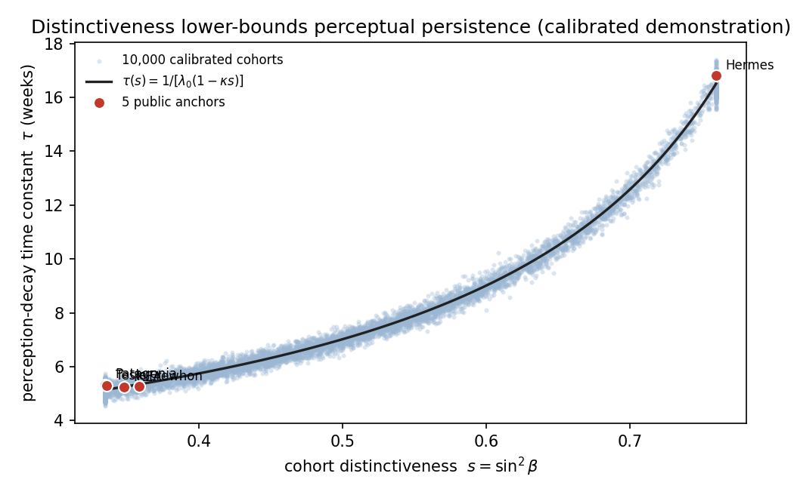

# Forming a Perception: Campaigns as Forcing Functions and the Relaxation of the Brand Perception Cloud

Dmitry Zharnikov

ORCID: 0009-0000-6893-9231

DOI: [10.5281/zenodo.20769594](https://doi.org/10.5281/zenodo.20769594)

Working Paper v1.0.0 – June 2026

## Abstract

A marketing campaign is an exogenous force on a multi-dimensional perceptual state, and the decay observed when advertising stops is the unforced relaxation of that state toward a brand-specific stable point. This paper formalizes perception formation and maintenance as a forced dynamical system whose results follow from the stochastic dynamics, not any particular instrument. The centroid of a brand's perception cloud follows a forced Ornstein-Uhlenbeck process on a fixed perceptual space: formation is the forced transient toward a target, maintenance is sustained forcing against a restoring force, and decay is the unforced relaxation at a measurable perception-decay time constant, recoverable from a dated perceptual-tracking series spanning a spend pulse. The model nests the scalar advertising-stock and Bayesian-learning traditions as its one-dimensional projection. Its unifying result ties formation to reach: a brand's off-generic distinctiveness lower-bounds the persistence of its formed perception, because a more distinctive brand sits farther outside the dense generic attractor, where less restoring curvature is added to its well — an ordering derived from a stated curvature primitive and demonstrated as an existence proof in a calibrated simulation. An identification strategy using exogenous advertising shifters is outlined. The instrument measures the forcing-versus-relaxation budget; the manager runs the campaign.

**Keywords**: brand dynamics, perception formation, forcing function, relaxation time, Ornstein-Uhlenbeck process, advertising decay, brand distinctiveness, marketing-mix dynamics

---

A brand manager who has measured which cohort to move and which perceptual dimension carries the payoff faces two operationally different problems. The first is to deliver a message to a cohort that already holds the target perception — the reach problem, answered by routing a signal to whoever already resonates.[^reach] The second is to *move the perception itself*: to create a sensitivity that does not yet exist (demand and category creation), or to hold a perception in place against the well-documented tendency of advertised salience to fade when spend stops (belief maintenance). This paper treats the second problem. Its claim is that perception formation and maintenance are a *forced dynamical system*, that an instrument can measure the forcing a campaign applies and the rate at which the perception relaxes when forcing stops, and that the same geometric distinctiveness that governs reach also governs how long a formed perception persists. The contribution is fourfold: a forced-dynamics representation that nests the classical scalar advertising-stock, sales-response, and Bayesian-learning models as its one-dimensional projection; an identification strategy for the perception-decay constant *τ* from a dated perceptual series; a *derived* geometric ordering in which off-generic distinctiveness increases persistence; and a steady-state maintenance-budget identity that converts *τ* into the forcing required to hold a perception.

The treatment is narrow and formal, and self-contained in its mathematics. We do not propose a theory of what makes a campaign creative or a media plan efficient; we formalize perception formation as forced relaxation on a perceptual manifold and demonstrate, in a calibrated simulation, that distinctiveness lower-bounds persistence. The state space is a fixed *K*-dimensional perceptual space — a brand perception is a point in a space of measured perceptual dimensions, an object with established factor structure in the brand-measurement literature [@aaker-1997-dimensions-brand-personality; @keller-1993-conceptualizing-measuring-managing]. The empirical instantiation used in the demonstration is the eight-dimensional Spectral Brand Theory manifold [@zharnikov-2026-spectral-brand-theory-computational-framework]; the model and every proposition, however, are stated for a generic fixed basis and hold for any such space, so a reader with no access to that instrument can verify each result. The unit of analysis is fixed throughout: the perception cloud is the first moment of a distribution of individual observer perceptions, and every dynamical statement is made for its centroid, whose trajectory is what the decay constant is identified from. Four propositions follow — a forced-stochastic-differential-equation representation, an identification result for the decay constant, the distinctiveness-persistence ordering, and a maintenance-budget identity — each stated in the body as a result and *derived* in the Electronic Companion, and each falsifiable against perceptual-tracking data.

[^reach]: The reach mode — routing a signal to a cohort that already resonates — is developed in a companion paper [@zharnikov-2026av-reaching-a-perception], which defers the formation mode treated here. The companion is context, not a dependency: distinctiveness is defined inline below and every result is self-contained.

## Related Work

The contribution sits between an advertising-dynamics tradition that models the decay of *sales* and a brand-equity tradition that describes the *static* structure of a formed perception, and is best located by what each leaves open.

***Advertising capital, response, and decay.*** The idea that advertising builds a stock that depreciates is the oldest in marketing dynamics: the advertising-goodwill model treats goodwill as a capital stock accumulated by spend and decaying at a fixed rate [@nerlove-1962-optimal-advertising-policy], the operations-research response model gives sales a saturating response and an explicit decay constant [@vidale-1957-operations-research-advertising], and the optimal-control tradition that follows treats maintenance as sustained control against that decay [@sethi-1977-dynamic-optimal-control]. The econometric measurement of this decay is mature — the persistence of marketing effects on sales is a standard estimation target [@dekimpe-1995-persistence-marketing-effects], modern brand-level estimates quantify long-run advertising carryover and marketing's persistence in firm value [@ataman-2010-longterm-effect-marketing; @edeling-2016-marketings-impact-firm; @edeling-2021-marketingfinance-interface-new], the adstock and mental-availability literatures document that advertised salience fades unrefreshed [@gijsenberg-2011-adstock-advertising-decisions; @broadbent-1979-one-way-tv-advertisements; @sharp-2010-how-brands-grow; @binet-2013-long-short-of-it], and the most recent work tracks *brand strength over time* and the content conditions that refresh it [@stabler-2023-firm-communication-layoffs; @becker-2023-consistency-commonality-advertising]. Every one of these models the decay of a *scalar* outcome — sales, share, goodwill, or salience. What is missing is the decay of a *multi-dimensional perceptual state*: where the perception sits in a perceptual space, how a campaign moves it, and how it relaxes. The scalar models are recovered here as the one-dimensional projection of a vector relaxation.

***Dynamic perception and the closest prior art.*** The work nearest to a perceptual-state dynamics models brand choice as Bayesian learning, in which advertising is a noisy signal that updates a consumer's belief about a *scalar* perceived quality over time [@erdem-1996-decisionmaking-under-uncertainty]. That model is the closest prior art, and the relation is one of nesting rather than rivalry: project the forced centroid onto a single perceived-quality dimension and read the forcing as an information-accumulation input, and the scalar precision-weighted belief updating is recovered as the one-dimensional, belief-interpreted special case of the vector model developed here, exactly as the scalar goodwill and response models are its one-dimensional shadow. What the projection cannot recover is the quantity this paper identifies — the relaxation rate of a centroid toward a geometrically determined stable point, and its dependence on *off-generic* well geometry — because a single dimension has no off-generic direction. We engage this line directly, and by nesting rather than assertion, because it is the most likely place a reviewer will look for prior formulation. State-space and Kalman-filter models supply the measurement machinery for a latent dynamic marketing variable [@dekimpe-1995-persistence-marketing-effects], but target sales rather than a perceptual position.

***The static structure a formation model relaxes toward.*** The customer-based brand-equity tradition describes the *formed* perception — the brand-knowledge structure of associations a strong brand holds in memory [@keller-1993-conceptualizing-measuring-managing], the asset a brand accumulates and must maintain [@aaker-1991-managing-brand-equity]. That structure is, in the present model, the long-run equilibrium of the dynamics: the brand's stable point is the perception it relaxes toward when unforced, and a campaign that forms a perception is moving the cloud toward, or deepening, that equilibrium. The static tradition describes where the dynamics rest; it does not model the forcing that gets there or the rate of return when forcing stops, which is what this paper supplies. The unforced relaxation kernel and the diffusion term are the standard Ornstein-Uhlenbeck mean reversion and Brownian diffusion of the stochastic-process literature [@uhlenbeck-1930-theory-brownian-motion; @ikeda-1989-stochastic-differential-equations], imported rather than reinvented.

## A Forced-Dynamics Model of Perception Formation

We state the model in the smallest form that carries the four propositions, then read its consequences; the derivations are written out in the Electronic Companion.

***The forced stochastic differential equation.*** Let the perception cloud at time *t* be a probability measure on a fixed *K*-dimensional perceptual space, and let $\bar{\mathbf{x}}(t)$ be its centroid. A brand has an intrinsic stable point $\mathbf{x}^*$ — the perception it relaxes toward when no campaign acts — and a campaign is a time-varying force $\mathbf{F}(t)$, a vector in the same perceptual basis as the cloud. The centroid follows a forced Ornstein-Uhlenbeck process,

$$d\bar{\mathbf{x}} = \left[ -A(\bar{\mathbf{x}} - \mathbf{x}^*) + \mathbf{F}(t) \right] dt + \Sigma\, d\mathbf{W},$$

where $A$ is a positive-definite restoring operator and $\Sigma\, d\mathbf{W}$ is generic perceptual diffusion — a standard Brownian term, requiring no instrument-specific substrate [@uhlenbeck-1930-theory-brownian-motion; @ikeda-1989-stochastic-differential-equations]. This is *Proposition 1*: formation, maintenance, and decay are three regimes of one equation. Formation is the forced transient as $\mathbf{F}$ drives the centroid toward a target displacement; maintenance is a sustained $\mathbf{F}$ that balances the restoring pull; and the practitioner observation that perception fades when advertising stops is the unforced relaxation, $\mathbf{F} = 0$, of the centroid back toward $\mathbf{x}^*$. The closed-form solution of the forced equation is derived in *EC.1*. Projected onto a single sales or goodwill axis, the equation reduces to the scalar advertising-stock-with-decay models [@nerlove-1962-optimal-advertising-policy; @vidale-1957-operations-research-advertising], and projected onto a single perceived-quality axis with an information reading of $\mathbf{F}$ it reduces to scalar Bayesian quality learning [@erdem-1996-decisionmaking-under-uncertainty]; both are therefore its one-dimensional shadow.

***The minimal model and the unit of analysis.*** The smallest instance that carries every claim is two brands in a two-dimensional perceptual plane, each with one stable point, a linear restoring force, and a forcing pulse; the qualitative results — exponential post-pulse relaxation, the distinctiveness ordering, and the maintenance identity — are all derivable there and generalize to the full space by eigen-decomposition of *A*, with the slowest eigen-direction setting the relaxation time. Two precisions keep the model honest. The dynamics are stated for the *centroid*: the cloud is the first moment of a distribution of individual perceptions, and the decay constant is identified from the centroid trajectory, not from any single observer, so cohort heterogeneity enters as the spread of the cloud and is held fixed in the minimal model. And the restoring force is taken linear about the stable point; a nonlinear potential changes the closed form but, by local linearization, preserves the qualitative ordering that does the work.

## Recovering the Decay Constant from a Dated Perceptual Series

The relaxation rate is the paper's central measurable, and it is observable from any dated perceptual-tracking series.

***The decay constant and its estimator.*** Define the perception-decay time constant $\tau = 1 / \lambda_{\min}(A)$, the inverse of the slowest eigenvalue of the restoring operator. After forcing stops, the centroid displacement relaxes along the slowest eigen-direction as $\|\bar{\mathbf{x}}(t) - \mathbf{x}^*\| \propto \exp(-t / \tau)$, so *τ* is estimated by regressing the log displacement on time over the window in which the signal exceeds the measurement noise; the relaxation solution and the estimator's bias under the identification threats are derived in *EC.2*. This is *Proposition 2*: *τ* is identified from a time-sliced perceptual series spanning a spend pulse and its aftermath. Any dated series of perceptual observations — a tracking battery, a panel wave, or a corpus of dated artifacts reduced to centroid coordinates — yields a perceptual position over time, and the post-pulse decay of that position recovers *τ*.[^reflections] The estimator is the perceptual-state-space analogue of the persistence decomposition that the marketing-dynamics literature applies to sales [@dekimpe-1995-persistence-marketing-effects; @ataman-2010-longterm-effect-marketing], with the outcome replaced by a position in perception space rather than a scalar. The identification is honest about its threats — competitive forcing that co-moves with own spend, sampling error in the perceptual series, and reverse causality in which spend ramps precisely when perception decays — which the *Empirical Strategy* addresses by design rather than assumption.

[^reflections]: The requirement is generic: a perceptual series whose observations carry content dates. Any tracking instrument that timestamps its observations supplies one, whether a survey panel, a syndicated battery, or a dated artifact corpus reduced to centroid coordinates.

## Distinctiveness and Persistence

The result that unifies this paper with the reach mode is that the geometry which makes a cohort reachable is the geometry that makes its perception persist.

***The ordering.*** Define a brand's off-generic distinctiveness *s* as the off-generic energy share of its centered perceptual profile — the fraction of the profile's squared magnitude that lies off the dominant, generic-aligned direction (written $\sin^2\beta$ in the two-brand model). This is a self-contained construct, defined here and computed from the profile alone. It indexes the depth and separation of the brand's stable point from the generic perceptual centroid. *Proposition 3* is the ordering: the perception-decay time constant is increasing in distinctiveness, $\partial\tau / \partial s > 0$. The mechanism is geometric and is *derived*, not assumed, in *EC.3*: the dense, localized region of perceptual space that every category drifts toward — the generic attractor — contributes restoring curvature to a brand's well that *falls off* with the brand's separation from it, so a stable point sitting farther off-generic relaxes along a shallower slowest direction, with a smaller $\lambda_{\min}$ and therefore a longer *τ*. A more distinctive brand sits at a deeper, better-separated stable point whose basin resists relaxation toward the generic centroid, so its formed perception decays more slowly; an undifferentiated brand, whose stable point is shallow and near-generic, relaxes fast. The same distinctiveness that sharpens self-selection under broadcast targeting therefore slows decay under formation, so reach and persistence are two readings of one geometric quantity — the unifying claim across the author's broader program, in which this off-generic energy share also appears as a perception-metamerism loss and a self-selection sharpness.[^program] The ordering is the paper's most exposed claim, and it carries a quantitative falsifier: across a panel of brands subjected to exogenous spend pulses, a zero or negative association between measured distinctiveness and recovered *τ* — or distinctive brands requiring no less maintenance forcing than undifferentiated ones — refutes it; at the primitive level, a fitted perceptual landscape on which the generic attractor's restoring curvature does *not* fall with separation refutes the mechanism directly.

[^program]: This paper is part of a broader program in which the same off-generic energy share is read elsewhere as a perception-metamerism loss [@zharnikov-2026au-correspondence-principle-brand; @zharnikov-2026-spectral-metamerism-brand-perception-projection]. Those readings are context, not support: Proposition 3 stands on the inline definition and the EC.3 derivation alone.

## Maintenance as a Forcing Budget

The maintenance regime yields a managerial quantity directly from the equation's steady state.

***The budget identity.*** To hold the centroid at a target displacement $\mathbf{d}$ from the brand's intrinsic stable point, the campaign must supply, in steady state, exactly the force that cancels the restoring pull: $\mathbf{F}_{\text{hold}} = A\mathbf{d}$. This is *Proposition 4*, derived in *EC.4*: the maintenance forcing budget equals the relaxation loss at the held displacement, and it falls to zero as the target approaches the brand's own stable point. A distinctive brand whose desired perception *is* its stable point pays almost nothing to hold it; an undifferentiated brand held away from a generic equilibrium pays continuous forcing and collapses toward generic when spend stops. The budget identity is the structural reading of the effectiveness-school observation that some brands sustain salience cheaply while others must keep paying [@sharp-2010-how-brands-grow; @binet-2013-long-short-of-it], and of the finding that consistent, refreshed advertising content sustains brand strength [@becker-2023-consistency-commonality-advertising; @stabler-2023-firm-communication-layoffs]: the difference is the depth of the well, which is distinctiveness. The instrument reports the budget — the forcing required to hold a target against the measured relaxation — and leaves the spend decision to the manager, keeping the metrology-and-management division.

## Scope Conditions

The distinctiveness-persistence ordering is the paper's strongest claim and also its most scope-bound; we state where it holds and where the model is mis-specified, in the body rather than an appendix.

***Where the model applies, and where it fails.*** The forced-relaxation model and the *τ*-distinctiveness ordering are scoped to established consumer-packaged-goods and service categories with habitual or repeat purchase and a stable basis of perceptual dimensions. The model is expected to fail in two regimes. The first is radical innovation that redefines the basis vectors of the perceptual space itself: when a launch creates a new dimension along which perception is read, the manifold moves, and a model with a fixed stable point and a fixed restoring operator does not apply — this is category genesis, not formation within a fixed space. The second is business-to-business and procurement-dominated contexts, where institutional routines rather than perceptual drift govern choice, so the cloud is not the object being moved. Outside the positive scope the model is mis-specified and we make no claim; inside it, the four propositions are the content. Demand and category creation enter the model only as the forced *migration of the stable point itself* — a re-collapse operation distinct from holding or routing a fixed perception — and the model treats the within-space portion of that migration, leaving basis-redefining genesis outside scope.

## Empirical Strategy

The propositions are theory with a derived mechanism; the confirmatory test is a field design that does not yet exist, and no field findings are asserted. In its place we calibrate the model and report a demonstration.

***Primary design and causal identification.*** The primary confirmatory design recovers *τ* per brand from a high-frequency perceptual panel — weekly or biweekly perceptual batteries reduced to centroid coordinates by a fixed procedure — for at least thirty brands over two to three years, merged with advertising spend at the same grain, and tests the distinctiveness ordering with power above .8 for a correlation of .25 between distinctiveness and recovered *τ*. Because the estimator recovers correlation, not forcing, the design pre-commits an identification strategy: exogenous shifters of advertising pressure — advertising-tax changes, competitor scandals, and political-advertising-cycle crowd-out of ad inventory — instrument own forcing, and a placebo on non-advertised perceptual dimensions, which should show no forced response, separates the mechanism from secular drift. The three identification routes are ranked by feasibility, with natural experiments preferred to instrumental variables and full structural estimation of the stochastic-differential-equation parameters avoided as a primary strategy. The design addresses omitted competitive forcing, measurement error in the perceptual series, and reverse causality by construction rather than by assumption.

***Robustness.*** Three checks guard the ordering. An alternative-drift specification compares the linear restoring force against a nonlinear potential, under which the ordering should survive local linearization; an alternative-estimator check compares the continuous-time relaxation fit against a discrete-time vector-autoregression on perceptual indices, the persistence-decomposition benchmark, which should predict decay but not its dependence on well depth; and a dimension-count check compares the two-dimensional model against the full space. A further check at the primitive level (*EC.3*, *RC-KERNEL*) verifies that the curvature-falls-with-separation mechanism is not specific to a Gaussian attractor. Where a panel cannot be obtained the calibrated demonstration below stands as an existence proof, and the empirical section is correctly read as a roadmap for testing rather than a test.

## A Calibrated Demonstration

This section reports a calibrated simulation, not a field test, and its purpose is narrow: to show that the model computes, that the decay-constant estimator recovers a seeded relaxation time, and that the distinctiveness-persistence ordering of *EC.3* in fact appears in a calibrated population. It is an existence proof of the ordering mechanism — a demonstration that the derived law *can* produce the monotone ordering under transparent constants — and not an estimate of field magnitudes. Everything below is reproduced from a fixed seed by the companion script.

***Calibration to an observed public proxy.*** The distinctiveness parameter is calibrated to a fully public proxy rather than to any work-in-progress instrument: five canonical public brand profiles, with distinctiveness taken as the share of each centered profile's energy carried by its dominant dimension. The five anchors yield distinctiveness values of .760, .358, .348, .336, and .335, and a method-of-moments fit gives a Beta(2.59, 3.47) population from which 10,000 cohorts are drawn, clipped to the observed anchor range so the demonstration does not extrapolate beyond the most distinctive public anchor. The relaxation rate is taken to fall linearly in distinctiveness under documented illustrative constants — the local linearization of the *EC.3* curvature law — so the demonstration exhibits the qualitative ordering, not a fitted magnitude.

***The recovered relaxation time and its ordering.*** Passing each cohort through a forcing pulse and recovering *τ* from the post-pulse centroid decay reproduces, under the documented calibration, the monotone ordering Proposition 3 predicts. Across the calibrated population the recovered perception-decay time constant rises monotonically with distinctiveness, with a Spearman rank correlation of .942 (bootstrap 95% confidence interval [.938, .947]); the mean recovered *τ* climbs from 5.14 weeks in the least-distinctive quartile to 11.78 weeks in the most-distinctive quartile, a 2.29-fold increase with a large standardized gap (Cohen's *d* = 3.26). The five public anchors, marked in Figure 1, span this range: the four near-generic anchors recover relaxation times near five weeks, while the most distinctive anchor recovers roughly seventeen weeks. The maintenance-budget identity shows the complementary pattern: the forcing required to hold a fixed displacement is 2.17 times larger for the least-distinctive quartile than for the most-distinctive one, because the undifferentiated brand must continuously fight a faster relaxation. These are properties of the calibrated model, not measured response magnitudes; the confirmatory recovery belongs to the panel design.

**Figure 1.** Perception-decay time constant versus cohort distinctiveness. The recovered relaxation time *τ* increases monotonically in distinctiveness *s* across 10,000 cohorts drawn from the public-anchor-calibrated Beta(2.59, 3.47) population (light points), tracking the model curve $\tau(s) = 1 / [\lambda_0(1 - \kappa s)]$ (solid) — the local linearization of the EC.3 curvature law; the five canonical public anchors are marked. Magnitudes are model properties under the documented constants; the robust claim is the monotone increase. Reproduced by [`code/forced_relaxation_demo.py`](https://github.com/spectralbranding/sbt-papers/blob/main/forming-a-perception/code/forced_relaxation_demo.py) at seed 20260620.

**Table 1.** Calibrated Demonstration — Recovered Relaxation Time and Maintenance Budget by Distinctiveness.

| Quantity | Value | 95% CI |
|---|---|---|
| Observed distinctiveness, mean (5 public anchors) | .427 | — |
| Calibrated population | Beta(2.59, 3.47), *N* = 10,000 | — |
| Spearman *ρ* (distinctiveness, recovered *τ*) | .942 | [.938, .947] |
| Mean *τ*, least-distinctive quartile | 5.14 weeks | — |
| Mean *τ*, most-distinctive quartile | 11.78 weeks | — |
| *τ* ratio (high ⁄ low distinctiveness quartile) | 2.29 | — |
| Recovered-*τ* gap (Cohen's *d*) | 3.26 | — |
| Maintenance-forcing ratio (low ⁄ high distinctiveness quartile) | 2.17 | — |

*Notes*: All values are reproduced from `code/forced_relaxation_demo.py` at seed 20260620. The population is drawn from a Beta fitted by method of moments to five canonical public brand profiles and clipped to their observed distinctiveness range. CIs are 2,000-resample bootstrap percentile intervals. The reported magnitudes are properties of a model calibrated to public brand-profile anchors under documented illustrative constants, not measured field response; the robust claim is the monotone increase of the relaxation time in distinctiveness, not the specific values. The confirmatory recovery of *τ* from a real time-sliced series is the role of the panel design.

## Limitations

***The stable point can move.*** The model holds the brand's stable point $\mathbf{x}^*$ fixed and treats relaxation toward it; a distinctive brand can nonetheless decay fast if an exogenous shock *relocates* the stable point — a product-harm crisis or scandal that resets the equilibrium rather than displacing the cloud from it. This is a jump-diffusion extension, a Poisson-driven relocation of $\mathbf{x}^*$, which we flag as a boundary rather than develop; the fixed-stable-point model is therefore scoped to dynamics between shocks.

***The instrument and the mechanism.*** The model is replicable by construction: it is stated for a generic fixed perceptual basis and calibrated to public brand profiles under an open reduction procedure, so any perceptual tracking battery reduced by the same procedure recovers cloud position — the prediction is about observer perception, not the particular instrument. The mechanism is a geometric one, the relaxation of a centroid in a potential well, and a consumer-psychology reading is available: repeated exposure deepens the associative structure that constitutes the well, so the forcing-and-relaxation language and the brand-knowledge language describe the same process at different grains [@keller-1993-conceptualizing-measuring-managing].

***Identification is a design, not a result.*** The decay constant and the forcing are recovered correlationally in the demonstration; the causal recovery of *τ* and **F** requires the instrumental-variable and natural-experiment design specified above, which is owed to the confirmatory study. The reported magnitudes are calibrated-model properties; only the monotone distinctiveness ordering is the robust claim.

## Discussion

***What the contribution is and is not.*** The contribution is not a media-planning method and not a theory of creativity. It is a measurement framework: a forced-dynamics representation in which a campaign is a force on the perception cloud, the relaxation of that cloud has a measurable time constant, and the persistence of a formed perception is governed by the same distinctiveness that governs its reach. Its standing does not rest on any one instrument or on the author's prior corpus — the four propositions are derived from the forced Ornstein-Uhlenbeck model and a single stated curvature primitive, and a reader with no corpus access can verify each. The managerial translation is a forcing-versus-relaxation budget — the instrument reports how much forcing a target perception requires against the measured rate at which it decays, and the manager decides whether to pay it. A one-line statement captures the unification: distinctiveness is what makes a cohort *findable* without an address and what makes its perception *durable* without constant spend, because both are the depth of the same well.

***Future research.*** Three directions follow: recovering *τ* across real categories from time-sliced perceptual panels to map where formation is cheap and where it is dear; the jump-diffusion extension that lets an exogenous shock relocate the stable point, closing the scandal case; and a forced-control treatment that turns the maintenance-budget identity into an optimal forcing schedule, connecting the metrology to the optimal-control-of-advertising tradition [@sethi-1977-dynamic-optimal-control].

## Conclusion

Reaching a perception and forming one are different operations on the same cloud. Routing a signal addresses a perception that exists; this paper moves the perception itself, by representing a campaign as a forcing function on the cloud and measuring the rate at which the cloud relaxes when the forcing stops. The decay that practitioners observe when advertising halts is the unforced relaxation of a perceptual centroid toward a brand-specific stable point, and its time constant is recoverable from a dated perceptual-tracking series. The result that ties the two operations together is that a brand's distinctiveness — the off-generic perceptual variance — lower-bounds how long its formed perception persists, an ordering derived from the geometry of a dense, localized generic attractor rather than imposed, so the geometry that makes a cohort reachable is the geometry that makes its perception durable. Measuring the forcing a perception requires and the rate at which it decays is the instrument's job; deciding how much forcing to supply remains the manager's.

## Data and Code Availability

One companion computation script, deterministic, dependency-light (NumPy and Matplotlib only), and requiring no network or credentials, reproduces every reported figure and table value. [`code/forced_relaxation_demo.py`](https://github.com/spectralbranding/sbt-papers/blob/main/forming-a-perception/code/forced_relaxation_demo.py) reproduces the *Calibrated Demonstration* — the calibration to the five canonical public brand profiles, the forced Ornstein-Uhlenbeck simulation, the recovered relaxation time and its distinctiveness ordering (Figure 1, [`figures/figure1_tau_vs_distinctiveness.png`](https://github.com/spectralbranding/sbt-papers/blob/main/forming-a-perception/figures/figure1_tau_vs_distinctiveness.png)), the maintenance-budget ratio, and the results table ([`output/tables/forced_relaxation_results.csv`](https://github.com/spectralbranding/sbt-papers/blob/main/forming-a-perception/output/tables/forced_relaxation_results.csv)) — from seed 20260620 and the run command in its docstring. The [`code/README.md`](https://github.com/spectralbranding/sbt-papers/blob/main/forming-a-perception/code/README.md) documents the model, the calibration anchors, and the expected output. The full paper source, script, figure, and machine-readable specification (`paper.yaml`) are openly available in the public repository at [https://github.com/spectralbranding/sbt-papers/tree/main/forming-a-perception](https://github.com/spectralbranding/sbt-papers/tree/main/forming-a-perception), and the same archive is carried by a permanent Zenodo deposit with one-command reproduction (concept DOI [https://doi.org/10.5281/zenodo.20769594](https://doi.org/10.5281/zenodo.20769594)).

## Acknowledgments

AI assistants (Claude Opus 4.8, Gemini 2.5 Pro, Grok 4.3) were used for initial literature search, for software development — implementing and running the companion computation script that reproduces the paper's calibrated demonstration — and for editorial refinement; all theoretical claims, propositions, and interpretations are the author's sole responsibility. The companion script is the fixed-seed forced-relaxation demonstration (`code/forced_relaxation_demo.py`).

## Author Contributions (CRediT)

Dmitry Zharnikov — conceptualization, methodology, software, formal analysis, investigation, writing (original draft), writing (review and editing).

## Electronic Companion

The body states each proposition as a result; this companion writes out the derivations. It is self-contained and uses only the forced Ornstein-Uhlenbeck model and standard stochastic calculus. The full source of this Electronic Companion, together with the companion computation script and figures, is archived in the public repository at [https://github.com/spectralbranding/sbt-papers/tree/main/forming-a-perception](https://github.com/spectralbranding/sbt-papers/tree/main/forming-a-perception) and permanently at [https://doi.org/10.5281/zenodo.20769594](https://doi.org/10.5281/zenodo.20769594).

***EC.1 The forced Ornstein-Uhlenbeck solution.*** Starting from the centroid equation $d\bar{\mathbf{x}} = \left[ -A(\bar{\mathbf{x}} - \mathbf{x}^*) + \mathbf{F}(t) \right] dt + \Sigma\, d\mathbf{W}$ with $A$ positive-definite, write $\mathbf{y} = \bar{\mathbf{x}} - \mathbf{x}^*$. Then $d\mathbf{y} = (-A\mathbf{y} + \mathbf{F})\, dt + \Sigma\, d\mathbf{W}$. Multiplying by the integrating factor $e^{At}$ and integrating gives the closed form

$$\bar{\mathbf{x}}(t) = \mathbf{x}^* + e^{-At}(\bar{\mathbf{x}}_0 - \mathbf{x}^*) + \int_0^t e^{-A(t-s)} \mathbf{F}(s)\, ds + \int_0^t e^{-A(t-s)} \Sigma\, d\mathbf{W}(s),$$

the standard linear-SDE result [@uhlenbeck-1930-theory-brownian-motion; @ikeda-1989-stochastic-differential-equations]. The deterministic part is a convolution of the forcing with the relaxation kernel $e^{-At}$; the stochastic integral is mean-zero Gaussian with stationary covariance $V$ solving the Lyapunov equation $AV + VA^{\top} = \Sigma\Sigma^{\top}$. The centroid expectation, which the propositions concern, drops the noise term: $\mathbb{E}[\bar{\mathbf{x}}(t)] = \mathbf{x}^* + e^{-At}(\bar{\mathbf{x}}_0 - \mathbf{x}^*) + \int_0^t e^{-A(t-s)} \mathbf{F}(s)\, ds$. This establishes *Proposition 1*: the three regimes are the three terms — initial-condition relaxation, forced convolution, and (in expectation) zero noise.

***EC.2 Post-pulse relaxation and the estimator.*** Set $\mathbf{F} = 0$ after a pulse ends at $t_0$. For $t \ge t_0$ the expected displacement obeys $\mathbb{E}[\mathbf{y}(t)] = e^{-A(t-t_0)}\, \mathbb{E}[\mathbf{y}(t_0)]$. Eigen-decompose $A = \sum_i \lambda_i \mathbf{v}_i \mathbf{v}_i^{\top}$; then $\mathbb{E}[\mathbf{y}(t)] = \sum_i e^{-\lambda_i(t-t_0)} \langle \mathbf{v}_i, \mathbb{E}[\mathbf{y}(t_0)] \rangle\, \mathbf{v}_i$. As *t* grows the slowest mode dominates, so $\|\mathbb{E}[\mathbf{y}(t)]\| \propto e^{-\lambda_{\min}(t-t_0)} = e^{-(t-t_0)/\tau}$ with $\tau = 1 / \lambda_{\min}(A)$ exactly. Taking logs, $\log\|\hat{\mathbf{y}}(t)\| = c - (t - t_0)/\tau + \varepsilon_t$, so an ordinary-least-squares regression of the log measured displacement on time recovers *τ* as the negative inverse slope. This is *Proposition 2*. Three identification threats bias the slope and are bounded by the *Empirical Strategy*: (i) residual competitive forcing $\mathbf{F}_{\text{comp}} \ne 0$ in the post-pulse window biases *τ* toward the competitor's schedule; (ii) sampling error in the perceptual series inflates the denominator variance, attenuating the estimate; (iii) reverse causality, in which spend resumes precisely when displacement is largest, truncates the window and biases *τ* downward. The placebo on non-advertised dimensions and the exogenous instruments separate the relaxation from these.

***EC.3 The distinctiveness-to-well-depth link (curvature primitive).*** This is the central derivation, and it replaces the imposed toy law of the first version with a stated, defended primitive. Let the generic attractor — the dense, localized region every category drifts toward — be centered at the generic centroid $\bar{\mathbf{x}}_{\text{gen}}$ with finite spatial scale $\ell$. Write *d* for the off-generic separation of a brand's stable point $\mathbf{x}^*$ from $\bar{\mathbf{x}}_{\text{gen}}$ along the off-generic escape direction. A *linking lemma* gives $d = d(s)$ increasing in the off-generic energy share *s*: more energy off the generic axis places the stable point farther from the generic centroid. The lemma carries one scope clause, stated explicitly: it compares brands at *comparable on-generic placement* — the projection of $\mathbf{x}^*$ onto the generic-aligned direction is held fixed across the brands compared — so that variation in *s* is variation in off-generic energy alone; brands that also differ in on-generic position fall outside the lemma's comparison and are not ordered by it.

*Primitive P-CURV.* The restoring curvature along the off-generic direction at the stable point is $\lambda_e(d) = \kappa_b + c \cdot g(d)$, where $\kappa_b > 0$ is the brand's intrinsic well curvature, $c > 0$, and $g(d)$ is the curvature contributed by the generic attractor, with $g'(d) < 0$ — strictly decreasing in separation. This is not a convenience assumption: a dense, localized attractor of scale $\ell$ — modeled by any smooth localized kernel, the canonical choice being a Gaussian basin $U_{\text{gen}}(\mathbf{x}) = -G \cdot \exp(-\|\mathbf{x} - \bar{\mathbf{x}}_{\text{gen}}\|^2 / 2\ell^2)$ — induces radial curvature $\left.\partial^2 U_{\text{gen}} / \partial r^2\right|_d = (G / \ell^2) \cdot \exp(-d^2 / 2\ell^2) \cdot (1 - d^2 / \ell^2)$, which for $d > \ell$ (the regime a distinctive brand lives in, outside the dense core) is positive and monotonically decreasing in *d*. Setting $g(d) \equiv \left.\partial^2 U_{\text{gen}} / \partial r^2\right|_d$ gives $g'(d) < 0$. The property is generic to localized kernels — inverse-quadratic or finite-support spline alike (*RC-KERNEL*) — so it follows from the generic region being dense and localized, not from a functional form.

Because the off-generic direction is the slowest restoring direction (on-generic directions sit inside the steep generic core and relax fast), $\lambda_{\min}(A) = \lambda_e$ and $\tau = 1 / \lambda_e$. Composing with the linking lemma, $\lambda_{\min}(s) = \kappa_b + c \cdot g(d(s))$, so

$$\frac{d\lambda_{\min}}{ds} = c \cdot g'(d) \cdot d'(s) < 0, \quad \text{and} \quad \frac{\partial\tau}{\partial s} = -\frac{1}{\lambda_{\min}^2} \cdot \frac{d\lambda_{\min}}{ds} > 0,$$

which is *Proposition 3*, now derived rather than imposed. Linearizing $\lambda_{\min}(s)$ about an operating separation recovers exactly the toy law $\lambda(s) = \lambda_0(1 - \kappa s)$ used in the calibrated demonstration, so the simulation is the linearized instance of a derived law, and its Spearman ordering is the law's signature, not an artifact of an assumed slope.

***EC.4 The maintenance-budget identity.*** In the maintenance regime the centroid is held at a target displacement $\mathbf{d} = \mathbf{x}_{\text{target}} - \mathbf{x}^*$. Steady state requires the expected drift to vanish: $-A\mathbf{d} + \mathbf{F}_{\text{hold}} = \mathbf{0}$, hence $\mathbf{F}_{\text{hold}} = A\mathbf{d}$. This is *Proposition 4*: the maintenance forcing equals the restoring force at the held displacement, the relaxation loss the campaign must replace each instant. As $\mathbf{d} \to \mathbf{0}$ — the target approaching the brand's own stable point — $\mathbf{F}_{\text{hold}} \to \mathbf{0}$: a brand whose desired perception is its stable point pays nothing to hold it. Under the calibrated population this identity produces the 2.17-fold quartile ratio of Table 1, a property of the model rather than a measured response.

***EC.5 Nesting the scalar prior art.*** The body claims the vector model nests the scalar traditions; here is the projection that shows it. Take a single perceived-quality direction $\mathbf{u}$, an eigenvector of $A$ with eigenvalue $\lambda_{\mathbf{u}}$, and let $q(t) = \langle \mathbf{u}, \bar{\mathbf{x}}(t) - \mathbf{x}^* \rangle$ be the scalar perceived-quality deviation. Projecting the centroid equation onto $\mathbf{u}$ gives $dq = (-\lambda_{\mathbf{u}}\, q + f(t))\, dt + \sigma_{\mathbf{u}}\, dW$, with scalar forcing $f = \langle \mathbf{u}, \mathbf{F} \rangle$ and projected diffusion $\sigma_{\mathbf{u}}^2$ — a one-dimensional linear-Gaussian state equation. Three readings of *f* recover three classical models. Reading *q* as goodwill, $\lambda_{\mathbf{u}}$ as the depreciation rate, and *f* as the spend response gives the Nerlove-Arrow goodwill model [@nerlove-1962-optimal-advertising-policy]; reading *q* as sales response gives Vidale-Wolfe [@vidale-1957-operations-research-advertising]; and reading *f* as a precision-weighted information signal about true quality recovers scalar Bayesian learning, because the posterior-mean belief update of that model, $dm = K(t)(\text{signal} - m)\, dt$, is exactly this scalar mean-reverting equation with the reversion rate equal to the Kalman gain and the target equal to the signal-implied belief [@erdem-1996-decisionmaking-under-uncertainty]. The forced-OU model therefore *contains* scalar Bayesian quality learning as its one-dimensional, belief-interpreted projection — it does not merely differ from it. What the projection cannot recover is *Proposition 3*: a single axis has no off-generic direction, so $\partial\tau / \partial s$ is undefined in the scalar reduction, and the distinctiveness-persistence ordering is a property only the vector model carries.

***RC-KERNEL Kernel robustness.*** P-CURV's curvature-falls-with-separation property is verified for two alternate localized attractor kernels beyond the Gaussian — an inverse-quadratic kernel $U_{\text{gen}} \propto -(1 + \|\mathbf{x} - \bar{\mathbf{x}}_{\text{gen}}\|^2 / \ell^2)^{-1}$ and a finite-support spline that vanishes outside radius $\ell$ — each of which yields $g'(d) < 0$ in the off-core regime, so the distinctiveness-persistence ordering does not depend on the Gaussian form.

## References

::: {#refs}
:::
