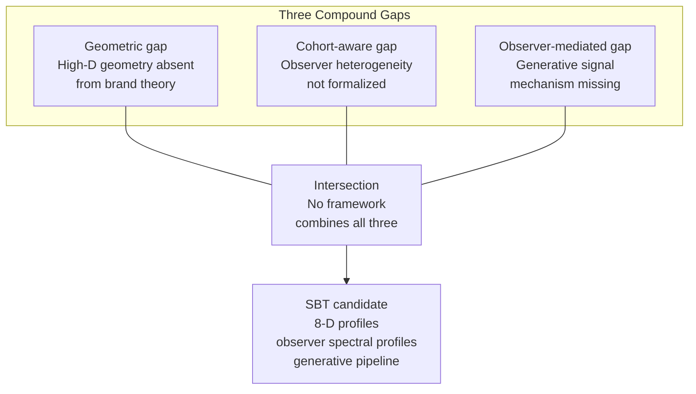
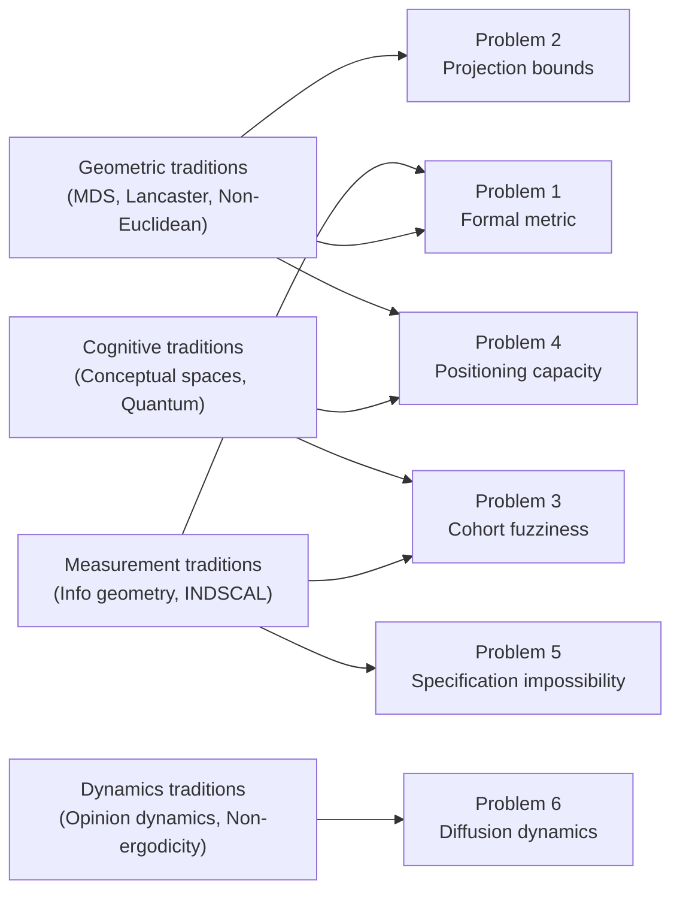
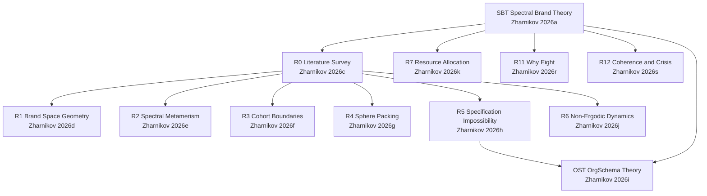

# Geometric Approaches to Brand Perception: A Critical Survey and Research Agenda

Dmitry Zharnikov

ORCID: 0009-0000-6893-9231

DOI: [10.5281/zenodo.18945217](https://doi.org/10.5281/zenodo.18945217)

Working Paper v1.5.0 – June 2026 (revised June 2026)

---

## Abstract

This paper surveys geometric and topological methods applied to brand perception across ten intellectual traditions: multidimensional scaling, characteristics-space economics, conceptual spaces, non-Euclidean perceptual geometry, individual-differences modeling, topological data analysis, quantum cognition, opinion dynamics, and non-ergodicity research. The central finding is that a significant compound gap persists: no existing framework combines high-dimensional geometric structure, a generative signal mechanism, observer heterogeneity, and non-ergodic temporal dynamics into an integrated theory of brand perception. Multidimensional scaling operates in two to three dimensions and offers no generative mechanism. Conceptual spaces provide geometric foundations for cognition but lack temporal dynamics and observer-specific processing. Non-Euclidean perceptual geometry demonstrates that Euclidean distance is insufficient for modeling perception, yet this insight has not penetrated brand theory. Non-ergodicity has been formalized in psychology, decision science, and evolutionary biology, but has never been applied to brand perception. Six open problems with formal mathematical statements — concerning formal metrics on brand space, projection bounds, concentration of measure, positioning capacity, specification impossibility, and diffusion dynamics on perceptual manifolds — constitute a research agenda for mathematical brand theory; companion papers [@zharnikov-2026-brand-space-geometry-formal-metric; @zharnikov-2026-spectral-metamerism-brand-perception-projection; @zharnikov-2026-cohort-boundaries-high-dimensional-perception; @zharnikov-2026-many-brands-can-market-hold; @zharnikov-2026-specification-impossibility-organizational-design-high; @zharnikov-2026-non-ergodic-brand-perception-diffusion] resolve each.

**Keywords**: brand perception, geometric methods, multidimensional scaling, conceptual spaces, non-ergodicity, high-dimensional geometry, Spectral Brand Theory

**JEL Classification**: M31, C65, D91

**MSC Classification**: 91B42, 51K05, 62P20

**arXiv Subject Classes**: cs.LG, stat.ML

---

Brand theory, as it has developed over the past four decades, is strikingly under-formalized. The foundational frameworks that guide both academic research and professional practice---Aaker's [-@aaker-1991-managing-brand-equity] brand equity model, Keller's [-@keller-1993-conceptualizing-measuring-managing] customer-based brand equity pyramid, Kapferer's [-@kapferer-2008-new-strategic-brand, 4th ed.] brand identity prism---are taxonomic rather than mathematical. They identify components, propose relationships, and offer measurement instruments, but they do not specify the formal structure of the space in which brands exist, the metric by which brand differences should be measured, or the dynamical laws governing how brand perceptions evolve over time. Where the tradition does treat brand perception as multi-dimensional, it does so through factor-analytic scale development rather than geometric structure: Aaker's [-@aaker-1997-dimensions-brand-personality] five-factor brand personality scale, derived by exploratory factor analysis of trait ratings, established that brand perception can be operationalized along a fixed set of latent dimensions, but it yields a static, descriptive measurement instrument with no metric on the resulting space, no observer-specific processing, and no temporal dynamics. A recent systematic review of brand equity models concluded that existing frameworks fail to provide a comprehensive or formally rigorous account of brand equity [@paschina-2025-brand-equity-measurement].

This absence of mathematical structure stands in sharp contrast to adjacent fields where geometric methods have produced transformative insights. In perception science, the discovery that human perceptual space is non-Euclidean---"at best Riemannian" [@todd-2001-affine-structure-perceptual] and possibly non-Riemannian [@bujack-2022-nonriemannian-nature-perceptual]---has reshaped how researchers model visual and sensory experience. In cognitive science, Gardenfors's [-@gardenfors-2000-conceptual-spaces-geometry] conceptual spaces framework demonstrated that natural concepts correspond to convex regions in geometric quality-dimension spaces, providing a formal bridge between perception and categorization. In economics, Lancaster's [-@lancaster-1966-new-approach-consumer] characteristics theory recast consumer choice as navigation through an n-dimensional attribute space, while Hotelling's [-@hotelling-1929-stability-competition-economic] spatial competition model placed firms on a geometric line. In physics and machine learning, high-dimensional geometry has revealed counterintuitive phenomena---concentration of measure, the curse of dimensionality, the Johnson-Lindenstrauss projection lemma---that fundamentally alter how systems behave as dimensions increase. Most directly relevant for a cs.LG audience, the geometric deep learning program [@bronstein-2017-geometric-deep-learning] has established that learning on non-Euclidean domains---graphs, manifolds, and point clouds---requires tools beyond standard convolutional architectures, positioning the brand-perception problem as a natural application domain for manifold-aware representation learning.

Meanwhile, the non-ergodicity revolution initiated by Peters [-@peters-2019-ergodicity-problem-economics] has shown that the distinction between time averages and ensemble averages, long understood in statistical mechanics, has profound consequences for economics, psychology, and decision-making. When dynamics are multiplicative or absorbing states exist, population-level statistics (ensemble averages) systematically diverge from the trajectories of individual agents (time averages). This insight has been formalized in psychology by Molenaar [-@molenaar-2004-manifesto-psychology-as] and Molenaar and Campbell [-@molenaar-2009-new-personspecific-paradigm], tested experimentally by Meder et al. [-@meder-2021-ergodicitybreaking-reveals-time], and applied to evolutionary biology and organizational theory---but never to brand perception.

The purpose of this survey is to map these disparate literatures systematically and identify the precise intellectual gap that lies at their intersection. The gap largely reflects disciplinary boundaries: marketing scholars have not engaged with high-dimensional geometry, while mathematicians and perception scientists have not examined brand phenomena. Spectral Brand Theory (SBT), proposed in Zharnikov [-@zharnikov-2026-spectral-brand-theory-computational-framework], is a recent framework that models brands as eight-dimensional signal-emission profiles processed by heterogeneous observers through a generative pipeline with non-ergodic temporal dynamics. This survey establishes the intellectual genealogy for that framework and articulates six open problems that constitute a research agenda for mathematical brand theory.

The remainder of the paper is organized as follows. Sections 2 through 10 survey the relevant literatures in detail. Section 11 synthesizes these findings through a classification matrix assessing each tradition against six criteria. Section 12 formulates the research agenda as six specific open problems with mathematical formulations. Section 13 concludes.

This paper makes three contributions to the literature. First, it provides the first compound-gap diagnosis at the ten-tradition intersection of formal geometry and brand theory, identifying not one missing ingredient but the absence of their simultaneous combination. Second, it articulates six open problems as formal mathematical statements, converting qualitative observations about missing structure into precise targets for mathematical brand theory. Third, it positions Spectral Brand Theory [@zharnikov-2026-spectral-brand-theory-computational-framework] as a candidate framework with a companion-paper resolution for each open problem [@zharnikov-2026-brand-space-geometry-formal-metric; @zharnikov-2026-spectral-metamerism-brand-perception-projection; @zharnikov-2026-cohort-boundaries-high-dimensional-perception; @zharnikov-2026-many-brands-can-market-hold; @zharnikov-2026-specification-impossibility-organizational-design-high; @zharnikov-2026-non-ergodic-brand-perception-diffusion], situating SBT within the established mathematical literature it draws upon.

*Figure 1: Compound-gap Venn schematic. Three literature gaps (geometric, cohort-aware, observer-mediated) identified by this survey have not been addressed simultaneously by any prior framework. SBT is positioned as a candidate at the intersection. Each gap corresponds to a set of open problems in §12.*

## 2. Multidimensional Scaling in Marketing

### 2.1 Historical Foundations

The spatial representation of brand similarity in marketing traces its origins to Torgerson's [-@torgerson-1952-multidimensional-scaling-i] development of classical (metric) multidimensional scaling. Torgerson demonstrated that a matrix of pairwise dissimilarities among stimuli could be embedded in a Euclidean space of low dimensionality, such that inter-point distances approximately preserved the original dissimilarity structure. This approach required the input proximities to possess metric properties---non-negativity, symmetry, the triangle inequality---and produced a configuration that was unique up to rotation, reflection, and translation.

The restriction to metric inputs was relaxed by Shepard [-@shepard-1962-analysis-proximities-multidimensional] and Kruskal [-@kruskal-1964-multidimensional-scaling-by], who introduced non-metric MDS. In Kruskal's formulation, the algorithm seeks a spatial configuration whose inter-point distances have the same rank order as the original dissimilarities, without requiring that the relationship between distances and dissimilarities be linear. This innovation was consequential for marketing research because it acknowledged that consumer perceptual judgments are typically ordinal rather than interval-scaled. A consumer can reliably judge that Brand A is more similar to Brand B than to Brand C without being able to quantify the magnitude of the difference.

The subsequent decades saw extensive application of MDS to construct "perceptual maps" of product categories. Green and Rao [-@green-1972-applied-multidimensional-scaling] demonstrated applications to consumer perception of breakfast cereals, automobiles, and other product categories. Cooper [-@cooper-1983-review-multidimensional-scaling] provided a comprehensive review of MDS applications in marketing research, complementing the standard methodological monograph of Cox and Cox [-@cox-2000-multidimensional-scaling-2nd]. Bijmolt and Wedel [-@bijmolt-1999-comparison-multidimensional-scaling] conducted a systematic comparison of MDS methods using marketing data, finding that non-metric approaches generally outperformed metric ones for typical marketing applications and that the choice of stress function and starting configuration significantly affected results.

### 2.2 Dimensionality: The Two-to-Three Convention

A striking feature of the MDS tradition in marketing is the near-universal restriction to two or three dimensions. This convention has both pragmatic and statistical justifications. Pragmatically, two-dimensional maps are visually interpretable: brand managers can literally see where their brand sits relative to competitors. Statistically, the "elbow" in the stress-versus-dimensionality curve typically occurs at two or three dimensions for marketing data, suggesting that additional dimensions capture noise rather than structure.

However, this convention obscures a deeper question: Is brand perception genuinely low-dimensional, or does the restriction to two to three dimensions reflect the limitations of human visual interpretation rather than the structure of brand experience? The stress function decreases monotonically with dimensionality; the "elbow" criterion is inherently subjective. When researchers have examined higher-dimensional solutions, they have found that axes beyond the second or third often lose correspondence to interpretable attributes and require post-hoc regression of external variables onto the coordinates to achieve meaning [@carroll-1970-analysis-individual-differences].

This raises a fundamental issue that the MDS literature has not resolved. If the underlying perceptual space is genuinely higher-dimensional, low-dimensional MDS solutions are not merely approximate---they are systematically distorted projections. The Johnson-Lindenstrauss lemma [@johnson-1984-extensions-lipschitz-mappings] provides formal bounds on the distortion introduced by dimensionality reduction, but this result from theoretical computer science has never been connected to the MDS dimensionality-selection problem in marketing.

### 2.3 No Generative Mechanism

MDS, in all its variants, is a descriptive technique. It takes empirical dissimilarity data as input and produces a spatial configuration as output. It does not explain how brand perceptions are generated, how signals emitted by brands are processed by consumers, or why particular brands end up at particular locations in the space. The map is the territory, or rather, the map is all that MDS provides---without a theory of how the territory was formed.

This limitation is not unique to MDS; it is shared by all purely data-driven embedding methods, including modern approaches such as t-SNE [@vandermaaten-2008-visualizing-data-using] and UMAP [@mcinnes-2018-umap-uniform-manifold]. These methods have improved the quality of low-dimensional embeddings for visualization, but they remain descriptive rather than generative.

### 2.4 Bayesian and Probabilistic Extensions

Recent work has sought to enrich MDS with probabilistic structure. Oh and Raftery [-@oh-2001-bayesian-multidimensional-scaling] developed Bayesian MDS, which provides posterior distributions over point configurations rather than point estimates. Bakker and Poole [-@bakker-2013-bayesian-metric-multidimensional] applied Bayesian ideal-point models to political positioning data. These extensions address uncertainty quantification but do not add a generative mechanism or temporal dynamics.

The latent-class extensions of MDS [@bijmolt-1998-judgments-brand-similarity] allow for multiple consumer segments, each with its own spatial configuration or dimension weights. This is the closest the MDS tradition comes to modeling observer heterogeneity, but it treats segments as static, exogenous groupings rather than as emergent, dynamic observer cohorts.

## 3. Characteristics Space Models

### 3.1 Lancaster's New Consumer Theory

Lancaster's [-@lancaster-1966-new-approach-consumer] seminal paper, "A New Approach to Consumer Theory," proposed that consumers derive utility not from goods directly but from the characteristics (attributes) that goods embody. A good is modeled as a vector in an n-dimensional characteristics space, where each dimension corresponds to an objectively measurable attribute. Consumer choice is then a problem of navigating this space, subject to budget constraints that define a feasible set of characteristic bundles.

This reframing was geometrically consequential. Products are no longer abstract entities in a utility function; they are points (or rays, in the case of linear technologies) in a concrete vector space. Competition occurs when products occupy nearby positions in characteristics space. Innovation corresponds to the introduction of new products that access previously unoccupied regions.

Lancaster's framework has been extended in several directions. Rosen [-@rosen-1974-hedonic-prices-implicit] developed hedonic price theory, which relates the market price of a good to its position in characteristics space, with implicit prices for each characteristic determined by market equilibrium. This approach became foundational in housing economics and environmental valuation. In marketing, the characteristics-space perspective underpins conjoint analysis [@green-1978-conjoint-analysis-consumer], where products are decomposed into attribute levels whose part-worths are estimated from consumer choice data.

### 3.2 Hotelling's Spatial Competition

Hotelling's [-@hotelling-1929-stability-competition-economic] "Stability in Competition" model placed competing firms on a linear segment (interpreted as geographic space or a single product attribute), with consumers distributed along the same line. Consumers choose the nearest firm, and firms compete by choosing locations. The model predicted the "principle of minimum differentiation"---that firms would cluster at the center of the line.

Extensions to multiple dimensions have been developed by dePalma, Ginsburgh, Papageorgiou, and Thisse [-@depalma-1985-principle-minimum-differentiation-holds] and others. In multi-attribute space, the Hotelling model becomes a Voronoi partition problem: each firm captures all consumers who are closer to it than to any competitor. The geometry of Voronoi cells in high dimensions is significantly different from the one-dimensional case. In particular, the number of faces, edges, and vertices of Voronoi cells grows combinatorially with dimensionality, and the cells themselves become increasingly regular as dimension increases---a manifestation of concentration of measure.

### 3.3 Limitations

Lancaster's framework, despite its geometric elegance, embeds several restrictive assumptions. First, characteristics are assumed to be objective and universally perceived. All consumers observe the same attribute levels; they may differ in preferences (utility function weights) but not in perception. This rules out the observer heterogeneity that is central to brand experience, where the same brand signal may be perceived differently by different consumers depending on their prior experience, cultural context, and attentional weighting.

Second, the theory is static. Products have fixed positions in characteristics space; there is no mechanism for how perceptions of those positions evolve over time, how repeated exposure modifies the perceived attribute vector, or how signals decay. Third, the characteristics space is implicitly Euclidean and flat: distances are computed using the standard Euclidean metric, with no consideration of whether perceptual distances might be curved, dimension-dependent, or non-additive.

Peli and Nooteboom [-@peli-1999-market-partitioning-geometry] explored what happens as the number of characteristics dimensions grows in the context of organizational ecology, demonstrating that high-dimensional resource spaces create geometric "pockets" that sustain specialist niches. This is one of the few studies to examine the geometric consequences of dimensionality in a characteristics-space framework, but it focused on organizational populations rather than individual brand perception. The spectral resource allocation framework of Zharnikov [-@zharnikov-2026-spectral-resource-allocation-demand-driven] directly extends the characteristics-space tradition by deriving demand-driven investment rules in multi-dimensional brand space, providing a formal bridge between Lancaster's geometric perspective and optimal brand resource allocation.

*Figure 2: Cluster citation map. Arrows show which of the five literature clusters (left) contribute intellectual tools to each of the six open problems in §12 (right). Problems 1 and 4 draw on multiple clusters; Problem 6 is driven by the dynamics traditions alone.*

## 4. Conceptual Spaces

### 4.1 Gardenfors's Framework

Gardenfors's [-@gardenfors-2000-conceptual-spaces-geometry] *Conceptual Spaces: The Geometry of Thought* represents perhaps the most ambitious attempt to place cognition on geometric foundations. The framework proposes three levels of cognitive representation: the subsymbolic level (neural networks), the conceptual level (geometric spaces), and the symbolic level (language and logic). The conceptual level is modeled as a collection of quality dimensions---cognitively meaningful attributes such as hue, brightness, temperature, pitch, or any other dimension along which stimuli can be ordered.

Quality dimensions are organized into domains, where a domain consists of a set of integral dimensions (dimensions that cannot be perceived independently, such as hue and saturation in color). Concepts are represented as regions in conceptual space, and the central theoretical claim is the *Criterion P*: natural properties correspond to convex regions in conceptual space. If two objects are both classified as "red" (or "luxurious" or "reliable"), then any object that lies on the straight line between them in the relevant quality-dimension space should also be classified as red (or luxurious or reliable).

This convexity criterion has deep implications. It provides a geometric characterization of what makes a concept "natural" versus "gerrymandered." It connects categorization to distance: a prototype sits at the center of a convex region, and the boundaries of the region define the limits of the category. It also enables the use of Voronoi tessellations, where category boundaries are determined by proximity to prototypes.

### 4.2 Applications to Brand and Product Perception

Several researchers have applied conceptual-spaces ideas to marketing contexts. Aisbett and Gibbon [-@aisbett-2001-general-formulation-conceptual] explored the mathematical properties of concept combination in conceptual spaces, with implications for how consumers combine brand attributes into overall judgments.

More recently, word embedding models from natural language processing [@mikolov-2013-distributed-representations-words] have been interpreted as high-dimensional conceptual spaces that encode brand meaning from textual data. Brands that are described in similar contexts end up close together in the embedding space, providing a data-driven approximation to the conceptual-spaces framework.

Vogt [-@vogt-2006-language-evolution-robotics] and Steels [-@steels-2012-selforganization-selection-cultural] explored how conceptual spaces evolve through agent interaction, using "discrimination games" in which agents negotiate the boundaries of concepts through communicative encounters. This provides a rudimentary temporal dynamic but remains focused on concept formation rather than brand perception specifically.

### 4.3 Strengths and Gaps

The conceptual-spaces framework has several notable strengths for brand theory. It provides an explicit geometric foundation for multi-attribute perception. It connects perception to categorization via convexity. It is compatible with both top-down (linguistically defined) and bottom-up (perceptually grounded) quality dimensions.

However, four significant gaps limit its applicability to brand perception:

*No temporal dynamics*. Conceptual spaces are essentially static. While Gardenfors discusses conceptual change, the framework provides no formal model of how perceptions evolve over time in response to signal encounters, no mechanism for signal decay or memory effects, and no account of path dependence.

*No observer heterogeneity*. The framework assumes a universal conceptual space shared by all cognitive agents. Individual differences in how quality dimensions are weighted, how domains are organized, or how concepts are bounded are not modeled. Recent work on "personalized value spaces" [@bechberger-2023-using-conceptual-spaces] has begun to address this, but the field remains in its early stages.

*No generative mechanism*. Conceptual spaces describe the structure of concepts but not how concepts are created through the processing of signals. There is no analog to a brand emitting signals along multiple dimensions, those signals being filtered through observer-specific processing, and the result accumulating into a perception.

*Euclidean assumption*. Gardenfors assumes that quality dimensions are equipped with Euclidean or at least metric structure. This is a strong assumption given the evidence that human perceptual space is non-Euclidean (see Section 6).

Criterion P — the convexity claim — also receives important cross-domain empirical support. Regier, Kay, and Khetarpal [-@regier-2007-color-naming-reflects] demonstrated that color naming systems across 110 languages carve perceptual color space into regions that are near-optimally structured relative to a Voronoi tessellation of a perceptually uniform color space. This provides direct empirical evidence that natural perceptual categories do approximate convex Voronoi cells, lending support to Gardenfors's central theoretical claim beyond cognitive-science laboratory settings and extending it to a linguistically universal phenomenon. The result also suggests that conceptual spaces are not merely a useful theoretical fiction but may correspond to actual constraints imposed by the structure of perceptual space on categorization.

## 5. Non-Euclidean Perceptual Geometry

### 5.1 The Structure of Perceptual Space

A foundational question for any geometric theory of brand perception is: What is the geometric structure of the space in which perceptions live? The default assumption in marketing---implicit in MDS, Lancaster's theory, and conjoint analysis---is that this space is Euclidean. Distances are computed using the Pythagorean formula. The triangle inequality holds strictly. The space is flat, with no curvature.

Evidence from perceptual psychology challenges this assumption at every level. Todd, Oomes, Koenderink, and Kappers [-@todd-2001-affine-structure-perceptual] conducted experiments on visual perception of three-dimensional scenes and found that observers are accurate at judging topological properties (connectedness, inside/outside), ordinal properties (relative distance), and affine properties (parallelism, betweenness), but are remarkably poor at judging Euclidean metric properties such as absolute distance, angle, and shape. Their conclusion was that "the effective geometry of spatial vision is, at best, some form of Riemannian geometry rather than Euclidean."

This "at best" qualification proved prescient. Bujack, Teti, Miller, Caffrey, and Turton [-@bujack-2022-nonriemannian-nature-perceptual], publishing in *Proceedings of the National Academy of Sciences*, demonstrated that perceptual color space is not merely non-Euclidean but non-Riemannian. They identified a "principle of diminishing returns" along the luminance axis: large color differences appear perceptually smaller than the sum of the small perceptual steps composing them. In Riemannian geometry, global distances are computed by integrating local metric elements along geodesics; the diminishing-returns finding violates this principle, implying that the metric structure of perceptual color space cannot be captured by any Riemannian manifold.

### 5.2 Implications for Brand Perception

If the geometry of perceptual space is non-Euclidean even for the relatively simple case of color (three dimensions: hue, saturation, luminance), the assumption that multi-attribute brand perception lives in a Euclidean space is almost certainly wrong. Brand perception involves dimensions that are more abstract, more culturally constructed, and more context-dependent than color. The Semiotic, Narrative, Ideological, Experiential, Social, Economic, Cultural, and Temporal dimensions proposed in SBT [@zharnikov-2026-spectral-brand-theory-computational-framework] are each likely to have their own metric structure, and the combined space is unlikely to be a simple product of Euclidean dimensions.

The practical implication is that Euclidean distance between brand profiles---the default in perceptual mapping, conjoint analysis, and MDS---may systematically misrepresent the perceptual differences that consumers actually experience. Large repositioning moves may appear smaller than the sum of incremental steps. Differences along some dimensions may be compressed relative to others in ways that depend on the observer's current position in the space.

### 5.3 Information Geometry

A candidate framework for modeling non-Euclidean perceptual spaces is information geometry [@amari-2016-information-geometry-its]. Information geometry equips the space of probability distributions with a Riemannian metric---the Fisher-Rao metric---derived from the Fisher information matrix. In this framework, the "distance" between two probability distributions is not the Euclidean distance between their parameters but the geodesic distance on the statistical manifold.

If brand perceptions are modeled as probability distributions over possible brand states (rather than as point estimates), information geometry provides a natural metric structure. The Fisher-Rao metric has desirable properties: it is invariant under sufficient statistics, it is the unique Riemannian metric invariant under Markov embeddings [@cencov-1982-statistical-decision-rules], and it naturally accounts for the fact that differences in parameters have different perceptual significance depending on where one is in parameter space.

Information geometry has been applied to neuroscience [@amari-2000-methods-information-geometry] and signal processing [@costa-2003-solutions-multivariate-maximum], but not to brand perception or marketing. This represents an opportunity for formal brand theory.

### 5.4 The Tversky Asymmetry Critique

Any geometric account of perception must confront Tversky's [-@tversky-1977-features-similarity-psychological] foundational challenge to metric distance models. In "Features of Similarity," Tversky demonstrated experimentally that human similarity judgments routinely violate the axioms of a metric space: judgments are asymmetric (North Korea is judged more similar to China than China is to North Korea), and they can violate the triangle inequality (Jamaica is judged similar to Cuba and Cuba similar to the Soviet Union, yet Jamaica is judged dissimilar to the Soviet Union). These violations arise because similarity is computed over discrete, qualitatively weighted feature sets, not over continuous dimensions — a more prominent object serves as a better referent than a less prominent one, producing asymmetry.

Tversky's critique has clear force against models that apply Euclidean distance to discrete feature-set representations. Its force against continuous multi-attribute dimensional models is more limited. When brand perceptions are represented as continuous weight vectors over ordered quality dimensions — as in INDSCAL, conceptual spaces, and SBT — the natural asymmetry between a prominent and a peripheral brand arises from different positions on the dimensions, not from an asymmetric distance function per se. Moreover, information geometry explicitly accommodates asymmetric divergences: the KL-divergence and the family of f-divergences on the statistical manifold are not symmetric, and the Fisher-Rao metric can be approached from asymmetric divergence geometry [@amari-2016-information-geometry-its]. A formally adequate metric for brand space should either prove symmetry holds empirically for the chosen representation, or adopt a framework — such as directed divergences on the manifold — that accommodates Tversky's documented asymmetries without abandoning geometric structure.

## 6. Individual Differences and Dimension Weighting

### 6.1 The INDSCAL Tradition

The Individual Differences Scaling model (INDSCAL), introduced by Carroll and Chang [-@carroll-1970-analysis-individual-differences], was the first systematic attempt to model individual differences in perceptual space within a spatial framework, building on earlier work distinguishing intra- from inter-individual multidimensionality [@tucker-1960-intraindividual-interindividual-multidimensionality]. INDSCAL assumes that all individuals share a common set of perceptual dimensions but differ in the weights they assign to each dimension. Formally, the distance between stimuli $i$ and $j$ for subject $k$ is:

$$d_{ijk} = \left[ \sum_{r=1}^{R} w_{kr} (x_{ir} - x_{jr})^2 \right]^{1/2} \tag{1}$$

where $x_{ir}$ is the coordinate of stimulus $i$ on dimension $r$, and $w_{kr} \geq 0$ is the weight that subject $k$ assigns to dimension $r$. High weight means the dimension is perceptually salient for that individual; zero weight means the dimension is ignored.

INDSCAL was a significant conceptual advance because it formalized the idea that the same stimulus configuration could be perceived differently by different people. The weight vector $\mathbf{w}_k = (w_{k1}, \ldots, w_{kR})$ is a profile of dimensional salience---a precursor to what SBT calls the observer spectral profile. However, INDSCAL's weights are static (estimated from a single set of judgments), non-negative but otherwise unconstrained (no normalization requirement), and estimated within the MDS framework's typical two-to-three dimensions.

A direct cognitive-psychology precursor to INDSCAL dimension weighting is Nosofsky's [-@nosofsky-1986-attention-similarity-identificationcategorization] Generalized Context Model (GCM). The GCM formalizes how observers assign differential attention weights to perceptual dimensions when classifying stimuli: a stimulus is categorized by its summed similarity to all stored exemplars, where similarity is an exponential decay function of weighted Minkowski distance. The GCM demonstrates that selective attention — expressed as dimension weights — critically shapes classification boundaries. This is precisely the mechanism that INDSCAL operationalizes at the group level and that SBT generalizes to multi-dimensional brand signal processing.

### 6.2 Latent-Class Unfolding Models

DeSarbo and colleagues [@desarbo-2002-gravitybased-multidimensional-scaling; @desarbo-1986-simple-weighted-unfolding] developed a more sophisticated approach through latent-class MDS and unfolding models (the unfolding tradition originating with Coombs [-@coombs-1964-a-theory-of]). These models assume that the population consists of a finite number of latent classes, each with its own ideal-point configuration and/or dimension weights. The latent classes are estimated simultaneously with the spatial configuration, allowing for endogenous segmentation.

The DeSarbo tradition represents the closest statistical precedent to SBT's observer cohort concept. In both frameworks, consumers are grouped based on their perceptual processing rather than demographic characteristics. The key differences are:

First, DeSarbo's latent classes are static, whereas SBT's observer cohorts are dynamic---observers drift between cohorts as priors evolve and signals decay.

Second, DeSarbo's models lack temporal dynamics. The ideal points and weights are estimated from cross-sectional data. There is no mechanism for how an observer's weights change over time in response to signal encounters.

Third, the models operate in low-dimensional spaces (typically two to four dimensions) and do not examine the geometric consequences of higher dimensionality, such as concentration of measure or projection distortion.

Fourth, and most fundamentally, DeSarbo's models are statistical estimation procedures, not generative theories. They fit models to data but do not specify how brand signals are generated, transmitted, filtered, and accumulated.

### 6.3 The Missing Step to Formal Metric Spaces

The dimension-weighting literature has established, both theoretically and empirically, that consumers differ in how they weight perceptual dimensions and that these differences are consequential for brand evaluation. What the literature has not done is take the next step: defining a formal metric space for these observer profiles, specifying the geometry of the space of possible weightings, or deriving the mathematical consequences of that geometry.

If observer profiles are normalized vectors (weights summing to one), they live on the probability simplex $\Delta^{R-1}$. If they are non-negative vectors of arbitrary magnitude, they live in the positive orthant $\mathbb{R}^R_+$. Each choice of space has different geometric properties---different notions of distance, different curvature, different concentration behavior. The dimension-weighting literature has treated weights as statistical parameters to be estimated rather than as geometric objects with intrinsic structure.

A deeper mathematical motivation for dimension-weighted distance comes from Shepard's [-@shepard-1987-toward-universal-law] universal law of generalization. Shepard demonstrated that across species and stimulus domains, the probability of generalizing a learned response from one stimulus to another falls off exponentially with psychological distance: $P(\text{generalize}) \sim e^{-c \cdot d}$, where $d$ is the weighted distance in a Minkowski space and $c$ is a scaling parameter. This exponential decay is not an empirical regularity but a mathematical consequence of the structure of psychological space under a Bayesian model of stimulus uncertainty. Problem 6 of this survey — diffusion dynamics on perceptual manifolds — can be understood as formalizing the temporal implications of Shepard's exponential generalization: if generalization decays exponentially with distance, repeated signal encounters produce a diffusion process whose decay rate is governed by the local curvature of the perceptual manifold.

A further neuroscience parallel is Representational Similarity Analysis (RSA), introduced by Kriegeskorte, Mur, and Bandettini [-@kriegeskorte-2008-representational-similarity-analysis]. RSA characterizes the representational geometry of neural populations by constructing dissimilarity matrices from multi-voxel activation patterns and comparing those matrices across brain regions, species, and computational models. Structurally, RSA operationalizes observer-specific geometry: different brain regions and different individuals carry different representational geometries for the same stimuli. Kriegeskorte and Kievit [-@kriegeskorte-2013-representational-geometry-integrating] extended this framework to a broader theory of representational geometry in the brain, making explicit the connection between neural representational spaces and behavioral similarity judgments. This is precisely the observer-heterogeneity problem that the dimension-weighting literature addresses statistically and that SBT addresses theoretically. RSA does not satisfy the compound gap criteria on its own — it is neural-measurement methodology without a generative signal model or non-ergodic dynamics — but it demonstrates that observer-specific representational geometry is not merely a theoretical construct: it can be measured at the neural level with well-developed tools.

## 7. Topological Data Analysis in Marketing

### 7.1 TDA Fundamentals

Topological Data Analysis (TDA) provides tools for examining the "shape" of data through the lens of algebraic topology. The core method, persistent homology, constructs a nested sequence of simplicial complexes (a filtration) from point-cloud data and identifies topological features---connected components ($\beta_0$), loops ($\beta_1$), voids ($\beta_2$), and higher-dimensional analogues---that persist across multiple scales. Features that persist over a wide range of scales are interpreted as genuine structural properties, while those that appear and disappear quickly are treated as noise [@edelsbrunner-2010-computational-topology-introduction; @carlsson-2009-topology-data-bulletin].

Persistence diagrams and barcodes provide compact visual summaries of topological features and their lifespans. Importantly, TDA is coordinate-free: it depends only on pairwise distances between data points, not on any particular embedding. This makes it robust to the choice of distance metric and dimensionality reduction, unlike MDS-based approaches.

### 7.2 Applications in Adjacent Fields

TDA has found applications in several domains adjacent to marketing. In financial markets, Yen and Cheong [-@yen-2021-using-topological-data] used Betti numbers and Euler characteristics to detect structural changes associated with market crashes in the Singapore and Taiwan stock exchanges. During crashes, the market topology fragments---persistent topological features disappear as correlations between assets break down.

In social network analysis, persistent homology has been applied to detect community structure, identify influential nodes, and track the evolution of network topology over time. In biology, TDA has been used to analyze protein structures, neural population activity, and genomic data. Notably, Carrière, Chazal, Ike, Lacombe, Royer, and Umeda [-@carrire-2020-perslay-neural-network] applied TDA to high-dimensional task-based fMRI data, demonstrating that persistent homology captures perceptual structure in multi-dimensional neural activation spaces that standard Euclidean distance analysis misses. The methodological parallel to brand-perception data---multi-attribute ratings forming a high-dimensional point cloud---is direct: the same topological machinery that detects perceptual structure in neural spaces could reveal structural features (holes, voids, loops) in brand-perception spaces that MDS-based approaches cannot detect.

### 7.3 The Marketing Gap

Despite these applications, TDA has seen minimal adoption in marketing science. We are not aware of published applications of persistent homology, Mapper algorithms, or other TDA methods to brand perception, consumer segmentation, or competitive positioning. The closest applications are in customer network analysis, where hypergraph models [@yen-2021-using-topological-data] have been used to represent multi-item consumer collections, and in sentiment analysis, where topological features of text data have been explored.

This represents a missed opportunity. Brand perception data---multi-attribute ratings of multiple brands by multiple consumers---are naturally high-dimensional point clouds. TDA could reveal structural features of brand-perception spaces that are invisible to MDS: holes in the perceptual map (regions of brand space that no existing brand occupies), loops (cyclical patterns in brand evolution), and higher-dimensional voids (structural gaps in multi-attribute coverage). The coordinate-free nature of TDA would also sidestep the difficult question of which distance metric is "correct" for brand perception.

The absence of TDA in marketing is likely attributable to the same disciplinary boundary that has kept other advanced geometric methods out of brand theory: the techniques were developed by mathematicians and computer scientists who have no professional engagement with marketing phenomena.

## 8. Quantum Cognition Models

### 8.1 Hilbert Space Formalism for Decision-Making

Quantum cognition applies the mathematical formalism of quantum theory---complex Hilbert spaces, projection operators, unitary evolution---to model cognitive phenomena that violate the axioms of classical probability theory [@busemeyer-2012-quantum-models-cognition]. The motivation is not that the brain is a quantum computer, but that the mathematical structure of quantum theory provides parsimonious accounts of several well-documented cognitive phenomena.

In this framework, a cognitive state is represented as a normalized vector $|\psi\rangle$ in a finite-dimensional Hilbert space $\mathcal{H}$. A judgment or decision corresponds to a measurement, which projects the state onto a subspace and yields probabilities via the Born rule: $P(\text{outcome}) = |\langle \phi | \psi \rangle|^2$. Crucially, successive measurements generally do not commute---the order in which questions are asked affects the answers---which provides a natural account of order effects in survey data.

Busemeyer and Bruza [-@busemeyer-2012-quantum-models-cognition] demonstrated that quantum models account for several empirical phenomena that classical models cannot easily explain:

*Conjunction fallacy*. Subjects judge the conjunction of two events as more probable than one of the events alone, violating classical probability. In the quantum model, this occurs because the state vector is projected through the conjunction subspace at a different angle than through either individual subspace.

*Order effects*. The probability of endorsing statement A followed by statement B differs from the probability of endorsing B followed by A. In quantum theory, this reflects the non-commutativity of the corresponding projection operators.

*Disjunction effect*. Subjects behave differently when told the outcome of a gamble than when left in uncertainty, even when they would make the same choice regardless of the outcome. The quantum model accounts for this through interference between the "win" and "lose" amplitudes.

### 8.2 Applications to Brand Perception

The quantum cognition framework has been applied to several aspects of consumer decision-making. Pothos and Busemeyer [-@pothos-2022-quantum-cognition-annual] have explored how quantum-like models capture context-dependence in preference formation. The "entanglement" concept has been used to model non-separable attribute evaluations, where the perception of one brand attribute (e.g., luxury) is intrinsically linked to another (e.g., exclusivity) in a way that exceeds classical correlation.

However, quantum cognition has not been applied to brand perception formation as a temporal, cumulative process. The models are primarily concerned with single-shot decisions: at the moment of choice, the cognitive state collapses from a superposition to a definite outcome. This snapshot formalism does not address how brand perceptions are built up over time through repeated signal encounters, how signals decay, or how past experiences create priors that shape future perception.

### 8.3 Relationship to SBT

The quantum cognition framework and SBT share certain structural features: both use vector spaces to represent perceptual states, both model observer-dependent processing, and both acknowledge non-classical effects in human cognition. However, the frameworks differ in important ways.

SBT uses a real-valued vector space (non-negative signal intensities across eight dimensions) rather than a complex Hilbert space. SBT's observer spectral profiles are explicit weighting functions on the signal dimensions, not abstract measurement bases. Most importantly, SBT provides a generative pipeline---emission, filtering, clustering, collapse---that quantum cognition lacks. Quantum cognition explains the structure of a single decision; SBT attempts to explain how the perceptual state that precedes the decision was formed through a history of signal encounters.

## 9. Opinion Dynamics and Multi-Agent Models

### 9.1 Bounded Confidence Models

The study of opinion dynamics examines how the beliefs of interacting agents evolve over time. The Hegselmann-Krause (HK) model [@hegselmann-2002-opinion-dynamics-bounded] and the Deffuant-Weisbuch (DW) model [@deffuant-2000-mixing-beliefs-among] are the two canonical frameworks. Both incorporate "bounded confidence": agents update their opinions only when interacting with others whose opinions are sufficiently close.

In the HK model, each agent holds a real-valued opinion $x_i(t) \in [0, 1]$, and at each time step, updates by averaging the opinions of all agents within a confidence bound $\epsilon$:

$$x_i(t+1) = \frac{1}{|N_i(t)|} \sum_{j \in N_i(t)} x_j(t), \quad N_i(t) = \{j : |x_j(t) - x_i(t)| \leq \epsilon\} \tag{2}$$

The model produces three qualitative regimes depending on $\epsilon$: consensus (large $\epsilon$), polarization (intermediate $\epsilon$), and fragmentation (small $\epsilon$). These regimes have natural analogs in brand perception: consensus corresponds to a market where all consumers perceive brands similarly, fragmentation corresponds to highly heterogeneous observer cohorts.

Extensions to multiple dimensions [@lorenz-2007-continuous-opinion-dynamics] replace the scalar opinion with a vector $\mathbf{x}_i(t) \in \mathbb{R}^d$ and the confidence bound with a ball of radius $\epsilon$ in $\mathbb{R}^d$. Multi-dimensional bounded confidence exhibits qualitatively different behavior from the one-dimensional case: the number of final opinion clusters depends on both $\epsilon$ and the dimensionality $d$, and the geometry of the opinion space matters in ways that have not been fully explored.

### 9.2 DeGroot Social Learning

The DeGroot [-@degroot-1974-reaching-consensus-journal] model provides a simpler framework for opinion dynamics, where agents update by forming weighted averages of their neighbors' opinions at each time step. Under mild connectivity conditions, the system converges to consensus. The model has been extensively studied in the context of social learning, information aggregation, and group decision-making.

Golub and Jackson [-@golub-2010-naive-learning-social] extended DeGroot's model to study the speed of social learning and the conditions under which a society reaches approximately correct beliefs. They showed that the rate of convergence depends on the spectral gap of the influence matrix---the difference between the largest and second-largest eigenvalues---which determines how quickly disagreements decay.

### 9.3 Gaps Relative to Brand Perception

Opinion dynamics models share several features with brand perception: they model interacting agents with heterogeneous states, they exhibit emergent clustering, and they can produce path-dependent outcomes. However, they differ from the brand-perception problem in several fundamental ways:

*Flat Euclidean space*. Opinion dynamics models operate in Euclidean space (or on the real line), with distances measured using the standard Euclidean metric. There is no consideration of curved spaces, non-Euclidean metrics, or observer-dependent distance functions.

*No absorbing states*. Standard opinion dynamics models are dissipative: opinions converge toward consensus or stabilize at cluster centers. They do not model absorbing states---irreversible outcomes from which recovery is impossible. In brand perception, a sufficiently negative experience can produce permanent conviction ("I will never buy that brand again") that functions as an absorbing state.

*No signal generation*. Opinions evolve through peer-to-peer interaction; there is no analog to a brand organization emitting signals through deliberate actions, marketing communications, or product experiences. The opinion dynamics framework models social influence but not the organizational production of meaning.

*Symmetric interaction*. In most opinion dynamics models, interaction is symmetric or at least bidirectional: agent $i$ influences agent $j$ and vice versa. In brand perception, the relationship is fundamentally asymmetric: the brand emits signals and the observer processes them, but the observer's perception does not (directly) change the brand's emissions.

## 10. Non-Ergodicity Beyond Economics

### 10.1 Peters's Ergodicity Economics

Peters [-@peters-2019-ergodicity-problem-economics] identified a fundamental error in the foundations of decision theory under uncertainty. Expected utility theory, since Bernoulli [-@bernoulli-1738-specimen-theoriae-novae], has evaluated gambles by their ensemble average---the average outcome across many parallel realizations. Peters showed that for multiplicative dynamics (where gains and losses compound), the ensemble average diverges from the time average experienced by a single agent over many sequential realizations. The ensemble average of a multiplicative gamble can be positive while the time average is negative, meaning that a gamble that looks favorable from a population perspective can be ruinous for any individual who plays it repeatedly.

The formal distinction is as follows. For a multiplicative process $W(t+1) = W(t) \cdot r_t$, where $r_t$ is a random return, the ensemble average growth rate is $\langle r \rangle = E[r_t]$ (the arithmetic mean of returns), while the time-average growth rate is $\bar{g} = E[\ln r_t]$ (the expected logarithmic return). The process is non-ergodic when $\langle r \rangle \neq e^{\bar{g}}$, which occurs whenever $r_t$ has non-zero variance.

This result has profound implications. "Risk aversion" in expected utility theory requires a concave utility function, which is treated as a psychological preference. In ergodicity economics, risk aversion is a structural consequence of the non-ergodic dynamics: agents who maximize the time-average growth rate behave as if they have logarithmic utility, not because of a psychological preference but because logarithmic utility happens to optimize long-run survival under multiplicative dynamics.

### 10.2 Non-Ergodicity in Psychology

Molenaar [-@molenaar-2004-manifesto-psychology-as] published what he termed a "manifesto on psychology as idiographic science," arguing that the standard practice of inferring individual psychological processes from group-level (between-person) data is valid only if the psychological system is ergodic---that is, only if the within-person process is stationary (its statistical properties do not change over time) and the population is homogeneous (all individuals share the same process). Since psychological processes are inherently non-stationary and populations are inherently heterogeneous, the ergodic assumption almost never holds.

Molenaar and Campbell [-@molenaar-2009-new-personspecific-paradigm] formalized this further and proposed person-specific (idiographic) analysis as the appropriate alternative: time-series analysis of individual trajectories rather than cross-sectional comparison of population aggregates. This has led to the development of several formal tools:

The *Ergodicity Information Index* (EII) measures the distance between within-person and between-person statistical structures [@fisher-2018-lack-grouptoindividual-generalizability]. When EII is near zero, the process is approximately ergodic and group-level statistics are informative about individuals. When EII is large, the process is non-ergodic and group-level statistics are misleading.

*Dynamic Factor Analysis* (DFA) allows factor structures to evolve over time within an individual, testing for factor invariance and capturing the non-stationarity that characterizes real psychological processes. Molenaar, Lerner, and Newell [-@molenaar-2014-handbook-developmental-systems] provide a comprehensive treatment of applying dynamic factor analysis to multivariate time series in developmental and behavioral contexts, demonstrating the tools available for idiographic analysis once the ergodic assumption is relaxed.

*P-technique Factor Analysis* captures the covariation of measures within a single person over many measurement occasions, providing idiographic factor structures that may differ qualitatively from nomothetic (group-level) factor structures.

Research citing Molenaar has identified several psychological processes that are fundamentally non-ergodic, including cognitive development and learning (non-stationarity of the developing brain makes cross-sectional education data unreliable), emotional regulation (daily fluctuations governed by idiographic parameters that do not aggregate), and behavioral health interventions (predictors of behavior change that vary between individuals).

### 10.3 Experimental Evidence

Meder et al. [-@meder-2021-ergodicitybreaking-reveals-time] provided direct experimental evidence that humans are sensitive to the distinction between ergodic and non-ergodic environments. Participants in their experiments differentiated between additive gambles (where the ensemble and time averages coincide) and multiplicative gambles (where they diverge), exhibiting higher risk aversion in multiplicative settings. This is consistent with time-average optimization and inconsistent with expected-value maximization.

Peters and Adamou [-@peters-adamou-2022-ergodicity-cooperation-puzzle] used agent-based models to show that time-average optimization leads to the spontaneous emergence of cooperation and insurance in network settings, providing a mechanism-based account of social phenomena that standard economic theory attributes to psychological preferences or social norms.

### 10.4 Non-Ergodicity in Biology and Ecology

The non-ergodicity concept has found productive application in evolutionary biology. In population genetics, the ensemble-average fitness of a genotype (computed across many parallel populations) can differ from its time-average fitness (computed along a single lineage over many generations). This occurs because demographic stochasticity introduces multiplicative noise: a small population that experiences a sequence of bad years may go extinct even if its expected growth rate is positive.

Models using geometric Brownian motion for population dynamics (as in financial economics) exhibit a characteristic signature of non-ergodicity: the ensemble average grows exponentially while the median trajectory declines to zero [@bouchaud-2000-wealth-condensation-simple]. In biological terms, the "average species" thrives while most individual species go extinct---a pattern observed empirically in macroevolution.

The absorbing state in evolutionary dynamics is extinction. Once a lineage or population reaches zero, it cannot recover. This irreversibility is the biological analog of ruin in economics and, as we argue, of permanent negative conviction in brand perception.

### 10.5 The Marketing Gap

Despite the extensive application of non-ergodicity to psychology, decision science, ecology, and organizational theory, we are not aware of published work applying Peters's formalism to brand perception, customer loyalty, or marketing metrics.

This gap is significant because brand perception exhibits all the hallmarks of non-ergodic dynamics:

*Multiplicative compounding*. Brand signals do not simply add to a running total; they interact with existing perceptions. A positive experience with a brand that already has positive associations is amplified; the same experience with a brand that has negative associations may be discounted or reinterpreted. This multiplicative interaction between new signals and existing priors is precisely the condition under which ensemble and time averages diverge.

*Absorbing states*. Negative brand conviction can be permanent. A consumer who has decided "I will never buy from that company" after a sufficiently negative experience has entered an absorbing state from which standard marketing signals cannot recover them. The existence of such absorbing states is predicted by the SBT framework and is anecdotally pervasive in practice.

*Path dependence*. The order in which brand signals are encountered matters. A consumer who first encounters a brand through a negative experience and then encounters positive signals will, in general, reach a different final perception than one who encounters the same signals in reverse order. This path dependence is a direct consequence of the multiplicative/non-linear nature of signal processing.

*Observer heterogeneity*. Individual consumer trajectories are governed by person-specific parameters (the observer spectral profile in SBT terms), making group-level statistics unreliable predictors of individual behavior---precisely the condition Molenaar [-@molenaar-2004-manifesto-psychology-as] identified as non-ergodicity in psychology. A related challenge is temporal credit assignment: how a consumer attributes the current state of their brand perception to past signal encounters at different time lags. Gershman and Daw [-@gershman-2017-reinforcement-learning-episodic] demonstrate in the context of episodic memory and reinforcement learning that temporal credit assignment is non-trivial even for relatively simple sequential dynamics, a difficulty that is amplified in brand perception contexts where signal encounters are irregularly spaced, vary in intensity, and interact with prior perceptions through nonlinear processing.

The nearest work in marketing is Layton and Duffy [-@layton-2018-path-dependency-marketing], who discuss path dependence in marketing systems (supply chains, distribution channels) but use the concept qualitatively and system-level rather than applying Peters's mathematical formalism to individual consumer perception trajectories. Vanhoyweghen, Macharis, and Ginis [-@vanhoyweghen-2025-investigating-origins-redistributive] apply the time-average framework to stated preference experiments, demonstrating that human decision-makers respond to non-ergodic dynamics in multiplicative gamble settings — the closest empirical analogue to the non-ergodic brand perception dynamics SBT posits — yet this line of work has not been extended to the formation of brand conviction. A formal derivation of how the coherence type of brand signals — whether signals reinforce or disrupt one another — predicts crisis trajectories is developed in Zharnikov [-@zharnikov-2026-coherence-type-as-crisis-predictor], which formalizes the absorbing-state structure from a non-ergodic dynamics perspective.

## 11. Synthesis: The Geometric Brand Theory Gap

### 11.1 Classification Matrix

To systematically identify the gap, we assess each surveyed tradition against six criteria that a comprehensive geometric theory of brand perception should satisfy:

1. **Dimensionality**: Does the framework operate in high dimensions (more than three) and examine the geometric consequences of dimensionality?

2. **Metric structure**: Does the framework define a formal metric (or pseudo-metric) on the space of brand profiles, with proved properties (triangle inequality, etc.)?

3. **Observer heterogeneity**: Does the framework model individual differences in how observers process brand signals, beyond simple preference parameters?

4. **Temporal dynamics**: Does the framework model how perceptions evolve over time, including signal decay, compounding, and path dependence?

5. **Generative mechanism**: Does the framework specify how brand perceptions are generated through a causal process (signal emission, filtering, accumulation), rather than merely describing the resulting spatial configuration?

6. **Empirical validation**: Has the framework been tested against empirical data on brand perception?

Table 1a: Classification Matrix — Spatial and Geometric Traditions.

| Tradition | Dimensionality | Metric structure | Observer heterogeneity | Temporal dynamics | Generative mechanism | Empirical validation |
|---|---|---|---|---|---|---|
| MDS (Torgerson, Kruskal, Bijmolt & Wedel) | Low (2-3) | Euclidean (assumed) | INDSCAL weights | Static | None | Extensive |
| Lancaster / Hotelling | Theoretically high; practically low | Euclidean (assumed) | Preference weights only | Static | None (positions given) | Moderate (hedonic pricing) |
| Conceptual Spaces (Gardenfors) | Variable, theory-agnostic | Euclidean (assumed) | Not modeled | Minimal | None | Limited (cognitive experiments) |
| Non-Euclidean Perception (Todd, Bujack) | Low (3D vision, color) | Riemannian / non-Riemannian | Individual distortions | Static | Sensory processing | Extensive (psychophysics) |
| Information Geometry (Amari) | High (parameter spaces) | Fisher-Rao | Implicit (different distributions) | Via geodesic flow | Statistical estimation | Strong (neuroscience) |
| INDSCAL / DeSarbo | Low (2-4) | Weighted Euclidean | Dimension weights / latent classes | Static | None | Extensive |

*Notes*: Empirical validation ratings are relative to the tradition's own criteria. "Extensive" = decades of marketing applications; "Limited" = few published cases; "Proposed" = framework exists but formal properties unproven. Static = cross-sectional estimation only; no temporal updating mechanism.

Table 1b: Classification Matrix — Dynamical, Topological, and Integrative Traditions.

| Tradition | Dimensionality | Metric structure | Observer heterogeneity | Temporal dynamics | Generative mechanism | Empirical validation |
|---|---|---|---|---|---|---|
| TDA (persistent homology) | High (point clouds) | Coordinate-free | Not modeled | Change-point detection only | None | Limited (finance, biology) |
| Quantum Cognition (Busemeyer) | Finite Hilbert space | Inner product | State vectors | Unitary evolution (single-shot) | Measurement collapse | Moderate (decision experiments) |
| Opinion Dynamics (HK, DeGroot) | 1-D or low-D | Euclidean | Agent-specific initial conditions | Full dynamics (convergence) | Peer influence | Simulation + limited empirical |
| Non-Ergodicity (Peters, Molenaar) | Not spatial | Not spatial | Person-specific trajectories | Full dynamics (path-dependent) | Multiplicative dynamics | Growing (experiments) |
| SBT | 8 | Proposed | Spectral profiles | Proposed [@zharnikov-2026-non-ergodic-brand-perception-diffusion] | Proposed [@zharnikov-2026-spectral-brand-theory-computational-framework] | 5 brands (illustrative) |

*Notes*: SBT temporal dynamics and generative mechanism entries reflect proposed formalizations in companion papers; empirical validation is illustrative pending independent replication. "Proposed (2026X)" indicates the companion paper developing the formal property cited. All six criteria are formally defined in §11.1.

### 11.2 The Compound Gap

The classification matrix reveals that no existing tradition satisfies all six criteria. Each tradition excels on one or two criteria while leaving others unaddressed:

- MDS has extensive empirical validation but operates in low dimensions with no generative mechanism or temporal dynamics.
- Conceptual spaces provide geometric foundations for cognition but lack temporal dynamics, observer heterogeneity, and a generative mechanism.
- Non-Euclidean perceptual geometry establishes that Euclidean distance is inadequate but has been applied only to sensory perception (color, spatial vision), not to multi-attribute brand perception.
- Information geometry provides the most sophisticated metric structure but has not been applied to brand phenomena.
- INDSCAL and DeSarbo's models come closest to modeling observer heterogeneity but operate in low dimensions with no temporal dynamics or generative mechanism.
- Quantum cognition provides a sophisticated mathematical formalism but models single decisions rather than the cumulative formation of brand perception.
- Opinion dynamics models temporal dynamics and emergent clustering but operate in flat Euclidean space with no absorbing states or signal generation.
- Non-ergodicity provides the temporal dynamics and path-dependence framework but is not spatial and has not been applied to brand perception.

The gap is therefore not the absence of any one ingredient but the absence of their combination. No existing framework integrates high-dimensional geometric structure with a formal metric, observer-specific processing, non-ergodic temporal dynamics, and a generative signal mechanism.

Table 2: Compound-Gap Satisfaction Matrix — Five Criteria × Surveyed Traditions.

| Tradition | High-D geometry | Formal metric | Observer heterogeneity | Non-ergodic dynamics | Generative mechanism |
|---|---|---|---|---|---|
| MDS (Torgerson, Kruskal, Bijmolt & Wedel) | — | partial | partial (INDSCAL) | — | — |
| Lancaster / Hotelling | partial | partial | — | — | — |
| Conceptual Spaces (Gardenfors) | partial | partial | — | — | — |
| Non-Euclidean Perception (Todd, Bujack) | — | yes | partial | — | — |
| Information Geometry (Amari) | yes | yes | partial | — | partial |
| INDSCAL / DeSarbo | — | partial | yes | — | — |
| TDA (persistent homology) | yes | partial | — | partial | — |
| Quantum Cognition (Busemeyer) | partial | partial | partial | — | partial |
| Opinion Dynamics (HK, DeGroot) | partial | partial | partial | — | partial |
| Non-Ergodicity (Peters, Molenaar) | — | — | yes | yes | partial |
| SBT (proposed) | yes | proposed | yes | proposed | proposed |

*Notes*: Cell entries are read against the five compound-gap criteria defined in §11.1 (criteria 1, 2, 3, 4, 5; criterion 6 — empirical validation — is reported separately in Tables 1a–1b). "yes" = the tradition formally satisfies the criterion; "partial" = the tradition addresses the criterion in a restricted form (e.g., low-dimensional only, single-shot only, or without proved properties); "—" = the criterion is not addressed within the tradition; "proposed" = SBT companion papers [@zharnikov-2026-brand-space-geometry-formal-metric; @zharnikov-2026-spectral-metamerism-brand-perception-projection; @zharnikov-2026-cohort-boundaries-high-dimensional-perception; @zharnikov-2026-many-brands-can-market-hold; @zharnikov-2026-specification-impossibility-organizational-design-high; @zharnikov-2026-non-ergodic-brand-perception-diffusion] develop the formal property cited. The central five-way intersection — a single tradition with "yes" entries across all five columns — is unoccupied. SBT is positioned as a candidate framework whose cells become "yes" upon the resolution of the six open problems in §12.

### 11.3 SBT as a Candidate Framework

A terminological note is warranted before describing SBT's relationship to the compound gap. The word "spectral" in Spectral Brand Theory derives from the metaphor of multi-dimensional signal profiles — analogous to the electromagnetic spectrum, where a source emits energy at multiple frequencies simultaneously and observers perceive a weighted combination of those frequencies. This usage is distinct from two established mathematical traditions that share the same term: spectral graph theory [@chung-1997-spectral-graph-theory], which studies the eigenvalues of graph Laplacians to characterize network structure, and spectral clustering [@luxburg-2007-tutorial-spectral-clustering], which applies those eigenvalues to partition data points into clusters. SBT neither employs graph Laplacians nor performs eigenvalue-based data partitioning; the overlap in terminology is coincidental. Readers approaching this paper from a computer science or machine learning background should treat "spectral" in SBT as a signal-profile metaphor, not as a reference to eigenspectral methods.

SBT [@zharnikov-2026-spectral-brand-theory-computational-framework] is positioned to address this compound gap. It proposes eight perceptual dimensions (Semiotic, Narrative, Ideological, Experiential, Social, Economic, Cultural, Temporal), models brands as signal-emission profiles in this eight-dimensional space, processes signals through observer spectral profiles (a five-component weighting function), accumulates filtered signals into perception clouds that exhibit path-dependent dynamics, and incorporates absorbing states (permanent negative conviction) that create non-ergodic behavior.

However, SBT as currently formulated [@zharnikov-2026-spectral-brand-theory-computational-framework] remains primarily a conceptual framework. Its eight-dimensional space lacks a formally defined metric. Its observer spectral profiles are described qualitatively but not situated in a well-defined geometric space with proved properties. Its non-ergodicity claims are motivated by analogy with Peters [-@peters-2019-ergodicity-problem-economics] but not derived from a formal stochastic model. The research agenda proposed in the following section addresses these formalizations. The epistemological pipeline underlying SBT's conceptual framework — from financial document processing to brand perception modeling — is developed in Zharnikov [-@zharnikov-2026-hf-r20-portfolio-ai-perception]. The completeness and necessity of the eight-dimensional taxonomy are examined formally in Zharnikov [-@zharnikov-2026-why-eight-completeness-necessity-sbt]. Formal explorations of whether the $E_8$ dimension coincidence is structural rather than incidental are pursued in Zharnikov [-@zharnikov-2026-why-eight-completeness-necessity-sbt].

### 11.4 Scope and Exclusions

The ten traditions surveyed in this paper were selected because they bear directly on the compound gap criteria: high dimensionality, formal metric structure, observer heterogeneity, temporal dynamics, and a generative signal mechanism. Several adjacent literatures were deliberately excluded not because they are unimportant but because they address different research questions.

Bayesian discrete-choice models [@mcfadden-1974-conditional-logit-analysis; @rossi-2003-bayesian-statistics-marketing] provide powerful frameworks for modeling individual heterogeneity in choice probabilities. They are highly relevant to marketing practice and share with SBT the goal of representing consumer heterogeneity. However, their primary object is the choice probability distribution, not the perceptual geometry that precedes choice. The geometric structure of the latent attribute space is not the focus of Bayesian choice models, and non-ergodic temporal dynamics are not part of their standard formulation.

Item Response Theory [@embretson-2000-item-response-theory] models the probability of a response as a function of a latent trait and item parameters. IRT has been applied to brand measurement and consumer surveys. Its treatment of observer heterogeneity (through person-specific latent trait scores) is sophisticated, but IRT operates on a latent continuum rather than a multi-dimensional geometric space, and it does not model signal dynamics or absorbing states.

The Generalized Context Model [@nosofsky-1986-attention-similarity-identificationcategorization] and Representational Similarity Analysis [@kriegeskorte-2008-representational-similarity-analysis] are discussed in Sections 6.1 and 6.3, respectively, as precursors and parallels within the observer-heterogeneity tradition. Neither satisfies the compound gap criteria because neither integrates non-ergodic temporal dynamics with a generative signal mechanism.

These exclusions define the scope of this survey: the compound gap is specifically the absence of a framework combining all five criteria simultaneously. A framework that satisfies four of the five — as Bayesian choice models come close to doing for three — is valuable but does not address the particular intersection this survey targets.

Four additional boundary conditions constrain the survey's scope and should be kept in view when reading the open-problem formulations in Section 12.

*Brand type*. This survey is scoped to brand perception of corporate and commercial brands. Place brands, person brands (celebrities, politicians), and NGO brands raise structurally analogous geometric questions — high-dimensional perception, observer heterogeneity, temporal dynamics — but their signal-emission mechanisms differ in important ways (institutional authority, co-authorship, narrative authenticity norms) and are not examined here except where findings are explicitly cross-applicable.

*Cognitive-science traditions*. The cognitive-science literatures surveyed in Sections 4 through 6 focus on object and category perception: how observers represent, categorize, and compare stimuli along quality dimensions. Affect-only models (valence-arousal circumplex, appraisal theories of emotion) and motor-control accounts of perception (predictive coding, embodied simulation) are excluded. Their exclusion reflects a scope decision, not a denial of relevance: affect and embodiment will likely be necessary components of any fully specified model of brand perception, but they would require a separate survey of comparable scope.

*Measurement-theory framework*. The metric and dimensional proposals in Sections 6 and 12 assume a Western academic measurement tradition — continuous scales, interval or ratio data, and statistical estimation procedures developed in psychometrics and mathematical psychology. Cross-cultural alternative measurement traditions (indigenous psychology, non-Western ordinal reasoning, non-individualist response-set norms) are outside the scope of this survey. These are addressed in the companion paper on dimension justification and cultural validity [@zharnikov-2026-why-eight-completeness-necessity-sbt].

*Parameterization*. The metric proposals in Section 12, Problem 1, presume continuous parameterization of brand profiles and observer weight vectors. Ordinal-only frameworks — where attributes can only be ranked, not scored — fall outside the scope of the mathematical analysis. The geometric results (geodesics, curvature, concentration bounds) depend on the continuous structure of the manifold; their ordinal analogs would require a separate treatment using tools from order topology and non-metric MDS.

## 12. Research Agenda: Six Open Problems

The synthesis above identifies a compound gap at the intersection of high-dimensional geometry, formal metrics, observer heterogeneity, temporal dynamics, and generative mechanisms in brand theory. We now articulate six specific open problems that collectively constitute a research agenda for mathematical brand theory. Each problem is stated with a mathematical formulation and a target result.

### Problem 1: Formal Metric on Multi-Dimensional Brand Space

**Statement.** Define a mathematically rigorous metric space for multi-dimensional brand profiles and prove its fundamental properties.

**Context.** SBT's brand profiles are vectors in $\mathbb{R}^8_+$ (non-negative signal intensities across eight dimensions). Observer weight profiles live on the probability simplex $\Delta^7$ (weights summing to one). To make geometric analysis rigorous, one must specify: (a) the appropriate space (Euclidean, spherical, simplicial), (b) the appropriate distance function (Euclidean, cosine, Fisher-Rao, Jensen-Shannon), and (c) the geometric properties of the chosen space (curvature, geodesics, volume, concentration).

**Formulation.** Let $\mathcal{B} \subset \mathbb{R}^8_+$ be the space of normalized brand emission profiles and $\mathcal{O} = \Delta^7$ be the space of observer weight profiles. Define a distance function $d_\mathcal{B}: \mathcal{B} \times \mathcal{B} \to \mathbb{R}_+$ on brand space and a distance function $d_\mathcal{O}: \mathcal{O} \times \mathcal{O} \to \mathbb{R}_+$ on observer space. Verify that both satisfy the metric axioms (non-negativity, identity of indiscernibles, symmetry, triangle inequality). Compute geodesics, curvature, and volume elements for both spaces. Define the observer-dependent pseudo-metric $d_k(A, B) = \| W_k \circ (S_A - S_B) \|$ where $W_k$ is observer $k$'s weight vector, and characterize its kernel (brands indistinguishable to observer $k$).

**Target result.** A formally verified metric space with at least three non-trivial theorems about its geometric properties.

**Companion paper.** Zharnikov [-@zharnikov-2026-brand-space-geometry-formal-metric] develops this problem in full, defining three metric spaces (brand signal space, observer weight space, and combined brand-observer space) and proving their geometric properties including geodesics and concentration-of-measure bounds.

### Problem 2: Projection Bounds for Dimension-Reducing Summaries

**Statement.** Apply the Johnson-Lindenstrauss (JL) lemma to quantify the information loss inherent in reducing multi-dimensional brand profiles to scalar grades or low-dimensional summaries.

**Context.** SBT's L2 assessment produces a single grade (A+ through C-) from an eight-dimensional L1 spectral profile. This is a projection from $\mathbb{R}^8$ to $\mathbb{R}^1$. The JL lemma [@johnson-1984-extensions-lipschitz-mappings] states that $n$ points in $\mathbb{R}^d$ can be projected to $\mathbb{R}^k$ with pairwise distances preserved within factor $(1 \pm \epsilon)$, provided $k \geq C \epsilon^{-2} \ln n$. For a projection to $k = 1$, the distortion is maximal.

**Formulation.** Given $n$ brand profiles in $\mathbb{R}^8$ with pairwise distances $\{d_{ij}\}$, let $\pi: \mathbb{R}^8 \to \mathbb{R}^1$ be any linear projection (grading function). Prove that for any such $\pi$, there exist brand pairs $(A, B)$ with $d(A, B) > \delta$ but $|\pi(A) - \pi(B)| < \epsilon$, for explicitly computable $\delta, \epsilon$ depending on $n$. Derive the minimum projection dimensionality $k^*$ required to preserve all pairwise distances within factor $(1 \pm 0.1)$.

**Target result.** A "metamerism is inevitable" theorem proving that scalar brand grades necessarily conflate brands that differ in their full spectral profiles, with explicit bounds showing that metamerism is not a deficiency of a particular grading system but a geometric inevitability.

**Companion paper.** Zharnikov [-@zharnikov-2026-spectral-metamerism-brand-perception-projection] develops this problem in full, deriving JL-based distortion bounds and proving that spectral metamerism is a geometric inevitability of any dimension-reducing brand assessment.

### Problem 3: Concentration of Measure and Cohort Boundaries

**Statement.** Use concentration inequalities to characterize the sharpness of observer cohort boundaries in the eight-dimensional observer-profile space.

**Context.** In high dimensions, the distances between random points concentrate around their mean: the ratio of maximum to minimum pairwise distance approaches one as dimensionality increases. On the probability simplex $\Delta^{n-1}$ with the uniform (Dirichlet) distribution, this concentration is already nontrivial at $n = 8$.

**Formulation.** Let $\{\mathbf{w}_1, \ldots, \mathbf{w}_m\}$ be $m$ independent uniform random points on $\Delta^7$. Compute the expected value and variance of pairwise distances $d(\mathbf{w}_i, \mathbf{w}_j)$ as a function of $m$ and $n = 8$. For any partition of $\Delta^7$ into $k$ convex cohort regions, derive a lower bound on the fraction of observer profiles within distance $\epsilon$ of a boundary.

**Target result.** A "boundary fuzziness" theorem establishing that observer cohort boundaries are inherently imprecise at $n = 8$, with quantifiable fuzziness that increases as the number of cohorts grows. This formalizes the SBT claim that observer cohorts are dynamic and fuzzy, not crisp segments.

**Companion paper.** Zharnikov [-@zharnikov-2026-cohort-boundaries-high-dimensional-perception] develops this problem in full, applying concentration of measure inequalities on the simplex to derive explicit boundary fuzziness bounds for perceptual cohorts.

### Problem 4: Sphere Packing and Positioning Capacity

**Statement.** Apply sphere packing theory to derive upper bounds on the number of perceptually distinguishable brand positions in eight-dimensional perception space.

**Context.** Two brands are perceptually distinguishable if their profiles differ by more than a just-noticeable difference (JND) threshold $\epsilon$. The maximum number of distinguishable positions is bounded by the maximum number of non-overlapping spheres of radius $\epsilon/2$ in the brand space. In eight dimensions, the densest sphere packing is the $E_8$ lattice, with kissing number 240 [@viazovska-2017-sphere-packing-problem]. Prior to Viazovska's proof, Cohn and colleagues established linear programming bounds on sphere packing density in dimensions 8 and 24, conjecturing the optimality of $E_8$ and the Leech lattice respectively [@cohn-2017-sphere-packing-problem]; these bounds supply the analytical foundation for interpreting $E_8$ as a hard geometric limit rather than a numerical approximation.

**Formulation.** For perceptual threshold $\epsilon$ on the positive octant of the unit 8-sphere $S^7_+$, derive the packing capacity $N(\epsilon) = \text{vol}(S^7_+) / \text{vol}(B_8(\epsilon/2))$ as a function of $\epsilon$. Interpret the $E_8$ kissing number (240) as an upper bound on the number of nearest competitors for any brand position. Derive conditions under which a product category is "saturated" (number of brands approaches packing capacity for the category's effective dimensionality).

**Target result.** Explicit capacity bounds for realistic JND thresholds, with an interpretation of the $E_8$ structure as a geometric constraint on competitive dynamics.

**Companion paper.** Zharnikov [-@zharnikov-2026-many-brands-can-market-hold] develops this problem in full, computing sphere packing capacity bounds on $S^7_+$ and interpreting the $E_8$ kissing number as an upper bound on competitive adjacency.

### Problem 5: Specification Impossibility in Organizational Design

**Statement.** Prove that comprehensive organizational specification is geometrically impossible in high-dimensional parameter spaces, formalizing the necessity of specialization.

**Context.** The companion OrgSchema Theory (OST) framework [@zharnikov-2026-organizational-schema-theory-test-driven] uses an 8 x 6 activation matrix, creating a 48-dimensional specification space. The volume of the unit sphere in 48 dimensions is approximately $1.5 \times 10^{-15}$, meaning that any organization "occupies" an infinitesimal fraction of the specification hypercube.

**Formulation.** For specification space $\mathbb{R}^{48}$ with resolution $\epsilon$ per dimension, compute the number of distinguishable specifications $(1/\epsilon)^{48}$ and compare to physically realizable organizational configurations. Derive the effective dimensionality reduction achieved by the cascading structure (higher levels constrain lower levels), and prove that fork operations (shared subspace + private subspace) optimally balance specification coverage with organizational diversity.

**Target result.** A "coverage impossibility" theorem establishing that exhaustive specification is impossible in high-dimensional organizational spaces, with explicit constants showing that specialization is a geometric necessity.

**Companion paper.** Zharnikov [-@zharnikov-2026-specification-impossibility-organizational-design-high] develops this problem in full, proving coverage impossibility in 48-dimensional specification space and deriving the dimensionality reduction achieved by OrgSchema's cascading structure.

### Problem 6: Diffusion Dynamics on Perceptual Manifolds

**Statement.** Model brand perception evolution as a stochastic diffusion process on the brand-perception manifold, connecting to non-ergodicity through mixing-time analysis.

**Context.** An observer's evolving perception of a brand can be modeled as a trajectory on $S^7_+$, driven by signal encounters (random perturbations), signal decay (deterministic drift), and crystallization (absorbing boundaries). The mixing time of this process---the time required for the process to "forget" its initial condition---determines whether the dynamics are ergodic.

**Formulation.** Define the stochastic differential equation $dX_t = \mu(X_t, t) \, dt + \sigma(X_t, t) \, dW_t$ on $S^7_+$, where $\mu$ encodes signal drift and decay, $\sigma$ encodes signal noise, and $W_t$ is Brownian motion on the manifold. Compute or bound the mixing time $\tau_{\text{mix}}$ as a function of the spectral gap of the Laplace-Beltrami operator on $S^7_+$ with absorbing boundary conditions. Show that the ergodicity coefficient $\varepsilon \sim 1/\tau_{\text{mix}}$ and that absorbing boundaries (crystallized negative conviction) increase $\tau_{\text{mix}}$ to infinity, producing non-ergodic dynamics.

**Target result.** A formally well-posed diffusion model on $S^7_+$ with proved non-ergodicity under absorbing-boundary conditions, recovering Peters's [-@peters-2019-ergodicity-problem-economics] time-versus-ensemble distinction as a special case.

**Companion paper.** Zharnikov [-@zharnikov-2026-non-ergodic-brand-perception-diffusion] develops this problem in full, modeling brand perception evolution as stochastic diffusion on the perceptual manifold with absorbing boundaries.

### 12.7 The E_8 Coincidence

SBT proposes exactly eight perceptual dimensions. Eight is also the dimension in which the sphere packing problem is uniquely and optimally resolved. The connection deserves explicit note, even though it cannot bear analytical weight on its own.

The E_8 root system is a configuration of 240 vectors in eight-dimensional Euclidean space with exceptional symmetry properties. The sphere packing defined by E_8 achieves the highest possible packing density in eight dimensions — a fact proved by Viazovska [-@viazovska-2017-sphere-packing-problem] using methods from the theory of modular forms. Prior to Viazovska's proof, Cohn, Kumar, Miller, Radchenko, and Viazovska [-@cohn-2017-sphere-packing-problem] established linear programming bounds that conjectured optimality of E_8, supplying the analytical foundation for interpreting E_8 as a hard geometric limit rather than a numerical approximation. The kissing number in eight dimensions — the maximum number of non-overlapping unit spheres simultaneously touching a central unit sphere — is exactly 240, and the E_8 lattice is the unique configuration achieving it. In the E_8 lattice, every sphere is tangent to exactly 240 others, meaning that each brand position in an idealized eight-dimensional brand space has at most 240 immediately adjacent competitors — a hard geometric ceiling on local competitive density.

This coincidence between the number of SBT dimensions and the dimension where E_8 achieves its optimal properties is suggestive but not critical. SBT's eight dimensions were motivated by phenomenological completeness of the brand-perception construct [@zharnikov-2026-spectral-brand-theory-computational-framework] and by formal independence and exhaustiveness arguments [@zharnikov-2026-why-eight-completeness-necessity-sbt]; the E_8 coincidence was not part of the original derivation. Taken as a heuristic, it raises an interesting question: is there a deeper structural reason why the perceptually natural dimension count for brand experience aligns with the dimension at which sphere packing, root systems, and optimal error-correcting codes converge? Formal exploration of whether the coincidence is structural rather than incidental is pursued in Zharnikov [-@zharnikov-2026-many-brands-can-market-hold], which develops Problem 4 above and interprets the E_8 kissing number as a geometric constraint on competitive adjacency.

The claim made here is strictly motivational: the same dimensionality that seems phenomenologically required for full-spectrum brand representation is the one where high-dimensional geometry achieves a remarkable, provably unique optimum. That alignment is worth noting; it does not substitute for the formal analysis in the companion paper.

Table 3: Companion Paper Roadmap — Open Problem × Companion × Core Mathematical Tool.

| Problem | Companion paper | Tool / result |
|---|---|---|
| Dimensional completeness | 2026r (R11) | 8-channel independence and exhaustiveness justification |
| Metric structure | 2026d (R1) | Fisher-Rao + Aitchison geometry on brand and observer spaces |
| Metameric collapse | 2026e (R2) | Johnson-Lindenstrauss projection bounds |
| Cohort fuzziness | 2026f (R3) | Concentration of measure on the probability simplex |
| Positioning capacity | 2026g (R4) | Sphere-packing bound; E_8 kissing number as adjacency ceiling |
| Non-ergodic dynamics | 2026j (R6) | SDE on simplex; absorbing boundary non-ergodicity proof |
| Coherence-resilience | 2026s (R12) | Drift geometry and crisis predictor derivation |
| Resource allocation | 2026k (R7) | Theorem 1: demand-driven optimal investment in brand space |

*Notes*: Column 1 names the compound-gap sub-problem addressed. Column 2 gives the citation key and paper label. Column 3 names the primary mathematical tool or theorem result. All entries refer to Zharnikov working papers (the 2026 series); DOIs are in the reference list.

## 13. Conclusion

This survey has mapped the landscape of geometric methods applied to brand perception across ten intellectual traditions: multidimensional scaling, characteristics-space economics, conceptual spaces, non-Euclidean perceptual geometry, information geometry, individual-differences scaling, topological data analysis, quantum cognition, opinion dynamics, and non-ergodicity research. Each tradition contributes essential insights, but none provides a complete geometric theory of brand perception.

The MDS tradition has produced decades of empirical work on brand mapping but remains confined to low-dimensional, static, descriptive representations. Lancaster's characteristics theory placed products in geometric spaces but assumed homogeneous consumers and Euclidean structure. Gardenfors's conceptual spaces provide the most explicit geometric framework for cognition but lack temporal dynamics, observer heterogeneity, and a generative mechanism. The discovery that perceptual space is non-Euclidean---non-Riemannian, even, in the case of color---has not penetrated brand theory. Information geometry offers a natural metric framework but has not been applied to marketing. INDSCAL and DeSarbo's dimension-weighting models come closest to capturing observer heterogeneity but operate in low dimensions without temporal dynamics. TDA provides coordinate-free tools for analyzing high-dimensional data shapes but has not been applied to brand perception. Quantum cognition models single decisions in Hilbert spaces but not the cumulative formation of brand perception. Opinion dynamics models temporal evolution and emergent clustering but in flat spaces without absorbing states. And non-ergodicity research demonstrates that individual trajectories diverge from population averages but has not been applied to any marketing phenomenon.

The compound gap---the absence of a framework combining high-dimensional geometry, a formal metric, observer-specific processing, non-ergodic temporal dynamics, and a generative signal mechanism---is not an incremental missing piece. It represents a fundamental absence of mathematical structure in one of the most practically important domains of applied social science. Brands represent trillions of dollars in economic value [@brand-2025-global-500-2025], yet the theory that describes how brand perceptions form and evolve has less mathematical structure than the theory of how we perceive color.

We have articulated six open problems that collectively constitute a research agenda for mathematical brand theory. These problems draw on well-established results in high-dimensional geometry---the Johnson-Lindenstrauss lemma, concentration of measure, sphere packing, stochastic diffusion on manifolds---that have never been applied to brand perception or, in most cases, to any social science context. The fact that Spectral Brand Theory [@zharnikov-2026-spectral-brand-theory-computational-framework] proposes exactly eight perceptual dimensions, and that eight is the dimensionality where the $E_8$ lattice achieves optimal sphere packing, is a coincidence that merits formal exploration.

The six open problems articulated in Section 12 map directly to a series of companion papers that constitute the SBT mathematical research program. Problem 1 (formal metric on brand space) is addressed in Zharnikov [-@zharnikov-2026-brand-space-geometry-formal-metric], which defines and proves properties of three metric spaces: brand signal space, observer weight space, and the combined brand-observer space. Problem 2 (projection bounds) is addressed in Zharnikov [-@zharnikov-2026-spectral-metamerism-brand-perception-projection], which derives JL-based distortion bounds and proves that spectral metamerism is a geometric inevitability of any dimension-reducing brand assessment. Problem 3 (concentration of measure and cohort boundaries) is addressed in Zharnikov [-@zharnikov-2026-cohort-boundaries-high-dimensional-perception], which applies concentration inequalities on the probability simplex to derive explicit boundary fuzziness bounds. Problem 4 (sphere packing and positioning capacity) is addressed in Zharnikov [-@zharnikov-2026-many-brands-can-market-hold], which computes capacity bounds on $S^7_+$ and interprets the $E_8$ kissing number as an upper bound on competitive adjacency. Problem 5 (specification impossibility) is addressed in Zharnikov [-@zharnikov-2026-specification-impossibility-organizational-design-high], which proves coverage impossibility in 48-dimensional organizational specification space. Problem 6 (diffusion dynamics on perceptual manifolds) is addressed in Zharnikov [-@zharnikov-2026-non-ergodic-brand-perception-diffusion], which models brand perception evolution as stochastic diffusion on the perceptual manifold with absorbing boundaries and proves non-ergodicity under those conditions.

Three further companion papers extend the program beyond the six core problems. The epistemological scaffolding for SBT's generative pipeline — the atom-cloud-fact sequence from raw signals to perceptual facts — is developed in Zharnikov [-@zharnikov-2026-hf-r20-portfolio-ai-perception], which provides the upstream methodology that Problem 1 through Problem 6 assume. The dimensional completeness and independence of the eight-channel taxonomy are formally justified in Zharnikov [-@zharnikov-2026-why-eight-completeness-necessity-sbt], which closes the gap between the phenomenological motivation in Zharnikov [-@zharnikov-2026-spectral-brand-theory-computational-framework] and a rigorous axiomatic account of why eight dimensions are both necessary and sufficient. The demand-side counterpart to the positioning-capacity analysis in Problem 4 is developed in Zharnikov [-@zharnikov-2026-spectral-resource-allocation-demand-driven], which derives optimal resource allocation rules for multi-dimensional brand investment given the geometric structure of the space. The organizational counterpart, Problem 5, connects to the companion OrgSchema Theory [@zharnikov-2026-organizational-schema-theory-test-driven], which extends the impossibility result into a full theory of specification-driven organizational design.

Together, these companion papers constitute a coordinated research program converting the compound gap from a diagnosis into a formally resolved set of mathematical results. Whether SBT proves to be the right framework for these formalizations, or whether the mathematical analysis reveals that a different framework is needed, the central five-way intersection — combining high-dimensional geometry, a formal metric, observer-specific processing, non-ergodic temporal dynamics, and a generative signal mechanism simultaneously — is unoccupied, and the tools to explore it are available.

*Figure 3: SBT Cluster Citation Map — R0 to Mathematical Companions and SBT to Adjacent Frameworks.*

*Notes*: Solid arrows from R0 indicate the six open problems each delegated to a mathematical companion paper (Problems 1–6 of §12 mapped to [@zharnikov-2026-brand-space-geometry-formal-metric; @zharnikov-2026-spectral-metamerism-brand-perception-projection; @zharnikov-2026-cohort-boundaries-high-dimensional-perception; @zharnikov-2026-many-brands-can-market-hold; @zharnikov-2026-specification-impossibility-organizational-design-high; @zharnikov-2026-non-ergodic-brand-perception-diffusion]). Solid arrows from SBT indicate companion papers that extend the SBT theoretical framework into adjacent domains (resource allocation, dimensional justification, coherence dynamics, organizational design). Citation keys correspond to entries in the reference list and to canonical paper labels R0–R12 + OST in the Spectral Brand Theory corpus index.

---

## References

::: {#refs}
:::

## Acknowledgments

AI assistants (Claude Opus 4.7, Grok 4.1, Gemini 3.1) were used for initial literature search and editorial refinement; all theoretical claims, propositions, and interpretations are the author's sole responsibility.

---

