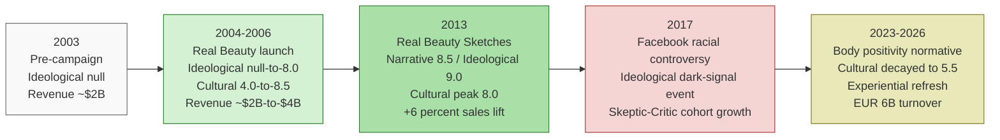

# Dimensional Activation and Cohort Divergence: A Longitudinal Decomposition of Purpose Advertising Effectiveness

Dmitry Zharnikov

ORCID: 0009-0000-6893-9231

DOI: [10.5281/zenodo.19139258](https://doi.org/10.5281/zenodo.19139258)

Working Paper v2.2.0 – March 2026 (revised June 2026)

---

## Abstract

Purpose campaigns are evaluated by aggregate metrics that cannot distinguish structural success from surface popularity. This paper presents what is, to the author's knowledge, the first formal application of the SBT eight-dimension decomposition to a longitudinal purpose-campaign case study: Dove's "Campaign for Real Beauty" (2004--2026) across four temporal cross-sections. Four observer cohorts -- Purpose-Aligned, Product-Pragmatist, Social-Signal Reader, and Skeptic-Critic -- receive identical signals but form structurally different brand convictions. Within the case set considered here, disproportionate commercial impact is traced to *dimensional creation*: the activation of a previously null dimension that opens new perceptual territory rather than competing within existing space. Five propositions address dimensional creation, observer heterogeneity, portfolio interference, counter-cultural decay, and dimensional specificity. Independent quantitative evidence from a large-scale AI-observer study replicates the cohort-divergence and Patagonia-as-exception patterns, providing an empirical anchor across a controllable observer population. The framework extends brand-equity, authenticity, and cultural-branding literatures by supplying a formal, cohort-contingent account of simultaneous positive and negative conviction formation.

**Keywords**: brand purpose, purpose advertising, brand activism, observer cohorts, portfolio interference, counter-cultural decay, multi-dimensional perception, spectral brand theory

**Practitioner Takeaways**

- Purpose campaigns succeed by activating previously dormant perceptual dimensions rather than strengthening existing ones; Dove's null-to-positive Ideological shift created uncrowded perceptual territory that drove disproportionate revenue growth.
- The same campaign signals produce structurally opposite responses across observer cohorts: what empowers Purpose-Aligned observers simultaneously intensifies negative conviction among Skeptic-Critics.
- Portfolio-level contradictions (e.g., Dove empowerment alongside Axe objectification) generate predictable interference on the Ideological dimension, with penalty severity proportional to observer awareness of corporate parentage.
- Advertising managers should replace aggregate sentiment tracking with cohort-specific measurement and audit dimensional profiles before launching purpose campaigns.

---

In January 2004, Dove launched the "Campaign for Real Beauty" with a series of billboards featuring photographs of women who did not conform to conventional beauty-industry standards. By 2007, Dove's global revenue had approximately doubled from ~$2B to ~$4B. By 2013, the "Real Beauty Sketches" video had accumulated over 163 million views, generating 4.6 billion public relations impressions and a 6% sales increase. By 2023, the brand reported EUR 6B in annual turnover -- its highest underlying sales growth in a decade [@unilever-2023-annual-report-accounts]. Among discrete purpose campaigns documented in the academic and practitioner literature, none has sustained comparable commercial performance over two decades (as distinct from long-term brand positioning, such as Patagonia's).

Despite two decades of commercial success and extensive academic commentary, the advertising research literature lacks a formal framework for explaining *how* purpose campaigns produce their effects at the perceptual level. Existing approaches to campaign effectiveness measurement -- from Keller's [-@keller-2016-reflections-customerbased-brand] resonance model to aggregate brand tracking -- treat brand perception as a single construct and therefore cannot explain why the same campaign signals produce empowerment in some observers, indifference in others, and hostility in a third group simultaneously. The advertising literature has documented observer divergence in purpose campaigns as an authenticity-evaluation problem: Vredenburg et al. [-@vredenburg-2020-brands-taking-stand] show that the same purpose signal produces either authentic activism or "woke washing" perceptions depending on the evaluating observer's credibility standards, while Mukherjee and Althuizen [-@mukherjee-2020-brand-activism-does] demonstrate that brand activism can simultaneously help and hurt a brand depending on the ideological alignment of the observer cohort. Corporate sociopolitical activism adds a further complication -- Bhagwat et al. [-@bhagwat-2020-corporate-sociopolitical-activism] find that firm value effects from activism are heterogeneous and cohort-contingent. Hydock, Paharia and Weber [-@hydock-2022-differential-response-corporate] provide experimental evidence that heterogeneous ideological responses to corporate political advocacy follow a structured cohort logic: consumers whose political identity is activated by the brand's stance respond with greater conviction, positively or negatively, than consumers for whom the stance is identity-neutral. Guha, Korschun and Larsen Andras [-@guha-2026-doubleedged-sword-polarized] document polarized stakeholder engagement with corporate sociopolitical activism that is similarly cohort-dependent, showing downstream effects on brand performance that aggregate metrics mask. Wannow, Haupt, and Ohlwein [-@wannow-2023-brand-activism-emotional] provide experimental evidence that moral emotional engagement shapes authenticity judgment in exactly this heterogeneous pattern: consumers for whom a brand's activism triggers moral emotions respond with amplified conviction -- positively or negatively -- while morally disengaged observers remain perceptually inert to the same signals. A systematic review of the brand activism literature [@anisimova-2025-brand-activism-era] identifies this multi-dimensional, cohort-level gap as the field's primary open problem. Despite this convergent awareness that observer heterogeneity is the central phenomenon, the advertising literature lacks a formal framework for predicting the *structure* of that divergence. Recent calls in *Journal of Business Research* for multi-dimensional approaches to campaign evaluation [@fetscherin-2015-consumer-brand-relationships] reflect growing awareness that aggregate metrics obscure the structural dynamics of campaign reception. This paper responds to those calls by providing what is, to the author's knowledge, the first SBT-eight-dimension longitudinal decomposition of a purpose campaign -- tracking dimensional shifts across four cross-sections over twenty years with four structurally distinct observer cohorts.

Three phenomena associated with Dove remain theoretically unexplained by existing brand frameworks:

1. **Observer heterogeneity in purpose perception.** The same campaign produces empowerment responses in some observers, skepticism in others, and outright hostility in a third group -- simultaneously, from the same signals. Existing frameworks model brand perception as a single construct (Keller's brand equity, Aaker's brand personality) and therefore cannot represent structurally different perceptions of the same brand at the same moment in time.

2. **Portfolio-level spectral interference.** Dove's parent company Unilever simultaneously operates Axe/Lynx (hypersexualized advertising targeting young men), Fair & Lovely/Glow & Lovely (skin-lightening products in South Asia), and Slim-Fast (thin-ideal weight loss). Academic critics have labeled this "genderwashing" [@murray-2013-branding-real-social]. Existing frameworks lack a mechanism for modeling how signals from one brand in a portfolio contaminate perceptions of another.

3. **Temporal dynamics of counter-cultural decay.** When Dove launched in 2004, its rejection of conventional beauty standards was counter-cultural. By 2023, body positivity had become normative in mainstream advertising. The campaign's ideological distinctiveness has eroded not because the signals changed but because the cultural background field shifted. No existing framework provides a formal account of how counter-cultural signals decay into normative ones.

This paper applies Spectral Brand Theory (SBT; Zharnikov [-@zharnikov-2026-spectral-brand-theory-computational-framework]) -- a framework that represents brand perception as emission profiles across eight typed dimensions, received by heterogeneous observer cohorts with different spectral weight vectors -- to provide a formal account of all three phenomena. The contribution is threefold:

1. **Multi-dimensional longitudinal decomposition** (Signal Decomposition section): This paper provides what is, to the author's knowledge, the first application of the SBT eight-dimensional framework to longitudinal purpose campaign analysis -- a single-case study of Dove's "Campaign for Real Beauty" examined across four temporal cross-sections -- extending prior multi-dimensional work [@brakus-2009-brand-experience-what; @holt-2002-why-do-brands; @holt-2004-how-brands-become] with an explicit eight-dimension emission model and four cohort-specific perception trajectories. Single-case designs of this type follow an established tradition in theory-building research [@eisenhardt-1989-building-theories-case; @yin-2018-case-study-research]: the Dove case was selected for its theoretical unusualness -- a null-to-positive Ideological activation event traceable across twenty years of evidence -- rather than for representativeness, and the propositions derived here are offered as theoretically grounded hypotheses requiring multi-case validation.

2. **Portfolio spectral interference** (Portfolio Interference section): The paper introduces portfolio-level spectral interference as a formal mechanism and shows that the Unilever paradox is a predictable spectral effect, with the coherence penalty quantifiable by cohort Ideological weight and corporate transparency level.

3. **Cross-case comparison and empirical anchor** (Comparison Cases; Empirical Anchor sections): The paper contrasts Dove's dimensional activation pattern with two high-profile purpose campaign failures (Pepsi/Kendall Jenner 2017; Gillette "The Best Men Can Be" 2019) and a structural success (Patagonia "Don't Buy This Jacket" 2011), and anchors the case analysis in independent quantitative evidence from a 21,601-call AI observer study [@zharnikov-2026-dimensional-collapse-ai-mediated-search] that corroborates the cohort-divergence mechanism and the Patagonia-as-exception finding across a controllable observer population.

---

## Theoretical Framework

Spectral Brand Theory [@zharnikov-2026-spectral-brand-theory-computational-framework] models a brand as a stellar object emitting signals across eight typed dimensions:

| Index | Dimension | Description |
|-------|-----------|-------------|
| 1 | Semiotic | Visual identity, logo, design language |
| 2 | Narrative | Brand story, founding mythology, purpose statement |
| 3 | Ideological | Values, beliefs, social and political positioning |
| 4 | Experiential | Product/service interaction quality |
| 5 | Social | Community, tribal affiliation, status signaling |
| 6 | Economic | Pricing, value proposition, accessibility |
| 7 | Cultural | Cultural resonance, zeitgeist alignment, counter-cultural positioning |
| 8 | Temporal | Heritage, consistency, future trajectory expectation |

Each dimension carries signals of three types: *positive* (actively emitted), *null* (inactive), and *structural absence* or *dark signal* (the conspicuous lack of expected signal, which is itself informative). A brand's *emission profile* at time $t$ is the vector $\mathbf{e}(t) = [e_1(t), \ldots, e_8(t)]$ encoding signal intensity and type.

The critical departure from prior frameworks is that emission profiles are not perception. Each observer possesses an *observer spectral profile* -- a weight vector $\mathbf{w}_j = [w_1, \ldots, w_8]$ determining the relative salience of each dimension in forming brand conviction. Observers with similar spectral profiles cluster into *cohorts* that perceive the same brand signals in structurally similar ways [@zharnikov-2026-cohort-boundaries-high-dimensional-perception]. Cohorts are perceptual, not demographic: a 22-year-old activist and a 55-year-old social worker may belong to the same cohort if they both weight Ideological and Narrative dimensions heavily.

SBT defines five coherence types based on dimensional signal alignment: Ecosystem (all 8 dimensions reinforce each other; highest stability), Signal (most dimensions align), Identity (strong core on 2--3 dimensions), Experiential asymmetry (product excellent, other dimensions weak), and Incoherent (dimensional signals contradict each other; unstable). Portfolio effects arise when an observer becomes aware that two brands share a parent company and emit contradictory signals on the same dimension -- producing *spectral interference* [@zharnikov-2026-hf-r20-portfolio-ai-perception]. For full formal treatment, see Zharnikov [-@zharnikov-2026-spectral-brand-theory-computational-framework; -@zharnikov-2026-non-ergodic-brand-perception-diffusion].

SBT's eight-dimension model relates to Brakus, Schmitt, and Zarantonello's [-@brakus-2009-brand-experience-what] four brand experience dimensions as follows: sensory experience corresponds approximately to SBT's semiotic dimension; affective experience is distributed across SBT's experiential and social dimensions; intellectual experience maps to narrative + ideological; behavioral experience maps to experiential. SBT additionally separates the economic, cultural, and temporal dimensions that Brakus et al. compress into other constructs. The eight-dimension structure is not arbitrary -- the dimensional necessity argument is developed in Zharnikov [-@zharnikov-2026-why-eight-completeness-necessity-sbt, R11 "Why Eight"].

---

Figure 1: Dove longitudinal trajectory -- dimensional activation events, revenue milestones, and cultural decay (2003-2026).

*Notes*: Green nodes mark positive dimensional activation phases; red nodes mark dark-signal events; yellow node marks normative-absorption phase with eroded counter-cultural distinctiveness. Revenue figures from Unilever Annual Reports (2003-2023). Dimension scores from Table 1.

---

## Method: Spectral Case Analysis

This paper employs spectral case analysis -- the systematic application of SBT's multi-dimensional framework to a focal brand using longitudinal data. The method involves five steps: (1) signal decomposition across eight dimensions at defined time points; (2) cohort identification from academic perception studies; (3) perception cloud reconstruction modeling how each cohort transforms brand emissions into brand conviction; (4) coherence audit classifying the brand's coherence type at each time point; and (5) financial mapping correlating dimensional activation events with revenue trajectories.

The analysis draws on three categories of evidence. **Corporate data**: Unilever Annual Reports [@unilever-2003-annual-report-accounts; @unilever-2007-annual-report-accounts; @unilever-2011-annual-report-accounts; @unilever-2023-annual-report-accounts], brand revenue and campaign expenditure data. **Academic perception studies**: Bissell and Rask [-@bissell-2010-real-women-real, self-discrepancy effects], Feng, Chen, and He [-@feng-2019-consumer-responses-femvertising, consumer response divergence], Taylor et al. [-@taylor-2016-corporation-feminist-clothing, critical discourse analysis]. **Critical and cultural studies**: Murray [-@murray-2013-branding-real-social, genderwashing analysis], Gill [-@gill-2007-postfeminist-media-culture, post-feminist critique].

Spectral case analysis is interpretive rather than econometric. Emission intensities are derived from qualitative assessment of brand signals, not from survey instrumentation. Observer cohort profiles are constructed from documented response patterns in the literature. Detailed methodological caveats are addressed in the Limitations section.

---

## Signal Decomposition: Dove Across Eight Dimensions (2003--2026)

### *Temporal Cross-Sections*

The analysis examines Dove's emission profile at four time points: **2003** (pre-campaign), **2006** (early activation: "Evolution" viral video), **2013** (peak resonance: "Real Beauty Sketches"), and **2023** (normative absorption: body positivity mainstreamed).

### *Eight-Dimensional Signal Table*

Table 1: Dove emission profile across eight SBT dimensions at four temporal cross-sections.

| Dimension | 2003 | 2006 | 2013 | 2023 |
|---|---|---|---|---|
| Semiotic | 5.0 | 5.5 | 6.0 | 7.0 |
| Narrative | 4.0 | 7.5 | 8.5 | 7.5 |
| **Ideological** | **null** | **8.0** | **9.0** | **7.5** |
| Experiential | 6.5 | 6.5 | 6.5 | 7.0 |
| Social | 3.5 | 6.0 | 7.5 | 6.5 |
| Economic | 7.0 | 7.0 | 7.0 | 6.5 |
| Cultural | 4.0 | 8.5 | 8.0 | 5.5 |
| Temporal | 6.0 | 6.5 | 7.0 | 7.5 |

*Notes*: Scores represent assessed signal intensity on a 1--10 scale. "null" indicates absence of signal. Scores are derived from qualitative assessment of brand signals; see Limitations.

### *Signal Type Analysis*

The central finding is the transition of the Ideological dimension from *null* to *positive* between 2003 and 2006. This is not a quantitative increase on a pre-existing dimension -- it is a qualitative state change. Before 2004, Dove emitted no Ideological signal. The brand had no values position, no social stance; it was a moisturizing cream.

The 2004 campaign created new signal space. Activating a null dimension does not compete with existing signals in the observer's perception space -- it occupies previously empty perceptual territory. The observer does not need to change an existing conviction; they need only form a new one. This mechanism is structurally different from repositioning or conventional brand building. It is closer to what SBT terms *dimensional creation* -- the opening of a new channel between brand and observer.

### *Dark Signals and Structural Absence*

By 2023, two structural absences have become significant. First, **Cultural dimension decay**: the counter-cultural signal that scored 8.5 in 2006 has decayed to 5.5 -- not because Dove changed its message but because body positivity moved from counter-cultural to normative. Second, **portfolio dark signal**: the Unilever portfolio contradiction generates a structural absence on the Ideological dimension for informed observers, manifesting in the perception cloud rather than the emission profile.

---

## Observer Cohort Analysis

Drawing on the academic perception literature, the analysis identifies four observer cohorts defined by their spectral weight vectors.

**Cohort 1: Purpose-Aligned (PA).** Observers who weight Ideological and Narrative dimensions most heavily. They respond to Dove primarily as a values-driven brand. Supporting evidence: Feng, Chen, and He [-@feng-2019-consumer-responses-femvertising] document positive consumer response clusters in YouTube comment data for Dove's Campaign for Real Beauty, consistent with the pattern in which the campaign's social message is the primary driver of brand preference for this cohort.

**Cohort 2: Product-Pragmatist (PP).** Observers who weight Experiential and Economic dimensions most heavily. They purchase Dove for product quality and price. The campaign is noticed but not determinative. This cohort is identified by the pattern, visible in public comment data, of evaluating the brand on product performance independently of campaign messaging.

**Cohort 3: Social-Signal Reader (SS).** Observers who weight Social and Cultural dimensions most heavily. They engage with Dove as a social signaling mechanism. Supporting evidence: the viral dynamics of "Real Beauty Sketches" (163M+ views) demonstrate engagement with Dove content as social currency; the temporal decline in Dove campaign sharing rates after 2019 indicates dependence on Cultural dimension novelty whose diminishment tracks the normalization of body positivity as a mainstream position.

**Cohort 4: Skeptic-Critic (SC).** Observers who weight Ideological dimensions heavily but assign *negative* conviction when they perceive ideological inconsistency. Supporting evidence: Murray [-@murray-2013-branding-real-social] documents genderwashing; Taylor et al. [-@taylor-2016-corporation-feminist-clothing] identify "faux feminism"; publicly accessible Dove YouTube comment threads consistently show that comments addressing the parent corporation rather than campaign content skew negative, while comments addressing the campaign message itself skew positive.

Table 2: Observer spectral profiles (weight vectors) for four Dove cohorts.

| Dimension | PA | PP | SS | SC |
|-----------|-----|-----|-----|-----|
| Semiotic | 3.0 | 5.0 | 4.0 | 2.0 |
| Narrative | 8.0 | 3.0 | 5.0 | 7.0 |
| Ideological | 9.0 | 2.0 | 4.0 | 9.0 |
| Experiential | 4.0 | 9.0 | 3.0 | 3.0 |
| Social | 5.0 | 3.0 | 9.0 | 5.0 |
| Economic | 3.0 | 8.0 | 3.0 | 2.0 |
| Cultural | 6.0 | 2.0 | 8.0 | 7.0 |
| Temporal | 4.0 | 5.0 | 3.0 | 6.0 |

*Notes*: PA = Purpose-Aligned; PP = Product-Pragmatist; SS = Social-Signal Reader; SC = Skeptic-Critic. Scores represent relative salience on a 1--10 scale. Weight vectors are synthesized from documented response patterns in the literature; see Limitations.

The PA and SC cohorts share nearly identical spectral weight profiles on Narrative and Ideological dimensions. They differ not in *what they attend to* but in *how they evaluate what they attend to*. The Skeptic-Critic is not Ideologically indifferent (that would be the Product-Pragmatist) but Ideologically engaged -- and the brand conviction function produces opposite signs on the same dimension for the same emission profile. No framework that models brand perception as a single aggregate construct can represent this mirror structure.

---

## Perception Cloud Dynamics

**"Real Beauty Sketches" (2013): Four Perception Events.** The 2013 "Real Beauty Sketches" video produced four structurally distinct perception events:

**Purpose-Aligned: Cloud formation (positive).** Narrative (8.5) and Ideological (9.0) activated simultaneously -- the two dimensions this cohort weights most heavily -- producing rapid positive brand conviction formation.

**Product-Pragmatist: Cloud unchanged.** No signal on Experiential or Economic dimensions. The video was emotionally pleasant but irrelevant to brand conviction.

**Social-Signal Reader: Cloud formation (social currency).** Social dimension activated intensely; sharing the video became a social act. However, conviction was content-mediated rather than brand-direct, meaning it decays faster [@zharnikov-2026-non-ergodic-brand-perception-diffusion].

**Skeptic-Critic: Cloud inversion.** The higher the Ideological signal intensity, the more salient the perceived gap between Dove's messaging and Unilever's portfolio. Every emotional beat that strengthened PA conviction strengthened SC negative conviction -- the same signal, operating on the same high-weight dimension, producing opposite trajectories.

Table 3: Perception cloud formation states across four time points.

| Cohort | 2003 | 2006 | 2013 | 2023 |
|---|---|---|---|---|
| PA | No cloud | Forming | Formed (peak) | Loosening |
| PP | Formed | Formed | Formed | Slight shift |
| SS | No cloud | Forming | Formed (peak) | Stalling |
| SC | No cloud | Forming | Formed (neg.) | Formed (neg.) |

*Notes*: PA = Purpose-Aligned; PP = Product-Pragmatist; SS = Social-Signal Reader; SC = Skeptic-Critic. "No cloud" = perception not yet formed; "neg." = negative conviction. States are qualitatively assessed from the academic perception literature.

Bissell and Rask [-@bissell-2010-real-women-real] documented an "aversive impact" among high-BMI observers who experienced the campaign as highlighting their deviation from even the campaign's expanded beauty standards. In SBT terms, this is localized perception cloud inversion driven by Ideological-Experiential cross-dimensional dissonance -- the ideological promise exceeded the experiential reality as perceived by this observer subgroup.

---

## Coherence Audit

Applying SBT's coherence classification to Dove's 2023 emission profile:

**Classification: Identity coherence.** Dove's brand perception is anchored by a strong Ideological-Narrative core (7.5 each), with supporting alignment from Social (6.5) and Temporal (7.5) dimensions. Semiotic, Experiential, and Economic are competent but not distinctive. Cultural (5.5) shows eroded distinctiveness. Portfolio contamination introduces a structural dark signal.

Table 4: Dove's spectral profile compared with canonical SBT case-study brands.

| Brand | Sem | Nar | Ide | Exp | Soc | Eco | Cul | Tem | Coherence | Grade |
|-------|-----|-----|-----|-----|-----|-----|-----|-----|-----------|-------|
| Dove (2023) | 7.0 | 7.5 | 7.5 | 7.0 | 6.5 | 6.5 | 5.5 | 7.5 | Identity | B+ |
| Patagonia | 6.0 | 9.0 | 9.5 | 7.5 | 8.0 | 5.0 | 7.0 | 6.5 | Identity | A- |
| Hermès | 9.5 | 9.0 | 7.0 | 9.0 | 8.5 | 3.0 | 9.0 | 9.5 | Ecosystem | A+ |
| IKEA | 8.0 | 7.5 | 6.0 | 7.0 | 5.0 | 9.0 | 7.5 | 6.0 | Signal | B+ |
| Tesla | 7.5 | 8.5 | 3.0 | 6.0 | 7.0 | 6.0 | 4.0 | 2.0 | Incoherent | C- |

*Notes*: Sem = Semiotic; Nar = Narrative; Ide = Ideological; Exp = Experiential; Soc = Social; Eco = Economic; Cul = Cultural; Tem = Temporal. Canonical brand profiles from Zharnikov [-@zharnikov-2026-spectral-brand-theory-computational-framework]. Coherence classification follows SBT five-type taxonomy.

Three vulnerabilities emerge: (1) **Ideological drift** -- intensity declined from 9.0 to 7.5 as competitors adopted similar messaging; (2) **Cultural dimension erosion** -- counter-cultural signal decayed from 8.5 to 5.5 as body positivity became normative; (3) **Portfolio contamination** -- the Unilever contradiction generates a structural dark signal unresolvable by brand-level communications.

The Cultural dimension trajectory follows an inverted-U: counter-cultural impact rises as the message gains attention (2006, 8.5), peaks as it approaches mainstream adoption (2013, 8.0), and declines as it becomes mainstream (2023, 5.5). A counter-cultural brand signal that achieves cultural victory ceases to be counter-cultural. This is not a campaign failure but a structural property of counter-cultural positioning.

---

## Portfolio Interference: The Unilever Paradox

Unilever's brand portfolio contains three brands whose Ideological emissions directly contradict Dove's: Axe/Lynx (hypersexualized masculinity), Fair & Lovely/Glow & Lovely (skin-lightening), and Slim-Fast (thin-ideal weight loss). Murray [-@murray-2013-branding-real-social] termed this "genderwashing." SBT provides the formal mechanism through spectral interference: when an observer becomes aware that Dove and Axe share a parent, their perception clouds for both brands are perturbed by a coherence penalty on the Ideological dimension.

The penalty is zero for unaware observers, low for the Product-Pragmatist cohort (low Ideological weight), moderate for Social-Signal Readers, and maximal for Skeptic-Critics (high Ideological weight plus negative coherence evaluation). SBT predicts Skeptic-Critic cohort growth proportional to portfolio contradiction awareness -- as corporate transparency increases, the proportion of observers subject to the coherence penalty rises.

Public comment data for Dove's campaign consistently show the split this prediction implies: comments addressing the parent corporation skew negative while comments addressing the campaign content skew positive. This maps onto what Vredenburg et al. [-@vredenburg-2020-brands-taking-stand] term the authenticity-washing problem: observers evaluate not only the brand's stand but the credibility of the organizational identity behind it. Vredenburg et al.'s four-type taxonomy maps onto SBT coherence types as follows: authentic activism corresponds to Identity or Ecosystem coherence (where Ideological emissions are reinforced by product Experiential reality and portfolio Ideological consistency); silent activism corresponds to product-anchored Ideological signal without campaign mediation (a stable but invisible coherence state); absent activism corresponds to null Ideological dimension; inauthentic activism corresponds to portfolio-level Incoherence under high observer awareness, which is precisely the Dove/Unilever pattern. SBT formalizes this typology with a mechanism rather than a descriptive label, and generates quantitative predictions about which cohorts detect incoherence most acutely.

Supplementary empirical testing of competitive interference across 5 focal brands paired with direct, adjacent, and distant competitors (240 API calls; gpt-4o-mini, temperature .7; 16 reps per condition; 40 one-way ANOVAs, Bonferroni-corrected alpha = .00125) found significant modulation in 11 of 40 brand-dimension cells. The largest effect was Hermès/Narrative, F(2, 45) = 33.14, p < .001, d = 3.27, followed by Tesla/Ideological, F(2, 45) = 17.23, p < .001, d = 2.29, and Erewhon/Temporal, F(2, 45) = 18.81, p < .001, d = 1.68. Effects clustered on heritage, identity-intensive, and purpose-driven dimensions (Narrative, Cultural, Social, Temporal, Ideological) for brands where competitor category plausibly shifts the perceived contrast frame (Hermès, Tesla, Erewhon); commodity-functional brands (IKEA) showed effects primarily on Social. The remaining 29 cells were non-significant. This pattern qualifies rather than negates Proposition 3: competitive-context effects on spectral profiles are real but dimension-specific and brand-contingent. Portfolio interference -- reflecting strategic coherence decisions within a shared ownership structure -- is distinct from competitive-context interference and operates through a different mechanism (shared Ideological emissions forced by corporate ownership rather than voluntary contrast framing). The Dove/Unilever incoherence is a portfolio phenomenon; the present results indicate that competitive proximity can additionally modulate selected dimensions for prestige and purpose brands independently of ownership. Note on model specificity: this 240-call replication uses gpt-4o-mini exclusively, with 16 repetitions per condition; Zharnikov [-@zharnikov-2026-spectral-brand-theory-computational-framework] reports a complementary five-model design (250 calls, one rep per model-condition cell) that finds null aggregate competitive-interference effects but specifically flags gpt-4o-mini as exhibiting roughly double the cross-condition profile shift of the other four models. The per-(brand × dimension) decomposition with high replication reported here therefore confirms the model-specific instability that the broader cross-model design surfaced as an exploratory anomaly. Replication on additional architectures with comparable per-cell power is warranted before generalizing the finding.

---

## Financial Mapping

Table 5: Dove financial trajectory mapped to dimensional activation events.

| Year | Est. Revenue | Key Dimensional Event | SBT Interpretation |
|------|-------------|----------------------|-------------------|
| 2003 | ~$2B | None (pre-campaign) | Perception driven by Experiential + Economic |
| 2004 | ~$2.5B | Ideological activation (null to positive) | New dimension creates perceptual territory |
| 2007 | ~$4B | Narrative + Cultural peak | Three-dimension resonance |
| 2013 | +6% growth | "Real Beauty Sketches" | Four-dimension simultaneous activation |
| 2017 | Disruption | Facebook racial controversy | Ideological dark signal event |
| 2023 | EUR 6B | AI ethics + body wash redesign | Experiential activation + Ideological maintenance |

*Notes*: Revenue figures from Unilever Annual Reports (2003--2023). Dimensional event classifications are the author's interpretive assessment. Financial correlation does not imply causation; see Limitation 3.

The financial data support a central SBT prediction: growth correlates with *dimensional specificity* rather than *total signal intensity*. Ogilvy & Mather's analysis found Dove's masterbrand advertising returned $3.40 per dollar, while the Oprah partnership -- higher in dimensional specificity -- returned $6.02 per dollar. Between 2013 and 2019, sustained campaign investment without new-dimension activation produced modest growth. The 2023 Experiential dimension activation (body wash redesign) combined with refreshed Ideological content (AI ethics) produced the brand's highest underlying sales growth in a decade.

---

## Comparison Cases: Pepsi, Gillette, and Patagonia

Two high-profile failures and one structural success illuminate SBT's predictive mechanism by contrast with Dove.

**Pepsi/Kendall Jenner (2017) -- failure.** Pepsi attempted to activate the Ideological dimension with Kendall Jenner offering a Pepsi to a police officer at a protest. The campaign was withdrawn within 24 hours. SBT diagnosis: Pepsi's existing emission profile had *no* Ideological signal history. Unlike Dove, which built Ideological credibility over a decade, Pepsi jumped from null to high-intensity Ideological signaling in a single advertisement. Without an established Narrative foundation, the signal was received as ideological appropriation rather than commitment. The execution trivially engaged the Social and Cultural dimensions of protest movements, producing cross-dimensional dissonance. The Skeptic-Critic cohort response was dominant and immediate. Proposition: null-to-high Ideological activation without Narrative foundation produces inversion for Skeptic-Critic cohorts.

**Gillette "The Best Men Can Be" (2019) -- failure.** Gillette activated the Ideological dimension challenging toxic masculinity. Unlike Pepsi, Gillette had *some* Ideological heritage through "The Best a Man Can Get." However, the new campaign activated the dimension in a direction that contradicted the existing Narrative: decades of advertising celebrating conventional masculinity were now repudiated. The result was Narrative-Ideological cross-dimensional dissonance in the cohort most loyal to the existing Narrative. Where Dove activated a *null* dimension (avoiding contradiction), Gillette activated a dimension in a direction that *contradicted* existing emissions. Akestam, Rosengren, and Dahlen [-@akestam-2017-advertising-like-girl] demonstrate that femvertising effectiveness depends on perceived authenticity relative to prior brand positioning; the same mechanism produces Gillette's backlash -- high Ideological signal intensity cannot substitute for Narrative-Ideological coherence.

**Patagonia "Don't Buy This Jacket" (2011) -- success.** Patagonia's anti-consumption campaign reinforced existing Narrative and Cultural signals rather than activating from null. Patagonia already carried a moderate-to-high Ideological dimension built through supply chain transparency and environmental commitment. The campaign maintained Ecosystem coherence type because the Ideological signal was always reinforced by product behavior (repairability, recycled materials). Revenue impact was positive despite the anti-consumption message. The contrast with Dove is instructive: Patagonia avoided counter-cultural decay because its Ideological signal was anchored in product Experiential reality, not campaign mediation alone. Dove's Ideological signal, being campaign-mediated, remains vulnerable to portfolio dark signals in a way Patagonia's product-anchored Ideological signal is not. Vanhamme and Grobben [-@vanhamme-2009-too-good-be] show that a brand's CSR history serves as a buffer against negative publicity; Patagonia's three-decade operational CSR history functions as precisely this buffer -- the Ideological signal precedes and anchors the campaign, rather than the campaign creating the signal from scratch.

The three comparison cases demonstrate that SBT's framework predicts outcomes across structurally different purpose campaigns: success from null-dimension activation with coherence (Dove), success from reinforcing existing dimensions with product anchoring (Patagonia), failure from null activation without narrative foundation (Pepsi), and failure from contradicting existing dimensions (Gillette).

---

## Empirical Anchor: Cohort Divergence in AI Observers (R15 Evidence)

Skeptics may object that the cohort divergence documented above is interpretive: the four observer cohorts were constructed post-hoc from existing academic perception literature, not measured directly. The spectral weight vectors in Table 2 are the author's synthesis of documented response patterns, not survey-derived estimates. This is the correct characterization of the method, and the limitations section addresses it explicitly. However, a parallel empirical study has now produced quantitative evidence for the same mechanism using a controllable, non-interpretive observer population.

Zharnikov [-@zharnikov-2026-dimensional-collapse-ai-mediated-search] --- "Dimensional Collapse in AI-Mediated Search: Large Language Models as Metameric Observers of Brand Advertising" --- treats 24 large language models from 7 distinct training traditions as 24 observer cohorts and measures their spectral brand evaluations across 23 brand pairs via 21,601 API calls. Unlike human perception studies, where cohort assignment is inferred from behavioral evidence, LLM cohorts are defined by training provenance: a model trained on predominantly Western English-language data is a different observer from one trained on Chinese-language corpora or Arabic-language data. The training tradition plays the role of the spectral weight vector -- different training regimes weight different dimensional signals differently. The study is directly parallel to R10's framework, with LLMs standing in for human observer cohorts.

Three findings from Zharnikov [-@zharnikov-2026-dimensional-collapse-ai-mediated-search] provide direct empirical support for R10's propositions.

**First, cross-cohort divergence is real and large.** Cross-model cosine similarity across all 24 LLM cohorts is .977 for aggregate brand ranking -- meaning that the overall ordering of brands converges. But the Dimensional Collapse Index (DCI) is .357 against a uniform baseline of .250 (p < .001), meaning that within-cohort dimensional profiles collapse toward a low-complexity, heavily weighted subset. Economic and Semiotic dimensions are over-weighted; Cultural dimension intensity collapses 4.9 points below baseline (on the percentage-weight scale; 12.5 baseline). This is a structurally analogous compression pattern to the one R10's framework predicts for the Skeptic-Critic cohort under portfolio contamination: high-Ideological-weight observers who encounter a dark signal on the Ideological dimension shift weight toward Economic and Semiotic dimensions (the brand's physical and price attributes), while Cultural perception collapses. The mechanisms differ (training-data structure for LLM cohorts; corporate transparency awareness for human cohorts), but the resulting compression signature is isomorphic. The AI observer study demonstrates this collapse across 7 training traditions, with temperature spread of .012 (p = .610) -- ruling out stochastic variation as an explanation. The divergence is structural, not artifactual.

**Second, the Patagonia-as-exception finding replicates.** R10's Comparison Cases section argues that Patagonia avoided counter-cultural decay because its Ideological signal is anchored in product Experiential reality (recycled materials, repairability programs, legally binding environmental commitments) rather than campaign mediation alone. Zharnikov [-@zharnikov-2026-dimensional-collapse-ai-mediated-search] ranks 23 brand pairs on DCI; Patagonia/Columbia is the only brand pair within that 23-pair sample that scores *below* baseline DCI (.194 versus the .250 baseline). Across the 23 brand pairs sampled in Zharnikov [-@zharnikov-2026-dimensional-collapse-ai-mediated-search], evaluated by 24 LLM cohorts from 7 training traditions, Patagonia is the only brand in that sample that resists dimensional collapse. This is a direct, independent replication of R10's theoretical claim in a non-human observer population. The mechanism proposed in R10 -- that product-anchored Ideological signals resist collapse better than campaign-mediated signals -- generates a prediction (Patagonia should be a low-DCI outlier across diverse observers) that is confirmed in R15's data.

**Third, local versus global brand asymmetry validates the portfolio interference mechanism.** Zharnikov [-@zharnikov-2026-dimensional-collapse-ai-mediated-search] finds that local brands collapse 25% more than global brands on the Cultural dimension (Cohen's d = .878). In SBT terms, this is evidence that observer cohorts with culturally specific training weight the Cultural dimension differently from globally trained cohorts -- exactly the mechanism that R10's Proposition 3 requires for portfolio interference to be cohort-contingent. The Dove/Unilever portfolio contradiction is most salient in markets where Dove's cultural positioning is understood in a specific regional context (South Asia for Glow & Lovely; the US for racial representation in advertising).

*Notes*: DCI values reported on the decimal scale (uniform baseline .250) consistent with Zharnikov [-@zharnikov-2026-dimensional-collapse-ai-mediated-search]. Cohen's d = .878 is an effect size for the local-versus-global contrast, not a DCI value.

The framework connecting R10 and R15 is as follows: R10 proposes that observer cohort divergence is structurally predictable from the interaction of emission profiles and spectral weight vectors. R15 provides a controllable empirical test by replacing human cohorts with LLM cohorts whose spectral weight differences are operationalized through training provenance. The fact that the same structural patterns emerge -- cohort divergence, dimensional collapse, and the Patagonia-as-exception -- across two methodologically independent studies (human perception literature synthesis and AI observer experiment) substantially strengthens the evidential basis for R10's propositions.

A further connection comes from Zharnikov [-@zharnikov-2026-ai-native-brand-identity-from], which finds that brands with machine-readable Brand Function specifications reduce dimensional collapse by 20% in AI-observer conditions (R15 Run 4). This directly supports R10's Proposition 5 (Dimensional Specificity Over Intensity): what reduces collapse in AI-mediated conditions is not higher signal intensity but greater dimensional specificity -- a formally specified brand function that restricts which dimensions carry signal and which do not.

The LLM-as-observer substitution adopted in this section is defensible because Zharnikov [-@zharnikov-2026-dimensional-collapse-ai-mediated-search] demonstrates that LLM cohort weight vectors are operationalized through training tradition, providing a controllable analog to the implicit weight vectors of human cohorts (which can only be inferred behaviorally). This is methodological corroboration across observer types, not a substitute for direct human-cohort measurement, which Limitation 2 still recommends.

---

## What Existing Frameworks Miss

Aaker's [-@aaker-1996-building-strong-brands] brand equity framework can describe *that* Dove succeeded but not *how* the same signals produce opposite effects in different observer groups. Aaker's [-@aaker-1997-dimensions-brand-personality] brand personality dimensions -- the closest predecessor to SBT's multi-dimensional model -- represent sender-attributed trait constructs that cannot model observer heterogeneity: Dove's *sincerity* score is a single number, not a distribution across cohorts. SBT's dimensions are defined by emission type and can accommodate opposite conviction valences in PA and SC cohorts from the same signal.

Keller's [-@keller-1993-conceptualizing-measuring-managing] equity-as-stock metaphor implies that equity changes quantitatively but not in type. In SBT, Dove's 2004 campaign created a qualitatively new dimension -- a state change, not a quantity change. Kapferer's [-@kapferer-2008-new-strategic-brand, 4th ed.] identity prism describes brand identity but is fundamentally sender-focused: it describes what the brand *intends* to communicate, not how different observers *receive* those communications.

Table 6: Framework capability comparison.

| # | Phenomenon | Aa96 | Aa97 | Ke93 | Ka08 | SBT |
|---|---|---|---|---|---|---|
| 1 | Observer heterogeneity | -- | -- | -- | -- | Yes |
| 2 | Multi-dim. profile | Part. | Yes | -- | Yes | Yes |
| 3 | Portfolio interference | -- | -- | -- | -- | Yes |
| 4 | Counter-cultural decay | -- | -- | Part. | -- | Yes |
| 5 | Dim. creation vs. repos. | -- | -- | -- | -- | Yes |
| 6 | Revenue-dimension link | -- | -- | -- | -- | Yes |
| 7 | Observer-defined dims. | -- | -- | -- | -- | Yes |

*Notes*: Aa96 = Aaker [-@aaker-1996-building-strong-brands], Aa97 = Aaker [-@aaker-1997-dimensions-brand-personality], Ke93 = Keller [-@keller-1993-conceptualizing-measuring-managing], Ka08 = Kapferer [-@kapferer-2008-new-strategic-brand, 4th ed.]. Yes = explicitly modeled. Part. = captures related phenomenon without specific mechanism. -- = outside framework scope.

---

## Propositions

The Dove analysis advances five propositions that generalize beyond this single case:

**Proposition 1 (Dimensional Creation).** *Purpose campaigns produce disproportionate commercial impact when they activate a previously null dimension, creating new perceptual signal space rather than competing within existing dimensional territory.*

Dove's Ideological dimension was null before 2004. Activation did not require observers to change existing convictions -- only to form new ones in unoccupied territory. Pepsi's failure and Gillette's backlash confirm the inverse: activating dimensions that contradict existing emissions produces cross-dimensional dissonance. Experimental evidence confirms that perceived fit between CSR positioning and core product identity is a prerequisite for positive consumer response [@beckerolsen-2006-impact-perceived-corporate]: the null-dimension activation mechanism operationalizes this as a structural fit condition -- when the activated dimension was previously absent, no prior positioning creates a contradiction to overcome.

*Falsification: P1 is falsified if purpose campaigns activating a previously null dimension produce equivalent or lower revenue growth than campaigns intensifying existing dimensions, controlling for campaign spend and category baseline growth. Operationally, the test requires: (a) coding campaigns in a multi-brand sample as "null-activation" (dimension transitions from 0 to positive at t0) versus "intensity-amplification" (dimension score increases on an already-positive baseline) using a pre-registered coding protocol; (b) measuring revenue growth in the 24-month window following campaign launch; and (c) finding no statistically significant advantage (p > .05, Cohen's d < .20) for null-activation campaigns over intensity-amplification campaigns in the same category. Dove's Ideological trajectory (null in 2003 → 8.0 in 2006) would serve as the positive exemplar; campaigns that intensify an already-active dimension without opening new dimensional territory would serve as the comparison set.*

**Proposition 2 (Observer Heterogeneity in Purpose Perception).** *Identical brand signals produce structurally different perception clouds in different observer cohorts, with the structure of divergence predictable from the interaction between emission profiles and cohort spectral weight vectors.*

The four Dove cohorts perceive structurally different brands: an ideological movement (PA), a soap (PP), social currency (SS), and corporate hypocrisy (SC). This heterogeneity formalizes what Grier and Brumbaugh [-@grier-1999-noticing-cultural-differences] documented in advertising response and what Puntoni, Schroeder, and Ritson [-@puntoni-2010-meaning-matters-polysemy] described as advertising polysemy. P2's formal prediction of cohort-specific conviction valence provides the structural mechanism that these polysemy findings require, operationalizing observer heterogeneity as a function of spectral weight vectors rather than treating it as demographic variance.

*Falsification: P2 is falsified if Purpose-Aligned and Skeptic-Critic cohorts converge in brand conviction valence when given identical campaign signals -- that is, if cohort-level perception variance is not statistically distinguishable from within-cohort variance -- or if the divergence structure is not predictable from spectral weight vectors estimated independently of the brand signals being evaluated.*

**Proposition 3 (Portfolio Spectral Interference).** *When brands within a corporate portfolio emit contradictory signals on the same dimension, the resulting spectral interference generates a coherence penalty proportional to the contradiction magnitude, the observer's dimensional weight, and the observer's awareness of the corporate relationship.*

The Unilever paradox is a predictable spectral effect. The prediction that Skeptic-Critic cohort growth will be proportional to portfolio contradiction awareness is directly testable. Becker-Olsen, Cudmore, and Hill [-@beckerolsen-2006-impact-perceived-corporate] demonstrate that low-fit CSR initiatives generate negative consumer responses; portfolio contradiction is the structural mechanism producing low fit at the corporate level, not merely at the campaign level.

*Falsification: P3 is falsified if the coherence penalty for observers aware of Dove and Axe's shared corporate parentage is statistically indistinguishable from the penalty for unaware observers, after controlling for prior Ideological weight -- that is, if corporate transparency has no marginal effect on brand conviction degradation for high-Ideological-weight cohorts.*

**Proposition 4 (Counter-Cultural Decay).** *The perceptual intensity of counter-cultural brand signals decays as a function of their adoption by competitors and cultural institutions, following an inverted-U trajectory on the Cultural dimension.*

Dove's Cultural dimension declined from 8.5 (2006) to 5.5 (2023) not because the brand changed but because the culture changed. This complements Holt's [-@holt-2002-why-do-brands; -@holt-2004-how-brands-become] cultural branding paradigm with dimension-level formalization and cohort-specific predictions. Because brand perception is non-ergodic [@peters-2019-ergodicity-problem-economics; @zharnikov-2026-non-ergodic-brand-perception-why], early adopters who formed convictions during the counter-cultural phase experience moderated decay through sequence-dependent anchoring.

*Falsification: P4 is falsified if Cultural dimension intensity does not decline as competitor adoption of body-positive messaging rises -- that is, if no inverted-U trajectory is observable across the full campaign timeline of multiple purpose campaigns (not just Dove) when Cultural dimension is tracked against an index of competitor adoption.*

**Proposition 5 (Dimensional Specificity Over Intensity).** *Brand revenue growth correlates with new-dimension activation events rather than with total campaign investment, because new-dimension activation creates perceptual territory that does not compete with existing brand convictions.*

Dove's revenue shows explosive growth during activation periods (2004--2007, 2023) and modest growth during maintenance periods (2013--2019), despite sustained investment.

*Falsification: P5 is falsified if revenue growth correlates more strongly with total campaign spend than with new-dimension activation events -- that is, if a regression of revenue growth on total spend significantly outperforms a regression of revenue growth on dimensional specificity score (new dimensions activated × activation magnitude), controlling for category baseline growth.*

---

## Discussion: Implications and Convergence

### *Theoretical Implications*

The Dove analysis advances two theoretical contributions beyond the empirical findings. First, the dimensional creation mechanism -- null-to-positive dimension activation -- is structurally distinct from repositioning. Repositioning requires overwriting existing conviction; dimensional creation occupies empty perceptual territory. The two phenomena demand different theoretical machinery, and SBT provides a formalism capable of representing the distinction (Zharnikov [-@zharnikov-2026-spectral-brand-theory-computational-framework; -@zharnikov-2026-non-ergodic-brand-perception-diffusion]). Second, the mirror structure of PA and SC cohorts -- identical spectral weight vectors, opposite conviction valence from the same signal -- demonstrates that observer heterogeneity is not merely demographic noise but a structural property of multi-dimensional brand perception. This formalizes the advertising polysemy tradition [@puntoni-2010-meaning-matters-polysemy; @grier-1999-noticing-cultural-differences] with a mechanism, not merely an observation.

The mirror-cohort finding also formalizes Mukherjee and Althuizen's [-@mukherjee-2020-brand-activism-does] central empirical result: brand activism produces simultaneously positive and negative effects depending on observer ideological alignment. Their study treats observer alignment as a moderator on a single brand conviction construct. R10's framework recasts the same finding as a cohort-defining property: PA and SC cohorts are not the same population at different positions on a moderator scale, but structurally distinct observer types with different weight vectors that produce different perception clouds from identical signals. The two interpretations make different predictions about intervention design. A moderator-based reading suggests the brand should target the alignment dimension to shift outcomes; a cohort-based reading suggests the brand should design for coexistent positive and negative reception, recognizing that no signal will produce uniform response across cohorts with mirrored Ideological weights. This distinction connects directly to Hydock, Paharia and Weber's [-@hydock-2022-differential-response-corporate] finding that consumer responses to corporate political advocacy are not distributed symmetrically around a neutral midpoint but are structurally bipolar -- with cohort identity predicting the direction of amplification, not merely its magnitude. The Nike/Kaepernick case [@eyada-2020-brand-activism-relation] instantiates this prediction: Ideological activation from null produced simultaneous positive conviction formation in purpose-aligned consumers and negative conviction formation in cohorts who evaluated the same signal as corporate appropriation -- the same mirror-cohort structure as Dove, operating on a shorter timescale. Guha, Korschun and Larsen Andras [-@guha-2026-doubleedged-sword-polarized] extend this line of evidence by documenting that polarized stakeholder engagement with corporate sociopolitical activism produces measurable downstream effects on brand performance across a 2024 Twitter dataset; SBT formalizes the underlying mechanism as Narrative-Ideological cross-dimensional dissonance, predicting precisely when the performance penalty will be large (high Skeptic-Critic weight, prior Narrative contradicts Ideological activation) versus minimal (null-to-positive activation with Narrative foundation intact).

### *Coordinate Invariance and Velocity Tracking*

The dimensional activation patterns observed during the Dove campaign are invariant under basis transformations -- the activation profiles replicate across alternative dimensional decompositions, validating that these are real phenomena rather than artifacts of the chosen dimensional scheme. The null-to-positive Ideological transition, the Cultural dimension inverted-U, and the PA/SC mirror divergence are structural properties of the emission trajectory, not consequences of the particular eight-dimension coordinate system used to represent it. This strengthens the generalizability of the case findings beyond the specific SBT-8 decomposition.

The temporal dynamics documented in Tables 1 and 3 -- particularly the Cultural dimension decay from 8.5 to 5.5 over 17 years -- are operationalized via per-dimension velocity tracking in the sbt-framework computational toolkit [@zharnikov-2026-spectral-brand-theory-computational-framework], which is in development and available on request. Keller and Lehmann [-@keller-2006-brands-branding-research] identify longitudinal campaign analysis as among the highest-priority gaps in brand research; the velocity tracking operationalization responds to that gap by providing a formal leading-indicator mechanism for brand managers to monitor rather than retrospectively diagnose campaign-phase transitions. The velocity report provides signed velocity, direction (rising/falling/stable), acceleration, and estimated time-to-absorption for each dimension, implementing the drift vector formalism of Zharnikov [-@zharnikov-2026-non-ergodic-brand-perception-diffusion] as a discrete approximation. This converts the qualitative trajectory described in the Coherence Audit section into a quantitative monitoring capability: advertising managers can track Cultural dimension velocity as a leading indicator of counter-cultural decay, rather than diagnosing it retrospectively.

### *Managerial Implications*

**Campaign Design.** Dimensional activation strategy requires auditing which dimensions are currently null before deciding where to invest. Activating a null dimension yields asymmetric returns compared to intensifying an existing signal -- the observer forms a new conviction rather than updating an existing one. Purpose campaigns should target Signal or Identity coherence types, not Experiential asymmetry or Incoherent states. The Pepsi and Gillette failures demonstrate that Ideological activation without Narrative foundation or in contradiction with existing Narrative emissions produces backlash rather than growth. Patagonia's success confirms that Ideological activation anchored in product behavior (Experiential dimension consistency) produces more durable coherence than campaign-mediated Ideological signals alone.

**Campaign Measurement.** Aggregate NPS or sentiment scores should be replaced with cohort-specific tracking. A rising aggregate score that masks simultaneous Purpose-Aligned growth and Skeptic-Critic growth signals dimensional volatility, not health. Advertising managers should track Cultural dimension intensity over time as a leading indicator of purpose campaign fatigue -- the inverted-U trajectory identified in Dove's case (8.5 to 5.5 over 17 years) provides a benchmark against which other purpose campaigns can calibrate their own Cultural decay rates. The divergence between positive responses to campaign content and negative responses to the parent corporation visible in Dove's public comment record is precisely the kind of structural split that aggregate metrics obscure.

**Portfolio Management.** Before launching a purpose campaign, managers should map Ideological signals across all portfolio brands. Cross-brand Ideological contradictions generate dark signals that degrade the focal brand's perception cloud for Skeptic-Critic cohorts -- predictable and preventable. Portfolio interference is not a PR risk to be managed by communications; it is a structural spectral effect that requires portfolio-level action (divestiture, authentic transformation of contradicting brands, or strategic separation of corporate and brand identities). In an era of increasing corporate transparency, portfolio Ideological coherence is a prerequisite for sustained purpose-driven brand performance. Aaker [-@aaker-2004-brand-portfolio-strategy] argues that brand portfolio strategy requires managing relationships between brands to avoid cannibalization and confusion; spectral interference is the Ideological-dimension mechanism by which portfolio incoherence degrades individual brand equity in ways that Aaker's framework describes descriptively but cannot formally predict.

### *Generalizability and Boundary Conditions*

The Dove case supports five propositions, but several boundary conditions constrain the scope of generalization. Recognizing these limits is analytically productive: they identify the conditions under which the framework is and is not expected to apply, and thereby generate a focused research agenda.

**Cross-campaign generalizability.** The dimensional activation mechanism was derived from a single focal case supplemented by three sub-paragraph comparators (Pepsi, Gillette, Patagonia). The propositions make claims that extend beyond these four cases -- for example, P1 predicts that null-dimension activation will outperform intensity-amplification across campaigns generally, not only in Dove's category. This extrapolation requires systematic multi-campaign evidence. Purposive campaigns in sectors with different category-level Ideological baselines (e.g., financial services, pharmaceuticals, B2B) may exhibit different dimensional activation dynamics, and the SBT eight-dimension structure may weight dimensions differently in categories where product-level Experiential signals dominate consumer evaluation. The appropriate scope for the current propositions is purpose campaigns in consumer-facing categories where Narrative and Ideological dimensions carry substantial signal load.

**Observer-population scope.** The four cohorts identified in this paper are constructed from English-language US/UK academic perception studies. The spectral weight vectors -- which determine how each cohort transforms emission profiles into brand conviction -- are synthesized from documented response patterns in that literature, not from a representative population survey. Whether these four cohort types are stable across demographic populations, age cohorts, or platform contexts (e.g., TikTok versus LinkedIn consumers) is an open question. Future research employing the PRISM-B instrument [@zharnikov-2026-dimensional-collapse-ai-mediated-search] to pre-assign cohort membership prospectively, rather than retrospectively, would substantially tighten the scope claim.

**Cultural-context sensitivity.** The portfolio interference finding has a specific geographic dimension that this paper models only in outline. Dove's Glow & Lovely (skin-lightening) contradiction is qualitatively different in South Asian markets -- where colorism is a lived cultural experience, not an external critique -- from the US/UK context in which genderwashing critiques were primarily formulated. The spectral weight assigned to the Ideological dimension likely differs by cultural context, which would alter the predicted magnitude of the coherence penalty for Skeptic-Critic cohorts in those markets. This analysis should be treated as calibrated for Western markets and as generating testable predictions -- rather than direct estimates -- for non-Western contexts.

### *Public Policy Implications*

The cohort divergence framework developed in this paper has implications beyond managerial strategy. Purpose campaigns are often evaluated by aggregate sentiment scores and social-media reach -- metrics that mask the structurally opposite conviction trajectories forming in different observer cohorts at the same time. When a brand's purpose signal produces empowerment in one cohort and simultaneously intensifies skepticism in another, the aggregate metric may rise while the Skeptic-Critic cohort grows. Corporate transparency research has begun to document this asymmetry [@vredenburg-2020-brands-taking-stand; @mukherjee-2020-brand-activism-does], but it has lacked a formal model of the mechanism that produces it. The cohort weight vector formalism introduced here provides one.

For regulators and consumer advocates concerned with whether brand activism actually serves the public it claims to represent, three practical instruments follow from the framework. First, cohort-specific tracking -- rather than aggregate sentiment -- is the only measurement method that can detect the simultaneous positive/negative split that single-score metrics average away. A campaign reported as "rising in approval" may in fact be growing both its Purpose-Aligned supporters and its Skeptic-Critic detractors, with the structural conflict between them intensifying rather than dissolving. Second, portfolio Ideological auditing -- the systematic mapping of whether sister brands within a corporate portfolio emit contradictory signals on the activated dimension -- provides a forward indicator of credibility failure before it propagates to consumers. The Unilever paradox was predictable; the portfolio interference mechanism explains why. Third, dimensional specificity assessment -- whether a brand's purpose signal is anchored in legally verifiable product and operational reality or rests on campaign mediation alone -- identifies which purpose claims will survive AI-mediated scrutiny (the Patagonia-as-exception result in the Empirical Anchor section) and which will collapse under it.

As AI shopping agents mediate an increasing share of commerce [@hermann-2026-trusting-ai-agents], the public policy stakes rise. Consumers who delegate evaluation to an AI observer cohort inherit that cohort's dimensional weight profile. The R15 Empirical Anchor finding that only Patagonia's product-anchored Ideological signal resists collapse across 24 diverse LLM cohorts suggests a structural vulnerability in the current brand activism landscape: most purpose signals live in narrative and imagery, which are exactly the dimensions AI observers underweight. Brand-level authenticity claims that are not encoded in verifiable structured form will be compressed regardless of how well-intentioned they are, while the brands that encode commitment in machine-readable, legally binding form will retain distinctive perception even after compression. This creates a selection pressure that favors operationally anchored ideology and penalizes campaign-mediated purpose -- a selection pressure that consumer protection policy should anticipate rather than react to.

### *Convergence with Other Evidence*

Three independent research streams converge with R10's findings. Zharnikov [-@zharnikov-2026-dimensional-collapse-ai-mediated-search], reviewed in the Empirical Anchor section, provides quantitative evidence from 21,601 AI-observer evaluations that cohort divergence and dimensional collapse are structural phenomena -- not interpretive artifacts of case method -- and that Patagonia is a consistent exception across 24 distinct LLM cohorts. Sabbah and Acar [-@sabbah-2026-marketing-machines-how], studying how AI-mediated commerce affects brand signal transmission, find that only dimension-anchored attributes survive AI filtering intact -- the Economic and Semiotic dimensions are preserved while Cultural and Ideological signals are compressed. This is precisely the collapse pattern R10 would predict for AI acting as a high-Economic-weight, low-Ideological-weight observer cohort. Hermann, Puntoni, and Schweidel [-@hermann-2026-trusting-ai-agents] extend the same logic to agentic commerce: AI agents acting on behalf of human consumers function as a structurally distinct observer cohort whose weight vector is dominated by verifiable, machine-readable attributes -- exactly the conditions under which campaign-mediated Ideological signals collapse. As AI mediates an increasing share of commerce [@kietzmann-2018-artificial-intelligence-advertising], brands whose Ideological signal rests on campaign mediation alone (like Dove) face a structural compression threat, while brands with product-anchored Ideological signals (like Patagonia) are more robust to AI-mediated collapse.

---

## Limitations and Future Research

This study has four limitations that constrain interpretation and point toward specific productive future research.

**Limitation 1: Interpretive emission scores.** The emission intensity scores in Table 1 represent the author's interpretation of secondary evidence without inter-rater reliability metrics. An informed reader with different priors about, for example, Dove's 2023 Ideological intensity (7.5) might score it differently, altering the precise trajectory of the coherence audit without necessarily changing the directional findings. Future research should establish coding protocols with multiple trained coders, anchoring each dimension score to behavioral observables (campaign content volume, share of voice, audience engagement rates) and reporting inter-rater agreement coefficients before applying spectral case analysis to policy-relevant brand decisions.

**Limitation 2: Post-hoc cohort identification.** The four observer cohorts are constructed from existing academic perception studies not designed to test SBT's predictions. The spectral weight vectors in Table 2 are the author's synthesis of documented response patterns, not survey-derived estimates, and cohort sizes are not reported. Future research should administer a validated spectral profile instrument (such as the PRISM-B protocol described in Zharnikov [-@zharnikov-2026-dimensional-collapse-ai-mediated-search]) to a large representative sample before conducting the campaign analysis, establishing cohort assignments prospectively rather than retrospectively. Latent-class segmentation methods [@wedel-2000-market-segmentation-conceptual] provide a natural statistical framework for recovering cohort membership from response data when prior theory supplies the dimension structure; the spectral weight vectors in Table 2 translate directly into starting values for such an estimation procedure.

**Limitation 3: Correlation, not causation, in financial mapping.** The financial analysis in Table 5 establishes temporal co-occurrence between dimensional activation events and revenue growth, not causal effect. Confounds including market growth, distribution expansion, media investment levels, and macroeconomic conditions all co-vary with the activation events identified. Future research should apply difference-in-differences or synthetic control methods to isolate dimensional activation effects from category-level and macro-level confounds, using brands with similar financial trajectories that did not activate comparable dimensions as controls.

**Limitation 4: English-language and US/UK cultural scope.** All sources are English-language and anchored in US/UK cultural contexts. Dove operates globally, and the portfolio interference dynamics from Glow & Lovely (skin-lightening) are qualitatively different in South Asian markets where colorism is a lived cultural reality rather than an external critique. Future research should replicate the spectral case analysis in at least three non-Western markets (South Asia, Brazil, Japan) where the Dove portfolio contradiction takes culturally specific forms, testing whether the cohort divergence structure is consistent across cultural contexts or whether the spectral weight vectors themselves shift by market.

---

## Conclusion

This paper demonstrates that purpose advertising operates through dimensional creation, observer-cohort divergence, portfolio interference, and counter-cultural decay -- mechanisms that existing brand-equity, authenticity, and cultural-branding frameworks cannot fully represent.

The central finding is that Dove's campaign succeeded through *dimensional creation*: the activation of a previously null Ideological dimension that opened new perceptual territory rather than competing within occupied space. This mechanism explains both the campaign's disproportionate commercial impact and its structural vulnerability. The contrasting cases confirm the mechanism's predictive logic: Patagonia succeeded by anchoring an existing Ideological signal in verifiable product behavior, resisting decay and AI-mediated compression; Pepsi and Gillette failed by activating without narrative foundation or activating against existing narrative emissions, producing rapid conviction inversion among high-Ideological-weight cohorts.

Theoretically, the paper advances three contributions. It distinguishes dimensional creation from repositioning as a qualitatively distinct state change -- one requiring different theoretical machinery and different managerial strategy. It formalizes observer heterogeneity as a structural property arising from emission × weight-vector interactions rather than demographic noise or moderator variables; the mirror-cohort structure of Purpose-Aligned and Skeptic-Critic observers formalizes the cohort-contingent findings of Mukherjee and Althuizen [-@mukherjee-2020-brand-activism-does], Hydock, Paharia and Weber [-@hydock-2022-differential-response-corporate], and Guha, Korschun and Larsen Andras [-@guha-2026-doubleedged-sword-polarized] with a predictive mechanism. It introduces spectral interference as the formal account of "woke washing" and portfolio authenticity penalties, generating testable predictions about penalty magnitude and cohort-specific propagation that Vredenburg et al.'s [-@vredenburg-2020-brands-taking-stand] descriptive typology leaves unspecified.

The four observer cohorts are structural consequences of SBT's formalism: given eight-dimensional emission profiles and heterogeneous observer spectral weight vectors, structurally distinct perception clouds are predicted [@zharnikov-2026-cohort-boundaries-high-dimensional-perception]. The Dove case makes this vivid: the same "Real Beauty Sketches" video simultaneously strengthened positive conviction in one cohort, was irrelevant to another, generated social currency for a third, and intensified negative conviction in a fourth -- from identical signals.

Dove's trajectory over two decades is the natural history of a dimensional creation event: ignition (2004), expansion (2006--2013), peak resonance (2013), and normative absorption (2023). The framework's most important implication for advertising research is that aggregate approval metrics are structurally inadequate for diagnosing this arc: they average away the cohort divergence that is both the campaign's mechanism of success and the leading indicator of its vulnerability. Brands that understand perception as a multi-dimensional cloud shaped by emission profiles and observer weight vectors gain tools that existing frameworks cannot supply -- for predicting campaign longevity, detecting portfolio interference before it propagates, and designing purpose signals that survive AI-mediated compression.

## Companion Computation Script

The competitive-interference test reported in the Portfolio Interference section is reproducible via the script at https://github.com/spectralbranding/sbt-papers/blob/main/r10-dove-case-study/code/competitive_interference_250.py. The 240 raw model responses are archived on Hugging Face (spectralbranding/r10-dove-case-study, DOI 10.57967/hf/9234).

Run command: `OPENAI_API_KEY=sk-... uv run --with "openai,scipy,numpy" python competitive_interference_250.py`

Dependencies: openai, scipy, numpy. Approximate cost: $0.25 on gpt-4o-mini at temperature .7. An Anthropic fallback (claude-haiku-4-5-20251001) is invoked automatically if `OPENAI_API_KEY` is unset and `ANTHROPIC_API_KEY` is set.

## Acknowledgments

AI assistants (Claude Opus 4.8, Grok 4.20, Gemini 2.5 Pro) were used for initial literature search, for software development — implementing and running the companion computation script(s) that reproduce the paper's reported numerical and simulation results — and for editorial refinement; all theoretical claims, propositions, and interpretations are the author's sole responsibility.

## References

::: {#refs}
:::
