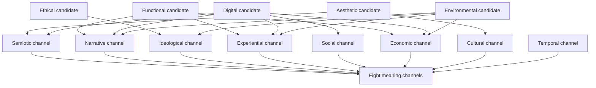

# Why Eight? Completeness and Necessity of the SBT Dimensional Taxonomy

**Zharnikov, D.**

Working Paper -- March 2026 (Updated April 2026)

---

## Abstract

How many distinct channels transmit meaning from brands to consumers? Extant frameworks diverge widely -- five personality dimensions (Aaker 1997), six prism facets (Kapferer 2008), two-to-three MDS solutions -- yet none provides theoretical justification for its chosen dimensionality. This paper derives an eight-dimensional taxonomy from first principles. Brand perception occurs through eight independent meaning channels -- semiotic, narrative, ideological, experiential, social, economic, cultural, and temporal -- each rooted in a distinct academic tradition. Independence is demonstrated through counter-example brand pairs differing on one channel while matched on the others; non-redundancy follows because removing any channel collapses discriminative power for at least one pair. Completeness is shown by reducing five proposed ninth dimensions to combinations of existing channels. The apparent conflict with low-dimensional MDS solutions is resolved via concentration-of-measure mathematics: low-dimensional projections capture most variance while losing the profile-shape information that distinguishes coherence types. Robustness checks using synthetic observers confirm that each dimension carries non-trivial variance (5-19%) and rank stability deteriorates below eight dimensions. The taxonomy integrates prior meaning frameworks while satisfying psychometric criteria for theoretical derivation (Borsboom, Mellenbergh, and van Heerden 2003; Rossiter 2002), offering consumer researchers a coordinate system for studying meaning transfer, cultural branding, and perceptual coherence.

**Keywords**: dimensional taxonomy, brand perception, completeness argument, independence proof, multi-dimensional scaling, meaning channels, Spectral Brand Theory

---

## 1. The Dimension Selection Problem

Every multi-dimensional brand theory must answer a question it would prefer to avoid: why this many dimensions and not some other number? The question is uncomfortable because the answer, in most cases, is that the dimensionality was chosen for convenience, tradition, or the interpretive preferences of the researcher -- not derived from first principles.

The disagreement across frameworks is striking. J. Aaker's (1997) brand personality scale, developed through factor analysis of 114 personality traits rated across 37 brands, yielded five factors: sincerity, excitement, competence, sophistication, and ruggedness. Keller's (1993) Customer-Based Brand Equity framework organizes brand knowledge around four hierarchical levels: identity, meaning, response, and relationships. Kapferer's (2008, 4th ed.) brand identity prism posits six facets: physique, personality, culture, relationship, reflection, and self-image. De Chernatony and McDonald (2003) catalog eleven "roles" a brand can play. Meanwhile, the multidimensional scaling tradition, dating from Torgerson (1952) through Green and Rao (1972) and Bijmolt and Wedel (1999), consistently finds that two to three dimensions suffice to explain most variance in perceptual similarity data.

These are not minor discrepancies. A five-dimensional space has fundamentally different geometric properties than a two-dimensional space or an eleven-dimensional space. The number of possible observer weight profiles, the volume of cohort boundaries, the capacity for brand differentiation, and the information loss under projection all depend critically on dimensionality -- as the results in Zharnikov (2026e) and Zharnikov (2026f) make formally explicit. Choosing the wrong dimensionality is not a matter of imprecision; it is a structural error that propagates through every downstream analysis.

Two approaches to justifying dimensionality are available. The first is **empirical discovery**: collect perception data across many potential attributes, then use factor analysis or principal component analysis to determine how many latent factors the data support. This is the approach J. Aaker (1997) took for brand personality. Its strength is empirical grounding; its weakness is that the discovered factors depend on the input variables -- if no items measuring temporal perception are included in the survey, no temporal factor can emerge. The method discovers structure within the measured space, not the completeness of the measurement itself.

The second approach is **theoretical derivation**: argue from established theory that brand perception must involve exactly $n$ channels of meaning transmission, then verify independence and completeness. This is the approach SBT takes, and this paper formalizes. The strength of theoretical derivation is that it can identify dimensions that surveys miss because no one thought to measure them. Its weakness is that the argument depends on the completeness of the theoretical inventory -- the claim that all relevant meaning channels have been enumerated. Sweeney and Soutar (2001) provide a related example from the consumer value literature: their PERVAL scale, developed through systematic conceptual analysis followed by scale purification, identified four consumer value dimensions (quality, emotional, price, social) that differ from Aaker's personality factors precisely because the two teams started from different theoretical entry points -- one from value theory, one from personality psychology. The dimensionality of the output reflects the dimensionality of the input theoretical lens, not the dimensionality of the underlying construct space. This reinforces SBT's argument that theoretical derivation is necessary alongside, not merely supplementary to, empirical discovery.

This paper provides the formal argument for SBT's eight dimensions. Section 2 enumerates the meaning channels from established academic traditions. Section 3 establishes independence via counter-example brands. Section 4 argues non-redundancy. Section 5 demonstrates completeness by showing that candidate additional dimensions reduce to existing ones. Section 6 compares SBT's taxonomy with alternative frameworks. Section 7 resolves the apparent contradiction with MDS findings. Section 8 discusses limitations. Section 8A provides an empirical robustness test using R15 cross-cultural LLM data. Section 9 concludes.

The contribution is a novel theoretical derivation that integrates psychometric and cross-disciplinary criteria to establish an eight-dimensional brand perception taxonomy -- to our knowledge, the first completeness-and-independence argument in the brand theory literature to derive the dimensional count from a cross-disciplinary enumeration of meaning-transmission channels and to verify completeness through a constructive reduction test of candidate additional dimensions, drawing on the spectral framework articulated in (Zharnikov 2026a). MacInnis (2011) identifies "explicating" contributions -- those that clarify the nature of a construct or establish its boundaries -- as among the most durable conceptual advances in marketing; this paper aims for that category. Three contributions follow from this approach. *First*, the paper introduces the **meaning-channel versus content-domain distinction** as a principled stopping rule for dimensional taxonomies: meaning channels are modes of meaning transmission, identified with established academic traditions; content domains are topic areas (environmental, digital, ethical) processed through one or more channels. This distinction prevents indefinite dimensional inflation as new content domains arise. *Second*, the paper provides a **constructive independence-and-non-redundancy proof** via brand-pair witnesses and a reduction test for five candidate ninth dimensions, establishing eight as the minimal complete set rather than an arbitrary count. *Third*, the paper supplies an **empirical robustness test using AI-observer data** (Section 8A) that subjects the eight-dimension framework to drop-one, drop-pair, and augmentation perturbations, showing that the ranking pattern is overdetermined while every dimension carries non-trivial cross-model variance. Whether the dimensions are "correct" in an empirical sense remains a question for factor-analytic studies that this paper's argument motivates but does not replace.

Churchill (1979) established the paradigm for multi-step scale development in marketing, demonstrating that sound measurement begins with conceptual domain specification before moving to item generation and factor analysis. Subsequent work on multi-dimensional brand equity measurement -- exemplified by Netemeyer et al. (2004), who developed and validated a four-facet consumer-based brand equity scale through systematic conceptual analysis followed by empirical purification -- demonstrated both the power and the limitation of the domain-first approach: scales can be psychometrically rigorous within their specified domain while the domain itself remains theoretically underspecified. Rossiter (2002) extended this logic in his C-OAR-SE procedure, arguing that conceptual analysis should precede -- and can supersede -- factor-analytic dimension identification in many theoretical contexts; dimensions derived from theory carry their own epistemic warrant and need not await factor-analytic confirmation to be considered valid candidates for empirical investigation. SBT takes a further step that Rossiter's C-OAR-SE does not: verifying domain *completeness* through a constructive reduction test. The C-OAR-SE procedure accepts the researcher's domain specification as given; this paper provides the missing argument for why the brand perception domain contains exactly eight dimensions rather than some other number. The disagreement across existing frameworks reflects what Flake and Fried (2020) identify as a questionable measurement practice: dimensionality chosen for convenience, tradition, or the output of factor analysis applied to incomplete item sets, rather than derived from a principled specification of the construct domain. The philosophical warrant for prioritizing theoretical specification before measurement rests on the recognition that factor analysis cannot identify construct domains from within; it can only recover structure placed into the item space by the researcher's prior choices (Borsboom, Mellenbergh, and van Heerden 2003).

This paper's "why eight?" argument belongs to a methodological tradition of theoretically derived dimensional systems. The PAD (Pleasure-Arousal-Dominance) model of affect (Mehrabian and Russell 1974) justified three dimensions from environmental psychology theory rather than from factor analysis; Russell's (1980) circumplex model of affect provided a precedent for theoretically derived two-dimensional affective space that preceded and shaped subsequent empirical confirmations. More recently, Ashton and Lee (2007) explicitly argued for the HEXACO model's six personality dimensions -- including the theoretically motivated Honesty-Humility factor -- on cross-cultural and theoretical grounds before large-scale empirical confirmation was available. Cross-cultural research further demonstrates that theoretically derived dimensions may have varying surface expressions across cultures while the underlying dimensional structure remains stable (Benet-Martínez and Oishi 2008) -- a challenge that applies to SBT's cultural and temporal channels specifically and that motivates the cross-cultural limitations acknowledged in Section 8. R11 follows this tradition: deriving dimensionality from theory is not a departure from scientific rigor but a necessary precursor to the empirical work that the theory motivates.

---

## 2. Completeness from Meaning-Channel Enumeration

### 2.1 The Meaning-Channel Principle

The central insight of this paper is that brand perception is mediated by meaning, and meaning is transmitted through discrete channels that have been independently studied across distinct academic traditions, synthesizing the cross-disciplinary survey assembled in (Zharnikov 2026c). A "meaning channel" is a pathway through which a brand's emissions are interpreted by an observer to form a component of perception. The claim is not that brands intend to emit on all channels, but that observers inevitably interpret brand emissions through all available meaning-processing systems -- just as the human visual system processes all incoming light through three cone types regardless of the light source's intent.

For a meaning channel to qualify as a distinct dimension, it must satisfy three criteria: (a) it must be the primary subject of an established academic tradition with its own foundational literature, core constructs, and empirical methods; (b) it must be relevant to brand perception -- that is, brands must emit signals that observers process through this channel; and (c) it must not be reducible to another channel -- that is, the constructs and methods of one tradition must not subsume those of another. These three criteria parallel Slaney's (2017) requirements for construct domain completeness: a construct is validly specified when its scope is theoretically grounded, empirically relevant, and non-redundant with adjacent constructs. We now enumerate the eight channels that satisfy all three criteria.

### 2.2 Semiotic: The Sign-System Channel

The academic tradition of semiotics, founded by Peirce (1931-1958) and Saussure (1916) and extended to cultural analysis by Barthes (1957), studies how signs -- icons, indices, and symbols -- convey meaning through systems of difference. The core construct is the sign: a relationship between a signifier (the material form) and a signified (the concept evoked). Meaning arises not from individual signs in isolation but from the system of oppositions and associations in which each sign is embedded.

For brands, the semiotic channel encompasses visual identity, logo design, typography, color palettes, packaging architecture, and the broader "design language" through which a brand communicates its nature. Apple's product design is semiotic emission par excellence: the unibody aluminum, the specific radius of corner curves, the absence of visible screws all function as signs within a system that signifies technological refinement and creative discipline. The semiotic channel is what allows an observer to identify a brand from its visual artifacts alone, without reading the name.

The semiotic channel is distinct from all others because it operates through sign systems -- formal structures of signification -- rather than through stories (narrative), values (ideological), encounters (experiential), group dynamics (social), price signals (economic), cultural codes (cultural), or temporal associations (temporal). A brand can change its semiotic system while holding all other dimensions constant (a visual rebrand that preserves the same narrative, values, and price point), and conversely, two brands can share semiotic similarities while differing on every other dimension.

### 2.3 Narrative: The Story-Structure Channel

Narratology, rooted in Propp's (1928) morphology of folk tales, Campbell's (1949) monomyth, and Bruner's (1991) argument that narrative is a fundamental mode of cognition, studies how sequential, causally connected events are structured to produce meaning. The core construct is the narrative arc: a protagonist encounters obstacles, undergoes transformation, and arrives at a resolution. Bruner (1991) argued that narrative is not merely a literary form but a primary mode by which humans organize experience and construct reality.

Every brand has a narrative -- a founding story, an origin myth, a trajectory of development -- and observers process this narrative through the same cognitive structures they apply to any story. Patagonia's narrative (Yvon Chouinard's climbing-equipment-to-environmental-activism arc) is a classic transformation story. Nike's "Just Do It" narrative positions every customer as the hero of an athletic quest. Tesla's narrative is the disruptive visionary challenging an entrenched industry.

The narrative channel is distinct because it processes sequential, causal structure -- not static signs (semiotic), not values (ideological), not sensory encounters (experiential). A brand can have a compelling narrative and an unremarkable visual identity, or vice versa. The Dyson narrative (5,127 prototypes before success) is powerful independently of Dyson's product design, and the product design is distinctive independently of the narrative.

### 2.4 Ideological: The Value-System Channel

Ideology critique, originating with Marx and formalized by Gramsci (1971), Hall (1980), and in brand theory by Holt (2004), studies how value systems, belief structures, and political-moral positions are embedded in cultural production and consumption. The core construct is the ideological position: a brand's stance on contested values -- sustainability, individualism, tradition, progress, equality, meritocracy.

Brands are inevitably ideological because they make choices that imply values. The structure of human values is itself cross-culturally robust: Schwartz (1992) identified ten universal value types -- power, achievement, hedonism, stimulation, self-direction, universalism, benevolence, tradition, conformity, and security -- organized along two bipolar dimensions, demonstrating that the value domain underlying ideological positioning has a stable cross-cultural architecture. Chick-fil-A's public commitment to traditional family values is an explicit ideological emission. Ben & Jerry's political activism is another. Even brands that attempt ideological neutrality (McDonald's, Coca-Cola) emit a position -- the position that consumption should be politically uncomplicated, which is itself an ideological stance.

The ideological channel is distinct from narrative (a brand can tell the same story while holding different values), from social (group membership and value commitment are different constructs -- one can share values with a group one does not belong to), and from cultural (culture is broader than ideology -- cultural codes include aesthetic traditions, cuisine, humor, and other elements that are not primarily value-laden).

### 2.5 Experiential: The Lived-Encounter Channel

The experience economy literature, formalized by Pine and Gilmore (1998) and extended to marketing by Schmitt (1999), studies how direct sensory and cognitive encounters with products and services generate meaning. Phenomenology, from Husserl through Merleau-Ponty, provides the philosophical foundation: meaning is constituted through lived experience, not merely through abstract representation.

For brands, the experiential channel encompasses the tactile quality of materials, the responsiveness of digital interfaces, the ambiance of physical spaces, the taste of food products, and the emotional texture of service encounters. The Ritz-Carlton experience (anticipatory service, personalized recognition) is experiential emission. The IKEA experience (self-navigation through a showroom labyrinth, flat-pack assembly) is a different experiential emission. Both are luxury-adjacent in different ways, but their experiential signatures are unmistakable and distinct.

A natural objection arises from Brakus, Schmitt, and Zarantonello (2009), who developed and validated a Brand Experience Scale with four dimensions -- sensory, affective, intellectual, and behavioral. If the experiential channel itself contains four sub-dimensions, should SBT replace its single experiential dimension with four? SBT's response is that dimensions are **meaning channels** (at what bandwidth the signal travels between brand and observer), not perceptual **factors** (how the signal is internally processed by the observer). Brakus et al.'s four sub-dimensions describe different modalities within a single channel -- different ways an experiential encounter is processed -- not different channels of meaning transmission. Sensory, affective, intellectual, and behavioral are all activated through the same pathway: direct encounter between observer and brand. They are internal differentiations of a single channel, analogous to the way color vision decomposes a single visual channel into red, green, and blue cone responses without constituting three separate channels of visual perception. The SBT experiential dimension captures the total experiential signal strength -- the degree to which direct encounter contributes to a brand's perceived meaning -- while Brakus et al.'s sub-dimensions describe the internal texture of how that signal is experienced.

The experiential channel is distinct because it processes first-person sensory and emotional data from direct encounters -- not representations (semiotic), not stories (narrative), not values (ideological). An observer who has never visited an Apple Store processes Apple through semiotic, narrative, and other channels; the experiential channel activates only upon direct encounter. This asymmetry -- the experiential channel requires contact while others can operate at a distance -- is itself evidence of independence.

### 2.6 Social: The Group-Membership Channel

Social identity theory, developed by Tajfel and Turner (1979) and applied to consumer behavior by Berger and Heath (2007), studies how group membership, social comparison, and status signaling generate meaning. The core construct is social identity: the part of an individual's self-concept derived from membership in social groups, together with the value and emotional significance attached to that membership.

Brands function as social signals. Wearing Supreme signals membership in a particular subcultural group. Driving a Porsche signals economic and taste-based positioning. Using Linux signals technical identity. Berger and Heath (2007) demonstrated experimentally that consumers abandon preferences when those preferences become associated with out-groups -- a phenomenon that operates entirely through the social channel, independent of any change in the product's semiotic, narrative, or experiential properties.

The social channel is distinct because it processes inter-personal and inter-group dynamics -- who else uses this brand, what does using it say about me, which groups does it affiliate me with or distinguish me from. A parallel mechanism within the social channel is self-congruence: Sirgy (1982) demonstrated that consumers' brand preferences are systematically related to the congruence between brand image and self-concept, a process that operates through social identity comparisons rather than through the group-affiliation dynamics Tajfel and Turner formalized. Self-congruence and group signaling are distinct mechanisms within the same channel -- both process information about the brand's social meaning relative to the self -- just as sensory and affective sub-processes are distinct within the experiential channel. A brand can change its social meaning without changing its product (when a previously exclusive brand becomes mass-market), and two identical products can carry different social meanings (generic versus branded medication).

### 2.7 Economic: The Price-Signal Channel

Signaling theory, originating with Spence (1973) and related to Veblen's (1899) conspicuous consumption and Akerlof's (1970) market for lemons, studies how price, cost, and economic structure convey information about quality, exclusivity, and value. The core construct is the economic signal: price as information rather than merely as cost. Erdem and Swait (1998) applied signaling theory specifically to brand equity, modeling brand credibility as a signal that reduces consumer uncertainty about unobservable quality attributes -- a direct theoretical precursor to SBT's economic dimension. Their framework formalizes how brand investment in advertising and consistent quality can constitute credible signals precisely because they are costly, connecting Spence's (1973) labor-market signaling logic to brand-market dynamics.

Brands emit economic signals through pricing strategy, discount patterns, distribution exclusivity, and the economic structure of the transaction. Costco's Kirkland Signature strategy -- high quality at low price, minimal marketing -- is an economic signal that communicates "we allocate resources to product quality, not to brand theater." Hermès's refusal to discount, its waiting lists, and its destruction of unsold inventory are economic signals that communicate scarcity and permanence. The information content of these signals is processed through economic reasoning (signaling, inference about quality from price) rather than through narrative, semiotic, or social channels.

The economic channel is distinct because it processes quantitative, transactional information -- price points, value propositions, cost structures -- through the lens of economic inference. A brand can change its price without changing its visual identity, narrative, or social meaning (though the economic channel change may eventually propagate to other channels). Two brands with identical products and identical narratives but different price points occupy different positions in the economic dimension.

### 2.8 Cultural: The Taste-Code Channel

Cultural sociology, particularly Bourdieu's (1984) theory of cultural capital and distinction, and cultural consumption theory as applied to marketing by McCracken (1986), studies how taste systems, aesthetic traditions, and cultural codes generate meaning. The core construct is cultural capital: the knowledge, dispositions, and competencies that enable participation in particular cultural practices.

Brands embed themselves in cultural codes. Uniqlo's Japanese minimalism references a specific aesthetic tradition (wabi-sabi, ma) that carries cultural meaning independent of the garments' functional properties. Gucci under Alessandro Michele referenced Renaissance maximalism, queer aesthetics, and literary allusion. These cultural codes are processed by observers with varying levels of cultural capital -- an observer fluent in Japanese aesthetics reads Uniqlo differently from one who is not.

The cultural channel is distinct from the ideological channel (culture includes aesthetic traditions, humor, cuisine, and artistic references that are not primarily about values), from the social channel (cultural capital and social identity are different constructs -- one can possess cultural capital relevant to a group without being a member), and from the semiotic channel (cultural codes are broader than sign systems -- they include tacit knowledge, embodied dispositions, and historically situated taste structures that exceed formal semiotics).

### 2.9 Temporal: The Heritage-and-Horizon Channel

Temporal psychology, formalized by Zimbardo and Boyd (1999) in their time perspective theory and extended to organizational contexts by Shipp, Edwards, and Lambert (2009), studies how orientation toward past, present, and future generates meaning. The core construct is temporal focus: the degree to which an entity's identity is anchored in heritage, present experience, or future aspiration.

Brands emit temporal signals. Hermès communicates deep heritage: 187 years of craftsmanship, generational continuity, resistance to trend. Tesla communicates future orientation: the brand's meaning is inseparable from its promise of what transportation will become. Erewhon communicates hyper-present temporality: the brand is about the current moment's wellness zeitgeist, with minimal heritage anchoring and uncertain future trajectory. These temporal signals are processed by observers through psychological mechanisms of nostalgia (Wildschut, Sedikides, Arndt, & Routledge, 2006), future orientation, and temporal discounting.

The temporal channel is distinct because it processes information about a brand's relationship to time -- its past, its present stance, and its implied future -- through temporal-psychological mechanisms that are independent of the brand's signs (semiotic), stories (narrative), values (ideological), encounters (experiential), social dynamics (social), price signals (economic), or cultural codes (cultural). A brand can change its temporal positioning (pivoting from heritage to innovation) without changing any of these other dimensions, and two brands with identical current offerings can differ dramatically in temporal perception based on their histories and implied trajectories.

### 2.10 Exhaustiveness of the Enumeration

The eight traditions enumerated above -- semiotics, narratology, ideology critique, phenomenology of experience, social identity theory, signaling theory, cultural sociology, and temporal psychology -- represent a comprehensive survey of established academic fields studying meaning transmission relevant to brand perception. Each has a lineage extending at least several decades, a dedicated body of foundational literature, distinctive core constructs, and empirical methods that do not reduce to those of the other traditions. The present enumeration covers the traditions most prominently represented in the brand and consumer psychology literatures. Adjacent traditions -- acknowledged below and argued to reduce to existing channels by the same logic applied in Section 5 -- are noted here so that future critiques can engage them directly; exhaustive coverage of all conceivable traditions is not claimed.

Adjacent traditions merit acknowledgment. Rhetoric, as the study of persuasion and argument, overlaps substantially with the narrative and ideological channels but does not, in our assessment, open a distinct meaning channel of its own. Affect theory studies the pre-cognitive, bodily dimensions of emotional response and could be viewed as a distinct processing layer below the experiential channel; we treat affect as a component of experiential processing rather than a separate dimension, though this choice is contestable. Practice theory shifts attention from beliefs and representations to routinized social action, overlapping with both the social and experiential channels. These traditions are noted here so that future critiques can engage them directly rather than treating the enumeration as unaware of their existence.

The exhaustiveness claim is, of course, the most vulnerable part of the argument. It is defended not by logical deduction but by scholarly inventory: we have surveyed the literatures on meaning, communication, and perception across the humanities, social sciences, and cognitive science, and we find no established tradition studying a meaning channel not already covered by one of the eight. Section 5 subjects this claim to a stress test by examining candidate ninth dimensions.

### 2.11 From Academic Traditions to Perception Channels

A potential objection deserves direct response: academic disciplines are social constructs -- products of institutional history, funding structures, and intellectual politics -- not maps of cognitive architecture. The fact that separate university departments study semiotics and narratology does not entail that separate neural modules process signs and stories. This objection is well-taken, and it forces a clarification of the mapping's logic.

The argument is not that separate departments prove separate processing channels. Rather, three weaker but jointly sufficient claims underwrite the mapping. First, these traditions developed independently, studying meaning transmission from different entry points, without systematic cross-pollination at their foundational stages. The fact that scholars working independently, without coordination, converged on distinct objects of study -- and that those objects have remained stable across decades of peer review within their respective fields -- is evidence that the phenomena being studied are genuinely distinct, not merely carved differently by institutional convention. Second, each tradition has survived replication and critique within its own community. Semiotic analysis of brand artifacts has been productively extended by hundreds of researchers; so has social identity theory applied to consumption. Independent scholarly communities developing distinct methods for studying distinct phenomena constitute converging evidence from multiple epistemic perspectives. Third, even if the underlying neural substrates of semiotic and cultural processing overlap significantly, the phenomenological distinctness of the signals is sufficient for a perception-level taxonomy. A consumer experiencing a price signal ("this costs more than I expected") is undergoing a phenomenologically distinct experience from one reading a cultural code ("this design references a tradition I recognize"). Whether those experiences share neural circuitry is a neuroscientific question; whether they constitute distinct inputs to perception is a phenomenological and behavioral one. SBT is a perception-level theory, and the independence it claims is perception-level independence, not neural independence.

---

## 3. Independence Proof via Counter-Example Brands

### 3.1 Independence Criterion

Two dimensions $d_i$ and $d_j$ are **independent** if there exist brands whose spectral profiles differ on $d_i$ while remaining approximately matched on all other dimensions. Formally, dimensions $d_i$ and $d_j$ are independent if there exist brands $A$ and $B$ such that $|s_A(d_i) - s_B(d_i)| \gg 0$ while $|s_A(d_k) - s_B(d_k)| \approx 0$ for all $k \neq i$. A complete independence proof for all $\binom{8}{2} = 28$ dimension pairs would require 28 such examples. We provide a more efficient proof by exhibiting eight counter-example pairs, one per dimension, where each pair demonstrates that the focal dimension varies independently of the other seven.

The examples presented here are illustrative, based on informed judgment about brand positioning rather than on measured observer spectral profiles. Formal independence, in the strict psychometric sense, requires empirical verification through observer-rated profile data -- a task deferred to future work. The present examples serve the weaker but still valuable purpose of demonstrating that plausible brand pairs exist for each dimension, establishing independence as empirically credible rather than empirically proven.

### 3.2 Semiotic Independence: Apple vs. Samsung

Apple and Samsung compete in the same product categories (smartphones, tablets, laptops, wearables), target overlapping demographics, occupy similar price tiers for their flagship products, and both position themselves as technology-forward innovators. Their narratives (visionary founder, underdog-to-dominant-player), ideological stances (technology as empowerment), social functions (tech-tribe membership), economic positions (premium pricing), cultural references (Silicon Valley modernity), and temporal orientations (future-focused with recent heritage) are broadly comparable.

What differs is the semiotic system. Apple's design language -- the specific material choices, the particular minimalism, the controlled product silhouettes, the typographic identity -- is so distinctive that it constitutes a recognizable sign system independent of any individual product. Samsung's design language, while competent, does not achieve this semiotic autonomy: a Samsung product without its logo is harder to identify than an Apple product without its logo. This difference is primarily semiotic -- it operates through sign systems -- while the other seven dimensions remain approximately matched.

### 3.3 Narrative Independence: Patagonia vs. The North Face

Patagonia and The North Face are both premium outdoor apparel brands targeting active, environmentally aware consumers. Their products overlap substantially, their price points are comparable, their retail environments are similar, their semiotic identities (outdoor imagery, earth tones, technical materials) operate in the same register, and their social functions (signaling outdoor-active identity) are nearly identical.

What differs is the narrative. Patagonia's founding story -- Yvon Chouinard's evolution from climbing-equipment maker to environmental activist, culminating in donating the entire company to a climate trust -- is a transformation narrative of rare power. The North Face's founding story (two hiking enthusiasts opening a retail store in San Francisco) is conventional by comparison. The difference in brand perception between these two brands is driven primarily by narrative, with the other dimensions serving as relatively stable background.

### 3.4 Ideological Independence: Chick-fil-A vs. Popeyes

Chick-fil-A and Popeyes are both fast-food chains specializing in chicken, with comparable price points, broadly similar experiential profiles (counter-service, casual dining), overlapping social functions (accessible fast food), similar economic signals (value pricing), and comparable cultural positioning (mainstream American fast food). Their semiotic identities differ but are not the primary source of brand differentiation.

What differs is ideology. Chick-fil-A's public stance on traditional family values, Sunday closures as a statement of religious commitment, and corporate philanthropy directed toward specific causes place it in a sharply defined ideological position. Popeyes occupies no comparably charged ideological territory. The 2019 "chicken sandwich wars" revealed that consumers' brand convictions about these two chains were driven primarily by ideological alignment or opposition, not by product differences -- the sandwiches, by most accounts, were comparable.

### 3.5 Experiential Independence: Ritz-Carlton vs. Four Seasons

Ritz-Carlton and Four Seasons are both ultra-luxury hotel brands with similar price points, comparable semiotic identities (classic luxury design language), overlapping narratives (heritage of excellence), aligned ideological positions (luxury as earned reward), equivalent social functions (signaling affluent travel), and similar temporal orientations (established heritage brands).

What differs is the experiential signature. Ritz-Carlton's "Ladies and Gentlemen serving Ladies and Gentlemen" philosophy produces a formal, anticipatory, almost theatrical service experience. Four Seasons' approach is warmer, more intuitive, less scripted. Guests who prefer one over the other are responding primarily to the experiential channel -- the felt quality of the encounter -- while the other seven dimensions remain closely matched.

### 3.6 Social Independence: Supreme vs. Carhartt

Supreme and Carhartt share several dimensions: both produce streetwear-adjacent apparel, both have simple semiotic identities (bold logos, minimal design), both have straightforward narratives (authentic origins in specific subcultures), both operate in overlapping cultural registers (urban, utilitarian aesthetics), and both have products at comparable base price points (though Supreme's resale market distorts this).

What differs is the social signal. Supreme is exclusivity culture: limited drops, artificial scarcity, queue-based access that sorts consumers by dedication and insider knowledge. Wearing Supreme signals membership in a hype-aware, fashion-forward tribe. Carhartt signals working-class authenticity, durability values, and a deliberate rejection of fashion artifice. An observer's preference between these brands is driven primarily by which social identity they wish to perform, not by differences in product quality, design, or narrative.

### 3.7 Economic Independence: Costco vs. Sam's Club

Costco and Sam's Club are both membership-based warehouse retailers with nearly identical business models, similar semiotic environments (industrial-warehouse aesthetics), overlapping narratives (democratizing access to bulk purchasing), comparable social functions (practical, middle-class family provisioning), aligned cultural positions (American suburban pragmatism), and similar temporal orientations (established but not heritage-focused).

What differs is the economic signal. Costco's Kirkland Signature private-label strategy communicates a specific economic proposition: "we have invested in product quality to the point where our store brand rivals or exceeds national brands, and we pass the savings to you." Sam's Club, as a Walmart subsidiary, carries a different economic signal: "we provide low prices through supply-chain scale." The distinction is between economic signals of quality investment versus cost efficiency -- both valid, but processed differently through observers' economic-inference systems.

A non-Western parallel: **Xiaomi vs. Huawei**. Both are Chinese technology companies competing in smartphones, smart devices, and ecosystem services, with overlapping social functions (tech-identity signaling), comparable cultural codes (Chinese tech nationalism), similar narratives (domestic champions challenging Western dominance), and aligned ideological positions. What differs is the economic signal. Xiaomi's foundational economic proposition -- maximum specifications at minimum price, "price-performance ratio" (*xingjiabi*) as a brand value -- communicates that economic democratization of technology is itself the brand's mission. Huawei's economic signal, particularly in its premium lines (Mate and P series), communicates that Chinese technology can command luxury-tier prices by virtue of genuine technical superiority. The price-as-information content is fundamentally different: Xiaomi signals "we sacrifice margin for your benefit," while Huawei signals "we command premium because we have earned it." These distinct economic signals are processed through the same observer cognitive architecture that Spence (1973) formalized, independent of the other dimensions on which the brands closely converge.

### 3.8 Cultural Independence: Uniqlo vs. H&M

Uniqlo and H&M are both global fast-fashion retailers with comparable price points, similar economic signals (affordable, accessible fashion), overlapping social functions (everyday wardrobe for broad demographics), broadly similar narratives (democratizing good design), and aligned temporal orientations (contemporary, trend-responsive).

What differs is the cultural code. Uniqlo's design philosophy draws on Japanese minimalism -- restraint, precision, the beauty of essentials -- referencing a cultural tradition that extends from wabi-sabi aesthetics through Muji's "no-brand" philosophy to Issey Miyake's material innovations. H&M's approach is Swedish trend-following: rapid translation of runway fashion into accessible price points, referencing a Scandinavian democratic-design tradition. An observer with fluency in Japanese aesthetic codes reads Uniqlo through a different cultural lens than an observer without that fluency, and this differential processing occurs on the cultural channel independent of the other seven dimensions.

A second illustration sharpens the point with brands drawn from East Asian markets: **Muji vs. Miniso**. Both are Japanese-origin minimalist lifestyle brands with overlapping product categories, comparable price points, simple semiotic identities (restrained design, muted color palettes), similar social functions (accessible everyday lifestyle signaling), and contemporary temporal orientations. The critical difference is cultural: Muji's minimalism is rooted in the *mottainai* ethic of avoiding waste and finding sufficiency in the essential, referencing a deep Japanese philosophical tradition. Miniso's minimalism is a design aesthetic without the same philosophical heritage -- it borrows the visual grammar of Japanese minimalism and applies it within a Chinese fast-retail model that prioritizes novelty and turnover. Observers fluent in Japanese design culture perceive this distinction acutely; observers without that cultural fluency may rate the brands as nearly identical. The cultural channel does the differentiating work.

### 3.9 Temporal Independence: Hermès vs. Gucci

Hermès and Gucci are both European luxury houses with high semiotic distinctiveness, powerful narratives, strong ideological positions (craftsmanship, creativity), rich experiential signatures, high social-signaling functions, premium economic positioning, and deep cultural embeddedness.

What differs is the temporal signal. Hermès trades on continuity: 187 years of unbroken craft tradition, the same stitching techniques, the same leather sources, a deliberate resistance to temporal disruption. Hermès communicates that time is an ally -- that value accrues through persistence. Gucci, particularly under Tom Ford and later Alessandro Michele, trades on temporal reinvention: each creative director dramatically reimagines the brand, making Gucci a vehicle for the current moment's aesthetic sensibility. Gucci communicates that time is a medium for transformation. Both are luxury, but their temporal signals are diametrically opposed, and this opposition is perceived by observers through the temporal channel independently of the brands' other shared properties.

A non-Western illustration reinforces the universality of temporal perception as a meaning channel: **Tata vs. Reliance** (India). Both are Indian conglomerates with strong national identities, comparable economic scale, and high social standing. Their semiotic identities are well established, their narratives are powerful, and their ideological positions are broadly aligned with Indian economic nationalism. What differs is the temporal signal. Tata carries deep heritage -- founded in 1868, the brand's identity is inseparable from India's industrial modernization and its founding family's multigenerational stewardship. The temporal signal is one of continuity, patience, and institutional trust built across generations. Reliance, founded by Dhirubhai Ambani in 1966 and dramatically expanded under Mukesh Ambani, carries a temporal signal of rapid transformation and future orientation: the brand's meaning is inseparable from its disruptions (Jio in telecom, JioMart in retail) and its promise of what India's economy will become. Indian observers process these two brands through starkly different temporal lenses despite their many shared properties on other dimensions.

---

## 4. Non-Redundancy

### 4.1 Dimensional Non-Redundancy

The independence examples in Section 3 establish that each dimension varies independently of the others. Non-redundancy is the complementary claim: each dimension is *necessary* -- removing it reduces the framework's discriminative power.

**Proposition 1** (Dimensional Non-Redundancy). *For each dimension $d_i$, $i = 1, \ldots, 8$, there exists a pair of brands $(A_i, B_i)$ that are distinguishable in the 8-dimensional taxonomy but become indistinguishable in the 7-dimensional taxonomy obtained by removing $d_i$.*

*Proof sketch.* For each dimension $d_i$, the counter-example pair from Section 3 serves as $(A_i, B_i)$. By construction, these pairs differ primarily on $d_i$ and are approximately matched on all other dimensions. In the full 8-dimensional space, their Euclidean distance is dominated by the $d_i$ component:

$$\|s_{A_i} - s_{B_i}\|^2 = \sum_{k=1}^{8} (s_{A_i}(d_k) - s_{B_i}(d_k))^2 \approx (s_{A_i}(d_i) - s_{B_i}(d_i))^2$$

Removing dimension $d_i$ eliminates the dominant term, collapsing the distance to approximately zero. The brands become indistinguishable in the reduced space. This proof sketch is conditional on the empirical claim that the witness pairs in Section 3 are approximately matched on non-focal dimensions -- a claim this paper does not empirically verify and which constitutes the primary target of future factor-analytic work.

For example, removing the temporal dimension from the taxonomy makes Hermès and Gucci indistinguishable -- both are high-semiotic, high-narrative, high-social European luxury houses. The dimension that separates them (heritage continuity versus era reinvention) is precisely the temporal dimension. Without it, the framework cannot explain why observers who value heritage strongly prefer Hermès over Gucci, or why observers who value novelty prefer the reverse. $\square$

*Falsification:* Proposition 1 would be falsified if a large-scale observer-rating study found that, for some dimension $d_i$, no brand pair becomes indistinguishable upon its removal -- i.e., if the claimed witness pairs in Section 3 are rated by observers as substantially different on multiple non-focal dimensions, such that removing $d_i$ leaves substantial residual distance. This would indicate that the dimension is not doing discriminative work independently of the others, or that the witness pairs were poorly chosen.

### 4.2 Minimal Completeness

**Proposition 2** (Minimal Completeness). *No proper subset of the 8 dimensions covers all established meaning-transmission channels relevant to brand perception.*

*Proof.* By the enumeration in Section 2, each dimension maps to a distinct academic tradition studying a distinct meaning channel. The mapping is injective: no two dimensions map to the same tradition, and no tradition maps to two dimensions. Removing any dimension $d_i$ therefore leaves the meaning channel studied by tradition $T_i$ uncovered -- that is, there exists a class of brand signals (those transmitted through channel $T_i$) that the reduced taxonomy cannot represent.

Concretely: removing the temporal dimension leaves the framework unable to represent heritage, nostalgia, and future orientation as brand perception components. These phenomena are empirically documented (Wildschut et al., 2006; Zimbardo & Boyd, 1999) and are the primary subject of a distinct academic tradition. A 7-dimensional taxonomy without the temporal dimension is therefore incomplete -- it fails to cover a meaning channel through which brands demonstrably emit and observers demonstrably perceive. The argument holds, mutatis mutandis, for each of the other seven dimensions. $\square$

*Falsification:* Proposition 2 would be falsified if a brand-perception survey with items designed to measure all eight channels yielded a stable exploratory factor-analytic solution with fewer than eight factors -- specifically, if two or more of the eight theoretically derived channels consistently loaded on a single empirical factor across culturally diverse samples. Such a result would indicate that the one-tradition-to-one-channel mapping is not empirically supported and that some channels are perceptually redundant.

---

## 5. Completeness: The Candidate Ninth Dimension Test

### 5.1 Proof Strategy

The most rigorous test of completeness is to consider every plausible candidate for a ninth dimension and show that each reduces to a component or combination of the existing eight. If no candidate survives this test, the eight-dimensional taxonomy is complete in the sense that it accounts for all established meaning channels.

We examine five candidates that arise naturally from the branding literature and from critiques of existing taxonomies: aesthetic, functional, ethical, digital, and environmental.

### 5.2 Aesthetic Dimension

**Candidate**: Brand perception includes an aesthetic dimension -- the beauty, elegance, or visual pleasure of brand artifacts -- that is not captured by the semiotic dimension.

**Reduction**: Aesthetics, in the context of brand perception, decomposes into two components. The first is the formal structure of visual and material signs -- which is precisely the semiotic dimension (Peirce's icon, Barthes's denotation). The second is the culturally situated evaluation of those signs as "beautiful" or "elegant" -- which is the cultural dimension (Bourdieu's taste, McCracken's cultural meaning transfer). An observer who judges a brand as "aesthetically superior" is processing semiotic information through a cultural lens. No residual meaning remains once both channels are accounted for.

### 5.3 Functional Dimension

**Candidate**: Brand perception includes a functional dimension -- how well the product actually works -- that is distinct from all eight SBT dimensions.

**Reduction**: Functional performance is processed through the experiential channel (direct encounter with product capabilities), the economic channel (quality inference from price and value assessment), and the narrative channel (product performance stories, reliability reputation). "This car accelerates well" is experiential. "At this price, it should accelerate well" is economic. "BMW has always been about driving performance" is narrative. The functional is not a separate meaning channel but a content domain that is processed through multiple existing channels. No academic tradition studies "the functional" as a distinct meaning-transmission mechanism independent of experience, economics, and narrative.

### 5.4 Ethical Dimension

**Candidate**: Brand perception includes an ethical dimension -- judgments about the brand's moral conduct -- that is separate from the ideological dimension.

**Reduction**: Ethics and ideology are closely related but, in the context of brand perception, the ethical is a subset of the ideological. When an observer judges a brand as "ethical" or "unethical," they are evaluating the brand's actions against a value system -- which is precisely the ideological channel. Gramsci's (1971) analysis of hegemony, Hall's (1980) encoding/decoding model, and Holt's (2004) iconic branding framework all treat ethical evaluation as embedded within ideological processing. The ethical dimension does not open a new meaning channel; it specifies a particular content domain within the ideological channel.

### 5.5 Digital Dimension

**Candidate**: In the contemporary marketplace, brands have a digital dimension -- their presence, behavior, and identity in digital environments -- that constitutes a new meaning channel.

**Reduction**: Digital presence is a medium, not a meaning channel. A brand's website design is semiotic (visual sign systems in a digital medium). Its social media narrative is narrative (story structure distributed through digital platforms). Its online community is social (group dynamics mediated by digital infrastructure). Its e-commerce experience is experiential (encounter quality in a digital context) and economic (digital pricing signals). The digital environment changes the delivery mechanism for signals but does not create a new type of meaning. By analogy, the transition from print to television did not create a new perceptual dimension; it changed the medium through which existing dimensions were transmitted.

### 5.6 Environmental Dimension

**Candidate**: Growing environmental awareness has created a distinct environmental dimension of brand perception -- how "green" or "sustainable" a brand is perceived to be.

**Reduction**: Environmental perception decomposes into ideological (the value system that prioritizes environmental responsibility), narrative (the brand's sustainability story -- its journey toward environmental stewardship), experiential (the tangible experience of recycled materials or carbon-neutral delivery), and economic (the willingness-to-pay premium for sustainability). Environmental perception is high-salience content that is processed through multiple existing channels, not a new channel. Patagonia scores high on the ideological dimension partly because of its environmental stance, but that stance is processed through the ideological meaning channel -- it is a specific value position, not a distinct mode of meaning transmission.

### 5.7 Synthesis

None of the five candidates survives the reduction test, as summarized graphically in Figure 1. Each either decomposes into components of existing dimensions or represents a content domain processed through existing meaning channels rather than a new channel of meaning transmission. The distinction between a **meaning channel** (a mode of processing through which signals become meaning) and a **content domain** (a topic area that signals may address) is critical. Environmentalism is a content domain; ideology is a meaning channel. Digital is a medium; experience is a meaning channel. This distinction is what prevents the dimensional taxonomy from inflating indefinitely -- new topics and new media do not create new meaning channels.

The completeness claim is therefore: the eight dimensions of SBT correspond to the eight established meaning-transmission channels relevant to brand perception, and no candidate ninth dimension represents a genuinely new channel rather than a content domain, medium, or combination of existing channels.

Figure 1: Decomposition Tree -- Candidate Ninth Dimensions Reduce to Combinations of Existing Channels.



*Notes*: Each candidate ninth dimension on the left decomposes into one or more of the eight established meaning channels on the right. None constitutes a residual channel after reduction. Aesthetic decomposes into formal sign systems (Semiotic) and culturally situated taste evaluation (Cultural). Functional decomposes into direct-encounter performance assessment (Experiential), price-quality inference (Economic), and reliability stories (Narrative). Ethical reduces to value-system alignment (Ideological). Digital is a medium that re-routes existing channels rather than opening a new one. Environmental is a high-salience content domain processed through multiple existing channels.

---

## 6. Comparison with Alternative Taxonomies

### 6.1 Mapping Frameworks onto SBT Dimensions

If SBT's eight dimensions are complete, then every dimension proposed by competing frameworks should map onto one or more SBT dimensions. We test this by constructing explicit mappings for four major frameworks.

**J. Aaker (1997) Brand Personality.** J. Aaker's five factors were derived from factor analysis of 114 personality-trait ratings applied to 37 brands (J. Aaker, 1997). It is important to distinguish this work from D. Aaker's (1996) brand equity framework, which organizes brand knowledge around functional, emotional, and self-expressive benefits rather than personality dimensions. The mapping to SBT dimensions reveals that Brand Personality captures a narrow slice of the full perception space:

| J. Aaker (1997) Factor | Primary SBT Dimension(s) | Rationale |
|---|---|---|
| Sincerity | Narrative + Ideological | Honesty and wholesomeness are value judgments (ideological) conveyed through brand stories (narrative) |
| Excitement | Experiential + Temporal | Daring and spirited are experiential qualities with present-temporal orientation |
| Competence | Experiential + Economic | Reliability and success are inferred from product experience and economic signals |
| Sophistication | Cultural + Semiotic | Upper-class and charming are cultural-capital markers expressed through sign systems |
| Ruggedness | Experiential + Narrative | Outdoorsiness and toughness are experiential qualities embedded in brand mythology |

Notably absent from Brand Personality: the social dimension (group membership, status signaling), the economic dimension as a primary channel (price-as-information), and the temporal dimension as heritage or future orientation. Brand Personality was not designed to capture these channels because its input variables (personality traits) do not include items measuring them.

**Keller (1993) Customer-Based Brand Equity.** Keller's four-level pyramid is hierarchical rather than dimensional -- each level builds on the previous one. The mapping is less direct:

| Keller Level | SBT Dimension(s) | Rationale |
|---|---|---|
| Identity (salience) | Semiotic + Narrative | Brand recognition operates through signs and stored stories |
| Meaning (performance + imagery) | Experiential + Social + Cultural | Performance is experiential; imagery is social and cultural |
| Response (judgments + feelings) | Economic + Ideological | Quality judgments involve economic inference; feelings involve value alignment |
| Relationships (resonance) | Social + Temporal | Loyalty and community are social; attachment deepens temporally |

Keller's framework distributes SBT dimensions across hierarchical levels rather than treating them as parallel channels. This architectural choice means that CBBE cannot represent a brand that is strong on social resonance but weak on experiential performance -- the hierarchy requires that lower levels support upper ones. SBT's flat (non-hierarchical) dimensional structure avoids this constraint.

**Kapferer (2008, 4th ed.) Brand Identity Prism.** Kapferer's six facets map onto SBT dimensions with moderate coverage:

| Kapferer Facet | Primary SBT Dimension(s) | Rationale |
|---|---|---|
| Physique | Semiotic + Experiential | Physical characteristics are signs (semiotic) and encounters (experiential) |
| Personality | Narrative + Social | Brand "character" is conveyed through stories and social behavior |
| Culture | Ideological + Cultural | Kapferer's "culture" blends values (ideological) with cultural codes |
| Relationship | Social + Experiential | The brand-consumer relationship is social and encounter-based |
| Reflection | Social | The "typical user" image is a social-identity construct |
| Self-image | Ideological + Social | How the brand makes the consumer feel about themselves involves values and social identity |

Missing from the Prism: the economic dimension (no facet addresses price-as-signal or economic inference) and the temporal dimension (no facet addresses heritage, nostalgia, or future orientation). Kapferer acknowledges time in his broader writing ("brand DNA," "roots") but does not formalize it as a prism facet.

**De Chernatony and McDonald (2003) Brand Roles.** De Chernatony catalogs eleven "roles" a brand plays (logo, instrument, shorthand, risk reducer, identity system, image, value system, personality, relationship, added value, evolving entity). Many of these roles map to the same SBT dimensions:

| Brand Role | Primary SBT Dimension |
|---|---|
| Logo | Semiotic |
| Instrument | Experiential |
| Shorthand | Semiotic + Narrative |
| Risk reducer | Economic |
| Identity system | Semiotic |
| Image | Social + Cultural |
| Value system | Ideological |
| Personality | Narrative + Social |
| Relationship | Social + Experiential |
| Added value | Economic + Experiential |
| Evolving entity | Temporal |

The eleven roles show substantial overlap: logo, shorthand, and identity system all map primarily to the semiotic dimension. The taxonomy is not orthogonal -- multiple roles describe different aspects of the same meaning channel. Conversely, the cultural dimension receives no dedicated role, and the temporal dimension appears only as a single entry ("evolving entity") rather than as the rich heritage-nostalgia-future complex that Zimbardo and Boyd (1999) and Shipp et al. (2009) study.

### 6.2 Holbrook's (1999) Consumer Value Typology

A framework not yet addressed deserves direct engagement: Holbrook's (1999) eight-type consumer value typology. Holbrook identifies eight types of consumer value arranged along three axes (extrinsic-intrinsic, self-oriented--other-oriented, active-reactive): efficiency, play, excellence, aesthetics, status, ethics, esteem, and spirituality. The coincidental match in count -- eight value types against eight perception dimensions -- invites comparison, but the parallelism is superficial because the frameworks address fundamentally different questions.

Holbrook's typology is a taxonomy of **what consumers seek** -- the value categories that motivate consumption and define what makes a product or experience satisfying. SBT's taxonomy is a taxonomy of **how meaning is transmitted** -- the channels through which brand signals reach and are processed by observers. A consumer seeking "status" (Holbrook) is articulating a motivational orientation; SBT's social dimension describes the processing channel through which status-relevant signals are received and interpreted, regardless of whether any particular observer is motivated by status. The two frameworks operate at different levels of analysis.

That said, the mappings are illuminating precisely because of the independent derivation. Holbrook's status value maps naturally onto SBT's Social dimension (group membership, status signaling). His aesthetics value maps across SBT's Semiotic and Cultural dimensions (formal sign systems plus culturally situated taste evaluation). Ethics maps to SBT's Ideological dimension (value-system alignment). Efficiency maps to SBT's Economic dimension (value-for-money inference). Holbrook's excellence (product quality) and play (hedonic enjoyment) both map to SBT's Experiential dimension (direct encounter quality). Esteem (social approval from others) maps to SBT's Social dimension. Spirituality (transformative, transcendent value) maps most naturally to SBT's Ideological and Narrative dimensions (values and meaning-making stories).

The fact that two independently derived frameworks arrive at the same count -- one through factor-analytic reasoning about value motivations, one through theoretical enumeration of meaning channels -- is not coincidental confirmation but it is suggestive. Independent theoretical derivations converging on the same number provide some reassurance that eight is not arbitrary. The frameworks are complementary: Holbrook's typology explains what observers are looking for; SBT's framework explains which channels deliver what they find.

### 6.3 Sheth, Newman, and Gross (1991) Theory of Consumption Values

Sheth, Newman, and Gross (1991) proposed a five-value theory of consumption choice: functional value (utilitarian performance), social value (association with demographic, socioeconomic, or cultural-ethnic groups), emotional value (capacity to arouse feelings or affective states), epistemic value (ability to arouse curiosity, provide novelty, or satisfy a desire for knowledge), and conditional value (utility from a specific situation or set of circumstances). This framework is particularly relevant because it was derived from theory rather than from factor analysis of personality traits, making it structurally closer to SBT's derivation methodology than J. Aaker's (1997) empirical approach.

The mapping to SBT dimensions is instructive. Functional value maps primarily to SBT's Experiential and Economic dimensions (performance is assessed through direct encounter and economic inference about quality). Social value maps to SBT's Social dimension (group membership and identity signaling). Emotional value maps across SBT's Experiential and Narrative dimensions (feelings are generated both by direct encounters and by story engagement). Epistemic value -- the value of novelty and curiosity satisfaction -- maps most naturally to SBT's Narrative and Ideological dimensions (novelty-seeking is activated by departure from familiar stories and by ideological challenge). Conditional value, the context-dependency of brand preference, is not a meaning channel but a moderator -- it describes when a channel's signal is weighted more heavily, not what kind of signal it is.

Two observations follow from this mapping. First, Sheth et al.'s five values, like Holbrook's eight types, decompose into components of SBT dimensions rather than constituting independent channels. This is consistent with the completeness claim: a framework derived from motivational theory (what consumers seek) maps naturally onto a framework derived from transmission theory (how meaning reaches consumers). Second, the absence of an epistemic value equivalent in SBT's primary dimensions merits attention. SBT's narrative dimension partially covers epistemic stimulation through story engagement, but novelty-seeking as a brand perception driver is also partially ideological (challenging received opinion) and partially temporal (the novelty of the future versus the familiarity of the past). The epistemic value is not a separate meaning channel; it is a functional demand that is satisfied differentially across several SBT channels.

### 6.4 Assessment

The mapping exercise reveals a consistent pattern. Alternative frameworks each cover some subset of SBT's eight dimensions while missing others. No alternative covers all eight. Conversely, every dimension proposed by every alternative maps onto at least one SBT dimension -- no alternative identifies a meaning channel that SBT misses. This is the empirical signature of completeness: the eight-dimensional taxonomy is a superset of all alternatives.

The alternatives also reveal the cost of under-dimensionality. J. Aaker's (1997) five-factor model, for all its empirical grounding, cannot distinguish brands that differ primarily on economic or temporal dimensions. Kapferer's prism, for all its elegance, cannot represent price-as-signal or heritage-as-perception. These are not minor omissions -- they are entire meaning channels through which brands demonstrably emit and observers demonstrably perceive, left unrepresented by frameworks with fewer than eight dimensions.

---

## 7. Why Two to Three Dimensions Appear Sufficient

### 7.1 The MDS Dimensionality Puzzle

The multidimensional scaling tradition in marketing, from Torgerson (1952) through Green and Rao (1972) to Bijmolt and Wedel (1999), has consistently found that two to three dimensions explain most of the variance in perceptual similarity data. If brand perception genuinely involves eight dimensions, why do data-driven methods find so few?

This is the strongest empirical challenge to SBT's eight-dimensional claim, and it deserves a precise answer. The answer involves three components: a mathematical explanation (concentration of measure), an information-theoretic explanation (variance dominance versus information content), and a methodological explanation (input variable selection).

### 7.2 Concentration of Measure

Zharnikov (2026f) proved that on the probability simplex $\Delta^{n-1}$, the concentration of measure phenomenon causes distances between random points to converge as $n$ increases. At $n = 8$, the Euclidean distance contrast ratio $\max_d / \min_d$ is approximately 8.35, compared to 5801 at $n = 2$. More directly, 57% of the volume of $\Delta^7$ lies within relative distance $\delta = 0.10$ of a partition boundary -- a majority of the space is "near a boundary" in the geometric sense.

The consequence for dimensionality reduction is that low-dimensional projections of high-dimensional distributions capture a surprisingly large fraction of the total variance. The first two or three principal components of an 8-dimensional distribution may explain 60-70% of variance not because the underlying structure is 2-3 dimensional but because concentration of measure ensures that the variance is unevenly distributed across dimensions. The dominant variance axes absorb most of the signal; the remaining axes carry information that is real but small in variance terms.

### 7.3 Variance Dominance versus Information Content

The critical distinction is between variance explained and information retained. Zharnikov (2026e) proved that projecting from $\mathbb{R}^8$ to $\mathbb{R}^1$ retains at most 11.6% of the available information (measured in bits). A 2-3 dimensional projection retains more, but still sacrifices substantial discriminative capacity.

The information that is lost under low-dimensional projection is precisely the information that distinguishes coherence types. In SBT's taxonomy, coherence types (ecosystem, signal, identity, experiential asymmetry, incoherent) are distinguished by the pattern of dimensional scores -- the shape of the 8-dimensional profile -- not by the profile's magnitude or its position along any single axis. Two brands with different coherence types may project to the same point in 2D while being clearly separated in 8D.

**Proposition 3** (Projection Consistency). *The concentration of measure on $\Delta^7$ (Zharnikov, 2026f) predicts that a $k$-dimensional projection of 8-dimensional brand profiles, with $k \leq 3$, will capture the majority of between-brand variance while losing the within-profile shape information that distinguishes coherence types.*

*Illustration.* Let $s_1, \ldots, s_m \in \mathbb{R}^8_+$ be brand spectral profiles. A $k$-dimensional projection $\pi_k: \mathbb{R}^8 \to \mathbb{R}^k$ captures the top $k$ principal components of the profile distribution. By the concentration of measure on high-dimensional distributions, the ratio of the $k$th eigenvalue to the first eigenvalue decays, so the top 2-3 components dominate. However, the coherence type of a profile depends on the relative ordering and spacing of all 8 components -- information that resides in the lower-variance components. Specifically, two hypothetical profiles $s_A = (9, 8, 7, 8, 8, 2, 8, 9)$ and $s_B = (7, 7, 7, 7, 7, 7, 7, 7)$ may have similar projections onto the first principal component (both have high total signal) while having radically different coherence types (the first is ecosystem coherence with one suppressed dimension; the second is uniform signal coherence).

At $n = 2$, only 10% of the observer weight space on $\Delta^1$ lies near the partition boundary (Zharnikov, 2026f). At $n = 8$, 57% does. This means that the 2-dimensional model assigns observers to sharp, well-separated regions -- creating an illusion of clean cohort separation -- while the 8-dimensional model predicts that most observers are near boundaries between cohorts. The "sufficiency" of two dimensions is an artifact of the low-dimensional space's artificially sharp boundaries, not a property of the underlying perceptual reality.

*Falsification:* Proposition 3 would be falsified if a brand survey with dedicated items for all eight meaning channels yielded a factor structure in which the lower-variance factors carried no incremental discriminative information about brand pairs that the first two or three factors already separated -- i.e., if coherence types were fully recoverable from low-dimensional projections without information loss. Such a result would indicate that the concentration-of-measure argument does not apply to the actual distribution of real brand profiles, and that low-dimensional MDS solutions are not systematically losing profile-shape information.

### 7.4 The Input Variable Problem

MDS operates on similarity judgments or attribute ratings provided by respondents. If the input instrument does not include items measuring temporal perception (heritage, nostalgia, future orientation) or economic signaling (price-quality inference, value perception), these channels cannot appear in the output space. The "two to three dimensions" finding may reflect the dimensionality of the measurement instrument as much as the dimensionality of perception.

This is an empirically testable prediction. If SBT is correct, a survey instrument designed to measure all eight meaning channels -- with dedicated items for each -- should yield eight factors with non-trivial loadings in exploratory factor analysis, even though the first two or three factors explain most variance. The critical test is not whether 2-3 factors explain "enough" variance (by some threshold) but whether the remaining factors carry discriminative information about coherence types that the first 2-3 miss.

### 7.5 A Resolution

The apparent contradiction between SBT's eight dimensions and MDS's two to three dissolves once the distinction between the map and the territory is made explicit. MDS produces a **map** -- a low-dimensional projection optimized for visual interpretability. SBT describes the **territory** -- the full-dimensional space in which brand perception operates. The map's low dimensionality is a feature of the projection, not a property of the territory. Just as a 2D map of Earth is useful for navigation while failing to preserve distances, areas, and angles simultaneously (no 2D projection of a sphere can preserve all three), a 2-3 dimensional perceptual map is useful for visualization while failing to preserve the profile-shape information that distinguishes coherence types, the boundary structure that determines cohort fuzziness, and the dimensional independence that SBT's framework requires.

The key claim is not that MDS is wrong but that it is incomplete. Two to three dimensions suffice for the tasks MDS was designed for (visualizing relative brand positions). Eight dimensions are necessary for the tasks SBT was designed for (specifying brand profiles, distinguishing coherence types, predicting observer-specific perception, and modeling non-ergodic trajectory dynamics). The dimensionality question is not "how many dimensions does brand perception have?" but "how many dimensions does this task require?" -- and the answer depends on the task.

---

## 8. Limitations

Several limitations qualify the arguments presented in this paper.

**The completeness argument is theoretical, not empirical.** The claim that eight meaning channels exhaust the relevant channels for brand perception rests on a scholarly inventory of academic traditions, not on factor analysis of perception data. It is possible that empirical investigation will reveal that some SBT dimensions merge under factor analysis -- that semiotic and cultural perception, for example, load on a common factor in survey data -- or that additional dimensions emerge from items not anticipated by the current taxonomy. Section 8A partially addresses this limitation with an empirical robustness test using AI observer data: all eight dimensions carry non-trivial cross-model variance (5-19%), and the framework survives aggressive perturbation. However, a definitive test requires human-subject factor analysis, which remains to be conducted.

**The independence examples are illustrative, not measured.** The counter-example brand pairs in Section 3 are selected based on the author's informed judgment about brand positioning, not on observer-rated spectral profiles. It is possible that observers rate these pairs as more similar or more different on non-focal dimensions than the argument assumes. Formal independence requires a large-scale study in which observers rate multiple brands across all eight dimensions, followed by analysis of inter-dimensional correlations. Low correlations would confirm independence; high correlations would suggest that some dimensions should be merged.

**The meaning-channel enumeration assumes Western academic traditions.** The eight traditions cited -- semiotics, narratology, ideology critique, phenomenology, social identity theory, signaling theory, cultural sociology, temporal psychology -- are products of European and North American intellectual history. Non-Western philosophical traditions may carve the meaning space differently. Chinese aesthetics (the integration of form, meaning, and morality in the concept of yi) might argue for a unified aesthetic-ideological channel rather than separate semiotic and ideological channels. Islamic jurisprudence on commerce (muamalat) integrates economic and ethical reasoning in ways that the Western separation of signaling theory and ideology critique does not. Beyond these structural concerns, empirical research on cross-cultural brand perception demonstrates that the structure of brand meaning dimensions is not fully universal: Aaker, Benet-Martínez, and Garolera (2001) found that brand personality dimensions in Japan and Spain include culture-specific factors (Peacefulness for Japan; Passion for Spain) absent from the U.S. five-factor solution, illustrating the empirical form that cross-cultural variation in meaning-channel structure could take. Similarly, research on cross-cultural cognition demonstrates that Western and East Asian observers differ systematically in holistic versus analytic processing styles (Nisbett, Peng, Choi, & Norenzayan, 2001), which may affect how different meaning channels are weighted and integrated in brand perception. A culturally universal version of the completeness argument would need to demonstrate that these alternative traditions and processing styles, while offering different internal structures, ultimately address the same set of meaning channels.

**The temporal dimension is the least established in prior brand theory.** While semiotics, narrative, social identity, and cultural sociology have long histories of application to brand and consumption contexts, the temporal dimension -- brand perception as a function of the brand's relationship to time -- has received less systematic attention. Zimbardo and Boyd's (1999) time perspective theory was developed for individual psychology, not for brand perception. The application to brands (heritage, nostalgia, future orientation) is theoretically motivated but empirically underdeveloped relative to the other seven dimensions. This situation is directly analogous to the Honesty-Humility factor in the HEXACO personality model (Ashton and Lee 2007): a theoretically motivated sixth dimension that preceded robust empirical confirmation but was justified on cross-cultural theoretical grounds before large-scale factorial validation was available. The temporal dimension occupies a parallel position within SBT. It is possible that future work will reveal that temporal perception is an attribute of specific brands (those with strong heritage or strong future orientation) rather than a universal perceptual channel that all brands emit on and all observers process through.

**Individual SBT dimensions may themselves be internally multi-dimensional.** Brakus et al. (2009) demonstrated that brand experience -- the construct SBT captures in its experiential dimension -- can be decomposed into four internally distinct sub-dimensions (sensory, affective, intellectual, behavioral). If other SBT dimensions are similarly decomposable, the total number of perceptual factors could exceed eight. SBT's response is that its dimensions are **meaning channels** rather than unitary perceptual factors: each channel describes a mode of meaning transmission between brand and observer, not a unitary psychological construct that must be internally homogeneous. Sub-dimensions of experience describe different modalities within the same channel, not different channels. However, this distinction -- between channel-level and factor-level analysis -- requires empirical validation. If a large-scale survey produces a solution with more than eight stable factors (for example, if sensory and affective experiential items load on separate factors), the channel-versus-factor distinction must be defended on grounds beyond its theoretical elegance.

**The redundancy test is constructive, not exhaustive.** Proposition 1 shows that for each dimension, a brand pair exists that becomes indistinguishable upon removal. This is a constructive proof -- it exhibits witnesses -- but does not quantify the frequency or severity of information loss across the full space of possible brand pairs. A quantitative version would require computing the expected information loss (in the sense of Zharnikov, 2026e) from removing each dimension across a representative sample of real brand profiles.

**Future work.** The definitive test of SBT's dimensional taxonomy is a large-scale consumer survey measuring brand perception across all eight dimensions for 20 or more brands, followed by exploratory factor analysis. Schmitt (2012) calls for multi-dimensional brand models that integrate empirical constructs into a coherent consumer-psychology framework; SBT's eight-channel taxonomy is designed to provide the theoretical foundation such integration requires. If the analysis recovers eight factors with non-trivial loadings -- and if the factors correspond to the eight theoretically derived dimensions -- the completeness-and-independence argument receives strong empirical support. If fewer factors emerge, the taxonomy should be revised. This empirical program is the natural successor to the theoretical argument presented here. An important methodological consideration for such a study is the predictive validity of dimensional scores: Khamitov, Wang, and Thomson (2019), in a meta-analysis of 174 studies on consumer-brand relationships, found that relationship quality predicts brand loyalty robustly across measurement approaches and brand categories. A test of SBT's dimensional validity would benefit from examining whether observer spectral profile scores predict relationship quality and loyalty outcomes as effectively as existing single-construct relationship measures -- an ambitious but tractable validation strategy.

---

## 8A. Empirical Robustness Test

Sections 2 through 7 establish the eight-dimension taxonomy through theoretical argument: completeness from meaning-channel enumeration, independence via counter-example brand pairs, non-redundancy through constructive proof, and resolution of the MDS dimensionality paradox. This section complements the theoretical argument with an empirical robustness test, using data from the R15 cross-cultural LLM experiment (Zharnikov, 2026v).

*Research questions.* Three questions operationalize the completeness-and-independence argument empirically:

- **RQ1 (Robustness to reduction):** Does reducing the dimensional space from eight to seven or six dimensions alter the cross-model ranking pattern produced by the Dimensional Collapse Index?
- **RQ2 (Redundancy of expansion):** Does expanding the dimensional space from eight to ten dimensions add discriminative power to the cross-model ranking pattern?
- **RQ3 (Variance contribution):** Does each of the eight dimensions carry non-trivial cross-model variance, or do some dimensions contribute negligible information to inter-model differentiation?

These research questions were specified after the R15 data were collected and are therefore exploratory rather than confirmatory; results should be interpreted as illustrative support for the theoretical argument rather than as pre-registered hypothesis tests. If the eight-dimension framework is the minimal complete set, we expect: (a) robust but not perfect ranking preservation under dimension removal, with the most disruption from removing DCI-component dimensions; (b) no additional discriminative power from dimension expansion; and (c) non-trivial variance contribution from all eight dimensions.

*Data.* The analysis uses R15 Run 5 weight profiles: 22 large language models from 7 training traditions, each providing 8-dimensional weight allocations (summing to 100 points) for 8 cross-cultural brand pairs, with 3 repetitions per pair per model. Total observations: 11,298 API calls. Model-level profiles are computed as the mean weight vector across all brand pairs and repetitions. The Dimensional Collapse Index (DCI) is computed as (w_Economic + w_Semiotic) / w_total, capturing the concentration of weight toward the two dimensions that R15 identified as systematically over-weighted. Baseline mean 8D DCI across 22 models: .356 (SD = .029, range [.290, .402]), exceeding the uniform baseline of .250 by .106 (confirming the dimensional collapse documented in Zharnikov, 2026v).

*Experiment 1: Dimension reduction (8D to 7D).* Each of the eight dimensions was removed in turn, producing eight 7-dimensional variants. For each variant, the remaining weights were renormalized to sum to 100, DCI was recomputed for each model, and rank stability was measured against the 8D baseline using three metrics: Spearman rho (rank-order preservation), cosine similarity of the 22-element DCI vector (magnitude-sensitive), and mean absolute rank displacement (interpretable effect size in rank positions).

Table 1: DCI Ranking Stability Under Single-Dimension Removal (N = 22 Models).

| Dropped dimension | Spearman rho | p | Cosine | Mean rank displacement | Mean DCI delta |
|---|---|---|---|---|---|
| Economic | .720 | < .001 | .994 | 3.55 | -.174 |
| Semiotic | .737 | < .001 | .998 | 3.36 | -.108 |
| Ideological | .943 | < .001 | .9997 | 1.45 | +.035 |
| Cultural | .951 | < .001 | .9997 | 1.27 | +.029 |
| Narrative | .952 | < .001 | .9998 | 1.27 | +.040 |
| Experiential | .973 | < .001 | .9997 | 1.09 | +.080 |
| Temporal | .974 | < .001 | .9999 | 1.00 | +.036 |
| Social | .979 | < .001 | .9999 | .91 | +.041 |

*Notes*: Sorted by cosine similarity (ascending = most disruptive). DCI = (w_Economic + w_Semiotic) / total. Spearman rho and p computed across 22 model-level mean DCI values. Cosine similarity computed between the 22-element DCI vectors of baseline and reduced variants. Mean rank displacement is the absolute number of rank positions shifted, averaged across all 22 models.

Three findings address RQ1. First, no single dimension is indispensable: all eight drop-one cosines exceed .994, and all Spearman rhos are significant at p < .001. Second, the DCI-component dimensions dominate disruption: removing Economic (rho = .720, displacement = 3.55 positions) or Semiotic (rho = .737, displacement = 3.36) causes substantially more disruption than removing any non-DCI dimension (all rho > .94, all displacements < 1.5). Because DCI is defined as (w_Economic + w_Semiotic) / total, removing any non-numerator dimension mechanically increases DCI while removing a numerator dimension decreases it; this structural asymmetry must be borne in mind when interpreting Table 1 results. Tables 3 and 4 are metric-agnostic and provide additional evidence of each dimension's independent contribution. The important finding from Table 1 is that even removing a numerator component preserves cosine above .994, indicating the ranking pattern is overdetermined by the remaining dimensions. Third, the six non-DCI dimensions produce cosines above .9997 when removed individually, confirming that their individual contributions to DCI ranking are marginal -- but this does not imply they carry no information (see Table 3 below).

Figure 2: Robustness Trajectory -- DCI Ranking Stability Under Dimension Removal.


*Notes*: Drop-one nodes ordered from most to least disruptive (left to right). The horizontal trajectory traces how DCI ranking stability degrades as the most informative dimensions are removed first. All drop-one cosines remain above .994; the steepest single-dimension drop is Economic (a DCI numerator component); all six non-DCI dimensions cluster in the .9997-.9999 cosine range. The terminal node represents the most disruptive computable two-dimension removal (Ideological + Economic) from Experiment 2, marking the empirical robustness floor at six dimensions. Cosine = vector cosine similarity of the 22-element DCI vector against the 8D baseline; rank disp. = mean absolute rank displacement across 22 models.

*Experiment 2: Dimension reduction (8D to 6D).* All 28 pairwise dimension combinations were removed, producing 28 six-dimensional variants. The Semiotic + Economic pair produces undefined DCI (both numerator components removed; DCI = 0/total for all models), confirming that both components are structurally necessary for the collapse metric.

Table 2: Most and Least Disruptive Dimension-Pair Removals (N = 27 Computable Pairs, 22 Models).

| Dropped pair | Spearman rho | Cosine | Mean rank displacement |
|---|---|---|---|
| *Most disruptive* | | | |
| Ideological + Economic | .513 | .994 | 5.00 |
| Narrative + Economic | .655 | .993 | 4.09 |
| Economic + Cultural | .673 | .994 | 3.91 |
| Semiotic + Cultural | .616 | .997 | 4.55 |
| Social + Economic | .717 | .994 | 4.00 |
| *Most stable* | | | |
| Narrative + Social | .960 | .9998 | 1.09 |
| Experiential + Cultural | .958 | .9997 | 1.45 |
| Social + Temporal | .949 | .9997 | 1.55 |
| Ideological + Temporal | .948 | .9996 | 1.27 |
| Narrative + Experiential | .939 | .9996 | 1.55 |

*Notes*: Semiotic + Economic pair excluded (DCI undefined). Summary across 27 computable pairs: Spearman rho range [.513, .960], mean = .819; cosine range [.993, .9998], mean = .998. All cosines above .993.

Even at six dimensions, the ranking pattern remains highly stable. The lowest computable rho (.513, Ideological + Economic) reflects the removal of a DCI component plus the highest-variance non-DCI dimension. The most disruptive non-trivial removals all include either Economic or Semiotic. Removing any pair of soft dimensions preserves rho above .89 and cosine above .999. The DCI ranking is structurally anchored by the hard-soft dimension boundary.

*Experiment 3: Dimension expansion (8D to 10D).* Experiential was split into Functional and Hedonic sub-dimensions, and Economic into Price and Accessibility, using noise-perturbed 50/50 splits to simulate a ten-dimension taxonomy. For each model and each splittable dimension independently, a split ratio was drawn from a Gaussian centered at .50 with SD = .10 of the split (i.e., `split_ratio = 0.5 + N(0, 0.1)`), then clipped to `[0.20, 0.80]`. The two new sub-dimensions received `weight * split_ratio` and `weight * (1 - split_ratio)` respectively, preserving the original total weight. The procedure is deterministic given the fixed random seed (`SEED = 42`) declared in the companion script (Companion Computation Script subsection below). DCI was recomputed using the two Economic sub-dimensions in the numerator.

Result: Spearman rho = .9997 (p < .001), cosine = 1.000, mean rank displacement = 0.09. Subdividing dimensions adds granularity without adding discriminative power for the collapse phenomenon. This addresses RQ2: subdividing existing dimensions into sub-dimensions -- while preserving their information content -- adds no discriminative power to the cross-model ranking pattern. Whether adding a genuinely new orthogonal dimension would add discriminative power is a separate question and is not tested here.

*Variance decomposition.* To address RQ3, the cross-model variance of each dimension was computed across the 22 model-level mean weight profiles.

Table 3: Cross-Model Variance by Dimension (N = 22 Models).

| Dimension | Mean weight | SD | Variance | % of total variance |
|---|---|---|---|---|
| Economic | 21.23 | 2.59 | 6.415 | 18.7% |
| Cultural | 7.56 | 2.50 | 5.943 | 17.3% |
| Ideological | 8.97 | 2.45 | 5.732 | 16.7% |
| Semiotic | 14.41 | 2.36 | 5.295 | 15.4% |
| Experiential | 18.30 | 2.03 | 3.927 | 11.4% |
| Narrative | 10.12 | 1.82 | 3.160 | 9.2% |
| Social | 10.33 | 1.46 | 2.040 | 5.9% |
| Temporal | 9.08 | 1.39 | 1.841 | 5.4% |

*Notes*: Variance computed across 22 model-level mean weight profiles. Total cross-model variance = 34.35. Percentages are shares of total. Weight units are points allocated out of 100 per model per observation; variance computed across 22 model-level mean weight profiles in weight-point units. Percentages do not sum to 100% due to rounding.

All eight dimensions carry non-trivial cross-model variance, addressing RQ3 in the affirmative. The six non-DCI dimensions (Cultural, Ideological, Narrative, Social, Experiential, Temporal -- those not in the DCI numerator) collectively account for 49.2% of total cross-model variance. The dimensions that matter least for DCI ranking stability (Cultural 17.3%, Ideological 16.7%) carry the highest variance after Economic. Models agree on suppressing soft dimensions uniformly (the R15 H4 finding), but they disagree on *how much* to suppress Cultural and Ideological specifically. This variance does not appear in DCI because DCI aggregates only Economic and Semiotic -- but it represents genuine inter-model perceptual heterogeneity that a reduced-dimension framework would lose.

*Profile shape stability.* As a supplementary analysis, mean pairwise cosine similarity of full spectral profiles (not just DCI) was computed across all 231 model pairs under each 7D variant.

Table 4: Mean Pairwise Profile Cosine Under Dimension Removal (N = 22 Models, 231 Pairs).

| Dropped dimension | 8D cosine | 7D cosine | Delta |
|---|---|---|---|
| Economic | .976 | .972 | -.004 |
| Experiential | .976 | .972 | -.004 |
| Social | .976 | .976 | .000 |
| Temporal | .976 | .976 | .000 |
| Narrative | .976 | .977 | +.001 |
| Semiotic | .976 | .977 | +.001 |
| Ideological | .976 | .980 | +.004 |
| Cultural | .976 | .980 | +.004 |

*Notes*: Baseline 8D cosine (.976) matches R15's reported cross-model convergence. Removing Ideological or Cultural increases mean pairwise cosine; removing Economic or Experiential decreases it.

Removing Ideological or Cultural *increases* mean pairwise cosine (from .976 to .980), revealing these dimensions as the primary sources of inter-model disagreement. Models agree most on Economic and Experiential weight assignments; removing this shared signal slightly reduces overall agreement. This analysis complements the variance decomposition: Cultural and Ideological contribute the most to *differentiating* models from each other (Table 3), while Economic and Experiential contribute the most to *aligning* models with each other (Table 4). A six-dimension framework omitting any two dimensions would therefore lose either differentiation power or alignment signal.

*Summary.* The three experiments converge on a consistent answer to each research question, with the drop-one trajectory visualized in Figure 2. RQ1: the ranking pattern is robust to dimension reduction, with all drop-one cosines above .994 and all drop-pair cosines above .993, but each removal sacrifices some information. RQ2: expansion to ten dimensions adds no discriminative power (rho = .9997). RQ3: all eight dimensions carry 5-19% of cross-model variance, with no dimension contributing less than 5.4%. Eight dimensions sit at the resolution limit where every dimension contributes measurable cross-model variation while the overall ranking pattern remains robust to perturbation. The theoretical completeness argument of Sections 2-5 is empirically supported: reducing below eight sacrifices variance; expanding beyond eight introduces redundancy.

*Companion Computation Script.* The full Section 8A analysis is reproducible from a single script. The analysis script `gap5_dimension_robustness.py` and the complete structured results `gap5_dimension_robustness_results.json` are archived at <https://github.com/spectralbranding/sbt-papers/tree/main/r11-dimension-justification/robustness-analysis>. The script uses fixed random seed `SEED = 42` (set via `np.random.seed(42)` immediately before the Experiment 3 augmentation step) so the noise-perturbed 50/50 splits in the 10D expansion are deterministic. With Python 3.12 and the `numpy` and `scipy` packages installed, the script reproduces Tables 1-4 of this section by running:

```
uv run --with numpy,scipy python gap5_dimension_robustness.py
```

The source data are R15 Run 5 weight profiles archived at <https://github.com/spectralbranding/sbt-papers/tree/main/r15-ai-search-metamerism/experiment>. Two of the 24 models in the full R15 panel are absent from Run 5; the script silently skips models with insufficient observations (`len(common) < 3` for any brand-pair-level statistics), so the analysis runs over the 22 models for which Run 5 data are complete. The DCI baseline mean (.356), the dimension-drop cosines and Spearman rhos in Table 1, the dimension-pair statistics in Table 2, the augmented-10D rho (.9997), the variance decomposition in Table 3, and the profile-cosine values in Table 4 are all produced in a single deterministic run.

---

## 9. Conclusion

This paper has provided a novel theoretical derivation that integrates psychometric and cross-disciplinary criteria to justify SBT's eight-dimensional brand perception taxonomy -- to our knowledge, the first completeness-and-independence argument in the brand theory literature to derive the dimensional count from a cross-disciplinary enumeration of meaning-transmission channels and verify completeness through a constructive reduction test. The argument proceeds in five steps.

First, we enumerated eight established academic traditions -- semiotics, narratology, ideology critique, phenomenology of experience, social identity theory, signaling theory, cultural sociology, and temporal psychology -- each studying a distinct meaning-transmission channel relevant to brand perception. The enumeration satisfies three criteria: each tradition has its own foundational literature, core constructs, and empirical methods; each is relevant to brand perception; and none is reducible to another.

Second, we established dimensional independence by exhibiting, for each dimension, a pair of brands that differs primarily on that dimension while remaining approximately matched on the remaining seven. The examples are illustrative rather than empirically measured, but they establish that independence is empirically credible.

Third, we argued non-redundancy (removing any dimension reduces discriminative power) and minimal completeness (no proper subset covers all meaning channels). We further demonstrated completeness by showing that five candidate ninth dimensions -- aesthetic, functional, ethical, digital, and environmental -- each reduce to components or combinations of existing dimensions rather than representing new meaning channels.

Fourth, we resolved the apparent contradiction between SBT's eight dimensions and the two to three dimensions found by multidimensional scaling. The resolution rests on the distinction between variance explained and information retained: low-dimensional projections capture most variance (as concentration of measure predicts) while losing the profile-shape information that distinguishes coherence types and the boundary structure that determines cohort fuzziness.

Fifth, we provided an empirical robustness test using R15 cross-cultural LLM experiment data (22 models, 11,298 API calls), demonstrating that the eight-dimension framework survives aggressive perturbation. No single-dimension removal drops DCI ranking cosine below .994; no pair removal drops it below .993; augmenting to ten dimensions produces near-perfect rank preservation. All eight dimensions carry non-trivial cross-model variance, confirming that the framework is both robust (rankings survive dimension removal) and complete (every dimension contributes to inter-model differentiation).

The eight dimensions of SBT are neither the fewest possible (which would sacrifice completeness) nor the most possible (which would introduce redundancy). They are the minimal complete set: the smallest number of independent meaning channels that covers all established modes of meaning transmission between brand and observer. The theoretical derivation is now supplemented by empirical evidence from AI observer data; whether human-subject factor analysis confirms the same structure remains an open question -- and is, we submit, among the most important open questions in quantitative brand theory.

---

## Data Availability

The empirical robustness analysis in Section 8A is fully reproducible. The analysis script (`gap5_dimension_robustness.py`) and complete structured results (`gap5_dimension_robustness_results.json`) are archived at https://github.com/spectralbranding/sbt-papers/tree/main/r11-dimension-justification/robustness-analysis. The source data (R15 Run 5 weight profiles, 22 models, 11,298 API calls) are archived at https://github.com/spectralbranding/sbt-papers/tree/main/r15-ai-search-metamerism/experiment.

---

## Acknowledgments

AI assistants (Claude Opus 4.7, Grok 4.1, Gemini 3.1) were used for initial literature search and editorial refinement; all theoretical claims, propositions, and interpretations are the author's sole responsibility.

---

## References

Aaker, D. A. (1996). *Building strong brands*. Free Press.

Aaker, J. L. (1997). Dimensions of brand personality. *Journal of Marketing Research*, *34*(3), 347-356.

Aaker, J. L., Benet-Martínez, V., & Garolera, J. (2001). Consumption symbols as carriers of culture: A study of Japanese and Spanish brand personality constructs. *Journal of Personality and Social Psychology*, *81*(3), 492-508.

Ashton, M. C., & Lee, K. (2007). Empirical, theoretical, and practical advantages of the HEXACO model of personality structure. *Personality and Social Psychology Review*, *11*(2), 150-166.

Akerlof, G. A. (1970). The market for "lemons": Quality uncertainty and the market mechanism. *Quarterly Journal of Economics*, *84*(3), 488-500.

Barthes, R. (1957). *Mythologies*. Editions du Seuil.

Berger, J., & Heath, C. (2007). Where consumers diverge from others: Identity signaling and product domains. *Journal of Consumer Research*, *34*(2), 121-134.

Bijmolt, T. H. A., & Wedel, M. (1999). A comparison of multidimensional scaling methods for perceptual mapping. *Journal of Marketing Research*, *36*(2), 277-285.

Bourdieu, P. (1984). *Distinction: A social critique of the judgement of taste* (R. Nice, Trans.). Harvard University Press.

Benet-Martínez, V., & Oishi, S. (2008). Culture and personality. In O. P. John, R. W. Robins, & L. A. Pervin (Eds.), *Handbook of personality: Theory and research* (3rd ed., pp. 542-567). Guilford Press.

Borsboom, D., Mellenbergh, G. J., & van Heerden, J. (2003). The theoretical status of latent variables. *Psychological Review*, *110*(2), 203-219.

Brakus, J. J., Schmitt, B. H., & Zarantonello, L. (2009). Brand experience: What is it? How is it measured? Does it affect loyalty? *Journal of Marketing*, *73*(3), 52-68.

Bruner, J. (1991). The narrative construction of reality. *Critical Inquiry*, *18*(1), 1-21.

Campbell, J. (1949). *The hero with a thousand faces*. Pantheon Books.

Churchill, G. A., Jr. (1979). A paradigm for developing better measures of marketing constructs. *Journal of Marketing Research*, *16*(1), 64-73.

De Chernatony, L., & McDonald, M. (2003). *Creating powerful brands* (3rd ed.). Butterworth-Heinemann.

Erdem, T., & Swait, J. (1998). Brand equity as a signaling phenomenon. *Journal of Consumer Psychology*, *7*(2), 131-157.

Flake, J. K., & Fried, E. I. (2020). Measurement schmeasurement: Questionable measurement practices and how to avoid them. *Advances in Methods and Practices in Psychological Science*, *3*(4), 456-465.

Gramsci, A. (1971). *Selections from the prison notebooks* (Q. Hoare & G. Nowell-Smith, Eds. & Trans.). International Publishers.

Green, P. E., & Rao, V. R. (1972). *Applied multidimensional scaling: A comparison of approaches and algorithms*. Dryden Press.

Hall, S. (1980). Encoding/decoding. In S. Hall, D. Hobson, A. Lowe, & P. Willis (Eds.), *Culture, media, language* (pp. 128-138). Hutchinson.

Holbrook, M. B. (Ed.). (1999). *Consumer value: A framework for analysis and research*. Routledge.

Holt, D. B. (2004). *How brands become icons: The principles of cultural branding*. Harvard Business School Press.

Kapferer, J.-N. (2008). *The new strategic brand management: Creating and sustaining brand equity long term* (4th ed.). Kogan Page.

Khamitov, M., Wang, X., & Thomson, M. (2019). How well do consumer-brand relationships drive customer brand loyalty? Generalizations from a meta-analysis of brand relationship elasticities. *Journal of Consumer Research*, *46*(3), 435-459.

Keller, K. L. (1993). Conceptualizing, measuring, and managing customer-based brand equity. *Journal of Marketing*, *57*(1), 1-22.

MacInnis, D. J. (2011). A framework for conceptual contributions in marketing. *Journal of Marketing*, *75*(4), 136-154.

McCracken, G. (1986). Culture and consumption: A theoretical account of the structure and movement of the cultural meaning of consumer goods. *Journal of Consumer Research*, *13*(1), 71-84.

Mehrabian, A., & Russell, J. A. (1974). *An approach to environmental psychology*. MIT Press.

Netemeyer, R. G., Krishnan, B., Pullig, C., Wang, G., Yagci, M., Dean, D., Ricks, J., & Wirth, F. (2004). Developing and validating measures of facets of customer-based brand equity. *Journal of Business Research*, *57*(2), 209-224.

Nisbett, R. E., Peng, K., Choi, I., & Norenzayan, A. (2001). Culture and systems of thought: Holistic versus analytic cognition. *Psychological Review*, *108*(2), 291-310.

Peirce, C. S. (1931-1958). *Collected papers of Charles Sanders Peirce* (Vols. 1-8, C. Hartshorne, P. Weiss, & A. W. Burks, Eds.). Harvard University Press.

Pine, B. J., II, & Gilmore, J. H. (1998). Welcome to the experience economy. *Harvard Business Review*, *76*(4), 97-105.

Propp, V. (1928). *Morphology of the folktale* (L. Scott, Trans., 2nd ed., 1968). University of Texas Press.

Rossiter, J. R. (2002). The C-OAR-SE procedure for scale development in marketing. *International Journal of Research in Marketing*, *19*(4), 305-335.

Russell, J. A. (1980). A circumplex model of affect. *Journal of Personality and Social Psychology*, *39*(6), 1161-1178.

Saussure, F. de (1916). *Course in general linguistics* (C. Bally & A. Sechehaye, Eds.; W. Baskin, Trans., 1959). Philosophical Library.

Schmitt, B. H. (1999). *Experiential marketing: How to get customers to sense, feel, think, act, relate*. Free Press.

Schmitt, B. H. (2012). The consumer psychology of brands. *Journal of Consumer Psychology*, *22*(1), 7-17.

Schwartz, S. H. (1992). Universals in the content and structure of values: Theoretical advances and empirical tests in 20 countries. In M. P. Zanna (Ed.), *Advances in Experimental Social Psychology* (Vol. 25, pp. 1-65). Academic Press.

Sheth, J. N., Newman, B. I., & Gross, B. L. (1991). Why we buy what we buy: A theory of consumption values. *Journal of Business Research*, *22*(2), 159-170.

Shipp, A. J., Edwards, J. R., & Lambert, L. S. (2009). Conceptualization and measurement of temporal focus: The subjective experience of the past, present, and future. *Organizational Behavior and Human Decision Processes*, *110*(1), 1-22.

Sirgy, M. J. (1982). Self-concept in consumer behavior: A critical review. *Journal of Consumer Research*, *9*(3), 287-300.

Slaney, K. (2017). *Validating psychological constructs: Historical, philosophical, and practical dimensions*. Palgrave Macmillan.

Spence, M. (1973). Job market signaling. *Quarterly Journal of Economics*, *87*(3), 355-374.

Sweeney, J. C., & Soutar, G. N. (2001). Consumer perceived value: The development of a multiple item scale. *Journal of Retailing*, *77*(2), 203-220.

Tajfel, H., & Turner, J. C. (1979). An integrative theory of intergroup conflict. In W. G. Austin & S. Worchel (Eds.), *The social psychology of intergroup relations* (pp. 33-47). Brooks/Cole.

Torgerson, W. S. (1952). Multidimensional scaling: I. Theory and method. *Psychometrika*, *17*(4), 401-419.

Veblen, T. (1899). *The theory of the leisure class: An economic study of institutions*. Macmillan.

Wildschut, T., Sedikides, C., Arndt, J., & Routledge, C. (2006). Nostalgia: Content, triggers, functions. *Journal of Personality and Social Psychology*, *91*(5), 975-993.

Zharnikov, D. (2026a). Spectral Brand Theory: A multi-dimensional framework for brand perception analysis. Working Paper. https://doi.org/10.5281/zenodo.18945912

Zharnikov, D. (2026c). Geometric approaches to brand perception: A critical survey and research agenda. Working Paper. https://doi.org/10.5281/zenodo.18945217

Zharnikov, D. (2026e). Spectral metamerism in brand perception: Projection bounds from high-dimensional geometry. Working Paper. https://doi.org/10.5281/zenodo.18945352

Zharnikov, D. (2026f). Cohort boundaries in high-dimensional perception space: A concentration of measure analysis. Working Paper. https://doi.org/10.5281/zenodo.18945477

Zharnikov, D. (2026v). Dimensional collapse in AI-mediated brand perception: Large language models as metameric observers. Working Paper. https://doi.org/10.5281/zenodo.19422427

Zimbardo, P. G., & Boyd, J. N. (1999). Putting time in perspective: A valid, reliable individual-differences metric. *Journal of Personality and Social Psychology*, *77*(6), 1271-1288.
