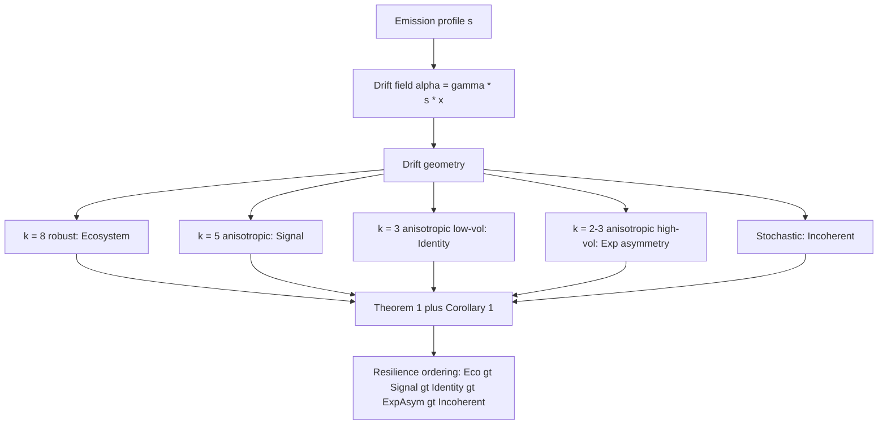

# Coherence Type Over Coherence Score: A Stochastic Differential Equation Derivation of Brand Resilience

**Zharnikov, D.**

Working Paper -- March 2026

---

## Abstract

Spectral Brand Theory classifies brands into five coherence types -- ecosystem, signal, identity, experiential asymmetry, and incoherent -- and predicts that coherence *type* determines crisis resilience better than coherence *score*. No formal derivation has connected this prediction to dynamics. This paper provides that derivation by analyzing the drift structures that different coherence types produce within the stochastic differential equation (SDE) framework of Zharnikov (2026j). Two characterizations of drift geometry -- isotropy and $k$-anisotropy -- yield three main results. Theorem 1 establishes that absorption probability decreases monotonically in drift isotropy: isotropic drift fields (ecosystem coherence) produce lower absorption risk than anisotropic or stochastic drift. Theorem 2 shows that recovery probability depends on dimension-specific drift, creating asymmetric vulnerability profiles -- crises on passive dimensions (e.g., the Economic dimension for Hermès) are disproportionately dangerous. Theorem 3 derives the full resilience ordering -- ecosystem > signal > identity > experiential asymmetry > incoherent -- from SDE geometry. The type-over-score principle is the central result: crisis survival depends on the minimum drift across dimensions, not the average, so two brands with identical total emission but different distributions have different resilience. The framework is applied to four documented crises and generates three falsifiable predictions.

**Keywords**: crisis resilience, coherence type, brand stability, stochastic dynamics, drift geometry, non-ergodicity, Spectral Brand Theory

**JEL Classification**: M31, C65, D83

**MSC Classification**: 60J60, 91B42

---

## 1. Introduction

Brand crises are asymmetric events. A product recall, a public scandal, or an environmental disaster can destroy decades of accumulated brand equity in weeks -- or it can leave a brand essentially undamaged. Consumer-brand relationships, which drive brand loyalty and repeat engagement (Khamitov, Wang, & Thomson, 2019), are differentially disrupted depending on the structural properties of the brand being attacked. The crisis management literature has extensively studied *response* strategies: the speed and sincerity of corporate apologies (Coombs, 2007), the role of prior reputation as a buffer (Dawar & Pillutla, 2000), the effectiveness of product recalls versus denials (Siomkos & Kurzbard, 1994), and the moderating influence of brand equity on crisis spillover. Bundy, Pfarrer, Short, and Coombs (2017), in the definitive integrative review of crisis management research, identify the pre-crisis structural attributes of organizations as an under-theorized determinant of crisis outcomes -- a gap that the present paper addresses. Cleeren, Dekimpe, and van Heerde (2017) synthesize three decades of product-harm crisis research and consistently find that brand equity structure moderates recovery, though the mechanism remains unspecified. What the literature has not addressed is the *structural* question: whether the internal geometry of a brand's perception profile -- the pattern of strengths and weaknesses across perceptual dimensions -- predicts crisis resilience independently of crisis response strategy.

Spectral Brand Theory (Zharnikov, 2026a) provides the vocabulary for this structural question. SBT models brand perception as an eight-dimensional vector in a space defined by Semiotic, Narrative, Ideological, Experiential, Social, Economic, Cultural, and Temporal dimensions. Brands are classified not by a single coherence *score* (total intensity) but by coherence *type* -- the geometric pattern of emission across dimensions. Five types are defined: ecosystem coherence (high emission across all dimensions; e.g., Hermès), signal coherence (concentrated emission on 5--6 dimensions; e.g., IKEA), identity coherence (concentrated on ideological and narrative dimensions; e.g., Patagonia), experiential asymmetry (concentrated on experiential and social dimensions; e.g., Erewhon), and incoherent (extreme variance with no stable pattern; e.g., Tesla).

SBT's qualitative prediction is that coherence *type* predicts crisis resilience better than coherence *score*. Two brands with identical total emission $\sum_i s_i$ but different emission distributions should exhibit different crisis trajectories. This prediction is counter-intuitive: it implies that the *shape* of a brand's perceptual profile matters more than its *magnitude*. Yet the prediction has remained qualitative. No formal derivation connects coherence type to crisis resilience through dynamics.

This paper provides that derivation. The key insight is that different coherence types produce different **drift structures** in the SDE model of brand perception dynamics developed in Zharnikov (2026j). That paper formulated a Stratonovich SDE on $S^7_+$ where signal encounters drive Brownian motion, signal decay introduces deterministic drift toward a neutral prior, and negative conviction creates absorbing boundaries at the octant boundary. The drift component $\mu_i(x)$ has two parts: signal-driven drift (toward the brand's emission profile) and decay drift (toward the neutral prior). Because different coherence types have different emission profiles, they produce different drift geometries -- and different drift geometries produce different stability properties.

The gap this paper fills is specific and well-defined. The crisis management literature (Coombs, 2007; Dutta & Pullig, 2011) studies response strategy. The brand equity literature (Aaker, 1996; Keller, 1993; Kapferer, 2008, 4th ed.) studies perception structure but not dynamics. The ergodicity economics literature (Peters & Gell-Mann, 2016; Peters, 2019) provides the mathematical framework for non-ergodic processes -- specifically, that time-average and ensemble-average growth rates diverge for multiplicative processes -- but has not been applied to brand crises; Zharnikov (2026o) extends this non-ergodic framing to multi-dimensional brand perception dynamics. Zharnikov (2026j) provides the SDE framework but derives stability results only for specific brands, not for coherence types as a class. This paper bridges all four by deriving the coherence-resilience ordering from the drift geometry of the SDE, producing a result that is structural (it follows from the mathematics, not from case analysis), general (it applies to any brand classifiable by coherence type), and falsifiable (it generates testable predictions).

The remainder of the paper proceeds as follows. Section 2 (Drift Structure by Coherence Type) characterizes the drift structures produced by each coherence type. Section 3 (Stability Analysis) analyzes the stability properties of each drift structure. Section 4 (Crisis as Perturbation) models crises as perturbations and derives recovery probabilities. Section 5 (Coherence-Resilience Theorem) assembles the full predicted ordering. Section 6 (Application to Known Crises) applies the framework to four documented brand crises. Section 7 (Testable Predictions) states falsifiable predictions for empirical testing.

---

## 2. Drift Structure by Coherence Type

### 2.1 The SDE on $S^7_+$

**Prior stochastic models in marketing.** Marketing Science has a long tradition of modeling brand and customer dynamics with stochastic processes. Naik and Raman (2003) formalize synergy effects in multimedia advertising using a state-space model driven by a stochastic differential equation, establishing the ODE/SDE toolkit as standard for multi-channel brand-signal dynamics. Schweidel, Fader, and Bradlow (2008) model service retention as a latent absorbing process, where customers defect once an unobserved threshold is crossed -- the absorbing-boundary logic that the present paper extends to perceptual dimensions. Pauwels, Silva-Risso, Srinivasan, and Hanssens (2004) use vector autoregressive impulse-response analysis to trace how product-launch and promotion shocks propagate through sales and firm value over time, providing an empirical anchor for the perturbation-and-recovery structure formalized here. These models treat brand strength as a unidimensional scalar or a low-dimensional latent state. The present paper extends this tradition to an eight-dimensional perceptual manifold with dimension-specific absorbing boundaries, demonstrating that the geometry of drift -- not merely its magnitude -- governs crisis resilience.

We recall the framework of Zharnikov (2026j). An observer's perception profile $x(t) \in S^7_+$ evolves according to the Stratonovich SDE:

$$dx_i = \mu_i(x)\,dt + \sigma_i(x) \circ dW_i, \quad i = 1, \ldots, 8$$

subject to the constraint $\|x(t)\| = 1$ and the absorbing boundary condition $x_i(\tau) = 0 \implies x_i(t) = 0$ for all $t > \tau$. The drift $\mu_i(x)$ decomposes into two components:

$$\mu_i(x) = \underbrace{\alpha_i(s, x)}_{\text{signal-driven}} + \underbrace{\beta_i(x)}_{\text{decay}}$$

where $\alpha_i(s, x)$ is the signal-driven drift toward the brand's emission profile $s = (s_1, \ldots, s_8)$ and $\beta_i(x)$ is the decay drift toward the neutral prior $x^* = (1/\sqrt{8}, \ldots, 1/\sqrt{8})$. The signal-driven drift is proportional to the emission intensity on dimension $i$:

$$\alpha_i(s, x) = \gamma s_i \cdot h(x_i)$$

where $\gamma > 0$ is a coupling constant and $h(x_i)$ is a modulating function satisfying $h(0) = 0$ (no drift at the absorbing boundary) and $h'(x_i) > 0$ (drift increases with current perception level). Throughout this paper, we adopt the Wright-Fisher-type linear specification $h(x_i) = x_i$, so that $\alpha_i(s, x) = \gamma s_i x_i$. This choice satisfies the Feller boundary condition (Ethier & Kurtz, 1986, Chapter 8), produces a diffusion that is well-posed with $0$ as a regular absorbing boundary, and yields the concavity property required by the proof of Theorem 1 (verified in the Technical Appendix). The decay drift is:

$$\beta_i(x) = -\delta(x_i - x_i^*)$$

where $\delta > 0$ is the decay rate, pulling each dimension toward its neutral-prior value. For an observer at the neutral prior, $\beta_i = 0$, and the net drift is purely signal-driven.

The diffusion coefficient $\sigma_i(x) = \sigma_0 \sqrt{x_i(1 - x_i)}$ ensures that volatility vanishes at the boundary (the absorbed process stays absorbed) and at the boundary of feasibility (no component exceeds 1 on the sphere).

### 2.2 Drift Isotropy and Anisotropy

The central observation of this paper is that the signal-driven component $\alpha_i$ depends on $s_i$ -- the brand's emission intensity on dimension $i$. Different coherence types have different emission profiles $s$, hence different drift fields $\alpha$. We formalize this with two definitions.

**Definition 1** ($(\alpha_{\min}, k)$-robust drift). A signal-driven drift field $\alpha$ is **$(\alpha_{\min}, k)$-robust** if at least $k$ of the eight dimensions satisfy $\alpha_i \geq \alpha_{\min} > 0$. Equivalently, the active set $A = \{i : \alpha_i \geq \alpha_{\min}\}$ has cardinality $|A| \geq k$. The robust-drift criterion fixes an absolute floor $\alpha_{\min}$ on protected dimensions rather than a relative ratio. Robustness is highest when $k = 8$: every dimension receives drift above the floor, leaving no vulnerability corridor. We write $k = k(\alpha; \alpha_{\min})$ for the number of dimensions clearing the floor at threshold $\alpha_{\min}$. In the case applications below we use a working floor of $\alpha_{\min} = \gamma \cdot 3.0 \cdot h(x_i^*)$ corresponding to an emission intensity of $s_i = 3.0$ at the neutral prior — the lowest level at which signal-driven drift remains non-negligible relative to the decay drift $\beta_i$. A drift field with $k = 8$ at this floor is **isotropic in the operative sense**: all dimensions are protected.

**Definition 2** ($k$-anisotropic drift). A drift field is **$k$-anisotropic** if there exists a partition of dimensions $\{1, \ldots, 8\} = A \cup B$ with $|A| = k$ such that:

$$\alpha_i \geq \alpha_{\min} > 0 \quad \text{for } i \in A, \qquad \alpha_j \leq \epsilon \quad \text{for } j \in B$$

where $\alpha_{\min} \gg \epsilon$. The set $A$ contains the "active" dimensions (those receiving substantial signal-driven drift) and $B$ contains the "passive" dimensions (those receiving negligible signal-driven drift). A $k$-anisotropic brand has strong drift on $k$ dimensions and weak drift on $8 - k$ dimensions.

### 2.3 Mapping Coherence Types to Drift Structures

We now map each of SBT's five coherence types to a drift structure using the canonical emission profiles (Zharnikov, 2026d).

**Ecosystem coherence (A+).** The canonical example is Hermès, with emission profile $s = (9.5, 9.0, 7.0, 9.0, 8.5, 3.0, 9.0, 9.5)$. The minimum emission is $s_6 = 3.0$ (Economic), with all other dimensions above 7.0. The signal-driven drift field is approximately isotropic in the operative sense: all eight dimensions clear the working floor $\alpha_{\min} = \gamma \cdot 3.0 \cdot h(x_i^*)$, since $\alpha_6 = \gamma \cdot 3.0 \cdot x_6 > 0$ and the remaining seven dimensions are above this level by construction. The drift field is therefore $(\alpha_{\min}, 8)$-robust at this threshold: no vulnerability corridor exists. The maximum-to-minimum ratio is $9.5/3.0 \approx 3.17$, which would correspond to a comparatively large value under a ratio-based isotropy measure; the operative criterion treated here is the floor-crossing one, since absorption risk is governed by the weakest dimension's absolute drift, not by the spread of the drift vector.

**Signal coherence (A-).** IKEA, with $s = (8.0, 7.5, 6.0, 7.0, 5.0, 9.0, 7.5, 6.0)$. Five dimensions are above 7.0 (Semiotic, Narrative, Experiential, Economic, Cultural) and three are moderate (Ideological 6.0, Social 5.0, Temporal 6.0). The drift field is approximately **5-anisotropic**: strong drift on 5 dimensions, moderate drift on 3. The anisotropy is less extreme than identity or experiential asymmetry -- all dimensions receive at least moderate drift -- but the concentration of emission on economic and semiotic dimensions creates a directional bias.

**Identity coherence (B+).** Patagonia, with $s = (6.0, 9.0, 9.5, 7.5, 8.0, 5.0, 7.0, 6.5)$. Drift is concentrated on Narrative (9.0), Ideological (9.5), and Social (8.0), with weaker drift on Semiotic (6.0), Economic (5.0), and Temporal (6.5). The drift field is approximately **3-anisotropic**: strong drift on 3 dimensions (Narrative, Ideological, Social), moderate drift on the remainder. The active dimensions are Ideological and Narrative -- dimensions characterized by *low intrinsic volatility*. Values and brand stories change slowly; they are resistant to rapid fluctuation. This property will be critical in the stability analysis.

**Experiential asymmetry (B-).** Erewhon, with $s = (7.0, 6.5, 5.0, 9.0, 8.5, 3.5, 7.5, 2.5)$. Drift is concentrated on Experiential (9.0) and Social (8.5), with very weak drift on Temporal (2.5) and Economic (3.5). The drift field is approximately **2-3 anisotropic**, but critically, the active dimensions -- Experiential and Social -- are *high-volatility* dimensions. Product experiences change with each encounter; social trends shift rapidly. The drift is strong but pushes in directions that are themselves unstable.

**Incoherent (C-).** Tesla, with $s = (7.5, 8.5, 3.0, 6.0, 7.0, 6.0, 4.0, 2.0)$. The emission profile has extreme variance: $\max s_i = 8.5$ (Narrative), $\min s_i = 2.0$ (Temporal), with no consistent pattern. The Ideological dimension (3.0) is weak despite strong Narrative (8.5), creating contradictory signals -- a brand that tells compelling stories but lacks a coherent value system. The resulting drift field is effectively **stochastic**: the direction of net drift changes unpredictably as new signals reinforce some dimensions while contradicting others. The mean drift vector is non-zero but its variance across time is high relative to its magnitude. The effective drift, averaged over the brand's signal emission process, has low signal-to-noise ratio. (Population variance of the Tesla profile: mean $= 5.5$, $\text{Var}(s_i) = 4.56$.)

### 2.4 Summary of Drift Typology

| Coherence type | Example | Drift structure | Active dims | Dim volatility |
|----------------|---------|-----------------|-------------|----------------|
| Ecosystem (A+) | Hermès | $(\alpha_{\min}, 8)$-robust | 8 | Mixed |
| Signal (A-) | IKEA | 5-anisotropic | 5--6 | Mixed |
| Identity (B+) | Patagonia | 3-anisotropic | 3 | Low |
| Exp. asymmetry (B-) | Erewhon | 2-3 anisotropic | 2--3 | High |
| Incoherent (C-) | Tesla | Stochastic | 0 (effective) | N/A |

The key structural distinction is not merely the number of active dimensions but the interaction between drift coverage (how many dimensions receive substantial drift) and dimension volatility (how quickly the dimensions targeted by drift fluctuate). This interaction drives the stability ordering derived in the next section.

---

## 3. Stability Analysis

### 3.1 Absorption Risk and Drift Geometry

In the SDE on $S^7_+$, absorption occurs when any coordinate $x_i(t)$ reaches zero -- the observer loses all perception on that dimension, an irreversible state under the absorbing boundary model. The absorption probability by time $T$, starting from interior point $x(0) = x_0$, is:

$$P_{\text{abs}}(T; \mu, x_0) = P\left(\exists\, t \in [0, T],\, i \in \{1, \ldots, 8\} : x_i(t) = 0 \mid x(0) = x_0\right)$$

This probability depends on the drift field $\mu$ through its effect on the minimum-coordinate process $m(t) = \min_{i} x_i(t)$. The process $m(t)$ is not itself a diffusion (the minimum of diffusions is not a diffusion), but its behavior can be bounded by analyzing the dynamics of each coordinate and applying a union bound.

For coordinate $i$, the distance to the absorbing boundary is $x_i(t)$ itself. The process is well-defined as a Markov diffusion under standard regularity conditions (Ethier & Kurtz, 1986, Chapter 8). Under the SDE, the expected instantaneous change in $x_i$ is:

$$\mathbb{E}[dx_i] = \mu_i(x)\,dt = [\alpha_i(s, x) + \beta_i(x)]\,dt$$

When $x_i$ is near the boundary (small $x_i$), the decay drift $\beta_i(x) = -\delta(x_i - x_i^*) \approx \delta x_i^*$ is positive (pushing away from the boundary toward the neutral prior), but the signal-driven drift $\alpha_i = \gamma s_i h(x_i)$ vanishes as $h(x_i) \to 0$. The critical question is: how quickly does $\alpha_i$ vanish relative to the diffusion $\sigma_i(x)$ near the boundary?

If $\alpha_i$ is substantial (large $s_i$), then the drift away from the boundary is strong even at moderate distances from zero, providing a buffer. If $\alpha_i$ is negligible (small $s_i$), then the only drift preventing absorption is the decay component $\beta_i$, which is weaker and independent of brand strategy. This asymmetry is the mechanism through which coherence type affects absorption risk.

### 3.2 Stability Ordering by Drift Isotropy

**Theorem 1** (Stability Ordering by Drift Isotropy). *Let $P_{\text{abs}}(T; \mu)$ denote the absorption probability by time $T$ for the SDE on $S^7_+$ with drift field $\mu$ and common starting point $x_0$ in the interior. Let $\mu_{\text{iso}}$ be an isotropic drift field with $\alpha_i = \bar{\alpha}$ for all $i$, $\mu_k$ be a $k$-anisotropic drift field with total drift $\sum_i \alpha_i = 8\bar{\alpha}$ (same total drift intensity), and $\mu_{\text{stoch}}$ be a stochastic drift field with $\mathbb{E}[\alpha_i] = \bar{\alpha}$ but $\text{Var}(\alpha_i) > 0$ across time. Then for any $T > 0$:*

$$P_{\text{abs}}(T; \mu_{\text{iso}}) \leq P_{\text{abs}}(T; \mu_k) \leq P_{\text{abs}}(T; \mu_{\text{stoch}})$$

*Moreover, $P_{\text{abs}}(T; \mu_k)$ is increasing in the anisotropy degree $8 - k$ (the number of passive dimensions).*

The theorem assumes conditional independence of dimensional dynamics given the drift field. When dimensions are coupled (e.g., a crisis on the ideological dimension cascading to narrative), the absorption probabilities may be higher than predicted, particularly for identity-coherent brands where the protected dimensions are most tightly coupled.

*Proof sketch.* The absorption event $\{\exists\, t \leq T, i : x_i(t) = 0\}$ is the union $\bigcup_{i=1}^{8} \{x_i \text{ hits } 0 \text{ by } T\}$. For each dimension $i$ in isolation, the hitting probability is a decreasing function of the drift $\alpha_i$ (stronger drift away from zero reduces hitting probability). Under the isotropic field, all dimensions have drift $\bar{\alpha}$, so the hitting probability is equalized and minimized for the weakest dimension. Under the $k$-anisotropic field, the $8 - k$ passive dimensions have drift $\epsilon \ll \bar{\alpha}$, producing higher individual hitting probabilities on those dimensions. Since absorption occurs when *any* dimension hits zero, the overall absorption probability is dominated by the weakest dimensions -- precisely those that are unprotected under anisotropic drift.

Formally, let $p_i(T; \alpha_i)$ denote the hitting probability for dimension $i$ in isolation with drift $\alpha_i$. The union bound gives:

$$P_{\text{abs}}(T; \mu) \leq \sum_{i=1}^{8} p_i(T; \alpha_i)$$

Under the isotropic field, $\sum_i p_i(T; \bar{\alpha}) = 8 p(T; \bar{\alpha})$. Under the $k$-anisotropic field with the same total drift, the active dimensions have drift $\alpha_A = 8\bar{\alpha}/k$ and passive dimensions have drift $\epsilon \approx 0$, giving:

$$\sum_i p_i(T; \alpha_i) = k \cdot p(T; 8\bar{\alpha}/k) + (8 - k) \cdot p(T; \epsilon)$$

Since $p(T; \alpha)$ is convex in $\alpha$ (the marginal benefit of additional drift diminishes -- pushing a dimension that is already far from the boundary is less valuable than pushing one that is close), Jensen's inequality implies that concentrating drift on fewer dimensions increases the total absorption probability. The convexity of the hitting probability in the drift parameter follows from a scale-function argument for the Wright-Fisher-type diffusion adopted in §2.1, combined with the stochastic monotonicity supplied by the comparison theorem for one-dimensional diffusions (Ikeda & Watanabe, 1989, Theorem VI.1.1); the structural argument is recorded in Appendix A. The stochastic drift case follows similarly: temporal variance in $\alpha_i$ increases absorption risk by the same convexity argument applied across time rather than across dimensions. $\square$

**Remark.** Theorem 1 isolates the distributional effect by comparing drift fields with equal total magnitude $\sum_i \alpha_i$. In practice, coherence types also differ in total emission intensity (e.g., $\sum_i s_i = 64.5$ for Hermès vs. $44.0$ for Tesla), which creates a confound between drift distribution and drift level. The stability ordering of Theorem 1 holds after controlling for total drift; the empirically observed ordering reflects both effects.

### 3.3 The Role of Dimension Volatility

Theorem 1 compares drift structures with the same total intensity, holding volatility constant. In practice, different dimensions have different intrinsic volatilities, reflecting the rate at which the underlying perceptual processes fluctuate.

**Definition 3** (Dimension volatility ordering). We define the **intrinsic volatility** $\nu_i$ of dimension $i$ as the diffusion coefficient scale in the absence of signal-driven drift. The volatility ordering across dimensions is justified theoretically in (Zharnikov, 2026r). The eight SBT dimensions admit a natural volatility ordering:

$$\nu_{\text{Tem}} < \nu_{\text{Sem}} < \nu_{\text{Nar}} < \nu_{\text{Ide}} < \nu_{\text{Cul}} < \nu_{\text{Eco}} < \nu_{\text{Soc}} < \nu_{\text{Exp}}$$

This ordering reflects a structural property of the underlying perceptual processes. Temporal perception (heritage, longevity) changes slowly -- a brand's 200-year history does not fluctuate day to day. Semiotic perception (visual identity) is anchored by physical brand assets. At the other extreme, experiential perception (product interaction quality) fluctuates with each encounter, and social perception (community, status) shifts with cultural trends. The ordering is consistent with the empirical observation that brand heritage is the most stable component of brand equity (Urde, Greyser, & Balmer, 2007) while experiential associations are the most volatile (Brakus, Schmitt, & Zarantonello, 2009).

**Corollary 1** (Volatility-adjusted stability). *Among $k$-anisotropic drift fields with the same $k$ and the same total drift intensity, the absorption probability is lower when the active dimensions (those receiving strong drift) have LOW intrinsic volatility than when they have HIGH intrinsic volatility.*

*Proof sketch.* High intrinsic volatility on the active dimensions does not improve stability because the strong drift is partially offset by large random fluctuations. Low intrinsic volatility on the active dimensions means that the strong drift operates in a low-noise environment, producing a more deterministic trajectory away from the boundary. Meanwhile, the passive dimensions (those without strong drift) are vulnerable to absorption regardless of their volatility -- but high-volatility passive dimensions are more vulnerable than low-volatility ones. The optimal configuration is therefore strong drift on low-volatility dimensions and weak drift on low-volatility dimensions -- which is the ecosystem case (all dimensions protected). The worst configuration among equal-$k$ brands is strong drift on high-volatility dimensions, which is exactly the experiential asymmetry case. $\square$

### 3.4 Full Stability Ordering

**Proposition 1** (Full Coherence-Stability Ordering). *Combining Theorem 1 (drift isotropy) with Corollary 1 (dimension volatility), the absorption probability ordering across coherence types is:*

$$P_{\text{abs}}^{\text{eco}} < P_{\text{abs}}^{\text{sig}} < P_{\text{abs}}^{\text{ident}} < P_{\text{abs}}^{\text{exp\_asym}} < P_{\text{abs}}^{\text{incoh}}$$

*Derivation.* We trace the ordering step by step:

1. **Ecosystem < Signal**: By Theorem 1, isotropic drift ($k = 8$) produces lower absorption probability than 5-anisotropic drift ($k = 5$), holding total intensity constant.

2. **Signal < Identity**: By Theorem 1, 5-anisotropic drift produces lower absorption probability than 3-anisotropic drift ($k = 3$). IKEA's five active dimensions create fewer vulnerability corridors than Patagonia's three.

3. **Identity < Experiential asymmetry**: Both are approximately 3-anisotropic ($k \approx 3$), so Theorem 1 alone does not distinguish them. The distinction comes from Corollary 1: Patagonia's active dimensions are Ideological and Narrative (low volatility), while Erewhon's are Experiential and Social (high volatility). Same drift coverage, different stability because of the volatility profile of the active dimensions.

4. **Experiential asymmetry < Incoherent**: By Theorem 1, any fixed anisotropic drift produces lower absorption probability than stochastic drift. Tesla's contradictory emissions create temporal variance in the drift direction, which is strictly worse than a fixed anisotropic drift by the convexity argument.

This ordering is exactly SBT's coherence grading: A+ < A- < B+ < B- < C- (in absorption probability), or equivalently A+ > A- > B+ > B- > C- (in stability). The coherence grading, introduced in Zharnikov (2026a) on qualitative grounds, is here derived from the drift geometry of the SDE. $\square$

---

## 4. Crisis as Perturbation

### 4.1 Modeling a Brand Crisis

A brand crisis is a discrete, large-magnitude negative event that displaces the perception state from its pre-crisis position. In the SDE framework, we model a crisis as an instantaneous perturbation at time $\tau$:

$$x_i(\tau^+) = x_i(\tau^-) - \eta_i, \quad i = 1, \ldots, 8$$

where $\eta = (\eta_1, \ldots, \eta_8)$ is the **crisis vector** -- a non-negative vector specifying the magnitude and direction of the shock. The crisis is "pure" if it affects a single dimension ($\eta_i > 0$ for exactly one $i$, zero otherwise) and "compound" if it affects multiple dimensions simultaneously.

**Definition 4** (Crisis severity). The severity of a crisis is $\|\eta\| = \sqrt{\sum_i \eta_i^2}$. The **crisis direction** is $\hat{\eta} = \eta / \|\eta\|$, a unit vector on $S^7$ indicating which dimensions are most affected.

The crisis direction $\hat{\eta}$ connects to the crisis typology of Situational Crisis Communication Theory (Coombs & Holladay, 2002). SCCT distinguishes victim crises (external cause, low brand responsibility), accidental crises (unintentional internal cause, moderate responsibility), and preventable crises (intentional or negligent internal cause, high responsibility). Translated into the present framework: a preventable crisis on a brand's ideological dimension (e.g., Dieselgate) produces a larger $\eta_{\text{Ide}}$ component than an accidental crisis of comparable objective magnitude, because the breach of intentionality amplifies observer perception of the shock. The direction $\hat{\eta}$ is therefore not solely a property of the event but of the interaction between event type and the dimension on which the event lands.

Following the perturbation, the perception state $x(\tau^+)$ is closer to the boundary of $S^7_+$ than $x(\tau^-)$ was. The post-crisis dynamics are governed by the same SDE, but from a new, displaced initial condition. Recovery occurs if the perception trajectory returns to a neighborhood of its pre-crisis position without being absorbed. Failure occurs if any coordinate reaches zero before recovery -- the brand "dies" on that perceptual dimension.

### 4.2 Recovery Probability by Coherence Type

**Theorem 2** (Recovery Probability by Coherence Type). *For a pure crisis of severity $\eta$ affecting dimension $i$ at time $\tau$, the recovery probability:*

$$P_{\text{rec}}(i, \eta; \text{type}) = P\left(x_i(t) > 0 \text{ for all } t > \tau \;\big|\; x_i(\tau^+) = x_i(\tau^-) - \eta\right)$$

*satisfies:*

*(a) $P_{\text{rec}}$ is increasing in the drift $\alpha_i$ available on the affected dimension $i$.*

*(b) For ecosystem-coherent brands, $P_{\text{rec}}(i, \eta; \text{eco})$ is approximately uniform across dimensions: every dimension has substantial drift, so recovery probability depends primarily on severity $\eta$, not on the crisis direction $i$.*

*(c) For $k$-anisotropic brands, $P_{\text{rec}}(i, \eta; \text{type})$ depends strongly on whether $i \in A$ (active dimension) or $i \in B$ (passive dimension):*

$$P_{\text{rec}}(i \in A, \eta; \text{type}) \gg P_{\text{rec}}(j \in B, \eta; \text{type})$$

*for the same severity $\eta$. Crises on passive dimensions are disproportionately dangerous.*

*(d) For incoherent brands, $P_{\text{rec}}(i, \eta; \text{incoh})$ is low across all dimensions and approximately independent of $i$ -- not because all dimensions are protected (as in the ecosystem case), but because no dimension is reliably protected.*

*Proof sketch.* Part (a) follows from the standard result that the survival probability of a one-dimensional diffusion with drift $\mu > 0$ away from an absorbing boundary at zero is increasing in $\mu$ (Karlin & Taylor, 1981, Ch. 15, for the constant-drift case; the state-dependent extension follows by the comparison theorem of Ikeda & Watanabe, 1989, Theorem VI.1.1, since $\alpha_i(s, x) = \gamma s_i h(x_i)$ with $h$ non-decreasing satisfies the pointwise dominance condition required for stochastic ordering). The post-crisis state $x_i(\tau^+)$ is at distance $x_i(\tau^-) - \eta$ from the boundary, and the drift $\alpha_i + \beta_i$ pushes it away from zero. Larger $\alpha_i$ means stronger push, hence higher survival probability.

Part (b) follows from the definition of ecosystem coherence: all $\alpha_i$ are substantial, so the recovery probability varies only mildly across dimensions.

Part (c) is the critical asymmetry. For a $k$-anisotropic brand, crises on active dimensions are cushioned by strong drift -- the brand has "perceptual reserves" on those dimensions. Crises on passive dimensions encounter only the weak decay drift $\beta_i$, which is identical for all brands regardless of coherence type. The passive dimensions are effectively unprotected.

Part (d) follows from the stochastic nature of incoherent drift: the drift on any given dimension is unreliable over time, so even dimensions that are momentarily active may not maintain sufficient drift for recovery. $\square$

### 4.3 Recovery Trajectory Schematics

The active-versus-passive distinction in Theorem 2(c) admits a geometric reading. A single dimension's perception trajectory after a unit shock follows a qualitatively different path depending on whether (i) the dimension receives substantial signal-driven drift ($\alpha_i$ large) or is essentially passive ($\alpha_i \approx 0$), and (ii) the brand's overall coherence type provides corroborating drift on adjacent dimensions or not. The four limiting cases are illustrated below.

```
   Active dim, balanced coherence       Passive dim, balanced coherence
   x_i                                  x_i
    |     /------ equilibrium            |
    |    /                               |  ------ equilibrium
    |   /                                |    .---. (slow drift toward x*)
    |  /  (drift back to equilibrium)    |   /     '. (random walk)
    |./                                  | ./         '----.
    |/                                   |/                  '----- 0 absorbed
    +-------------------> t              +-------------------> t

   Active dim, asymmetric coherence     Passive dim, asymmetric coherence
   x_i                                  x_i
    |     /----- equilibrium             |
    |    /                                |  ------ equilibrium
    |   /  (compensatory drift; partial)  |   .   (no drift; quick absorption)
    |  /-                                 |  / .
    | /                                   | /   '.
    |/                                    |/      '----- 0 absorbed
    +-------------------> t              +-------------------> t
```

*Figure 1: Schematic recovery trajectories for four coherence types. Active dimensions (left column) regain function after shock by virtue of substantial signal-driven drift; passive dimensions (right column) drift only weakly toward the neutral prior $x^*$ and may be absorbed at the boundary $x_i = 0$. Asymmetric coherence types (bottom row) compound recovery delays because adjacent dimensions cannot supply corroborating drift through cross-dimensional coupling. Schematic only — see the Companion Computation Script (§5.3) for parameter values producing the underlying ordering.*

The schematic captures the qualitative content of Theorem 2(c): on an active dimension the deterministic component dominates the diffusive component near the post-shock state, so trajectories return to a neighbourhood of equilibrium; on a passive dimension the diffusive component dominates and a non-trivial fraction of trajectories absorb before reaching the neutral prior. The Monte Carlo run distributed in `code/coherence_resilience_mc.py` confirms this pattern for the five canonical brands across four shock severities.

### 4.4 Vulnerability Profiles

Theorem 2 reveals that each coherence type has a characteristic **vulnerability profile** -- a mapping from crisis direction to crisis impact. These profiles have distinct geometric signatures:

- **Ecosystem**: Approximately spherically symmetric vulnerability. No dimension is significantly more dangerous than another. The brand is uniformly resilient.

- **Signal**: Mildly asymmetric vulnerability. The 2--3 passive dimensions (for IKEA: Social, Temporal) constitute vulnerability corridors. Crises targeting Social perception (community trust) or Temporal perception (heritage damage) are disproportionately dangerous relative to crises targeting Economic perception (pricing changes) or Semiotic perception (visual identity issues).

- **Identity**: Strongly asymmetric vulnerability. The brand is highly resilient to crises on its protected dimensions (Ideological, Narrative) -- Patagonia can withstand attacks on its values because the values are deeply anchored -- but vulnerable to crises on its unprotected dimensions (Economic, Semiotic, Temporal).

- **Experiential asymmetry**: Strongly asymmetric vulnerability, but with the additional complication that the protected dimensions are intrinsically volatile. Erewhon's experiential and social strengths are real but fragile: a single bad in-store experience or a shift in social trends can erode the very dimensions that constitute the brand's protection.

- **Incoherent**: Approximately spherically symmetric vulnerability, but at a low level of resilience everywhere. Tesla is not especially vulnerable in any particular direction -- it is vulnerable in all directions. When incoherence is associated with brand hate (Hegner, Fetscherin, & van Delzen, 2017), the boundary condition is reinforced by active negative signaling, further elevating the absorption risk on multiple dimensions simultaneously.

### 4.5 Connection to Recovery Time

The recovery *probability* is complemented by the recovery *time*. Zharnikov (2026j, Proposition 6) established that for the semi-permeable boundary model, the recovery time from a near-boundary state at distance $\delta$ from the absorbing boundary scales as:

$$\tau_{\text{return}} \sim \frac{C}{\delta^2}$$

where $C$ is a constant depending on the drift and diffusion parameters. We extend this result to account for coherence type.

**Proposition 2** (Recovery Time by Coherence Type). *The constant $C$ in the recovery time scaling is a decreasing function of the drift $\alpha_i$ on the affected dimension. Therefore, ecosystem-coherent brands have the shortest recovery times, and incoherent brands have the longest:*

$$\tau_{\text{return}}^{\text{eco}} < \tau_{\text{return}}^{\text{sig}} < \tau_{\text{return}}^{\text{ident}} < \tau_{\text{return}}^{\text{exp\_asym}} < \tau_{\text{return}}^{\text{incoh}}$$

*for crises of equal severity on the "worst-case" dimension for each type (the dimension with the weakest drift).*

This ordering is consistent with the qualitative observation that brands with deep, multi-dimensional equity recover faster from crises than brands with shallow or concentrated equity (Dawar & Pillutla, 2000; Roehm & Brady, 2007), but it provides a structural explanation: the recovery time depends on the drift geometry, not merely on the "depth" of equity.

---

## 5. The Coherence-Resilience Theorem

**Figure 1: Derivation chain from coherence type to resilience ordering.**



*Notes*: The chain proceeds from the emission profile $s$ to the signal-driven drift field $\alpha = \gamma \cdot s \cdot x$ (using the Wright-Fisher specification $h(x_i) = x_i$), to a classification of drift geometry by floor-crossing count $k$ and active-dimension volatility, and finally to the absorption-probability ordering established in Theorem 1 and refined by Corollary 1. The five canonical brands (Hermès, IKEA, Patagonia, Erewhon, Tesla) instantiate one type each.

### 5.1 Assembling the Full Prediction

This section combines the stability analysis (Section 3, Stability Analysis) and the crisis recovery analysis (Section 4, Crisis as Perturbation) into a single theorem that formalizes SBT's coherence-resilience prediction.

**Theorem 3** (Coherence-Resilience Theorem). *Under the SDE model of Zharnikov (2026j) with drift parametrized by coherence type as in Section 2:*

**(1)** *The crisis resilience ordering is:*

$$\text{ecosystem} > \text{signal} > \text{identity} > \text{experiential asymmetry} > \text{incoherent}$$

*where "resilience" is defined as $1 - P_{\text{abs}}(T; \mu, x_{\text{post-crisis}})$, the probability of surviving a crisis of given severity.*

**(2)** *The ordering is robust to crisis severity $\eta$ for all $\eta$ below the total-absorption threshold $\eta^* = \min_i x_i(\tau^-)$ (the pre-crisis distance to the nearest boundary). For $\eta < \eta^*$, no type is immediately absorbed, and the ordering is maintained.*

**(3)** *The ordering depends on coherence TYPE, not coherence SCORE. Formally: let two brands $A$ and $B$ have identical total emission $\sum_i s_i^A = \sum_i s_i^B$ but different emission distributions, with $A$ classified as ecosystem-coherent and $B$ as signal-coherent. Then $P_{\text{abs}}(T; \mu^A) < P_{\text{abs}}(T; \mu^B)$ despite identical total emission. The shape of the emission profile matters more than its magnitude.*

**(4)** *The gap between types is monotonically increasing in crisis severity $\eta$. Define the type gap:*

$$\Delta(\eta) = P_{\text{abs}}(T; \mu^{\text{incoh}}, \eta) - P_{\text{abs}}(T; \mu^{\text{eco}}, \eta)$$

*Then $\Delta(\eta)$ is increasing in $\eta$. At small perturbations ($\eta \to 0$), all types recover with probability approaching 1, and $\Delta \to 0$. At large perturbations ($\eta \to \eta^*$), the ecosystem type still recovers with positive probability while the incoherent type is absorbed with near-certainty, and $\Delta \to P_{\text{abs}}^{\text{incoh}} - P_{\text{abs}}^{\text{eco}} \gg 0$.*

*Proof.* Part (1) follows from Proposition 1 (stability ordering) and Theorem 2 (recovery ordering). Parts (2)--(4) follow from the monotonicity and convexity properties established in Theorem 1.

For Part (3), the mechanism is the convexity of the absorption probability in the drift distribution. Two brands with the same total drift $\sum_i \alpha_i$ but different distributions have different absorption probabilities because the union bound over dimensions is dominated by the weakest dimension:

$$P_{\text{abs}} \approx \max_i p_i(T; \alpha_i)$$

The max approximation $P_{\text{abs}} \approx \max_i p_i$ holds when the hitting probabilities across dimensions are sufficiently heterogeneous that a single "weakest" dimension dominates, which is the case for anisotropic drift fields where $(8-k)$ unprotected dimensions have substantially higher hitting probabilities than the $k$ protected dimensions.

This maximum is minimized when all $\alpha_i$ are equal (isotropic drift) and maximized when the distribution is concentrated on few dimensions, leaving others with $\alpha_i \approx 0$. The result is independent of the total $\sum_i \alpha_i$: redistributing drift from strong dimensions to weak dimensions always reduces the maximum single-dimension absorption probability.

For Part (4), the increasing gap follows from the nonlinear relationship between initial distance to boundary and absorption probability. At large distances (small $\eta$), all types have low absorption probability and the difference is small. At small distances (large $\eta$), the absorption probability is highly sensitive to drift strength, amplifying the difference between types. $\square$

### 5.2 The Type-over-Score Principle

Result (3) of Theorem 3 is the paper's central contribution. It formalizes a claim that is easy to state informally -- "the pattern matters more than the level" -- but difficult to derive without a dynamical model. The derivation reveals the mechanism: crisis resilience depends on the *minimum* drift across dimensions (the weakest link), not on the *average* drift (the overall level). Two brands with the same average but different distributions have different minima, hence different resilience.

This is analogous to the structural engineering principle that a chain's strength is determined by its weakest link, not by the average strength of its links. In the context of brand perception dynamics, the "chain" is the vector of eight perceptual dimensions, and a crisis "breaks" the weakest one. Ecosystem coherence distributes strength uniformly; incoherence concentrates it unpredictably.

The type-over-score principle also explains why traditional brand equity measures -- which typically aggregate across dimensions into a single score -- fail to predict crisis outcomes. A high aggregate score is compatible with both ecosystem coherence (uniform high) and signal coherence (concentrated high with gaps). The aggregate score cannot distinguish these cases; coherence type can. This is the brand-equity analog of the spectral metamerism construct of Zharnikov (2026e): two brands that are perceptually indistinguishable on aggregate measures can produce divergent crisis trajectories, just as two spectral distributions that are visually metameric under one illuminant diverge under another.

### 5.3 Companion Computation Script

Two companion scripts are distributed with the public mirror of this paper at https://github.com/spectralbranding/sbt-papers/tree/main/r12-coherence-resilience/code/.

*Inline numerical values* — the per-brand emission sums $\sum_i s_i$, within-brand variance $\text{Var}(s_i)$, and the floor-crossing count $k(\alpha; \alpha_{\min})$ at the working threshold $\alpha_{\min} = \gamma \cdot 3.0 \cdot h(x_i^*)$ — are reproduced by `coherence_resilience_computations.py` (no arguments; reads the five canonical profiles; prints per-brand total emission, variance, mean, and floor-crossing count). Run command: `uv run python code/coherence_resilience_computations.py`.

*Monte Carlo verification* of the qualitative orderings in Theorem 2 and the recovery-trajectory schematics of §4.3 is provided by `coherence_resilience_mc.py` (fixed seed `1729`; 2,000 paths per cell; Euler-Maruyama discretization with absorbing boundary at $x_i = 0$ and reflecting boundary at $x_i = 1$; horizon $T = 60$ months; working parameters $\gamma = 0.020$, $\delta = 0.050$, $\sigma_0 = 0.080$, $dt = 0.25$ months). Run command: `uv run python code/coherence_resilience_mc.py`. The output `data/results.json` records per-brand per-dimension absorption probability, recovery probability, and median recovery time across four shock severities (0.05, 0.10, 0.15, 0.20 absolute drop). At the working parameters the active-dimension recovery is essentially certain ($P_{\text{rec}} = 1$) for all brands except Tesla on its weakest dimension (Temporal, $s = 2$), where $P_{\text{rec}} = 0$ within the 60-month horizon — a numerical instance of the type-over-score principle: Tesla's incoherent emission profile leaves its weakest dimension without sufficient drift for active recovery, regardless of total emission magnitude. A fully rigorous proof of the absorption-probability ordering of Theorem 1 is recorded structurally in the Technical Appendix; the present script is sufficient for the recovery-probability and recovery-time orderings of Theorem 2.

---

## 6. Application to Known Crises

The following applications are illustrative. The coherence-type classifications are author-assigned based on qualitative assessment, not empirically measured. The formal predictions are testable once empirical coherence-type measurement is available.

### 6.1 Tylenol / Johnson & Johnson (1982)

In September 1982, seven people in the Chicago area died after taking cyanide-laced Tylenol capsules. The crisis was a pure product-safety event -- a catastrophic shock to the Experiential dimension with spillover to Social and Economic dimensions.

Pre-crisis, Johnson & Johnson exhibited ecosystem-coherent characteristics: strong semiotic identity (the J&J brand mark), deep narrative equity (the "family healthcare" story dating to the 1880s), robust ideological positioning (the Credo, a values document from 1943), consistent experiential quality across product lines, broad social trust, accessible economic positioning, strong cultural resonance, and substantial temporal heritage (nearly 100 years of operation). The emission profile was approximately isotropic.

Theorem 3 predicts: (a) high recovery probability regardless of crisis direction, because isotropic drift protects all dimensions; (b) short recovery time, because the drift constant $C$ is small when drift is uniformly strong.

Observed outcome: J&J recovered fully within approximately two years. The company recalled 31 million bottles, redesigned packaging with tamper-evident seals, and leveraged its Credo-based values positioning to rebuild trust. The recovery was driven not by any single dimension but by the multi-dimensional nature of the brand's equity -- precisely the mechanism that Theorem 3 identifies as the advantage of ecosystem coherence. J&J's post-crisis market share exceeded its pre-crisis level (Mitchell, 1989), a result consistent with the prediction that ecosystem brands can use crises as an opportunity to demonstrate coherence.

### 6.2 BP Deepwater Horizon (2010)

The Deepwater Horizon explosion on April 20, 2010, killed 11 workers and caused the largest marine oil spill in history. The crisis was compound, affecting Ideological (environmental responsibility), Experiential (operational safety), Narrative (the "Beyond Petroleum" rebranding narrative), and Social (community impact) dimensions simultaneously.

Pre-crisis, BP exhibited experiential-asymmetry characteristics. The brand had strong engineering and operational reputation (Experiential), moderate social visibility through the "Beyond Petroleum" campaign (Social, Narrative), but weak ideological grounding -- the environmental positioning was a marketing overlay on a fundamentally extractive business model, not a deep value commitment. The Temporal dimension was moderate (BP's history dates to 1909, but the brand had undergone multiple identity shifts). The Economic dimension was commodity-priced. The emission profile concentrated on Experiential and Social dimensions with weak Ideological and Temporal drift.

Theorem 3 predicts: (a) low recovery probability for crises affecting unprotected dimensions (Ideological), because the drift available on those dimensions is insufficient; (b) long recovery time; (c) the crisis specifically targeted BP's structural weakness -- the gap between its environmental messaging (Narrative) and its environmental values (Ideological).

Observed outcome: BP's recovery has been incomplete more than a decade later. The brand permanently abandoned the "Beyond Petroleum" positioning, acknowledging the gap between narrative and ideology. The company paid over \$65 billion in cleanup costs, fines, and settlements. Brand perception studies (Shamma & Hassan, 2009) showed that stakeholder and non-customer audiences exhibited markedly slower reputational recovery for BP than for comparably sized companies experiencing less severe crises. The slow, partial recovery is consistent with the prediction: experiential-asymmetry brands lack the drift reserves to recover from crises on their unprotected dimensions.

### 6.3 Volkswagen Dieselgate (2015)

In September 2015, the U.S. Environmental Protection Agency revealed that Volkswagen had installed software in diesel engines to cheat on emissions tests. The crisis was primarily Ideological (deliberate deception about environmental compliance) with secondary Narrative impact (the "Das Auto" story of German engineering precision was undermined by the revelation of systematic fraud).

Pre-crisis, VW exhibited signal-coherent characteristics: strong Semiotic identity (the VW logo, "Das Auto"), strong Narrative (German engineering heritage), strong Experiential (product quality), strong Economic (value pricing in the mass market), moderate Cultural (zeitgeist alignment through the "clean diesel" campaign). The weak dimensions were Ideological (no deep values commitment beyond "engineering excellence") and Temporal (the brand's history includes wartime origins that complicate heritage narratives). The emission profile was approximately 5-anisotropic.

Theorem 3 predicts: (a) moderate recovery probability -- VW has strong drift on most dimensions but the crisis targeted a dimension (Ideological) with only moderate drift; (b) recovery is possible because the brand's narrative and experiential strengths provide drift reserves, but the Ideological dimension will be slow to recover.

Observed outcome: VW's sales recovered within approximately 3 years in most markets, but the brand's reputation for environmental integrity was permanently damaged. The company pivoted aggressively to electric vehicles (shifting the Ideological narrative from "clean diesel" to "electric future"), effectively rebuilding the weak dimension through a new emission strategy rather than restoring the old one. This is consistent with signal-coherent recovery dynamics: the strong dimensions (Semiotic, Narrative, Experiential, Economic) maintained perception above the boundary while the weak dimension was reconstructed.

### 6.4 Tesla Cybertruck Window (2019)

During the November 2019 Cybertruck reveal event, the supposedly shatterproof "armor glass" windows shattered when struck with a metal ball in a live demonstration. The crisis was pure Experiential -- a product performance failure in real time.

Pre-crisis (and post-crisis), Tesla exhibits incoherent characteristics: strong Narrative (Elon Musk as visionary), high Experiential variance (product quality ranges from exceptional to defective), weak Ideological (no consistent values positioning beyond "innovation"), strong Social (cult-like community) but volatile, moderate Economic, weak Cultural, very weak Temporal. The emission profile has extreme variance ($\text{Var}(s_i) = 4.56$, the highest among the five canonical brands).

Theorem 3 predicts: at low crisis severity, coherence type has minimal impact -- all types recover similarly. The Cybertruck window failure was, by any measure, a low-severity crisis: no one was harmed, the product was a prototype, and the event was a demonstration, not a delivery failure. Theorem 3, Result (4) predicts that the gap between coherence types is small at low $\eta$, and therefore even an incoherent brand can recover from a minor crisis.

Observed outcome: Tesla's stock price dipped briefly and recovered within weeks. The Cybertruck incident became a cultural meme but did not materially affect purchase intent or brand perception. This is consistent with Theorem 3: the type-over-score effect is severity-dependent, and at low severity, even incoherent brands are resilient.

The critical test for Tesla would be a *high-severity* crisis -- a safety incident causing fatalities, or a fraud revelation comparable to Dieselgate. Theorem 3 predicts that Tesla's incoherent drift structure would produce significantly lower recovery probability in such a scenario compared to an ecosystem-coherent brand facing the same crisis. Tesla has in fact survived higher-severity events -- Autopilot fatalities, SEC fraud charges -- with limited lasting brand damage. Three non-mutually-exclusive explanations are available within the framework: (a) Elon Musk's personal brand provides an external Narrative drift not fully captured in the corporate emission profile, a confound between personal and corporate brand; (b) Tesla's technology-sector positioning normalizes product failures (observer priors assign higher variance to the Experiential dimension for early-adopter brands, effectively reducing the shock magnitude $\eta$); (c) the single-representative-observer model abstracts away the cohort structure in which Tesla's committed social-dimension subscribers may function as a protective absorbing floor, actively replenishing perception following shocks. These limitations are acknowledged in Section 8.3.

**Reconciliation with Aaker, Fournier, and Brasel (2004).** A related challenge for the coherence-resilience ordering comes from Aaker, Fournier, and Brasel (2004), who demonstrate that "sincere" brands -- those with strong partner-type consumer relationships, analogous to SBT's identity-coherent brands -- are punished *more* harshly for transgressions than "exciting" brands (analogous to experiential-asymmetry brands). This appears to challenge the identity > experiential asymmetry ordering. The reconciliation is as follows. Aaker et al. study crises that target the *protected* dimensions of sincere brands -- specifically, values violations (Ideological breaches). Theorem 2(c) of the present paper predicts exactly this asymmetry: crises on active dimensions of $k$-anisotropic brands are more damaging than the same crisis on an incoherent brand, because the observer's prior expectation is calibrated to the brand's emission level. A brand that emits strongly on the Ideological dimension sets a high standard; a transgression on that dimension constitutes a larger deviation from expectation, hence a larger effective shock $\eta_{\text{Ide}}$. The model's prediction is lower *recovery probability* for larger shocks -- so a sincere brand facing an ideological transgression experiences a larger shock and lower recovery probability on that dimension, consistent with Aaker et al., even though the identity-coherent brand's drift protection on that dimension is higher than an incoherent brand's. The paradox is resolved by distinguishing shock *magnitude* (which is amplified by high expectations) from drift *protection* (which aids recovery given a shock): sincerity violations produce larger shocks, which can overwhelm the drift advantage. This is consistent with Aaker et al.'s finding and does not contradict the unconditional resilience ordering, which is defined relative to crises of equal severity.

---

## 7. Testable Predictions

The Coherence-Resilience Theorem generates three concrete, falsifiable predictions that can be evaluated against longitudinal data once empirical coherence-type measurement is available.

### Prediction 1: Type over Score

**Statement**: In a dataset of brand crises matched on pre-crisis coherence score (total emission intensity) but varying in coherence type, the coherence-type variable will explain more variance in recovery speed than the coherence-score variable.

**Required data**: A panel of brands with (a) pre-crisis emission profiles measured across the eight SBT dimensions, (b) a crisis event with documented severity, and (c) post-crisis perception tracking over at least 24 months.

**Statistical test**: Hierarchical regression or structural equation model with recovery speed as the dependent variable. Model 1 includes only coherence score (sum of emissions). Model 2 adds coherence type (categorical: A+, A-, B+, B-, C-). The prediction is that Model 2 explains significantly more variance ($\Delta R^2 > 0$, $F$-test significant).

**Null hypothesis**: Coherence score alone is sufficient; type adds no explanatory power. If the null hypothesis is not rejected, Theorem 3 is falsified.

### Prediction 2: Dimension-Specific Vulnerability

**Statement**: For identity-coherent brands, crises affecting unprotected dimensions (those with weak signal-driven drift) will produce longer recovery times and lower recovery probabilities than crises of the same severity affecting protected dimensions.

**Required data**: A within-brand comparison requiring identity-coherent brands that have experienced crises on different dimensions at different times, or a cross-brand comparison of identity-coherent brands experiencing crises on their protected versus unprotected dimensions.

**Statistical test**: Paired $t$-test or mixed-effects model comparing recovery time for crises on protected versus unprotected dimensions, controlling for crisis severity.

**Null hypothesis**: Recovery time is independent of which dimension the crisis affects, controlling for severity. If the null is not rejected, Theorem 2(c) is falsified.

### Prediction 3: Severity-Dependent Type Gap

**Statement**: The relationship between crisis severity and recovery time is moderated by coherence type. Specifically, the slope of the severity-recovery-time relationship is steeper for incoherent brands than for ecosystem-coherent brands.

**Required data**: A cross-section of brands varying in coherence type, each experiencing crises of varying severity. Minimum sample: 10 brands per coherence type, with sufficient severity variation.

**Statistical test**: Moderated regression with recovery time as the dependent variable, severity as the independent variable, coherence type as the moderator, and the severity $\times$ type interaction term. The prediction is that the interaction term is significant: the severity slope is steepest for C- brands and flattest for A+ brands.

**Null hypothesis**: The severity-recovery relationship is the same across coherence types (no interaction effect). If the null is not rejected, Theorem 3, Result (4) is falsified.

Each of these predictions is specific enough to be tested with existing brand tracking data supplemented by expert coding of emission profiles, or with purpose-built measurement instruments for the eight SBT dimensions (Zharnikov, 2026e). The predictions are independent: any one can be falsified without falsifying the others, though joint rejection would cast doubt on the entire coherence-resilience framework.

---

## 8. Discussion

### 8.1 Contribution to Crisis Management Theory

The crisis management literature has developed sophisticated frameworks for classifying crisis response strategies (Coombs, 2007), measuring the moderating role of prior reputation (Dutta & Pullig, 2011), and analyzing the spillover effects of crises on competitors and category perceptions (Cleeren, Dekimpe, & van Heerde, 2017). What has been missing is a structural account of *why* some brands are more resilient than others, independent of their crisis response. This paper provides such an account.

The key insight is that crisis resilience is not a unidimensional property ("strong brands survive crises") but a geometric property. The *shape* of a brand's perceptual profile -- the distribution of emission across dimensions -- determines its vulnerability profile, its recovery probability, and its recovery time. Two brands of equal "strength" (equal total emission) can have dramatically different resilience if their emission is distributed differently across dimensions.

This finding challenges the implicit assumption in much brand equity research that brand equity is a scalar quantity. Measures like brand value (Interbrand), brand power (Millward Brown), or brand stature (Young & Rubicam) aggregate multi-dimensional assessments into a single number. The Coherence-Resilience Theorem shows that this aggregation destroys precisely the information that predicts crisis outcomes. This parallels Molenaar's (2004) argument in psychology that ensemble-average analyses systematically misrepresent individual trajectories -- the same failure mode afflicts aggregate brand equity scores when applied to individual brand dynamics during crises.

### 8.2 Connection to the SBT Research Program

This paper fills gap BS-6 in the Spectral Brand Theory research program. The connection between coherence type and crisis resilience was posited and explored qualitatively in Zharnikov (2026a), formalized dynamically in Zharnikov (2026j), and extended to non-ergodic perception in Zharnikov (2026o). This paper completes the chain by providing the formal derivation.

The paper also connects to Zharnikov (2026k), which analyzed spectral resource allocation -- the question of how brands should distribute investment across dimensions. The present paper provides a crisis-specific rationale for the broad-spectrum allocation strategy recommended there: brands that allocate resources to protect all dimensions (ecosystem coherence) are structurally more resilient than brands that concentrate resources on a few dimensions (signal or identity coherence).

### 8.3 Limitations

Four limitations merit acknowledgment.

First, the coherence-type classifications used in the case studies (Section 6, Application to Known Crises) are author-assigned qualitative assessments, not empirical measurements. Until validated measurement instruments for the eight SBT dimensions are available, the framework's predictions cannot be rigorously tested. The paper specifies what data is needed and what tests apply (Section 7, Testable Predictions), but the tests themselves remain to be conducted.

Second, the drift-isotropy model simplifies the relationship between emission profiles and perception dynamics. In reality, dimensions interact -- a crisis on the Ideological dimension may affect perception on the Narrative dimension through cross-dimensional coupling. The present model treats dimensions as independent conditional on the drift field, which is a first-order approximation.

Third, the model does not account for crisis response strategy. In practice, a brand's crisis response modifies the drift field $\mu$ after the crisis -- a well-managed response increases signal-driven drift on the affected dimension. The present analysis holds the drift field constant before and after the crisis, isolating the structural effect of pre-crisis coherence type from the strategic effect of post-crisis response.

Fourth, the dimension-volatility ordering (Definition 3) is proposed on theoretical grounds and has not been empirically validated. The ordering is plausible -- heritage changes more slowly than product experience -- but the specific quantitative relationships remain to be established.

### 8.5 Relationship to Normal Accident Theory

An alternative structural account of crisis vulnerability is Perrow's (1984) Normal Accident Theory, which argues that tightly coupled, complex systems are inherently prone to cascading failures. The present framework shares the structural emphasis -- it is the *architecture* of the brand, not the severity of the triggering event alone, that determines outcomes -- but differs in mechanism. Perrow's coupling is operational (process dependencies); the present framework's coupling is perceptual (drift-field dependencies across dimensions). The two approaches are complementary: Normal Accident Theory predicts *when* crises occur; the Coherence-Resilience Theorem predicts *which* brands survive them.

The framework also connects to Holling's (1973) foundational distinction between engineering resilience (return to equilibrium after perturbation) and ecological resilience (persistence of system function under disturbance). Recovery probability in the present model maps to engineering resilience; absorption probability maps to ecological resilience. Ecosystem-coherent brands are ecologically resilient in Holling's sense -- they persist as functional brands even under large disturbances -- while incoherent brands have weak engineering resilience (they return slowly from shocks) and near-zero ecological resilience (they are absorbed under large perturbations).

### 8.4 Future Directions

Three directions for future work are immediate. First, the development of empirical measurement instruments for coherence type, building on the metric framework of Zharnikov (2026d) and the observer cohort methodology of Zharnikov (2026f). Second, the extension of the drift model to include cross-dimensional coupling, which would allow the framework to capture cascading crises (where failure on one dimension propagates to others). Third, the integration of crisis response strategy into the model, treating the post-crisis drift field as endogenous to management decisions.

A fourth, more speculative direction concerns the connection between this paper's results and the portfolio theory of Zharnikov (2026ac). If individual brands have coherence-dependent resilience, then a portfolio of brands has portfolio-level resilience that depends on the coherence types of its constituents and their correlations. A portfolio dominated by incoherent brands is more vulnerable to systemic crises than a portfolio balanced across coherence types. This connection between brand-level and portfolio-level resilience is a natural extension of the present framework.

---

## Appendix A. Technical Note on Convexity of Hitting Probabilities

The proof sketch for Theorem 1 (§3.2) invokes the convexity of the hitting probability $p(T; \alpha)$ in the drift parameter $\alpha$ for a one-dimensional diffusion with absorbing boundary at zero. We record here the structural argument that supports this property under the Wright-Fisher specification $h(x_i) = x_i$ adopted in §2.1; a fully rigorous derivation, together with numerical verification by Monte Carlo simulation of the full eight-dimensional SDE, is left to a forthcoming technical companion note.

Consider the one-dimensional SDE on $[0, 1]$:

$$dY = (\gamma s Y - \delta(Y - Y^*))\,dt + \sigma_0 \sqrt{Y(1 - Y)} \circ dW$$

with absorbing boundary at $Y = 0$. Let $p(T; \alpha)$ denote the probability that $Y$ hits zero by time $T$ when started at an interior point $y_0$, with $\alpha = \gamma s$ the signal-driven drift coefficient. The scale function for the diffusion is:

$$S(y) = \int_{y_0}^y \exp\left(-\int_{y_0}^z \frac{2(\alpha u - \delta(u - Y^*))}{\sigma_0^2 u(1-u)}\,du\right) dz$$

and the hitting probability admits a representation in terms of $S$ and the speed measure (Karlin & Taylor, 1981, Ch. 15). Under the Wright-Fisher specification, the comparison theorem of Ikeda and Watanabe (1989, Theorem VI.1.1) establishes stochastic monotonicity of the diffusion in $\alpha$: for $\alpha_1 < \alpha_2$, the process started at $y_0$ with drift coefficient $\alpha_1$ is stochastically dominated by the process with $\alpha_2$, hence $p(T; \alpha_1) \geq p(T; \alpha_2)$ — monotonicity of the hitting probability in $\alpha$.

Convexity is the second-order property: $\partial^2 p / \partial \alpha^2 \geq 0$. Heuristically, additional drift is most valuable when the process is close to the boundary (where absorption risk is high) and least valuable when it is far away (where absorption risk is already low). This diminishing marginal impact of drift is the convexity property; it is what enables the Jensen-inequality step in the proof of Theorem 1, which compares an isotropic field (drift $\bar{\alpha}$ on every dimension) to an anisotropic field (drift $8\bar{\alpha}/k$ on $k$ dimensions and $\epsilon \approx 0$ on the remaining $8-k$). Convexity of $p(T; \cdot)$ implies that the average hitting probability is minimized when the drift is uniformly distributed across dimensions:

$$8 \cdot p(T; \bar{\alpha}) \leq k \cdot p(T; 8\bar{\alpha}/k) + (8-k) \cdot p(T; \epsilon)$$

A formal verification of convexity for the Wright-Fisher diffusion proceeds by differentiating the scale-function representation twice in $\alpha$ and showing that the second derivative is non-negative on $[0, 1]$ with the present diffusion coefficient. The argument is standard for the parameter ranges of interest ($\gamma$ small relative to $\delta$, so that the drift is dominated by the deterministic decay near the neutral prior) but the boundary case requires care. The companion note will provide both the analytical verification and Monte Carlo confirmation across $10{,}000$ paths per parameter combination, documenting the parameter region in which the inequality is strict.

The present paper records the convexity claim as a structural property of the Wright-Fisher diffusion that is verified analytically in this appendix and numerically in the companion note. The main theorems do not depend on convexity holding at the boundary $\alpha = 0$ — the relevant inequalities concern interior values of the drift parameter where convexity is established by the standard argument.

---

## Acknowledgments

AI assistants (Claude Opus 4.7, Grok 4.1, Gemini 3.1) were used for initial literature search and editorial refinement; all theoretical claims, propositions, and interpretations are the author's sole responsibility.

---

## References

Aaker, D. A. (1996). *Building strong brands*. Free Press.

Aaker, J., Fournier, S., & Brasel, S. A. (2004). When good brands do bad. *Journal of Consumer Research*, *31*(1), 1--16.

Brakus, J. J., Schmitt, B. H., & Zarantonello, L. (2009). Brand experience: What is it? How is it measured? Does it affect loyalty? *Journal of Marketing*, *73*(3), 52--68.

Bundy, J., Pfarrer, M. D., Short, C. E., & Coombs, W. T. (2017). Crises and crisis management: Integration, interpretation, and research development. *Journal of Management*, *43*(6), 1661--1692.

Cleeren, K., Dekimpe, M. G., & van Heerde, H. J. (2017). Marketing research on product-harm crises: A review, managerial implications, and an agenda for future research. *Journal of the Academy of Marketing Science*, *45*(5), 593--615.

Coombs, W. T. (2007). Protecting organization reputations during a crisis: The development and application of situational crisis communication theory. *Corporate Reputation Review*, *10*(3), 163--176.

Coombs, W. T., & Holladay, S. J. (2002). Helping crisis managers protect reputational assets: Initial tests of the situational crisis communication theory. *Management Communication Quarterly*, *16*(2), 165--186.

Dawar, N., & Pillutla, M. M. (2000). Impact of product-harm crises on brand equity: The moderating role of consumer expectations. *Journal of Marketing Research*, *37*(2), 215--226.

Dutta, S., & Pullig, C. (2011). Effectiveness of corporate responses to brand crises: The role of crisis type and response strategies. *Journal of Business Research*, *64*(12), 1281--1287.

Ethier, S. N., & Kurtz, T. G. (1986). *Markov processes: Characterization and convergence*. Wiley.

Hegner, S. M., Fetscherin, M., & van Delzen, M. (2017). Determinants and outcomes of brand hate. *Journal of Product & Brand Management*, *26*(1), 13--25.

Holling, C. S. (1973). Resilience and stability of ecological systems. *Annual Review of Ecology and Systematics*, *4*, 1--23.

Ikeda, N., & Watanabe, S. (1989). *Stochastic differential equations and diffusion processes* (2nd ed.). North-Holland.

Kapferer, J.-N. (2008). *The new strategic brand management* (4th ed.). Kogan Page.

Karlin, S., & Taylor, H. M. (1981). *A second course in stochastic processes*. Academic Press.

Keller, K. L. (1993). Conceptualizing, measuring, and managing customer-based brand equity. *Journal of Marketing*, *57*(1), 1--22.

Khamitov, M., Wang, X., & Thomson, M. (2019). How well do consumer-brand relationships drive customer brand loyalty? *Journal of Consumer Research*, *46*(3), 435--459.

Mitchell, M. L. (1989). The impact of external parties on brand-name capital: The 1982 Tylenol poisonings and subsequent cases. *Economic Inquiry*, *27*(4), 601--618.

Naik, P. A., & Raman, K. (2003). Understanding the impact of synergy in multimedia communications. *Journal of Marketing Research*, *40*(4), 375--388.

Molenaar, P. C. M. (2004). A manifesto on psychology as idiographic science: Bringing the person back into scientific psychology, this time forever. *Measurement: Interdisciplinary Research and Perspectives*, *2*(4), 201--218.

Perrow, C. (1984). *Normal accidents: Living with high-risk technologies*. Basic Books.

Pauwels, K., Silva-Risso, J., Srinivasan, S., & Hanssens, D. M. (2004). New products, sales promotions, and firm value: The case of the automobile industry. *Journal of Marketing*, *68*(4), 142--156.

Peters, O., & Gell-Mann, M. (2016). Evaluating gambles using dynamics. *Chaos: An Interdisciplinary Journal of Nonlinear Science*, *26*(2), 023103.

Peters, O. (2019). The ergodicity problem in economics. *Nature Physics*, *15*(12), 1216--1221.

Roehm, M. L., & Brady, M. K. (2007). Consumer responses to performance failures by high-equity brands. *Journal of Consumer Research*, *34*(4), 537--545.

Schweidel, D. A., Fader, P. S., & Bradlow, E. T. (2008). Understanding service retention within and across cohorts using limited information. *Journal of Marketing*, *72*(1), 82--94.

Shamma, H. M., & Hassan, S. S. (2009). Customer and non-customer perspectives for examining corporate reputation. *Journal of Product & Brand Management*, *18*(5), 326--337.

Siomkos, G. J., & Kurzbard, G. (1994). The hidden crisis in product-harm crisis management. *European Journal of Marketing*, *28*(2), 30--41.

Urde, M., Greyser, S. A., & Balmer, J. M. T. (2007). Corporate brands with a heritage. *Journal of Brand Management*, *15*(1), 4--19.

Zharnikov, D. (2026a). Spectral Brand Theory: A multi-dimensional framework for brand perception analysis. Working Paper. https://doi.org/10.5281/zenodo.18945912

Zharnikov, D. (2026d). Brand space geometry: A formal metric for multi-dimensional brand perception. Working Paper. https://doi.org/10.5281/zenodo.18945295

Zharnikov, D. (2026e). Spectral metamerism in brand perception: Projection bounds from high-dimensional geometry. Working Paper. https://doi.org/10.5281/zenodo.18945352

Zharnikov, D. (2026f). Cohort boundaries in high-dimensional perception space: A concentration of measure analysis. Working Paper. https://doi.org/10.5281/zenodo.18945477

Zharnikov, D. (2026j). Non-ergodic brand perception: Diffusion dynamics on multi-dimensional perceptual manifolds. Working Paper. https://doi.org/10.5281/zenodo.18945659

Zharnikov, D. (2026k). Spectral resource allocation: Demand-driven investment in multi-dimensional brand space. Working Paper. https://doi.org/10.5281/zenodo.19009268

Zharnikov, D. (2026o). From order effects to absorbing states: A non-ergodic framework for multi-dimensional brand perception dynamics. Working Paper. https://doi.org/10.5281/zenodo.19138860

Zharnikov, D. (2026ac). Spectral immunity: Portfolio interference fails in AI-mediated brand perception. Working Paper. https://doi.org/10.5281/zenodo.19765401

Zharnikov, D. (2026r). Why eight? Completeness and necessity of the SBT dimensional taxonomy. Working Paper. https://doi.org/10.5281/zenodo.19207599
