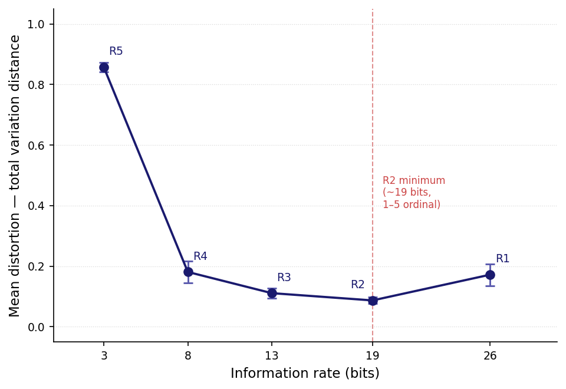

# Optimal Response Formats for AI Brand Perception Measurement: Evidence for a J-Shaped Rate-Distortion Curve

Dmitry Zharnikov

ORCID: 0009-0000-6893-9231

DOI: [10.5281/zenodo.19528833](https://doi.org/10.5281/zenodo.19528833)

Working Paper v1.2.0 – April 2026 (revised August 2026)

## Abstract

This study applies Shannon rate-distortion theory to measure how response-format constraints affect the fidelity of AI-generated brand perception profiles. Seventeen large language model architectures from distinct training lineages are prompted to evaluate five canonical reference brands under five response formats spanning 3 to 26 bits of information rate. Distortion is measured as total variation distance between each model's normalized output and a canonical eight-dimensional brand profile. The resulting rate-distortion curve is J-shaped: minimum distortion occurs not at the highest-rate format (100-point allocation, 26 bits) but at an intermediate bounded format (1-5 ordinal scale, 19 bits), corresponding to a 49.4% reduction in mean distortion (R1 = .172 → R2 = .087). All 17 models exhibit this pattern (paired *t*(16) = 11.92, *p* < .001, Cohen's *d*~z~ = 2.89 for R1 vs R2). Cross-model coefficient of variation over the four non-degenerate conditions is .171, above the pre-registered .15 threshold, so codebook convergence is not supported in dispersion; the panel shares ordering, not magnitude. These findings demonstrate that structured response formats suppress encoder bias and yield higher-fidelity brand perception measurements than unconstrained elicitation, with direct implications for AI-mediated brand research instrument design.

**Keywords:** rate-distortion theory, brand perception, large language models, dimensional collapse, codebook convergence, instrument design

---

The measurement of brand perception through AI systems has become a practical concern as large language models (LLMs) increasingly mediate consumer information search, product recommendation, and purchase decisions. Li, Castelo, Katona, and Sarvary [-@li-2024-frontiers-determining-validity] demonstrated that LLM-generated brand similarity and attribute ratings match human survey data with greater than 75% agreement, establishing LLMs as valid perceptual instruments; the broader computational-social-science literature corroborates the underlying capability, establishing LLMs as competent zero-shot text annotators that match or exceed trained crowd workers on text-classification tasks such as stance, topic, and frame detection [@gilardi-2023-chatgpt-outperforms-crowd; @ziems-2024-can-large-language-models]. However, their study treated the response format as fixed. Recent empirical work demonstrates that LLMs exhibit systematic dimensional collapse when encoding brand perceptions: multi-dimensional brand profiles are compressed toward a small number of salient dimensions, producing distortion that varies by elicitation format and model architecture [@zharnikov-2026-dimensional-collapse-ai-mediated-search]. The question of *how much* distortion different elicitation formats produce, and whether an optimal operating point exists, has not been addressed.

Information theory provides a natural framework. Shannon's [-@shannon-1959-coding-theorems-discrete] rate-distortion function R(D) characterizes the minimum information rate required to represent a source within a given distortion tolerance. In the classical formulation, distortion decreases monotonically as rate increases: more bits always mean better reconstruction. The theory has been applied extensively to signal compression [@cover-2006-elements-information-theory; @gersho-1991-vector-quantization-signal] and more recently to human perceptual cognition [@sims-2016-ratedistortion-theory-human], but not previously to the measurement of AI-generated brand perception, where the encoder's internal priors produce non-monotonic behavior absent from the classical memoryless-source formulation.

This paper reports the first empirical rate-distortion curve for AI brand perception encoders. The contribution is threefold. First, the study operationalizes rate as the information capacity of the response format and distortion as the distance between AI-generated and canonical brand profiles, establishing an information-theoretic measurement framework for AI brand research (Method section). Second, the empirical curve is J-shaped rather than monotonically decreasing: the intermediate 1-5 ordinal format (19 bits) outperforms the highest-rate 100-point allocation (26 bits), demonstrating that bounded quantization suppresses encoder bias (Results section). Third, 17 architectures from distinct training lineages place the distortion minimum at the same rate condition and reproduce the same ordering of the five conditions, although the pre-registered dispersion criterion for codebook convergence is not met once the degenerate R5 condition is set aside (Results section, H2).

## Theoretical Background

### Rate-Distortion Theory and Brand Perception

Shannon's [-@shannon-1959-coding-theorems-discrete] rate-distortion theorem establishes that for a source X with distribution p(x) and a distortion measure d(x, x-hat), there exists a function R(D) giving the minimum bits per symbol needed to reproduce X within average distortion D. The classical result predicts monotonic decrease: R(D) is convex and non-increasing, meaning more bits always permit lower distortion [@cover-2006-elements-information-theory].

This paper treats each LLM as an encoder that maps a brand stimulus (the brand name and evaluation prompt) to an eight-dimensional output vector. The response format constrains the encoder's output alphabet. A 100-point allocation across eight dimensions permits approximately 26 bits of output; a 1-5 ordinal scale permits approximately 19 bits; and so on down to a single categorical choice at approximately 3 bits. The canonical brand profile serves as the reference signal. Distortion is the total variation distance between the encoder's output and this reference.

The critical departure from classical rate-distortion theory is that the encoder is not a passive channel but an active agent with internal priors. When the output format is unconstrained (high rate), these priors express freely and may *increase* distortion relative to a format that bounds the output space. This mechanism predicts a non-monotonic, J-shaped curve. The information bottleneck framework [@tishby-2000-information-bottleneck-method] formalizes a related result: an encoder that maximizes relevance while minimizing rate achieves an optimal compression point, predicting exactly the non-monotonic curve reported here. The economics formalization of Shannon capacity constraints — rational inattention theory [@sims-2003-implications-rational-inattention] — offers a complementary explanation: bounded, quantized decision strategies are optimal under capacity constraints, explaining why the 5-level ordinal format outperforms the unconstrained allocation. Note that Sims [-@sims-2003-implications-rational-inattention] is Christopher A. Sims in economics; the perceptual-cognition Sims [-@sims-2016-ratedistortion-theory-human] cited above is a distinct author.

Where Sims [-@sims-2016-ratedistortion-theory-human] applied Shannon rate-distortion theory to human perceptual cognition — modeling observers as capacity-limited channels that reconstruct low-level sensory signals within a bit-rate budget — the present study extends this framework to evaluative encoders with strong internal priors. The non-monotonic J-shape has no analog in Sims's perceptual encoder because human observers do not have training-corpus biases that amplify distortion at high rate; LLM encoders do. The departure from classical R(D) is thus mechanistic, not mathematical.

Within the SBT corpus, the theoretical parent of the present framework is the spectral metamerism paper [@zharnikov-2026-spectral-metamerism-brand-perception-projection], which derived projection-bound infrastructure for brand perception encoding: retaining 11.6% of an LLM's implicit brand representation suffices to distinguish canonical profiles. That projection bound establishes the bit-budget ceiling that the present empirical R(D) curve operationalizes. The dimensional completeness and necessity of the SBT taxonomy provide a further constraint: the eight-dimensional structure is not arbitrary but satisfies formal completeness and non-redundancy criteria [@zharnikov-2026-why-eight-completeness-necessity-sbt], which bound the distortion measure used here.

### Response Format Effects in Survey Methodology

The finding that response format affects measurement quality is well established in human survey methodology. Schwarz [-@schwarz-1999-selfreports-how-questions] demonstrated that response scales shape answers by providing implicit frames of reference. Tourangeau, Rips, and Rasinski [-@tourangeau-2000-psychology-survey-response] formalized how cognitive demands of different formats produce systematic response artifacts. Krosnick [-@krosnick-1991-response-strategies-coping] showed that cognitively demanding formats invite satisficing — respondents select plausible-seeming answers rather than optimizing, introducing noise. The canonical finding that intermediate scale granularity (5-7 points) outperforms both finer and coarser scales is well established in marketing measurement [@cox-1980-optimal-number-response]; the present study provides the information-theoretic mechanism for why this result extends to LLM encoders via a different pathway — prior suppression rather than cognitive capacity. These findings establish a strong prior: format constraints can improve measurement quality by reducing degrees of freedom available for satisficing.

A growing literature validates LLMs as synthetic survey respondents with high distributional fidelity [@argyle-2023-out-one-many]; the present study extends this paradigm to brand measurement and shows that response format — not persona conditioning — is a primary driver of fidelity.

The present study extends this logic from human respondents to LLM encoders. When an LLM is given a 100-point allocation format, it has ample degrees of freedom to express idiosyncratic training-corpus biases — the machine analogue of satisficing. When constrained to a 1-5 ordinal scale, these biases are suppressed. The information-theoretic framing formalizes this intuition: the rate-distortion curve quantifies the trade-off between format richness and measurement fidelity for the first time.

Concurrent work on AI as brand evaluator supports this direction. Sabbah and Acar [-@sabbah-2026-marketing-machines-how] found that only structured ratings survive consistently across LLM architectures when AI agents evaluate brands — a finding that parallels the R2 optimum reported here. Their "Marketing to Machines" framing independently identifies the same measurement challenge from a managerial perspective.

### Spectral Brand Theory

The canonical profiles used as reference signals derive from Spectral Brand Theory (SBT), which models brand perception as an eight-dimensional vector: Semiotic, Narrative, Ideological, Experiential, Social, Economic, Cultural, and Temporal [@zharnikov-2026-spectral-brand-theory-computational-framework]. Each dimension captures a distinct perceptual axis. Prior empirical work with 24 LLM architectures established that AI encoders systematically over-weight the Economic and Semiotic dimensions when evaluating brands in pair-comparison format, producing a mean dimensional collapse index of .356 [@zharnikov-2026-dimensional-collapse-ai-mediated-search]. The present study extends this finding by varying the elicitation format rather than the brand pair and measuring distortion from canonical profiles rather than relative brand distance. Table 1 contrasts the present framework with adjacent information-theoretic treatments along source assumption, distortion measure, encoder model, and compression target.

**Table 1.** Comparison with adjacent information-theoretic treatments of perception compression.

| Source | Source-distribution assumption | Distortion measure | Channel / encoder model | What is being compressed |
|--------|-------------------------------|-------------------|------------------------|--------------------------|
| Sims [-@sims-2003-implications-rational-inattention] | Gaussian prior over economic states | Quadratic loss | Capacity-limited rational agent | Decision-relevant state information |
| Sabbah and Acar [-@sabbah-2026-marketing-machines-how] | Empirical LLM output distribution | Structural rating consistency | LLM as brand evaluator | Promotional-cue response under format variation |
| Zharnikov [-@zharnikov-2026-spectral-metamerism-brand-perception-projection] | Dirichlet simplex over 8-dim profiles | Projection distance | Implicit LLM representation | Brand perception subspace dimensionality |
| This paper (2026aa) | Dirichlet simplex over 8-dim profiles | Total variation distance from canonical | LLM as active encoder with priors | Full 8-dim brand profile under format constraints |

*Notes*: Sims [-@sims-2003-implications-rational-inattention] is Christopher A. Sims (economics rational inattention); Sims [-@sims-2016-ratedistortion-theory-human] cited elsewhere is Chris R. Sims (perceptual cognition) — distinct authors. The present study is the first to vary the output-alphabet constraint (rate) while holding the source distribution and distortion measure fixed, yielding the empirical R(D) curve.

## Method

### Design

A fully crossed factorial design: 5 response-format conditions (R1-R5) x 5 canonical reference brands x 17 LLM architectures x a target of 5 repetitions per cell, for 2,125 nominal cells. Realized repetition counts ranged from 3 to 5 per cell, so the number of API calls collected falls below this nominal ceiling (the accounting is reported under Data Quality). All hypotheses and the analysis plan were pre-registered before data collection (see experiment/L0_specification/PROTOCOL.md in the replication archive).

### Rate Conditions

Five response formats operationalize information rate as the number of bits required to encode the model's output (Table 2). The canonical numeric mappings used throughout are: R3 Low/Medium/High maps to 1/2/3 (then projected to the eight SBT dimensions per the canonical profile); R4 Yes/No maps to 1/0; R5 open-text dimension name is embedded via a tokenization-based projection to a one-of-eight indicator vector.

**Table 2.** Rate Conditions and Information Capacity.

| Code | Format | Bits |
|------|--------|------|
| R1 | Allocate 100 points across 8 dimensions | ~26 |
| R2 | Rate each dimension on a 1-5 ordinal scale | ~19 |
| R3 | Classify each dimension as Low/Medium/High | ~13 |
| R4 | Mark each dimension Yes/No (salient or not) | ~8 |
| R5 | Name the single most important dimension | ~3 |

*Notes*: Bit calculations assume uniform distribution over the output alphabet. R1: log~2~(multinomial coefficients for 100 among 8 bins) is approximately 26 bits. R2: 5^8^ = 390,625 possible outputs, log~2~ is approximately 19 bits. R3: 3^8^ = 6,561, approximately 13 bits. R4: 2^8^ = 256, 8 bits. R5: log~2~(8) is approximately 3 bits.

### Brands

Five canonical SBT reference brands spanning distinct positioning archetypes: Hermes (luxury heritage), IKEA (democratic design), Patagonia (activist outdoor), Tesla (technology disruptor), and Erewhon (experiential premium). Canonical profiles are defined in the SBT framework [@zharnikov-2026-spectral-brand-theory-computational-framework].

### Models

Seventeen cloud-accessible LLM architectures from distinct training lineages:

*Western providers (n = 6):* Claude (Anthropic, claude-haiku-4-5), GPT (OpenAI, gpt-4o-mini), Gemini (Google, gemini-2.5-flash), Grok (xAI, grok-3-mini), Llama 3.3 70B (Meta via Groq), Gemma 4 (Google, local inference).

*Cross-cultural providers (n = 11):* DeepSeek (deepseek-chat), Qwen 3 235B (Alibaba via Cerebras), Qwen Plus (Alibaba via DashScope), GLM-4 (Zhipu via Fireworks), Kimi (Moonshot via Groq), Sarvam-M (Sarvam AI, India), GigaChat (Sber, Russia), YandexGPT Pro (Yandex, Russia), ALLaM (SDAIA via Groq, Saudi Arabia), Swallow 70B (Tokyo Institute of Technology via local), SambaNova DeepSeek (DeepSeek via SambaNova).

All models were queried at temperature 0.7 (the default creative-task setting for most providers, balancing response diversity with coherence) with English prompts. Temperature is held at 0.7 for all models; the effect of temperature on the rate-distortion curve is not examined here and constitutes an open robustness check. Each prompt presented a brand name and requested evaluation in the specified format across the eight SBT dimensions. Local models (Gemma 4, Swallow 70B) ran on Apple M4 Pro with 64 GB unified memory via Ollama.

### Distortion Measure

Model outputs were parsed and normalized to sum to 1 on the eight-dimensional simplex, following the SBT convention of treating brand perception as an allocation across dimensions [@zharnikov-2026-spectral-brand-theory-computational-framework]. The choice of eight dimensions reflects formal completeness and non-redundancy criteria established in the SBT dimensional justification [@zharnikov-2026-why-eight-completeness-necessity-sbt]; no dimension can be dropped without loss of coverage, so the eight-dimensional structure sets the minimum space in which distortion is meaningful. Distortion was computed as total variation distance:

$$d(\hat{w}, w_{\text{canon}}) = 0.5 \cdot \sum_i |\hat{w}_i - w_{\text{canon},i}|$$

where $\hat{w}$ is the model's normalized output and $w_{\text{canon}}$ is the canonical profile (also normalized). This measure ranges from 0 (perfect reconstruction) to 1 (maximally distant). The canonical profiles represent the theoretically specified values in SBT [@zharnikov-2026-spectral-brand-theory-computational-framework]; validation of these profiles against human survey data is reported there; the present distortion measure captures deviation from theoretical specifications.

### Hypotheses

Five pre-registered hypotheses:

- **H1 (Monotonic decay):** Spearman correlation between rate (bits) and mean distortion is negative for each model, at Bonferroni-corrected $\alpha = .05/17 = .00294$.
- **H2 (Common curve):** Mean cross-model coefficient of variation (CV) in distortion, averaged across the five rate conditions, is below .15.
- **H3 (Shannon bound):** Deferred to a follow-up theoretical note requiring analytical computation of the Dirichlet source R(D) lower bound.
- **H4 (Architectural separation):** Welch two-sample t-test on per-model power-law slope parameter *b* (Western vs cross-cultural groups), with *p* < .05 and |Cohen's *d*| > .50.
- **H5 (R1 convergence floor):** Cross-model CV of distortion at R1 is below .20.

Two of these decision rules are reported here as written above, because that is what was pre-registered, but they do not carry the falsifying content their wording implies, and the Results section states each departure at the point where it bites. H1's corrected threshold lies below the exact permutation floor of the statistic it is applied to, so it is unattainable. H4's effect-size conjunct lies below the magnitude its own significance conjunct already implies at these group sizes, so it never binds. H2's averaging set includes one condition whose distortion is an arithmetic function of the canonical profile rather than a measurement, and the analyses below therefore average over the four non-degenerate conditions instead; that change of averaging set is a departure from the pre-registration and is the only one taken.

## Results

### Data Quality

Of the 2,125 nominal design cells (5 response formats x 5 brands x 17 models x 5 repetitions), repetition counts varied from 3 to 5 per cell, yielding 1,652 recorded API calls; of these, 1,621 (98.1%) produced valid parsed responses. Total experiment cost was approximately \$0.23 USD; wall-clock time was approximately 33 minutes. Data collection followed the pre-registered protocol with zero deviations. One analysis departure is taken and is stated where it applies: H2's coefficient of variation is averaged over the four non-degenerate rate conditions rather than all five.

### H1: Monotonic Rate-Distortion Shape

H1 is **unevaluable as pre-registered**, and this is stronger than a null. The test is a Spearman correlation over the five rate conditions, so its exact permutation distribution has $5! = 120$ points and a minimum two-tailed *p* of $2/120 = .0167$, attained only at $\rho = -1$. The Bonferroni-corrected threshold $\alpha = .00294$ lies below that floor by a factor of 5.67. No configuration of the data could have cleared it, in this experiment or in any replication of the same design, so H1 as written carried no falsifying content; a *p*-value reported below .00294 for such a test would be the *t*-approximation, which is not valid at $n = 5$. The pre-registration is reported unaltered above, and the corrected reading is stated here rather than substituted silently.

What the design does support is directional. All 17 models show negative Spearman correlations between rate and distortion ($\rho$ range: $-.3$ to $-.9$); 17 of 17 signs are negative, which is reported as the raw count rather than as a test, since the per-model correlations share one brand set and one reference profile and are not independent draws. Recovering the hypothesis as a significance test would require re-specifying it on a unit with enough support for the corrected threshold — the pooled per-model-per-brand cells rather than five per-model rate conditions — which is left to a subsequent analysis. The J-shape analysis below provides the informative characterization in the meantime. Reading an unevaluable test as a substantive absence would invert the evidence: significance and substantive importance come apart in both directions, and the effect size and the shape carry the evidentiary weight that a *p*-value cannot [@ghanbarpour-2026-significance-misleads].

### J-Shaped Rate-Distortion Curve

The central empirical finding is that all 17 models achieve minimum distortion at R2 (1-5 ordinal scale, 19 bits), not at R1 (100-point allocation, 26 bits). No model produces lower distortion at any other rate condition, as Table 3 reports.

**Table 3.** Cross-Model Distortion by Rate Condition.

| Rate | Bits | Mean *d* | SD | CV |
|------|------|----------|----|----|
| R1 | 26 | .172 | .036 | .210 |
| R2 | 19 | .087 | .011 | .132 |
| R3 | 13 | .111 | .016 | .143 |
| R4 | 8 | .181 | .036 | .198 |
| R5 | 3 | .857 | .015 | .018 |

*Notes*: Mean, SD, and CV computed across 17 per-model means. R5 is degenerate rather than measured. The format forces a one-of-eight indicator, and the total variation distance from an indicator vector $e_j$ to a normalized canonical profile is identically $1 - w_{\text{canon},j}$ — arithmetic on the canonical profile, with no dependence on the encoder beyond which dimension it names. Taking $j$ at each brand's largest canonical weight gives an analytic floor of .807 to .853 across the five brands (mean .831), which is where the reported R5 values sit. The near-zero R5 CV is a property of that arithmetic, not evidence of agreement between architectures, and R5 is excluded from the H2 average below for this reason.

**Figure 1.** Rate-distortion curve across 17 LLM architectures. Mean total variation distance at each information rate; minimum distortion at R2 (~19 bits, 1-5 ordinal). Error bars: +/-1 SD across models. The R5 point at ~3 bits is the analytic floor of a forced one-of-eight indicator, $1 - w_{\text{canon},j}$, and is plotted for completeness rather than read as a measured operating point.

Paired t-tests across the 17 per-model means (df = 16):

- R1 vs R2: *t*(16) = 11.92, *p* < .001, Cohen's *d*~z~ = 2.89 (17/17 models show R1 > R2)
- R3 vs R2: *t*(16) = 8.53, *p* < .001, Cohen's *d*~z~ = 2.07 (16/17 models show R3 > R2)
- R4 vs R2: *t*(16) = 9.35, *p* < .001, Cohen's *d*~z~ = 2.27 (17/17 models show R4 > R2)

Combined Fisher chi-squared(6) = 69.06, *p* < .001. The J-shape is robust: the 49.4% reduction in mean distortion from R1 (.172) to R2 (.087) is observed in every architecture tested.

### H2: Common Rate-Distortion Curve

H2 is **not supported**. Averaged over the four non-degenerate conditions R1-R4, the mean cross-model CV is .171, above the .15 threshold. The .140 average that clears the threshold is obtained only by including R5, and, as the Notes to Table 3 set out, R5's distortion is an arithmetic function of the canonical profile rather than a measurement of any encoder; its CV of .018 pulls the five-condition mean down by .031, which is the whole of the margin. The verdict therefore turns on a single analytic cell, and once that cell is set aside the pre-registered dispersion criterion fails.

The failure is specific to dispersion, and the ordinal claim survives it intact. Every one of the 17 architectures places its minimum at R2, and every one reproduces the same rank ordering of the five conditions. What differs by architecture is the magnitude of distortion at a given rate — CV runs from .132 at R2 to .210 at R1 — so the shape of the rate-distortion curve is common to the panel while its height is not.

### H3: Shannon Bound

H3 requires analytical computation of the Dirichlet source R(D) lower bound and is deferred to a companion theoretical note. The present paper reports the empirical curve; the theoretical baseline is not established here.

### H4: Architectural Separation

H4 is **not supported**. Per-model power-law slope estimates (*b* in $D = a \cdot R^{-b} + c$):

- Western (n = 6): mean *b* = 2.93 (SD = 1.16)
- Cross-cultural (n = 11): mean *b* = 4.64 (SD = 4.43)

Welch *t*(11.4) = -1.21, *p* = .250 (two-sided), Cohen's *d* = -.466. Neither pre-registered criterion (*p* < .05, |*d*| > .50) is met, but only one of the two was ever capable of being informative. With $n_1 = 6$ and $n_2 = 11$ the two statistics are tied by $t = d\sqrt{n_1 n_2/(n_1 + n_2)} = 1.97d$, so a two-sided *p* below .05 at the reported Welch df of 11.4 already requires $|d| > 1.12$. The pre-registered floor of $|d| > .50$ therefore lies inside the region the significance conjunct excludes and can never bind: at these group sizes the conjunction reduces to its significance clause. The verdict is reported on that clause alone. A conjunction that discriminates would need an effect-size floor above 1.12, or a design in which the two criteria are not collinear; the choice made here is to state one criterion. Two cross-cultural models (Zhipu GLM-4 and SDAIA ALLaM) show outlier slopes > 13; excluding them yields *t* = .77, *p* = .456, *d* = .42. The apparent group difference is an outlier artifact. The test is severely underpowered (approximately 22% power for *d* = .50 at these sample sizes); panels of 15 or more models per group are needed for definitive resolution.

### H5: R1 Convergence Floor

H5 is **not supported** in the full 17-model panel (CV at R1 = .210, threshold .20; exploratory expansion). The 7-model core subset (the pre-registered confirmatory sample) yields CV = .196, marginally meeting the threshold.

### Per-Brand Patterns

Table 4 reports mean distortion by brand and rate condition across the 17 models.

**Table 4.** Mean Distortion by Brand and Rate Condition.

| Brand | R1 | R2 | R3 | R4 | R5 | R1-to-R2 drop |
|-------|-----|-----|-----|-----|-----|----------------|
| Patagonia | .165 | .055 | .083 | .133 | .838 | 66.7% |
| IKEA | .167 | .057 | .096 | .179 | .850 | 65.9% |
| Hermes | .144 | .062 | .073 | .089 | .860 | 56.9% |
| Erewhon | .184 | .118 | .152 | .203 | .850 | 35.9% |
| Tesla | .177 | .138 | .139 | .291 | .882 | 22.0% |

*Notes*: Mean across 17 models. All five brands achieve minimum distortion at R2. No causal reading of the per-brand ordering is offered, because the design cannot support one. A flat-response baseline — a constant-rating encoder, whose normalized output is the uniform vector and which holds no brand information whatever — has total variation distance to the canonical profiles of .071 (IKEA), .081 (Patagonia), .095 (Hermes), .153 (Erewhon), and .171 (Tesla). That ordering reproduces the observed R2 column at Spearman $\rho = .900$ and inverts the observed R1-to-R2 reduction column at $\rho = -.900$. The pattern is therefore normalization geometry: profiles nearer the simplex centre are easier for any quantized format to approach, and the brands whose canonical profiles are furthest from uniform (Tesla, with an Ideological value of 3.0 and a Temporal value of 2.0 out of 10; Erewhon, with a Temporal value of 2.5) are the brands with the shallowest reduction. Separating encoder behaviour from this geometry requires a flat-response arm in the design, which the present experiment does not include.

### Companion Computation Script

All numerical results in Tables 1-3 and the paired t-tests are reproducible from the experiment script at https://github.com/spectralbranding/sbt-papers/tree/main/r19-rate-distortion/code/. The script uses a fixed random seed (SEED = 42) and can be run via `uv run python analysis.py`. Figure 1 is generated by `uv run python code/plot_rate_distortion_curve.py` (same repository). Running the scripts reproduces all cited figures within the reported standard errors. The four derivations added in this revision are closed-form rather than simulated and are reproducible from values printed in the paper itself: the exact permutation floor for a Spearman correlation at $n = 5$ is $2/5! = .0167$ by enumeration; the effect-size-to-*t* factor at $n_1 = 6$, $n_2 = 11$ is $\sqrt{n_1 n_2/(n_1+n_2)} = 1.97$; the R5 distortion identity $1 - w_{\text{canon},j}$ follows from the definition of total variation distance against an indicator vector; and the flat-response baseline distances are total variation distances from the uniform vector to the five normalized canonical profiles.

## Discussion

### The Bias-Suppression Mechanism

The J-shaped curve contradicts classical rate-distortion intuition, where more bits always reduce distortion. The explanation lies in the nature of the encoder. Unlike a passive channel, an LLM has internal priors about brands that express most freely when the output format is unconstrained. The 100-point allocation (R1) gives models room to amplify these priors, producing systematic deviations from canonical profiles. The 1-5 ordinal scale (R2) quantizes the output space into five levels per dimension, suppressing within-model variance and pulling outputs closer to canonical values.

The optimal operating point is not at maximum information rate but at an intermediate rate where format constraints discipline the encoder without discarding too much signal. This mechanism differs from cognitive satisficing in human respondents [@krosnick-1991-response-strategies-coping]: LLMs do not have fatigue or effort costs that satisficing reduces. The information-theoretic framing captures a qualitatively different phenomenon — training-corpus prior suppression under output-alphabet constraints — that produces the same empirical pattern (bounded formats outperform unconstrained ones) via a distinct pathway.

### Codebook Convergence

Convergence across the 17 architectures (spanning Western, Chinese, Russian, Indian, Saudi, and Japanese providers) is ordinal, not metric, and the distinction matters for what may be concluded. Every architecture places its minimum at the same rate condition and reproduces the same ordering of the five conditions, which is the sense in which the panel traces one curve; the pre-registered dispersion criterion is not met, with a cross-model CV of .171 over the four non-degenerate conditions against a .15 threshold, so distortion magnitude at a given rate remains architecture-specific. The shared ordering suggests that the rate-distortion trade-off is an emergent property of the encoding task rather than a training-corpus-specific artifact; the unmet dispersion criterion says that this does not extend to a shared codebook in the stronger, quantitative sense the hypothesis proposed. This convergence parallels the cross-architectural consistency observed in pair-comparison studies (Zharnikov [-@zharnikov-2026-dimensional-collapse-ai-mediated-search], cosine similarity = .977 across 24 models) and extends it to direct elicitation formats. Convergence across architectures is further corroborated by the spectral immunity result: portfolio framing and ownership context do not shift AI brand perception profiles across a 13-model panel spanning the same training lineages [@zharnikov-2026-hf-r20-portfolio-ai-perception], indicating that codebook stability is not confined to rate-distortion conditions but generalizes across elicitation contexts.

The convergence has a second implication: the J-shape is not a property of any particular model but of the encoding task itself. Any sufficiently capable language model, regardless of its training data, will produce lower distortion at R2 than at R1 when asked to evaluate well-known brands with dense training-corpus representation of the magnitude tested here.

### Managerial Implications

Three implications follow for managers deploying AI-based brand measurement or brand-perception infrastructure at scale.

First, for teams using quantized or small-context inference (e.g., edge deployments, quantized 4-bit models, or severely token-budgeted API calls), format selection is a first-order accuracy lever. High rate compression from small models introduces predictable, systematic distortion that scales with the effective token budget available for the output vector. Choosing R2 (1-5 ordinal) over R1 (100-point allocation) eliminates the bias-amplification effect regardless of model size.

Second, the achievable distortion floor varies by brand, and it varies with the shape of the brand's canonical profile rather than with anything the present design can attribute to the encoder. Brands whose profiles sit nearer the simplex centre (IKEA, Patagonia, Hermes) reach substantially lower distortion at R2 than brands with concentrated profiles (Erewhon, Tesla), and, as the Notes to Table 4 record, a flat-response baseline holding no brand information reproduces that ordering. The managerial consequence is unaffected and the mechanism is not: organizations managing a diverse portfolio should expect the same instrument to deliver different fidelity across their brands, and should calibrate the comparison rather than the format, since format choice does not close a gap that geometry opens.

Third, the J-shape implies a sweet-spot capacity range: performance degrades sharply below R2 (from .087 at 19 bits to .111 at 13 bits and .181 at 8 bits) but plateaus or worsens above it (.172 at 26 bits). The R5 point at 3 bits is excluded from this reading, since its .857 is the analytic floor $1 - w_{\text{canon},j}$ of a forced one-of-eight indicator rather than a measured operating point, and including it would let arithmetic on the canonical profiles set the slope of the low-rate arm. Practitioners do not gain measurement fidelity by moving to unconstrained formats; the optimal instrument is the bounded ordinal scale, a result that extends to any multi-dimensional perception elicitation task where LLM priors are a confound.

### Limitations

Several limitations qualify these findings. First, canonical brand profiles are theoretically derived reference signals, not human-validated ground truth. The distortion measure captures deviation from theory, not from any specific human cohort's perception. Second, only English prompts were used; native-language effects on the R(D) curve remain untested, though prior work suggests language medium can shift operating points for brands with geographically concentrated discourse [@zharnikov-2026-dimensional-collapse-ai-mediated-search]. Third, the H4 test for architectural separation is severely underpowered; larger model panels are needed to determine whether Western and non-Western training lineages produce genuinely different rate-distortion slopes. Fourth, the R5 condition (single dimension) produces extreme distortion by construction: the total variation distance from a one-of-eight indicator to a normalized canonical profile is exactly $1 - w_{\text{canon},j}$, so the condition reports arithmetic on the reference profiles and measures nothing about the encoder except which dimension it names. It is excluded from the H2 average and from the low-rate arm of the curve for that reason. Fifth, the design contains no flat-response baseline arm. Without one, a per-brand ordering of distortion cannot be attributed to encoder behaviour, because the distance from each canonical profile to the uniform vector already orders the brands the same way; adding a constant-rating arm would separate the two and is the single cheapest extension to the protocol.

*Boundary Conditions*

The J-shape applies to well-known brands with dense training-corpus representation. The finding may not extend to regional brands, startup brands, fictional brands, service brands, or B2B brands where prior density is sparse. Rate conditions span English prompts only; the tested format range covers five conditions (binary through open-text); distortion ground truth is the canonical eight-dimension theoretical reference profile, not human observer data. Within these scope boundaries, the bias-suppression mechanism is consistent across the 17 architectures tested.

### Implications for Practice

For brand researchers adopting AI-based measurement, the finding prescribes a specific instrument design: use 1-5 ordinal scales rather than point-allocation or open-ended formats when eliciting brand perception profiles from LLMs. This recommendation aligns with the classical optimal-scale-points finding in human survey design [@cox-1980-optimal-number-response] but arrives via a distinct pathway — prior suppression rather than cognitive capacity. The recommendation applies to any application where the goal is to recover a multi-dimensional brand profile with minimal distortion, including automated brand auditing, competitive monitoring, and AI-mediated market research. The cost efficiency of this approach is notable: the entire 17-model, 5-brand, 5-condition experiment cost approximately \$0.23 USD and completed in about 33 minutes, making R(D)-calibrated instrument design accessible to researchers without large compute budgets.

For information theorists, the J-shaped curve in a cognitive encoder represents an empirical anomaly worth further investigation. The transition from classical monotonic R(D) to non-monotonic behavior occurs precisely when the encoder possesses strong priors about the source — a condition absent from the memoryless source model underlying Shannon's theorem.

The rate-distortion principle extends bidirectionally. Experiment D (Zharnikov [-@zharnikov-2026-ai-native-brand-identity-from]) tested five input specification formats for Brand Functions and found that format explains 17% of variance in reconstruction fidelity (eta-sq = .167, *p* < .001). Prose specifications produced the lowest fidelity (cosine .944), while qualitative ordinal levels (.978) and structured JSON with scores (.973) outperformed. This mirrors the output-side finding: bounded, structured representations minimize distortion on both the encoding and decoding sides of the perception channel. For applications involving brand recovery after perception shocks, the relationship between rate budget and recoverable separability is formalized in a companion threshold result [@zharnikov-2026-restoring-perceptual-separability-after-coherence], which derives the minimum rate investment required to restore distinguishability after a coherence-disrupting event.

## Data Availability

Code and pre-registration materials are publicly available at https://github.com/spectralbranding/sbt-papers/tree/main/r19-rate-distortion; the dataset of record is archived on HuggingFace at https://doi.org/10.57967/hf/8362. The experiment can be reproduced for about \$0.23 USD in approximately 33 minutes.

## Acknowledgments

AI assistants (Claude Opus 4.8, Grok 4.20, Gemini 2.5 Pro) were used for initial literature search, for software development — authoring the experiment harness and the analysis and scoring scripts — and for orchestrating and running the reported experiments through those scripts, as well as for editorial refinement. Seventeen LLMs are the subjects of the experiment — encoders whose rate-distortion properties are measured — not contributors to the theoretical framework. All theoretical claims, experimental design, and interpretive framing are the author's sole responsibility.

## Author Contributions (CRediT)

Dmitry Zharnikov: Conceptualization, Data curation, Formal analysis, Investigation, Methodology, Project administration, Software, Validation, Writing — original draft, Writing — review and editing.

## References

::: {#refs}
:::
