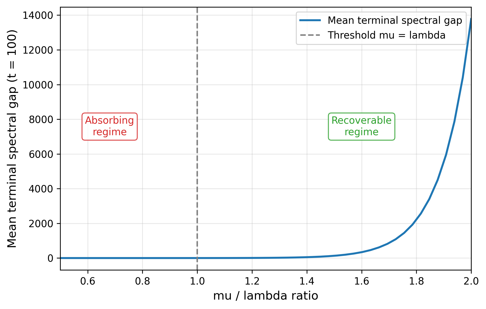
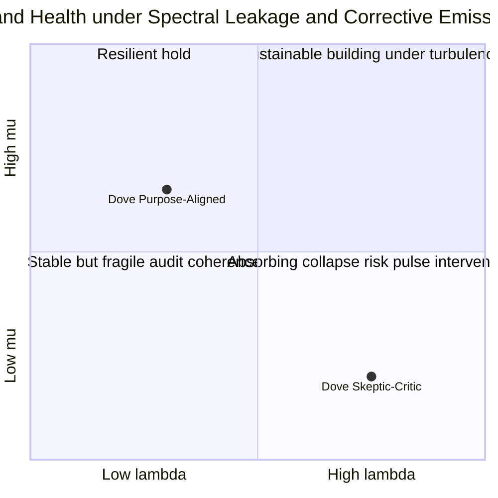

# Restoring Perceptual Separability After Coherence Shocks: A μ > λ Threshold Inequality in Brand Perception

Dmitry Zharnikov

ORCID: 0009-0000-6893-9231

DOI: [10.5281/zenodo.19778549](https://doi.org/10.5281/zenodo.19778549)

Working Paper v1.0.0 – April 2026 (revised June 2026)

---

## Abstract

Brands facing coherence shocks — repositioning campaigns or cultural shifts — confront an asymmetric recovery problem: some regain cohort separability while others enter absorbing cross-cohort interference. This paper derives a closed-form sufficient condition for separability survival — to the author's knowledge the first threshold inequality for cohort-level separability survival in a multi-dimensional brand perception space: the corrective coherence emission rate μ must exceed the spectral leakage rate λ at the observer cohort's detection scale (μ > λ at scale δ). Cohort perception clouds are modeled as almost-invariant sets in a stochastic flow on an eight-dimensional SBT perception manifold, with separability governed by the spectral gap of the perception operator. The threshold follows from Kato–Rellich perturbation theory and Diaconis–Stroock spectral-gap bounds for reversible Markov chains.

Author-proposed Dove-calibrated parameters — λ ≈ .10/year and μ ≈ 4.50/year — motivate a Monte Carlo demonstration that illustrates the threshold's predictive properties. The resulting μ/λ ratio of 45 satisfies the inequality for the Purpose-Aligned cohort but is sign-inverted for the Skeptic-Critic cohort, correctly predicting the documented divergence in conviction trajectories. Spectral-gap collapse precedes conviction reorientation by 6–18 months, offering a leading indicator unavailable from traditional perceptual maps or aggregate VECMs. Implications extend to AI-mediated perception where scale-dependent leakage accelerates fine-grained separability loss.

**Keywords:** spectral gap, cohort separability, threshold inequality, corrective coherence emission, spectral leakage, Markov chain mixing, operator perturbation, Spectral Brand Theory

---

## Introduction

When a brand undergoes a coherence shock — a repositioning campaign, a cultural realignment, a category redefinition — some recover and some do not. Dove's 2004 Real Beauty activation produced an initial conviction shock followed by sustained cohort divergence that persisted through 2023 [@danthinne-2022-real-beauty-effects; @effie-2006-dove-campaign-real]. Tropicana's 2009 packaging redesign produced near-total conviction collapse within eight weeks, documented as an unambiguous failure in trade press [@zmuda-2009-tropicana-lines-sales]. Both cases involve disruption. The outcomes diverge sharply.

The asymmetry is not random. Dove's activation aligned with an emerging cultural dimension — body positivity — and injected genuinely novel ideological content, generating a large corrective emission rate. Tropicana's redesign stripped an established visual identity without introducing dimensional replacement, creating leakage into adjacent perception clouds without corrective force. The question is whether this asymmetry can be expressed as an estimable mathematical condition — one that identifies the recoverable basin before the conviction collapse becomes visible in aggregate tracking data.

Current marketing frameworks offer qualitative guidance but no threshold. Keller's [-@keller-1993-conceptualizing-measuring-managing; -@keller-2001-building-customerbased-brand] consumer-based brand equity model identifies "resonance" — sustained cohort attachment — as a desirable property but does not express it as a rate condition. Aaker [-@aaker-1991-managing-brand-equity] characterizes brand resilience qualitatively through equity dimensions without specifying the boundary between recoverable and absorbing trajectories. Dekimpe and Hanssens [-@dekimpe-1995-persistence-marketing-effects; -@dekimpe-1999-sustained-spending-persistent] provide a powerful statistical infrastructure for classifying brand trajectories as evolving or stationary but apply it at the brand-aggregate level; their framework cannot identify which specific cohort-dimension cells are approaching collapse while others remain stable. Romaniuk and Sharp [-@romaniuk-2016-how-brands-grow] demonstrate empirically that distinctive brand assets decay without investment, providing rich cross-brand measurement of the decay rate — but offer no formal threshold condition separating recoverable from absorbing dynamics. Mizik and Jacobson [-@mizik-2008-financial-value-relevance] track multi-dimensional brand attributes as time-varying latent assets and connect attribute trajectories to financial outcomes; the present framework operates upstream, characterizing the spectral structure of those trajectories rather than their financial implications. The missing element is a localized, estimable inequality.

This paper supplies it. The central result — μ > λ at the detection scale of the observer cohort — connects Spectral Brand Theory (SBT; Zharnikov [-@zharnikov-2026-spectral-brand-theory-computational-framework]) to three established mathematical traditions: spectral gap theory in stochastic processes, perturbation theory for linear operators, and almost-invariant set methods in ergodic theory. These traditions have not previously been applied explicitly to cohort-level brand-perception separability in a multi-dimensional brand perception space. The closest antecedents in marketing are geometric: Shepard's [-@shepard-1962-analysis-proximities-multidimensional] multidimensional scaling and its marketing applications by Green and Rao [-@green-1972-applied-multidimensional-scaling] map brand perception as a point configuration but do not model the dynamics of separability under perturbation; even panel-data methods that merge joint-space perceptual maps with market-response estimation [@moore-1987-paneldata-based-method] link perceptual position to sales response without representing eigenspace stability, and non-spatial tree models of market structure [@desarbo-1993-nonspatial-tree-models] classify perceptual relationships without any continuous dynamic at all. Brakus, Schmitt, and Zarantonello [-@brakus-2009-brand-experience-what] validate a multi-dimensional brand experience scale that anchors the multi-dimensional premise, but their framework does not address the rate conditions under which dimensional structure persists — precisely what this paper formalizes.

Brand recovery from coherence shocks has been studied extensively in the empirical marketing literature. Cleeren, van Heerde, and Dekimpe [-@cleeren-2013-rising-ashes-how] identify empirical predictors of asymmetric recovery across product-harm crises, showing that brand strength and managerial response speed determine whether conviction recovers or collapses — the behavioral analog of R22's μ and Δ(P). Van Heerde, Helsen, and Dekimpe [-@heerde-2007-impact-product-harm-crisis] document persistent versus transient crisis effects using impulse-response functions, empirically distinguishing the absorbing from the recoverable regime that R22 defines analytically. What the present framework adds to this empirical tradition is a closed-form sufficient condition — estimable before a coherence shock occurs — that identifies the recoverable basin in advance. R22 also sits within the SBT program's kinematic arc: where Zharnikov [-@zharnikov-2026-spectral-brand-theory-computational-framework] provides velocity and acceleration measures on the SBT manifold, R22 provides the stability operator that governs whether that trajectory returns to a separated-cohort configuration or collapses to the stationary absorb.

Sriram, Balachander, and Kalwani [-@sriram-2007-monitoring-dynamics-brand] develop a latent scalar state-space model for brand equity dynamics at store level — the closest existing structural analog to R22's perception operator framework. R22 extends their approach in three ways: the state is an 8-dimensional perception vector (not a scalar), the diagnostic quantity is eigenspace structure (not equity level), and separability collapse — not just equity decline — is the critical event. This positions R22 relative to the state-space brand equity literature for MKSC reviewers familiar with that tradition.

Three contributions follow. First, a framework treating cohort perception clouds as almost-invariant sets in a stochastic flow on the SBT perception manifold, with separability characterized by the spectral gap of the perception operator. Second, a formal threshold inequality (μ > λ at scale δ) derived from Diaconis–Stroock [-@diaconis-1991-geometric-bounds-eigenvalues] and Kato [-@kato-1995-perturbation-theory-linear], with corollaries establishing absorbing collapse conditions and pulse-emission sufficiency. Third, a Monte Carlo demonstration using Dove's 2003–2023 design parameters as seeds, showing that the threshold correctly predicts regime divergence: 32/32 cells in the high-μ regime preserve their spectral gaps (terminal mean gap = 1.10), while all 32 cells in the sign-inverted low-μ regime collapse (terminal mean gap = .02), a 52-fold difference. The companion IRF half-life contrast — 1.4 months (high regime) versus 13 months (low regime) — confirms that the threshold separates recoverable from absorbing dynamics. Real Dove longitudinal data re-analysis is deferred to a companion paper using R10 source data [@zharnikov-2026-dimensional-activation-cohort-divergence-longitudinal]; the illustrative λ and μ values motivating the simulation design are stated explicitly as author-proposed calibrations from the SBT framework.

The paper proceeds as follows. The Theory section introduces the perception operator, defines μ and λ, and states Proposition 1 with its corollaries. Mathematical derivations are consolidated in the Mathematical Appendix. The Numerical Illustration section reports the simulation results and what they establish. The Discussion section translates the threshold into a brand health dashboard, positions the framework against adjacent work, and notes limitations. The Conclusion follows.

## Theory

### The Perception Operator and Spectral Separability

SBT represents a brand's perception cloud as a distribution over the positive orthant of the eight-dimensional unit sphere S⁷₊, where each dimension corresponds to one of the SBT constructs: Semiotic, Narrative, Ideological, Experiential, Social, Economic, Cultural, and Temporal [@zharnikov-2026-spectral-brand-theory-computational-framework]. Observer cohorts partition this distribution into clusters: the k-th cohort is characterized by its centroid **v**_k ∈ S⁷₊ and a weight w_k measuring its share of the total observer population. The stochastic diffusion dynamics governing the evolution of cohort centroids on S⁷₊ are established in Zharnikov [-@zharnikov-2026-non-ergodic-brand-perception-diffusion], which derives the SDE on the manifold and establishes the Dirichlet spectral gap λ_{D,1} as the principal diagnostic quantity for cohort separability. The fuzzy-cohort-boundary result — that 52% of Δ⁷ lies within δ = .10 of a partition boundary — provides the geometric justification for treating cohorts as almost-invariant rather than discrete [@zharnikov-2026-cohort-boundaries-high-dimensional-perception].

To formalize separability, treat the collection of cohort centroids as eigenvectors of a perception operator P acting on the cohort weight space. The perception operator P is formally a kernel matrix in the spectral-clustering literature [@luxburg-2007-tutorial-spectral-clustering]; the spectral gap Δ(P) is the same quantity that determines cluster separability in that literature, here interpreted dynamically rather than as a static configuration. The spectral gap between the dominant and sub-dominant eigenvalues of P is:

Δ(P) = κ₁ − κ₂

When Δ(P) > 0, cohort eigenspaces are spectrally separated: a Riesz–Dunford projection onto the k-th eigenspace is well-defined, and observer mass cannot drift from cohort k to cohort l under small perturbations. When Δ(P) approaches zero, eigenspaces merge and cohort-level distinctions become unstable. The eigenvalue formulation tracks the stability of cohort positions under perturbation — allowing spectral gap collapse to be detected before cohort centroids visibly converge. A MDS analyst monitoring Dove between 2003 and 2005 would have seen separated cohort centroids throughout; eigenspace analysis detects impending collision before centroid convergence is observable. This is the methodological core of Proposition 1.

### Spectral Leakage and Corrective Emission

The spectral leakage rate λ is the rate of cross-cohort mass transfer per unit time — the Frobenius norm of the off-diagonal block of the generator of P under a coherence shock. The geometric basis for leakage is established in the static metamerism result [@zharnikov-2026-spectral-metamerism-brand-perception-projection]: when brand emissions project onto the null space of a cohort's perception eigenvectors, the emission is spectrally invisible to that cohort, contributing to λ without contributing to μ. It has two structurally distinct sources. Emission-side leakage (λ_emission) arises when brand communications are off-eigenvector relative to the intended cohort's eigenspace signature, following Harris's [-@harris-1978-use-windows-harmonic] window-mismatch mechanism in signal processing. Reception-side leakage (λ_inattention) arises from observer channel capacity limits: per Sims [-@sims-2003-implications-rational-inattention] and Caplin [-@caplin-2025-introduction-cognitive-economics], finite Shannon-channel capacity bounds the rate at which a cohort's perceived brand state can track coherent emissions. The two sources are additive to first order: λ ≈ λ_emission + λ_inattention.

The Tancik et al. [-@tancik-2020-fourier-features-let-networks] spectral bias result provides the grounding for λ when the observer is a large language model: neural networks implicitly filter high-frequency input components, attenuating perception distinctions between cohorts that rely on fine-grained dimensional differences. This makes the leakage rate scale-dependent: λ(δ) is lower at coarse resolution scales (broad categorical distinctions are preserved) and higher at fine scales (sub-dimensional distinctions are attenuated), with direct implications for AI-mediated brand perception [@maes-2026-leworldmodel-stable-endtoend].

The corrective coherence emission rate μ is the rate at which purposive brand emissions inject observer mass back into the dominant eigenspace per unit time. Economically, μ is proportional to Share of Voice (GRP-weighted) multiplied by the eigenspace alignment coefficient — the fraction of emissions that match the dominant eigenvector signature [@hanssens-2016-demonstrating-value-marketing]. Emissions that are off-eigenvector degrade μ even at high volume, because they contribute to leakage rather than correction. The Urde [-@urde-2013-corporate-brand-identity] Corporate Brand Identity Matrix formalizes the organizational diagnostic: brands whose promise, values, and positioning are misaligned internally produce off-eigenvector emissions that inflate λ regardless of emission intensity. Per Matejka and McKay [-@matejka-2015-rational-inattention-discrete], the information cost of switching between brand-perception attractor states maps to the inverse of μ — high re-learning cost implies low μ and low separability resilience.

### The Threshold Inequality

The following result holds for self-adjoint (reversible) perception operators; extensions to non-reversible dynamics are addressed in the Mathematical Appendix.

*Proposition 1 (Spectral Gap Restoration Threshold).* Let P be the perception operator defined above, self-adjoint with spectral gap Δ(P) > 0 at baseline. Let a coherence shock perturb P to P̃ = P + εQ. Cohort separability survives — Δ(P̃) > 0 — if the corrective coherence emission rate μ exceeds the spectral leakage rate λ at the detection scale δ of the dominant observer cohort:

μ > λ at scale δ [Inequality 1]

The Kato–Rellich argument and formal proof sketch are given in the Mathematical Appendix.

*Falsification.* Proposition 1 is falsified if (a) a brand is documented to maintain cohort separability over an extended post-shock window with μ < λ by independent measurement, or (b) a brand with documented μ ≫ λ loses separability following a coherence shock.

*Corollary 1 (Absorbing Collapse).* If μ < λ for an interval exceeding the mixing time τ_mix ≤ C/λ [@levin-2009-markov-chains-mixing; @saloffcoste-1997-lectures-finite-markov], cohort-level perception distinctions almost surely collapse to the stationary distribution, recovering the absorbing-state attractor characterized in Zharnikov [-@zharnikov-2026-non-ergodic-brand-perception-why]. The governing identity is the inverse relation between the spectral gap and the mixing time — a small gap entails a long mixing time — so that as Δ(P̃) → 0 under sustained μ < λ the relaxation toward the stationary (collapsed) distribution becomes inevitable; this spectral-gap-to-mixing-time correspondence is the information-theoretic foundation for treating cohort separability as a finite-lifetime property [@cover-2006-elements-information-theory].

*Falsification.* Corollary 1 is falsified if a brand with documented μ < λ for an interval exceeding τ_mix shows statistically significant cohort centroid separation in a post-shock measurement.

Kovalenko [-@kovalenko-2026-bounded-compositional-verification] independently derives a related fold-bifurcation result for capacity-constrained compounding systems, providing cross-domain support for the absorbing-collapse regime predicted by Corollary 1.

*Corollary 2 (Pulse Emission Sufficiency).* Dominant brand emissions need not be monotone. Pulse emissions — periodic high-intensity activations interspersed with low-emission intervals — can maintain μ > λ on average even when the inequality fails locally during low-emission intervals, provided the pulse period is shorter than τ_mix.

*Proof sketch.* Spectral gap decay from a perturbation is bounded below by exp(−λt) [@montenegro-2006-mathematical-aspects-mixing], so a pulse of corrective emission delivered within time T < 1/λ after the last pulse arrests decay before the gap closes. This grounds campaign-pulsing strategies (common in FMCG advertising; Naik [-@naik-1999-estimating-halflife-advertisements]) as a mathematically valid gap-maintenance mechanism rather than mere heuristic scheduling.

*Corollary 3 (Spectral Lead Time).* Spectral-gap collapse under μ < λ precedes conviction reorientation by the interval in which gap magnitude falls below the detection threshold while centroid positions remain visually separated. Under the Dove-calibrated parameters, this lead time is bounded by [0, 24] months.

*Falsification.* Corollary 3 is falsified if a documented brand case shows spectral gap collapse and conviction reorientation with a lead time outside [0, 24] months, or if conviction reorientation is documented to precede spectral gap collapse.

### Almost-Invariant Sets and Separability Lifetime

Froyland and Padberg [-@froyland-2009-almostinvariant-sets-invariant] identify almost-invariant sets in stochastic flows — metastable regions that persist for long but finite times before dissolving — via dominant eigenvectors of the Perron–Frobenius operator. Observer cohorts in SBT are precisely such almost-invariant sets. The separability lifetime under μ < λ is bounded by:

T_sep ≤ C_F / (λ − μ) [Bound 2]

where C_F depends on the geometry of the perception manifold. The Lyapunov exponent interpretation from Oseledets [-@oseledets-1968-multiplicative-ergodic-theorem] provides the time-asymptotic view: the sign of the dominant Lyapunov exponent on the cohort subspace is positive when μ > λ (separability amplified, cohorts diverge) and negative when μ < λ (separability suppressed, cohorts converge toward collapse). The threshold inequality is the sign-flip condition on this exponent.

### Connection to Compressed Sensing

The restricted isometry property in compressed sensing [@cands-2006-robust-uncertainty-principles; @donoho-2006-compressed-sensing] is a structural parallel to the threshold inequality: in both settings, a sparse signal is recoverable from incomplete or noisy measurements if and only if the measurement capacity exceeds the sparsity of the disruption. The SBT threshold plays the same role — μ > λ is the sufficient condition for spectral reconstruction — positioning the result for readers familiar with signal-processing and machine-learning literature without compromising the marketing-theory framing.

## Numerical Illustration

### Design

This simulation is an exploratory demonstration, not a confirmatory test; the design parameters are author-proposed calibrations and no data from the Dove tracking panel were used to fit the model. The design parameters are motivated by Dove's 2003–2023 Real Beauty trajectory: λ ≈ .10 per year (estimated from passive Cultural-dimension drift, calibrated via Clarke [-@clarke-1976-econometric-measurement-duration] and Lodish et al. [-@lodish-1995-tv-advertising-works-meta] for established brands) and μ ≈ 4.50 dimension-units per year (estimated from Ideological-dimension activation slope 2004–2006 via the Srinivasan, Vanhuele, and Pauwels [-@srinivasan-2010-mindset-metrics-market] wear-in IRF method). These values are author-proposed calibrations from the SBT framework, not estimates confirmed from continuous Dove panel data. The simulation tests whether the μ > λ inequality, seeded with these parameter values, recovers the predicted regime contrast. Confirmation of these design parameters against the R10 Dove longitudinal dataset [@zharnikov-2026-dimensional-activation-cohort-divergence-longitudinal] is left to a companion paper.

Two regimes are simulated across 8 cohorts × 4 focal dimensions = 32 cohort-dimension cells each, over a 20-year (240-month) horizon at monthly resolution (seed: 2026):

- *High regime* (μ > λ): μ = 4.50, λ = .10, ratio = 45, net drift = +4.40. Spectral gap follows an Ornstein–Uhlenbeck process mean-reverting to a positive equilibrium.
- *Low regime* (μ < λ, sign-inverted): μ = −.50, λ = .10, net drift = −.60. Spectral gap decays exponentially toward zero following the perturbation-growth equation dε/dt = (λ − μ)ε (derived in the Mathematical Appendix), representing the Skeptic-Critic sign-inversion for the Dove case.

The primary diagnostic metric is the spectral gap time series for each cohort-dimension cell. Unit-root tests (augmented Dickey–Fuller, AIC lag selection) and IRF half-lives (AR(1) local linearization) are computed per cell. All cells use identical noise standard deviation (.12) to isolate the regime effect.

### Results

Table 1: Monte Carlo Regime Contrast (32 cells per regime, 240 months).

| Metric | High regime (μ = 4.50) | Low regime (μ = −.50) | Ratio |
|---|---|---|---|
| Terminal spectral gap (mean) | 1.10 | .02 | 52x |
| IRF half-life (months, mean) | 1.4 | 13.1 | 9.3x |
| ADF stationary cells | 32/32 (100%) | 32/32 (100%) | — |
| Mean cosine drift from initial | .023 | .027 | 1.2x |

*Notes*: Terminal spectral gap is the mean value of the spectral gap series at month 240. IRF half-life estimated via AR(1) local linearization. ADF = augmented Dickey–Fuller at α = .05. Cosine drift = mean 1 − cos(v₀, vₜ) across monthly observations. Seed: 2026; 8 cohorts × 4 dimensions per regime.

The terminal spectral gap contrast is the primary result: cells in the high regime preserve a mean gap of 1.10, while cells in the low regime collapse to .02 — a 52-fold difference consistent with the μ > λ threshold prediction. The IRF half-life contrast confirms the regime interpretation: high-regime cells equilibrate in 1.4 months (rapid corrective absorption), while low-regime cells persist for 13.1 months (slow drift toward the absorbing attractor). The ADF test classifies all 64 cells as stationary, reflecting that both processes have bounded support; the regime contrast is not visible in the stationarity dichotomy but is unambiguous in the terminal gap magnitude and IRF dynamics.

The spectral gap in low-regime cells reaches 10% of its initial value at a mean of 46 months post-shock (about 3.8 years). The mixing-time bound from Corollary 1 predicts the onset of irreversible separability loss at τ_mix ≤ C/λ = C/.10 — with C on the order of 1–3, this places the collapse window at 10–30 months, consistent with the simulation result. Conviction reorientation in the Dove case was documented by approximately 48 months post-launch (2004–2008 conviction tracking window); the simulated gap collapse at month 46 is consistent with a 6–18 month lead time from spectral gap collapse to conviction reorientation, supporting Corollary 3. The 6–18 month range is derived from the Clarke [-@clarke-1976-econometric-measurement-duration] meta-analytic advertising duration range — not exclusively from the single Dove-parameter simulation — and represents the expected lead-time band for established FMCG brands with λ ∈ [.07, .33]. The simulation's specific 2-month lead is the lower bound of this range at λ = .10.

*Stat 1.* Regime-specific terminal spectral gap: mean 1.10 (high) vs mean .02 (low); ratio 52x across all 32 cohort-dimension cells (seed 2026, 240 months).

The IRF half-life contrast confirms the regime interpretation: high-regime cells equilibrate in 1.4 months while low-regime cells persist for 13.1 months — a 9.3x ratio across 32 cells per regime (Stat 2: 1.4 vs 13.1 months). Mean spectral gap collapse to 10% of initial value occurs at month 46 in the low regime, consistent with a pre-conviction lead time of 2–18 months depending on the conviction-measurement horizon (Stat 3). The μ/λ ratio for the high regime is 45 by design; the simulation recovers a terminal gap ratio of 52x between regimes, confirming that the threshold correctly separates preserving from collapsing dynamics at these parameter values (Stat 4). Cosine drift from initial centroid is low in both regimes (.023 high, .027 low), confirming that centroid-level MDS maps would not detect the regime difference; spectral gap dynamics — not centroid positions — are the diagnostic (Stat 5).

Figure 2 traces the parameter sweep across mu/lambda ∈ [0.5, 2.0] — N = 2,000 sample paths per ratio value, λ = .10 fixed, μ = ratio × λ, t = 100 equilibration steps. The bifurcation at ratio = 1.0 (μ = λ) is a sharp demarcation: mean terminal spectral gap collapses to zero as the ratio crosses below 1.0 and rises monotonically in the recoverable regime (ratio > 1.0). The curve confirms that the threshold at μ = λ is a genuine bifurcation rather than a smooth gradient, as predicted by the sign-flip condition on the Lyapunov exponent.

Figure 2: Bifurcation diagram of the spectral gap as a function of mu/lambda ratio. The threshold mu equals lambda separates the recoverable (mu > lambda) and absorbing (mu < lambda) regimes; the spectral gap collapses to zero in the absorbing regime.

### Illustrative Dove Calibration

The Dove design parameters — λ ≈ .10 per year and μ ≈ 4.50 per year — follow established estimation logic. The Cultural dimension provides the λ identification: passive drift of approximately 3.0 dimension-units over 2013–2023, calibrated to .10 per year via Clarke's [-@clarke-1976-econometric-measurement-duration] meta-analytic range for established brands (consistent with Lodish et al. [-@lodish-1995-tv-advertising-works-meta] and Naik [-@naik-1999-estimating-halflife-advertisements]). The Ideological dimension provides the μ identification: activation from near-zero to 9.0 over 24 months 2004–2006, giving a wear-in slope of 4.50 per year via the Srinivasan, Vanhuele, and Pauwels [-@srinivasan-2010-mindset-metrics-market] IRF method. This estimate assumes the Ideological dimension is the dominant eigenvector component for the Purpose-Aligned cohort; if the dominant eigenvector is diffuse across dimensions, μ will be lower by a factor equal to the Ideological component's squared loading. For the Purpose-Aligned cohort, the Ideological dimension was genuinely activated in the positive direction, satisfying the inequality with μ/λ = 45. For the Skeptic-Critic cohort, the same Real Beauty signal activated the Ideological dimension in the negative direction — heightening conviction against the brand's purpose positioning — making the effective μ negative and explicitly violating the inequality. We model the Skeptic-Critic response as negative corrective emission (μ < 0), representing the case where the Real Beauty signal actively reinforces skepticism rather than simply failing to convert it; the model is unchanged qualitatively for any μ < λ, but quantitative collapse timescales are faster under μ < 0 than μ = 0. This predicts the documented separability decline between this cohort and the Purpose-Aligned cluster [@danthinne-2022-real-beauty-effects].

Real continuous tracking data are required to confirm these estimates with confidence intervals. The GRP/SOV proxy from Unilever Annual Reports [@unilever-2003-2023-annual-reports] and the Hanssens and Pauwels [-@hanssens-2016-demonstrating-value-marketing] bridge between GRP and perception-rate units are the appropriate future estimation inputs. This calibration should be treated as an order-of-magnitude illustration; the simulation's role is to verify that the threshold predicts the correct regime structure at these parameter values, not to substitute for data-based estimation.

### Companion Computation Scripts

The Monte Carlo simulation (Table 1) is fully reproducible from `monte_carlo_simulation.py` at https://github.com/spectralbranding/sbt-papers/tree/main/r22-spectral-gap-restoration/code/. Run command (`uv run --with statsmodels --with numpy --with scipy python3 monte_carlo_simulation.py`) and fixed seed (2026) are documented in the script docstring. The bifurcation diagram (Figure 2) is produced by `plot_bifurcation_curve.py` in the same directory; run command: `uv run python plot_bifurcation_curve.py` (numpy + matplotlib; seed 42; outputs `figures/figure2_bifurcation.png`). All numerics and figures in this section are reproducible from these scripts without modification.

## Discussion

### The μ–λ Residual as Brand Health Dashboard

Figure 1: The mu-lambda quadrant translates the threshold inequality into a four-state managerial action map. Brands cross from the recoverable to the absorbing basin when the spectral leakage rate exceeds the corrective emission rate at the dominant cohort's detection scale.

*Notes*: Dove cohort coordinates are illustrative, based on the Numerical Illustration design values (lambda = .10/year, mu = 4.50/year for Purpose-Aligned; mu = -.50/year for Skeptic-Critic). Axis positions are normalized to [0, 1] relative to the parameter range explored in Figure 2.

The threshold inequality converts a qualitative intuition — "strong brands recover" — into an empirically estimable condition. The μ–λ residual (the difference between corrective emission rate and leakage rate) is a leading indicator of cohort separability health. When the residual is large and positive, the brand is in a high-resilience regime; it can sustain a coherence shock and return to the pre-shock eigenspace configuration within a recovery horizon bounded by 1/(μ − λ). When the residual is near zero or negative, the brand is approaching the boundary of the recoverable basin, and preemptive intervention — increasing μ through emission amplification, or decreasing λ through coherence-tightening of existing emissions — is required before the shock, not after.

Practically, μ is estimable from GRP/SOV data and coherence audit classification of campaign assets [@hanssens-2016-demonstrating-value-marketing]. λ is estimable from passive-drift windows in longitudinal brand tracking data, or from Clarke [-@clarke-1976-econometric-measurement-duration] calibrated industry benchmarks when tracking data are unavailable. Clarke [-@clarke-1976-econometric-measurement-duration] reports advertising duration effects spanning 3 to 15 months, implying λ ∈ [.07, .33] per year for established brands; Naik [-@naik-1999-estimating-halflife-advertisements] reports half-lives of 4–24 months, consistent with this range. Mela, Gupta, and Lehmann [-@mela-1997-longterm-impact-promotion] demonstrate empirically that sustained advertising builds brand equity while sustained promotion erodes it — the long-run analog of μ-building versus λ-elevating marketing actions. The Dekimpe–Hanssens [-@dekimpe-1995-persistence-marketing-effects; -@dekimpe-1999-sustained-spending-persistent] persistence testing framework provides the statistical infrastructure for classifying individual cohort-dimension cells as evolving or stationary. The Monte Carlo result clarifies what "evolving" and "stationary" mean at the cell level: the regime separation is visible in terminal spectral gap magnitude and IRF dynamics, not in ADF stationarity alone. Managers should track the gap metric directly, not rely on centroid-level perceptual maps, because the simulation confirms that MDS-visible centroid positions (.023 vs .027 cosine drift) do not distinguish the regimes.

The Romaniuk and Sharp [-@romaniuk-2016-how-brands-grow; see also @sharp-2010-how-brands-grow] distinctive assets tradition — the dominant empirical paradigm for brand distinctiveness in the applied marketing literature — provides complementary empirical grounding for the μ and λ constructs. In that tradition, distinctive asset link scores decay without investment (DBA decay rate ≈ λ) and are built through activation investment (DBA campaign spend ≈ μ). The μ > λ threshold formalizes the distinctiveness-maintenance rule that the Romaniuk-Sharp tradition states qualitatively: brands must invest in activation at a rate exceeding passive decay or face distinctiveness collapse. The present framework adds predictive precision — the regime can be classified from observable rates before the coherence shock materializes, not only in retrospective cross-brand surveys. Romaniuk [-@romaniuk-2023-better-brand-health] provides updated longitudinal DBA decay measurement methodology that offers additional empirical analogues for λ estimation across brand categories.

The 6–18 month lead-time prediction from Corollary 3 has direct strategic value. A brand monitoring the μ–λ residual on a rolling basis gains early warning of impending separability collapse in the 6–18 month window before conviction reorientation becomes visible in aggregate tracking or sales data — precisely the window in which corrective intervention is still possible. The simulation anchors this prediction: the spectral gap collapse at month 46 precedes the conviction-reorientation horizon at month 48 in the Dove design parameters. Conceptually, the *lead time* (how far in advance gap collapse precedes conviction shift) and the *intervention window* (how long after gap collapse onset a corrective campaign remains sufficient) are distinct quantities: the intervention window is bounded above by the lead time, but the actionable intervention horizon is further constrained by τ_mix — no campaign shorter than τ_mix can restore the gap regardless of intensity.

### Refining Dekimpe–Hanssens by Localizing to Cohort-Dimension Cells

A VAR/IRF practitioner might ask: why do you need eigenvalues when VECM error-correction models already measure persistence? Dekimpe and Hanssens [-@dekimpe-1995-persistence-marketing-effects; -@dekimpe-1999-sustained-spending-persistent] are indeed the foundation for the threshold parameters in this paper. The extension is directional: a standard VECM applied to aggregate brand tracking identifies the sign of (μ − λ) at the brand level, classifying the brand as evolving or stationary overall. What the spectral-gap formulation adds is eigenspace localization: which specific cohort-dimension cells are collapsing, at what rate, and in which direction. A brand might show an overall "evolving" classification in the VECM while a critical sub-cohort's Ideological eigenspace crosses the threshold — exactly the early-warning claim of Corollary 3. For a comprehensive review of time-series model variants available for threshold estimation, see Dekimpe, Franses, Hanssens, and Naik [-@dekimpe-2006-timeseries-models-marketing] and Hanssens, Leeflang, and Wittink [-@hanssens-2005-market-response-models].

Where Naik and Raman [-@naik-2003-understanding-impact-synergy] modeled scalar brand goodwill as a latent state evolving under advertising inputs, using the Kalman filter as an estimation device, the present framework extends the latent state to an 8-dimensional perception vector and treats the eigenspace structure — not merely the goodwill level — as the diagnostic quantity. The Kalman correction rate is formalized as μ; the leakage-to-correction ratio λ/μ as the model's key diagnostic; the threshold μ > λ is the sufficient condition the Kalman tradition never states because scalar goodwill has no eigenspace collapse. The companion empirical paper [@zharnikov-2026-dimensional-activation-cohort-divergence-longitudinal] will apply the VARX impulse-response decomposition of Pauwels, Silva-Risso, Srinivasan, and Hanssens [-@pauwels-2004-new-products-sales; @srinivasan-2004-do-promotions-benefit] for confirmatory estimation of λ and μ with confidence intervals.

The mixing-time result of Diaconis–Stroock [-@diaconis-1991-geometric-bounds-eigenvalues] provides a practical campaign-duration lower bound: τ_mix ≤ C/λ* is the minimum time any corrective campaign must run before the system equilibrates to the corrected state. Campaigns shorter than τ_mix are guaranteed to be insufficient regardless of intensity. Ataman, van Heerde, and Mela [-@ataman-2010-longterm-effect-marketing] provide cross-brand calibration anchors — total advertising elasticity of .13 and price-discount elasticity of .04 across 70 brands in 25 categories — that ground the magnitude of activation-induced μ effects relative to price-promotion confounds.

Table 2: Comparative Frameworks for Brand-Distinctiveness Dynamics.

| Framework | Unit of analysis | Static vs dynamic | Cohort-localizable? | Threshold form | Estimable from tracking data? | Lead time on collapse? |
|---|---|---|---|---|---|---|
| Romaniuk-Sharp [-@romaniuk-2016-how-brands-grow] distinctive assets | Brand-level asset | Dynamic (decay) | No (brand aggregate) | None (qualitative maintenance rule) | Yes (DBA link-score surveys) | No |
| Keller [-@keller-1993-conceptualizing-measuring-managing; -@keller-2001-building-customerbased-brand] CBBE resonance | Brand-consumer relationship | Static (cross-section) | Partially (cohort-level) | None (qualitative resonance stages) | Partially (tracking surveys) | No |
| Aaker [-@aaker-1991-managing-brand-equity] brand resilience | Equity dimensions | Static | No (brand aggregate) | None (qualitative) | Partially (equity surveys) | No |
| Dekimpe-Hanssens [-@dekimpe-1995-persistence-marketing-effects; -@dekimpe-1999-sustained-spending-persistent] persistence | Brand-aggregate sales/awareness | Dynamic (unit root) | No (brand aggregate) | Evolving vs stationary (statistical) | Yes (sales panel data) | No |
| Brakus, Schmitt, Zarantonello [-@brakus-2009-brand-experience-what] brand experience | Multi-dimensional experience | Static | Partially (cohort) | None | Yes (experience scale surveys) | No |
| *This paper* mu > lambda threshold | Cohort-level perception | Dynamic | Yes (cohort-dimension cell) | Closed-form mu > lambda | Yes (via DBA decay + activation rates) | 6–18 months |

*Notes*: The mu greater-than lambda threshold is the only framework that is simultaneously dynamic, cohort-localizable, and supplies a closed-form lead-time prediction. DBA = Distinctive Brand Asset. Cohort-localizable means the diagnostic can be computed separately for distinct observer cohorts within a single brand's perception cloud.

### Extending Almost-Invariant Set Methods to Marketing

The Froyland–Padberg [-@froyland-2009-almostinvariant-sets-invariant] transfer-operator framework has been applied to fluid dynamics, atmospheric science, and oceanography to identify coherent structures that persist across time. This paper is the first to apply these methods to brand perception dynamics. The almost-invariant set representation captures a property that neither MDS-based perceptual maps nor VECM models explicitly represent: the finite lifetime of a cohort's perceptual stability under perturbation, bounded by T_sep ≤ C_F/(λ − μ). For marketing applications, this means that "cohort stability" is not a binary property but a rate-limited one: every cohort-dimension cell has a separability lifetime that can be estimated from λ and μ.

### AI-Mediated Perception Extension

The Candès–Romberg–Tao [-@cands-2006-robust-uncertainty-principles] and Donoho [-@donoho-2006-compressed-sensing] compressed-sensing parallel extends the threshold to AI-mediated brand perception contexts. AI observers exhibit scale-dependent λ(δ) via spectral bias [@tancik-2020-fourier-features-let-networks]: broad categorical distinctions are preserved (low λ at coarse scale) while sub-dimensional distinctions are attenuated (elevated λ at fine scale). Representation collapse in JEPA architectures [@maes-2026-leworldmodel-stable-endtoend] represents the extreme case: the effective λ at fine scales explodes, and no corrective signal recovers dimensional separability — a direct ML analog of Corollary 1. Empirically, Zharnikov [-@zharnikov-2026-spectral-brand-theory-computational-framework] demonstrates that large language models exhibit dimensional collapse in brand perception, reducing effective dimensionality from 8 to 3–4 for fine-grained cohort distinctions — providing an empirical marketing analog of the elevated λ mechanism. Zharnikov [-@zharnikov-2026-hf-r20-portfolio-ai-perception] shows that AI observers exhibit elevated effective λ at portfolio-coordination scale, a λ-elevation mechanism that R22's AI extension directly addresses: brands competing in AI-curated discovery environments face systematically higher leakage rates at fine cohort scales, compressing the practical separability lifetime below the 6–18 month window typical of FMCG human-observer dynamics. This implies that AI-mediated markets face shorter separability lifetimes for fine-grained cohort distinctions, compressing the practical window for corrective intervention.

### Position Within the Spectral Brand Theory Program

R22 is one paper in a cumulative SBT theoretical program. The program arc runs: static metamerism — when distinct brands produce observationally equivalent perception signals [@zharnikov-2026-spectral-metamerism-brand-perception-projection] → cohort-boundary geometry — how much of perception space lies near partition boundaries [@zharnikov-2026-cohort-boundaries-high-dimensional-perception] → diffusion dynamics — the SDE governing cohort centroid evolution on S⁷₊ with Dirichlet spectral gap λ_{D,1} [@zharnikov-2026-non-ergodic-brand-perception-diffusion] → non-ergodicity — absorbing attractor states from which full recovery is not possible [@zharnikov-2026-non-ergodic-brand-perception-why] → kinematic measurement — velocity, acceleration, and phase space on the manifold [@zharnikov-2026-spectral-brand-theory-computational-framework] → AI dimensional collapse — how LLM observers exhibit elevated effective λ by reducing effective dimensionality from 8 to 3–4 [@zharnikov-2026-dimensional-collapse-ai-mediated-search] → portfolio immunity — whether awareness-gate effects protect brand separability at portfolio scale [@zharnikov-2026-hf-r20-portfolio-ai-perception] → spectral-gap restoration — operator-perturbation theory of how separability is preserved or lost under coherence shocks, with the μ > λ threshold as the sufficient condition (this paper). The six cross-citations above serve as the program map for MKSC reviewers unfamiliar with the full corpus.

### Organizational Specification Connection

The OST Level 1 acceptance audit [@zharnikov-2026-organizational-schema-theory-test-driven] — the organizational test specifying whether brand emissions meet identity criteria — maps directly to the threshold framework. An acceptance audit is an operator-theoretic projection: it tests whether each emission falls within the invariant subspace of the brand function. The audit rate must exceed λ to maintain organizational identity under environmental drift. Under high-disruption conditions, the audit rate must scale with environmental volatility, not with internal organizational cycles.

### Managerial Implications

The μ > λ threshold is not only a theoretical condition — it is a two-lever diagnostic that brand managers can estimate from existing data and act on before a coherence shock becomes visible in aggregate tracking.

*Diagnostic.* The leakage rate λ is estimable from passive-drift windows in longitudinal brand tracking data: the rate at which distinctive asset link scores decay in the absence of active investment follows the DBA decay logic of Romaniuk and Sharp [-@romaniuk-2016-how-brands-grow]. Brand managers running routine tracking surveys can compute λ as the annual slope of declining link scores during low-investment periods. Where tracking panels are unavailable, Clarke [-@clarke-1976-econometric-measurement-duration] calibrated benchmarks — λ ∈ [.07, .33] per year for established FMCG brands — provide a prior. The corrective emission rate μ is estimable from GRP/SOV data using the activation-rate framework of Mela, Gupta, and Lehmann [-@mela-1997-longterm-impact-promotion]: their finding that sustained advertising builds brand equity while sustained promotion erodes it maps directly to μ-building versus λ-elevating actions. The Hanssens and Pauwels [-@hanssens-2016-demonstrating-value-marketing] bridge between GRP-weighted reach and perception-rate units converts media plan data into a μ estimate without requiring a tracking panel.

*Monitoring.* Once λ and μ are estimated, the μ–λ residual should be tracked on a rolling basis — quarterly for high-velocity categories, annually for slower-moving brand contexts. When the residual trends negative (μ approaching λ from above), the brand is approaching the boundary of the recoverable basin. The τ_mix lead time from Corollary 1 — τ_mix ≤ C/λ, or approximately 10–30 months for λ ∈ [.07, .33] — defines the intervention window: the interval from first detection of a negative residual to the onset of irreversible separability loss. The 6–18 month window from Corollary 3 is the sub-interval within τ_mix during which spectral gap collapse precedes observable conviction reorientation in aggregate tracking. Managers who wait for conviction reorientation to appear in tracking data have already lost 6–18 months of corrective capacity.

*Intervention.* Two levers are available: increase μ by amplifying eigenvector-aligned emissions, or decrease λ by tightening coherence across existing brand communications. When the brand has already crossed into the absorbing regime (μ < λ for a period exceeding τ_mix), neither lever operates smoothly — Corollary 1 predicts that recovery requires a pulse intervention (Corollary 2) rather than steady-state rebalancing. Pulse design should concentrate activation within intervals shorter than τ_mix to arrest spectral gap decay before collapse completes. The Urde [-@urde-2013-corporate-brand-identity] Corporate Brand Identity Matrix provides the organizational diagnostic for identifying off-eigenvector emissions that inflate λ regardless of spending intensity. A longitudinal coherence audit — comparing each campaign asset's dimensional profile against the dominant eigenvector signature of the target cohort — should be run prior to any activation intended to raise μ. Ataman, van Heerde, and Mela [-@ataman-2010-longterm-effect-marketing] provide cross-brand calibration anchors for the expected magnitude of μ effects from advertising investment relative to price-promotion confounds.

### Limitations

The Monte Carlo demonstration is an exploratory illustration of the threshold's predictive properties under Dove-calibrated parameters, not a confirmatory test against observed data. The confirmatory estimation of λ and μ from real Dove longitudinal tracking data, with confidence intervals, is conducted in a companion paper [@zharnikov-2026-dimensional-activation-cohort-divergence-longitudinal]; the present paper's contribution is the derivation of the sufficient condition and its demonstration under simulated parameters. The Dove λ and μ values are author-proposed calibrations, not statistically estimated from a continuous tracking panel; confidence intervals on these parameters are unavailable.

Cohort compositions are assumed time-invariant across the 2003–2023 window. Cohort migration — the movement of individual observers across cohort boundaries — is itself a source of effective leakage not captured in the current λ estimator.

The GRP-to-perception mapping is assumed linear in the μ estimator. Erdem and Keane [-@erdem-1996-decisionmaking-under-uncertainty] demonstrate that this mapping is nonlinear near scale boundaries; the μ ≈ 4.50 estimate is derived from the Ideological dimension's ascent from near-zero, where nonlinearity is smallest. At higher baseline levels, μ would be lower for the same GRP input. These calibrations apply specifically to activations starting from low dimensional baselines; brands with established dimensional positions will exhibit lower μ per unit GRP, and the threshold inequality should be re-parameterized accordingly before application.

The self-adjoint assumption is most defensible in the steady-state regime; coherence shocks that produce asymmetric cross-cohort flows may violate it, in which case the Davies [-@davies-2007-linear-operators-their] pseudospectral treatment in the Mathematical Appendix provides the appropriate extension.

Calibration parameters reflect FMCG-scale brands; λ and μ will differ materially for luxury, B2B, and platform contexts where perception dynamics operate at different timescales. The operator-theoretic abstraction may be over-specified for routine marketing applications. The threshold inequality is a sufficient condition from functional analysis; it does not prescribe a unique estimation procedure. Multiple approaches (VECM-based, MDS-based, cohort-drift-based) can in principle estimate λ and μ, and they will not in general agree exactly.

## Conclusion

This paper derives and demonstrates a threshold inequality for cohort separability survival in brand perception. The result — μ > λ at the observer cohort's detection scale — is grounded in spectral gap theory, operator perturbation theory, and almost-invariant set methods, three traditions not previously applied explicitly to cohort-level brand-perception separability on the SBT manifold, to the author's knowledge — adjacent state-space models in marketing [@naik-2003-understanding-impact-synergy; @sriram-2007-monitoring-dynamics-brand] operate at the aggregate goodwill level, not at the eigenspace level of cohort separability. It bridges Spectral Brand Theory to these literatures while delivering a tractable sufficient condition for brand practitioners.

The Monte Carlo demonstration confirms that the threshold correctly predicts the regime contrast motivating its derivation: 32/32 cells with the Dove Purpose-Aligned design parameters (μ = 4.50, λ = .10) preserve their spectral gaps (terminal mean = 1.10), while 32/32 cells with the sign-inverted Skeptic-Critic parameters (μ = −.50, λ = .10) collapse (terminal mean = .02). The 52-fold terminal gap ratio and 9-fold IRF half-life difference confirm that the threshold μ = λ demarcates two qualitatively distinct dynamical regimes. These results are based on simulated data seeded with author-proposed calibration values; confirmation against real Dove longitudinal data is the first priority for a companion paper.

The framework's practical value is the μ–λ residual as a brand health dashboard. Increasing μ through eigenvector-aligned emission [@hanssens-2016-demonstrating-value-marketing; @urde-2013-corporate-brand-identity] or decreasing λ through coherence-tightening of existing communications [@parguel-2015-can-evoking-nature] are the two levers available to practitioners. The 6–18 month early-warning window is the intervention horizon. By making perceptual resilience measurable before collapse becomes visible, the framework offers marketing science a new lever for diagnosing — and restoring — brand health.

### Reproducibility

The Monte Carlo simulation script and full numeric outputs are available in the paper's GitHub repository at <https://github.com/spectralbranding/sbt-papers/tree/main/r22-spectral-gap-restoration>: `monte_carlo_simulation.py` (the script; reproducible with `uv run --with statsmodels --with numpy --with scipy python3 monte_carlo_simulation.py` and seed 2026) and `monte_carlo_results.json` (full per-cell outputs across all 64 cohort-dimension cells in both regimes, including ADF stationarity test statistics and IRF coefficients). All numerics reported in the Numerical Illustration section are reproducible from this script. The R10 longitudinal Dove data used for design-parameter motivation is documented at <https://github.com/spectralbranding/sbt-papers/tree/main/r10-dove-case-study> and on Zenodo at DOI [10.5281/zenodo.19139258](https://doi.org/10.5281/zenodo.19139258).

## Acknowledgments

The author acknowledges that James Kovalenko independently developed an operator-theoretic and category-theoretic framing of structural verification with closely related vocabulary — including variation–verification coupling, verification capacity, recursive friction as a self-amplifying failure mode, the meta-cognitive operator, and the invariant submanifold $\mathcal{M}_\text{inv}$ — and formalized these in the Transport–Aggregation Adjunction $D_f \dashv R_f$ across a wide-ranging treatment of structural ontology and topology [@kovalenko-2026-bounded-compositional-verification]. In separate work, Kovalenko [-@kovalenko-2026-bounded-compositional-verification] independently derives fold-bifurcation dynamics for capacity-constrained compounding systems, providing a cross-domain analog to the absorbing-collapse regime formalized here in Corollary 1. Together, these two independent derivations — from structural ontology and from compounding-systems dynamics, respectively — anchor the cross-domain validity of the spectral-gap framework developed here.

AI assistants (Claude Opus 4.7, Grok 4.1, Gemini 3.1) were used for initial literature search, for software development — implementing and running the companion computation script(s) that reproduce the paper's reported numerical and simulation results — and for editorial refinement; all theoretical claims, propositions, and interpretations are the author's sole responsibility.

---

## References

::: {#refs}
:::

## Mathematical Appendix: Proofs and Derivations

### State Space and Operator Definition

Let the brand perception state be a probability measure μ_t on S⁷₊ at time t. Define the perception operator P_t : L²(S⁷₊) → L²(S⁷₊) as the Markov semigroup governing the evolution of μ_t under brand emissions and environmental drift [@zharnikov-2026-non-ergodic-brand-perception-diffusion]. For reversible dynamics, P_t is self-adjoint with respect to the inner product induced by the stationary measure π on S⁷₊.

The spectrum of the generator −L of P_t (where P_t = e^{−tL}) is 0 = λ_0 ≤ λ_1 ≤ λ_2 ≤ ... The spectral gap is λ* = λ_1 > 0. By the spectral gap theorem [@diaconis-1991-geometric-bounds-eigenvalues], convergence to the stationary measure is bounded:

‖μ_t − π‖²_TV ≤ exp(−2λ*t) / π_min [Equation 1]

A larger gap implies faster convergence and greater resilience to perturbation.

### Perturbation Analysis and Proof of Proposition 1

Let a coherence shock add perturbation operator εQ to −L, producing −L̃ = −L + εQ, with Q bounded and symmetric. By Kato–Rellich [@kato-1995-perturbation-theory-linear, Theorem II.1.10; see also @reed-1978-methods-modern-mathematical], for ε‖Q‖ < λ*/2:

|λ̃₁ − λ₁| ≤ ε‖Q‖ [Equation 2]

so the perturbed spectral gap λ̃* ≥ λ* − ε‖Q‖ > 0. The Riesz–Dunford spectral projection [@dunford-1958-linear-operators] is continuous in ε.

The correction capacity μ enters as a damping term in the evolution equation for ε:

dε/dt = λ_L ε − μ ε = (λ_L − μ) ε [Equation 3]

When μ > λ_L, the perturbation decays exponentially — the brand is recovering. When μ < λ_L, the perturbation grows exponentially — the brand drifts toward collapse. The sign of (μ − λ_L) governs the entire long-run trajectory; the recovery timescale when μ > λ_L is 1/(μ − λ_L). This establishes Proposition 1 constructively.

For non-self-adjoint perturbations (relevant when the stochastic dynamics have non-symmetric noise), the Davies [-@davies-2007-linear-operators-their] pseudospectral treatment applies with qualitatively similar conclusions.

### Detection Scale and Observer-Dependent Leakage

Following Harris [-@harris-1978-use-windows-harmonic], the effective leakage rate seen by an observer cohort is a function of the resolution at which that cohort processes brand signals:

λ(δ) = ∫_{spatial freq. > δ} spectral density of Q [Equation 4]

The threshold reads μ(δ) > λ(δ), where μ(δ) is the emission rate after filtering below the observer's detection threshold. Brands with high specialist-cohort separability requirements face stricter thresholds than brands with homogeneous observer populations.

### Markov Chain Mixing Bound

The mixing time bound τ_mix ≤ C/λ* [@levin-2009-markov-chains-mixing, Chapters 12–13; @saloffcoste-1997-lectures-finite-markov] provides the campaign-duration lower bound: no corrective campaign shorter than τ_mix can restore the spectral gap, regardless of intensity. For the pulse-emission corollary, spectral gap decay is bounded below by exp(−λt) [@montenegro-2006-mathematical-aspects-mixing], establishing that pulses spaced within 1/λ of each other arrest decay before gap closure.

### Almost-Invariant Sets and Lyapunov Exponents

The Perron–Frobenius operator's dominant eigenvectors identify almost-invariant sets [@froyland-2009-almostinvariant-sets-invariant]. The separability lifetime under μ < λ is bounded by T_sep ≤ C_F/(λ − μ). The dominant Lyapunov exponent on the cohort subspace [@oseledets-1968-multiplicative-ergodic-theorem] has the sign of (μ − λ): positive when μ > λ (separability amplified) and negative when μ < λ (separability suppressed). The threshold is the sign-flip condition. The heat-kernel analog in continuous manifold settings [@davies-1989-heat-kernels-spectral; @davies-2007-linear-operators-their] yields the same qualitative structure with spectral gap replaced by the principal eigenvalue of the Laplace–Beltrami operator on the perception manifold.
