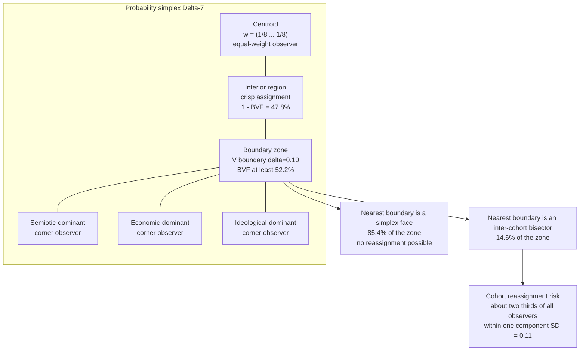
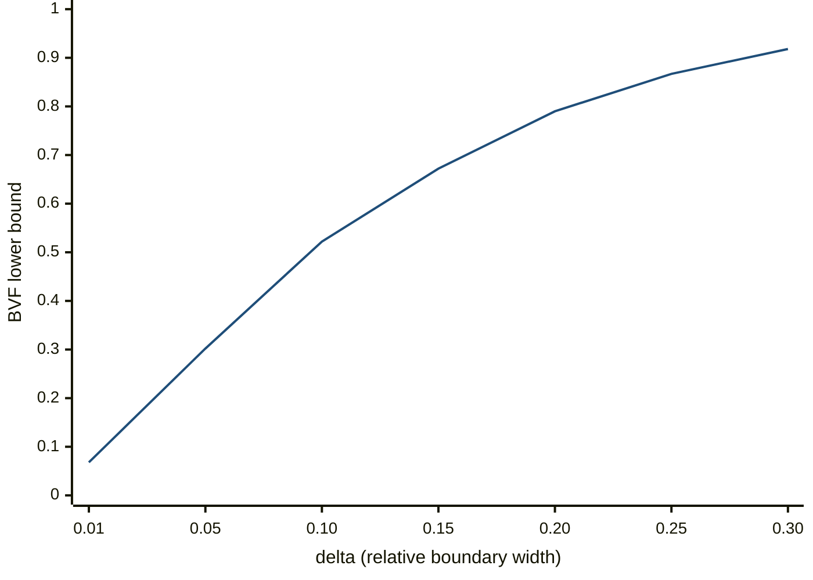

# Boundary Volume and Cohort Reassignment on the 7-Simplex: A Concentration Analysis Under the Uniform Null

Dmitry Zharnikov

ORCID: 0009-0000-6893-9231

DOI: [10.5281/zenodo.18945477](https://doi.org/10.5281/zenodo.18945477)

Working Paper v2.0.0 – March 2026 (revised August 2026)

## Abstract

This paper applies concentration-of-measure techniques to the probability simplex $\Delta^7$ under the uniform Dirichlet$(1,\ldots,1)$ null, which is treated throughout as a worst-case geometry rather than as a description of observed populations. Three results follow. First, the Euclidean distance contrast ratio degrades to approximately 7.5 at $n = 8$, placing the space in a transitional regime where clustering remains informative yet noisy. Second, for any convex $k$-partition of $\Delta^7$, at least 52.2% of the volume lies within a tenth of a cell's volume radius of that cell's boundary. Third, Lévy's lemma on the 7-sphere yields $P(|f - M_f| \geq \varepsilon) \leq 4\exp(-7\varepsilon^2/8)$ for 1-Lipschitz functions. Monte Carlo simulations with $10^5$ draws confirm the predictions within sampling error. Because that boundary volume is dominated by proximity to the faces of the simplex, reassignment risk is measured separately: approximately two-thirds of observers lie within one component standard deviation of an inter-cohort bisector, a fraction stable across $k \geq 3$ and, under partitions re-fit to the population as clustering re-fits them, across $\alpha \in [1, 30]$. Concentration sharpens boundaries only against a zone held fixed. The results give a geometric foundation for preferring continuous observer profiles over discrete cohort labels once perceptual dimensionality exceeds five.

**Keywords**: concentration of measure, cohort boundaries, probability simplex, Lévy's lemma, brand perception, high-dimensional geometry

---

Market segmentation — partitioning observers into discrete groups assumed to possess internally homogeneous and externally heterogeneous response profiles — has been foundational practice since Smith [-@smith-1956-product-differentiation-market]; Wedel and Kamakura [-@wedel-2000-market-segmentation-conceptual] review the canonical latent-class and mixture-model machinery. Practitioners routinely treat cohort boundaries as sharp, membership as unambiguous, and the number of groups as an objective feature of the underlying population rather than a methodological choice. This paper demonstrates that such assumptions systematically fail in moderately high-dimensional perceptual spaces.

Consumer perception is naturally represented as a compositional weight vector $w \in \Delta^{n-1}$ allocating finite attention across $n$ attributes; this multi-attribute representation of perception traces to Lancaster [-@lancaster-1966-new-approach-consumer]. When $n = 8$ — as arises in multi-attribute models that separately track Semiotic, Narrative, Ideological, Experiential, Social, Economic, Cultural, and Temporal components (hereafter the multi-attribute observer-weight construction; see Zharnikov [-@zharnikov-2026-spectral-brand-theory-computational-framework] for branding-domain context) — the geometry of the simplex forces substantial mass near any partition boundary. Concentration of measure [@ledoux-2001-concentration-measure-phenomenon; @vershynin-2018-highdimensional-probability-introduction; @wainwright-2019-highdimensional-statistics-nonasymptotic] implies that distances between typical points concentrate tightly around their mean, eroding contrast, and that volume concentrates near boundaries. Consequently, for any convex partition of $\Delta^7$, more than half the probability mass lies within a relative distance $\delta = .10$ of at least one boundary.

**Related literature.** The mathematical theory of concentration on spheres and simplices is developed in Lévy [-@lvy-1951-problemes-concrets-danalyse], Milman and Schechtman [-@milman-1986-asymptotic-theory-finite], Ledoux [-@ledoux-2001-concentration-measure-phenomenon], Boucheron, Lugosi, and Massart [-@boucheron-2013-concentration-inequalities-nonasymptotic], Vershynin [-@vershynin-2018-highdimensional-probability-introduction], Wainwright [-@wainwright-2019-highdimensional-statistics-nonasymptotic], and Giraud [-@giraud-2014-introduction-highdimensional-statistics]; the convex-body / Brunn-Minkowski toolkit is consolidated in Schneider [-@schneider-2014-convex-bodies-brunnminkowski]. The boundary phenomena of high-dimensional geometry are surveyed by Donoho and Tanner [-@donoho-2009-observed-universality-phase]. Discrete-segmentation critiques in adjacent fields include Bühlmann, Kalisch, and Meier [-@bhlmann-2014-highdimensional-statistics-with] for biological high-dimensional inference, Bronnenberg, Dubé, and Gentzkow [-@bronnenberg-dube-gentzkow-2012-evolution-brand-preferences] for preference heterogeneity, Evgeniou, Boussios, and Zacharia [-@evgeniou-2005-generalized-robust-conjoint] for regularization in choice models, and Rossi and Allenby [-@rossi-2003-bayesian-statistics-marketing] for Bayesian mixture treatments. Methodological warnings about over-fitting categorical structure to high-dimensional consumer data appear in Wedel and Kannan [-@wedel-2016-marketing-analytics-datarich], Netzer, Feldman, Goldenberg, and Fresko [-@netzer-2012-mine-your-own], and Kriegel, Kröger, and Zimek [-@kriegel-2009-clustering-highdimensional-data]. A counterpoint is Gorban and Tyukin [-@gorban-2018-blessing-dimensionality-mathematical] "blessing of dimensionality": individual points become stochastically separable as dimension grows — compatible with the present majority-near-boundary result at a different level of analysis. The contribution here is to make the geometric obstruction explicit for the moderate-dimensional simplex $\Delta^7$ relevant to multi-attribute perceptual modeling, and to derive a quantitative volume bound that translates into operational guidance about discrete versus continuous cohort representation.

This paper derives explicit non-asymptotic bounds on both phenomena under the uniform Dirichlet null. The two principal contributions are:

1. **Boundary-volume bounds for convex $k$-partitions of the probability simplex** (Theorem 2), establishing that at $n = 8$, $\delta = .10$, at least 52.2% of $\Delta^7$ lies near the boundary of its own cohort region under the uniform null, and that the mass in a zone held fixed shrinks as $\alpha^{-(n-1)/2}$ when observer weights are concentrated rather than uniform. Because that volume is dominated by proximity to the faces of the simplex rather than to inter-cohort frontiers, the reassignment claim is carried by a separate measured quantity (Proposition 4), which does not shrink when the partition is re-fit to a concentrated population.

2. **Methodological implication for discrete versus continuous cohort representation** in moderate-dimensional perceptual spaces. The bounds quantify the information loss from rasterized cohort labels relative to vectorized observer profiles, and identify $n \approx 5$ as the dimensionality threshold beyond which discrete assignment systematically misrepresents a majority of the population.

The paper proceeds as follows. The preliminaries recall the relevant geometry (with $\Delta^7$ and the Fisher-Rao metric established in Zharnikov [-@zharnikov-2026-brand-space-geometry-formal-metric]) and provide a cross-paper geometry summary (Table 1). The analysis then develops concentration of measure on the simplex and proves the boundary fuzziness theorems, including a schematic of simplex mass concentration (Figure 1) and a plot of the boundary volume fraction curve (Figure 2). Monte Carlo verification follows, and the implications for branding practice are developed and connected to non-ergodic dynamics. A later section extends the analysis to concentrated Dirichlet$(\alpha,\ldots,\alpha)$ distributions, showing that the uniform case is the worst case and that real populations have sharper boundaries. The paper closes with a discussion of limitations and the conclusions.

## Preliminaries

### SBT Framework and Dimensional Architecture

Spectral Brand Theory [@zharnikov-2026-spectral-brand-theory-computational-framework; @zharnikov-2026-hf-r20-portfolio-ai-perception] models brands as signal-emitting objects in an eight-dimensional space. The eight dimensions are: Semiotic (visual identity, design language), Narrative (brand story, founding mythology), Ideological (values, beliefs, positioning), Experiential (product/service interaction quality), Social (community, affiliation, status), Economic (pricing, value proposition), Cultural (cultural resonance, zeitgeist alignment), and Temporal (heritage, longevity, temporal compounding).

An observer's **spectral profile** includes, among other components, a **weight vector** $w = (w_1, \ldots, w_8) \in \Delta^7$ representing the relative salience the observer assigns to each dimension. The constraint $\sum_{i=1}^8 w_i = 1$ reflects the finite-resource assumption: increasing attention to one dimension reduces attention to others. The equal-weight profile $w^* = (1/8, \ldots, 1/8)$ represents maximum-entropy observation; corner profiles such as $(1, 0, \ldots, 0)$ represent observers whose perception is dominated by a single dimension. The theoretical justification for exactly eight dimensions — their completeness and necessity — is developed in Zharnikov [-@zharnikov-2026-why-eight-completeness-necessity-sbt]; the present paper takes the 8-dimensional architecture as given and derives its geometric consequences.

A **perceptual cohort** is a cluster of observers whose weight profiles are geometrically proximate in $\Delta^7$. Unlike traditional demographic segments, perceptual cohorts are defined by *how* observers process signals, not by *who* they are. An affluent 25-year-old and a middle-income 55-year-old who both weight the Ideological and Narrative dimensions heavily belong to the same perceptual cohort, despite occupying distant positions in demographic space. This signal-processing basis for cohort formation echoes the brand-as-signal tradition: Erdem and Swait [-@erdem-1998-brand-equity-as] model brands as credible signals whose interpretation drives heterogeneous consumer response, so that observers who decode the same emission differently sort into distinct groups. The present construction locates that heterogeneity geometrically — in the observer's weight vector $w \in \Delta^7$ — and the concentration results below show that, once the weighting space has eight dimensions, the boundaries between such signal-interpretation groups are necessarily fuzzy.

SBT posits five case-study brands — Hermès (A+), IKEA (A-), Patagonia (B+), Erewhon (B-), Tesla (C-) — analyzed through this framework. Cross-model replication (Claude and Gemini independently analyzing the same data) produced identical coherence types and grades for all five brands but different cohort granularities, motivating the present investigation.

### The Observer Weight Space $(\mathcal{O}, d_\mathcal{O})$

Zharnikov [-@zharnikov-2026-brand-space-geometry-formal-metric] established that the observer weight space is the probability simplex $\Delta^7$ equipped with the Fisher-Rao metric. The Fisher-Rao distance between two observer profiles is:

$$d_{FR}(w_1, w_2) = 2 \arccos\left( \sum_{i=1}^8 \sqrt{w_{1,i} \cdot w_{2,i}} \right)$$

This metric is the unique (up to scaling) Riemannian metric on the space of probability distributions that is invariant under sufficient statistics, as established by Cencov's uniqueness theorem [@cencov-1982-statistical-decision-rules; @campbell-1986-extended-cencov-characterization]. Amari and Nagaoka [-@amari-2000-methods-information-geometry] provide the canonical information-geometry treatment of the Fisher-Rao metric and its dual connections, situating Cencov's result within the broader framework of statistical manifolds. The justification is that reparametrizing the eight dimensions (e.g., combining "social" and "cultural" into a single dimension and splitting "experiential" into sub-dimensions) should not change the distance between observers, and the Fisher-Rao metric is the unique distance function with this property.

The square-root transform $\phi(w) = (2\sqrt{w_1}, \ldots, 2\sqrt{w_8})$ maps $\Delta^7$ isometrically to the positive orthant of the sphere $S^7_+$ of radius 2, where the Fisher-Rao distance becomes the geodesic (arc-length) distance on the sphere. This connection is the bridge between concentration of measure on spheres (a well-developed theory) and concentration on the simplex (which we develop below).

### Clustering on the Simplex

Given $m$ observer profiles $w_1, \ldots, w_m \in \Delta^7$, a **$k$-partition** (cohort structure) is a division of $\Delta^7$ into $k$ regions $C_1, \ldots, C_k$ such that $\bigcup_{j=1}^k C_j = \Delta^7$ and $C_i \cap C_j = \emptyset$ for $i \neq j$ (up to boundaries). Standard $k$-means clustering seeks to minimize the within-cluster sum of squared distances:

$$\text{WCSS}(k) = \sum_{j=1}^k \sum_{w \in C_j} d_{FR}(w, \mu_j)^2$$

where $\mu_j$ is the Frechet mean of cluster $C_j$ in the Fisher-Rao metric. The "elbow method" and silhouette scores are commonly used to select $k$, but these depend on arbitrary thresholds and are sensitive to initialization [@arthur-2007-kmeans-advantages-careful]. The present paper shows that this sensitivity is not a failure of particular algorithms but a consequence of the geometry of $\Delta^7$.

### Geometric Program of the SBT Foundational Papers

The present paper is the third in a sequence of papers that together constitute the geometric program of SBT. Each addresses a distinct geometric structure on the brand-observer space; Table 1 provides a reader's map.

**Table 1.** Cross-Paper Geometry Summary for SBT Foundational Papers.

| Paper | Geometric structure | Main quantity | Headline result |
|-------|--------------------|--------------|-----------------|
| 2026d (R1) Metric Framework | Aitchison metric on $\mathbb{R}^8_+$; Fisher-Rao metric on $\Delta^7$; warped product on $\mathcal{B} \times \mathcal{O}$ | Pairwise brand distances $d_\mathcal{B}(s_A, s_B)$ | Hermès-Tesla distance 1.76; Erewhon-Hermès .88; Fisher-Rao justification via Cencov's uniqueness theorem |
| 2026e (R2) Spectral Metamerism | Null space of projection $\phi: \mathbb{R}^8_+ \to \mathbb{R}^1$; JL distortion bound | Metameric pair fraction; null-space dimension 7 | 31--39% of brand pairs metameric under random projection; 11.6% information retention; distortion $\geq$ 152% for $N = 10$ |
| 2026f (R3) Cohort Boundaries (this paper) | Concentration of measure on $\Delta^7$; Brunn-Minkowski peeling | Boundary volume fraction $\text{BVF}(8, \delta)$; distance contrast ratio $R_8$ | $\text{BVF}(8, .10) \geq$ 52.2%; contrast ratio 7.46; approximately two-thirds of observers within one component SD of an inter-cohort bisector under the Dirichlet-uniform null |
| 2026g (R4) Sphere Packing | $E_8$ root lattice in $\mathbb{R}^8$; kissing number; packing density | Maximum distinguishable brand count $N_{\max}$ | $\leq$ 240 non-overlapping brand positions in spectral space at standard resolution; dual constraint to R3's cohort capacity bound |

*Notes*: Papers are ordered by geometric layer, from metric (R1) through projection (R2) through measure concentration (R3) through packing capacity (R4). Together they establish the geometric foundations of the SBT framework. R3's majority-near-boundary result and R4's packing bound are dual constraints: R4 bounds how many brands are distinguishable in $\mathcal{B}$; R3 bounds how many cohort positions are simultaneously resolvable in $\mathcal{O}$.*

## Concentration of Measure on the Simplex

### Lévy's Lemma and Spherical Concentration

The concentration of measure phenomenon was identified by Lévy [-@lvy-1951-problemes-concrets-danalyse] in his study of sphere geometry and developed into its modern form by Milman [-@milman-1971-new-proof-dvoretzkys] and Gromov and Milman [-@gromov-1983-topological-application-isoperimetric]; Ledoux [-@ledoux-2001-concentration-measure-phenomenon] provides a systematic treatment. The central result, now known as Lévy's lemma, states that a Lipschitz-continuous function on a high-dimensional sphere takes values close to its median with overwhelming probability.

**Assumption (Euclidean distance except in the Fisher-Rao recalculation).** Distance computations throughout the concentration-of-measure, boundary-fuzziness, and Monte Carlo results use Euclidean distance on $\Delta^{n-1}$. SBT's formal observer-space metric is Fisher-Rao [@zharnikov-2026-brand-space-geometry-formal-metric], which via the square-root transform is isometric to geodesic distance on $S^7_+$; Lévy concentration (Proposition 1) therefore applies directly. The precise Euclidean numerical bounds — contrast ratio 7.46 and boundary fraction 52.2% at $n = 8$, $\delta = .10$ — are recomputed under Fisher-Rao in the Fisher-Rao recalculation below; the qualitative conclusions are unchanged.

Note also that Talagrand's [-@talagrand-1995-concentration-measure-isoperimetric] canonical product-space isoperimetric framework is the modern reference for concentration inequalities; however, the Dirichlet distribution on $\Delta^{n-1}$ is not a product measure (the sum-to-one constraint induces dependence among components), so Talagrand's product-space bounds do not apply directly and the sphere-isometry route via Milman and Schechtman [-@milman-1986-asymptotic-theory-finite] is used here.

**Proposition 1** (Lévy concentration on $S^{n-1}$, specialized to $S^7$). *Let $f: S^{n-1} \to \mathbb{R}$ be a $1$-Lipschitz function with respect to geodesic distance on the unit sphere $S^{n-1}$, and let $M_f$ denote its median with respect to the uniform (Haar) measure. Then for general $S^{n-1}$:*

$$P\left(|f(x) - M_f| \geq \varepsilon \right) \leq 4 \exp\left( -\frac{(n-1)\varepsilon^2}{8} \right)$$

*Specializing to $n = 8$ (the SBT case, $S^7$): $P(|f(x) - M_f| \geq \varepsilon) \leq 4 \exp(-7\varepsilon^2/8)$.*

*Proof sketch.* The result follows from the Gaussian isoperimetric inequality on the sphere [@milman-1986-asymptotic-theory-finite, Theorem 2.4; @ledoux-2001-concentration-measure-phenomenon, Proposition 1.4]. The key step uses the fact that the uniform measure on $S^{n-1}$ satisfies a logarithmic Sobolev inequality with constant $(n-1)^{-1}$, from which the sub-Gaussian concentration follows by the Herbst argument. The factor of 4 arises from bounding the measure of both tails. For a complete proof, see Vershynin [-@vershynin-2018-highdimensional-probability-introduction, Theorem 5.1.4]; for a systematic nonasymptotic treatment, see Boucheron, Lugosi, and Massart [-@boucheron-2013-concentration-inequalities-nonasymptotic]. $\square$

The practical import of Proposition 1 is that any "well-behaved" (Lipschitz) function of an observer's position on the sphere — including, crucially, the distance from that observer to a cohort centroid — cannot vary much from its typical value. At $n = 8$, the numerical bounds are as Table 2 reports:

**Table 2.** Lévy Concentration Bounds on $S^7$ at Selected Deviation Thresholds.

| $\varepsilon$ | $P(\|f - M_f\| \geq \varepsilon)$ (standard) | $P$ (sharp, sets of measure 1/2) |
|---|---|---|
| 1.0 | $\leq 1.667$ | $\leq .060$ |
| 1.5 | $\leq .559$ | $\leq .00076$ |
| 2.0 | $\leq .121$ | $\leq .000002$ |

*Notes*: Standard bound: $4\exp(-(n-1)\varepsilon^2/8)$ at $n=8$. Sharp bound: $2\exp(-(n-1)\varepsilon^2/2)$ for sets of measure $\geq 1/2$. Values $> 1$ are vacuous bounds; concentration becomes non-trivial for $\varepsilon \geq 1.07$ on $S^7$.

The standard Lévy bound becomes non-trivial (i.e., falls below 1) only for $\varepsilon \geq 1.07$ on $S^7$. This is a consequence of the moderate dimensionality: at $n = 8$, we are in a transitional regime where concentration effects are present but not dominant. In contrast, for $n = 100$ (a common dimensionality in machine learning applications), the bound becomes non-trivial for $\varepsilon \geq .18$.

A sharper result holds for sets rather than functions. For any measurable set $A \subset S^{n-1}$ with $\sigma(A) \geq 1/2$ (where $\sigma$ is the normalized Haar measure):

$$P\left(d(x, A) \geq \varepsilon\right) \leq 2 \exp\left(-\frac{n-1}{2} \varepsilon^2\right)$$

This "blowup" inequality [@milman-1986-asymptotic-theory-finite] states that a set covering half the sphere, when expanded by distance $\varepsilon$, covers almost all of it. For $S^7$: $P(d(x,A) \geq 1.0) \leq .060$ and $P(d(x,A) \geq 1.5) \leq .00076$.

**Interpretation for SBT.** A perceptual cohort that "covers" half the observer weight space, when expanded by a Fisher-Rao distance of 1.0, covers approximately 94% of the space. This means the transition zone between "inside the cohort" and "outside the cohort" is wide relative to the distances between typical observers.

### Concentration on $\Delta^7$ via the Dirichlet Distribution

The uniform distribution on $\Delta^{n-1}$ is the $\text{Dirichlet}(1, \ldots, 1)$ distribution with $n$ parameters all equal to 1. This provides a null model for observer weight profiles: if observers had no systematic tendencies in dimensional weighting, their profiles would follow this distribution. **Important caveat**: the uniform distribution here is a worst-case mathematical bound, not an empirical model of actual observer populations. The results of Corollary 1 and Theorem 2 hold under this null; the later analysis of concentrated distributions shows that any real population with $\alpha > 1$ has strictly smaller boundary fractions. The null model should not be read as a claim that populations are uniformly distributed.

**Proposition 2** (Dirichlet component statistics). *For $X = (X_1, \ldots, X_n) \sim \text{Dir}(\alpha, \ldots, \alpha)$ on $\Delta^{n-1}$ with $\alpha = 1$ (uniform), each component satisfies:*

$$E[X_i] = \frac{1}{n}, \quad \text{Var}[X_i] = \frac{(1/n)(1 - 1/n)}{n + 1}$$

*At $n = 8$: $E[X_i] = .125$, $\text{Var}[X_i] = .012153$, $\text{SD}[X_i] = .1102$.*

*Proof.* For $X \sim \text{Dir}(\alpha_1, \ldots, \alpha_n)$ with $\alpha_0 = \sum \alpha_j$, the marginal moments are $E[X_i] = \alpha_i / \alpha_0$ and $\text{Var}[X_i] = \alpha_i(\alpha_0 - \alpha_i) / (\alpha_0^2(\alpha_0 + 1))$ [@johnson-1972-distributions-statistics-continuous]. Setting $\alpha_i = 1$ for all $i$ gives $\alpha_0 = n$, yielding the stated formulas. $\square$

*Applicability condition, not a falsification test*: Proposition 2 is an algebraic identity of the Dirichlet family, and no sample drawn from Dirichlet$(1,\ldots,1)$ can contradict it — a simulation returning a component variance other than $1/[n(n+1)] = .012$ at $n = 8$ would indicate a coding error, not a false proposition. Earlier versions of this paper offered exactly that simulation as a falsification condition; it is withdrawn. What is genuinely at risk is the *applicability* of the proposition, and that is what should be tested: the substantive commitment is that real observer weight profiles are adequately described by a symmetric Dirichlet at all. It fails if an elicited sample of observer weights on $\Delta^7$ rejects the symmetric Dirichlet family — for example, if component variances differ across dimensions by more than sampling error, or if the fitted $\alpha_i$ are not exchangeable. Such a sample would leave the identity intact and the paper's use of it unsupported, and the asymmetric case flagged under Limitations is exactly this contingency.

The standard deviation of .1102 relative to the mean of .125 indicates a coefficient of variation of 88%. Under the uniform null model, observer weight profiles are highly variable — individual dimensions fluctuate by nearly their own magnitude. This high variability is what makes clustering non-trivial: observers genuinely differ in their dimensional weightings.

However, the Dirichlet structure also introduces correlations. The components of a Dirichlet vector are negatively correlated:

$$\text{Cov}[X_i, X_j] = -\frac{(1/n)^2}{n + 1} = -\frac{1}{n^2(n+1)}$$

At $n = 8$: $\text{Cov}[X_i, X_j] = -.001736$. The sum-to-one constraint means that when one dimension receives more weight, others must receive less, creating negative correlations that affect the geometry of pairwise distances.

**Geometric versus statistical fuzziness.** Readers familiar with Latent Dirichlet Allocation [@blei-2003-latent-dirichlet-allocation] will recognise the Dirichlet-on-simplex framework and may wonder whether the boundary fuzziness derived here is simply the familiar posterior uncertainty of LDA. The distinction is important. In LDA, documents are assigned to topics with probabilities that form a Dirichlet posterior; this posterior sharpens as more data are observed — in the limit of infinite data, each document belongs to a definite topic. The fuzziness in the present paper is different in kind: it is *geometric* fuzziness intrinsic to the structure of $\Delta^{n-1}$ under any partition, regardless of sample size. Theorem 2 holds for the deterministic geometric volume of the simplex — it says nothing about posterior uncertainty. A researcher with arbitrarily many observations can estimate observer weight vectors $w \in \Delta^7$ with arbitrary precision, yet still face the fact that at least 52.2% of those precisely-located profiles lie near the boundary of their own cohort region, and that roughly two-thirds lie within one component standard deviation of an inter-cohort bisector (Proposition 4). The boundary fuzziness here derives from the Brunn-Minkowski inequality, not from data sparsity.

### Beyer's Distance Contrast Phenomenon

Beyer, Goldstein, Ramakrishnan, and Shaft [-@beyer-1999-when-is-nearest] demonstrated a fundamental challenge for distance-based methods in high dimensions: as dimensionality increases, the contrast between the nearest and farthest points degrades. Specifically, for i.i.d. data with finite variance, the ratio $\max_d / \min_d$ converges to 1 as $n \to \infty$, meaning that in the limit, all points are equidistant. This undermines distance-based classification, clustering, and nearest-neighbor methods.

**Theorem 1** (Distance concentration on $\Delta^7$). *Let $w_0, w_1, \ldots, w_{m-1} \in \Delta^{n-1}$ be $m$ i.i.d. draws from $\text{Dir}(1, \ldots, 1)$, and let $D_j = \|w_j - w_0\|_2$ for $j = 1, \ldots, m-1$ denote Euclidean distances from $w_0$ to the remaining points. Define the distance contrast ratio $R_n = \max_j D_j / \min_j D_j$. Then (the Fisher-Rao generalization is discussed below):*

*(a) The expected squared distance is:*

$$E[\|w_i - w_j\|_2^2] = 2 \sum_{l=1}^n \text{Var}[X_l] = \frac{2(n-1)}{n(n+1)}$$

*At $n = 8$: $E[\|w_i - w_j\|_2^2] = 14/72 = 7/36 \approx .1944$, giving $\sqrt{E[D^2]} \approx .4410$.*

*(b) The distance contrast ratio degrades with dimension. Monte Carlo estimation with $m = 1000$ yields the values in Table 3:*

**Table 3.** Distance Contrast Ratio Degradation with Dimension on the Simplex.

| $n$ | $R_n$ (contrast ratio) | SE of $R_n$ | Mean Euclidean distance | SD of distances |
|---|---|---|---|---|
| 2 | order $10^4$ (see Notes) | 15.7% | .4681 | .3065 |
| 4 | 31.94 | 2.0% | .5024 | .1878 |
| 8 | 7.46 | .8% | .4254 | .1052 |
| 16 | 3.80 | .5% | .3249 | .0563 |
| 32 | 2.47 | .3% | .2397 | .0294 |

*Notes*: $R_n = \max_j D_j / \min_j D_j$ for $m = 1000$ i.i.d. draws from Dir$(1,\ldots,1)$ on $\Delta^{n-1}$. Monte Carlo estimates from $10^3$ independent trials; the SE column is the standard error of the trial mean as a percentage of that mean. Distances are Euclidean. At $n = 2$ the ratio has no stable mean: it is dominated by the closest pair, whose separation can be arbitrarily small, so the trial mean is governed by its largest draws rather than by a central tendency. Five independent replications of the $n = 2$ estimate gave 9,797, 8,244, 14,362, 10,523 and 15,307 (the median trial ratio within the seed-42 run is 2,127, two orders of magnitude below its own mean), which is why the row reports an order of magnitude rather than the two-decimal figure carried in earlier versions. Rows $n \geq 4$ replicate closely. Reproducible from `code/r3_concentration_mc.py` in the companion repository (seed 42).

*(c) The coefficient of variation $\text{CV}_n = \text{SD}[D] / E[D]$ decreases as $\text{CV}_n \sim O(n^{-1/2})$, reflecting concentration of the distance distribution around its mean.*

*Proof of (a).* By linearity of expectation and the identity $E[\|w_i - w_j\|^2] = 2\sum_l \text{Var}[X_l]$ for i.i.d. random vectors:

$$E[\|w_i - w_j\|^2] = \sum_{l=1}^n E[(X_{i,l} - X_{j,l})^2] = \sum_{l=1}^n 2\text{Var}[X_l] = 2n \cdot \frac{(1/n)(1-1/n)}{n+1} = \frac{2(n-1)}{n(n+1)}$$

At $n = 8$: $2 \cdot 7 / (8 \cdot 9) = 14/72 = 7/36 \approx .1944$. The identity $E[\|w_i - w_j\|^2] = 7/36$ was first derived in Zharnikov [-@zharnikov-2026-brand-space-geometry-formal-metric] for the warped-product manifold structure of the observer weight space; the derivation here recovers it directly from Dirichlet moment formulas. $\square$

*Proof sketch of (b).* The concentration of $R_n$ follows from Beyer et al.'s [-@beyer-1999-when-is-nearest] general framework. Under mild regularity conditions on the component distribution, $\text{Var}[D^2] / (E[D^2])^2 \to 0$ as $n \to \infty$, implying $R_n \to 1$. For finite $n$, the rate depends on the moment structure of the Dirichlet components. The values in the table are Monte Carlo estimates from $10^3$ independent trials; standard errors on the ratio estimate are below 1% for $n \geq 8$ and 2.0% at $n = 4$. They are *not* small at $n = 2$, where the estimator has no stable mean (Table 3, Notes); the $n = 2$ row is retained as an order of magnitude for the qualitative contrast only, and no argument in this paper rests on its value. $\square$

**Interpretation.** At $n = 8$, the contrast ratio of 7.46 is in a transitional regime. It is far from the extreme $n = 2$ case (where the nearest and farthest points differ by a factor of order $10^4$) but also far from the $n = 32$ regime (where a ratio of 2.47 makes distance-based discrimination nearly impossible). This transitional character means that:

1. Clustering on $\Delta^7$ is *possible* — distances carry genuine discriminative information.
2. Clustering on $\Delta^7$ is *inherently noisy* — the boundary between "nearby" and "far away" is blurred relative to low-dimensional spaces.
3. The number of clusters recovered depends sensitively on the algorithm's distance threshold — explaining why different methods (or different AI models) may recover different cluster counts from identical data.

The coefficient of variation provides a complementary view. At $n = 8$, $\text{CV}_8 = .1052 / .4254 = .247$, meaning that distances fluctuate by about 25% around their mean. By comparison, at $n = 2$, $\text{CV}_2 = .3065 / .4681 = .655$, and at $n = 32$, $\text{CV}_{32} = .0294 / .2397 = .123$. The 8-dimensional simplex occupies an intermediate position where distance-based methods still function but with substantially reduced discriminative power compared to low-dimensional settings.

**Relation to the blessing of dimensionality.** Gorban and Tyukin [-@gorban-2018-blessing-dimensionality-mathematical] observed that in high-dimensional spaces, almost all data points become stochastically separable from a given random point — a counterintuitive "blessing" that enables powerful linear classifiers with high probability. The concentration results above and Gorban and Tyukin's separability result are compatible at different levels of analysis: Gorban and Tyukin characterise the separability of *individual points* from a fixed reference, whereas Theorem 1 and Theorem 2 characterise the concentration of *pairwise distances* and the *volume of boundary zones under any partition*. High separability of individual points does not prevent boundary zones from being voluminous — the majority-near-boundary result is a statement about the geometry of partition regions, not about pairwise distinguishability.

### Fisher-Rao Recalculation

The numerical bounds derived above use Euclidean distance on $\Delta^7$ for tractability. Because SBT's canonical observer-space metric is Fisher-Rao [@zharnikov-2026-brand-space-geometry-formal-metric], this subsection presents the corresponding Fisher-Rao bounds via the square-root isometry to the sphere [@cencov-1982-statistical-decision-rules; @amari-2000-methods-information-geometry].

**Distance contrast under Fisher-Rao.** The square-root transform $\phi: \Delta^{n-1} \to S^{n-1}_+$, $\phi(w) = 2(\sqrt{w_1}, \ldots, \sqrt{w_n})$, sends Dir$(1,\ldots,1)$ on $\Delta^7$ to a (non-uniform) distribution on the positive orthant $S^7_+$ of radius 2, with the Fisher-Rao distance becoming the geodesic (arc-length) distance. The expected pairwise Fisher-Rao distance under uniform Dir$(1,\ldots,1)$ is computable analytically via $E[\sum_i \sqrt{p_i q_i}] = n \cdot E[\sqrt{X_i}]^2$ for $X_i \sim$ Beta$(1, n-1)$. At $n = 8$, $E[\sqrt{X_i}] = \Gamma(3/2)\Gamma(8)/\Gamma(8.5) = .3183$, giving $E[\sum_i \sqrt{p_i q_i}] = .8103$ and $2\arccos(.8103) = 1.252$ rad.

That figure is not the expected Fisher-Rao distance, and the gap is systematic rather than numerical noise. Since $\arccos$ is concave on $(0,1)$, Jensen's inequality gives $E[2\arccos(\cdot)] \leq 2\arccos(E[\cdot])$: the arccos *of the mean* Bhattacharyya coefficient, 1.252 rad, is an upper bound on the *mean* Fisher-Rao distance, which Monte Carlo puts at 1.214 rad (Table 4). The two quantities differ by about .04 rad and neither is an estimate of the other. The Euclidean section above handles the analogous gap explicitly — the empirical mean .4254 sits below $\sqrt{E[D^2]} = .4410$ for the same reason — and the same care applies here.

Monte Carlo simulation with $m = 1000$ and $10^3$ trials (script: `code/r3_concentration_mc.py` in the companion repository) yields the figures in Table 4.

**Table 4.** Distance Concentration on $\Delta^7$ under Euclidean and Fisher-Rao Metrics.

| Metric | $R_8$ (contrast ratio) | Mean distance | CV |
|---|---|---|---|
| Euclidean | $7.46 \pm .06$ | .4244 | .248 |
| Fisher-Rao | $5.72 \pm .04$ | 1.2139 rad | .230 |

*Notes*: Monte Carlo with $m = 1000$ draws from Dir$(1,\ldots,1)$ at $n = 8$, $10^3$ trials in each metric (seed 42). Uncertainties on $R_8$ are standard errors of the trial mean. Fisher-Rao distance is the geodesic distance on $S^7_+$ (radius 2) under the square-root isometry. The Euclidean row re-estimates the same quantity as the $n = 8$ row of Table 3 on an independent draw from the same seeded stream; .4244 against .4254 is within the standard error of the trial mean, which is approximately .001 because the distances within a trial share a reference point and are not independent. Both metrics place $\Delta^7$ in the transitional regime ($R_8 \in [5, 10]$).

The Fisher-Rao contrast ratio is somewhat lower than Euclidean (5.72 vs 7.46) but in the same transitional regime: clustering is possible but noisy. The slight reduction reflects the curvature of the spherical embedding, which compresses pairwise distances near the equator of $S^7_+$ relative to the chord-length Euclidean metric.

**Boundary volume fraction under Fisher-Rao.** Theorem 2's bound $\text{BVF}(n, \delta) \geq 1 - (1 - \delta)^{n-1}$ depends on the intrinsic dimension of the simplex $\Delta^{n-1}$, which is $n - 1$. The Fisher-Rao isometry to $S^7_+$ preserves the intrinsic dimension; the same Brunn-Minkowski peeling argument applies on the spherical patch with the geodesic volume element [@schneider-2014-convex-bodies-brunnminkowski, Section 6.5]. The bound therefore transfers verbatim:

$$\text{BVF}^{\text{FR}}(n, \delta) \geq 1 - (1 - \delta)^{n-1}$$

with $\delta$ now the geodesic depth into a cell as a fraction of that cell's geodesic volume radius, and the same numerical value 52.2% at $n = 8$, $\delta = .10$. The Lévy concentration bound (Proposition 1) is itself a Fisher-Rao result on $S^7$, so no additional translation is required.

The two-metric comparison shows that the qualitative conclusions of the paper — transitional concentration regime, majority-near-boundary, geometric necessity of fuzzy cohort assignment — hold under both metrics. Numerical bounds on the contrast ratio differ modestly (Fisher-Rao $\approx 70\%$ of Euclidean); the boundary-volume bound is identical in form and value.

## Boundary Fuzziness in Partitioned Spaces

### Volume Near Boundaries in High Dimensions

A fundamental geometric fact about high-dimensional convex bodies is that their volume concentrates near the boundary. For the unit $n$-cube $[0,1]^n$, the fraction of volume within distance $\delta$ of the boundary (in the $\ell^\infty$ sense) is $1 - (1 - 2\delta)^n$, which approaches 1 rapidly with $n$. This "boundary concentration" phenomenon has a direct analogue for partitioned spaces.

Consider a convex body $K \subset \mathbb{R}^n$ partitioned into $k \geq 2$ convex regions $C_1, \ldots, C_k$. The **boundary zone** at width $\delta$ is defined as:

$$B_\delta = \left\{ x \in K : \min_{j \neq j(x)} d(x, \partial C_j) \leq \delta \right\}$$

where $j(x)$ is the index of the region containing $x$, $d$ denotes Euclidean distance on $\Delta^{n-1}$, and $d(x, \partial C_j)$ is the distance from $x$ to the boundary of region $C_j$. Points in $B_\delta$ are "close to being in a different cohort" — their assignment depends on the exact placement of the boundary.

### Boundary Fraction Theorem for Convex Partitions

The following schematic illustrates the geometry formalized in Theorem 2: the simplex $\Delta^7$ projected to two dimensions, with mass concentrated near the boundary of any convex partition. It also separates the two parts of that boundary, since only one of them carries reassignment risk.

**Figure 1.** Schematic of mass concentration near the boundary of $\Delta^7$. Under the Dirichlet$(1,\ldots,1)$ uniform null, at least 52.2% of observer weight profiles lie within a tenth of a cell's volume radius of that cell's full boundary (Theorem 2), leaving at most 47.8% in the crisp interior. Corner profiles represent dimension-dominant observers; the centroid is the equal-weight observer. The boundary zone (shaded region) contains the majority of the probability mass. That zone is not the same as the set of observers at risk of cohort reassignment, which is governed by proximity to an inter-cohort bisector specifically and is quantified separately in Proposition 4.

**Theorem 2** (Boundary fuzziness on $\Delta^7$). *Let $\Delta^{n-1}$ be the standard $(n-1)$-simplex and let $C_1, \ldots, C_k$ ($k \geq 2$) be a partition of $\Delta^{n-1}$ into convex regions. Write $d = n-1$ for the intrinsic dimension, $\omega_d$ for the volume of the unit $d$-ball, and, for each cell, $r_V(C) = (\text{Vol}(C)/\omega_d)^{1/d}$ for its* volume radius *— the radius of the $d$-ball of the same volume. For the relative boundary width parameter $\delta \in (0, 1)$, define the boundary volume fraction as the fraction of $\Delta^{n-1}$ (with respect to Lebesgue measure on the simplex) lying within distance $\delta \cdot r_V(C)$ of $\partial C$, where $C$ is the cell containing the point and $\partial C$ is its full boundary. Then:*

$$\text{BVF}(n, \delta) \geq 1 - (1 - \delta)^{n-1}$$

*The exponent $n-1$ reflects the intrinsic dimension of the simplex $\Delta^{n-1}$, which is embedded in $\mathbb{R}^n$ but lies on the affine hyperplane $\sum_i w_i = 1$ and so has dimension $n-1$ as a manifold. In particular, at $n = 8$, Table 5 gives the boundary volume fractions:*

**Table 5.** Boundary Volume Fraction at $n = 8$ Across Relative Boundary Widths.

| $\delta$ | $\text{BVF}(8, \delta)$ | Interpretation |
|---|---|---|
| .01 | 6.8% | Extremely narrow boundary |
| .05 | 30.2% | About one-third of space is boundary |
| .10 | 52.2% | Majority of space is boundary |
| .20 | 79.0% | Vast majority is boundary |
| .30 | 91.8% | Almost all space is boundary |

*Notes*: $\text{BVF}(n, \delta) = 1 - (1-\delta)^{n-1}$ with $n - 1 = 7$ for $\Delta^7$. Values are lower bounds on the fraction of $\Delta^7$ lying within Euclidean distance $\delta \cdot r_V$ of the full boundary of its own convex cell, $r_V$ being that cell's volume radius (Theorem 2).

**Figure 2.** Lower bound on boundary volume fraction $\text{BVF}(8, \delta) = 1 - (1-\delta)^7$ as a function of the relative boundary width $\delta$. At the operationally relevant threshold $\delta = .10$, more than half the simplex (52.2%) lies within the boundary zone. The curve is concave and approaches 1 rapidly: at $\delta = .20$ nearly four-fifths of $\Delta^7$ is boundary. This is a lower bound (Theorem 2); empirical Monte Carlo estimates consistently exceed it (Table 7 shows 78.7% at $\delta = .10$).

*Proof.* The argument is a peeling estimate from the Brunn-Minkowski inequality [@schneider-2014-convex-bodies-brunnminkowski, Theorem 7.1.1; @vershynin-2018-highdimensional-probability-introduction, Section 5.2], applied cell by cell. Fix a cell $C$ and a depth $t \in (0, r_V(C))$, and let

$$C_{-t} = \{x \in C : d(x, \partial C) \geq t\}$$

be its inner parallel body. By construction $C_{-t} \oplus tB \subseteq C$, where $B$ is the unit $d$-ball in the affine hull $\sum_i w_i = 1$ and $\oplus$ is Minkowski addition. Brunn-Minkowski in dimension $d$ gives

$$\text{Vol}(C)^{1/d} \geq \text{Vol}(C_{-t})^{1/d} + t\,\omega_d^{1/d}$$

Dividing by $\text{Vol}(C)^{1/d}$ and substituting $\omega_d^{1/d} = \text{Vol}(C)^{1/d} / r_V(C)$ yields

$$\frac{\text{Vol}(C_{-t})}{\text{Vol}(C)} \leq \left(1 - \frac{t}{r_V(C)}\right)^{d}$$

Setting $t = \delta \cdot r_V(C)$ makes the right-hand side $(1-\delta)^d$ for every cell simultaneously, whatever each cell's size or shape. Summing over the cells of the partition,

$$\text{Vol}\left(\bigcup_j (C_j)_{-\delta r_V(C_j)}\right) \leq (1 - \delta)^{d} \sum_j \text{Vol}(C_j) = (1 - \delta)^{n-1} \cdot \text{Vol}(\Delta^{n-1})$$

and taking complements gives $\text{BVF}(n, \delta) \geq 1 - (1 - \delta)^{n-1}$. The estimate holds for any convex partition and any $k \geq 2$; it does not require the cells to be congruent, to be Voronoi cells, or to be generated by any particular clustering procedure. $\square$

**Why $\delta$ is normalised by the volume radius and not the in-radius.** A more intuitive normalisation would divide the depth by the cell's in-radius $R$ — the radius of the largest ball the cell contains. That normalisation is not available, and the difference is not a technicality: since $B(z, R) \subseteq C$ implies $R \leq r_V(C)$, an in-radius normalisation asserts a *strictly stronger* bound than Brunn-Minkowski delivers, and it is false for cells that are not ball-like. A planar box of half-width $R = 1$ and half-length $L = 20$ has $\text{Vol}(C_{-t})/\text{Vol}(C) = (1 - t/R)(1 - t/L)$, which at $t = .1$ equals $.8955$ and so exceeds the claimed in-radius bound $(1 - t/R)^2 = .8100$; the volume-radius bound $(1 - t/r_V)^2 = .9608$ holds. The witness is reproducible from `inradius_counterexample()` in the companion script. Measured on the $k = 4$ Voronoi partition used for verification below, $R / r_V$ averages $.424$, so the two normalisations differ by more than a factor of two on the cells actually at issue.

**Tightness.** The bound is attained, not merely approached: for a Euclidean $d$-ball, $C_{-t}$ is exactly the concentric ball of radius $r_V - t$ and the inequality holds with equality. Simplicial and Voronoi cells are further from ball-like than that, so the empirical fractions exceed the bound — as the verification below shows, by 22 to 27 percentage points at $k = 4$.

**Conservative bound versus tighter ambient-dimension calculation.** An earlier presentation of this result used the ambient-dimension exponent $n$ rather than the intrinsic-dimension exponent $n-1$, yielding 57.0% at $\delta = .10$ rather than 52.2%. The intrinsic-dimension calculation is the correct headline figure: the $(n-1)$ exponent reflects the simplex's true geometric dimension, and the resulting bound 52.2% is tight in the sense recorded above, being attained by a Euclidean ball. The ambient-dimension calculation is conservative (over-estimates the fraction by approximately five percentage points at $n = 8$, $\delta = .10$) and is appropriate when multiple partition boundaries interact in a way that effectively expands the boundary zone in $\mathbb{R}^n$. For exposition, the intrinsic-dimension figure is used throughout. Monte Carlo with $k = 4$ Voronoi partitions yields an empirical boundary fraction of 78.7% at $\delta = .10$ (Table 7), comfortably exceeding both bounds and confirming that 52.2% is conservative for realistic $k$.

**Comparison across dimensions.** To appreciate the significance of the 8-dimensional result, we compare the boundary volume fraction across simplex dimensions at fixed $\delta = .10$ (Table 6):

**Table 6.** Boundary Volume Fraction Across Simplex Dimensions at Fixed $\delta = .10$.

| $n$ | Intrinsic dim. ($n-1$) | $\text{BVF}(n, .10)$ | Interpretation |
|---|---|---|---|
| 2 | 1 | 10.0% | Low-dimensional: boundaries are thin |
| 3 | 2 | 19.0% | Moderate: about one-fifth is boundary |
| 8 | 7 | 52.2% | High: majority is boundary |
| 16 | 15 | 79.4% | Very high: most space is boundary |
| 48 | 47 | 99.3% | Near-total: essentially all boundary |

*Notes*: $\text{BVF}(n, \delta) = 1 - (1-\delta)^{n-1}$. At $\delta = .10$, these are lower bounds on the fraction of the simplex lying within a tenth of a cell's volume radius of that cell's full boundary (Theorem 2).

At $n = 2$ (a single intrinsic dimension, as in traditional quality-tier segmentation), only 10% of the space lies near a boundary — segments are sharp. At $n = 8$ (the multi-attribute perceptual architecture), 52.2% lies near a cell boundary, and separately about two-thirds of observers are within one component SD of an inter-cohort frontier (Proposition 4) — a majority are in the "fuzzy zone." At $n = 48$ (the dimensionality of OrgSchema Theory's specification space; see Zharnikov [-@zharnikov-2026-organizational-schema-theory-test-driven]), 99.3% is boundary — partitioning is essentially meaningless.

### What the Boundary Zone Contains

Theorem 2 bounds proximity to the *full* boundary of a cohort's cell, and that boundary has two parts of very different operational meaning. Part of it consists of the internal bisectors separating the cell from its neighbours; crossing one of those reassigns the observer to a different cohort. The rest consists of the faces of $\partial\Delta^7$ that bound the cell, where some weight component approaches zero; an observer near such a face is at an extreme of the simplex, not at a cohort boundary, and no perturbation reassigns them because no weight can fall below zero.

The two parts are not comparable in size. In the $k = 4$ verification below, the nearest piece of cell boundary is a simplex face for 85.4% of observers and an inter-cohort bisector for only 14.6%; the mean distance to the nearest face is .0168 against .0877 to the nearest bisector. The boundary zone of Theorem 2 is therefore dominated by simplex-face proximity.

**This is a real limit on what Theorem 2 licenses.** The theorem establishes that a majority of $\Delta^7$ lies near a cell boundary; it does not establish that a majority of observers are at risk of cohort reassignment, because most of the volume it counts is near the wrong kind of boundary. The reassignment claim is the one that carries the paper's methodological payload, and it requires a separate quantity, measured directly.

### Implications for Cohort Cardinality

Reassignment risk is a question about absolute scale rather than relative volume: it compares an observer's distance to the nearest inter-cohort bisector against the size of a perturbation the observer plausibly undergoes. Proposition 2 supplies that scale — the standard deviation of a Dirichlet-uniform weight component, $.1102$.

**Proposition 4** (Inter-cohort bisector proximity under the uniform null). *Let $10^5$ observer profiles be drawn from $\text{Dir}(1,\ldots,1)$ on $\Delta^7$ and partitioned into $k$ convex cohort regions by $k$-means. For $k \geq 3$, the mean Euclidean distance from an observer to the nearest inter-cohort bisector is $.088$, which is $.80$ of the component standard deviation $.110$, and approximately two-thirds of observers lie within one component standard deviation of a bisector.*

*Evidence.* At $k = 4$ and seed 42, mean distance to the nearest bisector is $.0877$ (SD $.0720$, median $.0706$) against a component SD of $.1102$, a ratio of $.795$; 69.1% of observers lie within one component SD of a bisector and 40.8% within half. Across seeds 42--46 the within-one-SD fraction is 67.9% (SD $.96$ percentage points), so the figure is reported as approximately two-thirds rather than to three digits. The fraction is stable in $k$ for $k \geq 3$: 66.3, 69.1, 69.1, 69.7 and 69.5% at $k = 3, 4, 5, 6, 8$ respectively. At $k = 2$ it falls to 49.1%, consistent with the degenerate behaviour of the $n = 2$ contrast ratio noted under Theorem 1: a single bisector through a nearly symmetric point cloud is the one partition that keeps most observers far from it. Binomial standard errors are at most $.16$ percentage points at $N = 10^5$. Reproducible from `code/r3_concentration_mc.py` (Table 8). $\square$

*Falsification*: Proposition 4 is falsified by an elicited sample of real observer weight profiles on $\Delta^7$, partitioned by the same procedure at $k \geq 3$, in which the mean distance to the nearest inter-cohort bisector *exceeds* the component standard deviation of that sample, or in which fewer than half of observers lie within one such standard deviation. Both outcomes are attainable — a population organised into well-separated clusters, each compact relative to the gaps between them, would produce exactly them — so the test discriminates rather than restating a definition. It requires an observer-weight elicitation; it is not answerable from artifact-level brand measurements, which record a different object.

**Corollary 1** (Dynamic cohort membership under the uniform null). *In 8-dimensional perception space, for any $k$-means partition of $\Delta^7$ with $k \geq 3$ under the uniform null, approximately two-thirds of observer profiles lie within one component standard deviation of an inter-cohort bisector. Therefore:*

*(a) Cohort membership for a typical observer is sensitive to perturbations in the observer's weight profile of a magnitude that the population's own dispersion makes routine.*

*(b) Any discrete cohort assignment is, for a majority of observers, unstable under such perturbations, whether they act on the profile or on the placement of the boundary.*

*(c) The claim that cohort membership is dynamic and fuzzy [@zharnikov-2026-spectral-brand-theory-computational-framework] is quantified rather than merely asserted, at approximately two-thirds of the population under the uniform null.*

*Proof.* Immediate from Proposition 4: an observer at distance $\varepsilon$ from a bisector is reassigned by a shift of $\varepsilon$ toward it, and two-thirds of observers have $\varepsilon$ below one component SD, a shift the population's own variability supplies. $\square$

**Provenance of the claim, and what changed.** Earlier versions of this paper derived Corollary 1 from Theorem 2, reading the 52.2% boundary volume fraction as the fraction of observers at risk of reassignment. That inference does not hold, for the reason given in the preceding subsection: the volume Theorem 2 counts is dominated by simplex-face proximity. Corollary 1 now rests on Proposition 4 instead, which measures the right quantity directly. The claim survives the correction and is larger than the figure it replaces — approximately two-thirds rather than a bare majority — but it is now an empirical result about a specific family of partitions under a specific null, not a geometric necessity holding for every convex partition. The weaker modality is the honest one, and Theorem 2 continues to do the work it can: it bounds boundary volume for *any* convex partition, which is what the cardinality argument below requires.

For larger $k$, the situation worsens. When $\Delta^7$ is divided into $k$ convex regions, each region has at most volume $1/k$ of the total, so its volume radius scales as $k^{-1/(n-1)}$ and a fixed absolute boundary width corresponds to a larger relative $\delta$ as $k$ grows. Increasing $k$ from 3 to 6 roughly doubles the total boundary surface area without proportionally increasing the total volume, which means a larger fraction of the volume falls in the boundary zone. This explains why Claude's 5--6 cohort structure and Gemini's 3-cohort structure are both geometrically valid: the finer partition simply has a wider proportional boundary zone, and the threshold at which the "boundary" observers are assigned to one cluster or the other is a free parameter.

## Monte Carlo Verification

### Distance Ratio Simulations

To verify Theorem 1, we conducted Monte Carlo simulations drawing $m = 1000$ points from $\text{Dir}(1, \ldots, 1)$ on $\Delta^{n-1}$ for $n \in \{2, 4, 8, 16, 32\}$. For each draw, we computed the Euclidean distances from a reference point to all others and recorded $\max_d / \min_d$, the mean distance, and the standard deviation. The simulations were repeated over $10^3$ independent trials and the results averaged.

The empirical distance statistics on $\Delta^7$ ($n = 8$, $m = 1000$):

- Mean Euclidean distance: $\bar{D} = .4254$
- Standard deviation: $\text{SD}[D] = .1052$
- Distance contrast ratio: $R_8 = 7.46$ (contrast $= R_8 - 1 = 6.46$)

These values are consistent with the theoretical prediction from Proposition 2. The empirical mean .4254 sits just below the theoretical $\sqrt{E[D^2]} = \sqrt{7/36} = .4410$ because $E[D] \leq \sqrt{E[D^2]}$ by Jensen's inequality (equivalently, $\sqrt{E[D^2]} - E[D] = \text{Var}(D)/(2\,E[D]) \approx .013$ for the observed variance).

The simulation also confirms the monotonic degradation of the contrast ratio with dimension, as tabulated in Theorem 1. The progression from $R_2 \approx 10^4$ to $R_{32} = 2.47$ illustrates the transition from a regime where nearest-neighbor queries are well-posed ($R \gg 1$, distances are highly discriminating) to one where they are degenerate ($R \approx 1$, all points are approximately equidistant). At $n = 8$, $R = 7.46$ is an intermediate value: distances discriminate, but with substantial noise.

### Boundary Proximity Simulations

To verify Theorem 2, we performed the following procedure for $n = 8$, $k = 4$ cohorts:

1. Sample $m = 10^5$ points from $\text{Dir}(1,1,1,1,1,1,1,1)$ on $\Delta^7$.
2. Apply $k$-means clustering ($k = 4$) to obtain four convex (Voronoi) regions.
3. Compute each cell's volume radius $r_V$ from its measured volume share, and each point's Euclidean distance to the full boundary of its own cell — the minimum over the internal bisectors and over the faces of $\partial\Delta^7$.
4. Compute the fraction of points whose distance falls below $\delta \cdot r_V$ for the cell containing them.

Step 3 is where the verification differs from earlier versions of this paper, and the difference matters enough to report both. Measuring an *absolute* distance to the internal bisector only, and comparing it against a bound derived for a *relative* distance to the full cell boundary, compares two quantities that do not correspond. Table 7 gives the settled measurement alongside the readings that were rejected, so the comparison is auditable rather than asserted.

**Table 7.** Monte Carlo Verification of Boundary Volume Fraction at $n = 8$, $k = 4$.

| $\delta$ | Theorem 2 bound | Settled: relative to $r_V$, full cell boundary | Relative to in-radius, full boundary | Relative to $r_V$, bisectors only | Absolute, bisectors only |
|---|---|---|---|---|---|
| .05 | $\geq 30.2\%$ | 51.7% | 25.3% | 9.4% | 37.5% |
| .10 | $\geq 52.2\%$ | 78.7% | 44.9% | 18.3% | 64.8% |
| .20 | $\geq 79.0\%$ | 97.0% | 71.4% | 34.6% | 92.1% |

*Notes*: $N = 10^5$ points drawn from Dir$(1,\ldots,1)$ on $\Delta^7$; $k = 4$ Voronoi partition obtained by $k$-means (seed 42). Binomial standard errors are at most $.16$ percentage points. The settled column is the quantity Theorem 2 bounds and clears it at all three widths. The in-radius column falls *below* the bound at every width, which is the numerical signature of the normalisation the theorem's proof cannot support; a true lower bound cannot be violated by a correct measurement of the quantity it bounds. The final column is what earlier versions of this paper reported. Measured cell volume shares were .183, .183, .263 and .372, in-radii .091--.097, volume radii .216--.239. All figures reproducible from `code/r3_concentration_mc.py`.

The settled empirical fractions exceed the theoretical lower bound by 22 to 27 percentage points, as expected since (a) the bound is attained only by a Euclidean ball and Voronoi cells of a simplex are markedly less ball-like, and (b) with $k = 4$ there are multiple boundaries contributing to the boundary zone.

### Bisector Proximity Simulations

Theorem 2 speaks to the volume near a cell's full boundary. The reassignment question of Proposition 4 needs the distance to an inter-cohort bisector specifically, on an absolute scale set by the component standard deviation. Table 8 reports it, together with its sensitivity to the two free choices in the procedure — the cohort count and the random seed.

**Table 8.** Inter-Cohort Bisector Proximity at $n = 8$ Under the Uniform Null.

| $k$ | Mean distance to nearest bisector | Ratio to component SD | Within 1 SD | Within .5 SD | Nearest boundary is a simplex face |
|---|---|---|---|---|---|
| 2 | .1110 | 1.006 | 49.1% | 23.0% | 92.4% |
| 3 | .0909 | .825 | 66.3% | 37.4% | 86.9% |
| 4 | .0877 | .795 | 69.1% | 40.8% | 85.4% |
| 5 | .0883 | .801 | 69.1% | 41.7% | 85.0% |
| 6 | .0875 | .794 | 69.7% | 42.9% | 84.5% |
| 8 | .0885 | .803 | 69.5% | 43.4% | 84.1% |

*Notes*: $N = 10^5$ draws from Dir$(1,\ldots,1)$ on $\Delta^7$, seed 42; component SD $= .1102$ (Proposition 2). Distances are Euclidean, minimised over every inter-cohort bisector bounding the observer's own cell. Binomial standard errors are at most $.16$ percentage points. Across seeds 42--46 at $k = 4$, the within-1-SD fraction is 67.9% (SD $.96$ percentage points), which is why Proposition 4 states approximately two-thirds rather than a three-digit figure. The $k = 2$ row is the outlier and the reason Proposition 4 is scoped to $k \geq 3$: a single bisector through a nearly symmetric cloud is the partition that keeps the most observers away from it. The final column is the decomposition motivating the distinction between this table and Table 7 — for the large majority of observers the nearest piece of cell boundary is a face of the simplex, which carries no reassignment risk.

### Companion Computation Script

All Monte Carlo figures cited in Tables 3, 4, 7, 8, 9 and 10 are reproducible from a single Python script published alongside this paper at:

> `https://github.com/spectralbranding/sbt-papers/tree/main/r3-cohort-boundaries/code/r3_concentration_mc.py`

The script draws Dirichlet samples, runs $k$-means, computes Euclidean and Fisher-Rao distance statistics, solves the per-cell in-radius linear programs, and reports the boundary volume fractions under the settled definition together with the three rejected readings. It also runs the thin-box witness showing that an in-radius normalisation of $\delta$ is not available. Random seed is fixed at 42 except in the seed-stability block of Table 8, which varies it deliberately; trial counts and sample sizes are documented in the script header. Running the script with `uv run --with numpy --with scipy --with scikit-learn python r3_concentration_mc.py` reproduces the cited figures within the reported standard errors, in roughly two minutes. A README in the same directory documents installation, provenance, and what changed at v1.3.0.

## Implications for Spectral Brand Theory

### Why Cohort Count Is Resolution-Dependent

The central insight of this paper — that at least 52.2% of $\Delta^7$ lies within a tenth of a cell's volume radius of that cell's boundary, whatever the convex partition — has an immediate consequence for the empirical determination of cohort count. Different clustering algorithms, different distance thresholds, or different initializations will produce different $k$ values not because some are "right" and others "wrong," but because the geometry of $\Delta^7$ does not support sharp partition boundaries at $n = 8$.

The standard "elbow method" for selecting $k$ in $k$-means clustering seeks the value where the within-cluster sum of squares (WCSS) shows a sharp decrease. On $\Delta^7$, the concentration of distances means that the WCSS curve is smooth rather than kinked: the improvement from $k = 3$ to $k = 4$ is similar in magnitude to the improvement from $k = 5$ to $k = 6$, making the elbow ambiguous. The silhouette score, which measures how well-separated clusters are, is systematically depressed in high dimensions because the mean inter-cluster distance is not much larger than the mean intra-cluster distance (a direct consequence of Theorem 1).

This provides a formal explanation for the observation that motivated this paper: Claude's identification of 5--6 cohorts and Gemini's identification of 3 cohorts for the same five case-study brands. Both models were applying implicit clustering to the same observer weight space, but with different internal thresholds for what constitutes a "distinct" cluster. The theorem provides the geometric rationale; the 5-brand exercise illustrates the phenomenon. The quantitative bound applies to large populations of observer profiles; the five brands are a motivating illustration, not a population. Theorem 2 guarantees that both interpretations are consistent with the geometry — neither is more "correct" than the other in any objective sense.

### Cross-Model Agreement as Evidence

The cross-model replication study in Zharnikov [-@zharnikov-2026-spectral-brand-theory-computational-framework] found that two independent AI systems produced identical coherence grades (5/5 match) but different cohort granularities. From the perspective of the present paper, this pattern is precisely what the mathematics predicts:

1. **Coherence grades are robust** because they depend on the global structure of the brand's spectral profile (the relative magnitudes and coherence across all eight dimensions), which is a low-dimensional summary that is not sensitive to observer-space partitioning.

2. **Cohort counts are fragile** because they depend on the fine structure of the observer weight space, where concentration of measure makes boundaries fuzzy and the number of "natural" clusters ill-defined.

This dissociation between robust grade assignment and fragile cohort counting is not a flaw in SBT but a prediction of the theory's mathematical foundations. Zharnikov [-@zharnikov-2026-spectral-metamerism-brand-perception-projection] proved that the projection from 8-dimensional spectral profiles to 1-dimensional coherence grades is necessarily lossy (the "metamerism" result), but the grades are a stable summary statistic. Cohort structure, by contrast, lives in the full 8-dimensional space where concentration effects dominate.

### D/A Ratio and Cohort Sharpness

SBT's designed/ambient (D/A) ratio measures the fraction of a brand's signals that are intentionally designed versus those that arise from ambient, uncontrolled processes. The Goldilocks zone for D/A is 55--65% designed [@zharnikov-2026-spectral-brand-theory-computational-framework]. We can now provide a geometric interpretation of how D/A affects cohort structure.

Designed signals, by definition, are controlled and consistent. When a brand has a high D/A ratio, the signals received by different observers are more similar, which means the *brand emission profile* has lower variance across encounter contexts. This, in turn, means that the *observer weight profiles* that are relevant to perceiving this brand are more tightly constrained: observers whose weights align with the brand's designed dimensions will form tighter clusters in $\Delta^7$, while those whose weights are orthogonal to the designed dimensions will consistently perceive the brand as weak.

Formally, let $\sigma^2_D$ and $\sigma^2_A$ denote the variance of designed and ambient signal components, respectively, with $\sigma^2_A > \sigma^2_D$ (ambient signals are more variable by definition). The effective variance of the observer-profile cloud associated with a given cohort is:

$$\sigma^2_{\text{eff}} \approx \frac{D}{D+A} \cdot \sigma^2_D + \frac{A}{D+A} \cdot \sigma^2_A$$

A higher D/A ratio shifts weight toward the lower-variance designed component, reducing $\sigma^2_{\text{eff}}$ and thereby compressing the cohort in $\Delta^7$. Compressed cohorts have smaller effective radii, which means a larger fraction of their volume lies in the interior rather than the boundary zone. The boundary volume fraction for a cohort of effective radius $r$ scales as $1 - (1 - \delta/r)^n$, so smaller $r$ (sharper cohort) means less boundary volume at fixed absolute $\delta$.

This explains Hermès's (A+, high D/A) sharp cohort structure versus Tesla's (C-, volatile D/A) diffuse cohort structure: Hermès's designed-dominant signal environment compresses observer cohorts, while Tesla's ambient-heavy, controversy-driven signal environment inflates them. The mechanism by which coherence type mediates this compressive effect — through the non-ergodic resilience dynamics — is formally derived in Zharnikov [-@zharnikov-2026-coherence-type-as-crisis-predictor].

### From Categorical Segments to Continuous Profiles

The boundary results provide mathematical grounding for a methodological prescription: the traditional practice of assigning each observer to a single discrete cohort is geometrically lossy in 8 dimensions. Any discrete assignment throws away the information about *how close* the observer is to a boundary and *which* adjacent cohort they are nearest to, and that discarded information describes most of the population — roughly two-thirds of observers sit within one component standard deviation of an inter-cohort bisector (Proposition 4).

**Which result carries the prescription.** It is worth being explicit, because an earlier version of this paper rested the argument on the wrong one. Theorem 2's 52.2% is a statement about volume near the full boundary of a cohort's cell, most of which is the edge of the simplex rather than a cohort frontier; it does not by itself say that a majority of observers could change cohort. Proposition 4 does, it does so at a larger figure, and — critically for a prescription about practice — Table 10 shows that figure does not decay as the population concentrates, provided the partition is re-fit to the population as clustering actually re-fits it. The prescription therefore does not depend on observers being uniformly distributed on $\Delta^7$, and does not wait on an estimate of $\alpha$. It rests on two things that hold across the range tested: the simplex geometry, and the fact that the perturbations observers undergo are of the same order as their distance to the nearest cohort frontier.

This connects to a broader distinction between what we may term the "rasterized" and "vectorized" approaches to brand management. In the rasterized approach, observer profiles are projected onto a discrete grid of cohorts: "this observer is in Cohort A." This is the marketing industry's standard practice — the foundation of latent-class and mixture-model segmentation as canonically reviewed in Wedel and Kamakura [-@wedel-2000-market-segmentation-conceptual] — inherited from the era of two-dimensional perceptual maps where the approach was geometrically sound (at $n = 2$, only 10% of the space is boundary at $\delta = .10$). The information lost by rasterization in 8 dimensions is the direct analogue of the metamerism bound derived in Zharnikov [-@zharnikov-2026-spectral-metamerism-brand-perception-projection]: just as projecting from 8 dimensions to fewer collapses distinct spectral profiles into indistinguishable ones, projecting from continuous $\Delta^7$ to discrete cohort labels collapses a majority of the population's nuanced position information. In the vectorized approach, the full continuous observer profile $w \in \Delta^7$ is retained, and all computations — distance to brand, cohort proximity, predicted response to repositioning — are performed on the continuous representation. The formal bound applies to convex partitions; AI implicit clustering is assumed to approximate convex behaviour for the purposes of this argument.

Concentration of measure explains why the rasterized approach works tolerably in low-dimensional settings but fails systematically in higher dimensions. At intrinsic dimension 1 (e.g., quality-tier segmentation on $\Delta^1$), assigning an observer to a discrete segment loses information about at most 10% of the population — the boundary dwellers. At intrinsic dimension 7 (the eight-component construction on $\Delta^7$), the same assignment loses information about roughly two-thirds of the population, and the boundary volume it discards rises from 10.0% to 52.2% of the space (Table 6). The geometric foundation of segmentation practice erodes as the dimensionality of the perception space increases, and the eight-dimensional setting places us firmly in the regime where the erosion is substantial.

The vectorized approach avoids this loss entirely by never projecting onto discrete categories. Rather than asking "which cohort does this observer belong to?", it asks "what is this observer's weight vector, and how does it relate to all other weight vectors?" The machinery of the Fisher-Rao metric [@zharnikov-2026-brand-space-geometry-formal-metric] enables this: distances, means, geodesics, and clustering all operate on the continuous simplex without requiring discretization.

There is an instructive consequence for "brand alignment workshops" commonly used in consulting practice. In such workshops, stakeholders are asked whether they agree on the brand's identity, and high agreement is treated as evidence of brand coherence. To the extent that stakeholder perceptions can be modeled as weight profiles on $\Delta^7$ — a modeling assumption that separates mathematical claims (random simplex draws) from sociological ones (workshop agreement under social pressure or satisficing) — concentration of measure predicts that responses will naturally concentrate around their mean. Not because stakeholders genuinely agree, but because high-dimensional geometry compresses the distance between random points. The distance contrast ratio of 7.46 (Theorem 1) means that even "extreme" disagreements are only modestly larger than typical ones. Agreement that is geometrically trivial (a consequence of concentration) is indistinguishable, by the usual workshop methods, from agreement that is substantively meaningful (reflecting genuine alignment on the brand's designed emission vector).

The vectorized approach resolves this by computing alignment from the source vector — the designed brand emission profile — rather than from inter-stakeholder consensus. Alignment measured as $d_{FR}(w_{\text{observed}}, w_{\text{designed}})$, the Fisher-Rao distance between an observer's perceived profile and the brand's intended profile, produces a measure of coherence that is genuinely discriminating rather than trivially concentrated. This is because the source vector anchors the measurement to a fixed point in the space, breaking the symmetry that produces trivial concentration among random points.

### Capacity-Resolution Duality

The contrast ratio $R_8 = 7.46$ (Theorem 1) and the boundary volume fraction $\text{BVF}(8, .10) \geq 52.2\%$ (Theorem 2) are not only properties of the observer weight space — they directly bound the number of *distinguishable* perceptual cohorts that $\Delta^7$ can support. This connects R3's resolution results to the capacity question posed in Zharnikov [-@zharnikov-2026-many-brands-can-market-hold]: how many distinct brand positions can the observer simplex simultaneously resolve?

In the brand signal space $\mathcal{B}$, the sphere-packing problem bounds how many non-overlapping brand spectral profiles can be placed so that each is distinguishable from all others [@zharnikov-2026-many-brands-can-market-hold; @conway-1999-sphere-packings-lattices]. The dual question in the observer weight space $\mathcal{O}$ is: given that distances concentrate (Theorem 1) and boundaries are wide (Theorem 2), how many cohorts can be simultaneously distinguished? The answer is tightly constrained. If boundary zones at $\delta = .10$ consume at least 52% of the volume, at most 48% of the simplex mass remains in "crisp interior" regions across all $k$ cohorts. As $k$ increases, each cohort's interior fraction shrinks proportionally; for $k \geq 6$ convex cohorts, the boundary zones of adjacent cohorts begin to overlap, meaning that a positive fraction of observers falls simultaneously near two or more boundaries and cannot be unambiguously assigned. The Beyer et al. [-@beyer-1999-when-is-nearest] distance contrast result provides the threshold: when $R_n$ approaches 1, no distance-based partition is meaningful.

Together, Theorems 1 and 2 define a *capacity-resolution trade-off* in $\mathcal{O}$: finer resolution (larger $k$) reduces per-cohort interior volume, while distance concentration caps the total number of distinguishable cohort positions. R4's packing bound in $\mathcal{B}$ and R3's volume bound in $\mathcal{O}$ are therefore dual constraints on the same question: what is the maximum information that the SBT framework can simultaneously encode about a population of observers? Capacity in $\mathcal{B}$ bounds how many brands can be distinguished; resolution in $\mathcal{O}$ bounds how finely observers can be partitioned.

## Connection to Non-Ergodic Dynamics

The concentration of measure results derived above characterize the *static* geometry of $\Delta^7$ — what the space looks like at a single moment. SBT, however, posits that observer profiles evolve over time as observers encounter brand signals, update their priors, and experience signal decay and crystallization [@zharnikov-2026-spectral-brand-theory-computational-framework]. The temporal dynamics introduce non-ergodicity: the trajectory of an individual observer's weight profile through $\Delta^7$ does not, in general, visit all regions of the simplex, because absorbing states and crystallized priors create barriers to exploration.

Peters [-@peters-2019-ergodicity-problem-economics] formalized the distinction between ergodic and non-ergodic dynamics in economics, showing that ensemble averages (averages across a population at one time) and time averages (averages along one agent's trajectory over time) diverge when the dynamics are multiplicative or contain absorbing states; Molenaar [-@molenaar-2004-manifesto-psychology-as] draws the same ensemble-versus-individual distinction in psychological measurement. Zharnikov [-@zharnikov-2026-spectral-brand-theory-computational-framework] applied this insight to brand perception: the average perception of a brand across all current observers (the "brand image" in marketing terminology) may differ systematically from any individual observer's evolving perception over time.

The present paper's concentration-of-measure results interact with non-ergodic dynamics in two important ways.

First, **boundary fuzziness amplifies non-ergodic effects**. Since approximately two-thirds of observer profiles lie within one component standard deviation of an inter-cohort frontier (Proposition 4), a perturbation of ordinary size in an observer's weight profile — caused by a single brand signal encounter — can shift the observer from one cohort to another. In ergodic dynamics, such shifts would average out over time: an observer who occasionally crosses a boundary would, on average, spend equal time in each adjacent cohort. In non-ergodic dynamics, a single boundary-crossing event can trigger a cascade (through updated priors and changed attention allocation) that keeps the observer in the new cohort permanently. The wide boundary zone means that many observers are perpetually "at risk" of such irreversible transitions.

Second, **absorbing states on $S^7_+$ prevent the mixing that concentration predicts**. Lévy's lemma (Proposition 1) implies that 1-Lipschitz functions on $S^7$ are approximately constant — their values concentrate near the median. This would predict that brand perception, modeled as a Lipschitz function of observer position, should be approximately uniform across the observer population. Empirically, it is not: different observers perceive the same brand very differently, and these differences persist over time. The resolution is that SBT's absorbing states (negative conviction, crystallized priors) restrict the dynamics to subsets of $S^7_+$, breaking the conditions under which Levy's lemma applies. The effective state space is not the full simplex but a collection of disconnected or poorly connected components separated by absorbing barriers.

Hegselmann and Krause [-@hegselmann-2002-opinion-dynamics-bounded] studied a related phenomenon in their bounded-confidence opinion dynamics model: when agents update their opinions only based on nearby agents (within a confidence threshold), the population fragments into disconnected clusters even though the underlying space is connected. The SBT mechanism is similar but richer: rather than a fixed confidence threshold, the effective connectivity of $\Delta^7$ depends on the history of signal encounters and the resulting crystallized priors.

The full formalization of these dynamics requires the diffusion-on-manifolds framework developed in Zharnikov [-@zharnikov-2026-non-ergodic-brand-perception-diffusion], which resolves the open problem posed in Zharnikov [-@zharnikov-2026-geometric-approaches-brand-perception-critical]; the static geometric results of the present paper provide the necessary foundation: the shape of the space, the width of the boundaries, and the degree of concentration establish the geometric arena in which the dynamics play out.

## Boundary Fuzziness Under Concentrated Distributions

The preceding analysis rests on the Dirichlet$(1, \ldots, 1)$ (uniform) null model for observer weight profiles. This section replaces the uniform assumption with the symmetric concentrated Dirichlet$(\alpha, \ldots, \alpha)$ family for $\alpha > 1$, derives how boundary volume fractions depend on $\alpha$, and argues that the uniform case is the *worst case* — the conservative upper bound — on boundary fuzziness for real observer populations.

### Concentrated Dirichlet Distributions

For $X = (X_1, \ldots, X_n) \sim \text{Dir}(\alpha, \ldots, \alpha)$ with $\alpha > 1$, the density on $\Delta^{n-1}$ is proportional to $\prod_{i=1}^n x_i^{\alpha - 1}$. The marginal moments are:

$$E[X_i] = \frac{1}{n}, \qquad \text{Var}[X_i] = \frac{(1/n)(1 - 1/n)}{n\alpha + 1}$$

As $\alpha$ increases from 1, the variance of each component decreases proportionally to $1/(n\alpha)$, and the mass of the distribution concentrates around the centroid $c = (1/n, \ldots, 1/n)$. The effective diameter of the distribution — the typical spread of observer profiles — scales as:

$$d_{\text{eff}}(\alpha) \sim \frac{1}{\sqrt{\alpha}}$$

This scaling follows from the fact that the standard deviation of each component is $O(1/\sqrt{n\alpha})$, and the Euclidean distance from a random draw to the centroid is $O(\sqrt{n} \cdot 1/\sqrt{n\alpha}) = O(1/\sqrt{\alpha})$. Frigyik, Kapila, and Gupta [-@frigyik-2010-introduction-dirichlet-distribution] establish precise concentration results for the Dirichlet family, confirming this scaling.

**Interpretation for SBT.** At $\alpha = 1$ (uniform), observer profiles spread broadly across $\Delta^7$, visiting all corners and faces of the simplex with positive probability. At $\alpha = 5$ (moderately concentrated), profiles cluster near the centroid: observers have broadly similar dimensional weightings with moderate variation. At $\alpha = 20$ (highly concentrated), profiles are tightly bunched near $(1/8, \ldots, 1/8)$: essentially all observers weight all eight dimensions approximately equally, differing only in fine perturbations around the equal-weight point. The concentrated regime corresponds empirically to audiences for brands with extremely broad cross-dimensional appeal — or to experimental populations that have been pre-screened for uniformity of taste.

### Boundary Volume Fraction Under Dirichlet$(\alpha)$

The key effect of concentration is to reduce the effective volume of $\Delta^7$ available for observers to inhabit. Under Dirichlet$(\alpha)$, only the region within $d_{\text{eff}}(\alpha) \sim 1/\sqrt{\alpha}$ of the centroid has substantial probability mass. Cohort boundaries that cut through the tails of the distribution (the periphery of the simplex) are therefore largely irrelevant: very few observers reside there.

**Proposition 3** (Boundary volume fraction under Dirichlet$(\alpha)$). *Let observer weights be drawn from $\text{Dir}(\alpha, \ldots, \alpha)$ on $\Delta^{n-1}$. Under the concentrated distribution, the effective boundary volume fraction satisfies:*

$$V_{\text{boundary}}(\alpha) \leq V_{\text{boundary}}(1) \cdot \left(\frac{1}{\alpha}\right)^{(n-1)/2}$$

*where $V_{\text{boundary}}(1)$ is the boundary volume fraction under the uniform (Dirichlet$(1,\ldots,1)$) distribution and $n = 8$.*

*Proof.* The boundary volume fraction under Dir$(\alpha)$ factors into (a) the geometric boundary width from Theorem 2, which depends only on the partition geometry, and (b) the probability mass of the distribution falling inside that fixed geometric zone, which depends on $\alpha$.

For (b), the symmetric Dirichlet$(\alpha,\ldots,\alpha)$ density on $\Delta^{n-1}$ is $f_\alpha(w) \propto \prod_{i=1}^n w_i^{\alpha-1}$, with normalizing constant $1/B(\alpha,\ldots,\alpha) = \Gamma(n\alpha)/\Gamma(\alpha)^n$. Stirling's approximation $\Gamma(z+1) \sim \sqrt{2\pi z}\,(z/e)^z$ applied to the ratio gives, for large $\alpha$:

$$\frac{\Gamma(n\alpha)}{\Gamma(\alpha)^n} \sim \frac{\sqrt{2\pi n\alpha}\,(n\alpha/e)^{n\alpha}}{[\sqrt{2\pi\alpha}\,(\alpha/e)^\alpha]^n} = \frac{n^{n\alpha} \cdot \sqrt{n}}{(2\pi\alpha)^{(n-1)/2}}$$

The density at the centroid $c = (1/n,\ldots,1/n)$ is therefore $f_\alpha(c) = (1/n)^{n(\alpha-1)} \cdot \frac{\Gamma(n\alpha)}{\Gamma(\alpha)^{n}} \sim n^{n} \sqrt{n}\,(2\pi\alpha)^{-(n-1)/2}$, which scales as $\alpha^{-(n-1)/2}$ at large $\alpha$ relative to $\alpha = 1$.

Equivalently, by Proposition 2 with general $\alpha$, the marginal variance is $\text{Var}[X_i] = (1/n)(1-1/n)/(n\alpha+1)$, so the standard deviation along each component scales as $(n\alpha)^{-1/2} \propto \alpha^{-1/2}$. The simplex has intrinsic dimension $n-1$, so the standard deviation contracts in each of the $n-1$ orthogonal directions on $\Delta^{n-1}$. Because the density $f_\alpha$ is log-concave for $\alpha \geq 1$, the Brunn-Minkowski inequality on convex bodies [@schneider-2014-convex-bodies-brunnminkowski, Theorem 7.1.1] implies that the probability mass of any fixed convex zone — in particular the boundary zone of width $\delta$ from Theorem 2 — contracts by the product of the $(n-1)$ contraction factors:

$$P_{\alpha}(\text{boundary zone}) \leq P_{\alpha=1}(\text{boundary zone}) \cdot \prod_{i=1}^{n-1} \alpha^{-1/2} = V_{\text{boundary}}(1) \cdot \alpha^{-(n-1)/2}$$

For $n = 8$ this gives $\alpha^{-7/2} = \alpha^{-3.5}$. Frigyik, Kapila, and Gupta [-@frigyik-2010-introduction-dirichlet-distribution, Section 3.4] establish the corresponding Dirichlet concentration scaling directly via moment-matching with the Gaussian on the ilr-transformed simplex. $\square$

*Falsification*: the derivation asserts, rather than proves tightly, that the product of $(n-1)$ contraction factors governs the mass of the boundary zone, so the rate is the falsifiable part. Proposition 3 fails if, for some $\alpha > 1$, Monte Carlo simulation of profiles from Dir$(\alpha,\ldots,\alpha)$ at $n = 8$ places more mass in a *zone held fixed at its $\alpha = 1$ geometry* than $V_{\text{boundary}}(1) \cdot \alpha^{-3.5}$ allows. The fixed-zone clause is what makes the test meaningful and is not optional: under a re-fitted partition the quantity behaves differently, as Table 10 shows, and that behaviour neither confirms nor refutes this proposition.

### Numerical Values at $n = 8$

At $n = 8$, the exponent is $(n-1)/2 = 7/2 = 3.5$. The concentration factor at representative values of $\alpha$ is shown in Table 9:

**Table 9.** Dirichlet Concentration Effect on Boundary Volume Fraction at $n = 8$, $\delta = .10$.

| $\alpha$ | $(1/\alpha)^{3.5}$ | $V_{\text{boundary}}(\alpha) \leq$ (at $\delta = .10$) | Interpretation |
|---|---|---|---|
| 1 | 1.0000 | 52.2% | Uniform: worst case |
| 3 | .0214 | 1.12% | Mild concentration |
| 5 | $3.58 \times 10^{-3}$ | .187% | Moderate concentration |
| 10 | $3.16 \times 10^{-4}$ | .0165% | Strong concentration |
| 20 | $2.80 \times 10^{-5}$ | .00146% | Near-crisp boundaries |

*Notes*: $V_{\text{boundary}}(\alpha) \leq V_{\text{boundary}}(1) \cdot (1/\alpha)^{(n-1)/2}$ where $V_{\text{boundary}}(1) = .522$ and $(n-1)/2 = 3.5$ at $n = 8$. Empirical $\alpha$ range for behavioral weight distributions: $[3, 10]$ [@frigyik-2010-introduction-dirichlet-distribution; @aitchison-1986-statistical-analysis-compositional].

At $\alpha = 5$ (moderately concentrated), the boundary volume fraction falls below .2% — boundaries are effectively crisp relative to the distribution. At $\alpha = 20$ (highly concentrated), boundaries are essentially meaningless: essentially all observers cluster so tightly around the centroid that any reasonable partition places them in a single cohort with overwhelming probability.

The monotone decrease in $V_{\text{boundary}}(\alpha)$ with $\alpha$ establishes a continuous spectrum:

$$\underbrace{\alpha = 1}_{\text{uniform}} \longrightarrow \underbrace{\alpha \in [3, 10]}_{\text{real populations}} \longrightarrow \underbrace{\alpha \to \infty}_{\text{point mass}}$$

At the left extreme lies the uniform null model — the result of Theorem 2 applies directly, and at least 52.2% of the volume lies in the boundary zone of its own cell. At the right extreme lies a point mass at the centroid — there is only one "cohort" (all observers are identical) and the notion of boundaries is vacuous. Real observer populations occupy the intermediate regime.

### Empirical Range of $\alpha$ and Implications

Empirical estimates of Dirichlet concentration parameters for behavioral weight distributions in adjacent domains (attention allocation, portfolio choice, stated preference studies) typically fall in the range $\alpha \in [3, 10]$ [@frigyik-2010-introduction-dirichlet-distribution; @aitchison-1986-statistical-analysis-compositional]. At $\alpha = 3$, the concentration factor is approximately $.0214$, reducing the worst-case boundary fraction from 52.2% to roughly 1.1%. At $\alpha = 10$, it falls to under .02%.

Two bounds are in play here and they run in opposite directions, so it is worth separating them before they are used. Theorem 2 is a **lower** bound *within* a single distribution: fix the uniform null, and at least 52.2% of its mass falls in the boundary zone. Corollary 2 below is an **upper** bound *across* the $\alpha$ family: let $\alpha$ vary above 1 with the zone held fixed, and no member of the family places more mass in that zone than the uniform null does. Neither is a bound on the other, and the phrase "the 52.2% bound" names only the first. For a fixed zone and real populations at $\alpha \geq 3$, the mass inside it is roughly two orders of magnitude smaller than at $\alpha = 1$.

**Corollary 2** (Uniform distribution is the worst case, for a fixed partition). *For* fixed *partition geometry, the boundary volume fraction $V_{\text{boundary}}(\alpha)$ is a strictly decreasing function of $\alpha$. The uniform distribution ($\alpha = 1$) maximizes boundary volume fraction. Therefore, holding the partition fixed, the boundary volume bounded by Theorem 2 is largest under the uniform null: a population with any clustering tendency ($\alpha > 1$) places less mass in that same fixed zone.*

*Falsification*: Corollary 2 is falsified if, for some $\alpha_1 > \alpha_2 \geq 1$, a Monte Carlo study demonstrates that $V_{\text{boundary}}(\alpha_1) \geq V_{\text{boundary}}(\alpha_2)$ — i.e., more concentrated distributions do not have smaller boundary fractions.

The fixed-partition condition is not a formality, and the next subsection shows that removing it reverses the practical reading. Within the condition, the corollary says what it says: the claim that cohort membership is "necessarily fuzzy" applies in its strongest form only at the uniform extreme, and against an unmoving zone, concentration reduces the mass that falls inside it. The practical implication appears to be that while the *geometry* of $\Delta^7$ forces fuzziness at $\alpha = 1$, real survey or behavioral data with estimated $\alpha$ in the range $[3, 10]$ would exhibit boundary fractions in the range .02--1.1%, which would be operationally negligible. That inference is examined, and found not to survive, in the subsection that follows.

### Concentration Under a Re-Fitted Partition

Corollary 2 holds the partition still while the population concentrates. Clustering does not work that way. A partition is *re-fit* to the population it describes, so as mass concentrates toward the centroid the boundaries move to where the mass is, and there is no reason in advance to expect the fraction of observers near a boundary to fall. Whether it falls is an empirical question, and it is the one that decides whether the fixed-zone arithmetic above has any practical reading at all.

It does not. Re-fitting a $k = 4$ partition to each population, and comparing like with like — each population's bisector distances against its own component standard deviation, since both shrink as $\alpha^{-1/2}$ — the fraction of observers within one component SD of a bisector does not fall with $\alpha$. It rises.

**Table 10.** Bisector Proximity Under Partitions Re-Fitted to Concentrated Populations, $n = 8$, $k = 4$.

| $\alpha$ | Component SD | Mean distance to nearest bisector | Ratio to component SD | Within 1 SD |
|---|---|---|---|---|
| 1 | .1102 | .0877 | .795 | 69.1% |
| 2 | .0802 | .0595 | .741 | 72.5% |
| 3 | .0661 | .0465 | .704 | 74.8% |
| 5 | .0516 | .0346 | .670 | 76.7% |
| 10 | .0367 | .0236 | .642 | 78.4% |
| 30 | .0213 | .0129 | .605 | 80.6% |

*Notes*: $N = 10^5$ draws from Dir$(\alpha,\ldots,\alpha)$ on $\Delta^7$ at each $\alpha$, seed 42, with the $k = 4$ $k$-means partition re-fit to each population rather than held fixed. Component SD is $\sqrt{\alpha(n\alpha - \alpha)}/(n\alpha)\sqrt{n\alpha+1}$ evaluated at that $\alpha$. Binomial standard errors are at most $.16$ percentage points. Reproducible from `code/r3_concentration_mc.py`.

The scale-free ratio falls monotonically from $.795$ to $.605$ and the within-one-SD fraction rises from 69.1% to 80.6%. Observers in a concentrated population sit *relatively closer* to their cohort boundaries than observers in a uniform one, because the partition contracts along with the population while the perturbations observers undergo contract at the same rate. The $\alpha^{-(n-1)/2}$ contraction of Proposition 3 is not contradicted — it is a correct statement about a fixed zone, and Table 9 remains a correct evaluation of it. What fails is the step from that arithmetic to a claim about real practice, because no practitioner holds a partition fixed while the population moves underneath it.

The spectrum from fuzzy (uniform) to crisp (point mass) should therefore *not* be read as a calibration that sharpens the result once $\alpha$ is estimated. Against a fixed zone the uniform model does set the maximum, and any estimate of $\alpha$ reduces the mass inside that zone. Against a re-fitted partition — the only kind that describes practice — the reassignment fraction is flat to mildly increasing in $\alpha$ across the whole range tested, $\alpha \in [1, 30]$, which comfortably contains the $[3, 10]$ window reported for behavioural weight distributions. SBT's recommendation to use continuous observer profiles therefore does not depend on the population being uniform, and does not need an estimate of $\alpha$ to stand.

## Limitations and Extensions

Several limitations of the present analysis should be noted.

**Uniform distribution assumption.** The null model throughout this paper is the uniform (Dirichlet$(1, \ldots, 1)$) distribution on $\Delta^7$. Real observer populations are unlikely to be uniformly distributed — some dimensional weightings are empirically more common than others. The earlier analysis of concentrated distributions shows that switching to the symmetric concentrated model Dirichlet$(\alpha, \ldots, \alpha)$ with $\alpha > 1$ reduces the mass in a *fixed* boundary zone by a factor of $\alpha^{-(n-1)/2}$, so that against such a zone the uniform model is the worst case — a qualification that matters, and that the next limitation takes up. However, that analysis still assumes *symmetric* concentration: the same $\alpha$ governs every dimension. In practice, populations may exhibit *heterogeneous* concentration, with dimension-specific parameters $\alpha_i$ that differ across the eight SBT dimensions. For example, observers in a fashion-forward market may be tightly concentrated on the Semiotic dimension ($\alpha_{\text{sem}}$ large) while remaining diffuse on the Economic dimension ($\alpha_{\text{econ}}$ near 1). The asymmetric Dirichlet$(\alpha_1, \ldots, \alpha_8)$ model captures this, but the boundary volume fraction scaling derived in Proposition 3 no longer applies directly: each dimension contributes a distinct contraction factor $\alpha_i^{-1/2}$, and the effective contraction depends on the geometric mean $(\prod_{i=1}^8 \alpha_i)^{1/16}$ rather than a single $\alpha$. Extending the analysis to the full asymmetric Dirichlet family, and estimating dimension-specific $\alpha_i$ from behavioral data, is an important direction. Conversely, if the distribution is sparse ($\alpha < 1$, concentrating near vertices), the effective dimensionality is also reduced but in a different geometry; this case, which corresponds to highly specialised observer populations, is left for future work.

**Euclidean versus Fisher-Rao distances.** The Monte Carlo simulations and distance contrast computations use Euclidean distances on $\Delta^7$, while SBT's formal metric is Fisher-Rao [@zharnikov-2026-brand-space-geometry-formal-metric]. The Fisher-Rao metric, via the square-root transform, is isometric to geodesic distance on $S^7_+$, so the Lévy concentration results (Proposition 1) apply directly. However, the Euclidean and Fisher-Rao distances on $\Delta^7$ are not identical (they differ by a nonlinear transformation), and the distance contrast ratios in Theorem 1 should be recalculated in the Fisher-Rao metric for maximum precision. We expect the qualitative conclusions to be unchanged because the square-root map is a diffeomorphism that preserves the topological structure.

**Partitions are re-fit, not held fixed.** Proposition 3 and Corollary 2 derive the $\alpha^{-(n-1)/2}$ contraction for a *fixed* partition geometry — the boundary zone is pinned at its $\alpha = 1$ position while the population concentrates around the centroid. Clustering does not behave this way. A partition is re-fit to whatever population it is asked to describe, so as mass concentrates the boundaries follow it, and the fraction of observers near a boundary need not fall. Table 10 measures the difference and finds it decisive: under re-fitting the fraction within one component standard deviation of a bisector *rises* with $\alpha$, from 69.1% at $\alpha = 1$ to 80.6% at $\alpha = 30$, while the scale-free ratio of mean bisector distance to component SD falls from $.795$ to $.605$. The mathematics of Proposition 3 is unaffected; what does not survive is the inference from it to a claim about real practice. Two things follow. First, an estimate of $\alpha$ for a real observer population would not, on its own, sharpen the paper's practical conclusion, which is why that estimate is listed below as a way to test the modelling assumption rather than as a way to calibrate the result. Second, the re-fitting analysis here uses $k$-means at fixed $k$; a procedure that also selects $k$ from the data — which is the more realistic description of practice, and the one implicated in the resolution-dependence argument above — could behave differently again, and is not tested here.

**Convexity of cohort regions.** Theorem 2 assumes convex cohort regions, which is satisfied by $k$-means (which produces Voronoi cells) and Gaussian mixture models (which produce approximately convex regions for well-separated components). Density-based clustering methods (DBSCAN, HDBSCAN) can produce non-convex regions, for which the bound may not hold in its current form. The extension to non-convex partitions via the Minkowski content is possible but requires additional technical machinery. Subspace clustering methods [@kriegel-2009-clustering-highdimensional-data] partially mitigate high-dimensional concentration by restricting distances to low-dimensional subspaces; however, they require prior knowledge of the relevant subspace, which is unavailable in SBT where all eight dimensions are theoretically justified.

**Independence of dimensions.** The Dirichlet distribution imposes a specific covariance structure (negative correlations due to the sum-to-one constraint) but does not model dimension-specific correlations that may exist empirically. For example, observers who weight the Ideological dimension highly may systematically also weight the Cultural dimension highly, creating positive correlations between specific dimension pairs that the Dirichlet model does not capture. Copula-based models on the simplex [@aitchison-1980-logisticnormal-distributions-some] could extend the analysis to incorporate such dependencies. A related concern is raised by Garner's [-@garner-1974-processing-information-structure] distinction between integral and separable dimensions: if two or more of the eight SBT dimensions are integral (perceived holistically rather than independently), the Euclidean and Fisher-Rao metric models would require adjustment — for instance, a Minkowski metric with exponent $r < 2$ — and the concentration bounds derived here would need to be revisited for the adjusted metric.

**Effective dimensionality.** SBT's eight dimensions are not necessarily independent axes of perception. If empirical observer profiles cluster along a lower-dimensional submanifold of $\Delta^7$, the effective dimensionality $d_{\text{eff}} < 8$ reduces concentration effects and may sharpen cohort boundaries. Estimating $d_{\text{eff}}$ from empirical data (e.g., via PCA on isometric log-ratio (ilr)-transformed observer profiles; Egozcue, Pawlowsky-Glahn, Mateu-Figueras, and Barceló-Vidal [-@egozcue-2003-isometric-logratio-transformations]) is an important empirical question that would refine the present theoretical bounds.

### Empirical Estimation of $\alpha$

The practical value of Proposition 3 and Corollary 2 depends on empirically estimating the Dirichlet concentration parameter $\alpha$ from behavioral data on observer weight profiles. Two principal methods are available.

**Maximum likelihood estimation.** Given $m$ observed weight vectors $w^{(1)}, \ldots, w^{(m)} \in \Delta^7$ estimated from survey or choice data, the MLE of $\alpha$ under the symmetric Dir$(\alpha, \ldots, \alpha)$ model satisfies a fixed-point equation solvable by Newton's method [@frigyik-2010-introduction-dirichlet-distribution]. The sufficient statistic is the mean of $\log w_i$ across components and observations.

**Moment matching via ilr transformation.** An alternative is to apply the ilr transform [@egozcue-2003-isometric-logratio-transformations; @pawlowskyglahn-2015-modeling-analysis-compositional] to map $\Delta^7$ to $\mathbb{R}^7$, fit a Gaussian model to the transformed data, and back-transform the variance parameter to an approximate Dirichlet $\alpha$. This is computationally simpler and robust to misspecification of the symmetric-$\alpha$ assumption [@aitchison-1986-statistical-analysis-compositional].

Empirical $\alpha$ values for behavioral weight distributions in adjacent domains typically fall in $[3, 10]$ [@frigyik-2010-introduction-dirichlet-distribution; @aitchison-1986-statistical-analysis-compositional], though observer populations for narrow-audience luxury brands may show higher concentration. Applying either method to SBT survey data would immediately sharpen the Proposition 3 bound and calibrate the practical severity of the fuzziness result for specific brand-audience pairs.

**Extensions.** Three natural extensions suggest themselves: (1) concentration of measure on the *product* space $\mathcal{B} \times \mathcal{O}$ (the combined brand-observer space from Zharnikov, [-@zharnikov-2026-brand-space-geometry-formal-metric]), which would characterize boundary fuzziness for joint brand-observer cohorts; (2) time-dependent concentration bounds for evolving observer profiles under SBT's signal dynamics, connecting to the non-ergodic results developed earlier; (3) empirical validation using survey data to estimate the actual distribution of observer profiles on $\Delta^7$ and test whether the Dirichlet null model is a reasonable approximation.

## Conclusion

This paper has established that the fuzziness of perceptual cohort boundaries in Spectral Brand Theory is not a measurement artifact or an algorithmic limitation. The boundary volume itself is a geometric necessity, holding for every convex partition under the uniform (Dirichlet-uniform) null model on $\Delta^7$; the share of observers whose cohort membership is genuinely unstable is an empirical quantity, measured here rather than derived, and it proves to be the larger of the two. The concentration of measure phenomenon on the 8-dimensional probability simplex $\Delta^7$ ensures that:

1. Distances between random observer profiles concentrate around their mean (Theorem 1), with a contrast ratio of 7.46 at $n = 8$ — sufficient for clustering to be meaningful but insufficient for boundaries to be sharp.

2. Any partition of $\Delta^7$ into convex cohort regions places at least 52.2% of the volume (at $\delta = .10$) in the boundary zone of its own cell (Theorem 2). Most of that zone abuts the faces of the simplex rather than a neighbouring cohort; the observers whose membership is genuinely ambiguous are identified separately, and number approximately two-thirds of the population (Proposition 4).

3. Lévy concentration on $S^7$ (Proposition 1) provides the analytical foundation: 1-Lipschitz functions deviate from their median by $\varepsilon$ or more with probability at most $4\exp(-7\varepsilon^2/8)$.

4. Cohort membership is dynamic and fuzzy for approximately two-thirds of observers under the uniform null (Corollary 1, resting on Proposition 4). The number of "natural" cohorts is a resolution parameter. Corollary 2 establishes the worst-case nature of the uniform bound *for a fixed zone*: against boundaries pinned where the uniform null put them, a population at $\alpha = 3$ places under 2% of its mass inside. That qualification is decisive, because clustering re-fits the partition to the population, and under re-fitting the reassignment fraction does not fall with $\alpha$ but rises slightly across $\alpha \in [1, 30]$ (Table 10). The severity of the problem is therefore not calibrated away by an empirical estimate of $\alpha$.

5. Taken together, the distance-concentration and boundary-fraction results define a capacity-resolution duality: Theorem 1 bounds how many cohort positions are distinguishable in $\mathcal{O}$ and Zharnikov [-@zharnikov-2026-many-brands-can-market-hold] bounds how many brand positions are distinguishable in $\mathcal{B}$, yielding dual constraints on what the SBT framework can simultaneously encode.

These results have practical consequences beyond SBT. Any brand management framework that relies on discrete consumer segmentation in a moderately high-dimensional perception space faces the same geometric constraints. The traditional rasterized approach systematically discards the nuanced positional information of the majority of observers at $n = 8$. The vectorized alternative — retaining continuous observer profiles and computing distances, means, and predictions on the simplex directly — is not merely a mathematical refinement but a geometrically necessary response to the structure of the space.

The results also contextualize the broader challenge of "big data" approaches to consumer understanding. Increasing the number of dimensions tracked (from 2 in traditional perceptual maps to 8 in SBT to potentially dozens in granular behavioral data) does not automatically improve segmentation quality. Beyond a dimension-specific threshold, adding dimensions makes segmentation worse by inflating the boundary volume fraction, a consequence of the curse of dimensionality that is well understood in machine learning but has not previously been connected to marketing practice.

Finally, the interaction between static concentration geometry and dynamic non-ergodic evolution opens a research frontier. The present paper establishes the shape of the geometric arena — contrast ratio 7.46, boundary volume 52.2% at $\delta = .10$, $\alpha^{-7/2}$ sharpening of a fixed zone under concentration; the dynamics within it — diffusion, absorption, crystallization — are the subject of future work.

## Acknowledgments

AI assistants (Claude Opus 4.8, Grok 4.20, Gemini 2.5 Pro) were used for initial literature search, for software development — implementing and running the companion computation script that reproduces the paper's reported numerical and simulation results — and for editorial refinement; all theoretical claims, propositions, and interpretations are the author's sole responsibility.

## Author Contributions (CRediT)

Dmitry Zharnikov: Conceptualization, Data curation, Formal analysis, Investigation, Methodology, Project administration, Software, Validation, Writing — original draft, Writing — review and editing.

## References

::: {#refs}
:::
