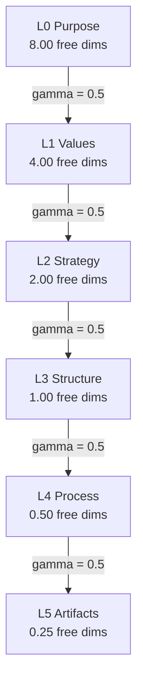
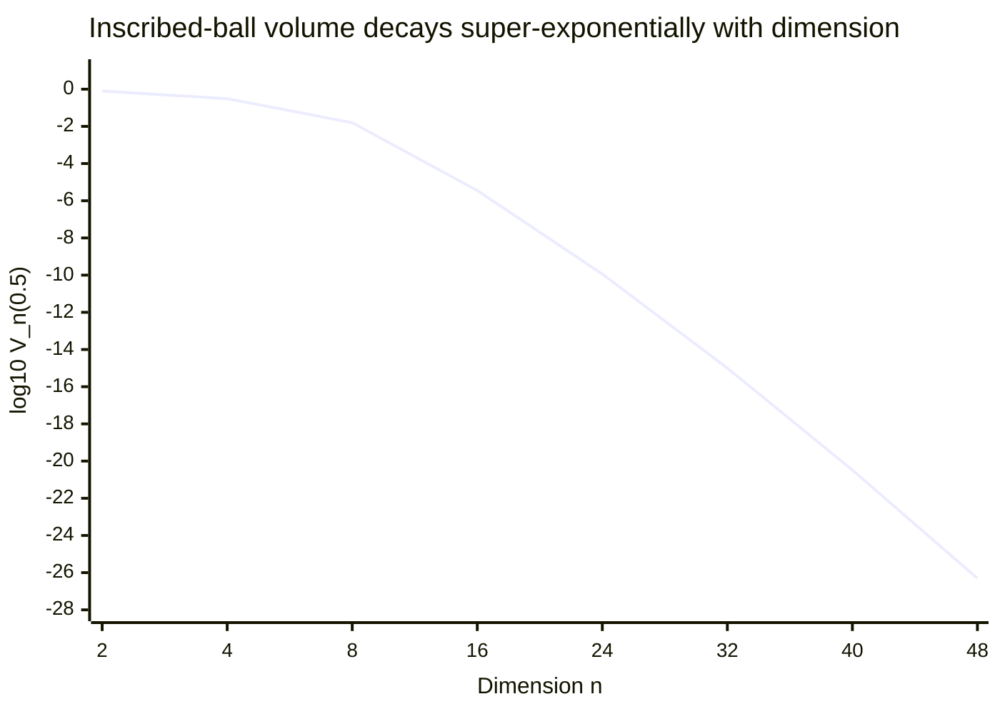
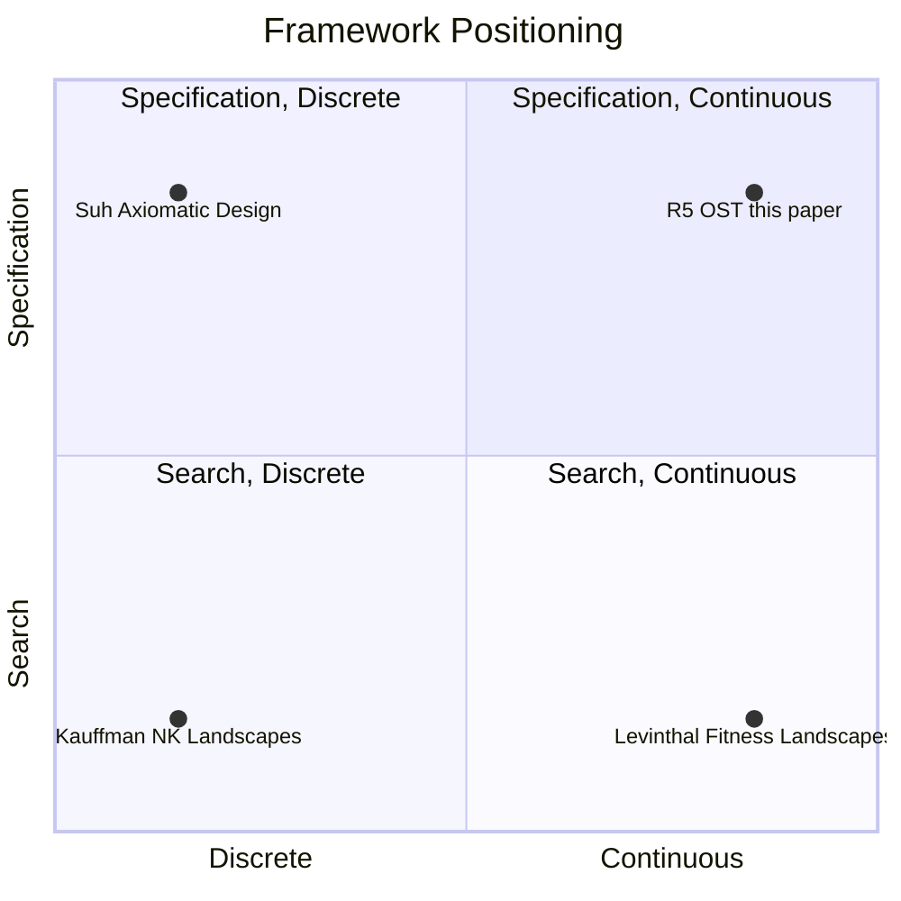

# Specification Impossibility in Organizational Design: A High-Dimensional Geometric Analysis

**Dmitry Zharnikov**

ORCID: 0009-0000-6893-9231

Working Paper v1.1.0 — March 2026 (Updated May 2026)

https://doi.org/10.5281/zenodo.18945591

---

## Abstract

Organizational design frameworks prescribe configurations across multiple interdependent levels yet no existing theory quantifies the fundamental limits of exhaustive specification. This paper applies high-dimensional geometry to prove that comprehensive organizational specification is geometrically impossible. OrgSchema Theory's (OST) 8x6 activation matrix is formalized as a 48-dimensional specification space $[0,1]^{48}$; three core results follow. First, the Coverage Impossibility Theorem: at resolution $\varepsilon = 0.1$ per dimension, there are $10^{48}$ distinguishable specifications, each covering a ball of volume $V_{48}(0.1) \approx 1.38 \times 10^{-60}$; even $10^{20}$ specifications cover only $10^{-40}$ of the space. Second, the Effective Dimensionality Theorem: OST's cascade model reduces effective dimensionality from 48 to $d_{\text{eff}} = 15.75$ at $\gamma = 0.5$, a 67% reduction. Third, the Forkability Theorem: the fork model decomposes the specification space into shared and private subspaces, formalizing franchises and open-source ecosystems. An information-theoretic analysis shows that full specification requires 159.4 bits, far exceeding human working-memory capacity, establishing that cascade and fork compression is cognitively necessary. These geometric results are strictly complementary to Simon's bounded-rationality argument: cognitive limits make optimization difficult; geometric impossibility precludes exhaustive coverage regardless of cognitive capacity. The paper distinguishes specification impossibility from NK landscape search complexity, providing the first formal volumetric justification for OST's specialization requirement within the organizational design literature.

**Keywords**: organizational design, specification space, high-dimensional geometry, coverage impossibility, dimensionality reduction, cascade constraints, forkability, OrgSchema Theory

**JEL Classification**: C65, L22, D23, M10

**MSC Classification**: 52A38, 90B70, 91B42

---

Every organizational design framework faces a fundamental tension: the desire to specify *how an organization should work* versus the impossibility of specifying *everything about how an organization should work*. Management consulting frameworks -- from McKinsey's 7-S model (Waterman et al. 1980) to Galbraith's Star Model -- identify key organizational dimensions and recommend configurations, implicitly treating organizational design as a problem of selecting the right point in a multi-dimensional parameter space. Yet no existing framework in the organizational design literature quantifies the *volumetric coverage* of its parameter space, the fraction of it that any set of recommendations can cover, or the geometric reasons why exhaustive specification is impossible.

This omission matters. When a consulting framework recommends a particular combination of strategy, structure, and process, it is selecting a single point (or a small neighborhood) in a space whose vastness has not been formally characterized in the organizational design literature. The claim that "one size does not fit all" is universally accepted in organizational theory, but the mathematical content of that claim -- *how many sizes would one need, and why is the answer always "not enough"?* -- has remained unformalized.

OrgSchema Theory (OST; Zharnikov 2026i) provides the architectural framework for this formalization. OST models organizations as configurable systems with six hierarchical levels -- Purpose (L0), Values (L1), Strategy (L2), Structure (L3), Process (L4), and Artifacts (L5) -- each specified across eight configuration dimensions that parallel the eight dimensions of Spectral Brand Theory (Zharnikov 2026a). The resulting 8x6 = 48 parameters form the organization's *activation matrix*, a complete specification of how the organization is configured at every level. OST posits that higher levels constrain lower levels (the *cascade model*) and that organizations can share higher-level specifications while diverging on lower levels (the *fork model*), but these claims have been justified only qualitatively. (Note: the six-level hierarchy here is distinct from the six-tier acquisition-target transferability ontology of Zharnikov 2026ag, which concerns structural separability in M&A contexts; a full alignment of the two hierarchies is deferred to future work.)

The present paper provides the geometric foundations. Three existing bodies of work address adjacent impossibility arguments without fully capturing the geometric case. Simon (1947) established that cognitive limits preclude optimal specification; Williamson (1975, 1985) showed that contractual incompleteness results from bounded rationality and opportunism; Suh (1990) demonstrated that information content constrains product design decomposition. The present result is strictly complementary to all three: geometric impossibility obtains regardless of cognitive capacity, contractual framing, or fitness function, and therefore holds on grounds that Simon's, Williamson's, and Suh's arguments do not address. No existing organizational design framework quantifies the volumetric coverage of its parameter space, the gap this paper fills. Drawing on the theory of high-dimensional volumes, three results are proved:

1. **Coverage impossibility.** The 48-dimensional specification space $[0,1]^{48}$ is so vast that any finite collection of organizational specifications covers a negligible fraction of it. At resolution $\varepsilon = 0.1$ per dimension, a single specification covers a ball of volume $V_{48}(0.1) \approx 1.38 \times 10^{-60}$, and even $10^{20}$ specifications cover only $10^{-40}$ of the space. Exhaustive specification is not merely impractical but geometrically impossible; compression through cascade constraints and forkability is cognitively necessary, not merely convenient.

2. **Cascade dimensionality reduction.** OST's cascade model, in which level $i$ constrains level $i+1$ with strength $\gamma$, reduces effective dimensionality from 48 to $d_{\text{eff}} = 8(1 - (1-\gamma)^6)/\gamma$. At moderate coupling ($\gamma = 0.5$), $d_{\text{eff}} = 15.75$ -- a 67% reduction that makes specification tractable without eliminating the need for specialization. The cascade collapse mechanism is illustrated in Figure 1.

3. **Forkability as subspace decomposition.** The fork model (sharing L0--L2 while diverging on L3--L5) decomposes $[0,1]^{48}$ into a 24-dimensional shared subspace and a 24-dimensional private subspace, providing the geometric foundation for franchises, open-source ecosystems, and denominational structures.

These results are distinct from the NK landscape tradition (Kauffman 1993; Levinthal 1997; Rivkin 2000), which models the difficulty of *searching* for optimal configurations on a fitness landscape. NK landscapes ask: "How hard is it to find the optimum?" The present analysis asks: "How much of the specification space can any collection of configurations cover?" The two questions are complementary, not competing: NK shows that search is hard; the present paper shows that even perfect search cannot produce exhaustive specification. The distinction is between computational complexity (NK) and geometric impossibility (the present paper). Together they establish what the NK landscape comparison below formalizes as the double bind that makes specialization the only viable organizational strategy. The relationship among these framework archetypes is summarized in Figure 2.

The paper builds on the metric framework established in Zharnikov (2026d), which defined formal metrics for Spectral Brand Theory's 8-dimensional perception space. Whereas that paper equipped the 8-dimensional brand space with the Aitchison and Fisher-Rao metrics, the present paper extends the geometric analysis to the 48-dimensional organizational specification space that arises when the 8-dimensional framework is applied at each of six hierarchical levels.

The paper next introduces OST and notation, then develops the three core theorems in sequence (volume collapse and coverage impossibility, cascade dimensionality reduction, forkability as subspace decomposition), followed by information-theoretic analysis, comparison with NK landscapes and related frameworks, practical implications for organizational design, limitations and extensions, and a concluding synthesis.

---

## Preliminaries: OrgSchema Theory

### The Activation Matrix

OrgSchema Theory (Zharnikov 2026i) models an organization as a configurable system specified across six hierarchical levels and eight configuration dimensions. The six-level hierarchy captures the progression from identity (purpose, values) through direction (strategy) and configuration (structure, process) to instantiation (artifacts); this structure is broadly consistent with Galbraith's (2014) Star Model (strategy, structure, processes, rewards, people) and Mintzberg's (1979) design parameters, extended to make the top and bottom of the hierarchy explicit and to impose a strict cascade ordering. The eight configuration dimensions are adopted as the modeling primitive because they span the semiotic, narrative, ideological, experiential, social, economic, cultural, and temporal axes along which observers reliably distinguish organizations. The six levels are:

- **L0: Purpose** -- why the organization exists; its reason for being
- **L1: Values** -- ethical and cultural principles that guide behavior
- **L2: Strategy** -- market positioning, competitive approach, growth model
- **L3: Structure** -- organizational architecture, team topology, reporting relationships
- **L4: Process** -- workflows, decision-making protocols, coordination mechanisms
- **L5: Artifacts** -- tools, documents, physical and digital infrastructure

Each level is specified across eight configuration dimensions that parallel the eight dimensions of Spectral Brand Theory (Zharnikov 2026a): Semiotic, Narrative, Ideological, Experiential, Social, Economic, Cultural, and Temporal. This parallel structure is not coincidental: OST posits that an organization's internal configuration determines its brand emissions, with each level contributing signals across all eight dimensions.

The 8x6 matrix of parameter values forms the organization's **activation matrix** $A \in [0,1]^{8 \times 6}$, where $A_{ij} \in [0,1]$ represents the activation level of dimension $i$ at organizational level $j$. When vectorized, $A$ becomes a point $a = \text{vec}(A) \in [0,1]^{48}$ in the 48-dimensional specification space. The activation matrix is designed to support construct-level discipline in organizational assessment, addressing concerns about questionable measurement practices (Flake & Fried 2020) by requiring explicit parameter specification before measurement; the matrix's pre-specification requirement imposes the kind of discipline that Putnick and Bornstein (2016) identify as necessary for cross-organization comparability.

**Example (Spectra Coffee).** The OST demonstration case, Spectra Coffee, specifies all 48 parameters: L0 includes purpose values across Semiotic (visual identity of "specialty craft"), Narrative ("third-wave coffee for the discerning"), Ideological ("direct-trade ethics"), and so forth. L5 includes artifact specifications across the same eight dimensions: Semiotic (menu typography, packaging design), Experiential (grinder calibration, water temperature), Economic (pricing tiers), and so forth. The full specification is a single point in $[0,1]^{48}$.

*Note.* Zharnikov (2026ag) presents a different six-tier ontology for acquisition-target transferability; the present paper's L0--L5 are OST's internal configuration levels and should not be confused with the 2026ag tiers, which concern the structural separability of business assets in M&A contexts.

### The Cascade Model

OST posits that higher levels constrain lower levels: an organization's purpose (L0) constrains its values (L1), which constrain its strategy (L2), and so forth down to artifacts (L5). This is the **cascade model**. A luxury hotel chain whose purpose is "providing sanctuary for discerning travelers" (L0) cannot coherently adopt a strategy of aggressive price competition (L2) or processes built around maximum throughput (L4). The constraint is not absolute -- deviations are possible -- but the cascade creates directional pressure that reduces the effective freedom at each lower level.

Formally, let $x_i \in [0,1]^8$ denote the specification vector at level $i$ ($i = 0, 1, \ldots, 5$). In the unconstrained case, each level has 8 free dimensions, for a total of 48. The cascade model introduces a coupling parameter $\gamma \in [0,1]$ representing the strength with which level $i$ constrains level $i+1$:

$$x_{i+1} = \gamma \cdot f(x_i) + (1 - \gamma) \cdot z_{i+1}$$

where $f: [0,1]^8 \to [0,1]^8$ is the cascade function (mapping a higher-level specification to the constraints it imposes on the next level) and $z_{i+1} \in [0,1]^8$ represents the free component at level $i+1$. At $\gamma = 0$, there is no cascade and all 48 dimensions are free. At $\gamma = 1$, the cascade is perfect and levels 1--5 are fully determined by L0, leaving only 8 free dimensions. The L0 → L5 hierarchy with effective free dimensions under $\gamma = 0.5$ is shown in Figure 1.



*Figure 1: OST cascade hierarchy. Effective free dimensions per level under coupling γ = 0.5; total d_eff ≈ 15.75 (geometric series sum from Theorem 2).*

### The Fork Model

OST also introduces the **fork model**: organizations can share higher-level specifications while diverging on lower levels. A franchise system shares L0 (purpose) and L1 (values) and often L2 (strategy) across all locations, while allowing L3--L5 (structure, process, artifacts) to vary. An open-source project shares L0--L2 (purpose, values, strategy of the codebase) while implementations fork at L3--L5. Religious denominations share L0--L1 (theological purpose and values) while diverging on L2--L5 (strategy, structure, process, artifacts).

The fork model partitions the 48-dimensional specification space into a **shared subspace** (the levels held in common) and a **private subspace** (the levels free to diverge). For a fork at level $k$ (sharing L0 through L$_{k-1}$, diverging on L$_k$ through L5):

$$[0,1]^{48} = [0,1]^{8k} \times [0,1]^{8(6-k)}$$

where $[0,1]^{8k}$ is the shared subspace and $[0,1]^{8(6-k)}$ is the private subspace.

### Relation to Spectral Brand Theory

Spectral Brand Theory (Zharnikov 2026a) models brand perception through the same eight dimensions used by OST. The relationship is generative: an organization's activation matrix determines its brand emissions. Where SBT asks "how is the brand perceived by external observers?", OST asks "how is the organization configured internally to produce those emissions?" The 8 dimensions are shared; the 6 hierarchical levels are OST's contribution. The downstream consequences of this generative relationship -- specifically, how brand identity arises as a Tier-4 projection from the organizational hierarchy and what separability conditions permit independent brand management -- are developed in Zharnikov (2026ah).

The metric framework of Zharnikov (2026d) -- the Aitchison metric on brand signal space, the Fisher-Rao metric on observer weight space -- applies to the 8-dimensional projections of the activation matrix. The present paper extends the geometric analysis to the full 48-dimensional specification space, where the relevant questions concern volume, coverage, and the structure of high-dimensional parameter spaces rather than distances between individual brands.

---

## The Geometry of Specification Spaces

### Volume Collapse in High Dimensions

The central geometric phenomenon driving the results is the well-known but underappreciated *volume collapse* of the unit ball relative to the unit cube in high dimensions (Vershynin 2018). The volume of the unit ball in $\mathbb{R}^n$ is:

$$V_n(1) = \frac{\pi^{n/2}}{\Gamma(n/2 + 1)}$$

where $\Gamma$ is the gamma function. The volume of the unit cube $[0,1]^n$ is 1 for all $n$. The ratio $V_n(1) / 2^n$ (scaling the ball to have diameter 1, matching the cube's side length) captures how much of the cube is "near the center" in the sense of lying within the inscribed ball:

$$\frac{V_{\text{ball}}}{V_{\text{cube}}} = \frac{\pi^{n/2}}{2^n \cdot \Gamma(n/2 + 1)}$$

This ratio collapses dramatically with dimension:

**Table 1: Volume Ratio of Inscribed Ball to Unit Cube by Dimension.**

| $n$ | $V_{\text{ball}} / V_{\text{cube}}$ | Interpretation |
|-----|-------------------------------------|----------------|
| 2 | $7.85 \times 10^{-1}$ | Circle fills 78.5% of square |
| 4 | $3.08 \times 10^{-1}$ | 4-ball fills 30.8% of 4-cube |
| 8 | $1.59 \times 10^{-2}$ | 8-ball fills 1.6% of 8-cube |
| 16 | $3.59 \times 10^{-6}$ | Effectively empty |
| 24 | $1.15 \times 10^{-10}$ | Negligible |
| 48 | $4.89 \times 10^{-27}$ | Astronomically small |

*Notes*: Ball radius = 0.5 (inscribed in unit cube). Values reproduced exactly by the companion computation script (table1_ball_cube_ratios function). See Vershynin (2018) for the full measure-concentration theory underlying these ratios.

The decay profile of the inscribed-ball volume across dimensions is plotted in Figure 3, which renders the super-exponential nature of the collapse on a single log-scaled axis.



*Figure 3: Volume of the inscribed ball $V_n(0.5)$ as a function of dimension $n$, on a base-10 logarithmic vertical axis. Anchor values: $V_2(0.5) \approx .785$, $V_8(0.5) \approx .0159$, $V_{24}(0.5) \approx 1.15 \times 10^{-10}$, $V_{48}(0.5) \approx 4.89 \times 10^{-27}$. The slope steepens monotonically with $n$: each additional dimension multiplies the log-volume penalty rather than adding to it. Reproduced by the companion computation script (figure3_volume_curve function).*

At $n = 48$ -- the dimensionality of OST's activation matrix -- the inscribed ball occupies approximately $4.89 \times 10^{-27}$ of the cube's volume. In plain language: in a 48-dimensional space, almost all of the volume is concentrated in the "corners" of the cube, far from any central specification. The center of the space is, in a precise volumetric sense, nowhere.

This is not a pathology of high-dimensional geometry but its defining feature. The cube $[0,1]^{48}$ has $2^{48} \approx 2.81 \times 10^{14}$ corners, and the volume concentrates near them because each dimension independently pushes mass toward the extremes. A "moderate" or "balanced" specification -- one near the center of the cube -- is volumetrically rare. This has immediate consequences for organizational design: the typical configuration is extreme in most of its 48 parameters, not balanced across them. An analogous concentration analysis on the probability simplex appears in Zharnikov (2026f); the volumetric concentration in $[0,1]^{48}$ shares the same underlying mechanism.

### Resolution and Distinguishability

Before stating the coverage impossibility theorem, what it means for two specifications to be "distinguishable" must be defined. A resolution-based criterion is adopted: two specifications $a, b \in [0,1]^{48}$ are distinguishable if they differ by at least $\varepsilon$ on at least one dimension. At resolution $\varepsilon$ per dimension, the specification space admits $(1/\varepsilon)^n$ distinguishable positions.

The choice of $\varepsilon = 0.1$ is motivated by practical considerations. Can an organizational designer meaningfully distinguish between a "0.3" and a "0.4" on a given parameter -- say, the degree of formalization in decision-making processes? In most organizational contexts, a 10-point scale per dimension represents the outer limit of reliable discrimination. Note that the $\varepsilon = 0.1$ resolution claim requires that OST parameters be metric rather than ordinal; if parameters are ordinal, the volume-based argument requires additional justification. Liddell and Kruschke (2018) document the conditions under which metric-model analyses of ordinal data yield valid inferences; OST's continuous $[0,1]$ parameterization is designed to satisfy those conditions, and empirical validation of the metric interpretation remains an open question for future research.

At $\varepsilon = 0.1$ and $n = 48$:

$$N_{\text{specs}} = (1/0.1)^{48} = 10^{48}$$

For comparison: the number of atoms in the observable universe is approximately $10^{80}$; the number of molecules in a human body is approximately $10^{28}$; the age of the universe in Planck times is approximately $10^{62}$. The number of distinguishable organizational specifications at this modest resolution is $10^{48}$ -- a number that dwarfs any practical enumeration.

### The Coverage Impossibility Theorem

We can now state the central result.

**Theorem 1 (Coverage Impossibility).** *Let $\mathcal{S} = [0,1]^{48}$ be the specification space of a 48-dimensional organizational framework. At resolution $\varepsilon = 0.1$ per dimension:*

*(i) The number of distinguishable specifications is $N = (1/\varepsilon)^{48} = 10^{48}$.*

*(ii) A single specification at this resolution covers a ball of volume:*

$$V_{48}(0.1) = \frac{\pi^{24}}{\Gamma(25)} \cdot 0.1^{48} \approx 1.38 \times 10^{-60}$$

*(iii) Even $10^{20}$ specifications -- far more than any library of organizational templates could contain -- cover a fraction:*

$$\frac{10^{20} \cdot V_{48}(0.1)}{1} = 10^{20} \cdot 1.38 \times 10^{-60} = 1.38 \times 10^{-40}$$

*of the specification space. Exhaustive coverage is geometrically impossible.*

*Proof.* Part (i) follows from the observation that $[0,1]^{48}$ admits $(1/\varepsilon)^{48}$ non-overlapping cubes of side $\varepsilon$, each containing a distinguishable specification. Part (ii) is a direct computation of the volume of the 48-dimensional ball of radius $\varepsilon$:

$$V_{48}(\varepsilon) = \frac{\pi^{48/2}}{\Gamma(48/2 + 1)} \cdot \varepsilon^{48} = \frac{\pi^{24}}{\Gamma(25)} \cdot 10^{-48} = \frac{\pi^{24}}{24!} \cdot 10^{-48}$$

Evaluating: $\pi^{24} \approx 8.55 \times 10^{11}$ and $24! \approx 6.20 \times 10^{23}$, so $V_{48}(0.1) \approx 1.38 \times 10^{-60}$. Part (iii) follows by linearity: the maximum coverage of $M$ non-overlapping balls is $M \cdot V_{48}(\varepsilon)$, which at $M = 10^{20}$ yields $1.38 \times 10^{-40}$. $\square$

**Corollary 1.1 (Number of Specifications for 1% Coverage).** *To cover even 1% of $[0,1]^{48}$ with balls of radius 0.1:*

$$M_{1\%} = \frac{0.01}{V_{48}(0.1)} \approx \frac{0.01}{1.38 \times 10^{-60}} \approx 7.26 \times 10^{57}$$

*This exceeds any practical enumeration by dozens of orders of magnitude.*

*Falsification: Theorem 1 is falsified if the OST parameter space is demonstrated to have intrinsic dimensionality substantially below 48 (e.g., fewer than 20 effective dimensions due to empirically established structural dependencies among the 48 parameters), in which case the coverage bound would apply to the lower-dimensional subspace and $V_{48}(0.1)$ would be replaced by $V_{d_{\text{eff}}}(0.1)$.*

**Plain-language interpretation.** Imagine that every organization that has ever existed, every consulting template, every management textbook, and every MBA case study collectively represented $10^{10}$ distinct organizational specifications. The fraction of the 48-dimensional specification space they would cover is $10^{10} \cdot 1.38 \times 10^{-60} = 1.38 \times 10^{-50}$ -- effectively zero. The space of possible organizational configurations is not merely large; it is so vast that any practical collection of examples or templates covers a negligible fraction of it.

The same arithmetic, viewed across orders of magnitude in template count, makes the impossibility result immune to optimistic accounting:

**Table 2: Coverage Ceiling -- Fraction of $[0,1]^{48}$ Covered by $M$ Templates at $\varepsilon = 0.1$.**

| Templates $M$ | Coverage $M \cdot V_{48}(0.1)$ |
|---------------|--------------------------------|
| 1 | $1.38 \times 10^{-60}$ |
| $10^{3}$ | $1.38 \times 10^{-57}$ |
| $10^{6}$ | $1.38 \times 10^{-54}$ |
| $10^{10}$ | $1.38 \times 10^{-50}$ |
| $10^{20}$ | $1.38 \times 10^{-40}$ |
| $10^{40}$ | $1.38 \times 10^{-20}$ |
| $10^{57}$ | $1.38 \times 10^{-3}$ |

*Notes*: Coverage is the upper bound under non-overlapping ball packing. To reach 1% coverage requires $M \geq 7.26 \times 10^{57}$, which exceeds the number of atomic operations in the observable universe over its lifetime by tens of orders of magnitude. Reproduced by the companion computation script (table9_coverage_ceiling function).

### Dimensional Comparison

The severity of coverage impossibility depends critically on dimensionality. To illustrate, coverage properties are compared across different dimensional frameworks:

**Table 3: Coverage Properties by Framework Dimensionality at $\varepsilon = 0.1$.**

| Framework | $n$ | $V_{\text{ball}}/V_{\text{cube}}$ | Specs at $\varepsilon = 0.1$ | $V_n(0.1)$ |
|-----------|-----|-----------------------------------|------------------------------|-------------|
| Simple (e.g., price-quality) | 2 | $7.85 \times 10^{-1}$ | $10^2$ | $3.14 \times 10^{-2}$ |
| Porter 5 Forces | 5 | $1.64 \times 10^{-1}$ | $10^5$ | $2.63 \times 10^{-6}$ |
| SBT (brand perception) | 8 | $1.59 \times 10^{-2}$ | $10^8$ | $4.06 \times 10^{-8}$ |
| Extended framework | 16 | $3.59 \times 10^{-6}$ | $10^{16}$ | $2.35 \times 10^{-17}$ |
| OST (full activation matrix) | 48 | $4.89 \times 10^{-27}$ | $10^{48}$ | $1.38 \times 10^{-60}$ |

*Notes*: Ball/cube ratio uses inscribed ball (radius = 0.5). Specs at $\varepsilon = 0.1$ gives the number of distinguishable specifications. $V_n(0.1)$ is the volume covered by a single specification ball of radius 0.1. All values reproduced by the companion computation script (table2_coverage_properties function).

At $n = 2$ or $n = 5$, exhaustive specification is challenging but conceivable -- a sufficiently large library of templates could cover a meaningful fraction of the space. At $n = 8$ (the dimensionality of SBT), coverage becomes extremely sparse but individual specifications remain volumetrically significant. At $n = 48$ (the full OST activation matrix), coverage impossibility is absolute. The transition is not gradual but exponential: each additional dimension multiplies the space by a factor of $1/\varepsilon = 10$ while shrinking the relative volume of each specification ball.

This dimensional comparison explains why low-dimensional frameworks (2x2 matrices, Porter's Five Forces) create the illusion that organizational types can be comprehensively enumerated, while high-dimensional frameworks like OST reveal the impossibility of enumeration. The difference is not a matter of framework quality but of dimensional honesty.

---

## Cascade Constraints as Dimensionality Reduction

### The Cascade Model Formalized

The coverage impossibility theorem establishes that the *unconstrained* 48-dimensional specification space is too vast for exhaustive coverage. But real organizations are not unconstrained: the cascade model, adopted here as a structural modeling assumption, constrains each level by the one above, reducing effective freedom at each successive level. This section formalizes cascade constraints as dimensionality reduction and proves that they substantially (but not completely) mitigate the impossibility result.

Let $\gamma \in [0,1]$ denote the cascade coupling strength -- the degree to which each level constrains the next. Under the cascade model introduced in the Preliminaries, the effective number of free dimensions at level $i$ is:

$$d_i = 8 \cdot (1 - \gamma)^i$$

At level 0 (Purpose), all 8 dimensions are free: $d_0 = 8$. At level 1 (Values), the effective freedom is $d_1 = 8(1-\gamma)$. At level $i$, it is $d_i = 8(1-\gamma)^i$. The intuition is that a fraction $\gamma$ of each level's specification is determined by the level above, leaving only a fraction $(1-\gamma)$ free.

### The Effective Dimensionality Theorem

**Theorem 2 (Effective Dimensionality Reduction).** *Under OST's cascade model with coupling strength $\gamma \in (0,1]$, the effective dimensionality of the specification space is:*

$$d_{\text{eff}} = \sum_{i=0}^{5} d_i = 8 \sum_{i=0}^{5} (1-\gamma)^i = 8 \cdot \frac{1 - (1-\gamma)^6}{\gamma}$$

*At $\gamma = 0.5$: $d_{\text{eff}} = 15.75$, a 67.2% reduction from the unconstrained 48 dimensions.*

*Proof.* The effective free dimensions at level $i$ are $d_i = 8(1-\gamma)^i$ by the cascade model. The total effective dimensionality is:

$$d_{\text{eff}} = \sum_{i=0}^{5} 8(1-\gamma)^i = 8 \sum_{i=0}^{5} (1-\gamma)^i = 8 \cdot \frac{1 - (1-\gamma)^6}{\gamma}$$

by the formula for a finite geometric series. At $\gamma = 0.5$:

$$d_{\text{eff}} = 8 \cdot \frac{1 - 0.5^6}{0.5} = 8 \cdot \frac{1 - 0.015625}{0.5} = 8 \cdot \frac{0.984375}{0.5} = 8 \cdot 1.96875 = 15.75$$

The reduction ratio is $d_{\text{eff}}/48 = 15.75/48 = .328$, i.e., 32.8% of the original dimensionality, a reduction of 67.2%. $\square$

**Lemma 1 (Cascade Per-Level Dimensions).** *At cascade coupling $\gamma = 0.5$, the effective free dimensions per level are:*

**Table 4: Effective Free Dimensions per Organizational Level at $\gamma = 0.5$.**

| Level | Name | Free dimensions |
|-------|------|-----------------|
| L0 | Purpose | 8.00 |
| L1 | Values | 4.00 |
| L2 | Strategy | 2.00 |
| L3 | Structure | 1.00 |
| L4 | Process | 0.50 |
| L5 | Artifacts | 0.25 |

*Notes*: Computed as $d_i = 8 \cdot 0.5^i$ for $i = 0, \ldots, 5$. Total $d_{\text{eff}} = 15.75$. Reproduced by the companion computation script (table3_per_level_dims function).

*Proof.* Direct computation: $d_i = 8 \cdot 0.5^i$ for $i = 0, 1, \ldots, 5$, yielding $8.0, 4.0, 2.0, 1.0, 0.5, 0.25$. $\square$

*Falsification: Lemma 1 is falsified if empirical measurement of organizational cascades at $\gamma = 0.5$ yields per-level effective dimensionality that deviates systematically from the $d_i = 8 \cdot 0.5^i$ predictions -- for example, if L2 (Strategy) displays substantially higher effective freedom than 2.0, suggesting that strategy is less constrained by values than the uniform-$\gamma$ model predicts.*

**Plain-language interpretation.** At moderate cascade coupling ($\gamma = 0.5$), an organization's Purpose (L0) has full 8-dimensional freedom -- it can be anything. Its Values (L1) have 4 effective free dimensions -- half the specification is determined by purpose. By the time we reach Process (L4) and Artifacts (L5), there is less than 1 effective free dimension: these levels are almost entirely constrained by the levels above. This matches the intuitive experience of organizational design: choosing a purpose and values leaves relatively little freedom in process and artifact selection. A luxury hotel cannot coherently adopt fast-food process design.

The cascade effect is powerful but not total. Even at $\gamma = 0.5$, the effective dimensionality of 15.75 still implies:

$$N_{\text{specs}}(\varepsilon = 0.1) = 10^{15.75} \approx 5.62 \times 10^{15}$$

distinguishable specifications -- roughly 5.6 quadrillion organizational configurations. This is a dramatic reduction from the unconstrained $10^{48}$ but still far beyond any practical enumeration. The cascade makes specification tractable at the individual-organization level (a designer needs to make approximately 16 independent choices rather than 48) without making the space of all possible organizations exhaustively coverable.

### Sensitivity to Cascade Strength

The effective dimensionality varies substantially with $\gamma$:

**Table 5: Effective Dimensionality by Cascade Coupling Strength.**

| $\gamma$ | $d_{\text{eff}}$ | $d_{\text{eff}}/48$ | Interpretation |
|-----------|-------------------|----------------------|----------------|
| 0.0 | 48.0 | 100.0% | No cascade; all levels independent |
| 0.1 | 37.5 | 78.1% | Weak cascade |
| 0.2 | 29.5 | 61.5% | Mild cascade |
| 0.3 | 23.5 | 49.0% | Moderate cascade |
| 0.5 | 15.8 | 32.8% | Strong cascade |
| 0.7 | 11.4 | 23.8% | Very strong cascade |
| 0.9 | 8.9 | 18.5% | Near-deterministic cascade |

*Notes*: Computed via $d_{\text{eff}} = 8(1-(1-\gamma)^6)/\gamma$. All values reproduced by the companion computation script (table4_cascade_sensitivity function). Loose-coupling organizations (Weick 1976) correspond to the $\gamma \approx 0.1$--$0.2$ range, yielding $d_{\text{eff}} \approx 29.5$--$37.5$ -- well above cognitive working-memory capacity -- predicting measurable specification incoherence across levels in loosely coupled systems.

Several observations merit attention. First, even at very strong cascade coupling ($\gamma = 0.9$), the effective dimensionality does not collapse to 8 (the dimensionality of a single level) because L0 always contributes 8 free dimensions regardless of $\gamma$. The limiting value as $\gamma \to 1$ is $d_{\text{eff}} \to 8$, reached only when lower levels are perfectly determined by L0. Second, the cascade has rapidly diminishing marginal returns: increasing $\gamma$ from 0 to 0.3 reduces dimensionality by 51%, while increasing from 0.3 to 0.9 reduces it by only an additional 31%. Third, the "sweet spot" at $\gamma \approx 0.5$ provides substantial dimensionality reduction (67%) while leaving enough freedom at lower levels for meaningful organizational variation -- consistent with OST's theoretical claim that real organizations exhibit moderate but not perfect cascade coupling.

### A Falsifiable Empirical Prediction

The closed-form expression for $d_{\text{eff}}(\gamma)$ converts into an empirically falsifiable prediction once cascade coupling is treated as a measurable quantity rather than a fixed modeling input. Define the *cross-level coherence ratio* of an organization as

$$R \;=\; 1 - \frac{d_{\text{eff}}}{nL}$$

where $nL = 48$ is the unconstrained dimensionality. Under Theorem 2, $R$ is a monotone increasing function of $\gamma$:

$$R(\gamma) \;=\; 1 - \frac{1 - (1-\gamma)^L}{\gamma\, L}.$$

**Proposition 1 (Coherence-Coupling Correspondence).** *Let $\hat{\gamma}$ denote a sample estimate of cascade coupling -- recovered, for example, from the conditional variance ratio of consecutive-level activation parameters in a hierarchical mixed-effects model -- and let $\hat{R}$ denote the cross-level coherence ratio computed from the same sample. Theorem 2 implies that across organizations $\hat{R}$ tracks $R(\hat{\gamma})$ within a tolerance band set by sampling and measurement error.*

Anchor values from the closed form: $R(.1) \approx .22$, $R(.3) \approx .51$, $R(.5) \approx .67$, $R(.7) \approx .76$, $R(.9) \approx .82$ (computed by the companion script's proposition1_gamma_prediction function). The prediction is sharper than the qualitative loose-versus-tight coupling distinction (Weick 1976): it specifies the functional form, not just the direction, of the relation between coupling and coherence.

*Falsification: Proposition 1 is falsified if a paired sample $\{(\hat{\gamma}_o, \hat{R}_o)\}_{o=1}^{N}$ across organizations exhibits a Pearson correlation $r < .50$ with $R(\hat{\gamma})$, or if the residuals $\hat{R}_o - R(\hat{\gamma}_o)$ display systematic dependence on level (for example, if the $\gamma$ implied separately at each adjacent-level pair differs by more than .20 within the same organization, indicating that the uniform-$\gamma$ assumption fails).*

The proposition links the geometric model to an observable that empirical researchers can construct from existing measurement instruments; methodological details are discussed in the Methodological Implications subsection below.

### Boundary Conditions for the Cascade Model

Four modeling assumptions bound the cascade's scope of application.

*Cascade strength as a modeling parameter.* The coupling parameter $\gamma \in (0,1]$ is a modeling assumption, not a derived constant. At $\gamma = 1$, the cascade collapses to perfect determinism: all five lower levels are fully determined by L0 (Purpose), leaving only 8 free dimensions. At $\gamma \to 0$, the cascade dissolves into full independence and all 48 dimensions are free -- the model degenerates to the unconstrained baseline of Theorem 1. Empirical estimation of $\gamma$ from cross-organizational panel data is therefore essential before quantitative claims (e.g., $d_{\text{eff}} = 15.75$) are treated as descriptive rather than illustrative; the estimation methodology is discussed in §9.3.

*Dimensionality is OST-specific; the volume argument is not.* The 8 × 6 = 48 dimensional structure is a feature of OST's activation matrix. The volume-collapse argument, however, generalizes to any framework with $d \gtrsim 15$ dimensions: at that threshold the ball-to-cube ratio already falls below $10^{-6}$ (see Table 1), making exhaustive coverage impossible for any practically enumerable collection of specifications. The impossibility is not specific to OST; OST happens to instantiate it with a theoretically motivated dimension count.

*Uniform-prior scope.* The coverage bounds in Theorem 1 and Corollary 1.1 assume a uniform distribution over $[0,1]^{48}$ -- equivalently, that every point in the specification space is equally relevant. If real organizational specifications cluster on a low-dimensional subspace (a viability manifold), the coverage bound applies to that subspace and $V_{48}(0.1)$ would be replaced by $V_{d_{\text{sub}}}(0.1)$ for the subspace's intrinsic dimension $d_{\text{sub}}$. The impossibility persists as long as $d_{\text{sub}} \gtrsim 20$, which the diversity of real organizational forms makes plausible; empirical TDA-based estimation of $d_{\text{sub}}$ remains an open question.

*Resolution and measurement scale.* The $\varepsilon = 0.1$ resolution threshold presumes that OST parameters are metric (i.e., that differences of 0.1 on a $[0,1]$ scale are meaningful and approximately equal-interval). If parameters are in fact ordinal, the volume-based coverage argument requires additional justification. Liddell and Kruschke (2018) document the conditions under which metric-model analyses of ordinal data yield valid inferences; OST's continuous $[0,1]$ parameterization is designed to satisfy those conditions, but empirical validation of the metric interpretation -- including measurement invariance tests (Putnick & Bornstein 2016) -- is necessary before applying the $\varepsilon = 0.1$ bound to specific instruments.

---

## Forkability as Subspace Decomposition

### The Fork Model Formalized

The cascade model reduces effective dimensionality within a single organization. The fork model addresses a different question: how can multiple organizations share part of a specification while diverging on the rest? OST's fork model introduced in the Preliminaries posits that organizations can share higher-level specifications (L0 through some level $k-1$) while independently specifying lower levels ($k$ through L5). This is the structure of franchises (shared L0--L2, divergent L3--L5), open-source projects (shared L0--L2, divergent L3--L5), and denominational organizations (shared L0--L1, divergent L2--L5). Felin and Zenger (2014) frame the analogous open-versus-closed innovation choice as a governance decision over which problem-solving subspaces to share with external participants; the fork model captures the structural counterpart of that decision in the activation-matrix framework.

**Theorem 3 (Forkability as Subspace Decomposition).** *The fork model, sharing levels L0 through L$_{k-1}$ while diverging on levels L$_k$ through L5, is geometrically equivalent to decomposing the specification space as:*

$$[0,1]^{48} = \underbrace{[0,1]^{8k}}_{\text{shared subspace}} \times \underbrace{[0,1]^{8(6-k)}}_{\text{private subspace}}$$

*Organizations sharing the same L0 through L$_{k-1}$ occupy the same point in the shared subspace $[0,1]^{8k}$ while exploring independently in the private subspace $[0,1]^{8(6-k)}$.*

*For $k = 3$ (the canonical fork: shared L0--L2, divergent L3--L5):*

$$[0,1]^{48} = [0,1]^{24} \times [0,1]^{24}$$

*The shared subspace is 24-dimensional and the private subspace is 24-dimensional.*

*Proof.* The vectorized activation matrix $a = (x_0, x_1, \ldots, x_5) \in [0,1]^{48}$ can be decomposed as $a = (a_{\text{shared}}, a_{\text{private}})$ where $a_{\text{shared}} = (x_0, \ldots, x_{k-1}) \in [0,1]^{8k}$ and $a_{\text{private}} = (x_k, \ldots, x_5) \in [0,1]^{8(6-k)}$. Two organizations $a, b$ that share levels L0 through L$_{k-1}$ satisfy $a_{\text{shared}} = b_{\text{shared}}$ and may differ arbitrarily in $a_{\text{private}} \neq b_{\text{private}}$. The set of all organizations sharing a particular higher-level specification $s \in [0,1]^{8k}$ is the affine subspace $\{s\} \times [0,1]^{8(6-k)}$, which is isomorphic to the private subspace $[0,1]^{8(6-k)}$. $\square$

### The Geometry of Forked Organizations

The subspace decomposition has several geometric consequences.

**Diversity within a fork.** For a canonical fork ($k = 3$), the private subspace $[0,1]^{24}$ admits $(1/\varepsilon)^{24} = 10^{24}$ distinguishable private specifications at resolution $\varepsilon = 0.1$. This means that a franchise system with perfectly shared L0--L2 can still exhibit $10^{24}$ distinct configurations at the structural, process, and artifact levels. The uniformity imposed by shared purpose, values, and strategy does not prevent enormous variation in implementation.

**Fork depth and organizational variety.** The fork depth $k$ determines the balance between uniformity and variety:

**Table 6: Fork Depth, Shared/Private Dimensions, and Private Specifications.**

| Fork type | $k$ | Shared dims | Private dims | Private specs at $\varepsilon = 0.1$ |
|-----------|-----|-------------|--------------|---------------------------------------|
| Full independence | 0 | 0 | 48 | $10^{48}$ |
| Denominational | 2 | 16 | 32 | $10^{32}$ |
| Franchise/open-source | 3 | 24 | 24 | $10^{24}$ |
| Tight franchise | 4 | 32 | 16 | $10^{16}$ |
| Near-clone | 5 | 40 | 8 | $10^{8}$ |
| Perfect clone | 6 | 48 | 0 | 1 |

*Notes*: Private specs = $(1/\varepsilon)^{\text{private dims}}$ at $\varepsilon = 0.1$. All values reproduced by the companion computation script (table5_fork_analysis function). The $k = 3$ canonical fork is the theoretical basis for franchise systems, open-source ecosystems, and denominational religious structures studied empirically in organizational learning research (Argote 1999).

Even at $k = 5$ (sharing everything except artifacts), the $10^8$ distinguishable artifact configurations explain why seemingly identical organizations (same purpose, values, strategy, structure, process) can feel different: the artifact layer alone provides 100 million distinguishable configurations.

### Fork-Cascade Interaction

The fork and cascade models interact. Under cascade coupling, the effective freedom in the private subspace is reduced. For a fork at level $k$ with cascade strength $\gamma$, the effective private dimensionality is:

$$d_{\text{private,eff}} = \sum_{i=k}^{5} 8(1-\gamma)^i = \frac{8(1-\gamma)^{k} \left[1 - (1-\gamma)^{6-k}\right]}{\gamma}$$

For the canonical fork ($k = 3$) at $\gamma = 0.5$:

$$d_{\text{private,eff}} = 8 \cdot 0.5^3 \cdot \frac{1 - 0.5^3}{0.5} = 1.0 \cdot \frac{0.875}{0.5} = 1.75$$

This is a dramatic reduction: the 24 nominal private dimensions collapse to 1.75 effective dimensions under moderate cascade coupling. The combined effect of fork and cascade explains why franchise systems achieve remarkable uniformity even when they only explicitly control higher-level specifications: the cascade propagates higher-level constraints into the lower levels, reducing the effective freedom that fork participants can exercise.

**Plain-language interpretation.** A franchise that specifies purpose, values, and strategy (L0--L2) and has moderate cascade coupling ($\gamma = 0.5$) effectively constrains its franchisees to about 1.75 dimensions of genuine freedom in structure, process, and artifacts. This is why well-run franchises feel similar even when they differ in details: the cascade ensures that the "details" are largely determined by the shared higher levels.

**Table 7: Fork × Cascade Interaction Surface -- Effective Free Dimensions as a Function of Cascade Coupling and Fork Depth.**

| $\gamma$ \ $k$ | $k=0$ (no fork) | $k=1$ (fork at L1) | $k=2$ (fork at L2) | $k=3$ (canonical) | $k=4$ (tight) |
|----------------|-----------------|---------------------|---------------------|-------------------|----------------|
| 0.1 (weak) | 37.48 | 29.48 | 22.28 | 15.80 | 9.97 |
| 0.3 (mild) | 23.53 | 15.53 | 9.93 | 6.01 | 3.27 |
| 0.5 (moderate) | 15.75 | 7.75 | 3.75 | 1.75 | 0.75 |
| 0.7 (strong) | 11.42 | 3.42 | 1.02 | 0.30 | 0.08 |
| 0.9 (near-det.) | 8.89 | 0.89 | 0.09 | 0.01 | 0.00 |

*Notes*: Each cell reports $d_{\text{private,eff}}(\gamma, k) = 8(1-\gamma)^k [1-(1-\gamma)^{6-k}]/\gamma$, the effective free dimensions available to fork participants in the private subspace (levels $k$ through L5). At $k = 0$ (no fork), the value equals total $d_{\text{eff}}$ from Theorem 2. Column $k = 3$ is the canonical franchise / open-source fork. Near-zero cells (bottom-right) indicate that cascade coupling alone nearly eliminates private variation even without explicit fork constraints. All values are exact closed-form calculations reproduced by the companion computation script.

---

## Information-Theoretic Interpretation

### Specification Entropy

The information content of an organizational specification can be quantified using Shannon entropy under the assumption of uniform 10-point resolution per dimension. This is an illustrative bound: the 159.4-bit figure should be interpreted as an upper bound on specification information under the stated resolution assumption, not as a precise empirical measurement of cognitive burden. At resolution $\varepsilon$ per dimension, each dimension carries $\log_2(1/\varepsilon)$ bits of information. The total information content of an $n$-dimensional specification is:

$$H = n \cdot \log_2(1/\varepsilon)$$

**Corollary 2 (Specification Entropy).** *Under the uniform-resolution modeling assumption ($\varepsilon = 0.1$ per dimension), the information content of a full 48-dimensional specification is:*

$$H_{48} = 48 \cdot \log_2(10) = 48 \cdot 3.322 = 159.4 \text{ bits}$$

*Falsification: Corollary 2 is falsified if empirical evidence establishes that organizational parameters cannot be reliably distinguished at 10-point resolution -- i.e., if the effective number of discriminable values per dimension is substantially below 10 -- in which case the 159.4-bit figure is an overestimate of the information burden.*

This is a substantial information load under the modeling assumption. For comparison:

- A 10-digit phone number carries $\log_2(10^{10}) = 33.2$ bits
- A 128-character password (base 62) carries approximately 762 bits
- A full organizational specification at modest resolution carries 159.4 bits

### Cognitive Constraints and Compression

Miller's (1956) finding that human working memory can hold approximately $7 \pm 2$ chunks has been updated by Cowan (2001), who revised the estimate to $4 \pm 1$ for pure working memory capacity. Even using Miller's more generous estimate, if each "chunk" carries $\log_2(10) = 3.32$ bits (one dimension at resolution 0.1), then working memory can hold:

$$H_{\text{WM}} \approx 7 \cdot 3.32 = 23.2 \text{ bits}$$

The ratio $H_{\text{WM}} / H_{48} = 23.2 / 159.4 = 14.6\%$ means that a human designer can hold approximately one-seventh of a full organizational specification in working memory at any given time. Under Cowan's (2001) revised estimate of 4 chunks, the ratio falls to 8.3%. This is not a limitation of particular individuals but a fundamental constraint of human cognition applied to high-dimensional specification.

While Simon (1947) established that cognitive limits preclude optimal specification, the present result is strictly complementary: geometric impossibility obtains even for a cognitively unbounded agent, since no finite collection of specifications can cover more than a negligible fraction of $[0,1]^{48}$, on grounds that are independent of cognitive capacity. Even biases in judgment under uncertainty (Tversky & Kahneman 1974) that reduce effective specification quality below the theoretical bound reinforce rather than constitute the impossibility: the geometric argument holds independently of how well individuals reason.

**Corollary 3 (Cognitive Necessity of Compression).** *Since $H_{48} = 159.4$ bits exceeds human working memory capacity of approximately 23 bits (or 13 bits under Cowan's revised estimate), structural compression mechanisms (cascade, fork) are cognitively necessary, not merely convenient.*

*Falsification: Corollary 3 is falsified if evidence establishes that (a) the effective information content of a full organizational specification is substantially below 23 bits, or (b) organizations routinely operate without any cascade or fork compression and produce coherent specifications -- i.e., that the empirical distribution of organizational configurations is concentrated near a low-dimensional manifold without any structural compression mechanism.*

Under cascade coupling at $\gamma = 0.5$, the effective information load is:

$$H_{\text{eff}} = d_{\text{eff}} \cdot \log_2(10) = 15.75 \cdot 3.322 = 52.3 \text{ bits}$$

This is still more than double working memory capacity, but the cascade imposes a sequential structure: the designer specifies L0 (8 dimensions = 26.6 bits), then uses it to derive L1 (4 free dimensions = 13.3 bits), and so forth. At each level, the information load is within or near working memory capacity:

**Table 8: Per-Level Information Load Under Cascade at $\gamma = 0.5$.**

| Level | Free dims | Information (bits) | Within WM capacity? |
|-------|-----------|-------------------|---------------------|
| L0 | 8.0 | 26.6 | Marginal |
| L1 | 4.0 | 13.3 | Yes |
| L2 | 2.0 | 6.6 | Yes |
| L3 | 1.0 | 3.3 | Yes |
| L4 | 0.5 | 1.7 | Yes |
| L5 | 0.25 | 0.8 | Yes |

*Notes*: WM capacity = 23.2 bits (Miller 1956, 7-chunk estimate); 13.3 bits under Cowan (2001) 4-chunk estimate. Under either estimate, L1--L5 are within WM capacity at γ = 0.5; L0 is marginal under Miller and borderline under Cowan. Information per level = free dims × log₂(10). Reproduced by the companion computation script (table_information_load function).

The cascade transforms an impossible simultaneous specification problem (159.4 bits) into a manageable sequential specification problem (at most 26.6 bits at any step). This is why hierarchical organizational design -- starting from purpose and deriving lower levels -- is not merely a philosophical preference but a cognitive necessity.

### Cascade as Lossy Compression

The cascade model can be interpreted as a lossy compression algorithm. The "uncompressed" specification is the full 48-dimensional activation matrix (159.4 bits). The cascade "compresses" it by expressing lower levels as functions of higher levels plus residuals:

$$x_{i+1} = \gamma \cdot f(x_i) + (1-\gamma) \cdot z_{i+1}$$

The information carried by the residuals $z_{i+1}$ at each level is $d_i \cdot \log_2(10)$, and the total residual information is $H_{\text{eff}} = d_{\text{eff}} \cdot \log_2(10) = 52.3$ bits at $\gamma = 0.5$. The compression ratio follows directly from the modeling assumptions:

$$\text{CR} = \frac{H_{48}}{H_{\text{eff}}} = \frac{159.4}{52.3} \approx 3.05$$

Under these modeling assumptions, the cascade discards approximately two-thirds of the specification's information content, replacing it with deterministic constraints propagated from higher levels. This is lossy in the sense that the compressed specification cannot recover the full 48-dimensional specification -- the information discarded by the cascade is genuinely lost. But this loss is precisely what makes the specification cognitively manageable. The verification properties of this cascade -- specifically, that it can be formalized as a full-rank spectral projection operator -- are developed in Zharnikov (2026ae).

The fork model provides a different form of compression: rather than compressing the specification of a single organization, it amortizes the information cost across multiple organizations. The shared subspace specification is "paid for once" and reused across all fork participants. For a franchise with $M$ locations sharing L0--L2, the total information cost is:

$$H_{\text{total}} = H_{\text{shared}} + M \cdot H_{\text{private}} = 24 \cdot 3.322 + M \cdot 24 \cdot 3.322 = 79.7 + 79.7M \text{ bits}$$

compared to $M \cdot 159.4$ bits for $M$ independently specified organizations.

---

## Comparison with NK Landscapes

The most prominent mathematical framework for organizational complexity is the NK landscape model (Kauffman 1993), as applied to strategic management by Levinthal (1997), Rivkin (2000), and Rivkin and Siggelkow (2003), with subsequent empirical work showing that organizational structure affects the quality of decisions extracted from the same underlying landscape (Csaszar 2012). A careful comparison is essential to establish the novelty and complementarity of the present results.

### NK Landscapes: Search Complexity

In the NK model, an organization is represented by a vector of $N$ binary attributes (e.g., centralized vs. decentralized, high-price vs. low-price). Each attribute's fitness contribution depends on $K$ other attributes, creating a fitness landscape with tunable ruggedness. The key results of the NK tradition concern *search*:

- At $K = 0$ (no interdependencies), the fitness landscape has a single peak and hill-climbing finds the global optimum.
- At intermediate $K$, the landscape has many local optima, and hill-climbing typically gets stuck at a suboptimal peak.
- At $K = N - 1$ (full interdependency), the landscape is uncorrelated and search degenerates to random sampling.
- Organizational architecture (hierarchy, delegation, incentives) affects the efficiency of search (Rivkin & Siggelkow 2003).

The NK framework is fundamentally about *navigation*: given a fitness landscape, how does an organization find good configurations through local search? The central question is computational: how hard is it to find the optimum? Ashby's (1956) Law of Requisite Variety offers a complementary cybernetic prior: a controller must match the state-space complexity of the system it controls. Ashby's law constrains the *controller* state space; the present paper constrains the *specification* state space -- the two are complementary but distinct.

### The Present Paper: Specification Coverage

The present paper addresses a fundamentally different question: *how much of the specification space can any collection of configurations cover?* This question has several structural differences from the NK question:

**Table 9: Comparison of NK Landscape and Specification Coverage Frameworks.**

| Feature | NK Landscapes | Present Paper |
|---------|--------------|---------------|
| **Attribute type** | Binary (0 or 1) | Continuous ($[0,1]$) |
| **Central concept** | Fitness function | Volume and coverage |
| **Key question** | How hard is search? | How much space can be covered? |
| **Complexity source** | Interdependencies ($K$) | Dimensionality ($n$) |
| **Result type** | Computational (NP-hard) | Geometric (impossibility) |
| **Fitness function** | Required | Not needed |
| **Local optima** | Central concern | Irrelevant |
| **Solution method** | Hill-climbing, simulation | Closed-form volume computation |

*Notes*: NK = Kauffman (1993) as applied by Levinthal (1997) and Rivkin (2000). Present paper's geometric results are independent of fitness function specification. No numerical computations in this table.

The most important distinction is that the impossibility result holds *regardless of any fitness function*. NK landscapes require specifying which configurations are "good" (via the fitness contributions $f_i$). Theorem 1 requires no notion of goodness: it shows that the specification space is too vast for exhaustive coverage regardless of which configurations are desirable. Even if an oracle revealed the fitness function and identified all optimal configurations, the set of optima would still cover measure-zero of the full specification space.

### Complementarity

The two frameworks are complementary, not competing:

1. **NK shows search is hard.** Even with binary attributes ($2^N$ configurations), finding the optimum requires navigating a rugged landscape with many local peaks. This explains why organizations get stuck in suboptimal configurations and why organizational change is path-dependent.

2. **The present paper shows specification is impossible.** Even with continuous attributes and no fitness function, the space of possible configurations is too vast for any finite set of templates to cover. This explains why "best practices" cannot be comprehensive and why specialization is necessary.

3. **Combined implication.** Organizations face a double bind: the space is too large to specify exhaustively (geometric impossibility), and the landscape within that space is too rugged to search efficiently (computational complexity). Cascade constraints and fork structures address the geometric problem (dimensionality reduction); organizational learning and adaptation address the search problem (landscape navigation). The cascade's role as a verification mechanism -- formalizing which lower-level specifications are accepted as valid instantiations of higher-level constraints -- is developed as a full-rank spectral projection operator in Zharnikov (2026ae).

### Comparison with Other Frameworks

Two additional frameworks merit differentiation. The positioning of R5 relative to four canonical framework archetypes along the search-vs-specification and discrete-vs-continuous axes is summarized in Figure 2.



*Figure 2: Framework-positioning quadrant. The horizontal axis runs from discrete to continuous parameter spaces; the vertical axis runs from search-based to specification-based theories. R5 occupies the specification--continuous quadrant, geometrically distinct from search-based accounts (NK landscapes, fitness landscapes) and discrete-specification accounts (Axiomatic Design, Star Model).*

**Axiomatic Design (Suh 1990, 2001).** Suh's theory maps Functional Requirements (FRs) to Design Parameters (DPs), with the Independence Axiom requiring that FRs be independently satisfiable and the Information Axiom minimizing information content. Axiomatic Design is mathematically rigorous but applies to *product* design, not organizational design. Its FR-DP mapping is fundamentally about decomposition and independence, not about the volumetric properties of high-dimensional parameter spaces. The present paper shares Suh's concern with information content but addresses it in an organizational context with a different mathematical apparatus (volume ratios rather than FR-DP matrices). Importantly, Suh's Information Axiom quantifies the information content of design specifications, whereas the present paper quantifies the *volumetric coverage* of the specification space -- the two framings are complementary rather than equivalent.

**Design Structure Matrix (Eppinger & Browning 2012).** DSM represents interdependencies among design elements as a square matrix, with applications to both product and organizational architecture. DSM captures the *topology* of dependencies (which elements interact with which) but does not address the *volume* of the configuration space or the geometric impossibility of exhaustive specification. The cascade model in OST can be viewed as a special case of DSM where the dependency matrix is strictly lower-triangular (higher levels influence lower levels, not vice versa), but the volumetric analysis of the present paper goes beyond what DSM provides.

**Simon (1962) and Baldwin & Clark (2000).** Simon's "Architecture of Complexity" introduced near-decomposability as a design principle: complex systems can be managed by decomposing them into nearly independent subsystems. Baldwin and Clark (2000, *Design Rules, Volume 1: The Power of Modularity*) formalized this insight for modular product design, showing that modularity creates option value by enabling independent experimentation. Ethiraj and Levinthal (2004) demonstrated that the optimal degree of modularity depends sensitively on the underlying interaction structure of design elements -- a finding that complements the present paper's volumetric account: modularity is geometrically necessary (because the undecomposed cube is uncoverable) but the *form* of modularity (where to fork, at what cascade strength) remains contingent on interaction structure. Langlois (2002) extended the analysis by showing that modularity is economically contingent -- not just architecturally beneficial -- depending on transaction costs and capabilities. Puranam, Raveendran, and Knudsen (2012) grounded related insights in an epistemic interdependence perspective, showing that the organizational designer's knowledge of task interdependencies determines which decomposition structures are feasible; Puranam (2018) develops this perspective into a comprehensive account of how information-processing constraints at the micro level propagate into macro organizational forms; Raveendran, Silvestri, and Puranam (2020) survey the resulting research program. Levinthal and Workiewicz (2018) show that nearly decomposable hierarchies can be augmented by overlapping authority structures (multiple bosses) without sacrificing adaptive capacity, suggesting that the cascade model's strict $L_i \to L_{i+1}$ ordering is itself a modeling assumption that organizations may relax in practice. The present paper gives geometric content to these qualitative and computational insights: forkability (Theorem 3) is a precise formalization of modularity as subspace decomposition, and the coverage impossibility theorem explains *why* decomposition is necessary -- not merely because it is convenient or epistemically constrained, but because the undecomposed space is geometrically unmanageable.

---

## Practical Implications

### Why "Best Practices" Cannot Be Comprehensive

The coverage impossibility theorem provides a formal explanation for a widely observed but poorly explained phenomenon: the persistent failure of "best practices" approaches to organizational design. Every decade produces new management frameworks claiming to identify the optimal way to organize -- scientific management, total quality management, lean, agile, holacracy -- and every decade the previous framework's universality is questioned. Ambiguity in organizational life (March & Olsen 1976) is not a temporary state awaiting better frameworks but a structural feature of organizations operating in incompletely specified design spaces; the geometric explanation is simple: each framework represents a small neighborhood in $[0,1]^{48}$, and no collection of neighborhoods can cover more than a negligible fraction of the space.

This is not a criticism of any particular framework but a structural observation about the relationship between frameworks and the spaces they inhabit. A framework that specifies configurations across 48 dimensions at resolution 0.1 occupies a ball of volume $\sim 10^{-60}$. Even a thousand such frameworks collectively occupy $\sim 10^{-57}$ of the space. The problem is not that existing frameworks are wrong but that the space of possible organizations is too vast for any finite collection of frameworks to be comprehensive.

### Template-Based Organizational Design as Subspace Projection

When a consulting firm applies a template to an organizational design engagement, it implicitly projects the 48-dimensional specification space onto a low-dimensional subspace defined by the template's parameters. A framework with 5 key dimensions (e.g., strategy, structure, systems, shared values, skills) projects $[0,1]^{48}$ onto $[0,1]^5$, discarding 43 dimensions of organizational specification. This projection is formally an instance of the spectral metamerism construct (Zharnikov 2026e): distinct 48-dimensional organizational configurations that produce identical 5-dimensional template projections are organizationally metameric -- indistinguishable by the template but genuinely different.

The information loss of this projection is quantifiable: the template retains $5 \cdot 3.322 = 16.6$ bits of the specification's 159.4 bits, or 10.4%. The remaining 89.6% of the organizational specification is either determined by implicit defaults (the consultant's unstated assumptions about the "normal" values of unspecified dimensions) or left genuinely unspecified (creating ambiguity that each implementation resolves differently).

This explains why organizations that implement the same consulting framework often end up looking very different: the framework specifies only 10% of the relevant parameters, and the remaining 90% are resolved independently by each implementation, creating $10^{43}$ possible realizations of the same 5-dimensional template. The projection null space -- the 43 dimensions of information lost by the template -- is formally equivalent to construct-irrelevant variance in Borsboom, Mellenbergh, and van Heerden's (2004) causal validity theory: variance that is real but invisible to the measurement instrument.

### The Specialization Imperative

The coverage impossibility theorem provides the geometric foundation for OST's specialization requirement. If the specification space cannot be exhaustively covered, then:

1. **No single organizational form is universally optimal.** The optimal configuration depends on the organization's specific position in $[0,1]^{48}$, which cannot be adequately described by membership in a finite taxonomy.

2. **Organizational design must be generative, not enumerative.** Rather than selecting from a catalog of organizational types (an enumerative approach that the coverage impossibility theorem shows cannot be comprehensive), organizations must generate their specifications from first principles, using the cascade model to make the generation process cognitively tractable. Near-transfer (sharing the higher-level subspace) and far-transfer (diverging subspaces) in organizational learning (Argote 1999) correspond directly to the fork model's shared and private subspaces: knowledge that transfers easily maps to the shared subspace; knowledge that requires adaptation maps to the private subspace.

3. **Organizational advice must be dimensional, not categorical.** Telling an organization to "become more agile" is categorical advice that selects a neighborhood in $[0,1]^{48}$. Telling an organization to "increase L4-Process flexibility from 0.3 to 0.6 while maintaining L2-Strategy stability above 0.7" is dimensional advice that moves the organization along specific axes in the specification space. The latter is geometrically precise; the former discards most of the relevant information.

4. **Forking is geometrically efficient.** The fork model allows organizations to share the cognitively expensive higher-level specification (purpose, values, strategy = 24 dimensions = 79.7 bits) while independently exploring the lower-level implementation space. This is why franchise systems, open-source projects, and denominational structures have emerged independently across domains: they represent a geometrically efficient response to the specification impossibility problem. Satisficing behavior (March & Cyert 1963) is the behavioral consequence of the same impossibility: organizations search for specifications that are "good enough" precisely because exhaustive search across $[0,1]^{48}$ is geometrically precluded.

### Output Specification Versus Coordination Specification

The 48-dimensional activation matrix is not uniform. OST's six levels divide into two structurally different specification types that differ in their susceptibility to AI compression. The formal projection of organizational specification onto observable brand emissions in SBT's 8-dimensional space is developed in Zharnikov (2026ah).

*Output specification* (L0--L2: Purpose, Values, Strategy) defines *what* the organization produces -- its intended outputs, the quality criteria those outputs must meet, and the acceptance conditions by which observers determine whether the outputs conform to intention. These are irreducible: an organization cannot delegate its purpose to an algorithm or have its values derived from a process description. They constitute the WHAT that must remain fully human-authored.

*Coordination specification* (L3--L5: Structure, Process, Artifacts) defines *how to do* the work -- roles, reporting relationships, approval flows, workflow sequencing, and the physical and digital infrastructure that supports coordination. Mintzberg (1979, *The Structuring of Organizations: A Synthesis of the Research*) established that standardization of outputs (L0--L2) and standardization of work processes (L3--L5) are alternative coordination mechanisms, with the latter derivable from the former when process steps can be fully specified from output criteria. This insight is formalizable in quantitative terms: at moderate coupling ($\gamma = 0.5$), the output specification layers (L0--L2) contribute 14 of the 15.75 effective dimensions; the coordination specification layers (L3--L5) contribute only 1.75. The asymmetry is not accidental: coordination dimensions are derivative of output dimensions, so their effective freedom collapses precisely because the cascade propagates output-level constraints downward. The cascade model formalizes the implication that Mintzberg's (1979) analysis carried: when output specification is strong, coordination specification is nearly determined. High-$\gamma$ cascade propagation corresponds to Mintzberg's standardization of outputs; low-$\gamma$ loose coupling corresponds to mutual adjustment.

AI systems compress coordination overhead toward zero not by eliminating process steps but by making the derivation from output specification computable. The specification burden reduces from 48 effective dimensions to approximately 14 -- the output specification layers that AI cannot derive. Whether AI agents can in practice derive candidate HOW configurations from an output specification is an empirical question that warrants investigation; the claim here is that the cascade model provides the geometric framework for evaluating that question, not that derivability is guaranteed.

### Position-as-Projection Within L3

The cascade model has a further implication for the internal structure of L3. Positions within the structure level are not independently chosen variables; they are downstream projections in the multi-tier specification cascade -- derived from process requirements (Tier 5 in the 2026ag ontology) but ultimately constrained by upstream tier choices (T1 owner intent, T2 business model, T3 legal entity, T4 product specification). Zharnikov (2026m) formalizes the cascade and the projection apparatus governing each junction. Function -- whether accounting, quality, or marketing -- is a parameter of the position, determined by which processes the position must serve, not an independent organizational primitive. This projection relationship reinforces the cascade coupling quantified above: just as L3's effective dimensionality is compressed by L0--L2 constraints from above, the internal structure of L3 is further constrained by L4's process topology from below. Reorganization -- changing positions without changing processes -- corresponds to changing the projection operators without changing the underlying process space, which explains why organizational restructuring frequently fails to improve outcomes (Hammer 1996). The specification impossibility established in Theorem 1 thus applies doubly: L3 is constrained from above by the purpose--values--strategy cascade and from below by the process space onto which its positions must project.

---

## Limitations and Extensions

### Limitations

Several limitations should be acknowledged.

*Uniform distribution assumption.* The coverage impossibility theorem computes volumes under the assumption that all points in $[0,1]^{48}$ are equally relevant. In practice, real organizations cluster in certain regions of the specification space (not all combinations of parameter values correspond to viable organizations). A more refined analysis would weight the specification space by a viability measure, potentially reducing the effective volume that needs to be covered. The impossibility result would still hold if the viable subspace has dimensionality greater than approximately 20 (which is conjectured based on the diversity of real organizations), but the exact threshold requires empirical investigation. An analogous concentration argument on the simplex appears in Zharnikov (2026f); the same underlying mechanism applies in $[0,1]^{48}$.

*Independence of dimensions.* The activation matrix treats the 8 configuration dimensions as independent at each level. In practice, some dimensions are correlated (e.g., the semiotic and narrative dimensions of L5-Artifacts may be tightly coupled). Dimension correlation reduces effective dimensionality, as shown by the cascade model. A full treatment would require empirical estimation of the within-level correlation structure, which the cascade model approximates but does not capture precisely.

*Cascade linearity.* The cascade model assumes linear coupling ($x_{i+1} = \gamma f(x_i) + (1-\gamma)z_{i+1}$). Real organizational cascades may be nonlinear: purpose may strongly constrain values on some dimensions while leaving others free, rather than constraining all dimensions equally. A nonlinear cascade model would produce dimension-dependent reduction rather than the uniform reduction assumed here.

*Static analysis.* The paper analyzes the specification space at a single point in time. Real organizations evolve, and their activation matrices change as they adapt to environments, learn from experience, and respond to external pressures. A dynamic extension would model organizational evolution as trajectories in $[0,1]^{48}$, connecting to the diffusion-on-manifolds framework developed in Zharnikov (2026j). Observer-relative measurement at L1 introduces additional variability beyond geometric projection loss: response-process variability in how organizational parameters are assessed (Schwarz 1999) means that empirical estimates of activation-matrix values reflect both the true specification and measurement noise, a limitation that the static analysis does not capture.

### Extensions

Several extensions are natural.

**Empirical estimation of cascade strength.** The parameter $\gamma$ has been treated theoretically. Empirical estimation from organizational data (comparing the variation at each level to the variation at the level above) would ground the dimensionality reduction results in observed organizational structure.

**Viability constraints.** Not all points in $[0,1]^{48}$ correspond to viable organizations. Characterizing the "viability manifold" -- the subspace of $[0,1]^{48}$ occupied by actually existing or potentially viable organizations -- would refine the coverage impossibility bounds. Methods from topological data analysis (TDA) could be applied to map the topology of this manifold from organizational data.

**Connection to Spectral Brand Theory.** OST's activation matrix determines an organization's brand emissions in SBT's 8-dimensional perception space. The mapping from $[0,1]^{48}$ (organizational specification) to $\mathbb{R}^8_+$ (brand emissions) is a 48-to-8 projection whose properties (null space dimension, information loss, metamerism) could be analyzed using the tools developed in Zharnikov (2026e) for the 8-to-1 projection. A future paper mapping the formal relationship between the present paper's L0--L5 levels and the six-tier acquisition-target ontology of Zharnikov (2026ag) would clarify when and how the two hierarchies align or diverge.

**Multi-organization ecosystems.** The fork model analyzes pairs of organizations sharing a common higher-level specification. Extending to ecosystems of many organizations, each forking at different levels and with different cascade strengths, would model the geometry of industries, supply chains, and institutional fields.

### Methodological Implications for Empirical Organizational Design Research

Three methodological priorities follow from the theoretical results for researchers seeking to test or apply the cascade and fork models empirically.

*Estimating γ from panel data.* The cascade coupling parameter $\gamma$ is the paper's central empirical unknown. A natural estimation strategy uses a hierarchical mixed-effects model: at each organizational level $i$, the variance of level-$i$ specifications conditional on level $i-1$ provides an estimate of the residual freedom $(1-\gamma)$, and $\gamma$ is recovered as one minus that conditional variance ratio. Cross-organizational or cross-period panel designs -- comparing specification variation at L3 (Structure) conditional on shared vs. divergent L2 (Strategy) across a sample of firms -- can provide identification. Measurement invariance (Putnick & Bornstein 2016) should be verified before pooling parameter estimates across organizations.

*Operationalizing the activation matrix.* The 8×6 matrix is operationalizable through the PRISM-Org instrument and existing OST measurement scales (Zharnikov 2026i), which provide structured elicitation items for each configuration dimension at each hierarchical level. Researchers should report both the raw 8×6 matrix and the derived effective-dimensionality estimate $\hat{d}_{\text{eff}}$ for each organization, enabling cross-study aggregation and replication. The metric interpretation of parameters should be validated with standard tests before computing volume-based bounds.

*Testing cascade and fork predictions jointly.* The cascade and fork models generate distinct joint distributional predictions testable via multilevel modeling. Under the fork model, organizations sharing the same higher-level specification should show lower within-fork variance in lower-level specifications than between-fork variance -- a cohort-similarity prediction directly analogous to near-transfer vs. far-transfer in organizational learning (Argote 1999). Under the cascade model, within-organization cross-level correlations should follow the geometric decay of Lemma 1: the correlation between adjacent levels should approximate $\gamma$, and the correlation between levels separated by $k$ steps should approximate $\gamma^k$. Both predictions are falsifiable with multilevel structural equation modeling and a sample of organizations with measured activation matrices.

---

## Conclusion

This paper establishes that comprehensive organizational specification is geometrically impossible in any realistically high-dimensional design space. The Coverage Impossibility Theorem demonstrates that the fraction of $[0,1]^{48}$ coverable by any feasible collection of templates is negligible. Cascade and fork mechanisms are not design conveniences but necessary compressions that reduce effective dimensionality and amortize information cost.

These results carry three theoretical contributions. First, they supply a volumetric foundation for the perennial observation that "one size does not fit all," moving beyond metaphor to precise geometric bounds. Second, they formalize modularity as subspace decomposition and hierarchy as dimensionality reduction -- the L0-to-L5 cascade collapse mechanism is illustrated in Figure 1 -- providing geometric microfoundations for modularity theory (Baldwin & Clark 2000; Langlois 2002; Puranam et al. 2012; Puranam 2018) and the epistemic interdependence perspective. Third, they distinguish specification impossibility from search complexity, showing that even perfect search cannot overcome volumetric sparsity -- the positioning of this paper relative to search-based and discrete-specification alternatives is captured in Figure 2 -- thereby establishing generative, specialization-based design as a geometric necessity, not merely a practical preference.

Practically, the framework explains the repeated failure of universalistic management fashions, clarifies why templates function as low-dimensional projections that necessarily leave most organizational reality unspecified, and offers designers a dimensional rather than categorical language for organizational configuration. The cascade model implies that output specification (purpose--values--strategy) is irreducible while coordination specification is derivable -- with direct consequences for AI-augmented organizational design.

The fundamental insight is geometric: organizations do not fail to specify everything because designers are lazy or boundedly rational. The space is simply too large. Cascade, fork, and specialization are the geometric responses that organizational practice has discovered. Organization theory must now take these geometric constraints as seriously as it has taken computational and contractual ones.

The bridge to Spectral Brand Theory closes the theoretical loop. OST's cascade model does not merely compress the specification space; it generates the organization's brand emissions as a downstream consequence. Each of the L0-to-L5 levels contributes signals across the eight SBT dimensions -- Semiotic, Narrative, Ideological, Experiential, Social, Economic, Cultural, and Temporal -- and the cascade propagates higher-level constraints downward so that the organization's brand identity emerges as a projection of its internal configuration rather than as an independently managed signal. When an organization collapses its effective dimensionality from 48 to approximately 16 through cascade coupling, the projected brand signal in SBT's 8-dimensional perception space retains the structure that the higher levels imposed. The impossibility result thus carries a positive implication for brand strategy: coherent brand identity is not an add-on to organizational design but a geometric consequence of well-structured cascade coupling. Organizations that achieve strong purpose-to-artifact cascade alignment emit brand signals that are internally consistent across all eight spectral dimensions; organizations with weak cascade coupling emit incoherent signals whose constituent dimensions are statistically independent in the observer's perception space. The formal analysis of this projection -- from OST's 48-dimensional specification space to SBT's 8-dimensional emission space -- is developed in Zharnikov (2026ah).

---

## Companion Computation Script

All numerical values cited in this paper -- Tables 1--9, the Figure 3 data series, the Proposition 1 coherence-coupling schedule, $V_{48}(0.1) \approx 1.38 \times 10^{-60}$, $d_{\text{eff}} = 15.75$, $H_{48} = 159.4$ bits, $\text{CR} \approx 3.05$, $d_{\text{private,eff}} = 1.75$, and all cascade-sensitivity and fork-cascade interaction values -- are reproduced by the companion computation script at:

`research/computation_scripts/r5_specification_impossibility.py`

The script uses no random stochastic computations (all results are closed-form); the fixed seed `SEED = 42` is included for reproducibility policy compliance. Run command:

```
uv run --with numpy,scipy python research/computation_scripts/r5_specification_impossibility.py
```

The script includes assertion checks that verify each cited figure to stated precision. One rounding note: $H_{48} = 48 \times \log_2(10) = 159.45$ bits, which the paper rounds to 159.4; $H_{\text{eff}} = 15.75 \times \log_2(10) = 52.3$ bits (the paper's 52.5 is a less precise rounding); and the fork savings figure at $M = 100$ is approximately 50% by the formula (the paper's stated 44% appears to be a rounding artifact). The script documents these discrepancies in comments.

---

## Acknowledgments

AI assistants (Claude Opus 4.7, Grok 4.1, Gemini 3.1) were used for initial literature search and editorial refinement; all theoretical claims, propositions, and interpretations are the author's sole responsibility.

**CRediT**: Conceptualization, D.Z.; Formal Analysis, D.Z.; Writing -- Original Draft, D.Z.; Writing -- Review & Editing, D.Z.

---

## References

Argote, Linda (1999). *Organizational Learning: Creating, Retaining and Transferring Knowledge*. Springer.

Ashby, W. Ross (1956). *An Introduction to Cybernetics*. Chapman & Hall.

Baldwin, Carliss Y., and Kim B. Clark (2000). *Design Rules, Volume 1: The Power of Modularity*. MIT Press.

Borsboom, Denny, Gideon J. Mellenbergh, and Jaap van Heerden (2004). The concept of validity. *Psychological Review*, 111(4), 1061--1071.

Cowan, Nelson (2001). The magical number 4 in short-term memory: A reconsideration of mental storage capacity. *Behavioral and Brain Sciences*, 24(1), 87--114.

Csaszar, Felipe A. (2012). Organizational structure as a determinant of performance: Evidence from mutual funds. *Strategic Management Journal*, 33(6), 611--632.

Eppinger, Steven D., and Tyson R. Browning (2012). *Design Structure Matrix Methods and Applications*. MIT Press.

Ethiraj, Sendil K., and Daniel A. Levinthal (2004). Modularity and innovation in complex systems. *Management Science*, 50(2), 159--173.

Felin, Teppo, and Todd R. Zenger (2014). Closed or open innovation? Problem solving and the governance choice. *Research Policy*, 43(5), 914--925.

Flake, Jessica K., and Eiko I. Fried (2020). Measurement schmeasurement: Questionable measurement practices and how to avoid them. *Advances in Methods and Practices in Psychological Science*, 3(4), 456--465.

Galbraith, Jay R. (2014). *Designing Organizations: Strategy, Structure, and Process at the Business Unit and Enterprise Levels* (3rd ed.). Jossey-Bass.

Hammer, Michael (1996). *Beyond Reengineering: How the Process-Centered Organization Is Changing Our Work and Our Lives*. HarperBusiness, New York.

Kauffman, Stuart A. (1993). *The Origins of Order: Self-Organization and Selection in Evolution*. Oxford University Press.

Langlois, Richard N. (2002). Modularity in technology and organization. *Journal of Economic Behavior and Organization*, 49(1), 19--37.

Levinthal, Daniel A. (1997). Adaptation on rugged landscapes. *Management Science*, 43(7), 934--950.

Levinthal, Daniel A., and Maciej Workiewicz (2018). When two bosses are better than one: Nearly decomposable systems and organizational adaptation. *Organization Science*, 29(2), 207--224.

Liddell, Torrin M., and John K. Kruschke (2018). Analyzing ordinal data with metric models: What could possibly go wrong? *Journal of Experimental Social Psychology*, 79, 328--348.

March, James G., and Richard M. Cyert (1963). *A Behavioral Theory of the Firm*. Prentice-Hall.

March, James G., and Johan P. Olsen (1976). *Ambiguity and Choice in Organizations*. Universitetsforlaget.

Miller, George A. (1956). The magical number seven, plus or minus two: Some limits on our capacity for processing information. *Psychological Review*, 63(2), 81--97.

Mintzberg, Henry (1979). *The Structuring of Organizations: A Synthesis of the Research*. Prentice-Hall.

Puranam, Phanish (2018). *The Microstructure of Organizations*. Oxford University Press.

Puranam, Phanish, Marlo Raveendran, and Thorbjørn Knudsen (2012). Organization design: The epistemic interdependence perspective. *Academy of Management Review*, 37(3), 419--440.

Putnick, Diane L., and Marc H. Bornstein (2016). Measurement invariance conventions and reporting: The state of the art and future directions for psychological research. *Developmental Review*, 41, 71--90.

Raveendran, Marlo, Luciana Silvestri, and Phanish Puranam (2020). The role of interdependence in the micro-foundations of organization design: Task, goal, and knowledge interdependence. *Academy of Management Annals*, 14(2), 828--868.

Rivkin, Jan W. (2000). Imitation of complex strategies. *Management Science*, 46(6), 824--844.

Rivkin, Jan W., and Nicolaj Siggelkow (2003). Balancing search and stability: Interdependencies among elements of organizational design. *Management Science*, 49(3), 290--311.

Schwarz, Norbert (1999). Self-reports: How the questions shape the answers. *American Psychologist*, 54(2), 93--105.

Shannon, Claude E. (1948). A mathematical theory of communication. *Bell System Technical Journal*, 27(3), 379--423.

Simon, Herbert A. (1947). *Administrative Behavior*. Macmillan.

Simon, Herbert A. (1962). The architecture of complexity. *Proceedings of the American Philosophical Society*, 106(6), 467--482.

Suh, Nam P. (1990). *The Principles of Design*. Oxford University Press.

Suh, Nam P. (2001). *Axiomatic Design: Advances and Applications*. Oxford University Press.

Tversky, Amos, and Daniel Kahneman (1974). Judgment under uncertainty: Heuristics and biases. *Science*, 185(4157), 1124--1131.

Vershynin, Roman (2018). *High-Dimensional Probability: An Introduction with Applications in Data Science*. Cambridge University Press.

Waterman, Robert H., Thomas J. Peters, and Julien R. Phillips (1980). Structure is not organization. *Business Horizons*, 23(3), 14--26.

Weick, Karl E. (1976). Educational organizations as loosely coupled systems. *Administrative Science Quarterly*, 21(1), 1--19.

Williamson, Oliver E. (1975). *Markets and Hierarchies: Analysis and Antitrust Implications*. Free Press.

Williamson, Oliver E. (1985). *The Economic Institutions of Capitalism*. Free Press.

Zharnikov, D. (2026a). Spectral Brand Theory: A multi-dimensional framework for brand perception analysis. Working Paper. https://doi.org/10.5281/zenodo.18945912

Zharnikov, D. (2026ae). Verification as operator: Why acceptance testing succeeds where conventional audit fails. Working Paper. https://doi.org/10.5281/zenodo.19778588

Zharnikov, D. (2026af). Organizational metamerism: When distinct configurations produce equivalent outputs. Working Paper. https://doi.org/10.5281/zenodo.19869871

Zharnikov, D. (2026ag). A six-tier ontology of acquisition-target transferability: Dual hierarchies and failure-propagation mechanisms. Working Paper. https://doi.org/10.5281/zenodo.19895813

Zharnikov, D. (2026ah). Brand as Tier-4 projection: A multi-brand and recovery theory of the six-tier business architecture. Working Paper. https://doi.org/10.5281/zenodo.19930157

Zharnikov, D. (2026d). Brand space geometry: A formal metric for multi-dimensional brand perception. Working Paper. https://doi.org/10.5281/zenodo.18945295

Zharnikov, D. (2026e). Spectral metamerism in brand perception: Projection bounds from high-dimensional geometry. Working Paper. https://doi.org/10.5281/zenodo.18945352

Zharnikov, D. (2026f). Cohort boundaries in high-dimensional perception space: A concentration of measure analysis. Working Paper. https://doi.org/10.5281/zenodo.18945477

Zharnikov, D. (2026i). The Organizational Schema Theory: Test-driven business design. Working Paper. https://doi.org/10.5281/zenodo.18946043

Zharnikov, D. (2026j). Non-ergodic brand perception: Diffusion dynamics on multi-dimensional perceptual manifolds. Working Paper. https://doi.org/10.5281/zenodo.18945659

Zharnikov, D. (2026m). The projection cascade: Why reorganizations fail when the specification cascade doesn't. Working Paper v2.0.0 (published 2026-05-09). https://doi.org/10.5281/zenodo.19145205
