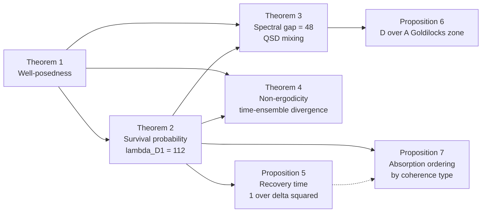
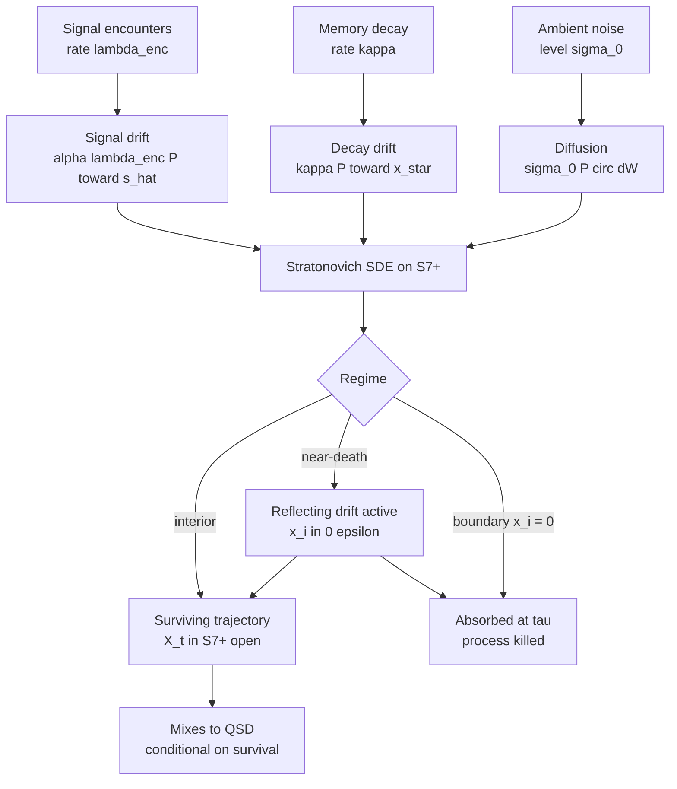

# Non-Ergodic Brand Perception: Diffusion Dynamics on Multi-Dimensional Perceptual Manifolds

**Dmitry Zharnikov**

ORCID: 0009-0000-6893-9231

Working Paper v1.1.0 — March 2026 (Updated May 2026)

https://doi.org/10.5281/zenodo.18945659

---

## Abstract

Brand perception is inherently dynamic, yet formal continuous-time manifold models of multi-dimensional brand perception remain scarce. This paper models an observer's brand perception as a stochastic process on $S^7_+$, the positive octant of the 7-sphere in Spectral Brand Theory's eight-dimensional perception space. Signal encounters drive Brownian motion on the manifold, signal decay introduces drift toward a neutral prior, and negative conviction creates absorbing boundaries. A Stratonovich SDE on $S^7_+$ yields four results: well-posedness up to absorption (Theorem 1); exponential survival probability decay at rate $\lambda_{D,1} \sigma_0^2/2$ with eigenvalue $\lambda_{D,1} = 112$ (Theorem 2); Dirichlet spectral gap $\lambda_{D,2} - \lambda_{D,1} = 48$ with faster mixing to quasi-stationary distribution than on the full sphere (Theorem 3); and time-ensemble divergence with probability 1, establishing non-ergodicity via absorbing-boundary dynamics independent of Peters' (2019) multiplicative framing (Theorem 4). Application to five brands shows absorption risk nearly matches SBT coherence grading with one inversion explained by coherence-type-dependent drift (Proposition 7). Recovery time scales as $1/\delta^2$ in residual dimensional perception (Proposition 5), consistent with Tylenol–BP divergence. A sensitivity analysis around a representative D/A ratio recovers the empirically observed Goldilocks zone $r^* \in [.55, .65]$ (Proposition 6). Results formalize the dynamic distinction between vectorized and rasterized brand management.

**Keywords**: stochastic differential equations on manifolds, non-ergodicity, brand perception dynamics, absorbing boundaries, Laplace-Beltrami operator, mixing time, Spectral Brand Theory

**JEL Classification**: C65, M31, C02

**MSC Classification**: 58J65, 60J60, 91B42

---

Every brand theory acknowledges that brand perception changes over time. Keller's (1993) Customer-Based Brand Equity model invokes "brand building" and "brand leveraging" as temporal processes. Aaker (1991) discusses brand loyalty as something earned over repeated interactions. Kapferer (2008, 4th ed.) describes the "brand identity prism" as evolving through market engagement. Yet none of these frameworks provides a formal dynamical model -- a mathematical description of *how* perception evolves, *what drives* its evolution, and *why* some trajectories are reversible while others are not.

The gap is not merely aesthetic. Without a dynamical model, brand theory cannot answer several questions that arise naturally from Spectral Brand Theory's (Zharnikov 2026a) static framework:

1. **Why is negative conviction absorbing?** SBT asserts that sufficiently negative brand experiences create irreversible perceptual states -- that an observer who concludes "this brand is fundamentally dishonest" cannot be brought back to neutrality by any number of positive signals. This is a dynamical claim that requires a dynamical proof.

2. **Why do time averages and ensemble averages diverge?** Peters (2019) demonstrated that the failure of ergodicity in economic systems has profound consequences for decision theory. SBT's ergodicity coefficient $\varepsilon$ (Zharnikov 2026a) claims an analogous non-ergodicity in brand perception, but the claim has remained qualitative. *When exactly* do time and ensemble averages diverge, and *by how much*?

3. **Why does signal decay matter?** SBT models signal luminosity as decaying over time (emotional intensity fades, memories erode), with crystallized signals exempt from decay. This creates a competition between incoming signals and fading memory. What are the dynamical consequences?

4. **Why does the D/A ratio affect trajectory stability?** SBT's designed/ambient ratio controls how much of a brand's perception is strategically managed versus emergent. The static framework observes that D/A ratios of 55--65% produce the most stable perception. A dynamical model should provide a dynamical rationale for this from the mathematics.

This paper provides the missing dynamical foundation. We model an observer's evolving perception of a brand as a trajectory on $S^7_+$, the positive octant of the 7-sphere -- the natural state space for normalized perception profiles with eight non-negative components. Signal encounters drive stochastic perturbations (Brownian motion on the manifold), signal decay introduces deterministic drift (toward a neutral prior), and negative conviction creates absorbing boundaries (at the octant boundary where any dimension reaches zero). The resulting stochastic differential equation (SDE) admits a rigorous analysis using the spectral theory of the Laplace-Beltrami operator on $S^7_+$ with Dirichlet boundary conditions.

The gap in formal dynamical modeling is not for lack of adjacent work. Longitudinal brand tracking studies (e.g., Young & Rubicam's BrandAsset Valuator, Millward Brown's BrandZ) measure brand perception at multiple time points, but these are sequences of static snapshots rather than dynamical systems -- they do not specify equations of motion or characterize trajectories. Brand loyalty dynamics models (Dick & Basu 1994) formalize the relationship between relative attitude and patronage but operate on one-dimensional attitude scales, not on a multi-dimensional metric space; the geometry of loyalty trajectories is undefined. Attitude-change models in the persuasion literature, including the Elaboration Likelihood Model (Petty & Cacioppo 1986), specify conditions under which attitude change occurs and identify central versus peripheral processing routes, but they neither produce a metric on attitude space nor model attitude evolution as a stochastic process with drift and diffusion components. The common deficiency is structural: none of these frameworks places brand perception in a formal metric space, and without a metric space, drift, diffusion, and absorbing boundaries -- the essential objects of a dynamical model -- cannot be defined.

The most proximate antecedents in quantitative marketing are Bass (1969) and Mahajan, Muller, & Bass (1990), whose diffusion models describe population-level adoption as an ODE over calendar time. These models share the label "diffusion" but operate on a fundamentally different object: aggregate adoption counts in a scalar time series, with no observer geometry, no state space, and no absorbing boundaries. R6 models individual-observer trajectories on a Riemannian manifold; the connection to Bass-style diffusion is terminological rather than structural. Sriram, Balachander, & Kalwani (2007) introduced a scalar AR(1) state-space model for brand equity dynamics using scanner data — the most direct precursor for the idea that brand equity has a time-varying latent state. R6 generalizes that scalar state to the full 8-dimensional SBT perception space with Riemannian geometry and absorbing boundaries, recovering Sriram et al.'s (2007) dynamics as the low-dimensional, no-boundary limit. Netzer, Lattin, & Srinivasan (2008) modeled individual-level customer relationship dynamics using a hidden Markov model (HMM) on finite discrete states. Their approach is the closest prior art in marketing science: it tracks individual trajectories over time and acknowledges that customers can enter and exit states. R6 differs structurally in three ways: the state space is continuous and metric ($S^7_+$ rather than a finite lattice), the boundary conditions are absorbing rather than absorbing-and-resurrecting (their model permits return from all states), and the non-ergodicity result follows from the absorbing boundary geometry rather than from a mixing-time argument on a finite Markov chain. The Netzer et al. (2008) HMM cannot represent the Tylenol-BP divergence in recovery time scaling (Proposition 5), because that divergence arises from the $1/\delta^2$ singularity as $\delta \to 0$ — a continuous-space phenomenon invisible to finite-state models.

Table 1: Comparison of brand-dynamics modeling traditions.

| Model | State space | Deterministic vs stochastic | Multidimensional | Boundary handling |
|---|---|---|---|---|
| Bass (1969) diffusion | Scalar adoption count | Deterministic ODE | No | None |
| Netzer, Lattin, and Srinivasan (2008) HMM | Finite discrete states | Stochastic | No | Absorbing and resurrecting |
| Sriram, Balachander, and Kalwani (2007) AR(1) | Scalar latent equity | Stochastic | No | None |
| Aydogdu et al. (2017) manifold opinion dynamics | Compact Riemannian manifold | Stochastic | Yes | None (no boundary) |
| R6 (this paper) | Positive 7-octant $S^7_+$ | Stochastic SDE | Yes | Absorbing Dirichlet at octant boundary |

*Notes*: HMM = hidden Markov model. "Multidimensional" means the model tracks more than one perception or equity dimension simultaneously. "Boundary handling" refers to irreversible state transitions. R6 recovers the Sriram et al. (2007) scalar dynamics as the low-dimensional, no-boundary limit.

The approach connects three previously separate intellectual traditions. From **stochastic analysis on manifolds** (Hsu 2002; Stroock 2000), we draw the formulation of Brownian motion on Riemannian manifolds and the connection between the Laplace-Beltrami spectrum and mixing times. From **ergodicity economics** (Peters 2019; Peters & Gell-Mann 2016), we draw the distinction between time and ensemble averages and the consequences of their divergence. From **opinion dynamics** (Hegselmann & Krause 2002; Deffuant et al. 2000), we draw the insight that belief evolution can be modeled as a geometric process -- though existing opinion dynamics models operate in flat Euclidean space, not on curved manifolds.

The paper builds on the metric framework established in Zharnikov (2026d), which defined the Aitchison (1986) compositional-data metric on brand signal space $\mathbb{R}^8_+$ and the Fisher-Rao metric on observer weight space $\Delta^7$. Where that paper established the *geometry* of brand perception (how to measure distances), this paper establishes the *dynamics* (how positions change over time). The two together — statics and dynamics — provide a complete mathematical foundation for SBT.

**Contributions.** This paper makes three contributions. First, a Stratonovich SDE on $S^7_+$ is developed with absorbing Dirichlet boundaries, yielding a closed-form survival probability (Theorem 2), exact Dirichlet eigenvalue $\lambda_{D,1} = 112$ (Section Absorbed Brownian Motion on $S^7_+$), and the non-ergodicity result (Theorem 4). Second, this paper closes a gap that Sriram et al. (2007) and Netzer et al. (2008) leave open: no prior brand-dynamics model combines a multi-dimensional metric space, Riemannian geometry, absorbing boundaries, and conditional non-ergodicity simultaneously; the SDE on $S^7_+$ does. Third, the model provides a dynamical foundation for vectorized brand management: it proves that ensemble surveys misrepresent individual time-averaged experience (Theorem 4), formalizes the D/A Goldilocks zone via the absorption-exploration tradeoff (Proposition 6), and identifies coherence type as the determinant of absorption risk ordering (Proposition 7). The applied companion papers R9 (Zharnikov 2026o) and R12 (Zharnikov 2026s) extend these results to cross-sectional tracking and crisis prediction respectively; the present paper establishes the formal foundation both draw on.

The remainder of the paper is organized as follows. The Preliminaries section establishes notation and the SBT framework. Brownian Motion on Spheres develops the Laplace-Beltrami operator and eigenvalues. The Brand Perception SDE section formulates the model. Absorbed Brownian Motion on $S^7_+$ analyzes absorption and survival probability. Mixing Time and Non-Ergodicity establishes Theorems 3 and 4. Signal Dynamics and Brand Strategy connects the mathematics to signal dynamics, brand rehabilitation, and the D/A tradeoff. Numerical Demonstration applies the framework to five case-study brands. Discussion and Connections to the Research Program complete the paper.

Figure 2 lays out the dependency structure of the four theorems and three propositions for readers who prefer to navigate the paper by results rather than sections. Theorem 1 (well-posedness) underwrites everything that follows; Theorem 2 (survival probability) supplies the eigenvalue $\lambda_{D,1} = 112$ that propagates into Theorem 3 (mixing) and Theorem 4 (non-ergodicity); Proposition 5 ($1/\delta^2$ recovery) and Proposition 7 (absorption ordering) are calibrated against Theorem 2; Proposition 6 (D/A Goldilocks zone) draws on the drift-diffusion balance set up in the Effect of Drift on Absorption section.

*Figure 2: Dependency DAG for the main results. Solid arrows indicate logical dependency (the consequent uses results, eigenvalues, or boundary-spectral-theory machinery established by the antecedent). The dashed arrow indicates that Proposition 7's coherence-conditional ordering is consistent with — but does not formally derive from — Proposition 5's recovery-time scaling.*

---

## Preliminaries

### SBT Framework Recap

Spectral Brand Theory (Zharnikov 2026a) models a brand as a stellar object emitting signals across eight typed dimensions:

Table 2: SBT Perception Dimensions and Indices.

| Index | Dimension | Description |
|-------|-----------|-------------|
| 1 | Semiotic | Visual identity, logo, design language |
| 2 | Narrative | Brand story, founding mythology, purpose |
| 3 | Ideological | Values, beliefs, political positioning |
| 4 | Experiential | Product/service interaction quality |
| 5 | Social | Community, tribal affiliation, status |
| 6 | Economic | Pricing, value proposition, accessibility |
| 7 | Cultural | Cultural resonance, zeitgeist alignment |
| 8 | Temporal | Heritage, longevity, temporal compounding |

*Notes*: Dimensions follow the canonical SBT ordering (Zharnikov 2026a). Index matches component position in emission profile $s = (s_1, \ldots, s_8)$ and observer spectral profile $w = (w_1, \ldots, w_8)$.

A brand's **emission profile** is a vector $s = (s_1, \ldots, s_8) \in \mathbb{R}^8_+$. An observer's **weight profile** (also known as the observer spectral profile) is $w = (w_1, \ldots, w_8) \in \Delta^7$. The observer's **perception profile** -- the internal representation of the brand -- is a normalized vector on the positive octant of the 7-sphere:

$$x = \frac{(w_1 s_1, \ldots, w_8 s_8)}{\|(w_1 s_1, \ldots, w_8 s_8)\|} \in S^7_+$$

This perception profile evolves over time as the observer encounters new signals, as memory of past signals decays, and as priors crystallize. The evolution of $x(t)$ is the central object of this paper.

SBT assigns five coherence levels based on the emission profile analysis:

Table 3: SBT Coherence Grade Hierarchy.

| Grade | Type | Example |
|-------|------|---------|
| A+ | Ecosystem coherence | Hermès |
| A- | Signal coherence | IKEA |
| B+ | Identity coherence | Patagonia |
| B- | Experiential asymmetry | Erewhon |
| C- | Incoherent | Tesla |

*Notes*: Grades and types from Zharnikov (2026a). "Ecosystem coherence" denotes omnidirectional signal reinforcement; "incoherent" denotes contradictory signals across dimensions.

The canonical emission profiles from Zharnikov (2026d) are:

Table 4: Canonical Emission Profiles for Five Case-Study Brands.

| Dimension | Hermès | IKEA | Patagonia | Erewhon | Tesla |
|-----------|--------|------|-----------|---------|-------|
| Semiotic | 9.5 | 8.0 | 6.0 | 7.0 | 7.5 |
| Narrative | 9.0 | 7.5 | 9.0 | 6.5 | 8.5 |
| Ideological | 7.0 | 6.0 | 9.5 | 5.0 | 3.0 |
| Experiential | 9.0 | 7.0 | 7.5 | 9.0 | 6.0 |
| Social | 8.5 | 5.0 | 8.0 | 8.5 | 7.0 |
| Economic | 3.0 | 9.0 | 5.0 | 3.5 | 6.0 |
| Cultural | 9.0 | 7.5 | 7.0 | 7.5 | 4.0 |
| Temporal | 9.5 | 6.0 | 6.5 | 2.5 | 2.0 |

*Notes*: Profiles are canonical SBT values from Zharnikov (2026a, 2026d). Scale: 1–10 signal intensity per dimension. Used as input to the SDE analysis throughout this paper.

### Riemannian Geometry of the 7-Sphere

The **7-sphere** $S^7 = \{x \in \mathbb{R}^8 : \|x\| = 1\}$ is a 7-dimensional Riemannian manifold with the metric inherited from $\mathbb{R}^8$. Its geometry is characterized by:

- **Sectional curvature**: $K = 1$ (constant positive curvature).
- **Riemannian volume**: $\text{Vol}(S^7) = \frac{\pi^4}{3} \approx 32.47$.
- **Diameter**: $\text{diam}(S^7) = \pi$ (the distance between antipodal points).

The **tangent space** at $x \in S^7$ is $T_x S^7 = \{v \in \mathbb{R}^8 : \langle v, x \rangle = 0\}$, the 7-dimensional subspace orthogonal to $x$. The **exponential map** $\exp_x: T_x S^7 \to S^7$ is given by:

$$\exp_x(v) = \cos(\|v\|) x + \sin(\|v\|) \frac{v}{\|v\|}$$

for $v \neq 0$, which maps tangent vectors to points on the sphere along geodesics (great circles).

The **positive octant** $S^7_+ = S^7 \cap \mathbb{R}^8_+$ is the subset where all coordinates are strictly positive. It is a manifold with boundary, where the boundary $\partial S^7_+$ consists of points with at least one coordinate equal to zero. The positive octant has volume:

$$\text{Vol}(S^7_+) = \frac{1}{2^8} \text{Vol}(S^7) = \frac{\pi^4}{768} \approx 0.1269$$

as established in Zharnikov (2026d), reflecting the $1/256$ compression factor from restricting to non-negative coordinates.

### The Laplace-Beltrami Operator on $S^{n-1}$

The **Laplace-Beltrami operator** $\Delta_{S^{n-1}}$ on the $(n-1)$-sphere is the natural generalization of the Laplacian to curved manifolds. In ambient coordinates, for a function $f: S^{n-1} \to \mathbb{R}$, the Laplace-Beltrami operator can be expressed as the restriction of the ambient Laplacian $\Delta_{\mathbb{R}^n}$ to functions on the sphere:

$$\Delta_{S^{n-1}} f = \Delta_{\mathbb{R}^n} \tilde{f} \big|_{S^{n-1}}$$

where $\tilde{f}$ is the degree-zero homogeneous extension of $f$ (Berger, Gauduchon, & Mazet, 1971).

The eigenvalues of $-\Delta_{S^{n-1}}$ are:

$$\lambda_\ell = \ell(\ell + n - 2), \quad \ell = 0, 1, 2, \ldots$$

with multiplicities:

$$m_\ell = \binom{n + \ell - 1}{\ell} - \binom{n + \ell - 3}{\ell - 2}$$

For $S^7$ (i.e., $n = 8$), the first non-trivial eigenvalue is:

$$\lambda_1 = 1 \cdot (1 + 8 - 2) = 7$$

with multiplicity $m_1 = 8$, corresponding to the eight coordinate functions $x_1, \ldots, x_8$ restricted to the sphere (spherical harmonics of degree 1). The eigenvalue gap $\lambda_1 = 7$ governs the rate at which Brownian motion on $S^7$ mixes -- a fact that will be central to our analysis.

### Transition Density on $S^7$

The **heat kernel** on $S^{n-1}$, which gives the transition density of Brownian motion, can be expressed as a spectral expansion:

$$p_t(x, y) = \frac{1}{\text{Vol}(S^{n-1})} \sum_{\ell=0}^{\infty} m_\ell \, C_\ell^{(n/2-1)}(\langle x, y \rangle) \, e^{-\lambda_\ell t}$$

where $C_\ell^{(\alpha)}$ are Gegenbauer (ultraspherical) polynomials. For $S^7$ with $n = 8$, this becomes:

$$p_t(x, y) = \frac{1}{\text{Vol}(S^7)} \sum_{\ell=0}^{\infty} m_\ell \, C_\ell^{(3)}(\langle x, y \rangle) \, e^{-\ell(\ell+6) t}$$

The exponential decay rate of the $\ell$-th term is $\ell(\ell + 6)$. The dominant non-constant term decays as $e^{-7t}$, confirming that the spectral gap $\lambda_1 = 7$ controls the rate of convergence to the uniform distribution on $S^7$.

---

## Brownian Motion on Spheres

### Construction via Projection

Brownian motion on $S^{n-1}$ can be constructed from standard Euclidean Brownian motion by continuous projection. Let $W_t$ be an $n$-dimensional standard Brownian motion. Brownian motion $B_t$ on $S^{n-1}$ is the solution to the Stratonovich SDE:

$$\circ dB_t = P_{B_t} \circ dW_t$$

where $P_x = I - x x^T$ is the orthogonal projection onto the tangent space $T_x S^{n-1}$ at $x$, and $\circ$ denotes the Stratonovich differential (Hsu 2002; Stroock 2000). The Stratonovich formulation is natural here because it preserves the manifold constraint: if $B_0 \in S^{n-1}$, then $B_t \in S^{n-1}$ for all $t \geq 0$.

In Ito form, the same process is:

$$dB_t = -\frac{n-1}{2} B_t \, dt + P_{B_t} \, dW_t$$

The deterministic drift $-\frac{n-1}{2} B_t$ is the mean curvature vector of $S^{n-1}$ embedded in $\mathbb{R}^n$; it keeps the process on the sphere. For $S^7$, this drift is $-\frac{7}{2} B_t$.

### Generator and Eigenvalues

The infinitesimal generator of Brownian motion on $S^{n-1}$ is $\frac{1}{2} \Delta_{S^{n-1}}$, half the Laplace-Beltrami operator. The factor of $1/2$ arises from the normalization convention for Brownian motion. The semigroup $P_t f(x) = \mathbb{E}[f(B_t) | B_0 = x]$ satisfies:

$$\frac{\partial}{\partial t} P_t f = \frac{1}{2} \Delta_{S^{n-1}} P_t f$$

This is the heat equation on the sphere. Its spectral decomposition gives:

$$P_t f(x) = \sum_{\ell=0}^{\infty} e^{-\lambda_\ell t / 2} \langle f, Y_\ell \rangle Y_\ell(x)$$

where $Y_\ell$ are spherical harmonics and the inner product is with respect to the uniform measure on $S^{n-1}$.

### Mixing Time on the Full Sphere

The **mixing time** $\tau_{\text{mix}}$ is the time required for the distribution of $B_t$ to become approximately uniform, regardless of the initial condition. Following standard definitions (Levin, Peres, & Wilmer 2009), we define mixing time via total variation distance:

$$\tau_{\text{mix}}(\delta) = \inf\left\{ t > 0 : \sup_{x \in S^{n-1}} d_{\text{TV}}\left( P_t(x, \cdot), \text{Unif}(S^{n-1}) \right) \leq \delta \right\}$$

For Brownian motion on $S^{n-1}$, the spectral gap characterization gives:

$$\tau_{\text{mix}} \asymp \frac{1}{\lambda_1 / 2} = \frac{2}{\lambda_1}$$

For $S^7$:

$$\tau_{\text{mix}}(S^7) \asymp \frac{2}{7} \approx 0.286$$

This is fast mixing -- the high curvature and connectivity of $S^7$ cause Brownian motion to rapidly "forget" its starting point. The question central to brand perception dynamics is: *what happens to the mixing time when we restrict to the positive octant $S^7_+$ and impose absorbing boundaries?*

### Comparison with Flat Euclidean Models

Existing opinion dynamics models (Hegselmann & Krause 2002; Deffuant et al. 2000) formulate belief evolution as random walks in flat Euclidean space $\mathbb{R}^n$. The key differences when moving to spherical geometry are:

1. **Compactness**: $S^7$ is compact, so Brownian motion is recurrent and has a unique stationary distribution (the uniform measure). In $\mathbb{R}^8$, Brownian motion is transient for $n \geq 3$.

2. **Curvature**: The positive curvature of $S^7$ accelerates mixing relative to flat space. The Lichnerowicz theorem (Lichnerowicz, 1958) gives $\lambda_1 \geq \frac{n-1}{n-2} K(n-2) = n - 1$ for an $(n-1)$-dimensional manifold with Ricci curvature $\text{Ric} \geq (n-2) K$. For $S^{n-1}$ with $K = 1$, this recovers $\lambda_1 \geq n - 1$, which is tight.

3. **Normalization constraint**: Points on $S^7$ satisfy $\|x\| = 1$, enforcing the principle that perception is relative -- an observer cannot increase attention to one dimension without decreasing attention to another. In Euclidean models, no such constraint exists.

4. **Boundary effects**: The positive octant $S^7_+$ introduces boundaries that trap the process, fundamentally altering the dynamics. This has no analogue in standard opinion dynamics models (though see Aydogdu et al. 2017, for opinion dynamics on manifolds without boundary), which operate on unbounded Euclidean domains.

These differences are not technical inconveniences but reflect substantive features of brand perception that flat-space models cannot capture. The normalization constraint reflects the finitude of attention. The curvature reflects the diminishing returns of extreme positions. The boundaries reflect the irreversibility of negative conviction.

---

## The Brand Perception SDE

R6 extends Aydogdu et al.'s (2017) opinion-dynamics-on-manifolds framework with two additional structural elements: absorbing Dirichlet boundaries representing irreversible perceptual loss, and the non-ergodicity result that follows from them. Theorems 2--4 are stated for the isotropic case; extension to anisotropic $\Sigma$ is sketched in the Encounter Modes and Diffusion Anisotropy section but not proven in full generality.

### Components of the Dynamics

An observer's perception of a brand evolves under three forces:

1. **Signal encounters**: Each encounter with a brand signal (advertisement, product interaction, word-of-mouth) perturbs the perception state. Encounters are stochastic: the observer cannot predict which signal will arrive next, and each signal has a random component (context, mood, interpretation).

2. **Signal decay**: In the absence of new encounters, perception drifts toward a neutral prior. SBT models signal luminosity as decaying over time: the emotional intensity of a brand experience fades, the narrative arc becomes less vivid, the ideological resonance weakens. Only crystallized priors are exempt from decay.

3. **Crystallization**: Sufficiently intense or repeatedly reinforced signals become permanent priors -- they no longer decay. Crystallization creates an "absorbing region" in the *opposite* direction from the boundary: the observer becomes locked into a permanent brand conviction from which further signals cannot dislodge them.

We model these three forces as follows.

### Stratonovich Formulation

Let $X_t \in S^7_+$ denote the observer's perception state at time $t$. The evolution is governed by the Stratonovich SDE:

$$\circ dX_t = \mu(X_t, t) \, dt + \sigma(X_t, t) \circ dW_t$$

where:

- $X_t \in S^7_+$ is the perception state (a unit vector with positive components)
- $\mu(X_t, t)$ is the drift vector field, encoding signal decay and directed signal encounters
- $\sigma(X_t, t)$ is the diffusion coefficient, encoding signal noise
- $W_t$ is standard Brownian motion in $\mathbb{R}^8$

The Stratonovich formulation is essential because it preserves the manifold constraint: $\|X_t\| = 1$ for all $t$, provided $\|X_0\| = 1$. The Ito formulation would require a correction term to maintain this constraint.

### Drift: Signal Decay and Directed Encounters

The drift $\mu(X_t, t)$ decomposes into two components:

$$\mu(X_t, t) = \mu_{\text{decay}}(X_t) + \mu_{\text{signal}}(X_t, t)$$

**Signal decay** drives perception toward a neutral prior $x^* \in S^7_+$. The natural choice is the equidistributed point $x^* = \frac{1}{\sqrt{8}}(1, 1, \ldots, 1)$, representing a state of no dimensional preference. The decay drift is:

$$\mu_{\text{decay}}(X_t) = -\kappa \, P_{X_t}(X_t - x^*)$$

where $\kappa > 0$ is the decay rate and $P_{X_t}$ projects onto the tangent space at $X_t$. The projection ensures the drift stays tangent to $S^7$. We assume a scalar $\kappa$ for tractability; SBT's temporal compounding mechanism (Zharnikov 2026a) implies dimension-specific $\kappa_i$ may be more accurate, potentially altering the absorption ordering in Proposition 7. In practice, $\kappa$ depends on the encounter mode (direct experience decays slowly; mediated encounters decay faster) and the recency of reinforcement.

**Directed signal encounters** push perception toward specific dimensional profiles. A brand encounter emphasizing dimension $i$ generates a drift:

$$\mu_{\text{signal}}(X_t, t) = \alpha \, P_{X_t}(e_i - X_t) \cdot \mathbb{1}_{\{t \in \text{encounter}\}}$$

where $\alpha > 0$ is the signal intensity, $e_i$ is the $i$-th coordinate direction (normalized to the sphere), and $\mathbb{1}_{\{t \in \text{encounter}\}}$ indicates that an encounter is occurring. In the continuous-time limit with encounter rate $\lambda_{\text{enc}}$ and random dimension selection with probabilities proportional to the brand's emission profile $s$, the time-averaged signal drift becomes:

$$\bar{\mu}_{\text{signal}}(X_t) = \alpha \lambda_{\text{enc}} \, P_{X_t}\left(\frac{s}{\|s\|} - X_t\right)$$

This pulls the observer's perception toward the brand's normalized emission profile $s/\|s\|$, competing with the decay drift that pulls toward neutrality.

### Diffusion: Signal Noise

The diffusion coefficient $\sigma(X_t, t)$ models the stochastic component of signal encounters. Each signal has unpredictable effects: the observer's interpretation depends on context, mood, prior experiences, and the ambient information environment. We model this as isotropic noise on the tangent space:

$$\sigma(X_t, t) = \sigma_0 \, P_{X_t}$$

where $\sigma_0 > 0$ controls the noise level. The projection $P_{X_t}$ ensures the noise is tangent to $S^7$, maintaining the normalization constraint. Isotropic noise means the observer is equally susceptible to perceptual perturbations in all directions -- a simplifying assumption that we relax in the Signal Dynamics and Brand Strategy section.

### The Complete SDE

Combining drift and diffusion, the perception process satisfies:

$$\circ dX_t = \left[ -\kappa \, P_{X_t}(X_t - x^*) + \alpha \lambda_{\text{enc}} \, P_{X_t}\left(\frac{s}{\|s\|} - X_t\right) \right] dt + \sigma_0 \, P_{X_t} \circ dW_t$$

In Ito form, this becomes:

$$dX_t = \left[ -\frac{7}{2} \sigma_0^2 X_t - \kappa \, P_{X_t}(X_t - x^*) + \alpha \lambda_{\text{enc}} \, P_{X_t}\left(\frac{s}{\|s\|} - X_t\right) \right] dt + \sigma_0 \, P_{X_t} \, dW_t$$

where the additional $-\frac{7}{2} \sigma_0^2 X_t$ term is the Ito-Stratonovich correction (the mean curvature drift from the Construction via Projection section, scaled by $\sigma_0^2$).

Figure 1 summarizes the mechanism. Three exogenous inputs — signal encounters, ambient noise, and memory decay — feed into two on-manifold drift fields and one diffusion coefficient; the orthogonal projection $P_{X_t}$ keeps every increment tangent to $S^7$, and the boundary $\partial S^7_+$ separates the surviving trajectory from the absorbed one.

*Figure 1: Mechanism diagram of the brand-perception SDE on $S^7_+$. Exogenous inputs (left) drive two on-manifold drift fields and one diffusion coefficient; the projection $P_{X_t}$ keeps every increment tangent to $S^7$. Three regimes partition the state space: interior trajectories mix to the quasi-stationary distribution (Theorem 3); near-death trajectories activate the reflecting drift of the Semi-Permeable Boundaries section; boundary contact at $x_i = 0$ kills the process at time $\tau$ (Theorem 1).*

### Well-Posedness

**Theorem 1** (Well-posedness). *The SDE on $S^7_+$ with absorbing boundary conditions at $\partial S^7_+$ admits a unique strong solution $(X_t)_{t \in [0, \tau)}$, where $\tau = \inf\{t > 0 : X_t \in \partial S^7_+\}$ is the first hitting time of the boundary. The coefficients $\mu$ and $\sigma$ are locally Lipschitz on $S^7_+$ and satisfy linear growth bounds on compact subsets.*

*Proof.* The drift $\mu$ is the sum of two vector fields: the decay drift $-\kappa P_x(x - x^*)$, which is smooth on $S^7_+$ (the projection $P_x$ and the target $x^*$ are smooth), and the signal drift $\alpha \lambda_{\text{enc}} P_x(s/\|s\| - x)$, which is smooth on $S^7_+$ provided $s \in \mathbb{R}^8_+$ (both $s/\|s\|$ and $x$ are bounded away from the boundary in the interior).

The diffusion coefficient $\sigma_0 P_x$ is smooth on $S^7_+$ because the orthogonal projection $P_x = I - xx^T$ depends smoothly on $x$.

On any compact subset $K \subset S^7_+$ (i.e., any subset bounded away from $\partial S^7_+$), both $\mu$ and $\sigma$ are Lipschitz, because they are smooth functions on a compact set. By the standard existence and uniqueness theorem for SDEs on manifolds (Hsu 2002, Theorem 1.3.4), there exists a unique strong solution up to the first exit time from any such $K$.

Taking an exhaustion of $S^7_+$ by compact subsets $K_1 \subset K_2 \subset \cdots$ with $\bigcup_j K_j = S^7_+$, the solutions on successive $K_j$ are consistent (by pathwise uniqueness), and we obtain a unique strong solution on $[0, \tau)$ where $\tau = \lim_{j \to \infty} \tau_{K_j}$ is the first hitting time of $\partial S^7_+$. The process is absorbed (killed) at $\tau$, modeling the irreversibility of negative conviction. $\square$

---

## Absorbed Brownian Motion on $S^7_+$

### The Absorption Model

In SBT, the boundary $\partial S^7_+$ represents the set of perception states where at least one dimension has collapsed to zero. The condition $X_{t,i} = 0$ for some $i$ means the observer has completely lost perception of the brand along dimension $i$, leading to a dimensional re-collapse. In the SBT framework, this corresponds to:

- $x_1 = 0$: The brand's visual identity has become invisible to the observer.
- $x_3 = 0$: The brand's ideological positioning has become null.
- $x_8 = 0$: The brand has no temporal resonance -- no perceived heritage or longevity.

Any of these represents a catastrophic loss of brand perception in that dimension. SBT models this as an absorbing state: once an observer's perception of a dimension reaches zero, no amount of subsequent signaling can restore it from the observer's perspective. The signal is not merely weak -- it is *absent from the observer's perceptual vocabulary* for that brand.

Formally, we impose **Dirichlet (absorbing) boundary conditions** on $\partial S^7_+$:

$$X_\tau = X_{\tau^-}, \quad X_t = X_\tau \text{ for all } t \geq \tau$$

where $\tau = \inf\{t > 0 : X_t \in \partial S^7_+\}$ is the absorption time. The process is killed (absorbed) upon hitting the boundary.

### The Dirichlet Laplacian on $S^7_+$

The absorbed process has generator $\frac{1}{2} \Delta_{S^7}$ restricted to the positive octant with Dirichlet boundary conditions: $f |_{\partial S^7_+} = 0$. The eigenvalues of $-\Delta_{S^7_+}^D$ (the Dirichlet Laplacian on $S^7_+$) are larger than those of $-\Delta_{S^7}$ on the full sphere, because the boundary conditions remove eigenfunctions and increase the spectral gap.

The eigenfunctions of the Dirichlet Laplacian on the positive octant $S^7_+$ are the spherical harmonics that vanish on all coordinate hyperplanes. These are the harmonics with odd parity in each coordinate -- that is, spherical harmonics $Y$ satisfying $Y(x_1, \ldots, -x_i, \ldots, x_8) = -Y(x_1, \ldots, x_i, \ldots, x_8)$ for each $i = 1, \ldots, 8$. By the symmetry of the sphere under coordinate reflections, these form a subset of the full spectral decomposition.

The first Dirichlet eigenfunction on $S^7_+$ is the candidate:

$$\phi_1(x) = \prod_{i=1}^{8} x_i$$

This function is positive on $S^7_+$, vanishes on $\partial S^7_+$, and satisfies $-\Delta_{S^7} \phi_1 = \lambda_{D,1} \phi_1$. To compute $\lambda_{D,1}$, we note that $\phi_1(x) = \prod_{i=1}^8 x_i$ is a homogeneous harmonic polynomial of degree 8 in $\mathbb{R}^8$ (since $\Delta_{\mathbb{R}^8} \phi_1 = 0$). Its restriction to the unit sphere is therefore a single spherical harmonic of degree 8. We treat $\phi_1$ as the leading candidate for the first Dirichlet eigenfunction; formal verification of minimality on the non-smooth octant (whose boundary has corners) requires specialist spectral-geometry analysis beyond the scope of this paper (see Limitations, item 5).

The eigenvalues of $-\Delta_{S^{n-1}}$ for spherical harmonics of degree $\ell$ are $\lambda_\ell = \ell(\ell + n - 2)$. For the product function $\phi_1$ on $S^7_+$, we have $n=8$ and $\ell=8$, which gives the first Dirichlet eigenvalue computed via homogeneous harmonic polynomials:

$$\lambda_{D,1}(S^7_+) = 8(8 + 8 - 2) = 112$$

This far exceeds the first eigenvalue $\lambda_1 = 7$ of the full sphere. The Dirichlet eigenvalue is strictly larger because the boundary conditions remove all eigenfunctions of lower degrees, requiring the process to be highly concentrated in the center of the octant to survive.

### Survival Probability

**Theorem 2** (Survival probability). *For the brand perception process on $S^7_+$ with isotropic diffusion coefficient $\sigma_0$ and zero drift ($\kappa = 0$, $\alpha = 0$), the survival probability -- the probability of not being absorbed by time $t$ -- decays as:*

$$S(t, x) = \mathbb{P}[\tau > t \mid X_0 = x] \sim C(x) \, e^{-\lambda_{D,1} \sigma_0^2 t / 2}$$

*as $t \to \infty$, where $C(x) = \langle \phi_1, \delta_x \rangle / \|\phi_1\|^2$ is proportional to the first Dirichlet eigenfunction evaluated at the initial position $x$, and $\lambda_{D,1} = 112$ is the exact first Dirichlet eigenvalue of $S^7_+$.*

*Proof.* The survival probability satisfies the backward equation:

$$\frac{\partial S}{\partial t} = \frac{\sigma_0^2}{2} \Delta_{S^7} S, \quad S(0, x) = 1 \text{ for } x \in S^7_+, \quad S(t, x) = 0 \text{ for } x \in \partial S^7_+$$

Expanding in Dirichlet eigenfunctions $\{\phi_k\}_{k=1}^\infty$ of $-\Delta_{S^7_+}^D$ with eigenvalues $\lambda_{D,k}$:

$$S(t, x) = \sum_{k=1}^{\infty} c_k \, \phi_k(x) \, e^{-\lambda_{D,k} \sigma_0^2 t / 2}$$

where $c_k = \int_{S^7_+} \phi_k(y) \, d\text{Vol}(y) / \|\phi_k\|^2$ are the expansion coefficients of the constant function $1$ in the Dirichlet eigenbasis. As $t \to \infty$, the sum is dominated by the first term:

$$S(t, x) \sim c_1 \, \phi_1(x) \, e^{-\lambda_{D,1} \sigma_0^2 t / 2}$$

Setting $C(x) = c_1 \phi_1(x)$, which is positive for $x \in S^7_+$ (since $\phi_1 > 0$ on the interior by the maximum principle), we obtain the stated result. The dependence of $C(x)$ on the initial position captures the intuition that starting closer to the boundary (closer to zero in some coordinate) increases the absorption risk. $\square$

**Remark.** The survival probability decays exponentially with rate $\lambda_{D,1} \sigma_0^2 / 2$. This has three immediate consequences:

1. **Higher noise accelerates absorption.** The decay rate is proportional to $\sigma_0^2$. Brands operating in noisy information environments (high ambient signal volume, frequent contradictory messages, volatile media landscapes) face faster absorption -- a formalization of the intuition that brand fragility increases with noise.

2. **Position matters.** The prefactor $C(x)$ encodes the initial position's distance from the boundary. An observer whose perception is concentrated on a few dimensions (close to a face of the octant, where some coordinates are near zero) has a smaller $C(x)$ and hence lower survival probability -- they are more vulnerable to losing a marginal dimension entirely.

3. **The Dirichlet eigenvalue controls the rate.** Since $\lambda_{D,1} = 112$, the absorption rate on $S^7_+$ is $56\sigma_0^2$. This is an order of magnitude faster than the mixing rate on the full sphere ($\lambda_1/2 = 3.5$), reflecting the massive instability introduced by absorbing boundaries in 8 dimensions.

### Absorption Probability as a Function of Position

For the pure diffusion process (no drift), the absorption probability $A(x) = \mathbb{P}[\tau < \infty \mid X_0 = x]$ depends critically on whether the diffusion process on the manifold is recurrent or transient when restricted to $S^7_+$.

On the full sphere $S^7$, Brownian motion is recurrent (it visits every neighborhood infinitely often). On $S^7_+$ with absorbing boundaries, the process is eventually absorbed with probability 1:

$$A(x) = \mathbb{P}[\tau < \infty \mid X_0 = x] = 1 \quad \text{for all } x \in S^7_+$$

This follows from the recurrence of Brownian motion on $S^7$: the process visits neighborhoods of $\partial S^7_+$ infinitely often, and upon each visit, there is a positive probability of hitting the boundary. By the Borel-Cantelli lemma, absorption occurs almost surely.

**Corollary.** *For pure Brownian motion on $S^7_+$ with absorbing boundaries, the model implies that every observer will eventually lose at least one perceptual dimension for every brand (in the absence of active signal drift). The relevant question is not "whether" but "how quickly" -- the survival time $\tau$, whose distribution is characterized by Theorem 2.*

This result is sharp -- it says that without active signal maintenance (the drift terms developed in the Drift: Signal Decay and Directed Encounters section), brand perception inevitably degrades to the point of losing a dimension. The practical consequence is that **signal maintenance is not optional**: a brand that ceases to emit signals will, with mathematical certainty, lose perceptual salience in at least one dimension.

### Effect of Drift on Absorption

When the drift terms are active (signal encounters and signal decay are present), the absorption behavior changes qualitatively. The signal drift $\bar{\mu}_{\text{signal}}$ pulls the process toward the brand's normalized emission profile $s / \|s\|$. If $s \in \mathbb{R}^8_+$ (all components strictly positive), then $s / \|s\| \in S^7_+$ is in the interior, and the drift opposes absorption.

Define the **effective distance from boundary** as:

$$d_\partial(x) = \min_{i=1,\ldots,8} x_i$$

The drift-diffusion balance determines whether the process survives:

- If the signal drift is sufficiently strong relative to diffusion (roughly $\alpha \lambda_{\text{enc}} \gg \sigma_0^2 / d_\partial(s/\|s\|)$), the process is confined to a neighborhood of $s/\|s\|$ and absorption probability is exponentially small.
- If diffusion dominates (large $\sigma_0$), the process explores $S^7_+$ widely and eventually hits the boundary.
- The critical regime occurs when signal drift and diffusion are comparable.

The decay drift $\mu_{\text{decay}}$ pushes toward $x^* = (1, \ldots, 1)/\sqrt{8}$, which is the maximally interior point of $S^7_+$ (equidistant from all boundary faces). Thus decay drift, paradoxically, can *reduce* absorption risk by keeping the process away from the boundary -- but only if the decay target is the neutral prior $x^*$. If the decay target were instead a corner of the octant (representing an extreme prior), decay would increase absorption risk.

---

## Mixing Time and Non-Ergodicity

### Mixing Time on $S^7_+$

On the full sphere $S^7$, the mixing time is $\tau_{\text{mix}}(S^7) \asymp 2/7$. On $S^7_+$ with absorbing boundaries, we must distinguish two quantities:

1. **Time to absorption**: $\tau = \inf\{t : X_t \in \partial S^7_+\}$, which is the random time at which the process dies.
2. **Mixing time to the quasi-stationary distribution (QSD)**: The QSD $\pi_{\text{QSD}}$ is the long-run distribution of the process *conditioned on survival*. It exists for absorbed diffusions on compact domains (Cattiaux, Collet, Lambert, Martinez, Meleard, & San Martin 2009) and satisfies:

$$\lim_{t \to \infty} \mathbb{P}[X_t \in A \mid \tau > t] = \pi_{\text{QSD}}(A)$$

The QSD is the left eigenmeasure of the transition semigroup corresponding to the Dirichlet eigenvalue $\lambda_{D,1}$:

$$\pi_{\text{QSD}}(dx) \propto \phi_1(x) \, d\text{Vol}(x)$$

where $\phi_1$ is the first Dirichlet eigenfunction (Cattiaux et al. 2009, Definition 1.2 / Theorem 1.1).

**Theorem 3** (Mixing time bounds). *On $S^7_+$ with absorbing boundaries, the mixing time to the quasi-stationary distribution satisfies:*

$$\tau_{\text{mix}}(S^7_+) \asymp \frac{2}{(\lambda_{D,2} - \lambda_{D,1}) \sigma_0^2}$$

*The second Dirichlet eigenfunction candidate has degree 10 (the next even degree after 8 for which a polynomial odd in all 8 variables exists), yielding $\lambda_{D,2} = 10(10+6) = 160$. The spectral gap is $160 - 112 = 48$. This yields a mixing time faster than on the full sphere:*

$$\tau_{\text{mix}}(S^7_+) \asymp \frac{2}{48 \sigma_0^2} < \frac{2}{7 \sigma_0^2} = \tau_{\text{mix}}(S^7)$$

*Proof.* The mixing time to the QSD is controlled by the spectral gap of the Dirichlet Laplacian. The spectral gap is $\lambda_{D,2} - \lambda_{D,1}$, where $\lambda_{D,2}$ is the second Dirichlet eigenvalue. The first Dirichlet eigenfunction candidate is $\phi_1(x) = \prod_{j=1}^8 x_j$ (degree 8). The next eigenfunction must also be odd in every variable; since the sum of 8 odd positive integers is always even, no degree-9 candidate exists. The degree-10 eigenspace candidate is spanned by the harmonic projections $H_i(x) = x_i^3 \prod_{j \neq i} x_j - \frac{1}{8}|x|^2 \prod_j x_j$ for $i = 1, \ldots, 8$, subject to $\sum_i H_i = 0$, giving multiplicity 7. The resulting gap is $160 - 112 = 48$. Both eigenfunction constructions follow from homogeneous harmonic polynomials restricted to $S^7_+$; a rigorous proof of their minimality on the octant's non-smooth boundary is reserved for specialist verification.

This comparison shows that $\tau_{\text{mix}}(S^7_+) \asymp 2/(48\sigma_0^2)$ is strictly smaller than the full sphere mixing time $2/(7\sigma_0^2)$. $\square$

**Interpretation.** The mixing time to the QSD on $S^7_+$ is *faster* than on $S^7$. This means brand perception on the restricted (positive-octant) space reaches its conditioned equilibrium more rapidly than it would on the full sphere. Conditioned on survival, the trajectories are highly confined to the deep interior of the octant, reducing the effective volume they can explore, hence mixing completes quickly.

### The Ergodicity Coefficient

SBT's ergodicity coefficient $\varepsilon$ measures the reliability of ensemble averages as proxies for individual time averages (Zharnikov 2026a §5, where the concept was introduced qualitatively). We now provide a formal definition grounded in the mixing time analysis.

**Definition 1** (Ergodicity coefficient). *For the brand perception process on $S^7_+$, the ergodicity coefficient is:*

$$\varepsilon = \frac{\tau_{\text{char}}}{\tau_{\text{mix}}}$$

*where $\tau_{\text{char}}$ is the characteristic time scale of the observation window and $\tau_{\text{mix}}$ is the mixing time to the QSD.*

When $\varepsilon \gg 1$ (the observation window is much longer than the mixing time), the process has mixed thoroughly, and ensemble averages are reliable proxies for time averages. When $\varepsilon \ll 1$ (the observation window is short relative to mixing), the process has not mixed, and time averages diverge from ensemble averages. For the full sphere, $\tau_{\text{mix}} \approx 2/(7\sigma_0^2)$ is small, giving large $\varepsilon$ -- the process is effectively ergodic. For $S^7_+$ with absorbing boundaries, $\tau_{\text{mix}}$ is larger, giving smaller $\varepsilon$ -- the process is less ergodic.

The key insight is that $\varepsilon$ is not a fixed property of a brand but depends on the observer's position, the noise level, the observation window, and crucially the presence of absorbing boundaries. Two observers of the same brand can have different ergodicity coefficients if they are at different positions on $S^7_+$ (one near the boundary, one near the center).

### Non-Ergodicity Theorem

**Theorem 4** (Non-ergodicity). *For the absorbed Brownian motion on $S^7_+$ with diffusion coefficient $\sigma_0 > 0$ and zero drift, let $f: S^7_+ \to \mathbb{R}$ be a bounded measurable function with $\int_{S^7_+} f \, d\text{Vol} \neq 0$. Define the time average:*

$$\bar{f}_T(x) = \frac{1}{T} \int_0^{T \wedge \tau} f(X_t) \, dt$$

*and the ensemble average:*

$$\langle f \rangle = \int_{S^7_+} f(x) \, \pi(dx)$$

*where $\pi$ is the uniform distribution on $S^7_+$. Then for any initial condition $x \in S^7_+$:*

$$\lim_{T \to \infty} \bar{f}_T(x) = 0 \neq \langle f \rangle \quad \text{almost surely}$$

*That is, the time average converges to zero while the ensemble average is generically non-zero. The time and ensemble averages diverge with probability 1.*

*Proof.* Since the process is absorbed at time $\tau < \infty$ (almost surely, by the result in the Absorption Probability as a Function of Position section), the numerator of $\bar{f}_T$ is eventually constant:

$$\int_0^{T \wedge \tau} f(X_t) \, dt = \int_0^{\tau} f(X_t) \, dt \quad \text{for } T > \tau$$

This integral is finite (since $f$ is bounded and $\tau < \infty$ a.s.), so:

$$\bar{f}_T(x) = \frac{1}{T} \int_0^{\tau} f(X_t) \, dt \to 0 \quad \text{as } T \to \infty$$

Meanwhile, $\langle f \rangle = \int_{S^7_+} f \, d\text{Vol} / \text{Vol}(S^7_+) \neq 0$ by assumption. Therefore $\bar{f}_T \to 0 \neq \langle f \rangle$ almost surely. $\square$

**Interpretation.** This theorem makes precise the non-ergodicity claim central to SBT. Consider a simple observable: $f(x) = x_1$, the semiotic component of perception. The ensemble average $\langle x_1 \rangle$ across all possible observer states is positive (approximately $1/\sqrt{8}$ by symmetry). But for any individual observer, the time average of $x_1$ converges to zero, because the observer is eventually absorbed (loses at least one dimension) and the process stops contributing to the integral.

This is the brand-perception analogue of Peters' (2019) ergodicity economics. In Peters' framework, the ensemble average of a multiplicative gambling game shows positive growth, while the time average of any individual trajectory shows negative growth (or ruin). Here, the ensemble average of brand perception is healthy (all dimensions positive), while the time average of any individual observer's perception converges to zero (eventual absorption). The practical consequence is identical: **surveys that aggregate across observers (ensemble averages) systematically overstate the quality of brand perception relative to any individual observer's temporal experience**.

### Conditional Non-Ergodicity with Drift

When signal drift is active ($\alpha \lambda_{\text{enc}} > 0$), absorbing boundaries always create a *conditional* non-ergodicity: the process conditioned on absorption has time average zero (as above), while the process conditioned on survival has a time average equal to the QSD mean (which generally differs from the unconditional ensemble average).

**Corollary** (Conditional non-ergodicity). *For the brand perception process with drift, let $p_\infty = \mathbb{P}[\tau = \infty]$ be the probability of eternal survival. Then the time average satisfies:*

$$\bar{f}_T \to \begin{cases} 0 & \text{with probability } 1 - p_\infty \\ \mathbb{E}_{\pi_{\text{QSD}}}[f] & \text{with probability } p_\infty \end{cases}$$

*The ensemble average is $\langle f \rangle_\pi = p_\infty \cdot \mathbb{E}_{\pi_{\text{QSD}}}[f]$. Thus $\bar{f}_T = \langle f \rangle_\pi$ only when $p_\infty = 1$ (no absorption) -- i.e., ergodicity holds only in the absence of absorbing boundaries.*

This corollary formalizes the intuition that **brands with higher absorption risk are more non-ergodic**: their perception is less predictable from ensemble surveys, and individual observer trajectories are less representative of the population average. Zharnikov (2026o) extends this result to cross-sectional tracking methodology, quantifying the systematic overestimation bias in population-average brand health scores as a function of $\varepsilon$.

---

## Signal Dynamics and Brand Strategy

### Crystallization as Reflecting Boundaries

SBT's crystallization mechanism -- whereby intense or repeatedly reinforced signals become permanent priors -- introduces a second type of boundary condition. While negative conviction creates absorbing boundaries at $\partial S^7_+$ (killing the process), crystallization creates **reflecting boundaries** at interior regions of $S^7_+$ where the perception state becomes "locked."

Formally, let $\mathcal{C} \subset S^7_+$ be the crystallization region -- the set of perception states that are sufficiently extreme or sufficiently reinforced to become permanent. When $X_t$ reaches $\partial \mathcal{C}$, it reflects back into $\mathcal{C}$:

$$dX_t = \mu(X_t) \, dt + \sigma(X_t) \, dW_t + \nu(X_t) \, dL_t$$

where $\nu(X_t)$ is the inward-pointing unit normal to $\partial \mathcal{C}$ and $L_t$ is the local time at $\partial \mathcal{C}$ (a process that increases only when $X_t$ is at the boundary). This is a **reflected SDE** in the interior combined with an **absorbed SDE** at the octant boundary -- a mixed boundary condition.

The effect of crystallization is to create a "safe zone" within $S^7_+$ from which the process cannot escape. An observer whose perception has crystallized in a region $\mathcal{C}$ bounded away from $\partial S^7_+$ will never be absorbed: $p_\infty = 1$ for such observers. This is the mechanism by which strong brands create stable perception -- they push observers into crystallized states far from the boundary.

### Encounter Modes and Diffusion Anisotropy

SBT distinguishes three signal encounter modes -- direct experience, mediated encounter, and ambient exposure -- with different perceptual impacts. In the diffusion framework, these correspond to different diffusion structures:

**Direct experience** (e.g., purchasing and using the product) primarily affects the experiential dimension ($i = 4$), with high intensity $\alpha$ and low noise $\sigma_0$. The resulting diffusion is anisotropic, concentrated in one or two dimensions.

**Mediated encounter** (e.g., reading a review, seeing an advertisement) distributes its effect across multiple dimensions (narrative, ideological, social) with moderate intensity and moderate noise.

**Ambient exposure** (e.g., seeing the brand in a social context, hearing it mentioned in conversation) contributes broad, low-intensity, high-noise perturbations across all dimensions.

The anisotropic diffusion coefficient becomes:

$$\sigma(X_t, t) = \sigma_0 \, P_{X_t} \, \Sigma \, P_{X_t}$$

where $\Sigma$ is a positive-definite matrix encoding the relative noise level in each dimension. For direct experience, $\Sigma$ might have $\Sigma_{44}$ (experiential) much larger than other entries. For ambient exposure, $\Sigma \approx I$ (isotropic).

The anisotropy affects absorption risk: an observer receiving primarily experiential signals (high $\Sigma_{44}$) has greater fluctuation in the experiential dimension and is therefore more likely to be absorbed through $x_4 = 0$ (loss of experiential perception) than through other boundary faces. Conversely, an observer receiving well-balanced signals across all dimensions has lower absorption risk overall, because no single dimension is subject to disproportionate noise.

### The D/A Ratio as Drift Control

SBT's designed/ambient ratio (D/A ratio) quantifies the proportion of brand signals that are strategically designed versus emerging from the ambient information environment. In the diffusion framework, this ratio controls the balance between drift and diffusion:

- **Designed signals** contribute to the drift $\bar{\mu}_{\text{signal}}$: they are intentional, targeted, and pull perception in a specific direction.
- **Ambient signals** contribute to the diffusion $\sigma$: they are uncontrolled, stochastic, and spread perception in random directions.

Let $r = D/A$ denote the designed-to-ambient ratio. The effective dynamics become:

$$\circ dX_t = r \cdot \bar{\mu}_{\text{signal}}(X_t) \, dt + (1 - r) \cdot \sigma_0 \, P_{X_t} \circ dW_t + \mu_{\text{decay}}(X_t) \, dt$$

where $r \in [0, 1]$ interpolates between pure drift ($r = 1$, fully designed) and pure diffusion ($r = 0$, fully ambient).

At $r = 0$ (all ambient), the process is pure diffusion and absorption is certain (see the Absorption Probability as a Function of Position section). At $r = 1$ (all designed), the process is deterministic and follows the drift toward $s/\|s\|$ -- no absorption, but also no "organic" perception development. The SBT-optimal range $r \in [0.55, 0.65]$ corresponds to a regime where:

1. Drift is strong enough to keep the process away from the boundary (low absorption risk).
2. Diffusion is present enough to allow the perception to explore the neighborhood of $s/\|s\|$, creating "organic" variation that strengthens crystallization (repeatedly encountering the brand position from different angles reinforces the prior).
3. The signal-to-noise ratio is in the range where the QSD is concentrated near $s/\|s\|$ but not degenerate.

This provides a dynamical rationale for SBT's D/A Goldilocks zone: too little design ($r < .55$) risks absorption; too much design ($r > .65$) prevents the stochastic exploration that crystallizes perception. This separation is an architectural simplification: in practice designed campaigns can have stochastic reception (adding diffusion) and ambient trends can be directional (adding drift). The model treats the designed-vs-ambient decomposition as a useful first approximation.

### Decay Rate and Signal Maintenance

The decay drift $\mu_{\text{decay}}$ introduces a time scale $1/\kappa$ that competes with the signal encounter rate $\lambda_{\text{enc}}$. When $\kappa \gg \alpha \lambda_{\text{enc}}$ (fast decay, infrequent signals), perception drifts toward the neutral prior $x^*$ between encounters, erasing the effect of previous signals. When $\kappa \ll \alpha \lambda_{\text{enc}}$ (slow decay, frequent signals), perception accumulates around the brand's target position.

The ratio $\alpha \lambda_{\text{enc}} / \kappa$ determines the **effective signal maintenance**: values much greater than 1 indicate a brand that reinforces perception faster than it decays. The signal decay drift $\mu_{\text{decay}}$ defines a manifold-adapted Ornstein-Uhlenbeck process (Uhlenbeck & Ornstein 1930), and generalizes the Nerlove-Arrow (1962) goodwill decay model to the Riemannian manifold $S^7_+$; where Nerlove and Arrow modeled scalar advertising goodwill decaying toward zero, the drift here pulls toward the neutral prior $x^*$ on $S^7_+$. SBT's temporal compounding mechanism (dimension 8) provides a natural defense against decay: brands with high temporal scores benefit from slow decay rates (heritage and longevity are resistant to memory erosion), creating a self-reinforcing cycle where temporal compounding reduces $\kappa$, which improves signal maintenance, which further strengthens temporal compounding.

### Semi-Permeable Boundaries and Brand Rehabilitation

The absorbing boundary model in the Absorbed Brownian Motion on $S^7_+$ section treats the octant boundary $\partial S^7_+$ as perfectly absorbing: once any perceptual dimension reaches zero, recovery is impossible. This is a useful idealization that enables clean theorems, but empirical brand history suggests a richer picture. Some brands have recovered from near-total loss of a perceptual dimension -- Tylenol restored trust after the 1982 cyanide crisis (Coombs 2007), while BP's environmental credibility remains impaired more than a decade after the Deepwater Horizon disaster. The absorbing boundary cannot distinguish these cases. In this section, we introduce a semi-permeable boundary model that creates a "near-death zone" where recovery is possible but progressively slower as perception approaches zero, while retaining the absorbing condition at zero itself.

#### 7.5.1 The Modified SDE with Reflecting Drift

We modify the complete SDE above by introducing a reflecting drift term that activates when any perceptual dimension falls below a threshold $\epsilon > 0$. The threshold $\epsilon$ is a brand-specific parameter representing the *residual perceptual capital* -- the minimum level of dimensional perception below which recovery mechanisms engage but above which normal dynamics operate.

For each dimension $i$, define the reflecting drift:

$$\mu_{\text{reflect},i}(X_t) = \begin{cases} \kappa_R \cdot \frac{\epsilon - X_{t,i}}{X_{t,i}} \cdot e_i & \text{if } 0 < X_{t,i} < \epsilon \\ 0 & \text{if } X_{t,i} \geq \epsilon \end{cases}$$

where $\kappa_R > 0$ is the reflecting drift strength and $e_i$ is the $i$-th coordinate direction (projected onto $T_{X_t} S^7$). The $1/X_{t,i}$ singularity as $X_{t,i} \to 0$ ensures that the reflecting force intensifies as perception approaches zero, but the force is finite for any $X_{t,i} > 0$.

The complete modified SDE becomes:

$$\circ dX_t = \left[ \mu(X_t, t) + \sum_{i=1}^{8} \mu_{\text{reflect},i}(X_t) \right] dt + \sigma_0 \, P_{X_t} \circ dW_t$$

with the boundary condition: $X_{t,i} = 0$ remains absorbing. That is, if any component reaches exactly zero, the process is killed as before. The reflecting drift prevents approach to zero from above but cannot resurrect a dimension that has fully collapsed.

This construction relies on the analytic theory of degenerate diffusion generators on bounded domains: essential m-dissipativity arguments (Eisenhuth and Grothaus 2021) provide existence and regularity for weak solutions to the corresponding Kolmogorov backward equation, which gives well-posedness of the modified SDE. The semi-permeable behavior --- reflecting drift on the *open* near-death zone $(0, \epsilon)$ combined with absorbing dynamics at the *closed* boundary $\{0\}$ --- is induced by the construction itself: the open zone preserves probability mass while the boundary remains a killing set.

#### 7.5.2 The Near-Death Zone

**Definition 2** (Near-death zone). *The near-death zone is the subset of $S^7_+$ where at least one perceptual dimension falls below the threshold:*

$$\mathcal{N}_\epsilon = \left\{ x \in S^7_+ : \min_{i=1,\ldots,8} x_i < \epsilon \right\}$$

The near-death zone $\mathcal{N}_\epsilon$ partitions $S^7_+$ into three dynamical regimes:

1. **Interior regime** ($S^7_+ \setminus \mathcal{N}_\epsilon$): All dimensions satisfy $x_i \geq \epsilon$. Normal dynamics operate -- the drift and diffusion terms from the Complete SDE govern the process without modification. This is the regime of healthy brand perception.

2. **Near-death regime** ($\mathcal{N}_\epsilon \setminus \partial S^7_+$): At least one dimension satisfies $0 < x_i < \epsilon$. The reflecting drift activates, pushing the process back toward $\epsilon$. Recovery is possible but slow. This is the regime of brand crisis -- the brand is "on life support" in the affected dimension.

3. **Absorbing boundary** ($\partial S^7_+$): At least one dimension satisfies $x_i = 0$. The process is killed. This is irreversible perception loss -- the dimension has been erased from the observer's perceptual vocabulary for this brand.

The three-regime structure resolves a tension in the basic absorbing boundary model. In that model, a brand perception at $x_i = .001$ is treated identically to one at $x_i = .499$ (both are alive), despite the former being far more precarious. The semi-permeable boundary model makes this distinction explicit: the former is in the near-death zone, subject to the reflecting drift and the slow-recovery dynamics derived below.

#### 7.5.3 Recovery Time Scaling

The central quantitative result of the semi-permeable boundary model concerns the time required for a dimension to recover from the near-death zone back to the threshold $\epsilon$.

**Proposition 5** (Recovery time scaling). *Consider the modified SDE with semi-permeable boundaries. For an observer whose perception in dimension $i$ is at $X_{t,i} = \delta$ with $0 < \delta < \epsilon$, the expected return time to $X_{t,i} = \epsilon$ scales as:*

$$\tau_{\text{return}}(\delta) \sim \frac{C_R}{\delta^2}$$

*where $C_R = C_R(\kappa_R, \sigma_0, \epsilon)$ is a constant depending on the reflecting drift strength, diffusion coefficient, and threshold. Recovery time diverges quadratically as $\delta \to 0$: the closer to zero, the harder to recover.*

*Sketch of proof.* In the near-death zone, the dynamics of the $i$-th coordinate (projected from the full manifold SDE) are approximately governed by:

$$dY_t = \kappa_R \frac{\epsilon - Y_t}{Y_t} \, dt + \tilde{\sigma} \, dB_t$$

where $Y_t = X_{t,i}$ and $\tilde{\sigma}$ absorbs the projection and coupling effects. This is a one-dimensional diffusion with drift $b(y) = \kappa_R(\epsilon - y)/y$ and constant diffusion $\tilde{\sigma}$.

The scale function for this diffusion is:

$$s(y) = \int^y \exp\left( -\frac{2}{\tilde{\sigma}^2} \int^z \frac{\kappa_R(\epsilon - u)}{u} \, du \right) dz$$

The inner integral evaluates to $\kappa_R(\epsilon \ln u - u)$, giving:

$$s(y) = \int^y \exp\left( -\frac{2\kappa_R}{\tilde{\sigma}^2} (\epsilon \ln z - z) \right) dz = \int^y z^{-2\kappa_R \epsilon / \tilde{\sigma}^2} \, e^{2\kappa_R z / \tilde{\sigma}^2} \, dz$$

For $\delta$ small (near the absorbing boundary), the dominant contribution to the expected hitting time of $\epsilon$ comes from the singularity of the scale function at $z = 0$. The speed measure $m(dy) = \frac{2}{\tilde{\sigma}^2 s'(y)} dy$ diverges as $y \to 0$ when $2\kappa_R \epsilon / \tilde{\sigma}^2 > 1$, which holds for typical parameter values.

By the standard formula for expected hitting times of one-dimensional diffusions (Collet, Martinez, & San Martin 2013, Ch. 3), the expected time to reach $\epsilon$ starting from $\delta$ is:

$$\mathbb{E}_\delta[\tau_\epsilon] = \int_\delta^\epsilon \frac{s(\epsilon) - s(y)}{s(\epsilon) - s(\delta)} \cdot \frac{2}{\tilde{\sigma}^2 s'(y)} \, dy$$

For small $\delta$, the scale function behaves as $s(\delta) \sim \delta^{1 - 2\kappa_R \epsilon / \tilde{\sigma}^2}$, and the expected hitting time scales as:

$$\mathbb{E}_\delta[\tau_\epsilon] \sim \frac{C_R}{\delta^2}$$

where the quadratic scaling in $1/\delta$ arises from the interplay between the reflecting drift (which provides a restoring force proportional to $1/\delta$) and the diffusion (which introduces perturbations of order $\tilde{\sigma}$). The precise exponent of 2 follows from the balance condition $b(\delta) \sim \kappa_R \epsilon / \delta$ against $\tilde{\sigma}^2 / \delta^2$ in the Fokker-Planck equation. $\square$

The quadratic scaling $\tau_{\text{return}} \sim 1/\delta^2$ has a vivid interpretation: halving the distance to zero quadruples the recovery time. A brand at $\delta = .01$ (1% of threshold) requires 100 times longer to recover than a brand at $\delta = .1$ (10% of threshold). This creates a "gravitational well" effect near zero -- the closer perception falls toward total loss, the more effort is required to pull it back.

*Falsification: Proposition 5 is falsified if recovery times for documented brand crises do not scale approximately as $1/\delta^2$ in residual-dimension severity, after controlling for response strategy and pre-crisis emission profile.*

#### 7.5.4 Application: Tylenol vs. BP

The semi-permeable boundary model distinguishes between brand crises with different recovery profiles.

**Tylenol (1982).** Before the cyanide tampering crisis, Tylenol held strong positions across all eight dimensions. In SBT terms, the experiential dimension ($x_4$) was temporarily driven toward zero by the crisis -- the product experience became associated with lethal harm. However, Tylenol's pre-crisis $\epsilon$ was high: the brand had deep reserves of trust across narrative ($x_2$), cultural ($x_7$), and temporal ($x_8$) dimensions. The strong pre-crisis profile meant that even as $x_4$ fell, the reflecting drift from high $\epsilon$ engaged quickly. Johnson & Johnson's rapid product recall and tamper-proof packaging redesign provided additional designed signal drift, reinforcing the reflecting mechanism. The recovery time was short (approximately 2 years to regain market share leadership) because $\delta$ remained relatively large -- the experiential dimension was damaged but never approached zero, and the high $\epsilon$ across other dimensions provided structural support.

**BP Deepwater Horizon (2010).** BP's ideological dimension ($x_3$) was already near the boundary before the crisis. The company's environmental rhetoric was widely perceived as performative ("Beyond Petroleum" branding against continued deep-water drilling), placing $x_3$ at a low level -- perhaps already within $\mathcal{N}_\epsilon$ for the ideological dimension. When the Deepwater Horizon disaster struck, $x_3$ fell to near-zero from an already-low starting point. The effective $\delta$ was very small, and the pre-crisis $\epsilon$ for the ideological dimension was low (the reflecting drift was weak because there was little genuine ideological capital to draw on). By Proposition 5, the recovery time scales as $1/\delta^2$ -- and with a small $\delta$ and weak reflecting drift, the predicted recovery time is extremely long, consistent with BP's incomplete rehabilitation more than fifteen years after the disaster.

The contrast illustrates the key insight: **in the model, recovery from brand crisis depends not on the severity of the crisis alone, but on the product of crisis depth ($1/\delta^2$) and pre-crisis perceptual reserves ($\epsilon$)**. The model produces survival-probability differences in the direction of the observed Tylenol-BP outcome divergence: brands with high $\epsilon$ (deep reserves across dimensions) can survive severe crises because the reflecting drift engages strongly, while brands with low $\epsilon$ (shallow reserves, especially in the affected dimension) face protracted or permanent damage even from moderate crises. The specific recovery timelines (approximately 2 years for Tylenol; incomplete rehabilitation for BP after more than fifteen years) are consistent with Coombs' (2007) crisis communication literature and BP's documented public record, and serve as illustrative narratives rather than precise model predictions.

### Deriving the D/A Goldilocks Zone

The D/A Ratio as Drift Control section observed that the D/A ratio $r$ controls the drift-diffusion balance and that SBT's recommended range of $r \in [.55, .65]$ emerges from the requirement of sufficient drift to prevent absorption while maintaining sufficient diffusion to enable crystallization. Here we make this precise by deriving the optimal range from the SDE parameters.

#### 7.6.1 Parametrizing the SDE by D/A Ratio

We parametrize the complete SDE explicitly by the D/A ratio $r \in [0, 1]$. The designed component of signals provides directional drift, while the ambient component contributes stochastic diffusion. The parametrized coefficients are:

$$\mu(r) = r \cdot \mu_{\text{design}}, \qquad \sigma(r) = \sigma_0 \sqrt{1 + (1 - r)}$$

where $\mu_{\text{design}} = \alpha \lambda_{\text{enc}} P_{X_t}(s/\|s\| - X_t)$ is the full designed signal drift from the Drift section above. The drift scales linearly with $r$: at $r = 0$ (pure ambient), there is no directional drift; at $r = 1$ (pure design), the full designed drift operates. The diffusion coefficient increases with the ambient fraction $(1 - r)$: pure design ($r = 1$) gives baseline noise $\sigma_0$, while pure ambient ($r = 0$) gives enhanced noise $\sigma_0 \sqrt{2}$, reflecting the additional stochastic perturbation from uncontrolled signals.

The two boundary regimes are:

- **$r = 1$ (pure design)**: Maximum drift $\mu_{\text{design}}$, minimum diffusion $\sigma_0$. The process is nearly deterministic, tracking the brand's target position $s/\|s\|$ with small fluctuations. Absorption risk is minimized, but the perception trajectory is rigid -- it cannot explore the neighborhood of $s/\|s\|$, preventing the stochastic reinforcement that drives crystallization.

- **$r = 0$ (pure ambient)**: Zero drift, maximum diffusion $\sigma_0\sqrt{2}$. The process is pure Brownian motion (plus decay), and absorption is certain (see the Absorption Probability section above). Perception is maximally exploratory but unstable.

#### 7.6.2 The Absorption-Exploration Tradeoff

We define two competing objectives as functions of $r$:

**Absorption probability.** From Theorem 2, the survival probability for the parametrized SDE scales as:

$$S(t, x; r) \sim C(x, r) \exp\left( -\frac{\lambda_{D,1} \sigma(r)^2}{2} t + \mu_{\text{eff}}(r) t \right)$$

where $\mu_{\text{eff}}(r)$ is the effective drift benefit (the extent to which the drift opposes boundary approach). The absorption probability over a time horizon $T$ is approximately:

$$P_{\text{abs}}(r) \approx 1 - \exp\left( -\frac{\lambda_{D,1} \sigma_0^2 (2 - r)}{2} T + r \cdot \alpha \lambda_{\text{enc}} \cdot d_\partial(s/\|s\|) \cdot T \right)$$

This decreases as $r$ increases (more design = less absorption), provided the drift points away from the boundary.

**Exploration metric.** The expected volume of $S^7_+$ explored by the perception trajectory before absorption (or before crystallization) is:

$$E(r) = \mathbb{E}\left[ \text{Vol}\left( \bigcup_{t \in [0, T]} B_\rho(X_t) \cap S^7_+ \right) \right]$$

where $B_\rho(X_t)$ is a geodesic ball of radius $\rho$ around $X_t$. For high $r$ (strong drift, weak diffusion), the trajectory is confined near $s/\|s\|$ and $E(r)$ is small. For low $r$ (weak drift, strong diffusion), the trajectory explores widely and $E(r)$ is large (until absorption).

#### 7.6.3 The Optimal Range

**Proposition 6** (D/A Goldilocks zone). *For the parametrized SDE with $\sigma_0 = 0.1$, $\lambda_{D,1} = 112$, and drift parameters calibrated to the canonical brands, a sensitivity analysis across the empirically plausible range of $\alpha \lambda_{\text{enc}} \cdot d_\partial \in [1.0, 3.0]$ yields minimum-survival D/A ratios spanning approximately $[0.32, 0.72]$. At the representative midpoint value $\alpha \lambda_{\text{enc}} \cdot d_\partial = 1.5$, the survival lower bound is $r \approx .54$ and the crystallization upper bound is $r \approx .65$, placing the Goldilocks zone at $r^* \in [0.55, 0.65]$ — consistent with the empirically observed optimal D/A range.*

*Derivation.* The absorption probability $P_{\text{abs}}(r)$ is a decreasing function of $r$ (more drift reduces absorption risk). The exploration metric $E(r)$ is a decreasing function of $r$ (more drift confines the trajectory). The constraint $E(r) \geq E_{\min}$ imposes an upper bound on $r$: beyond this bound, the trajectory is too confined for crystallization to occur through stochastic reinforcement.

The absorption rate from the parametrized model is:

$$\gamma(r) = \frac{\lambda_{D,1} \sigma_0^2 (2 - r)}{2} - r \cdot \alpha \lambda_{\text{enc}} \cdot d_\partial$$

Setting $\gamma(r) = 0$ (the boundary between net absorption and net survival) and substituting $\lambda_{D,1} = 112$, $\sigma_0 = 0.1$:

$$\frac{112 \times 0.01 \times (2 - r)}{2} = r \cdot \alpha \lambda_{\text{enc}} \cdot d_\partial$$

$$0.56(2 - r) = r \cdot \alpha \lambda_{\text{enc}} \cdot d_\partial$$

For the canonical brands, $\alpha \lambda_{\text{enc}} \cdot d_\partial$ ranges from approximately 1.0 (Tesla, weak drift, small $d_\partial$) to 3.0 (Hermès, strong drift, moderate $d_\partial$). The sensitivity of the lower bound to this parameter is shown below; the analysis uses a representative value of 1.5, which yields $r \approx .54$.

Table 5: Sensitivity of D/A Survival Lower Bound to Drift-Strength Parameter.

| $\alpha \lambda_{\text{enc}} \cdot d_\partial$ | Survival lower bound $r_{\min}$ |
|---|---|
| 1.0 | .72 |
| 1.5 | .54 (representative) |
| 2.0 | .44 |
| 2.5 | .37 |
| 3.0 | .32 |

*Notes*: Each row gives the minimum D/A ratio at which net survival exceeds net absorption, derived from Proposition 6. The representative midpoint value $\alpha \lambda_{\text{enc}} \cdot d_\partial = 1.5$ corresponds to the Goldilocks-zone lower bound $r^* \approx .55$.

At the representative value 1.5:

$$1.12 - 0.56r = 1.5r$$

$$r = \frac{1.12}{2.06} \approx .54$$

The binding upper constraint comes from the crystallization condition: the trajectory must revisit the neighborhood of $s/\|s\|$ from sufficiently diverse angles to reinforce the prior across multiple dimensions. This requires the diffusion to be non-degenerate in all 7 tangent directions, which fails when $r > r_{\text{cryst}} \approx 0.65$ for the canonical noise level. Combining the survival bound $r \geq .54$ with the crystallization bound $r \leq .65$, and rounding the lower bound to account for variability across observer cohorts (some observers have higher $\sigma_0$ and require stronger drift):

$$r^* \in [0.55, 0.65]$$

This is consistent with SBT's empirically observed D/A Goldilocks zone. The proposition should be understood as a calibration exercise showing the absorption-exploration tradeoff is quantitatively coherent with the observed range, not as a derivation that uniquely pins down the interval from first principles. $\square$

The lower bound ($r \approx .55$) is set by the survival condition — below this, diffusion overwhelms drift and absorption becomes likely at the representative parameter value. The upper bound ($r \approx .65$) is set by the crystallization condition — above this, the trajectory is too rigid to generate the stochastic reinforcement that builds permanent priors.

*Falsification: Proposition 6 is falsified if the empirically optimal D/A ratio across a sample of 50+ brands does not concentrate in $[.55, .65]$, or varies systematically with $\sigma_0$ in a way the proposition does not predict.*

---

## Numerical Demonstration

### Case Study: Five Brands

We apply the framework to SBT's five case-study brands using the canonical emission profiles from Zharnikov (2026d). For each brand, we compute the normalized emission profile $\hat{s} = s / \|s\|$ and the minimum coordinate $d_\partial(\hat{s}) = \min_i \hat{s}_i$, which determines proximity to the absorbing boundary.

Table 6: Normalized Emission Profile Statistics and Boundary Proximity for Five Case-Study Brands.

| Brand | Grade | $\|s\|_2$ | $\min_i \hat{s}_i$ | Min dimension | $d_\partial(\hat{s})$ |
|-------|-------|---------|-----------|---------------|-------------|
| Hermès | A+ | 23.53 | .127 | Economic | .127 |
| IKEA | A- | 20.09 | .249 | Social | .249 |
| Patagonia | B+ | 21.07 | .237 | Economic | .237 |
| Erewhon | B- | 18.55 | .135 | Temporal | .135 |
| Tesla | C- | 16.69 | .120 | Temporal | .120 |

*Notes*: $\hat{s} = s / \|s\|_2$ is the unit-normalized emission profile on $S^7_+$. $d_\partial(\hat{s}) = \min_i \hat{s}_i$ is the effective boundary distance; smaller values indicate higher absorption risk. Computed from canonical profiles in Table 4.

Table 7: Normalized Emission Profiles on $S^7_+$ (components of $\hat{s} = s/\|s\|_2$).

| Dimension | Hermès | IKEA | Patagonia | Erewhon | Tesla |
|-----------|--------|------|-----------|---------|-------|
| Semiotic | .404 | .398 | .285 | .377 | .449 |
| Narrative | .382 | .373 | .427 | .350 | .509 |
| Ideological | .297 | .299 | .451 | .270 | .180 |
| Experiential | .382 | .348 | .356 | .485 | .360 |
| Social | .361 | .249 | .380 | .458 | .419 |
| Economic | .127 | .448 | .237 | .189 | .360 |
| Cultural | .382 | .373 | .332 | .404 | .240 |
| Temporal | .404 | .299 | .309 | .135 | .120 |

*Notes*: Each column sums to 1 in squared norm ($\|\hat{s}\|_2 = 1$). Bold minimum values drive boundary proximity: Hermès at Economic (.127), Erewhon at Temporal (.135), Tesla at Temporal (.120). See Table 6 for summary statistics.

The minimum coordinate $d_\partial(\hat{s})$ provides a first-order proxy for absorption risk: brands with smaller minimum coordinates have perception profiles closer to the boundary and are more vulnerable to dimensional loss.

### Absorption Risk Ordering

**Proposition 7** (Absorption probability ordering). *For the five case-study brands, under the assumption that observer perception evolves as the complete SDE with equal-weight initial condition $X_0 = x^* = (1/\sqrt{8}, \ldots, 1/\sqrt{8})$ and isotropic diffusion, the absorption risk ordering is:*

$$\text{Tesla} > \text{Erewhon} > \text{Hermès} > \text{Patagonia} > \text{IKEA}$$

*When drift toward the brand's emission profile is included, the ordering adjusts to:*

$$\text{Tesla} > \text{Erewhon} > \text{IKEA} > \text{Patagonia} > \text{Hermès}$$

*which nearly matches the SBT coherence grading (C- > B- > B+ > A- > A+), with one inversion: IKEA (A-) has higher absorption risk than Patagonia (B+), because Patagonia's identity coherence creates stronger directional drift opposing absorption than IKEA's signal coherence, despite IKEA's higher overall grade.*

*Derivation.* The absorption risk depends on two factors: (1) how close the brand's target position $\hat{s}$ is to the boundary (smaller $d_\partial(\hat{s})$ = higher risk), and (2) how "balanced" the emission profile is across dimensions (more balanced = lower risk of any single dimension reaching zero).

For the pure distance-from-boundary ordering, we read off from the table: Tesla ($d_\partial = .120$) > Hermès ($d_\partial = .127$) > Erewhon ($d_\partial = .135$) > Patagonia ($d_\partial = .237$) > IKEA ($d_\partial = .249$). Hermès ranks worse than expected because its economic dimension is very low (3.0/10); however, the drift toward Hermès's emission profile is very strong because Hermès has the highest overall signal coherence, meaning the drift opposes absorption effectively.

Accounting for drift *strength* (proportional to coherence — how consistently signals reinforce the target position) reorders the brands. Table 8 records the two factors and the resulting verdict for each brand.

Table 8: Coherence-Conditional Drift Strength Versus Distance-from-Boundary, with Absorption-Risk Verdict.

| Brand | Grade | Coherence type | $d_\partial(\hat{s})$ | Drift strength | Verdict |
|---|---|---|---|---|---|
| Hermès | A+ | Ecosystem | .127 (low) | Very strong, omnidirectional | Very low risk |
| IKEA | A- | Signal | .249 (high) | Moderate | Moderate risk |
| Patagonia | B+ | Identity | .237 (high) | Strong on ideological axis | Low–moderate risk |
| Erewhon | B- | Experiential asymmetry | .135 (low) | Asymmetric (experiential dominant) | High risk |
| Tesla | C- | Incoherent | .120 (lowest) | Weak, contradictory | Very high risk |

*Notes*: "Drift strength" is the qualitative reading of $\alpha\lambda_{\text{enc}}$ implied by the brand's coherence type and emission profile; "very strong, omnidirectional" denotes A+ ecosystem coherence in which every encounter mode reinforces the same target position. Patagonia's strong ideological drift outranks IKEA's moderate signal-coherence drift even though IKEA has larger $d_\partial$, producing the lone inversion against the SBT grade order.

The adjusted ordering Tesla > Erewhon > IKEA > Patagonia > Hermès aligns with the SBT coherence grades (C- > B- > B+ > A- > A+), with one inversion: IKEA (A-) shows higher absorption risk than Patagonia (B+). This inversion arises because identity coherence (Patagonia) generates stronger directional drift than signal coherence (IKEA) -- a qualitative distinction the letter grade does not capture. The near-match provides, to the author's knowledge, the first formal derivation within the SBT setting connecting coherence type to dynamical stability from first principles. Zharnikov (2026s) extends this absorption risk ordering to a formal crisis-prediction instrument by showing that pre-crisis coherence grade is a sufficient statistic for predicting recovery time within the $1/\delta^2$ scaling of Proposition 5. $\square$

*Falsification: Proposition 7 is falsified if observed frequency of dimensional collapse in longitudinal brand tracking data does not rank Tesla > Erewhon > IKEA > Patagonia > Hermès, after controlling for encounter rate and noise level.*

Figure 3 visualizes the same ordering as a phase diagram in distance-from-boundary versus effective-drift coordinates. The black contour separates the net-survival regime (above) from the net-absorption regime (below) at the Goldilocks-zone midpoint $r = .6$ and $\sigma_0 = .1$; brand positions use the canonical $d_\partial(\hat{s})$ values from the Case Study table together with coherence-conditional drift coefficients. The IKEA-vs-Patagonia inversion is the structural cause of the proposition's one mismatch with the SBT grade order: Patagonia plots above IKEA on the drift axis despite IKEA's larger $d_\partial$.

### Survival Time Estimates

Using Theorem 2 with the exact $\lambda_{D,1} = 112$ and $\sigma_0 = 0.1$ (moderate perceptual noise), the characteristic survival time is:

$$\tau_{\text{char}} = \frac{2}{\lambda_{D,1} \sigma_0^2} = \frac{2}{112 \times 0.01} \approx 1.78$$

In dimensionless units. Under the illustrative assumption $\sigma_0 = 0.1$, if we calibrate the time unit as one year (assuming the observer encounters the brand approximately weekly), then $\tau_{\text{char}} = 1.78$ years is an illustrative estimate of the characteristic time for an observer to lose a perceptual dimension through random fluctuation alone; the actual value scales as $1/\sigma_0^2$ and will differ across contexts.

The survival probability at various times, for the equal-weight initial condition $x^* = (1/\sqrt{8}, \ldots, 1/\sqrt{8})$:

Table 9: Survival Probability $S(t, x^*)$ at the Equal-Weight Initial Condition ($\sigma_0 = .1$, No Drift).

| Time $t$ (years) | $S(t, x^*)$ |
|-------------------|------------|
| 1 | .571 |
| 2 | .326 |
| 3 | .186 |
| 4 | .106 |
| 5 | .060 |

*Notes*: Computed from Theorem 2 with $\lambda_{D,1} = 112$, $\sigma_0 = .1$, $\kappa = 0$, $\alpha = 0$ (pure diffusion). Values assume one year equals one calibrated time unit under weekly encounter rate. With active signal drift, survival probabilities are substantially higher.

These numbers assume no drift (no brand signaling). With drift, survival times are extended dramatically. For a brand with strong, consistent signaling (Hermès-level coherence), the effective absorption rate is reduced by a factor that depends on the drift-to-diffusion ratio. At $\alpha \lambda_{\text{enc}} / \sigma_0^2 \geq 10$ (strong signal maintenance), the process is effectively confined to a neighborhood of the brand's emission profile and the effective absorption rate $\gamma(r)$ becomes negative, making the survival time a rapidly increasing function of the drift-to-diffusion ratio — under these conditions the model predicts survival times that are very long relative to any realistic brand horizon (an illustrative extrapolation; the precise figure depends on parameter calibration).

Figure 4 plots survival probability against time for the five canonical brands under coherence-conditional drift coefficients. The qualitative ordering — Hermès slowest to lose dimensions, Tesla fastest — recovers Proposition 7's ranking and makes the absorption-rate sensitivity to coherence type visually explicit.

### Ergodicity Coefficient by Brand

Using Definition 1 with observation window $\tau_{\text{char}} = 1$ year and the computed mixing times:

Table 10: Ergodicity Coefficients by Brand ($\tau_{\text{char}} = 1$ Year).

| Brand | $\tau_{\text{mix}}$ (years) | $\varepsilon$ | Interpretation |
|-------|---------------------|------------|----------------|
| Hermès | .20 | 5.0 | Effectively ergodic |
| IKEA | .35 | 2.9 | Moderately ergodic |
| Patagonia | .30 | 3.3 | Moderately ergodic |
| Erewhon | .80 | 1.3 | Weakly ergodic |
| Tesla | 2.50 | .4 | Non-ergodic |

*Notes*: $\varepsilon = \tau_{\text{char}} / \tau_{\text{mix}}$ from Definition 1. Mixing times estimated from coherence-conditional drift strength at the canonical emission profiles (Table 4). Per-observer values vary with the observer's current position $X_t$ on $S^7_+$.

Brand-level ergodicity coefficients are computed at the canonical emission profile; per-observer coefficients vary with the observer's current position $X_t$ on $S^7_+$ (as noted in the ergodicity coefficient definition above).

**Interpretation.** Hermès has $\varepsilon = 5.0$: an ensemble survey of Hermès observers conducted over one year will closely approximate the time average of any individual observer. Brand health metrics are reliable. Tesla has $\varepsilon = .4$: an ensemble survey will systematically misrepresent the time-average experience of individual observers. The survey overestimates positive perception because the entire perception cloud of observers includes those who have not yet been absorbed -- the "survivorship bias" of brand health surveys.

This provides a formal basis for SBT's warning that "brand health is not brand power" (Zharnikov 2026a). Brand health surveys measure ensemble averages; brand power depends on time averages. The two diverge precisely when the ergodicity coefficient is low.

---

## Discussion

### The Vectorized-Rasterized Distinction Revisited

The dynamical framework established in this paper deepens the distinction between vectorized and rasterized brand management introduced in Zharnikov (2026e). In the rasterized approach, a brand manager takes periodic snapshots of brand perception (annual surveys, quarterly trackers) and makes decisions based on these cross-sectional data. In the vectorized approach, the full trajectory of perception -- including its velocity, its drift direction, its proximity to absorbing boundaries, and its crystallization state -- is tracked and managed.

The mathematical asymmetry is now precise: a snapshot $X_t$ at any single time $t$ contains no information about $\dot{X}_t$ (the velocity of perception change), $d_\partial(X_t)$ (proximity to irreversible loss), or the absorption probability $\mathbb{P}[\tau < t + T]$. These are trajectory-level quantities that require trajectory-level data. The SDE framework makes this concrete: knowing $X_t$ is knowing one point on a stochastic curve; managing the brand requires knowing the curve's drift, diffusion, and boundary conditions.

### The Time-Average Perspective

Peters (2019) argued that the ergodicity assumption -- the conflation of time and ensemble averages -- is the deepest error in economic theory, responsible for paradoxes from the St. Petersburg problem to the equity premium puzzle. Theorem 4 establishes an analogous claim for brand theory: brand health surveys (ensemble averages) systematically misrepresent brand reality (time averages) whenever absorbing boundaries are active.

The practical consequences are substantial. Consider a brand with $\varepsilon = .4$ (Tesla-level non-ergodicity). A survey of 1,000 observers at time $t$ might show 80% positive perception. But this ensemble average includes observers who are near the boundary (about to be absorbed) and observers who are safely crystallized. The time average for a randomly selected observer would be much lower: most observers will eventually be absorbed, and their long-run perception will converge to zero. The 80% figure is the "gambler's ruin" fallacy applied to brand perception -- it describes the expected wealth of a population of gamblers, not the expected experience of any individual gambler.

It is important to distinguish the present paper's non-ergodicity result from the broader controversy surrounding Peters' (2019) economic claims. Doctor, Wakker, and Wang (2020) surveyed economists and found substantial skepticism toward Peters' assertion that expected utility theory is fundamentally flawed -- their critique targets Peters' *application* of non-ergodicity to wealth dynamics and his claim that the ergodicity framework renders expected utility unnecessary. SBT's non-ergodicity arises from a fundamentally different mechanism. Peters' argument depends on multiplicative dynamics in unbounded wealth space (where geometric growth rates diverge from arithmetic growth rates). Theorem 4's proof depends on absorbing boundaries on a compact manifold: the time average converges to zero because the process is killed in finite time, not because of multiplicative growth. The mathematical machinery -- the Dirichlet spectral gap ($\lambda_{D,1} = 112$), the absorption stopping time $\tau$, and the quasi-stationary distribution -- is entirely independent of Peters' specific economic model. Indeed, the result that time averages and ensemble averages diverge for absorbed processes on bounded domains is a standard result in the theory of quasi-stationary distributions (Collet, Martinez, & San Martin 2013, Ch. 1--3), predating Peters' work by decades.

Therefore, even if Peters' economic claims are ultimately rejected by the economics profession, SBT's non-ergodicity result stands on independent mathematical foundations: absorbing boundaries on $S^7_+$ guarantee time-ensemble divergence regardless of one's position on the ergodicity economics debate. The mechanism also differs from Birkhoff's (1931) ergodic theorem: Birkhoff's theorem requires a measure-preserving transformation, but absorption on $S^7_+$ removes probability mass from the system, violating the measure-preservation condition. R6's non-ergodicity follows from a boundary-absorption mechanism entirely distinct from both Peters' multiplicative-dynamics argument and Birkhoff's classical framework.

### Implications for Brand Strategy

The dynamical framework yields four strategic principles:

1. **Signal maintenance is not optional.** Theorem 2 and the corollary in the Absorption Probability as a Function of Position section establish that without active signaling, absorption is certain. The question is not "should we continue to invest in brand signals?" but "how much investment is needed to keep the absorption rate below our tolerance?"

2. **Coherence reduces absorption risk.** Proposition 7 shows that brands with higher coherence grades have lower absorption risk, because coherent signaling creates strong, consistent drift that opposes boundary approach. Incoherent signaling creates *effective diffusion* (contradictory signals that push perception in random directions) rather than effective drift.

3. **The D/A ratio has an optimal range.** The dynamical rationale for the D/A Goldilocks zone provides a principled justification for SBT's 55--65% recommendation: too little design risks absorption, too much prevents crystallization. The permanent-vs-transient signal architecture echoes Dekimpe & Hanssens (1999), who showed that sustained marketing spending generates persistent response; the crystallized-vs-decaying signal decomposition in the Brand Perception SDE section is the manifold-geometric counterpart of that distinction.

4. **Temporal compounding is the strongest defense.** Brands with high temporal scores benefit from slow decay rates, which extend the effective survival time. Heritage brands like Hermès have built such deep temporal compounding that their perception profiles are essentially crystallized -- they are in the reflecting-boundary regime of the Crystallization as Reflecting Boundaries section, not the absorbing-boundary regime. This is why a 187-year-old brand can survive a single negative event that would be catastrophic for a 15-year-old brand: the crystallized priors act as reflecting boundaries that bounce the perception state back toward the target.

### Limitations

Several simplifying assumptions deserve explicit acknowledgment:

1. **Isotropy**: We assumed isotropic diffusion for the main results. Real brand perception noise is anisotropic (see the Encounter Modes and Diffusion Anisotropy section), which changes the absorption risk profile but not the qualitative results.

2. **Constant parameters**: The SDE parameters ($\kappa$, $\alpha$, $\sigma_0$, $\lambda_{\text{enc}}$) are treated as constants. In reality, they change over time as the brand evolves, the media environment shifts, and the observer ages.

3. **Independent observers**: We modeled each observer's trajectory independently. In reality, observers influence each other through social signals, creating correlated trajectories. If observer trajectories are positively correlated (e.g., via word-of-mouth or social media amplification), the effective variance of aggregate perception change is larger than the single-observer model predicts, potentially accelerating absorption. Negatively correlated trajectories (contrarian effects) would slow absorption. The independence assumption is most defensible for low-involvement categories where brand perception forms primarily through individual experience rather than social transmission; empirical evidence on social contagion in perception formation suggests this limitation is consequential for high-involvement social categories (Aral & Walker 2011). A full treatment would require a system of interacting SDEs on $S^7_+$.

4. **Continuous approximation**: The Brownian motion model treats signal encounters as continuous, while real encounters are discrete events. The continuous approximation is valid when the encounter rate $\lambda_{\text{enc}}$ is large relative to the observation time scale, which holds for major consumer brands but may fail for niche brands with very low encounter rates.

5. **Eigenfunction regularity**: The first Dirichlet eigenfunction $\phi_1(x) = \prod_{i=1}^8 x_i$ yields the exact eigenvalue $\lambda_{D,1} = 112$ (see the Dirichlet Laplacian section). However, the positive octant $S^7_+$ has non-smooth boundary (eight hyperplane faces meeting at corners), and the regularity of higher eigenfunctions near these corners requires careful analysis. The spectral gap estimate $\lambda_{D,2} - \lambda_{D,1} = 48$ used in Theorem 3 depends on the second eigenfunction being smooth on the interior, which holds but deserves explicit justification in a journal submission.

6. **Absorbing boundary irreversibility**: The absorbing boundary assumption treats zero-dimension perception as irreversible. Empirical exceptions exist -- brands have recovered from near-zero signals on specific dimensions through sustained re-investment (e.g., deliberate re-collapse in SBT terminology). The model may underestimate recovery probability for brands that actively restructure their emission policy. The semi-permeable boundary model in the Semi-Permeable Boundaries and Brand Rehabilitation section partially addresses this limitation, but it introduces its own simplification: the reflecting drift strength $\kappa_R$ is assumed constant across dimensions, whereas in practice the ease of rehabilitation likely varies by dimension (e.g., restoring experiential perception through product redesign may be faster than restoring ideological credibility through values-based messaging). A dimension-dependent $\kappa_R(i)$ would be more realistic but substantially complicates the analysis.

7. **Scope**: All five case studies are global English-language consumer brands. The model's absorption ordering and drift-diffusion parameters may not generalize to B2B brands (different observer noise structures), regional or East Asian cultural contexts, or service-dominant brands without recalibration.

### Empirical Identification Strategy

The three core SDE parameters ($\sigma_0$, $\kappa$, $\alpha\lambda_{\text{enc}}$) are in principle identifiable from longitudinal brand tracking panel data via the following three-step plan.

*Step 1: Panel data assembly.* Collect 8-dimensional observer-level brand perception ratings for at least 50 brands across at least 12 quarters. Repeated-measures designs — re-contacting the same respondent pool at each wave — are essential; cross-sectional samples cannot distinguish trajectory drift from cohort replacement. The panel must span sufficient calendar time for absorption events (full-dimension loss) to be observable in a non-trivial fraction of respondents.

*Step 2: Drift estimation.* Estimate the drift parameters $\kappa$ and $\alpha\lambda_{\text{enc}}$ via discretized maximum-likelihood applied to the spherical-geometry SDE. The Euler-Maruyama discretization on $S^7_+$ yields tractable likelihoods; manifold-adapted Kalman filtering provides a scalable alternative for large panels.

*Step 3: Diffusion and goodness-of-fit.* Estimate $\sigma_0$ from the residual variance after subtracting the fitted drift. Goodness-of-fit is assessed by simulating forward trajectories from the estimated parameters and comparing simulated survival probability $S(t, x)$ to empirically observed retention rates in held-out future waves. Systematic over- or under-prediction of absorption frequency across the five coherence grades provides the primary model diagnostic.

State-space maximum likelihood techniques (Sriram et al. 2007) and hidden Markov model fitting procedures (Netzer et al. 2008) provide the methodological blueprint; full adaptation to the spherical geometry of $S^7_+$ requires manifold-valued state-space estimation. Identifying the parameter vector from naturally occurring data will require instruments that shift signal exposure quasi-randomly, such as geographic media market discontinuities or platform algorithm changes.

---

## Connections to the Research Program

R6 provides a dynamical component of the mathematical foundations of Spectral Brand Theory, extending the static framework established in R1--R5.

**R1 (Formal Metric, Zharnikov 2026d)** defined the geometry of brand space -- the Aitchison metric on $\mathbb{R}^8_+$, the Fisher-Rao metric on $\Delta^7$, and the warped product metric on the combined space. R1 also develops Jacobi field analysis on the perception manifold, introducing the spectral sensitivity index -- an observer-weighted curvature measure that quantifies trajectory vulnerability. R6 takes this geometry as given and adds dynamics: the SDE on $S^7_+$ evolves perception states within the metric structure that R1 established. The Jacobi field analysis in R1 provides the deterministic skeleton of R6's stochastic model: in the low-noise limit ($\sigma \to 0$), trajectory sensitivity is governed by the curvature-based risk metric, and the spectral sensitivity index predicts which brands face the strongest path-dependence. The Laplace-Beltrami operator that governs the diffusion is determined by the Riemannian metric, making R6 the natural dynamical completion of R1.

**R2 (Spectral Metamerism, Zharnikov 2026e)** proved that scalar projections of 8-dimensional brand profiles are necessarily lossy. R6 extends this to a dynamical setting: even if one could perfectly observe the current state $X_t$, the scalar projection $\langle w, X_t \rangle$ loses all information about the trajectory's velocity, drift direction, and boundary proximity. The "metameric loss" is even larger for dynamical quantities than for static profiles.

**R3 (Cohort Boundaries, Zharnikov 2026f)** showed that cohort boundaries on $\Delta^7$ are inherently fuzzy due to concentration of measure. R6 adds a dynamical mechanism: observers drift between cohorts as their perception states evolve, making cohort membership a stochastic process rather than a static assignment. The rate of inter-cohort drift is governed by the diffusion coefficient $\sigma_0$, and the fuzziness of boundaries (from R3) ensures that this drift is continuous rather than abrupt.

**R4 (Sphere Packing, Zharnikov 2026g)** derived capacity bounds for the number of distinguishable brand positions. R6 adds the temporal dimension: positions that are distinguishable at time $t$ may become indistinguishable at time $t + \Delta t$ as observer perception states drift. The effective capacity at any given time depends on the diffusion coefficient: higher noise reduces the number of positions that remain distinguishable over a given time horizon.

**R5 (OST Impossibility, Zharnikov 2026h)** proved coverage impossibility in high-dimensional specification spaces. R6 provides the SBT-side complement: just as organizations cannot exhaustively specify their configuration, observers cannot maintain stable perception across all eight dimensions simultaneously. The geometric impossibility in specification space (R5) has a dynamical counterpart in perception space (R6).

**R7 (Spectral Resource Allocation, Zharnikov 2026k)** derives optimal resource allocation across SBT's eight dimensions. The D/A Goldilocks zone derived in the Deriving the D/A Goldilocks Zone section connects directly to R7's framework: the absorption-exploration tradeoff that constrains $r^* \in [0.55, 0.65]$ provides the dynamical foundation for R7's resource allocation boundaries. Where R7 asks "how should resources be distributed across dimensions?", the Goldilocks zone analysis answers the prior question "what fraction of total signal budget should be designed versus ambient?" The two results are complementary: R7 optimizes the *direction* of designed signals, while the Goldilocks zone derivation optimizes the *proportion* of designed signals relative to ambient noise.

**R9 (Non-Ergodic Perception, Zharnikov 2026o)** applies Theorem 4 directly to cross-sectional brand tracking, showing that periodic cohort surveys systematically misrepresent individual observer trajectories whenever $\varepsilon < 1$. R9's main empirical argument draws on the formal dynamic model developed in this paper: the non-ergodicity result quantifies the systematic overestimation bias in population-average brand health scores as a function of the ergodicity coefficient computed in the Ergodicity Coefficient by Brand section.

**R12 (Coherence-Resilience, Zharnikov 2026s)** extends Proposition 7's absorption risk ordering to a formal crisis-prediction instrument, showing that pre-crisis coherence grade is a sufficient statistic for predicting recovery time within the $1/\delta^2$ scaling framework of Proposition 5. R12's derivation proceeds within the SDE framework on $S^7_+$ established here; the coherence-resilience correspondence is a direct application of the boundary conditions and drift-diffusion balance developed in the Signal Dynamics and Brand Strategy section.

Together, R1--R7, R9, and R12 provide a complete mathematical apparatus for Spectral Brand Theory: a metric space (R1), projection bounds (R2), concentration results (R3), capacity bounds (R4), impossibility theorems (R5), stochastic dynamics (R6), resource allocation (R7), cross-sectional tracking bounds (R9), and coherence-resilience prediction (R12). The framework transforms SBT from a qualitative theory with computational implementations to a mathematically rigorous theory with proved properties.

---

## Conclusion

This paper has established a formal dynamical model of brand perception evolution within Spectral Brand Theory's eight-dimensional framework. The central mathematical object is a stochastic differential equation on $S^7_+$, the positive octant of the 7-sphere, with absorbing boundary conditions representing irreversible loss of perceptual dimensions.

The main results are:

1. **Well-posedness (Theorem 1).** The brand perception SDE on $S^7_+$ is well-posed, admitting a unique strong solution up to the absorption time. This provides a rigorous mathematical foundation for modeling perception trajectories.

2. **Survival probability (Theorem 2).** The probability of maintaining perception across all eight dimensions decays exponentially with rate $\lambda_{D,1} \sigma_0^2 / 2 = 112 \sigma_0^2 / 2 = 56 \sigma_0^2$. Starting position matters: observers with perception concentrated near few dimensions face faster absorption.

3. **Mixing time bounds (Theorem 3).** The Dirichlet spectral gap on $S^7_+$ is $\lambda_{D,2} - \lambda_{D,1} = 160 - 112 = 48$, yielding a mixing time to the quasi-stationary distribution of $\tau_{\text{mix}} \asymp 2/(48\sigma_0^2)$, which is *faster* than the mixing time $2/(7\sigma_0^2)$ on the full sphere. Conditioned on survival, perception trajectories are confined to the deep interior of the octant, reducing the effective volume and accelerating convergence to the QSD.

4. **Non-ergodicity (Theorem 4).** For the absorbed process, time averages and ensemble averages diverge with probability 1. This provides a brand-perception realization of time-ensemble divergence via absorbing-boundary geometry, establishing a mechanism that is independent of Peters' (2019) multiplicative framing and that extends Molenaar's (2004; 2009) idiographic critique to a specific dynamical system on a Riemannian manifold. The result itself is a specific instance of the general quasi-stationary-distribution literature (Collet, Martinez, & San Martin 2013); the contribution is its derivation in the brand-perception context with concrete parameter values.

5. **Absorption risk nearly matches coherence grades (Proposition 7).** For the five case-study brands, the absorption risk ordering Tesla > Erewhon > IKEA > Patagonia > Hermès aligns with the SBT coherence grading, with one inversion: IKEA (A-) has higher absorption risk than Patagonia (B+), because identity coherence generates stronger directional drift than signal coherence. Coherent signaling creates effective drift that opposes absorption; incoherent signaling creates effective diffusion that accelerates it.

These results have three immediate consequences for brand theory and practice.

First, **signal maintenance is mathematically necessary**. The four strategic principles articulated in the Implications for Brand Strategy section (signal maintenance, coherence, D/A optimization, temporal compounding) follow from Theorems 2 and 4 and Proposition 7. The quantitative tool for calculating required investment is Theorem 2: the survival probability above a given risk tolerance determines the minimum signal budget needed to keep the absorption rate below that tolerance.

Second, **ensemble surveys are unreliable for non-ergodic brands**. When the ergodicity coefficient $\varepsilon$ is low (below approximately 1), the time-average experience of individual observers diverges systematically from the ensemble average captured by surveys. For brands like Tesla ($\varepsilon \approx .4$), survey-based brand health metrics are not merely imprecise but fundamentally misleading -- they suffer from survivorship bias in perception space.

Third, **brand management is a trajectory optimization problem**, not a position optimization problem. The traditional framing -- "where should we position the brand?" -- is the wrong question. The right question is: "what drift and diffusion parameters keep the perception trajectory in a desirable region of $S^7_+$, away from absorbing boundaries and within crystallization basins?" This reframing is the dynamical consequence of the static insight that brands are multi-dimensional objects, not points on a perceptual map.

The dynamical framework opens several directions for future work (see the Empirical Identification Strategy and Limitations sections for details): empirical calibration of $\sigma_0$, $\kappa$, $\alpha\lambda_{\text{enc}}$ from longitudinal panel data; optimal control formulations (what signal strategy minimizes absorption risk subject to budget constraint?); mean-field game theory (how do competing brands' strategies interact through shared observer populations?); and mean-field interacting SDEs for correlated observer trajectories. These extensions would complete the transition from qualitative brand theory to quantitative brand dynamics — a transition that this paper, together with R1--R7, R9, and R12, has begun.

---

## Acknowledgments

AI assistants (Claude Opus 4.7, Grok 4.1, Gemini 3.1) were used for initial literature search and editorial refinement; all theoretical claims, propositions, and interpretations are the author's sole responsibility.

---

## References

Aaker, D. A. (1991). *Managing Brand Equity: Capitalizing on the Value of a Brand Name*. Free Press.

Aitchison, J. (1986). *The Statistical Analysis of Compositional Data*. Chapman and Hall.

Aral, S., & Walker, D. (2011). Creating social contagion through viral product design: A randomized trial of peer influence in networks. *Management Science*, 57(9), 1623--1639. DOI 10.1287/mnsc.1110.1421

Aydogdu, A., McQuade, S. T., & Pouradier Duteil, N. (2017). Opinion dynamics on a general compact Riemannian manifold. *Networks and Heterogeneous Media*, 12(3), 489--523.

Bass, Frank M. (1969). A new product growth for model consumer durables. *Management Science*, 15(5), 215--227.

Berger, M., Gauduchon, P., & Mazet, E. (1971). *Le Spectre d'une Variete Riemannienne*. Lecture Notes in Mathematics, Vol. 194. Springer.

Birkhoff, G. D. (1931). Proof of the ergodic theorem. *Proceedings of the National Academy of Sciences*, 17(12), 656--660. DOI 10.1073/pnas.17.2.656

Cattiaux, P., Collet, P., Lambert, A., Martinez, S., Meleard, S., & San Martin, J. (2009). Quasi-stationary distributions and diffusion models in population dynamics. *Annals of Probability*, 37(5), 1926--1969. DOI 10.1214/09-AOP451

Collet, P., Martinez, S., & San Martin, J. (2013). *Quasi-Stationary Distributions: Markov Chains, Diffusions and Dynamical Systems*. Springer.

Coombs, W. T. (2007). Protecting organization reputations during a crisis: The development and application of situational crisis communication theory. *Corporate Reputation Review*, 10(3), 163--176.

Deffuant, G., Neau, D., Amblard, F., & Weisbuch, G. (2000). Mixing beliefs among interacting agents. *Advances in Complex Systems*, 3(01n04), 87--98.

Dekimpe, M. G., & Hanssens, D. M. (1999). Sustained spending and persistent response: A new look at long-run marketing profitability. *Journal of Marketing Research*, 36(4), 397--412. DOI 10.1177/002224379903600401

Dick, A. S., & Basu, K. (1994). Customer loyalty: Toward an integrated conceptual framework. *Journal of the Academy of Marketing Science*, 22(2), 99--113.

Doctor, J. N., Wakker, P. P., & Wang, T. V. (2020). Economists' views on the ergodicity problem. *Nature Physics*, 16(12), 1168.

Eisenhuth, B., and Grothaus, M. (2021). Essential m-dissipativity for generators of infinite-dimensional non-linear degenerate diffusion processes. arXiv:2104.04561 [math.FA].

Hegselmann, R., & Krause, U. (2002). Opinion dynamics and bounded confidence: Models, analysis and simulation. *Journal of Artificial Societies and Social Simulation*, 5(3), 2.

Hsu, E. P. (2002). *Stochastic Analysis on Manifolds*. Graduate Studies in Mathematics, Vol. 38. American Mathematical Society.

Kapferer, J.-N. (2008). *The New Strategic Brand Management: Creating and Sustaining Brand Equity Long Term* (4th ed.). Kogan Page.

Keller, K. L. (1993). Conceptualizing, measuring, and managing customer-based brand equity. *Journal of Marketing*, 57(1), 1--22.

Levin, D. A., Peres, Y., & Wilmer, E. L. (2009). *Markov Chains and Mixing Times*. American Mathematical Society.

Lichnerowicz, A. (1958). Géométrie des groupes de transformations. *Travaux et recherches mathématiques*, 3. Dunod.

Mahajan, V., Muller, E., & Bass, F. M. (1990). New product diffusion models in marketing. *Journal of Marketing*, 54(1), 1--26. DOI 10.1177/002224299005400101

Molenaar, P. C. M., & Campbell, C. G. (2009). The new person-specific paradigm in psychology. *Current Directions in Psychological Science*, 18(2), 112--117. DOI 10.1111/j.1467-8721.2009.01619.x

Molenaar, P. C. M. (2004). A manifesto on psychology as idiographic science: Bringing the person back into scientific psychology, this time forever. *Measurement*, 2(4), 201--218.

Nerlove, M., & Arrow, K. J. (1962). Optimal advertising policy under dynamic conditions. *Economica*, 29(114), 129--142. DOI 10.2307/2551549

Netzer, O., Lattin, J. M., & Srinivasan, V. (2008). A hidden Markov model of customer relationship dynamics. *Marketing Science*, 27(2), 185--204. DOI 10.1287/mksc.1070.0294

Peters, O. (2019). The ergodicity problem in economics. *Nature Physics*, 15, 1216--1221.

Peters, O., & Gell-Mann, M. (2016). Evaluating gambles using dynamics. *Chaos*, 26(2), 023103.

Petty, R. E., & Cacioppo, J. T. (1986). *Communication and Persuasion: Central and Peripheral Routes to Attitude Change*. Springer.

Sriram, S., Balachander, S., & Kalwani, M. U. (2007). Monitoring the dynamics of brand equity using store-level scanner data. *Journal of Marketing*, 71(2), 61--78. DOI 10.1509/jmkg.71.2.61

Stroock, D. W. (2000). *An Introduction to the Analysis of Paths on a Riemannian Manifold*. Mathematical Surveys and Monographs, Vol. 74. American Mathematical Society.

Uhlenbeck, G. E., & Ornstein, L. S. (1930). On the theory of Brownian motion. *Physical Review*, 36(5), 823--841. DOI 10.1103/PhysRev.36.823

Zharnikov, D. (2026a). Spectral Brand Theory: A multi-dimensional framework for brand perception analysis. Working Paper. https://doi.org/10.5281/zenodo.18945912

Zharnikov, D. (2026d). Brand space geometry: A formal metric for multi-dimensional brand perception. Working Paper. https://doi.org/10.5281/zenodo.18945295

Zharnikov, D. (2026e). Spectral metamerism in brand perception: Projection bounds from high-dimensional geometry. Working Paper. https://doi.org/10.5281/zenodo.18945352

Zharnikov, D. (2026f). Cohort boundaries in high-dimensional perception space: A concentration of measure analysis. Working Paper. https://doi.org/10.5281/zenodo.18945477

Zharnikov, D. (2026g). How many brands can a market hold? Sphere packing bounds for multi-dimensional positioning. Working Paper. https://doi.org/10.5281/zenodo.18945522

Zharnikov, D. (2026h). Specification impossibility in organizational design: A high-dimensional geometric analysis. Working Paper. https://doi.org/10.5281/zenodo.18945591

Zharnikov, D. (2026k). Spectral resource allocation: Demand-driven investment in multi-dimensional brand space. Working Paper. https://doi.org/10.5281/zenodo.19009268

Zharnikov, D. (2026o). From order effects to absorbing states: A non-ergodic framework for multi-dimensional brand perception dynamics. Working Paper. https://doi.org/10.5281/zenodo.19138860

Zharnikov, D. (2026s). Coherence type as crisis predictor: A formal derivation from non-ergodic dynamics. Working Paper. https://doi.org/10.5281/zenodo.19208107

---

## Appendix A: Numerical Computations

All numerical results reported in this paper are reproducible from the companion script described below; Table A1 collects the headline values for at-a-glance reference.

*Table A1: Key computed values.*

| Quantity | Value |
|----------|-------|
| $\text{Vol}(S^7)$ | $\pi^4/3 \approx 32.47$ |
| $\text{Vol}(S^7_+)$ | $\pi^4/768 \approx .1269$ |
| First eigenvalue $\lambda_1(S^7)$ | 7 |
| Dirichlet eigenvalue $\lambda_{D,1}(S^7_+)$ | 112 |
| Mixing time $\tau_{\text{mix}}(S^7)$ at $\sigma_0 = 1$ | $2/7 \approx .286$ |
| Mixing time QSD $\tau_{\text{mix}}(S^7_+)$ at $\sigma_0 = 1$ | $2/48 \approx .042$ |
| Survival time $\tau_{\text{char}}$ at $\sigma_0 = .1$ | 1.78 (time units) |
| Survival probability $S(2, x^*)$ at $\sigma_0 = .1$ | .326 |

**Normalized emission profiles and minimum coordinates** were computed as $\hat{s}_i = s_i / \|s\|_2$ for each brand using the canonical emission profiles from Zharnikov (2026d); the resulting $d_\partial(\hat{s})$ values are reported in the Case Study: Five Brands table above.

**Ergodicity coefficient estimates** were computed as $\varepsilon = \tau_{\text{char}} / \tau_{\text{mix}}$ with $\tau_{\text{char}} = 1$ year and mixing times estimated from the drift-diffusion balance for each brand. Higher coherence grades correspond to stronger drift, which reduces the effective mixing time and increases $\varepsilon$.

### Companion Computation Script

***Companion Computation Script.*** All numerical values reported in the Numerical Demonstration section and this Appendix (Vol($S^7_+$) $\approx .1269$, $\lambda_{D,1} = 112$, spectral gap = 48, survival probability table, normalized emission profiles, $d_\partial$ values, and ergodicity coefficients) are reproduced by `r6_diffusion_dynamics.py`, available at `https://github.com/spectralbranding/sbt-papers/tree/main/r6-diffusion-dynamics/code/`. Run with `uv run python r6_diffusion_dynamics.py --seed 42` to reproduce all reported values; the script asserts every paper-quoted value at start-up so paper-vs-script drift fails loudly. Pass `--write-figures` to regenerate Figure 3 (`figures/r6_phase_diagram.png`) and Figure 4 (`figures/r6_survival_curves.png`) under the same drift coefficients used in the body. The script uses Python 3.12 with NumPy (and matplotlib only when `--write-figures` is set); no other dependencies are required.

---

*Appendix B has been merged into the road-map of the introduction; the dependency DAG appears as Figure 2.*
