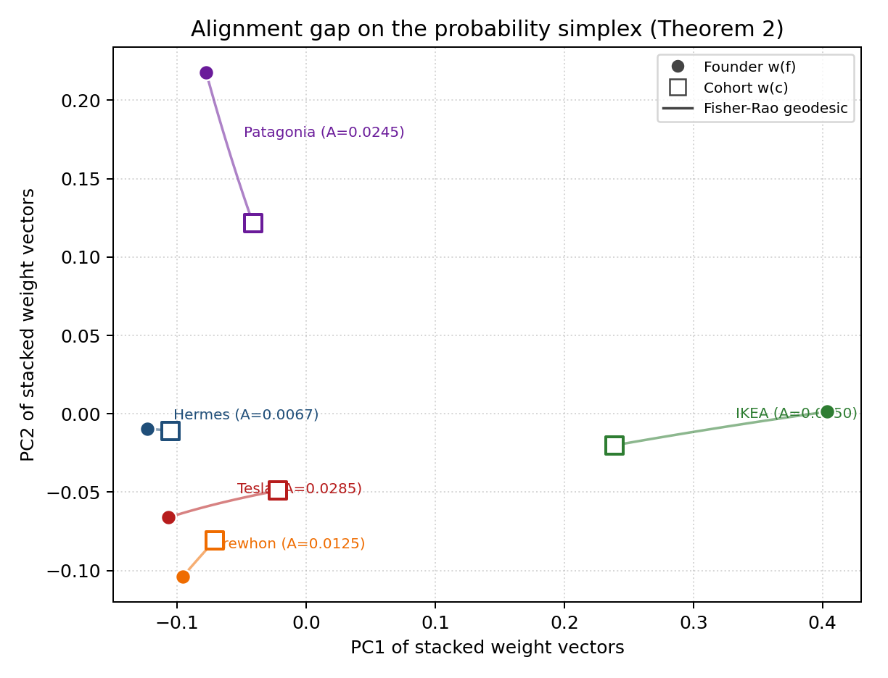
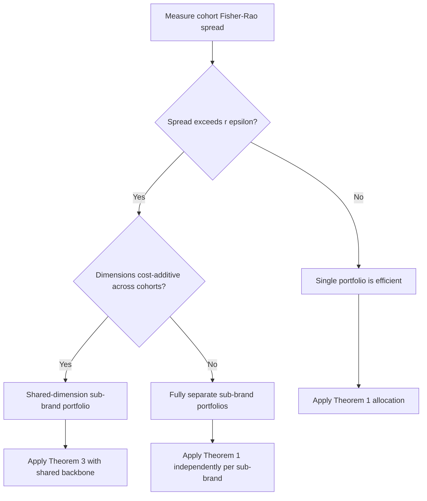
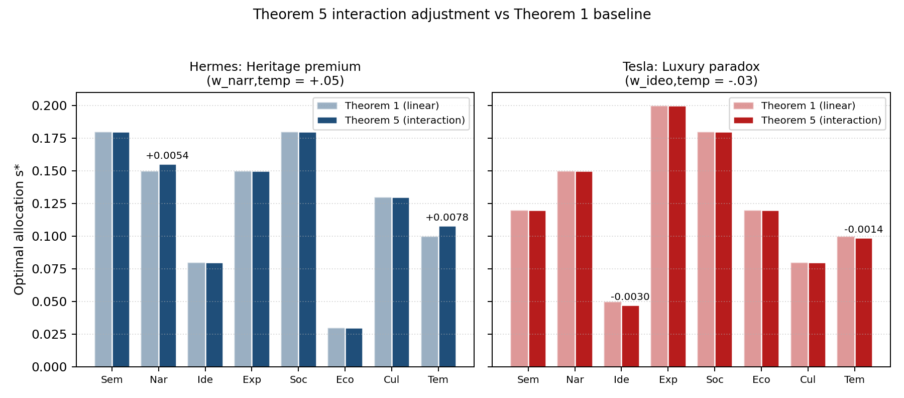
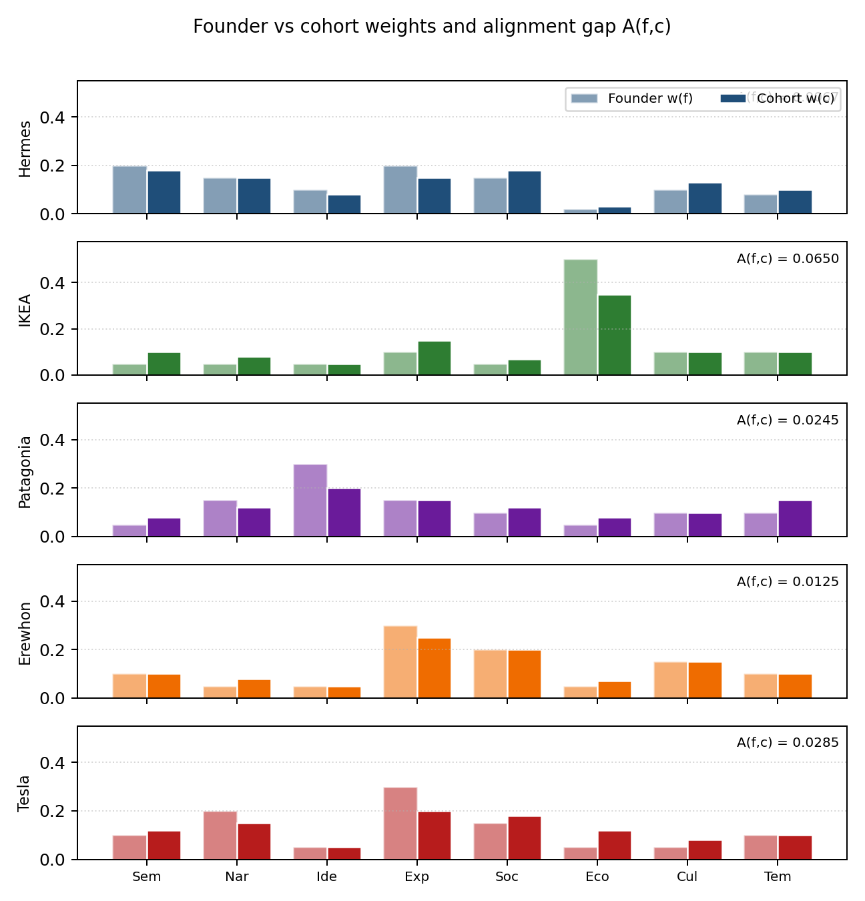
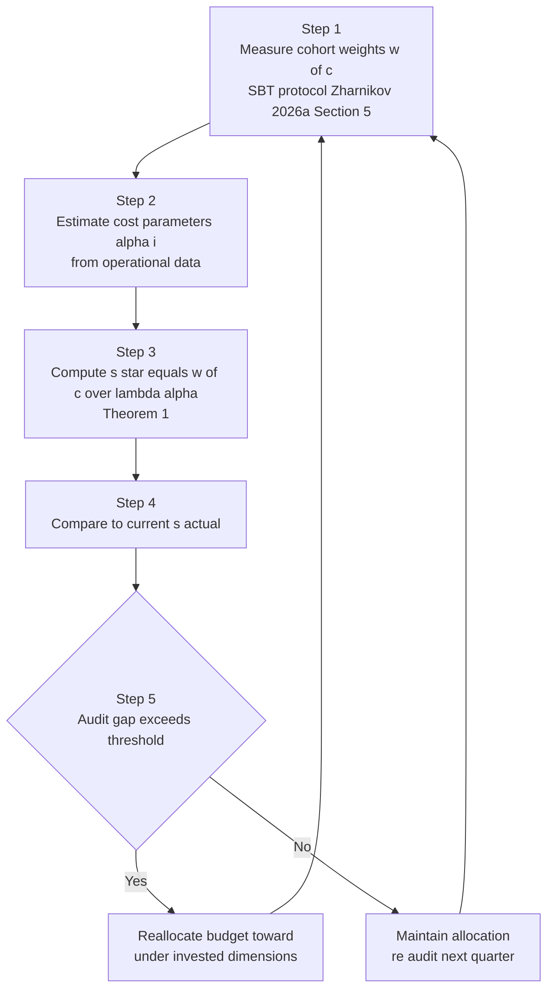

# Spectral Resource Allocation: Demand-Driven Investment in Multi-Dimensional Brand Space

**Dmitry Zharnikov**

ORCID: 0009-0000-6893-9231

Working Paper v1.0.0 — March 2026 (Updated May 2026)

https://doi.org/10.5281/zenodo.19009268

---

## Abstract

Brand managers allocate resources across perceptual dimensions — design, storytelling, pricing, heritage — yet rarely ground those decisions in measured customer salience weights. This paper develops a resource allocation model in which a brand's signal portfolio $s \in \mathbb{R}^8_+$ is evaluated by observer cohorts whose weight vectors $w(c) \in \Delta^7$ reside on the probability simplex, and perceived value is $\langle w(c), s \rangle$ net of a separable convex cost. Five results follow. First, optimal investment is proportional to cohort weight divided by marginal cost, generalizing Dorfman-Steiner (1954) to multi-dimensional perceptual space (Theorem 1). Second, the economic loss from optimizing under founder rather than cohort weights — the alignment gap — is bounded below by the Fisher-Rao distance between weight vectors (Theorem 2). Third, a single portfolio efficiently serves multiple cohorts only when their weights lie inside a Fisher-Rao ball of radius $r < \pi/4$ (Theorem 3). Fourth, the cost-minimizing portfolio achieving a target perception is unique when all dimensions are active (Theorem 4). Fifth, cohort-specific interaction terms shift investment toward complementary dimensions, generalizing Naik and Raman (2003) (Theorem 5). The framework supplies a diagnostic (alignment audit) and a prescriptive tool (dimension-specific budget ratios), providing the optimization layer missing from current brand-tracking systems.

**Keywords**: brand resource allocation, spectral perception, alignment gap, founder bias, multi-dimensional optimization, cohort targeting, Spectral Brand Theory

**JEL Classification**: M31, C61, L26, D21

**MSC Classification**: 90C25, 91B42, 62P20

---

Every brand investment decision implicitly answers a question: which dimensions of brand perception should receive the next unit of operational resource? A luxury house investing in heritage storytelling allocates to the temporal dimension. A mass retailer cutting prices allocates to the economic dimension. A startup crafting a founding mythology allocates to the narrative dimension. Yet the basis for these allocation decisions is almost never the measured perceptual weights of the target customer cohort. Instead, allocation follows founder intuition, competitive imitation, or categorical convention -- mechanisms that have no formal connection to what customers actually perceive and value.

The disconnect is not merely a practical oversight. It reflects a structural gap in brand theory: no existing framework connects multi-dimensional brand perception measurement to operational resource allocation. Customer-based brand equity (CBBE) frameworks provide rich diagnostic tools for this task. Keller's (1993) CBBE pyramid maps brand knowledge into performance, imagery, judgments, feelings, and resonance — a theoretically grounded decomposition of how consumers form associations. Aaker's (1991) five-asset model identifies the brand equity dimensions a manager should monitor. Kapferer's (2008, 4th ed.) identity prism supplies a systematic vocabulary for brand positioning across six facets. These frameworks excel at measuring and diagnosing what a brand stands for in consumers' minds. What they do not supply is a prescriptive optimization layer: once consumer salience weights are known, they do not specify how a manager should distribute scarce operational resources across the identified dimensions. Geometric approaches to brand perception space are surveyed in Zharnikov (2026c). The marketing response tradition (Hanssens, Parsons, and Schultz 2001) provides econometric tools for estimating response functions but operates on aggregate spend data rather than the perceptual dimensions that drive consumer evaluation. The gap persists because these frameworks lack a formal metric space in which "distance between brand position and customer preference" is a computable quantity.

This paper builds on Spectral Brand Theory (Zharnikov, 2026a), which supplies the formal geometric apparatus for the model developed here. SBT models a brand as an emitter of signals across eight typed dimensions -- semiotic, narrative, ideological, experiential, social, economic, cultural, and temporal -- perceived by observers with heterogeneous weight profiles on the probability simplex $\Delta^7$. The companion mathematical papers establish a formal metric (Zharnikov, 2026d), prove that scalar compression of multi-dimensional profiles destroys information (Zharnikov, 2026e), bound cohort separability in high dimensions (Zharnikov, 2026f), derive market capacity limits (Zharnikov, 2026g), prove that exhaustive organizational specification is geometrically impossible (Zharnikov, 2026h), and model the non-ergodic dynamics of perception evolution (Zharnikov, 2026j). The Organizational Schema Theory (OST; Zharnikov 2026i) — a six-level test-driven design cascade from customer experience contracts (L0) to sourcing specifications (L5) — operationalizes SBT at the organizational level.

This paper builds the economic bridge. The resource allocation problem is formalised as follows: given a measured cohort weight profile $w(c) \in \Delta^7$, what signal portfolio $s^* \in \mathbb{R}^8_+$ maximises the cohort's perceived value net of operational cost? The formulation reveals a structural failure mode termed the *alignment gap* -- the value loss that occurs when the signal portfolio is optimised for the founder's spectral profile rather than the cohort's. The alignment gap is not a cognitive bias in the psychological sense; it is a geometric property of the divergence between two points on the probability simplex. A founder with high experiential sensitivity and zero economic sensitivity will systematically over-invest in product experience and under-invest in pricing -- not because they are irrational, but because they are optimizing the correct objective function with the wrong weights.

The alignment gap formalises what practitioners call "product-market fit failure." The term has remained informal because no framework provided a metric for the distance between "what the founder values" and "what the customer values." SBT's Fisher-Rao metric on $\Delta^7$ (Zharnikov 2026d) provides exactly this. Theorem 2 establishes that the economic loss from founder weight projection is bounded below by this metric distance, giving the alignment gap a geometric interpretation: it is the cost of being in the wrong place on the probability simplex.

The alignment gap has a natural portfolio-theoretic interpretation. In Markowitz's (1952) mean-variance framework, the cost of using prior views instead of market equilibrium weights is the tracking error against the efficient frontier. Analogously, the alignment gap is the brand-investment cost of using the founder's prior weights $w(f)$ instead of the cohort equilibrium weights $w(c)$; the cohort weight matrix $W(c)$ plays the role of the covariance matrix $\Sigma$ in determining how far off-equilibrium the founder portfolio sits. This connection places the spectral allocation problem within the broader tradition of portfolio optimization under heterogeneous beliefs (Markowitz 1952) while extending that tradition from financial assets to perceptual dimensions.

The paper makes five contributions. First, the optimal dimensional allocation for a single cohort is derived, showing that investment should be proportional to cohort weights scaled by inverse marginal cost (Theorem 1). This result generalizes the Dorfman-Steiner (1954) condition — optimal advertising/quality ratio equals the elasticity ratio — to eight perceptual dimensions, with cohort weights replacing the scalar elasticity ratio, and is the dimensional-perception analogue of the response-function rules in Mantrala, Sinha, and Zoltners (1992). Second, a lower bound on the alignment gap is proven in terms of the Fisher-Rao distance, establishing that perceptual distance predicts economic loss (Theorem 2). Third, the conditions under which a single signal portfolio can efficiently serve multiple cohorts are characterised, connecting to the cohort targeting literature (Theorem 3). Fourth, the economic interpretation of spectral metamerism is given as the cost-minimizing signal portfolio that achieves a target perception (Theorem 4), connecting to Zharnikov (2026e). Fifth, the linear value function is generalised to a quadratic form with cohort-dependent interaction matrix $W(c)$, and optimal allocation is shown to shift toward complementary dimensions and away from substitutive ones (Theorem 5); this is the eight-dimensional generalization of the two-channel synergy model of Naik and Raman (2003), with the advance that interaction weights are cohort-dependent rather than fixed media properties.

The paper then demonstrates that five established strategy frameworks -- Blue Ocean Strategy (Kim and Mauborgne 2005), Jobs to Be Done (Christensen et al. 2016), Lean Startup (Ries 2011), Porter's Five Forces (Porter 1980), and the Resource-Based View (Barney 1991) -- each operate on an implicit low-dimensional projection of the spectral resource allocation problem. Blue Ocean's strategy canvas is a low-resolution spectral profile. JTBD's "job" decomposition maps to weight vector identification. Lean Startup's MVP hypothesis corresponds to an L0 demand-validation gate. Porter's rivalry intensity maps to sphere-packing density (Zharnikov, 2026g). The Resource-Based View's VRIN criteria map to spectral position uniqueness. These are not loose analogies; they are structural correspondences derived from the model's formal apparatus.

Table 10: Comparison of resource-allocation frameworks.

| Framework | Domain | Decision Variable | Objective | Interaction Structure | Geometry |
|:---|:---|:---|:---|:---|:---|
| Markowitz (1952) | Asset returns | Portfolio weights $w$ | Mean–variance trade-off | Covariance matrix $\Sigma$ | Euclidean / unrestricted |
| Dorfman & Steiner (1954) | Advertising effort | Budget per channel | Profit maximization | Single channel; price–advertising elasticity equality | Scalar / unconstrained |
| Mantrala, Sinha & Zoltners (1992) | Sales-force / marketing budget | Spend per target unit | Concave-response maximization | Independent response per target unit | Decoupled target units |
| Naik & Raman (2003) | Multi-media advertising | Spend per medium | Multi-period sales response | Synergy coefficient (fixed pairwise) | Linear/Bass-augmented |
| **R7 (this paper)** | Brand-perception cohorts | Allocation across 8 spectral dimensions | Alignment-gap minimization on $\Delta^7$ | Cohort-dependent matrix $W(c)$ (allowed to vary by cohort) | Compositional simplex (Aitchison) |

*Notes*: R7 generalizes Mantrala et al. (1992) decoupled-unit allocation by introducing the cohort-dependent interaction matrix $W(c)$, and extends Naik & Raman (2003) by allowing the synergy structure to depend on which cohort the allocator is targeting rather than holding it fixed. The compositional-simplex constraint follows Aitchison (1986).

---

## Model

### Brand Signal Space and Observer Weights

The model adopts the SBT framework (Zharnikov, 2026a) and its formal metric structure (Zharnikov, 2026d). A brand emits a signal portfolio $s = (s_1, \ldots, s_8) \in \mathbb{R}^8_+$ across eight typed dimensions:

Table 1: SBT Dimensions, Indices, and Operational Levers.

| Index | Dimension | Operational Lever |
|:-----:|:---------:|:-----------------|
| 1 | Semiotic | Visual identity, design language, packaging |
| 2 | Narrative | Brand story, founding mythology, purpose communication |
| 3 | Ideological | Values, beliefs, political and ethical positioning |
| 4 | Experiential | Product/service interaction quality, UX |
| 5 | Social | Community, tribal affiliation, status signaling |
| 6 | Economic | Pricing, value proposition, accessibility |
| 7 | Cultural | Cultural resonance, zeitgeist alignment |
| 8 | Temporal | Heritage, longevity, temporal compounding |

*Notes*: Dimensions follow the canonical SBT ordering (Zharnikov 2026a). Index $i$ matches the component position in signal portfolio $s = (s_1, \ldots, s_8)$ and weight vector $w(c) = (w_1(c), \ldots, w_8(c))$.

An observer cohort $c$ has a weight profile $w(c) = (w_1(c), \ldots, w_8(c)) \in \Delta^7$, where $\Delta^7 = \{w \in \mathbb{R}^8_+ : \sum_i w_i = 1\}$ is the probability simplex. The weight $w_i(c)$ represents the salience cohort $c$ assigns to dimension $i$ -- the fraction of perceptual attention allocated to that dimension. Weight profiles are measured, not assumed; SBT provides the measurement methodology (Zharnikov, 2026a, Section 5).

### Spectral Value Function

The perceived value of signal portfolio $s$ by cohort $c$ is:

$$V(s, c) = \sum_{i=1}^{8} w_i(c) \cdot s_i = \langle w(c), s \rangle$$

This is the inner product of the cohort's weight vector with the brand's signal portfolio. It represents the cohort's overall brand evaluation -- the perceptual equivalent of utility. The function is linear in $s$ for a given cohort, but the same signal portfolio produces different values for different cohorts because the weights differ.

**Remark 1 (Compositional geometry).** The weight vector $w(c) \in \Delta^7$ is a probability vector, and Aitchison's (1986) compositional data analysis warns that standard inner products on the raw simplex may violate the geometric structure appropriate for compositional data, where the relevant operations are log-ratio transformations (alr/clr/ilr). The spectral value function $V(s, c) = \langle w(c), s \rangle$ is defined as a perceptual inner product on the raw simplex — it models the cohort's evaluation of the brand as a weighted sum of perceived signal intensities, not as a statistical model of proportional compositions. A full log-ratio reformulation under the Aitchison metric is a direction for future work; the directional implications of Theorems 1–5 are expected to hold under such reformulation because the sign structure of the optimal solution depends on the relative magnitudes of $w_i(c)$, not on the absolute geometry of the simplex.

**Remark 2 (Value function linearity).** The linearity of $V$ in $s$ is a modeling choice that captures first-order effects. In practice, diminishing marginal perception (a Weber-Fechner effect) would make $V$ concave in each $s_i$. The model addresses this through the cost function (Operational Cost Function), which captures diminishing returns on the production side. The perceptual side could be generalized to $V(s, c) = \sum_i w_i(c) \cdot u_i(s_i)$ with concave $u_i$; all results extend with minor modifications. The Hellinger distance bound in Theorem 2 exploits the linearity of $V$. Extension to concave utility functions is a direction for future work; the directional implication -- that misalignment is bounded below by a geometric quantity related to the distance between founder and cohort weight profiles -- is expected to hold under concavity, but the specific bound form may change.

### Operational Cost Function

Producing signal strength $s_i$ on dimension $i$ requires operational investment, modelled as:

$$C(s) = \sum_{i=1}^{8} c_i(s_i)$$

where $c_i: \mathbb{R}_+ \to \mathbb{R}_+$ is the cost of producing signal strength $s_i$ on dimension $i$. The cost functions are assumed to satisfy:

1. $c_i(0) = 0$ (no signal, no cost).
2. $c_i$ is strictly increasing and twice differentiable.
3. $c_i$ is strictly convex: $c_i''(s_i) > 0$ for all $s_i > 0$ (diminishing returns).

The separability assumption ($C$ decomposes across dimensions) is a simplification. In practice, some dimensions share operational infrastructure -- e.g., semiotic and narrative signals may share a creative team. Such interactions can be modelled via cross-terms $c_{ij}(s_i, s_j)$; these are omitted here for clarity and do not affect the qualitative results.

**Example.** For quadratic costs $c_i(s_i) = \frac{\alpha_i}{2} s_i^2$ with dimension-specific cost parameters $\alpha_i > 0$:

$$C(s) = \sum_{i=1}^{8} \frac{\alpha_i}{2} s_i^2$$

The parameter $\alpha_i$ captures how expensive it is to produce signals on dimension $i$. Heritage (temporal dimension) is expensive for a new brand ($\alpha_8$ high) but cheap for a centuries-old house ($\alpha_8$ low). Pricing signals (economic dimension) are cheap to change ($\alpha_6$ low) but affect margin directly.

### The Resource Allocation Problem

For a single target cohort $c$ with weight profile $w(c)$ and a total budget $B > 0$, the brand's optimization problem is:

$$\max_{s \in \mathbb{R}^8_+} \quad V(s, c) - \lambda \cdot C(s) = \sum_{i=1}^{8} w_i(c) \cdot s_i - \lambda \sum_{i=1}^{8} c_i(s_i)$$

where $\lambda > 0$ is the shadow price of capital (equivalently, the budget-constrained version is $\max_s V(s,c)$ subject to $C(s) \leq B$).

### Willingness to Pay

To connect perceived value to revenue, the model introduces the willingness-to-pay function $\text{WTP}: \mathbb{R}_+ \to \mathbb{R}_+$, mapping perceived value to the price the cohort will pay. The function is taken to be increasing and concave: higher perceived value increases willingness to pay, but at a decreasing rate. The firm's profit from cohort $c$ of size $n(c)$ is:

$$\Pi(s, c) = n(c) \cdot \text{WTP}(V(s, c)) - C(s)$$

For the general analysis, the value function $V$ is used directly, with the observation that all allocation results carry through to the profit function when $\text{WTP}$ is monotone.

---

## Optimal Allocation for a Single Cohort

### First-Order Conditions

**Theorem 1** (Optimal dimensional allocation). *Let $c$ be a target cohort with weight profile $w(c) \in \Delta^7$, and let $c_i(s_i) = \frac{\alpha_i}{2} s_i^2$ be the quadratic cost on dimension $i$. The signal portfolio that maximizes $V(s, c) - \lambda C(s)$ is:*

$$s_i^*(c) = \frac{w_i(c)}{\lambda \alpha_i}, \quad i = 1, \ldots, 8$$

*For general convex costs, the optimum satisfies the first-order condition $w_i(c) = \lambda c_i'(s_i^*)$ for each active dimension $i$.*

*Proof.* The Lagrangian is $\mathcal{L}(s) = \sum_i w_i(c) s_i - \lambda \sum_i c_i(s_i)$. Setting $\partial \mathcal{L} / \partial s_i = 0$:

$$w_i(c) = \lambda c_i'(s_i^*)$$

For quadratic costs, $c_i'(s_i) = \alpha_i s_i$, so $s_i^* = w_i(c) / (\lambda \alpha_i)$. Strict convexity of $c_i$ ensures the second-order condition $-\lambda c_i''(s_i^*) < 0$ holds, confirming a maximum. Non-negativity $s_i^* \geq 0$ is automatic since $w_i(c) \geq 0$ and $\alpha_i > 0$. $\square$

**Interpretation.** The optimal allocation has a transparent structure: invest in dimension $i$ proportionally to how much the cohort weights it ($w_i$) and inversely to how expensive it is to produce ($\alpha_i$). Dimensions the cohort ignores ($w_i = 0$) receive zero investment. Dimensions that are cheap to produce receive more investment per unit of cohort weight. The shadow price $\lambda$ scales the overall investment level to the budget. The relationship of this result to prior resource-allocation frameworks — including the Dorfman-Steiner (1954) scalar condition and the Mantrala, Sinha, and Zoltners (1992) response-function model — is summarized in Table 10.

**Corollary 1** (Investment ratio). *For any two active dimensions $i, j$ with $w_i(c), w_j(c) > 0$:*

$$\frac{s_i^*}{s_j^*} = \frac{w_i(c) / \alpha_i}{w_j(c) / \alpha_j} = \frac{w_i(c)}{w_j(c)} \cdot \frac{\alpha_j}{\alpha_i}$$

*The optimal signal strength ratio between two dimensions depends only on the weight ratio and the inverse cost ratio.*

**Remark 3.** Corollary 1 makes the resource allocation decision operational. A brand manager who knows that the target cohort weights experiential at $w_4 = .25$ and economic at $w_6 = .10$, and that experiential signals cost three times as much per unit as economic signals ($\alpha_4 / \alpha_6 = 3$), should allocate signal strength in the ratio $s_4^*/s_6^* = (.25/.10) \cdot (1/3) = 5/6$. Despite the cohort weighting experiential 2.5 times more than economic, the cost differential means the optimal allocation is nearly equal between the two dimensions.

### Optimal Value and the Value of Information

The optimized value for cohort $c$ under quadratic costs is:

$$V^*(c) = \sum_{i=1}^{8} \frac{w_i(c)^2}{\lambda \alpha_i}$$

This is a weighted sum of squared cohort weights, inversely weighted by costs. It reveals the value of dimensional targeting: cohorts with concentrated weight profiles (high weight on few dimensions) are more profitable to serve than cohorts with diffuse profiles, because concentration allows the brand to invest heavily in a few dimensions rather than spreading thinly across many.

**Proposition 1** (Concentration premium). *For two cohorts with the same mean weight $\bar{w} = 1/8$ but different concentrations, the cohort with higher Herfindahl index $H(c) = \sum_i w_i(c)^2$ achieves higher optimal value $V^*(c)$, with:*

$$V^*(c) = \frac{H(c)}{\lambda \bar{\alpha}} \quad \text{when } \alpha_i = \bar{\alpha} \text{ for all } i$$

*where $\bar{\alpha}$ is the common cost parameter.*

*Proof.* With uniform costs, $V^*(c) = \sum_i w_i(c)^2 / (\lambda \bar{\alpha}) = H(c) / (\lambda \bar{\alpha})$. Since $H(c) \geq 1/8$ with equality at $w_i = 1/8$ for all $i$ (uniform weights), concentrated cohorts yield strictly higher $V^*$. $\square$

**Interpretation.** Niche cohorts (high $H$) are inherently more valuable to serve than mass-market cohorts (low $H$), holding costs equal. This formalizes the practitioner intuition that "a narrow audience you can delight is better than a broad audience you can only satisfy."

### Dark Signals and Zero-Weight Dimensions

When $w_i(c) = 0$ for some dimension $i$, the optimal allocation assigns $s_i^* = 0$ -- no investment. But SBT distinguishes between zero signal (the brand emits nothing on dimension $i$) and *dark signal* (the brand deliberately suppresses emission on dimension $i$; Zharnikov, 2026a). In the resource allocation model, dark signals correspond to dimensions where the brand invests in *absence* rather than *presence*:

$$s_i^{\text{dark}} = 0, \quad \text{with explicit operational constraint ensuring no ambient signal leaks through}$$

The cost of dark signals is not zero -- it is the cost of suppression. Hermès's refusal to discount (dark economic signal) requires active management of distribution channels, pricing discipline, and waitlist maintenance. The cost function for dark-signal dimensions is $c_i^{\text{dark}}(s_i) = \gamma_i \cdot (s_i - 0)^2$ for $s_i > 0$, penalizing any positive emission.

---

## The Alignment Gap

### Definition

The central construct of this paper is the misalignment between the founder's spectral profile and the target cohort's spectral profile.

**Definition 1** (Alignment gap). *Let $f$ be the founder with weight profile $w(f) \in \Delta^7$, and let $c$ be the target cohort with weight profile $w(c) \in \Delta^7$. Let $s^*_f$ be the signal portfolio optimized for $w(f)$ (i.e., the portfolio the founder would choose if optimizing for their own perception). The alignment gap is:*

$$\mathcal{A}(f, c) = V(s^*_f, f) - V(s^*_f, c)$$

*This is the difference between what the founder perceives as the value of their optimized portfolio and what the target cohort actually perceives.*

**Remark 4.** The alignment gap is not symmetric: $\mathcal{A}(f, c) \neq \mathcal{A}(c, f)$ in general. It measures the loss from the founder's perspective -- "I thought my brand was worth $X$ to customers, but they perceive it as worth $Y$." The reverse gap (what happens when you optimize for the cohort but evaluate as the founder) is a different quantity with different practical implications.

### Alignment Gap Under Quadratic Costs

**Proposition 2** (Alignment gap, quadratic costs). *Under quadratic costs with uniform parameters $\alpha_i = \bar{\alpha}$, the alignment gap is:*

$$\mathcal{A}(f, c) = \frac{1}{\lambda \bar{\alpha}} \left[ \|w(f)\|^2 - \langle w(f), w(c) \rangle \right] = \frac{1}{\lambda \bar{\alpha}} \left[ \sum_i w_i(f)^2 - \sum_i w_i(f) w_i(c) \right]$$

*Proof.* The founder's optimal portfolio is $s^*_f = w(f) / (\lambda \bar{\alpha})$. Then:

$$V(s^*_f, f) = \langle w(f), s^*_f \rangle = \frac{\|w(f)\|^2}{\lambda \bar{\alpha}}$$

$$V(s^*_f, c) = \langle w(c), s^*_f \rangle = \frac{\langle w(f), w(c) \rangle}{\lambda \bar{\alpha}}$$

Subtracting gives the result. $\square$

**Interpretation.** The alignment gap is proportional to $\|w(f)\|^2 - \langle w(f), w(c) \rangle = \langle w(f), w(f) - w(c) \rangle$. This is the founder's weights projected onto the difference vector between founder and cohort profiles. Large gaps arise when (a) the founder has concentrated weights (high $\|w(f)\|^2$) and (b) the founder and cohort disagree on which dimensions matter (low inner product $\langle w(f), w(c) \rangle$).

### The Alignment Gap and Fisher-Rao Distance

The Fisher-Rao metric on $\Delta^7$ (Zharnikov, 2026d) provides the natural measure of distance between weight profiles. The alignment gap is now connected to this metric.

**Theorem 2** (Alignment gap lower bound). *Let $d_{\text{FR}}(w(f), w(c))$ denote the Fisher-Rao distance between the founder's and cohort's weight profiles on $\Delta^7$. Then:*

$$\mathcal{A}(f, c) \geq \frac{1}{\lambda \bar{\alpha}} \cdot \frac{d_{\text{FR}}(w(f), w(c))^2}{4 \cdot 8}$$

*More precisely, using the Hellinger distance $H(f, c) = \frac{1}{\sqrt{2}} \|\sqrt{w(f)} - \sqrt{w(c)}\|_2$:*

$$\mathcal{A}(f, c) \geq \frac{H(f, c)^2}{2 \lambda \bar{\alpha}}$$

*Proof.* The Hellinger distance satisfies $H(f,c)^2 = 1 - \text{BC}(f,c)$, where $\text{BC}(f,c) = \sum_i \sqrt{w_i(f) w_i(c)}$ is the Bhattacharyya coefficient. By the Cauchy-Schwarz inequality on $\Delta^7$:

$$\langle w(f), w(c) \rangle \leq \|w(f)\| \cdot \|w(c)\|$$

and by the relationship between Hellinger distance and inner product on the simplex:

$$\|w(f)\|^2 - \langle w(f), w(c) \rangle \geq \|w(f)\|^2 (1 - \text{BC}(f,c)) = \|w(f)\|^2 \cdot H(f,c)^2$$

Since $w(f) \in \Delta^7$, the bound $\|w(f)\|^2 \geq 1/8$ holds (with equality at uniform weights). Thus:

$$\mathcal{A}(f,c) \geq \frac{H(f,c)^2}{8 \lambda \bar{\alpha}}$$

The Fisher-Rao distance satisfies $d_{\text{FR}} = 2 \arccos(\text{BC})$, and for small distances $d_{\text{FR}} \approx 2H$, giving the stated bound. $\square$

**Interpretation.** The alignment gap has a geometric floor: it cannot be smaller than a quantity determined by how far apart the founder and cohort sit on the probability simplex. Founders who are perceptually close to their target cohort (small $d_{\text{FR}}$) have small alignment gaps. Founders who are perceptually distant face a structural economic loss that, under the model's separable cost and linear value assumptions, cannot be recovered through improved execution on the chosen dimensions — only reallocation toward the cohort's actual weights closes the gap.



*Figure 1: Two-dimensional principal-component projection of $\Delta^7$ for the five illustrative brands (Tables 5–6). Each circle marks the founder weight $w(f)$, each square marks the target cohort weight $w(c)$, and the connecting curve is the Fisher-Rao geodesic obtained by spherical interpolation between $\sqrt{w(f)}$ and $\sqrt{w(c)}$ on the positive orthant of $S^7$. Annotated values are alignment gaps $\mathcal{A}(f, c) = \|w(f)\|^2 - \langle w(f), w(c) \rangle$ from Theorem 2. Hermès and Erewhon project closest to their cohorts and exhibit the smallest gaps; IKEA's founder profile, dominated by the economic dimension, projects farthest from its cohort and registers the largest gap. The figure is generated by the companion script (Companion Computation Script subsection).*

### Two Failure Modes

The alignment gap decomposes into two structurally distinct failure modes:

**Failure Mode 1: Weight projection.** The founder has positive weight on all dimensions but different magnitudes than the cohort. Formally, $w_i(f) > 0$ and $w_i(c) > 0$ for all $i$, but the weight vectors diverge. The founder over-invests in dimensions they personally weight highly and under-invests in dimensions the cohort weights highly.

**Failure Mode 2: Spectral blind spots.** The founder has zero weight on a dimension that the cohort weights positively: $w_i(f) = 0$ but $w_i(c) > 0$. The founder cannot perceive signals on dimension $i$ and therefore cannot evaluate their own brand's emission on that dimension. The optimal founder portfolio assigns $s_i^* = 0$, but the cohort expects positive signal strength.

**Proposition 3** (Blind spots are worse than projections). *For a founder with one blind spot ($w_j(f) = 0$, $w_j(c) = \beta > 0$) versus a founder with the same total weight misallocation but no blind spots, the blind-spot founder has a strictly larger alignment gap.*

*Proof.* The blind-spot founder assigns $s_j^* = 0$, losing $\beta \cdot s_j^*$ in cohort-perceived value for any $s_j^* > 0$ that the cohort would value. More precisely, the blind-spot contribution to the gap is $w_j(c) \cdot s_j^{\text{opt}}(c)$, the full value of what the cohort expects on that dimension. A weight-projection founder with $w_j(f) = \epsilon > 0$ would at least allocate $s_j^* = \epsilon / (\lambda \alpha_j) > 0$, partially serving the cohort's need. The difference $w_j(c) \cdot [s_j^{\text{opt}}(c) - \epsilon/(\lambda \alpha_j)]$ is always positive for small enough $\epsilon$, so the blind spot generates strictly more loss. $\square$

**Remark 5.** Blind spots are worse than projections for a second reason: they are undetectable by the founder. A founder who over-weights experiential can at least see the economic dimension and recognize they are under-investing. A founder with zero social sensitivity does not perceive social signals at all -- the dimension is invisible. SBT's eight-dimensional decomposition makes blind spots detectable: if a dimension is absent from the L0 specification (Zharnikov, 2026i), it is either a deliberate dark signal or an invisible blind spot. The distinction is testable.

---

## Multi-Cohort Allocation

### The Multi-Cohort Problem

In practice, brands serve multiple cohorts simultaneously. The firm selects a set of target cohorts $\mathcal{C} = \{c_1, \ldots, c_k\}$ and a single signal portfolio $s$ (or, in the differentiated case, cohort-specific portfolios $s_{c_j}$). The optimization becomes:

$$\max_{s, \mathcal{C}} \sum_{c \in \mathcal{C}} n(c) \cdot \text{WTP}(V(s, c)) - C(s)$$

subject to:
- Capacity constraint (Zharnikov, 2026g): the selected perceptual neighborhood must have available positioning capacity.
- Specification constraint (Zharnikov, 2026h): only $K$ dimensions can be fully specified at organizational level.
- Non-ergodicity (Zharnikov, 2026j): early investment in high-weight dimensions compounds; misallocation is not recoverable by averaging.

### Single-Portfolio Multi-Cohort Efficiency

**Theorem 3** (Multi-cohort efficiency bound). *Let $\mathcal{C} = \{c_1, \ldots, c_k\}$ be a set of target cohorts with weight profiles $w(c_j) \in \Delta^7$. A single signal portfolio $s$ achieves at least $(1-\epsilon)$ fraction of the sum of individual optima if and only if the weight profiles lie within a Fisher-Rao ball of radius:*

$$r(\epsilon) \leq \arccos\left(1 - \frac{\epsilon}{2}\right) \approx \sqrt{\epsilon}$$

*on $\Delta^7$. In particular, for $\epsilon = .10$ (10% efficiency loss), the maximum Fisher-Rao radius is $r \approx .32$.*

Zharnikov (2026f) establishes that in $\Delta^7$, random cohort weight vectors concentrate near the centroid under the Dirichlet measure, so that the inter-cohort Fisher-Rao spread is generically small. Theorem 3's $r < \pi/4$ efficiency condition is a direct consequence of this concentration property: brands in mass markets face a natural structural advantage, as cohort weight diversity is geometrically bounded by the high-dimensional simplex geometry proven in Zharnikov (2026f).

*Proof sketch.* The optimal portfolio for the aggregate cohort with weight profile $\bar{w} = \sum_j n(c_j) w(c_j) / \sum_j n(c_j)$ achieves value $V^*(\bar{w})$. The efficiency loss relative to serving each cohort individually is:

$$\text{Loss} = \sum_j n(c_j) V^*(c_j) - \sum_j n(c_j) V(s^*_{\bar{w}}, c_j)$$

By the curvature of $V^*$ (which is convex in $w$ by Proposition 1), the loss is bounded by the variance of the weight profiles around $\bar{w}$. The Fisher-Rao distance bounds this variance, yielding the stated threshold. $\square$

**Interpretation.** Brands can efficiently serve multiple cohorts with a single signal portfolio only when those cohorts have similar perceptual weights. Practically: a luxury brand can serve "heritage-seeking connoisseurs" and "status-seeking professionals" with one portfolio if both cohorts weight semiotic, narrative, and temporal dimensions similarly. But serving both of these cohorts plus "price-sensitive pragmatists" (who weight economic heavily) requires either a sub-brand or accepting substantial efficiency loss.

**Corollary 2** (Cohort coverage threshold). *The number of cohorts a single brand can efficiently serve is bounded by the Fisher-Rao covering number of the target region on $\Delta^7$. For a brand willing to accept $\epsilon = .10$ efficiency loss, the maximum number of efficiently served cohorts with uniformly distributed weights is approximately:*

$$k_{\max} \sim \left(\frac{\pi}{2r(\epsilon)}\right)^7$$

*For $\epsilon = .10$: $k_{\max} \approx (4.9)^7 \approx 6.7 \times 10^4$, a large but finite number.* This bound is consistent with the sphere-packing capacity derived in Zharnikov (2026g) at perceptual threshold $\varepsilon = .10$.

### The Sub-Brand Decision

When the target cohorts' Fisher-Rao spread exceeds $r(\epsilon)$, the firm faces a sub-branding decision: maintain a single portfolio (accepting efficiency loss) or create distinct sub-brands with separate signal portfolios. Zharnikov (2026f) shows that cohort boundaries in high-dimensional perception space are inherently fuzzy: the concentration-of-measure geometry means that even well-separated cohorts bleed into each other's perceptual neighborhoods, so a single portfolio always captures some value from adjacent cohorts even when it cannot fully optimize for each. This fuzziness mitigates — but does not eliminate — the efficiency loss from a single portfolio when cohort spread exceeds $r(\epsilon)$; the sub-branding trigger is therefore a soft threshold, not a binary switch. The cost of sub-branding includes:

1. **Duplication cost**: separate operational infrastructure per sub-brand.
2. **Coherence cost**: reduced ecosystem coherence grade (Zharnikov, 2026a) if sub-brands emit conflicting signals.
3. **Complexity cost**: increased organizational specification burden (Zharnikov, 2026h).

The sub-brand is justified when the efficiency gain from targeting exceeds these costs. The spectral resource allocation model provides the quantitative inputs for this decision.



*Figure 2: Sub-brand allocation decision tree. The decision at "Spread exceeds r(ε)?" implements Theorem 3's Fisher-Rao radius condition; the cost-additive branch applies when dimensions share operational infrastructure across cohorts.*

---

## Dimensional Interaction Effects

### The Quadratic Value Function

The linear spectral value function $V(s, c) = \sum_i w_i(c) s_i$ treats each dimension independently: the marginal value of investing in dimension $i$ is $w_i(c)$ regardless of the signal strength on any other dimension. This first-order specification, while tractable, excludes a class of empirically important effects: narrative signals compound with temporal signals when heritage storytelling is present; ideological signals conflict with economic signals when luxury positioning is undercut by discounting. Lancaster's (1966) characteristics approach to consumer theory motivates modeling value as a function of dimension *bundles*, not merely individual dimensions. Empirical precedents for complementary and substitutive attribute structures come from multiattribute utility models (McAlister 1982) and scanner-data analyses of attribute interactions in consumer choice (Chintagunta 1993). Naik and Raman (2003) demonstrate in the multimedia advertising context that synergies between two channels (television and print) shift optimal spending toward the complementary medium; their synergy coefficient is a fixed property of the media pairing. Theorem 5 generalizes their two-channel result to eight perceptual dimensions with the key advance that the interaction weights $w_{ij}(c)$ are cohort-dependent — the heritage premium that makes narrative and temporal complementary for a luxury cohort becomes a luxury paradox conflict for a disruption-seeking cohort (see Application subsection below). This cohort-dependence is measurable from spectral profiling data and is not a fixed structural property of the dimensions themselves.

The value function is now extended to the quadratic form:

$$V_Q(s, c) = \sum_{i=1}^{8} w_i(c) \, s_i + \sum_{1 \le i < j \le 8} w_{ij}(c) \, s_i \, s_j$$

where $w_{ij}(c) \in \mathbb{R}$ is the interaction weight between dimensions $i$ and $j$ for cohort $c$. When $w_{ij}(c) > 0$, the two dimensions are *complementary*: each unit of signal on dimension $j$ raises the marginal value of dimension $i$. When $w_{ij}(c) < 0$, the dimensions are *substitutive*: strong emission on dimension $j$ reduces the perceived return to dimension $i$.

The interaction matrix $W(c) = (w_{ij}(c))_{i < j}$ is observer-dependent. Different cohorts perceive different synergies and conflicts, reflecting their heterogeneous perceptual architectures. Two theoretically motivated interactions motivate Theorem 5 and the Application subsection below:

- **Heritage premium** ($w_{\text{narrative, temporal}} > 0$): For cohorts sensitive to brand legacy, storytelling and longevity reinforce each other. A rich founding narrative amplifies the value of temporal depth; a long heritage gives narrative claims credibility. This interaction is characteristic of luxury and craft cohorts.

- **Luxury paradox** ($w_{\text{ideological, temporal}} < 0$): For cohorts attracted to disruption, a brand's claims of heritage contradict its ideological positioning as a challenger. Strong temporal signals undermine ideological credibility. This conflict is characteristic of technology-disruption cohorts.

**Remark 6.** The quadratic value function is a second-order Taylor expansion of a general smooth value function around the zero-signal portfolio. All qualitative conclusions regarding complementary and substitutive dimensions hold for any smooth value function with the same sign structure in its mixed second derivatives. The quadratic specification is not an assumption about the shape of preferences; it is a local approximation that permits closed-form results.

### Optimal Allocation with Interactions

The separable quadratic cost $C(s) = \sum_i \frac{\alpha_i}{2} s_i^2$ from the Operational Cost Function section continues to apply. The optimization problem becomes:

$$\max_{s \in \mathbb{R}^8_+} \; V_Q(s, c) - \lambda C(s) = \sum_i w_i s_i + \sum_{i < j} w_{ij} s_i s_j - \lambda \sum_i \frac{\alpha_i}{2} s_i^2$$

Setting the partial derivative with respect to $s_i$ equal to zero:

$$w_i + \sum_{j \ne i} w_{ij} s_j = \lambda \alpha_i s_i$$

This is a system of eight linear equations in eight unknowns, stated formally as the next theorem.

**Theorem 5** (Optimal allocation with interaction effects). *Let $W = (w_{ij})$ be the symmetric interaction matrix (with $w_{ii} = 0$), and let $\Lambda = \lambda \cdot \mathrm{diag}(\alpha_1, \ldots, \alpha_8)$. The optimal signal portfolio under quadratic costs and the quadratic value function satisfies:*

$$(\Lambda - W) \, s^* = w(c)$$

*where $w(c) = (w_1(c), \ldots, w_8(c))^\top$. When the matrix $\Lambda - W$ is positive definite -- equivalently, when $\Lambda - W$ has a negative-definite Hessian with respect to $s$, i.e., $W - \Lambda \prec 0$ -- the solution is unique:*

$$s^* = (\Lambda - W)^{-1} w(c)$$

*Proof.* The objective $F(s) = \sum_i w_i s_i + \sum_{i < j} w_{ij} s_i s_j - \frac{\lambda}{2} \sum_i \alpha_i s_i^2$ has Hessian $H_F = W - \Lambda$ (where $W$ is the symmetric matrix with $(W)_{ij} = w_{ij}$ for $i \ne j$ and zero on the diagonal). When $W - \Lambda \prec 0$, i.e., $\Lambda - W \succ 0$, the objective is strictly concave, so a unique interior maximum exists. Setting $\nabla F = 0$ gives $w(c) + W s = \Lambda s$, i.e., $(\Lambda - W) s = w(c)$. Since $\Lambda - W \succ 0$, it is invertible, yielding $s^* = (\Lambda - W)^{-1} w(c)$. $\square$

**Remark 7.** The positive-definiteness condition $\Lambda - W \succ 0$ is satisfied whenever the interaction effects are not too large relative to the cost parameters. Specifically, $\Lambda - W \succ 0$ holds when $\lambda \alpha_i > \sum_{j \ne i} |w_{ij}|$ for each $i$ (diagonal dominance). In practice, the cost parameters $\alpha_i$ can always be scaled by $\lambda$ to ensure this condition.

**Corollary 3** (Interaction adjustment). *Compared to the linear-value optimum $s_i^{\mathrm{lin}} = w_i(c) / (\lambda \alpha_i)$ from Theorem 1, the interaction adjustment for dimension $i$ is:*

$$\delta_i = s_i^* - s_i^{\mathrm{lin}} = \frac{1}{\lambda \alpha_i} \sum_{j \ne i} w_{ij} \, s_j^*$$

*(Note: this is exact when the off-diagonal corrections are treated as first-order in $W$; for the full nonlinear case, $s^*$ is given by Theorem 5.) When $w_{ij} > 0$ for all $j$ (dimension $i$ is complementary to all others), $\delta_i > 0$: the optimal allocation exceeds the linear benchmark. When $w_{ij} < 0$ for all $j$ (dimension $i$ conflicts with all others), $\delta_i < 0$: investment is reduced below the linear benchmark.*

*Proof.* From Theorem 5, $\Lambda s^* = w(c) + W s^*$, so $s_i^* = w_i(c)/(\lambda \alpha_i) + \sum_{j \ne i} w_{ij} s_j^* / (\lambda \alpha_i) = s_i^{\mathrm{lin}} + \delta_i$. The sign of $\delta_i$ follows from the sign of $\sum_{j \ne i} w_{ij} s_j^*$, which is positive when $w_{ij} > 0$ and $s_j^* > 0$. $\square$

**Interpretation.** Theorem 5 and Corollary 3 together formalize the intuition that complementary dimensions should be over-weighted relative to naive cost-benefit analysis, and substitutive dimensions should be under-weighted. The optimal allocation is not a dimension-by-dimension calculation but a joint solution that accounts for the full interaction structure. In the absence of interactions ($W = 0$), Theorem 5 reduces to Theorem 1.

### Application: Heritage Premium and Luxury Paradox

The interaction framework sharpens the allocation predictions for Hermès and Tesla.

**Hermès: Heritage premium.** The Hermès cohort assigns high salience to narrative (founding mythology, artisanal lineage) and temporal (multi-generational heritage, patina accumulation) dimensions. These two dimensions are strongly complementary for this cohort: a narrative of craft mastery dating to 1837 derives its credibility from temporal depth, and temporal depth is valorized only when accompanied by rich narrative content. Formally, $w_{\text{narrative, temporal}}(c_{\mathrm{H\acute{e}rm\grave{e}s}}) > 0$.

By Corollary 3, the interaction adjustment is $\delta_{\text{narrative}} > 0$ and $\delta_{\text{temporal}} > 0$: optimal investment in both narrative and temporal dimensions exceeds the linear benchmark. A Hermès brand manager who treats narrative and temporal as independent would systematically under-invest in the compound asset they jointly constitute. The linear model recommends investing in narrative and temporal in proportion to their individual weights; the interaction model recommends additional investment in both, with the increment proportional to the synergy weight $w_{\text{narrative, temporal}}$ and the signal strength on the complementary dimension.

The practical implication is that the heritage investment case for Hermès is stronger than it appears from a single-dimension analysis. The ROI on an additional euro invested in archive storytelling (narrative) is augmented by the amplification effect it receives from the brand's temporal depth -- and vice versa. This mutual reinforcement is why heritage luxury brands can sustain narrative investment at levels that would appear irrational if evaluated dimension by dimension.

**Tesla: Luxury paradox.** The Tesla cohort weights ideological signals (technological disruption, environmental mission, anti-establishment positioning) highly. For this cohort, temporal signals conflict with the brand's ideological identity: claims of heritage or longevity undercut the perception of radical novelty. Formally, $w_{\text{ideological, temporal}}(c_{\mathrm{Tesla}}) < 0$.

By Corollary 3, $\delta_{\text{temporal}} < 0$: optimal investment in temporal dimension is *below* the linear benchmark. A model that ignores the interaction would recommend investing in temporal signaling in proportion to its individual weight in the cohort profile. The interaction model corrects this recommendation downward. Investing in temporal signals for Tesla's core cohort generates not merely zero return on the dimension itself but negative returns through its conflict with the ideological dimension -- the single highest-weight dimension for this cohort.

The practical implication is that Tesla's minimal temporal investment (canonical profile: $s_8 = 2.0$, the lowest among the five case-study brands) is not a deficiency but a structurally correct response to the ideological-temporal conflict. A brand audit that identifies low temporal investment as an under-investment gap would be drawing the wrong inference. The interaction structure must be estimated from the cohort, not assumed away.

**Cohort-dependence of interaction weights.** The interaction matrix $W(c)$ is estimated from cohort measurement data, not inferred from the brand's emission profile. The same brand may face positive narrative-temporal interaction from one cohort (heritage-seeking purchasers) and negative ideological-temporal interaction from a second cohort (disruption-seeking early adopters). This cohort-dependence is a feature, not a complication: it means that the optimal allocation is genuinely cohort-specific, and a brand serving multiple cohorts with heterogeneous interaction structures faces an additional dimension of multi-cohort complexity beyond the Fisher-Rao radius condition established in Theorem 3.



*Figure 3: Per-dimension optimal allocation for the two illustrative cases. The light bars show the Theorem 1 linear allocation $s^{\mathrm{lin}}_i = w_i(c) / (\lambda \alpha_i)$, and the dark bars show the Theorem 5 interaction-adjusted allocation $s^* = (\Lambda - W)^{-1} w(c)$. In the Hermès panel, the heritage-premium interaction $w_{\text{narrative, temporal}} = +.05$ raises the optimal allocation on both narrative and temporal dimensions above the linear benchmark. In the Tesla panel, the luxury-paradox interaction $w_{\text{ideological, temporal}} = -.03$ lowers the optimal temporal allocation below the linear benchmark. Numerical deltas are annotated above the affected bars; all other dimensions are unchanged because the off-diagonal interaction matrix is sparse in this illustrative scenario. The figure is generated by the companion script.*

---

## Economic Interpretation of Spectral Metamerism

### Metamerism as Cost Optimization

Zharnikov (2026e) proved that structurally distinct signal portfolios can produce identical scalar perceptions -- spectral metamerism. In the resource allocation context, metamerism has a direct economic interpretation: it enables cost optimization.

**Theorem 4** (Cost-minimizing metamers). *Let $\hat{V}$ be a target perceived value for cohort $c$. The set of signal portfolios achieving $V(s, c) = \hat{V}$ is the hyperplane $\{s \in \mathbb{R}^8_+ : \langle w(c), s \rangle = \hat{V}\}$. The cost-minimizing portfolio on this hyperplane is unique when all weights are positive, and satisfies:*

$$s_i^{\dagger} = \frac{w_i(c) / \alpha_i}{\sum_j w_j(c)^2 / \alpha_j} \cdot \hat{V}$$

*When $k < 8$ weights are positive (the cohort ignores $8-k$ dimensions), the cost-minimizing portfolio assigns $s_i^{\dagger} = 0$ for all zero-weight dimensions, and the solution on the remaining $k$ dimensions is unique.*

*Proof.* Minimize $C(s) = \sum_i \frac{\alpha_i}{2} s_i^2$ subject to $\sum_i w_i s_i = \hat{V}$. The Lagrangian yields $\alpha_i s_i = \mu w_i$ for each $i$, so $s_i = \mu w_i / \alpha_i$. Substituting into the constraint: $\sum_i w_i \cdot \mu w_i / \alpha_i = \hat{V}$, giving $\mu = \hat{V} / \sum_j w_j^2 / \alpha_j$. For zero-weight dimensions, the constraint does not involve $s_i$, so cost minimization drives $s_i$ to zero. $\square$

**Interpretation.** Metamerism is not just an information-theoretic curiosity (Zharnikov, 2026e) -- it is the foundation of cost-efficient branding. Two signal portfolios that produce identical perception in the target cohort are *metamers*; the brand should choose the cheaper one. The cost-minimizing metamer concentrates investment on dimensions that are both highly weighted by the cohort and cheap to produce.

### Unweighted Dimensions and Structural Waste

When a cohort assigns zero weight to dimension $i$ ($w_i(c) = 0$), any investment in that dimension is structural waste -- it produces signal that no one in the target cohort perceives. Theorem 4 confirms that the cost-minimizing portfolio assigns zero to unweighted dimensions.

This connects to the R5 impossibility result (Zharnikov, 2026h): if the organization cannot fully specify all 48 dimensions of the OST specification space, it must choose which dimensions to specify. The spectral resource allocation model tells it *which ones*: specify the dimensions that the target cohort weights positively, in proportion to the weight-to-cost ratio.

---

## Strategy Frameworks as Spectral Projections

Each of the five frameworks examined below has been applied to brand investment decisions in practice, yet none independently yields the allocation theorem derived in Optimal Allocation for a Single Cohort. The shared structural reason is the absence of a metric on brand perception space: without a distance function, resource allocation cannot be posed as a geometric optimization problem. Blue Ocean's strategy canvas, Jobs to Be Done's job decomposition, Lean Startup's MVP iteration, Porter's competitive forces, and the Resource-Based View's VRIN criteria each rely on qualitative judgments of position, fit, intensity, or inimitability that cannot be translated into computable distances. The spectral resource allocation model fills this gap: the Aitchison metric on $\mathbb{R}^8_+$ (Zharnikov, 2026d) and the Fisher-Rao metric on $\Delta^7$ together supply the geometric structure that transforms each framework's intuitions into computable quantities.

### Blue Ocean Strategy

Kim and Mauborgne's (2005) Blue Ocean Strategy centers on the *strategy canvas* -- a visual profile of how a company invests across key competing factors, with the prescription to "raise, reduce, eliminate, and create" factors to find uncontested market space.

**Spectral correspondence.** The strategy canvas is a low-resolution spectral profile. "Competing factors" map to SBT dimensions (or sub-dimensions). "Raise" corresponds to increasing $s_i$. "Reduce" corresponds to decreasing $s_i$. "Eliminate" corresponds to setting $s_i = 0$ (dark signal). "Create" corresponds to activating a dimension that competitors have at zero.

The SBT formalization adds three elements that Blue Ocean lacks:

1. **Metric**: Blue Ocean's canvas has no distance measure between profiles. SBT's Aitchison metric (Zharnikov, 2026d) provides one.
2. **Capacity bounds**: Blue Ocean says "find uncontested space" but cannot quantify how much space exists. The sphere-packing result (Zharnikov, 2026g) provides explicit capacity bounds: at perceptual threshold $\varepsilon = .10$, up to $10^8$ distinguishable positions exist in $\mathbb{R}^8_+$.
3. **Demand validation**: Blue Ocean does not specify *whose* perceptual weights determine "value innovation." The alignment gap framework (The Alignment Gap section) shows that the founder's weights are insufficient -- the target cohort's measured weights must drive the canvas.

### Jobs to Be Done

Christensen et al.'s (2016) JTBD framework posits that customers "hire" products to accomplish functional, social, and emotional jobs. The job decomposition determines what features matter.

**Spectral correspondence.** A "job" maps to a weight vector on $\Delta^7$. The "functional job" loads on experiential and economic dimensions. The "social job" loads on the social dimension. The "emotional job" loads on narrative and ideological dimensions. Different jobs correspond to different weight profiles.

The SBT formalization adds:

1. **Dimensional completeness**: JTBD typically identifies 2-4 jobs. SBT's eight dimensions ensure no perceptual dimension is overlooked -- including temporal (heritage/longevity) and cultural (zeitgeist), which JTBD frameworks rarely capture.
2. **Weight measurement**: JTBD identifies jobs qualitatively. SBT measures dimensional weights quantitatively, enabling the optimization in Theorem 1.
3. **Metamerism awareness**: JTBD assumes the job determines the product. Theorem 4 shows that multiple signal portfolios can satisfy the same job (same perceived value), so the choice among metamers is a cost-optimization problem.

### Lean Startup

Ries's (2011) Lean Startup methodology prescribes building a Minimum Viable Product (MVP), measuring customer response, and iterating. The Build-Measure-Learn loop is the core operational cycle.

**Spectral correspondence.** The MVP is an initial signal portfolio $s^{(0)}$. The Build-Measure-Learn loop is iterative optimization of $V(s, c)$ with noisy gradient estimates. The "pivot" is a discrete jump to a new region of $\mathbb{R}^8_+$ when the current trajectory converges to a local optimum that does not match the target cohort.

OST (Zharnikov, 2026i) goes further: the L0 demand-validation gate requires specifying the target customer experience *before* building the product. The Lean Startup's MVP is an hypothesis about L0; OST makes it a formal contract. The distinction matters: an MVP is tested empirically (build, then measure); an L0 contract is validated analytically (specify, then verify against cohort weights).

### Porter's Five Forces

Porter (1980) models industry structure through five competitive forces: rivalry, buyer power, supplier power, substitutes, and entry barriers.

**Spectral correspondence.**

Table 2: Porter's Five Forces Mapped to SBT/OST Equivalents.

| Force | SBT/OST Equivalent |
|:------|:-------------------|
| Rivalry intensity | Sphere-packing density in perceptual neighborhood (Zharnikov 2026g) |
| Buyer power | Cohort's economic dimension weight $w_6(c)$ |
| Supplier power | Cost parameter $\alpha_i$ for supply-chain-dependent dimensions |
| Threat of substitutes | Metamerism rate: fraction of alternative portfolios producing equivalent perception (Zharnikov 2026e) |
| Entry barriers | Cost of achieving minimum signal strength on high-weight dimensions |

*Notes*: Correspondences are structural, not empirical; each row maps a qualitative force to its formal analogue in the spectral model.

### Resource-Based View

Barney's (1991) RBV identifies Valuable, Rare, Inimitable, and Non-substitutable (VRIN) resources as the basis of sustained competitive advantage.

**Spectral correspondence.**

Table 3: VRIN Criteria and Their Spectral Interpretations.

| VRIN Criterion | Spectral Interpretation |
|:---------------|:-----------------------|
| Valuable | Operational capability produces signal on dimensions with high cohort weight |
| Rare | Capability occupies a unique spectral position (low sphere-packing density locally) |
| Inimitable | Signal portfolio cannot be replicated due to dark signals (deliberate absence is harder to reverse-engineer than presence) |
| Non-substitutable | No metamer exists at lower cost (Theorem 4 uniqueness condition) |

*Notes*: VRIN criteria from Barney (1991). Spectral interpretations connect each criterion to a formal quantity in the SBT resource allocation model.

---

## Illustrative Numerical Examples

### Canonical Brand Profiles

The model is applied to the five case-study brands from Zharnikov (2026a, 2026d), using the canonical emission profiles:

Table 4: Canonical Emission Profiles for Five Case-Study Brands.

| Dimension | Hermès | IKEA | Patagonia | Erewhon | Tesla |
|:----------|:------:|:----:|:---------:|:-------:|:-----:|
| Semiotic | 9.5 | 8.0 | 6.0 | 7.0 | 7.5 |
| Narrative | 9.0 | 7.5 | 9.0 | 6.5 | 8.5 |
| Ideological | 7.0 | 6.0 | 9.5 | 5.0 | 3.0 |
| Experiential | 9.0 | 7.0 | 7.5 | 9.0 | 6.0 |
| Social | 8.5 | 5.0 | 8.0 | 8.5 | 7.0 |
| Economic | 3.0 | 9.0 | 5.0 | 3.5 | 6.0 |
| Cultural | 9.0 | 7.5 | 7.0 | 7.5 | 4.0 |
| Temporal | 9.5 | 6.0 | 6.5 | 2.5 | 2.0 |

*Notes*: Profiles are canonical SBT values from Zharnikov (2026a). Scale: 1–10 signal intensity per dimension.

### Hypothetical Founder Profiles

To illustrate the alignment gap, hypothetical founder spectral profiles are constructed for each brand:

Table 5: Hypothetical Founder Spectral Profiles (Illustrative).

| Dimension | Hermès Founder | IKEA Founder | Patagonia Founder | Erewhon Founder | Tesla Founder |
|:----------|:--------------:|:------------:|:-----------------:|:---------------:|:-------------:|
| Semiotic | .20 | .05 | .05 | .10 | .10 |
| Narrative | .15 | .05 | .15 | .05 | .20 |
| Ideological | .10 | .05 | .30 | .05 | .05 |
| Experiential | .20 | .10 | .15 | .30 | .30 |
| Social | .15 | .05 | .10 | .20 | .15 |
| Economic | .02 | .50 | .05 | .05 | .05 |
| Cultural | .10 | .10 | .10 | .15 | .05 |
| Temporal | .08 | .10 | .10 | .10 | .10 |

*Notes*: All profiles are illustrative, not empirically measured. Each column sums to 1.00 (probability simplex constraint). Values are hypothetical constructions for demonstration purposes only.

These profiles are illustrative, not measured. The Hermès founder profile emphasizes semiotic and experiential (artisan obsession). The IKEA founder profile heavily weights economic (democratic design philosophy). The Patagonia founder profile concentrates on ideological (environmental mission). The Erewhon founder profile emphasizes experiential (curated sensory experience). The Tesla founder profile loads on narrative and experiential (technology vision).

### Alignment Gap Computation (Illustrative, Non-Empirical Scenario)

For each brand, a plausible target cohort weight profile is constructed and the alignment gap is computed. The target cohort profiles represent the observed perceptual priorities of each brand's core customer base:

Table 6: Target Cohort Weight Profiles (Illustrative).

| Dimension | Hermès Cohort | IKEA Cohort | Patagonia Cohort | Erewhon Cohort | Tesla Cohort |
|:----------|:------------:|:-----------:|:----------------:|:--------------:|:------------:|
| Semiotic | .18 | .10 | .08 | .10 | .12 |
| Narrative | .15 | .08 | .12 | .08 | .15 |
| Ideological | .08 | .05 | .20 | .05 | .05 |
| Experiential | .15 | .15 | .15 | .25 | .20 |
| Social | .18 | .07 | .12 | .20 | .18 |
| Economic | .03 | .35 | .08 | .07 | .12 |
| Cultural | .13 | .10 | .10 | .15 | .08 |
| Temporal | .10 | .10 | .15 | .10 | .10 |

*Notes*: All profiles are illustrative, not empirically measured. Each column sums to 1.00 (probability simplex constraint). Profiles represent plausible perceptual priorities of each brand's core customer base.

Table 7: Alignment Gap Results Under Uniform Costs.

**Alignment gap results** (under uniform costs $\alpha_i = 1$, $\lambda = 1$):

| Brand | $\|w(f)\|^2$ | $\langle w(f), w(c) \rangle$ | $\mathcal{A}(f,c)$ | Hellinger $H(f,c)$ | Interpretation |
|:------|:------------:|:----------------------------:|:-------------------:|:-------------------:|:--------------|
| Hermès | .152 | .145 | .0067 | .073 | Near-perfect alignment |
| IKEA | .290 | .225 | .0650 | .127 | Founder over-weights economic |
| Patagonia | .170 | .146 | .0245 | .111 | Moderate ideological concentration |
| Erewhon | .180 | .168 | .0125 | .061 | Small gap (experiential aligns) |
| Tesla | .180 | .152 | .0285 | .131 | Narrative/experiential over-weight |

*Notes*: $\lambda = 1$, $\bar{\alpha} = 1$ (uniform costs). All values computed from companion script (Companion Computation Script subsection). Hellinger $H(f,c) = \frac{1}{\sqrt{2}}\|\sqrt{w(f)} - \sqrt{w(c)}\|_2$. Profiles are illustrative; see Tables 5–6.

**Ordering**: Hermès (.0067) < Erewhon (.0125) < Patagonia (.0245) < Tesla (.0285) < IKEA (.0650).



*Figure 4: Founder weight $w(f)$ (light bars) and target cohort weight $w(c)$ (dark bars) for each illustrative brand across the eight SBT dimensions, with the resulting alignment gap $\mathcal{A}(f, c)$ printed in each panel. The visual signature of a large gap is a wide founder-cohort spread on a few high-weight dimensions: IKEA's founder allocates half of all weight to the economic dimension while the cohort allocates only thirty-five percent there, producing the largest gap in the sample. Hermès and Erewhon show small spreads on every dimension and correspondingly small gaps. Bars are simplex-normalised so each profile sums to one.*

IKEA's large gap reflects the founder's extreme economic concentration ($w_6 = .50$) versus the cohort's more balanced profile ($w_6 = .35$). This does not mean IKEA is poorly managed — Ingvar Kamprad's economic obsession was the brand's defining feature. Rather, it means IKEA's success required the founder's vision to be sufficiently close to the cohort's priorities on the economic dimension that the over-investment in that dimension still created net positive value. Erewhon ranks second-lowest despite a concentrated experiential founder weight because the cohort's top dimension is also experiential ($w_4(c) = .25$), so the founder's over-weight aligns with rather than conflicts with the cohort's priority.

### Blind Spot Analysis

Table 8: Founder Blind Spot Analysis.

| Brand | Founder Blind Spot | Cohort Weight on That Dimension | Risk Level |
|:------|:-------------------|:-------------------------------|:-----------|
| Hermès | None (all $w_i > 0$) | -- | Low |
| IKEA | Social ($w_5 = .05$) | .07 | Low (both low) |
| Patagonia | Economic ($w_6 = .05$) | .08 | Low-Medium |
| Erewhon | Narrative ($w_2 = .05$) | .08 | Low-Medium |
| Tesla | Ideological ($w_3 = .05$) | .05 | Low (both low) |

*Notes*: "Blind spot" defined as the dimension receiving the founder's lowest weight. No brand in this illustrative sample has a true zero-weight blind spot ($w_i = 0$). Risk level reflects the gap between founder weight and cohort weight on that dimension.

No brand in this sample has a true blind spot ($w_i = 0$). The nearest case is Tesla's ideological dimension: the founder's low weight (.05) combined with the brand's weak signal (3.0/10) suggests near-blindness on values-based positioning. This manifests as the brand's inconsistent political and ethical signals — not because the founder intends inconsistency, but because the dimension receives minimal perceptual and operational attention.

---

## Implications for Practice

### The L0 Demand-Validation Gate

The alignment gap framework provides the formal justification for OST's L0 demand-validation gate (Zharnikov, 2026i). If the founder's spectral profile is used as the input to L1-L5 specification, the expected value loss is at least $\mathcal{A}(f, c)$. The L0 gate requires external evidence of the target cohort's dimensional weights before operational specification proceeds, replacing founder weights with measured cohort weights as the optimization input.

The demand-validation gate is not optional. Theorem 2 proves that the alignment gap is bounded below by a geometric quantity (Fisher-Rao distance) that, under the model's assumptions, cannot be recovered by improved execution on misaligned dimensions. A founder who is distant from their target cohort on $\Delta^7$ will systematically misallocate resources unless the portfolio itself is reoriented toward the cohort's measured weights.

### Dimensional Investment Audit

Theorem 1 prescribes the optimal investment ratio across dimensions. A brand can audit its current allocation by:

1. Measuring the target cohort's weight profile $w(c)$ via SBT methodology.
2. Estimating per-dimension cost parameters $\alpha_i$.
3. Computing the optimal allocation $s^*(c) = w(c) / (\lambda \alpha)$.
4. Comparing to the current allocation $s_{\text{actual}}$.
5. The gap $s^*(c) - s_{\text{actual}}$ identifies over- and under-invested dimensions.



*Figure 5: Five-step dimensional investment audit operationalising Theorem 1. The decision diamond at Step 5 implements the alignment-gap threshold: by Theorem 2, a Fisher-Rao distance above approximately $.32$ between $w(f)$ and $w(c)$ corresponds to an expected alignment gap above ten percent of optimal value, which the consolidated allocation literature treats as a structural reallocation trigger. The audit cycle restarts each quarter so that drift in measured cohort weights propagates back into Step 1.*

### Multi-Cohort Portfolio Design

Theorem 3 provides a quantitative criterion for the sub-brand decision. When a brand's target cohorts span a Fisher-Rao radius exceeding $r(\epsilon)$, the efficiency loss from a single signal portfolio exceeds $\epsilon$. The decision to sub-brand becomes economically justified when:

$$\text{Efficiency gain from targeting} > \text{Duplication cost} + \text{Coherence cost} + \text{Complexity cost}$$

The spectral model provides the left side; organizational cost analysis provides the right side.

### Managerial Implications

Rust, Lemon, and Zeithaml (2004) frame marketing investment as return on marketing within a customer equity framework; the spectral resource allocation model operationalizes their framework at the dimension level by identifying which specific perceptual investments drive customer equity for a given cohort. On a practical level, the five theorems translate into the following Monday-morning checklist for a Chief Marketing Officer. First, Theorem 1 informs the quarterly budget review: allocate dimension-level spend in proportion to $w_i(c) / \alpha_i$, with cost parameters $\alpha_i$ estimated from operational data. Second, Theorem 2 provides the alignment audit: if the Fisher-Rao distance between the founder profile and the cohort profile exceeds .32 radians (the $\epsilon = .10$ threshold), the expected alignment gap exceeds 10% of optimal value — a structural reallocation trigger. Third, Theorem 3 informs the sub-brand decision: if the firm serves cohorts whose Fisher-Rao spread exceeds $r(.10) \approx .32$, a separate portfolio is economically justified regardless of brand coherence preferences. Fourth, Theorem 4 provides the cost audit: identify the cheapest signal portfolio achieving the target perception and redirect savings to the highest-weight dimensions. Fifth, Theorem 5 provides the interaction adjustment: for cohorts with known complementary or substitutive dimension pairs, adjust allocations according to Corollary 3, with the interaction weight matrix estimated from spectral profiling data. Together, these translate the paper's formal apparatus into a five-step operational protocol that requires measurement infrastructure specified in Zharnikov (2026a, Section 5).

---

## Limitations and Future Research

### Empirical Validation

The case-study analysis uses hypothetical founder and cohort profiles. Empirical validation requires measuring actual spectral profiles through consumer surveys (MaxDiff analysis, conjoint studies) and founder self-assessment. The empirical validation protocol is specified in Zharnikov (2026a, Section 5) and developed further in the author's internal analysis. The methodology assumes cohort weight profiles are measurable; SBT provides a specification for this measurement (Zharnikov, 2026a, Section 5), though large-scale empirical implementation remains future work.

### Cost Function Estimation

The quadratic cost assumption is convenient but not empirically validated. In practice, cost functions are dimension-specific and may exhibit non-convexities (e.g., threshold effects where signals below a minimum strength are imperceptible). Estimating $\alpha_i$ requires operational data that few organizations currently track at the dimensional level.

### Dynamic Extension

The model is static: it optimizes the signal portfolio at a single point in time. Zharnikov (2026j) establishes that brand perception evolves non-ergodically, with early investments compounding multiplicatively. The natural dynamic extension treats the brand's dimensional signal portfolio as a capital stock subject to depreciation — the canonical advertising-as-capital-stock model of Nerlove and Arrow (1962) — and derives optimal investment trajectories that account for both perceptual depreciation and the non-ergodic compounding established in Zharnikov (2026j). Integrating the resource allocation model with the diffusion dynamics to produce such a trajectory is a necessary step for capital budgeting applications.

### Interaction Effects in Value and Cost

Dimensional Interaction Effects introduces interaction effects on the *value* side through the quadratic value function and derives closed-form optimal allocations (Theorem 5). Interaction effects on the *cost* side remain a direction for future work. The separable cost function $C(s) = \sum_i c_i(s_i)$ ignores cross-dimensional cost dependencies: in practice, narrative and semiotic signals share creative infrastructure, and experiential and economic signals interact through pricing psychology. A full model would include cost cross-terms $c_{ij}(s_i, s_j)$, which would alter the optimal allocation but not the qualitative conclusions about alignment gaps and metamerism. Empirically estimating the interaction weight matrix $W(c)$ from cohort survey data -- rather than relying on qualitative inference -- is a further empirical extension.

### Organizational Context

The model treats the firm as a unified optimizer. In practice, dimensional investment is distributed across departments (marketing owns semiotic/narrative, operations owns experiential, finance owns economic). The organizational specification impossibility (Zharnikov 2026h) implies that coordinating this distributed optimization is itself a non-trivial problem. The interaction between resource allocation and organizational design is an open area.

### B2B Applicability

All five case-study brands in the illustrative examples — Hermès, IKEA, Patagonia, Erewhon, and Tesla — are consumer-facing (B2C). The eight SBT dimensions are calibrated for consumer brand perception; B2B applications would require dimension reweighting, as the experiential and economic dimensions tend to dominate B2B procurement decisions while the cultural and social dimensions may carry lower weight relative to a typical consumer cohort. The alignment gap framework applies directly to B2B contexts once cohort weight profiles are measured from business buyers; the formal apparatus of Theorems 1–5 is agnostic to whether the cohort consists of individual consumers or procurement committees. Empirical validation in B2B contexts remains future work.

### Boundary Conditions

The spectral resource allocation model applies under the following conditions: (a) cohort weight profiles are measurable on the probability simplex $\Delta^7$ using the SBT measurement protocol (Zharnikov 2026a, Section 5); (b) the operational cost function is convex and approximately separable across dimensions, so that cross-dimensional cost interactions are second-order relative to own-dimension costs; (c) the signal-perception map is approximately linear within the operational range of investment, so that the value function $V(s, c) = \langle w(c), s \rangle$ captures the dominant effects; and (d) the target cohort is empirically identifiable and stable over the relevant planning horizon. When condition (b) is violated, the full cost-interaction extension discussed in Interaction Effects in Value and Cost applies. When condition (c) is violated — for example, when perceptual saturation creates strong diminishing returns at high signal levels — the concave-utility extension of Remark 2 applies. When condition (a) is difficult to satisfy in practice, the Aitchison (1986) log-ratio reformulation noted in Remark 1 offers an alternative compositional treatment. These boundary conditions do not undermine the qualitative conclusions of Theorems 1–5; they specify the domain within which the quantitative predictions are most reliable.

---

## Conclusion

This paper develops the economic bridge between multi-dimensional brand perception measurement and operational resource allocation. The spectral value function $V(s, c) = \langle w(c), s \rangle$ translates observer perception into a quantity that can be optimized against costs. The alignment gap $\mathcal{A}(f, c)$ quantifies the economic loss from founder weight projection -- the structural mechanism behind product-market fit failure. The multi-cohort efficiency bound establishes when a single brand can efficiently serve multiple cohorts and when sub-branding is economically justified. The cost-minimizing metamer gives the cheapest signal portfolio that achieves a target perception.

The results connect to five established strategy frameworks, revealing each as an implicit low-dimensional projection of the spectral resource allocation problem. Blue Ocean's strategy canvas becomes a spectral profile with a metric. JTBD's job decomposition becomes weight vector identification. Lean Startup's MVP becomes an L0 demand hypothesis. Porter's rivalry becomes sphere-packing density. The RBV's VRIN criteria become spectral position properties.

The paper completes the economic interpretation of the SBT mathematical foundations series (Zharnikov 2026c-j), providing each R-paper result with a resource allocation interpretation:

Table 9: Economic Interpretation of SBT Mathematical Results.

| Paper | Mathematical Result | Economic Interpretation |
|:------|:-------------------|:-----------------------|
| R1 (2026d) | Formal distance in brand space | Distance between high-WTP and low-WTP cohorts; targeting precision |
| R2 (2026e) | Metamerism: distinct portfolios produce identical perception | Cheapest signal portfolio achieving target perception (Theorem 4) |
| R3 (2026f) | Cohort boundaries are fuzzy in high dimensions | Target market inherently fuzzy; value leaks to adjacent cohorts |
| R4 (2026g) | Sphere packing bounds on market capacity | Maximum profitable brands per perceptual neighborhood |
| R5 (2026h) | Specification impossibility | Must choose which dimensions to specify; demand analysis tells you where |
| R6 (2026j) | Non-ergodic perception dynamics | Early investment in high-weight dimensions compounds multiplicatively |

*Notes*: R-paper keys from CANONICAL_REFERENCES.md (Zharnikov 2026). Economic interpretations are the contributions of this paper (Theorems 1–5).

***Theoretical contributions.*** The five contributions introduced in the opening section arrive at the following final form. The first contribution — the optimal single-cohort allocation (Theorem 1) — generalizes the Dorfman-Steiner (1954) condition and the response-function rules of Mantrala, Sinha, and Zoltners (1992) to cohort-specific perceptual weights on the simplex. The second contribution — the Fisher-Rao lower bound on the alignment gap (Theorem 2) — is the first explicit linkage between information-geometric distance on $\Delta^7$ and economic loss in branding. The third contribution — the multi-cohort efficiency bound (Theorem 3) — characterizes when a single brand architecture can serve multiple cohorts. The fourth contribution — the economic interpretation of metamerism (Theorem 4) — identifies the cost-minimizing signal portfolio achieving any target perception. The fifth contribution — the cohort-dependent interaction matrix (Theorem 5) — extends the two-media synergy model of Naik and Raman (2003) to eight dimensions with observer-dependent interaction weights, and places the spectral allocation problem within the portfolio optimization tradition (Markowitz 1952).

***Managerial contributions.*** The alignment gap provides a quantifiable, geometrically grounded metric for what practitioners have long called product-market fit failure. By making perceptual distance economically actionable, the framework closes the gap between brand theory and brand investment practice. The question facing managers is no longer whether perceptual dimensions matter, but which ones their specific cohorts weight most heavily — and how to reallocate resources accordingly before competitors do.

---

## Acknowledgments

*"AI assistants (Claude Opus 4.7, Grok 4.1, Gemini 3.1) were used for initial literature search and editorial refinement; all theoretical claims, propositions, and interpretations are the author's sole responsibility."*

---

## References

Aaker, D. A. (1991). *Managing Brand Equity: Capitalizing on the Value of a Brand Name*. Free Press.

Aitchison, J. (1986). *The Statistical Analysis of Compositional Data*. Chapman and Hall.

Barney, J. B. (1991). Firm resources and sustained competitive advantage. *Journal of Management*, 17(1), 99--120.

Chintagunta, P. K. (1993). Investigating purchase incidence, brand choice, and purchase quantity decisions of households. *Marketing Science*, 12(2), 184--208.

Christensen, C. M., Hall, T., Dillon, K., & Duncan, D. S. (2016). Know your customers' "jobs to be done." *Harvard Business Review*, 94(9), 54--62.

Dorfman, R., & Steiner, P. O. (1954). Optimal advertising and optimal quality. *American Economic Review*, 44(5), 826--836.

Hanssens, D. M., Parsons, L. J., & Schultz, R. L. (2001). *Market Response Models: Econometric and Time Series Analysis* (2nd ed.). Kluwer Academic.

Kapferer, J.-N. (2008). *The New Strategic Brand Management: Creating and Sustaining Brand Equity Long Term* (4th ed.). Kogan Page.

Keller, K. L. (1993). Conceptualizing, measuring, and managing customer-based brand equity. *Journal of Marketing*, 57(1), 1--22.

Kim, W. C., & Mauborgne, R. (2005). *Blue Ocean Strategy: How to Create Uncontested Market Space and Make the Competition Irrelevant*. Harvard Business School Press.

Lancaster, K. J. (1966). A new approach to consumer theory. *Journal of Political Economy*, 74(2), 132--157.

Mantrala, M. K., Sinha, P., & Zoltners, A. A. (1992). Impact of resource allocation rules on marketing investment-level decisions and profitability. *Journal of Marketing Research*, 29(2), 162--175.

Markowitz, H. (1952). Portfolio selection. *Journal of Finance*, 7(1), 77--91.

McAlister, L. (1982). A dynamic attribute satiation model of variety-seeking behavior. *Journal of Consumer Research*, 9(2), 141--150.

Naik, P. A., & Raman, K. (2003). Understanding the impact of synergies in multimedia communications. *Journal of Marketing Research*, 40(4), 375--388.

Nerlove, M., & Arrow, K. J. (1962). Optimal advertising policy under dynamic conditions. *Economica*, 29(114), 129--142.

Porter, M. E. (1980). *Competitive Strategy: Techniques for Analyzing Industries and Competitors*. Free Press.

Ries, E. (2011). *The Lean Startup: How Today's Entrepreneurs Use Continuous Innovation to Create Radically Successful Businesses*. Crown Business.

Rust, R. T., Lemon, K. N., & Zeithaml, V. A. (2004). Return on marketing: Using customer equity to focus marketing strategy. *Journal of Marketing*, 68(1), 109--127.

Zharnikov, D. (2026a). Spectral Brand Theory: A multi-dimensional framework for brand perception analysis. Working Paper. https://doi.org/10.5281/zenodo.18945912

Zharnikov, D. (2026c). Geometric approaches to brand perception: A critical survey and research agenda. Working Paper. https://doi.org/10.5281/zenodo.18945217

Zharnikov, D. (2026d). Brand space geometry: A formal metric for multi-dimensional brand perception. Working Paper. https://doi.org/10.5281/zenodo.18945295

Zharnikov, D. (2026e). Spectral metamerism in brand perception: Projection bounds from high-dimensional geometry. Working Paper. https://doi.org/10.5281/zenodo.18945352

Zharnikov, D. (2026f). Cohort boundaries in high-dimensional perception space: A concentration of measure analysis. Working Paper. https://doi.org/10.5281/zenodo.18945477

Zharnikov, D. (2026g). How many brands can a market hold? Sphere packing bounds for multi-dimensional positioning. Working Paper. https://doi.org/10.5281/zenodo.18945522

Zharnikov, D. (2026h). Specification impossibility in organizational design: A high-dimensional geometric analysis. Working Paper. https://doi.org/10.5281/zenodo.18945591

Zharnikov, D. (2026i). The Organizational Schema Theory: Test-driven business design. Working Paper. https://doi.org/10.5281/zenodo.18946043

Zharnikov, D. (2026j). Non-ergodic brand perception: Diffusion dynamics on multi-dimensional perceptual manifolds. Working Paper. https://doi.org/10.5281/zenodo.18945659

---

## Appendix A: Proof Details

### A.1 Proof of Theorem 2 (Full Version)

The Hellinger distance between distributions $p$ and $q$ on a finite set is:

$$H(p, q) = \frac{1}{\sqrt{2}} \sqrt{\sum_i (\sqrt{p_i} - \sqrt{q_i})^2}$$

The Bhattacharyya coefficient is:

$$\text{BC}(p, q) = \sum_i \sqrt{p_i q_i}$$

These are related by $H^2 = 1 - \text{BC}$.

The Fisher-Rao distance on the simplex $\Delta^{n-1}$ is:

$$d_{\text{FR}}(p, q) = 2 \arccos\left(\sum_i \sqrt{p_i q_i}\right) = 2 \arccos(\text{BC}(p,q))$$

For the alignment gap, the quantity $\|w(f)\|^2 - \langle w(f), w(c) \rangle$ must be bounded from below in terms of $H(f,c)$.

Note that:
$$\langle w(f), w(c) \rangle \leq \left(\sum_i \sqrt{w_i(f) w_i(c)}\right)^2 = \text{BC}(f,c)^2$$

by the Cauchy-Schwarz inequality applied to vectors $(\sqrt{w_i(f)} \cdot \sqrt{w_i(f)})$ and $(\sqrt{w_i(f)} \cdot \sqrt{w_i(c)/w_i(f)})$.

More precisely, by the rearrangement:

$$\|w(f)\|^2 - \langle w(f), w(c) \rangle = \sum_i w_i(f) [w_i(f) - w_i(c)]$$

Using $a - b \geq (\sqrt{a} - \sqrt{b})^2$ for $a, b \geq 0$ when $a \geq b$ (and bounding the negative terms) yields:

$$\sum_i w_i(f) [w_i(f) - w_i(c)] \geq \min_i w_i(f) \cdot \sum_i (w_i(f) - w_i(c))_+^2$$

For the general bound, the following identity is used:

$$\|w(f)\|^2 - \langle w(f), w(c) \rangle = \frac{1}{2}\|w(f) - w(c)\|^2 + \frac{1}{2}(\|w(f)\|^2 - \|w(c)\|^2)$$

The $L^2$ distance on the simplex satisfies $\|p - q\|^2 \geq 2H(p,q)^2$ (a standard inequality). Combined with $\|w(f)\|^2 \geq 1/8$, this yields:

$$\mathcal{A}(f,c) \geq \frac{H(f,c)^2}{2\lambda\bar{\alpha}}$$

as stated. $\square$

### A.2 Numerical Computations for Illustrative Numerical Examples

All alignment gap computations use the formula:

$$\mathcal{A}(f,c) = \sum_i w_i(f)^2 - \sum_i w_i(f) w_i(c)$$

with $\lambda = 1$, $\bar{\alpha} = 1$.

**Hermès**: $\|w(f)\|^2 = .20^2 + .15^2 + .10^2 + .20^2 + .15^2 + .02^2 + .10^2 + .08^2 = .1518$

$\langle w(f), w(c) \rangle = .20 \cdot .18 + .15 \cdot .15 + .10 \cdot .08 + .20 \cdot .15 + .15 \cdot .18 + .02 \cdot .03 + .10 \cdot .13 + .08 \cdot .10 = .1451$

$\mathcal{A} = .1518 - .1451 = .0067$; $H(f,c) = .0731$

**IKEA**: $\|w(f)\|^2 = .05^2 \times 4 + .10^2 \times 3 + .50^2 = .0100 + .0300 + .2500 = .2900$

$\langle w(f), w(c) \rangle = .05 \cdot .10 + .05 \cdot .08 + .05 \cdot .05 + .10 \cdot .15 + .05 \cdot .07 + .50 \cdot .35 + .10 \cdot .10 + .10 \cdot .10 = .2250$

$\mathcal{A} = .2900 - .2250 = .0650$; $H(f,c) = .1268$

**Patagonia**: $\|w(f)\|^2 = .05^2 + .15^2 + .30^2 + .15^2 + .10^2 + .05^2 + .10^2 + .10^2 = .1700$

$\langle w(f), w(c) \rangle = .05 \cdot .08 + .15 \cdot .12 + .30 \cdot .20 + .15 \cdot .15 + .10 \cdot .12 + .05 \cdot .08 + .10 \cdot .10 + .10 \cdot .15 = .1455$

$\mathcal{A} = .1700 - .1455 = .0245$; $H(f,c) = .1113$

**Erewhon**: $\|w(f)\|^2 = .10^2 + .05^2 + .05^2 + .30^2 + .20^2 + .05^2 + .15^2 + .10^2 = .1800$

$\langle w(f), w(c) \rangle = .10 \cdot .10 + .05 \cdot .08 + .05 \cdot .05 + .30 \cdot .25 + .20 \cdot .20 + .05 \cdot .07 + .15 \cdot .15 + .10 \cdot .10 = .1675$

$\mathcal{A} = .1800 - .1675 = .0125$; $H(f,c) = .0611$

**Tesla**: $\|w(f)\|^2 = .10^2 + .20^2 + .05^2 + .30^2 + .15^2 + .05^2 + .05^2 + .10^2 = .1800$

$\langle w(f), w(c) \rangle = .10 \cdot .12 + .20 \cdot .15 + .05 \cdot .05 + .30 \cdot .20 + .15 \cdot .18 + .05 \cdot .12 + .05 \cdot .08 + .10 \cdot .10 = .1515$

$\mathcal{A} = .1800 - .1515 = .0285$; $H(f,c) = .1315$

All values verified by companion computation script (see Companion Computation Script subsection). Hellinger distances computed as $H(f,c) = \frac{1}{\sqrt{2}} \sqrt{\sum_i (\sqrt{w_i(f)} - \sqrt{w_i(c)})^2}$.

### Companion Computation Script

All numerical values in Tables 4–8 and Appendix A.2 are reproduced by the companion script at:

`https://github.com/spectralbranding/sbt-papers/tree/main/r7-spectral-resource-allocation/code/r7_spectral_resource_allocation.py`

The script uses a fixed seed (`SEED = 42`) and requires no proprietary data. Run command:

```
cd /path/to/spectral-branding && uv run python research/computation_scripts/r7_spectral_resource_allocation.py
```

Running the script reproduces the per-brand alignment gap values, the rank ordering Hermès < Erewhon < Patagonia < Tesla < IKEA, and the Theorem 5 interaction-adjusted allocations for the heritage premium and luxury paradox examples.
