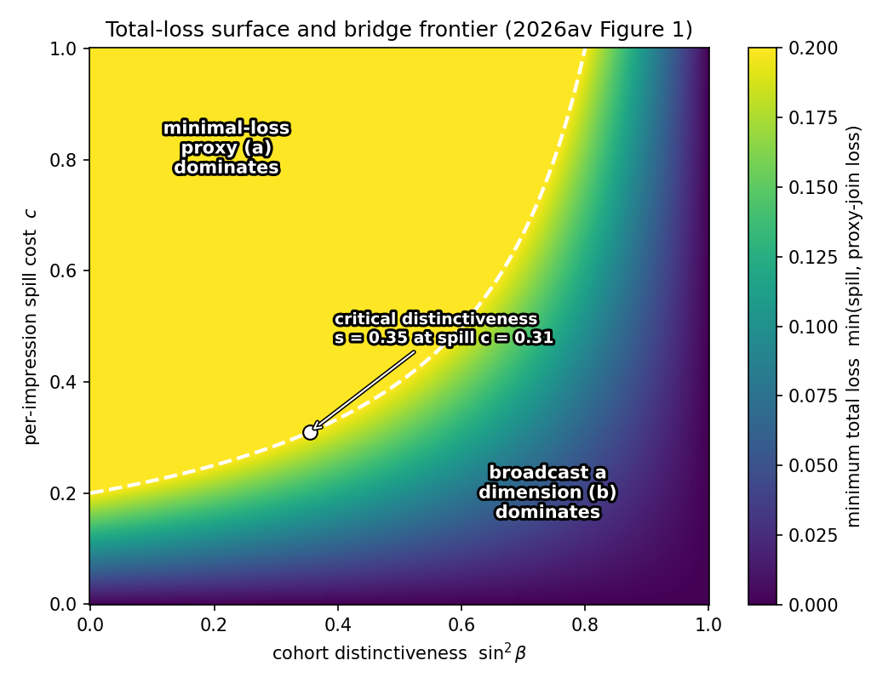
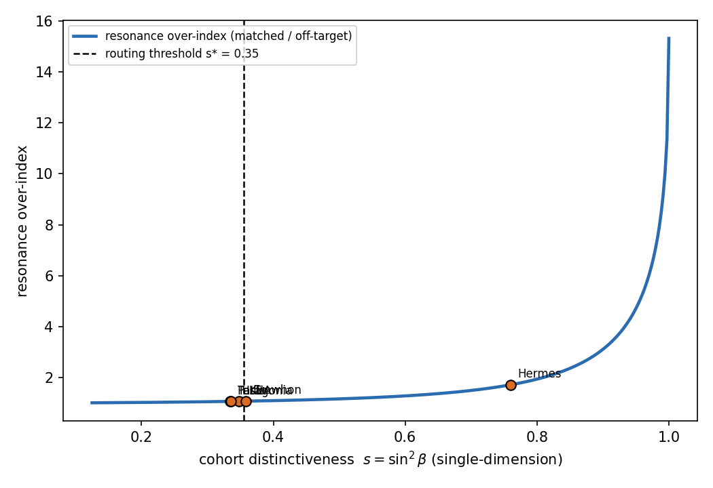

# Reaching a Perception: From Perceptual Cohort to Reachable Audience

Dmitry Zharnikov

ORCID: 0009-0000-6893-9231

DOI: [10.5281/zenodo.20765556](https://doi.org/10.5281/zenodo.20765556)

Working Paper v1.0.0 – June 2026

## Abstract

The correspondence principle of brand management prescribes acting on the highest-payoff dimension and cohort, but presumes a perceptual cohort is reachable without showing how. A cohort defined by perceptual proximity has no native media address, unlike the channels, cookies, and lookalike segments of conventional activation. This applied companion closes that gap. It demonstrates that being actionable decomposes into three measurable bridges, unified by a measurement-to-activation handoff contract: the instrument supplies the target and the cost of reaching it; the manager runs the campaign. The first bridge emits a signal strong on the dimension a cohort is sensitive to and lets self-selection route it, requiring no address. Formalized on a degraded broadcast channel, the self-selection sharpness equals the same off-axis variance the parent paper counts as a perception-metamerism loss: the targeting bug becomes a self-selection filter. The second traces reflections back to the surfaces where each perception was found. The third maps the cohort to addressable proxies and makes measurable the garbling loss of doing so. A calibrated simulation and two case studies show the contract selecting bridges by distinctiveness. Because the address-free bridge is where post-cookie activation is already moving, the reach answer is a structural tailwind, not a patch.

**Keywords**: brand activation, audience reachability, perceptual cohort, self-selection, broadcast channel, comparison of experiments, contextual advertising, post-cookie targeting

---

A manager runs a Spectral Brand Theory measurement, reads that a particular cohort cares disproportionately about the Ideological dimension and that there is payoff in moving it, and then asks the question every practitioner asks first: the cohort is defined as everyone whose perception cloud looks like a given shape, so who are they, where are they, and how is a message delivered to them? Conventional activation is addressable — a television slot at a time, a set of websites, a cookie or pixel or lookalike segment on the open web and in social platforms. A perceptual cohort has no native address. The directed-intervention rule of the correspondence principle [@zharnikov-2026au-correspondence-principle-brand] tells the manager which dimension and which cohort carry the largest observable payoff per unit cost, but is silent on delivery. It presumes a cohort is actionable without establishing that it is reachable. Left open, the gap reads to a sophisticated buyer as the measurement being unusable, which makes it an adoption blocker and not merely a theoretical loose end.

This paper closes the gap, and the central claim is that closing it is a structural advantage rather than a repair. Identity-addressable targeting is contracting under third-party-cookie deprecation, privacy regulation, and platform signal loss, and the industry is retreating toward contextual and cohort-level mechanisms — the Privacy Sandbox Topics interface is explicitly interest-cohort rather than individual [@google-privacy-sandbox-topics], and the persuasive value of personalization is itself hostage to the identity data being withdrawn — most persuasive precisely where the data are tied closely to the consumer's self-concept [@eisend-2026-personalization-meta-analysis], the least-available and most backlash-prone signal [@zhang-2026-perceived-surveillance-advertising]. The bridge developed here as the headline result needs no address at all and is exactly where post-cookie activation is already heading. Spectral measurement therefore does not depend on the identity-addressability the market is losing. We lead with that tailwind because it reframes the objection: properly answered, the reach question becomes a reason to adopt.

The argument keeps the metrology posture of the parent work. The instrument is an observational science of what a brand is and how it is read, not a piloting discipline; in the astronomer-and-navigator image, it supplies coordinates and the cost of the journey, and the manager flies. Reach is the delivery of an action to the observers whose perceptions constitute a target cohort. We do not buy media. What we demonstrate is that for a given target the instrument can emit a recommended bridge and its quantified cost, and that one of the three bridges is entailed by the theory's own machinery rather than borrowed from ad-tech. Three results follow. We supply a handoff-contract formalism that, for a target dimension and cohort, returns the recommended bridge and its cost. We demonstrate that a signal emitted strong on a dimension over-indexes on the dimension-sensitive cohort, with magnitude equal to the cohort's off-axis perceptual distinctiveness — the quantity that is a mis-targeting loss in the parent paper, read forward as a self-selection filter. And we make measurable the decision loss of reaching a perceptual cohort through an addressable proxy as a Blackwell garbling, identifying the minimal-loss proxy. Throughout, the individual observer spectral profile is the primitive and a cohort is a derived cluster of observers in that space.

## Related Work

The contribution sits between an activation literature that assumes addressable audiences and an information-economics tradition that models how types reveal themselves, and is best located by what each leaves open. Where the personalized-advertising meta-analysis measures personalization lift against a generic-ad baseline [@yeo-2025-personalized-advertising-meta-analysis], we price the address-free self-selection route against the addressable one, because the decisive counterfactual in the post-cookie regime is not personalized-versus-generic but addressed-versus-self-selected. Where the contextual-without-identity line keys relevance to content features [@haglund-2024-ai-contextual-advertising; @ye-2026-ad-gazer-contextual], we key delivery to the pre-measured observer spectral profile and predict the response magnitude from it, which is strictly more precise wherever the perceptual cohort is identified because content is at best a proxy for the perception an observer completes. And where the broadcast-channel formalism defines receiver channel quality physically [@cover-1972-broadcast-channels], we define it as the projection of the brand signal onto the observer's perceptual sensitivity, turning a degraded broadcast channel into a self-selection filter.

***Addressability and its retreat.*** Conventional reach rests on converting an audience into addressable units — slots, sites, cookies, and lookalike segments — and the recent literature documents the erosion of that base under privacy regulation and platform signal loss. The evidence on address-based personalization is two-edged in a way that sharpens rather than weakens the case: an advertising-venue meta-analysis finds its average persuasive lift modest and context-dependent [@yeo-2025-personalized-advertising-meta-analysis], while the largest meta-analysis of personalized marketing communication finds personalization can be strongly persuasive but most so precisely when the data are tied closely to the consumer's self-concept [@eisend-2026-personalization-meta-analysis] — that is, exactly the identity-rich signal that privacy enforcement is withdrawing, and the signal whose use most provokes perceived surveillance and its documented backlash [@zhang-2026-perceived-surveillance-advertising]. The platform response moves toward interest-cohort signals rather than individual identifiers [@google-privacy-sandbox-topics]. The erosion is not merely prospective: a quasi-experimental estimate following Apple's App Tracking Transparency measures the value of offsite cross-site tracking data to advertisers and finds it materially positive — precisely the addressable signal that privacy enforcement is removing [@wernerfelt-2025-offsite-tracking-value]. This literature frames reach as a quantity that is becoming scarcer and more expensive; it does not ask whether an audience can be acted on without an address at all, which is the question this paper answers.

***Contextual targeting without identity.*** The closest active line replaces personal identifiers with content features. Contextual advertising delivers relevant messaging by reading the content surrounding an impression rather than the identity of the viewer [@haglund-2024-ai-contextual-advertising]. The state of the art sharpens this with theory-informed machine learning: the AdGazer model improves contextual placement by predicting, from the surrounding content, the visual attention an ad in that context will draw, and allocates placements accordingly [@ye-2026-ad-gazer-contextual]. AdGazer is the strongest form of the content-feature approach because it does not merely match topical relevance but models a behavioral response — attention — yet the response it predicts is keyed to the *ad-context pair*: which placement, in which content, captures gaze. The unit of analysis is the impression-in-context, and identity is dispensed with by reading the page rather than the person. The mechanism developed here keys on the pre-measured observer instead: it predicts which *observer* responds from that observer's spectral-sensitivity profile, and predicts the *magnitude* of the response — the resonance over-index, equal to the cohort's distinctiveness — rather than the attention a placement attracts. The two differ in their primitive, not in their feature set: AdGazer's primitive is the content an observer is exposed to, ours is the perception the observer completes, of which content is at best a proxy. Where the perceptual cohort is identified, perception-routing is therefore strictly more precise than content-contextual placement, and a placebo on non-sensitive dimensions separates resonance from any content-context confound. We differentiate the two mechanistically rather than treat them as substitutes or rank them on a shared feature table.

***Self-selection and screening.*** That a costly or targeted signal can sort types without the sender knowing the type is the central result of the signaling and screening tradition: a job-market signal separates worker types [@spence-1973-job-market-signaling], an insurance menu makes types self-select [@rothschild-1976-equilibrium-competitive-insurance], and in marketing the coupon is the canonical self-selection device, sorting price-sensitive from insensitive buyers [@narasimhan-1984-price-discrimination-coupons; @shaffer-1995-competitive-coupon-targeting]. The broadcast-a-dimension bridge is the perceptual analogue: a dimension-strong message is a separating signal whose cost is attention rather than price, and the responsive cohort sorts itself into reception. What the present paper adds is a delivery-channel formalization and a magnitude prediction tied to a measurable perceptual quantity.

***The broadcast channel.*** The delivery substrate is formally a broadcast channel: one sender, many receivers of differing channel quality, a single transmitted signal decoded differently by each [@cover-1972-broadcast-channels]. No marketing application of the broadcast-channel formalism to perceptual targeting exists, and the gap is itself an opening. We import the degraded-channel structure with an explicit mapping in which the sender is the brand, the receivers are observer spectral profiles, the per-receiver channel quality is the projection of the signal onto the observer's sensitivity vector, and the achievable separation corresponds to a resonance bandwidth. The valuation of the resulting reach choice is a comparison of experiments: targeting through an addressable proxy is a garbling of targeting on the perceptual cohort, weakly less valuable for the decision [@blackwell-1953-equivalent-comparisons; @cover-2006-elements-information-theory], which is the same ordering the parent paper applies to brand-equity aggregation [@zharnikov-2026au-correspondence-principle-brand].

## The Measurement-to-Activation Handoff Contract

The objection assumes a single route to action — convert the cohort's perceptual identity into a list of reachable individuals — and finds it impossible. The reframing is that being actionable decomposes into three bridges from perception space to delivery, which differ precisely in how much perceptual identity must be converted into a physical address before one can act, and that the instrument can price each.

***The contract and its decision rule.*** For a target dimension and cohort, the handoff contract returns two objects: the recommended bridge mechanism, and its quantified cost. The recommendation is the argmin, over the three bridges, of the sum of targeting loss and delivery cost, each term defined below. A dimension-distinct cohort — one whose off-axis perceptual distinctiveness exceeds a threshold — routes to broadcast-a-dimension, at a cost equal to the predicted spill to non-resonant observers. A cohort whose reflections cluster on a few live surfaces routes to provenance-as-address, at a cost equal to the coverage bias of those surfaces. Otherwise the cohort routes to the minimal-loss addressable proxy, at a cost equal to the proxy-join loss. The contract states explicitly that the media buy and campaign execution are the management layer's responsibility: the instrument supplies the target and the cost of each bridge, not the flight. The reach-and-frequency planning that consumes that target — scheduling impressions across time and channels to hit an effective-frequency goal — is the established province of the media-planning tradition [@naik-1998-planning-media-schedules], and the handoff contract hands off to it rather than displacing it: the instrument fixes *whom to reach and at what bridge cost*, and the planner allocates the schedule. This is metrology completing its task rather than declining it; answering that delivery is not the instrument's problem would be a dodge, whereas returning a bridge and its measured cost is the instrument doing its job.

***Why this dissolves the blocker.*** The three bridges are not competing options of which one must be chosen once and for all; they are a fidelity-and-cost toolkit, parallel to the reflection-tier ladder that runs from public-artifact proxies up to a consented respondent panel. A practitioner picks a bridge, or blends them, according to how much addressing loss is tolerable against how much spill can be paid for. Only the third bridge requires an address, and even that one is a measurable, lossy projection the instrument characterizes. The apparent adoption blocker therefore converts into a measurement deliverable. We state the contract as a specification rather than a heuristic precisely so that the cost terms are auditable: each is a quantity the instrument estimates, not a judgment the analyst supplies.

**Broadcast a Dimension: Self-Selection by Spectral Resonance**

The first and most theory-native bridge requires no address. We develop it as the headline because it is entailed by the same metamerism machinery the parent paper treats as a source of error.

***Resonance, not addressing.*** A brand signal is, in the spectral model, a composite of up to eight wavelength-beams corresponding to the dimensions, and observers differ in their spectral sensitivity — their profile weights the dimensions differently. A signal emitted strong on the dimension a cohort is sensitive to is salient for that cohort and metameric-to-null for observers insensitive to that dimension, who receive it as an indistinct or ignorable signal. The wavelength does not find the cohort; it selects which observers resonate, and the cohort tunes itself in.^[Resonance here is a spectral, signal-matching mechanism — a signal aligned with an observer's dimensional sensitivity, by analogy to physical resonance — and is distinct from the relational *brand resonance* at the top of Keller's customer-based brand-equity pyramid [@keller-2001-building-customerbased-brand], which denotes the depth of a consumer's loyalty, attachment, and active engagement with a brand. The two share a term, not a mechanism: Keller's resonance is an end-state of the consumer-brand relationship, whereas resonance here is a delivery mechanism that routes a signal to whoever is already sensitive to its dimension.] One need not know the cohort's address: broadcasting on the dimension and letting perception route the signal substitutes self-selection for addressing. The mechanism is a chemical-assay analogy made literal — rather than separate the analyte first, one adds a reagent only the analyte reacts to. Two precisions keep the model honest. Reception is graded, not binary: salience is monotone in the projection of the emitted signal onto the observer's sensitivity vector, so selectivity is governed by how dimension-distinct the cohort is, and a broadly shared sensitivity yields spill rather than separation. And the economics differ from radio: advertising broadcast pays per impression regardless of whether the receiver resonates, so the spill to non-resonant observers is this bridge's real and only cost, unlike a free one-shot transmission.

***The bug becomes a filter.*** Perception-metamerism — one signal inducing divergent perceptions across cohorts that share an aggregate summary — is a mis-targeting loss in the parent account, where its magnitude is the off-axis perceptual variance the aggregate score cannot act on [@zharnikov-2026-spectral-metamerism-brand-perception-projection; @zharnikov-2026au-correspondence-principle-brand]. Broadcast-a-dimension weaponizes the identical phenomenon. The signal is deliberately metameric-to-null for off-target cohorts and salient for the target, so the same quantity that is a loss under push-targeting becomes the self-selection sharpness under broadcast-targeting. We state the resulting prediction as a proposition.

*Proposition 1 (resonance over-index).* Let a dimension-strong creative emit a signal vector concentrated on dimension d, and let a dimension-neutral control emit a signal of equal total energy spread across dimensions. For observer $i$ with sensitivity vector $w_i$, salience is monotone increasing in the inner product of the signal with $w_i$. Then the dimension-strong creative over-indexes on the dimension-$d$-sensitive cohort relative to the control, and the magnitude of the over-index is increasing in the cohort's off-axis perceptual distinctiveness — the same off-axis variance, written $\sin^2\beta$ in the parent toy model, that is the perception-metamerism loss. In the degraded-broadcast-channel reading, the observer's channel quality is the absolute inner product of signal and sensitivity, and the resonance bandwidth over which separation is achievable is set by that distinctiveness.

The proposition is falsifiable. A dimension-strong creative that does not over-index on the dimension-sensitive cohort, relative to a dimension-neutral control, in a category satisfying the scope conditions below — an over-index confidence interval that includes zero — would refute the mechanism.

## A Minimal Broadcast-Channel Model

We make the resonance claim precise in the smallest model that carries it, and calibrate it against the observed distribution of perceptual distinctiveness in the reflection corpus.

***The two-dimensional, two-type model.*** Let the perceptual space be two-dimensional and let there be two observer types, one with sensitivity peaked on dimension 1 and one peaked on dimension 2, present in known proportions. The brand emits one of three signals: strong on dimension 1, strong on dimension 2, or neutral. An observer's channel quality is the absolute inner product of the emitted signal vector with the observer's sensitivity vector, and salience is a monotone function of that quality, following the degraded-broadcast-channel structure [@cover-1972-broadcast-channels]. The angle $\beta$ between the two types' sensitivity vectors indexes the cohort's distinctiveness: at $\beta$ near zero the types are perceptually indistinguishable and any signal reaches both, while as $\beta$ grows the dimension-1 signal increasingly reaches only the dimension-1 type. Direct computation gives the over-index of the dimension-strong signal on its matched type, relative to the neutral control, as a monotone increasing function of $\sin^2\beta$, recovering the parent paper's loss term as this filter's selectivity. The decision loss of reaching the cohort through a coarser instrument is the Blackwell garbling on the posterior over cohort membership, developed in the next section.

***The loss surface.*** The bridge choice between broadcast-a-dimension and an addressable proxy depends on two quantities: the cohort's distinctiveness $\sin^2\beta$, which sets how sharply self-selection separates the target, and the spill cost per non-resonant impression, which prices the broadcast route. We price spill linearly in impressions delivered to non-resonant observers; a convex spill cost only raises the relative attractiveness of routes (a) and (c), recomputing the bridge ordering without changing its form. Figure 1 plots the resulting loss surface from the calibrated model: for each distinctiveness and spill cost, it shows which bridge minimizes total loss and by how much. The broadcast route dominates in the high-distinctiveness, low-spill-cost region, the proxy route dominates in the low-distinctiveness, high-spill-cost region, and a frontier separates them. The companion computation script ([`code/broadcast_channel_loss_surface.py`](https://github.com/spectralbranding/sbt-papers/blob/main/reaching-a-perception/code/broadcast_channel_loss_surface.py)) reproduces the surface from a fixed seed.

**Figure 1.** Total-loss surface over cohort distinctiveness ($\sin^2\beta$) and per-impression spill cost. The shaded frontier marks where the broadcast-a-dimension bridge and the minimal-loss-proxy bridge incur equal total loss; the broadcast bridge dominates above and to the left, where the cohort is distinct and spill is cheap. Calibrated to the distinctiveness distribution of a reflection-based perception corpus; reproduced by [`code/broadcast_channel_loss_surface.py`](https://github.com/spectralbranding/sbt-papers/blob/main/reaching-a-perception/code/broadcast_channel_loss_surface.py). The figure file is [`figures/figure1_loss_surface.png`](https://github.com/spectralbranding/sbt-papers/blob/main/reaching-a-perception/figures/figure1_loss_surface.png).

## Perception-to-Proxy Join and Its Quantified Loss

The third bridge is the rigorous fallback for cohorts that are not dimension-distinct enough to self-select and not surface-clustered enough to trace. It is the only bridge that needs an address, and its contribution is to make the reach choice a measured comparison rather than a default to addressability.

***The join as a garbling.*** Targeting a perceptual cohort $C$ through an addressable proxy $P$ — a distribution of platform, geography, register, recency, or panel demographics read off the cohort — is a statistical mapping from perception space to proxy space. That mapping is a Blackwell garbling of the perceptual experiment: the proxy is a stochastic function of cohort membership, hence the proxy experiment is weakly less valuable than the perceptual experiment for the targeting decision [@blackwell-1953-equivalent-comparisons; @cover-2006-elements-information-theory]. The framing complements rather than contradicts the targeting-value economics tradition, which establishes that the ability to target advertising carries real and quantifiable value [@iyer-2005-targeting-advertising]: that value is exactly what an addressable proxy partially recovers, and the garbling loss $L(P)$ measures how much of it the proxy leaves on the table relative to targeting the perceptual cohort directly. We state the consequence as a proposition.

*Proposition 2 (proxy-join loss ordering).* The expected decision loss of targeting cohort $C$ through proxy $P$, written $L(P)$, is non-negative, and is ordered by the informativeness of $P$ about cohort membership: a more informative proxy incurs weakly less loss. The minimal-loss proxy $P^\star$ is the one maximizing the mutual information between cohort membership and the proxy, and $L(P^\star)$ is the smallest achievable loss within the addressable-proxy class. When $L(P^\star)$ exceeds the predicted spill cost of broadcast-a-dimension, the handoff contract routes to broadcast instead.

The ordering is what makes reach a measured quantity. The instrument does not advise using proxies; it reports that reaching $C$ through proxy $P$ costs $L(P)$ in expected payoff and that $P^\star$ minimizes it, and it compares that minimum against the broadcast route's spill. The proposition also implies its own falsifier: observing a proxy strictly outperform targeting on the true perceptual cohort at equal budget, outside differences in measurement cost, would contradict the garbling ordering, which forbids it on information alone.

***Estimating the loss.*** $L(P)$ is estimated from the mutual information between cohort membership and addressable proxy features stored alongside the eight-dimensional vector, together with the decision-loss gap that information implies under the manager's payoff. A high $L(P^\star)$ — a cohort that is perceptually distinct but addressably indistinguishable, because its addressable features are orthogonal to the perceptual split — is itself an informative output: it tells the manager that no proxy will do and that the broadcast route is forced. Section *Empirical Strategy* specifies the estimator and its identification threats.

## Provenance as Address

The second bridge sits between the other two in the amount of inference it requires, and is the cheapest to operationalize because the data already exists in the reflection schema.

***Reflections carry their surfaces.*** A reflection-based perception corpus records each perception as a reflection carrying provenance — the source surface, the platform, the geography, the language, and a content date — alongside the perceptual reading [@zharnikov-2026as-prism-structured-measurement]. A perceptual cohort is a cluster of reflections, and each reflection traces back to a discoverable surface where that perception was found: the forum, the review site, the publication, the geography, the time window. The cohort of reflections is therefore a list of surfaces on which the perception is currently being expressed, and those surfaces are re-reachable. Because reflections carry a content date, the surfaces are recency-aware: one reaches the cohort where it is active now rather than where a stale panel last placed it. This is a special case of the proxy join in which the proxy features are natively addressable — a URL, a forum, a geography — rather than statistically inferred, which removes the join inference but not the coverage question.

***The coverage cost and a fidelity inversion.*** Provenance shows where a perception was observed, which is a biased sample of where the cohort can be reached; the silent majority of the cohort may not surface on any harvested channel. The handoff contract therefore reports a reachable-fraction estimate rather than claiming full coverage, and treats the coverage bias as this bridge's cost term. A structural inversion sharpens the trade-off: public-artifact proxy reflections carry rich surface provenance but low perceptual fidelity, whereas consented respondent-panel reflections carry high perceptual fidelity but consent-bounded provenance — one can re-reach the panel, but the panel is not the market. Provenance-as-address is thus strongest exactly where perceptual fidelity is weakest, so addressability and perceptual fidelity trade off across the reflection tiers, and the contract makes that trade-off explicit rather than hiding it.

## Scope Conditions

The broadcast-a-dimension bridge is the paper's most distinctive claim and also its most scope-bound; we state the conditions under which it applies and outside which the contract routes elsewhere.

***Positive conditions.*** Two conditions must hold for self-selection to do the work. First, the perceptual dimensions must be approximately separable for the target, so that a dimension-strong signal is identifiable as such rather than read as a blend; highly correlated dimensions collapse into a single category-image axis on which no single dimension can be emitted cleanly. Second, the cohort's dimensional distinctiveness $\sin^2\beta$ must exceed a critical threshold, near .35 in the calibrated model, so that resonance is sharper than spill; below it the cohort is not perceptually distinct enough to separate and the broadcast degenerates toward undifferentiated reach.

***Negative conditions.*** The bridge does not apply, and the contract routes to provenance-as-address or to the minimal-loss proxy, under three conditions: highly correlated dimensions, which collapse the category image and remove the separable axis; high-involvement deliberate processing, which swamps the low-effort resonance the mechanism relies on; and regulatory prohibition on dimension-strong messaging, which removes the instrument's freedom to emit on the chosen dimension. These are stated as boundaries, not as failures of the contract: the contract's value is precisely that it detects when broadcast will not separate and substitutes a bridge that will.

**Boundary: Reaching a Perception versus Forming One**

The three bridges answer activation given a perception cloud — routing a signal to whoever already resonates — and we scope the paper to that mode deliberately, because a second and distinct activation mode moves the cloud itself.

***Two activation modes.*** Forming or maintaining a perception is a different operation from reaching one. Demand and category creation, in which an audience has not yet formed a sensitivity to act on, and belief maintenance, in which an intensively advertised brand's salience decays when spend stops, both move the perception cloud rather than route a signal across a fixed one. In the resonance picture this is re-tuning the receivers rather than choosing a frequency for fixed tuning. The instrument handles it as a dynamics problem: the campaign is a forcing function on the cloud, the instrument measures the resulting trajectory and the relaxation when forcing stops, and a differentiated brand sits at a lower-energy stable point that needs less forcing to hold. This connects to the established evidence that advertising-built availability decays without refreshment — the carryover and adstock-decay tradition [@gijsenberg-2011-adstock-advertising-decisions; @broadbent-1979-one-way-tv-advertisements], the mental-availability-decay finding of the distinctiveness school [@sharp-2010-how-brands-grow; @romaniuk-2016-how-brands-grow], the mere-exposure micro-mechanism [@zajonc-1968-mere-exposure], the long-and-short-term split in advertising effect [@binet-2013-long-short-of-it], the advertising-elasticity magnitudes that scale the forcing [@sethuraman-2011-advertising-elasticities-meta], the category-creation literature [@durand-2017-market-categories], and the documented drift of brand perception over time [@luffarelli-2023-brand-personality-cbbe-time].

***Why it is deferred.*** A full treatment of the formation mode — the campaign as forcing function, the cloud's relaxation-rate measurement, and the recovery of a perception-decay time constant from time-sliced reflections after a spend pulse — is developed in a spectral-dynamics formation companion [@zharnikov-2026aw-forming-a-perception] and is not pursued here. Folding both routing and formation into one paper would staple two ideas together; we therefore scope this paper to activation given a perception and mark formation as a boundary condition, so the reach story is not mistaken for a claim that all activation is selection.

## Empirical Strategy

The propositions are stated as theory with sketched mechanism. The primary confirmatory design is a field experiment that does not yet exist, and no field findings are asserted; in its place we execute the methods-companion fallback — a calibrated broadcast-channel simulation and two case studies — and report it in the next section as a demonstration of the handoff contract in operation, not as a test of the mechanism. The distinction is central: a calibrated simulation can show that the contract behaves as specified and that its quantities are computable, but only the field design can confirm that observers resonate as predicted.

***Primary design: a two-cell field experiment.*** Proposition 1 is tested at the individual level by a two-cell experiment that delivers a dimension-strong versus a dimension-neutral creative through contextual slots and links each exposure to a pre-measured individual perceptual profile elicited by an open instrument. The design targets at least 1,500 complete profiles per cell across at least four product categories spanning the involvement and distinctiveness range, so that the predicted over-index can be estimated within and across the scope conditions. The pre-measured profile is the identifying feature: the prediction is keyed to the observer's sensitivity vector and predicts an over-index magnitude equal to the cohort's distinctiveness, which separates the resonance mechanism from any content-contextual confound.

***Fallback and proxy-loss estimation.*** Where a field partnership is infeasible — as it is here — a calibrated broadcast-channel simulation paired with two case studies demonstrates the handoff contract in operation, which is acceptable at the target venue for a methods companion; that demonstration is the *Calibrated Demonstration* section below. Because the reflection-based perception instrument is work-in-progress and not public, the distinctiveness distribution is calibrated to an observed public proxy — the five canonical brand profiles that anchor the corpus — rather than to a proprietary reflection corpus, which also makes the calibration fully reproducible. The proxy-join loss of Proposition 2 would be estimated separately by computing the mutual information between perceptual-cohort membership and addressable proxy features, identifying the minimal-loss proxy and bounding the contribution of unobservable features; that estimation needs cohort-linked proxy data and is left to the confirmatory study.

***Robustness.*** Three checks guard the resonance claim. A threshold-reception specification tests the prediction under binary rather than graded reception, under which the over-index sharpens rather than reverses, and a placebo on non-sensitive dimensions plus a dimension-neutral falsification creative separate resonance from content-context. A dimension-count robustness check compares the two-dimensional model against the full eight, and alternative perceptual bases — a principal-components decomposition of the same items, and a Likert versus semantic-differential elicitation — pre-empt the objection that the result depends on a proprietary instrument. A bounding exercise on unobservables addresses omitted-variable and endogenous-content threats to the proxy-join loss.

## A Calibrated Demonstration

This section executes the methods-companion fallback. It is a calibrated simulation and two case studies, not a field test: it shows that the handoff contract computes, behaves as specified, and selects different bridges as cohort geometry changes. Everything below is reproduced from a fixed seed by the companion script, and no claim of field evidence is made.

***Calibration to an observed public proxy.*** The cohort-distinctiveness parameter is calibrated to an observed, fully public proxy rather than to the work-in-progress reflection instrument: the five canonical brand profiles that anchor the corpus. For a single-dimension broadcast, the relevant distinctiveness is how sharply a cohort's off-generic sensitivity concentrates on one broadcastable axis, so we take, for each profile, the share of its centered profile's energy carried by its dominant dimension — a measure that removes the common positive-level "halo" every brand shares and isolates the shape that a single emitted dimension can separate. This profile concentration is a reproducible public *proxy* for the model's $\sin^2\beta$ — the angle between the target cohort's and the off-target cohort's sensitivity vectors — rather than a direct measurement of that angle; it stands in for it because both index how single-dimension-distinct a cohort is. The five anchors yield distinctiveness values of .760 (the most distinctive), .358, .348, .336, and .335, with mean .427 (*SD* = .186); a method-of-moments fit gives a Beta(2.59, 3.47) population. The routing threshold is inherited from the loss surface, $s^\star = 1 - L_0 / c = .355$, so the simulation and Figure 1 are calibrated consistently. The small calibration base — five public anchors, all established and distinctive brands — is a stated limitation, not a population estimate, and the population it induces deliberately over-represents distinctiveness.

***The simulated over-index.*** Drawing 10,000 cohorts from the calibrated Beta and passing each through the minimal two-type broadcast-channel model produces a resonance over-index — the matched cohort's salience for a dimension-strong creative relative to the off-target cohort's — of 1.202, with a bootstrap 95% confidence interval of [1.196, 1.207] that lies entirely above 1, and a large standardized matched-versus-off-target salience gap (Cohen's *d* = 1.61). The over-index rises monotonically with distinctiveness across the whole population (Figure 2), reproducing the qualitative shape Proposition 1 predicts. A majority of the calibrated cohorts, .626 (95% CI [.617, .636]), clear the broadcast routing threshold and are therefore reachable address-free; the mean per-impression spill cost is .177 (95% CI [.176, .178]). These are properties of the calibrated model, not measured response magnitudes; the confirmatory over-index belongs to the field design.

**Figure 2.** Resonance over-index versus cohort distinctiveness, with the five public anchors marked. The over-index (matched-cohort salience relative to off-target salience for a dimension-strong creative) increases monotonically in distinctiveness $s = \sin^2\beta$; the dashed line marks the routing threshold $s^\star = .355$. Reproduced by [`code/broadcast_channel_me2.py`](https://github.com/spectralbranding/sbt-papers/blob/main/reaching-a-perception/code/broadcast_channel_me2.py) at seed 20260619; the figure file is [`figures/figure2_me2_overindex.png`](https://github.com/spectralbranding/sbt-papers/blob/main/reaching-a-perception/figures/figure2_me2_overindex.png).

***Two case studies: the contract selecting bridges.*** The same model instantiates the handoff contract on two contrasting campaigns, summarized in Table 1. These are *reaching* decisions for brands in two campaign settings, given the perception each currently holds — distinct from the *formation* dynamics of those same settings (holding a mature perception against decay, or building a new one), which the Boundary section defers to the spectral-dynamics companion. In a maintenance campaign for an established, distinctive brand — the most distinctive anchor, distinctiveness .760 — the contract recommends broadcast-a-dimension at a per-impression spill cost of .074, which dominates the minimal-loss proxy's loss of .200; the resonance over-index at that distinctiveness is 1.724. The established brand is reachable with no address at all. In a category-creation campaign for an undifferentiated new entrant whose perception is not yet formed — a flat profile with distinctiveness at the $s = 1/8 = .125$ floor — the contract declines broadcast, because the predicted spill of .271 exceeds the proxy loss of .200, and routes instead to the minimal-loss proxy or to provenance-as-address; the resonance over-index is 1.017, essentially no separation. The contrast is the point: the contract returns the address-free bridge exactly when the cohort is distinct enough to self-select, and substitutes an addressed bridge when it is not. The category-creation case also marks the boundary of this paper — moving the new entrant off the distinctiveness floor is *forming* a perception, not *reaching* one, and that forcing-function dynamics is the subject of the spectral-dynamics companion.

**Table 1.** Calibrated Demonstration — Monte-Carlo Summary and Case-Study Bridge Selection.

| Quantity | Value | 95% CI |
|---|---|---|
| Observed distinctiveness, mean (5 public anchors) | .427 | — |
| Routing threshold $s^\star$ | .355 | — |
| Resonance over-index (10,000 cohorts) | 1.202 | [1.196, 1.207] |
| Matched-vs-off-target salience gap (Cohen's *d*) | 1.61 | — |
| Cohorts clearing the broadcast threshold | .626 | [.617, .636] |
| Mean per-impression spill cost | .177 | [.176, .178] |
| Maintenance case (distinctiveness .760) | broadcast-a-dimension, cost .074, over-index 1.724 | — |
| Category-creation case (distinctiveness .125) | minimal-loss proxy / provenance, cost .200, over-index 1.017 | — |

*Notes*: All values are reproduced from `code/broadcast_channel_me2.py` at seed 20260619. CIs are 2,000-resample bootstrap percentile intervals over the 10,000 simulated cohorts. The figures are properties of a model calibrated to public brand-profile anchors, not measured field response; they demonstrate the contract's operation rather than confirm the resonance mechanism, which is the role of the primary field design. The reported magnitudes hold under the documented illustrative constants; the robust claim is the monotone increase of the over-index in distinctiveness, not the specific values.

## Limitations

***Replicability of the instrument.*** The reflection-based perception measurement architecture invites a replicability objection: a result that depends on a non-public instrument is hard to reproduce. We pre-empt it by shipping an open elicitation script with the paper and by including the alternative-instrument robustness check, so that the resonance prediction can be reproduced under a non-proprietary perceptual basis. The calibrated demonstration is deliberately anchored on the public canonical profiles rather than the work-in-progress instrument for the same reason — its inputs and outputs are fully reproducible from the shipped script. The prediction is a statement about observer sensitivity, not about the particular instrument that measures it.

***What the demonstration does and does not establish.*** The *Calibrated Demonstration* is a simulation calibrated to five public anchors, not a field result, and it is honest about three boundaries. Its population over-represents distinctiveness because the anchors are all established, distinctive brands, so the .626 broadcast-reachable fraction is a property of that calibration, not a market estimate. The reception link and the spill and proxy-loss constants are documented illustrative values, not fits to response data. And the over-index it reports is the model's, so it can show the contract behaves as specified but cannot confirm that observers resonate as predicted; that confirmation is the role of the primary field design, which remains the paper's confirmatory spine.

***Causal threats.*** Three threats are addressed rather than deferred to the management layer. Endogenous content creation — the surfaces that generate reflections may already be selected by the resonant cohort — is reported as a coverage-bias limitation of provenance-as-address, with the contract returning a reachable-fraction estimate. Omitted-variable bias in the proxy mapping is bounded by the robustness exercise on unobservables. Measurement-error attenuation in the profiles biases the estimated over-index toward zero, making the test conservative. None of these is a reason to withhold the bridge; each is a quantity the empirical design measures.

## Discussion

***What the contribution is and is not.*** The contribution is not a media-buying method and not a new targeting product. It is a measurement deliverable: a specification that, for a perceptual target, returns a recommended bridge and its measured cost, and a demonstration that one bridge is entailed by the theory's own metamerism result. We do not claim that perceptual routing is always cheaper than addressable targeting; we claim that the choice between them can be made on measured quantities — distinctiveness, spill, coverage bias, and proxy-join loss — rather than on the assumption that activation requires an address. The handoff contract is the operational step between knowing which cohort and dimension to move and realizing an outcome, and it keeps the division of labor the parent paper draws: the instrument measures the target and the cost of reaching it, and the manager runs the campaign.

***Reach as a tailwind.*** The strongest adoption argument is that the address-free bridge is aligned with where activation is already heading. As identity signals decline and the industry moves toward contextual and cohort mechanisms, a method that routes by perception rather than by identifier does not depend on the addressability that is disappearing. The objection that a perceptual cohort cannot be reached, answered in full, becomes a reason to prefer perceptual measurement: it is robust to the death of the cookie because it never required the cookie.

***Future research.*** Three directions follow: estimating the proxy-join loss across real categories to map where each bridge dominates; a measurement-cost model that turns the bridge choice into a threshold on distinctiveness and spill; and the deferred spectral-dynamics treatment of the formation mode, in which a campaign is a forcing function and the instrument recovers the cloud's decay time constant from time-sliced reflections.

## Conclusion

A perceptual cohort has no native address and does not need one. The instrument supplies three bridges from perception to delivery — broadcast the dimension the cohort responds to and let self-selection route the signal, follow the provenance the reflections already carry, or map the cohort to the minimal-loss addressable proxy and report what that map costs — unified by a handoff contract that returns the recommended bridge and its measured cost. The headline result reads the parent paper's mis-targeting bug forward as a self-selection filter: the same off-axis perceptual distinctiveness that is a loss under push-targeting is the sharpness of self-selection under broadcast-targeting. Because the bridge that needs no address is the one the post-cookie industry is already adopting, the reach answer is a structural tailwind. Measuring where a cohort sits in perception space, and what it costs to reach it, is the instrument's job; flying the campaign there remains the manager's.

## Data and Code Availability

Two companion computation scripts, both deterministic, dependency-light (NumPy and Matplotlib only), and requiring no network or credentials, reproduce every reported figure. [`code/broadcast_channel_loss_surface.py`](https://github.com/spectralbranding/sbt-papers/blob/main/reaching-a-perception/code/broadcast_channel_loss_surface.py) reproduces the loss surface of *A Minimal Broadcast-Channel Model* (Figure 1, [`figures/figure1_loss_surface.png`](https://github.com/spectralbranding/sbt-papers/blob/main/reaching-a-perception/figures/figure1_loss_surface.png)). [`code/broadcast_channel_me2.py`](https://github.com/spectralbranding/sbt-papers/blob/main/reaching-a-perception/code/broadcast_channel_me2.py) reproduces the *Calibrated Demonstration* — the calibration to the five canonical public brand profiles, the Monte-Carlo over-index and its bootstrap intervals, the two case studies (Table 1), and Figure 2 ([`figures/figure2_me2_overindex.png`](https://github.com/spectralbranding/sbt-papers/blob/main/reaching-a-perception/figures/figure2_me2_overindex.png) and the results table [`output/tables/me2_results.csv`](https://github.com/spectralbranding/sbt-papers/blob/main/reaching-a-perception/output/tables/me2_results.csv)) — from seed 20260619 and the run command in its docstring. The [`code/README.md`](https://github.com/spectralbranding/sbt-papers/blob/main/reaching-a-perception/code/README.md) documents both models, the calibration anchors, and the expected output. The full paper source, scripts, figures, and machine-readable specification (`paper.yaml`) are openly available in the public repository at [https://github.com/spectralbranding/sbt-papers/tree/main/reaching-a-perception](https://github.com/spectralbranding/sbt-papers/tree/main/reaching-a-perception), and the same archive is carried by a permanent Zenodo deposit with one-command reproduction (concept DOI [https://doi.org/10.5281/zenodo.20765556](https://doi.org/10.5281/zenodo.20765556); version 1.0.0 DOI [https://doi.org/10.5281/zenodo.20765557](https://doi.org/10.5281/zenodo.20765557)).

## Acknowledgments

AI assistants (Claude Opus 4.8, Gemini 2.5 Pro, Grok 4.3) were used for initial literature search, for software development — implementing and running the two companion computation scripts that reproduce the paper's reported loss surface and calibrated demonstration — and for editorial refinement; all theoretical claims, propositions, and interpretations are the author's sole responsibility. The companion scripts are the fixed-seed broadcast-channel loss surface (`code/broadcast_channel_loss_surface.py`) and the calibrated Monte-Carlo demonstration (`code/broadcast_channel_me2.py`).

CRediT contributions: Dmitry Zharnikov — conceptualization, methodology, software, formal analysis, investigation, writing (original draft), writing (review and editing).

## References

::: {#refs}
:::
